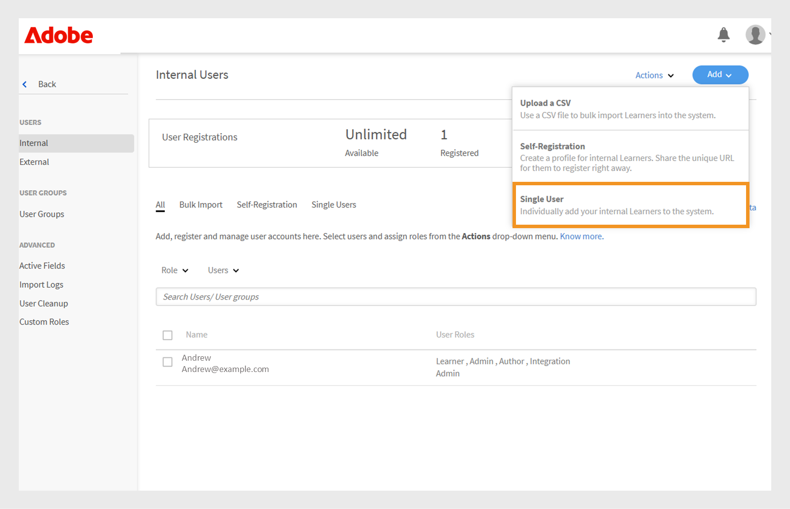
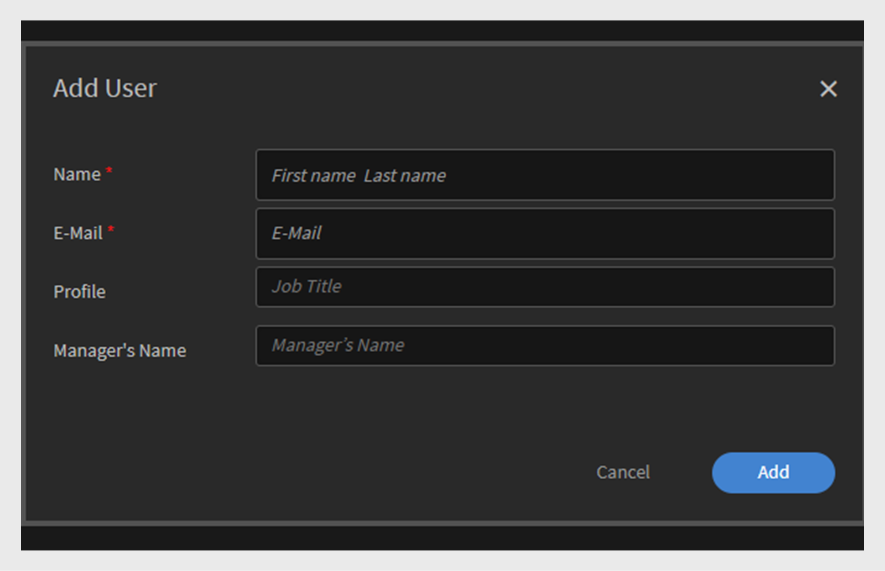

# Lägg till användare i Adobe Learning Manager

I Adobe Learning Manager är användare elever som använder utbildningsplattformen. Det finns två typer av användare: interna och externa användare.

Interna användare är anställda eller teammedlemmar i din organisation.

Externa användare är elever utanför företaget, t.ex. kunder, partner, leverantörer eller kunder, som har tillgång till ditt utbildningsinnehåll.

Med Adobe Learning Manager (ALM) kan administratörer registrera och hantera både interna och externa användare på olika sätt, bland annat manuellt, via CSV-överföring, självregistrering och systemintegreringar.

## Interna användare

Interna användare i Adobe Learning Manager är anställda eller teammedlemmar i organisationen. Du kan lägga till dem manuellt, överföra dem i grupp eller importera dem via systemintegreringar. När du har lagt till användarna kan du ordna dem i grupper, tilldela kurser och övervaka deras utbildningsframsteg.

Användare i Adobe Learning Manager kan ta på sig olika ansvarsområden och hantera olika uppgifter baserat på sina tilldelade roller. Varje roll, inklusive administratör, författare, instruktör och integrationsadministratör, erbjuder en uppsättning specifika funktioner som är anpassade för att stödja användarens ansvar inom plattformen.

### Metoder för att lägga till interna användare

Administratörer kan lägga till interna användare på följande sätt:

* **Lägg till en enskild användare**: Lägg till en användare i taget manuellt.
* **Egenregistreringsprofil**: Tillåt elever att registrera sig som elever i Adobe Learning Manager med hjälp av en registreringslänk som skapats av administratören.
* **Massöverföring via CSV**: Överför en CSV-fil om du vill lägga till flera användare samtidigt.

### Lägg till en intern användare manuellt

Administratörer kan lägga till en användare manuellt genom att ange namn, e-postadress, unik identifierare och chefens namn. Den unika identifieraren i Adobe Learning Manager är en obligatorisk identifierare som administratörer tilldelar när de skapar en användare. Den måste vara unik för varje användare och fungera som en enhetlig referens i hela systemet.

>[!INFO]
>
>Titta på den här ALM Academy-utbildningen om du vill veta mer om hur du lägger till enskilda användare i Adobe Learning Manager.  

Lägga till en enskild användare i Adobe Learning Manager:

1. Logga in som administratör.
2. Välj **Användare** och sedan **Intern**.
3. Välj **Lägg till** och välj sedan **En användare**.

   
   _Administratörsgränssnitt som visar alternativet att lägga till en enskild intern användare manuellt_
4. Vid uppmaningen **Lägg till användare** anger du användarens **namn**, **e-postadress** och **profil** (befattning).

   
   _Fält där du kan ange namn, e-postadress, unik identifierare och profil för en ny användare_
5. Sök efter användarens chef och välj namnet i listan över chefer.
6. Välj **Lägg till**.
Användaren får ett välkomstmeddelande med en inloggnings-URL för åtkomst.

### Tillåt självregistrering för interna användare

Självregistrering är en självbetjäningsprocess där användare kan gå till en registrerings-URL, ange sina uppgifter och automatiskt registrera sig på plattformen. Den här metoden minskar det administrativa arbetet genom att användare kan registrera sig via den angivna URL:en.

Så här skapar du en URL för självregistrering för en användare:

1. Logga in som administratör.
2. Välj **Användare** och sedan **Intern**.
3. Välj **Lägg till** och välj sedan **Självregistrering.**

   
   _Listruta för val av alternativ för självregistrering_
4. Skriv profilen i fältet **Profilnamn** (användarens befattning) i meddelandet **Lägg till självregistreringsprofil**.
5. Välj användarens chef genom att söka efter chefen i fältet **Chefens namn**. Chefen som har tilldelats självregistreringsprofilen bör vara en registrerad användare i Adobe Learning Manager.

   
   _Inmatningsfält för inställning av profilnamnet och tilldelning av en chef till en självregistreringsprofil_
6. Välj en bild med alternativet **Lägg till bild**. Bilden kommer att vara synlig för eleverna i profilavsnittet.
7. Välj **Spara**.

   I Adobe Learning Manager skapas en användarprofil och en URL för självregistrering genereras, som kan delas med användarna för att slutföra registreringen.

   
   _Bekräftelsemeddelande om att en självregistrerings-URL har skapats_
8. Dela webbadressen med de användare som vill registrera sig själva.

   URL:en kan delas med flera användare för registrering. Du kan till exempel generera en URL för profilen **Säljare** och dela den med säljassociationsteamet så att de kan registrera sig själva.

_Länk till självregistrering öppnar en registreringssida_

### Visa listan över URL:er för självregistrering

Så här visar du listan över URL:er för självregistrering:

1. Välj **Användare** och sedan **Intern**.
2. Välj **Självregistrering**.

   Administratörer kan se listan över URL:er för självregistrering.

_Listvy som visar befintliga URL:er för självregistrering som är tillgängliga för interna användare_

### Överför interna användare i grupp

Administratörer kan lägga till flera användare samtidigt genom att överföra en CSV-fil med användarinformation som namn, e-postadress och chefens namn. Funktionen för gruppöverföring sparar tid och arbete jämfört med att lägga till användare enskilt.

>[!INFO]
>
>Titta på den här ALM Academy-utbildningen och lär dig lägga till användare i grupp via en CSV-fil.   

Lägga till flera användare:

1. Logga in som administratör.
2. Välj **Användare** och sedan **Intern**.
3. Välj **Lägg till** och välj sedan **Överför en CSV**.

   
   _Alternativ för att överföra en CSV-fil för massimport av användare_

4. Förbered en CSV-fil med följande fält:

   * Medarbetarens namn*
   * Medarbetarens e-postadress*
   * Medarbetarens profil/beteckning
   * Chefens ID/e-postadress\
     (*) Obligatoriska fält.

5. Innan du lägger till en chefs e-post-ID för en medarbetare ska du kontrollera att chefen redan ingår som anställd i CSV-filen. Se t.ex. medarbetaren Howard Walters i bilden nedan.

   
   _Bild av CSV-exempelfil med alla fält_

6. Överför CSV-filen och mappa datafälten därefter.

   
   _CSV-mappningsgränssnitt för att justera kalkylbladskolumner mot systemfält_
7. Välj **Spara** för att importera användarna.

   Ett bekräftelsemeddelande visas när överföringen har slutförts.

   
   _Bilden visar statusen för CSV-överföringen som lyckad_

>[!NOTE]
>
>Underhåll en CSV-huvudfil för alla tillägg och borttagningar. Det går inte att uppdatera och överföra en befintlig CSV-fil på nytt.

När du överför en CSV-fil för att lägga till användare är det viktigt att inkludera all relaterad information i rätt ordning. Om du tilldelar en chefs e-post-ID till en anställd måste chefens information visas tidigare i CSV-filen. Detta säkerställer att systemet känner igen chefen som en befintlig användare innan de länkas till sina teammedlemmar. Säg att Howard Walters är chef. Lägg till all användarinformation i CSV-filen innan du listar anställda som rapporterar till honom.

### Hantera användarregistrering

När du har lagt till användare enskilt eller i grupp måste du registrera dem för att aktivera deras konton. Det gör att användare kan komma åt Adobe Learning Manager och börja använda plattformen.

Så här registrerar du användarna:

1. Välj **Användare** på administratörens startsida.
2. Markera kryssrutorna bredvid namnen på de användare du vill registrera.
3. Välj **Åtgärder** och välj sedan **Registrera**.

   
   _Registrera för att aktivera valda användare i Adobe Learning Manager_

4. Välj **Ja** för att aktivera användaren.

Ett bekräftelsemeddelande skickas till användaren. Användaren måste markera länken i e-postmeddelandet för att aktivera sitt konto och börja använda Adobe Learning Manager.

## Externa användare

Med Adobe Learning Manager kan du lägga till användare utanför företaget, t.ex. kunder, partner, leverantörer eller kunder, för att komma åt utbildningsinnehållet. När de har lagts till kan du gruppera dem, tilldela kurser och spåra deras utbildningsförlopp.

Du kan lägga till externa användare i Adobe Learning Manager på följande sätt:

* Skapa en extern registreringsprofil
* Aktivera registreringsprofilen
* Dela registreringslänken med externa användare
* Pausa eller återuppta profilen vid behov

Adobe Learning Manager stöder registrering av sådana användare via externa registreringsprofiler.

Gör så här om du vill skapa en extern användare:

1. Logga in som administratör.
2. Välj **Användare** och sedan **Externa**.
3. Välj **Lägg till** för att skapa en registrering för en extern användare.
4. Ange följande i dialogrutan **Lägg till extern registreringsprofil**:

   * **Profilnamn:** Skriv namnet.
   * **Chefens e-postadress:** Skriv chefens e-postadress.
   * **Platsbegränsning:** Ställ in det maximala antalet tillåtna registreringar.
   * **Förfallodatum:** Definiera det sista datumet för nya registreringar. När den har upphört fungerar inte länken för ny användarregistrering.

   
   _Dialogruta för att ange profilnamn, chefens e-postadress, platsgräns och utgångsdatum_

5. Välj en bild med alternativet **Lägg till bild**. Bilden kommer att vara synlig för eleverna i profilavsnittet.
6. Välj avsnittet **Avancerade inställningar** för att expandera det och ange den information som krävs:
   * **Inloggningskrav:** Skriv in antalet dagar. Om elever förblir inaktiva under hela perioden tas de automatiskt bort.
   * **Tillåtna domäner:** Skriv en kommaseparerad lista över tillåtna e-postdomäner. Endast användare med e-postadresser från godkända domäner kan registrera sig.
   * **E-postverifiering krävs:** Välj detta för att tvinga fram e-postverifiering under registreringen.

   
   _Panelen Avancerade inställningar för att ange inloggningskrav, tillåtna domäner och e-postverifiering_

7. Välj **Spara**.

En registrerings-URL genereras.

### Aktivera den externa profilen

Så här aktiverar du den externa profilen:

1. Leta reda på den nya profilen i listan över externa profiler.
2. Välj växlingsknappen **Status** för att aktivera den.

Administratören kan dela denna URL med den externa partnern så att denne kan registrera sig och logga in på Adobe Learning Manager med den.

_Välj växlingsknappen för att aktivera den externa profilen_

### Kopiera och dela registrerings-URL för en extern profil

Registrerings-URL:en för en extern profil kan kopieras från avsnittet **Externa användare**.

_Kopiera en extern profils registrerings-URL_

### Viktiga skillnader mellan interna och externa användarregistreringar

Det finns några skillnader mellan interna och externa registreringar:

| Interna användare | Externa användare |
|---|---|
| Kan logga in med autentiseringsuppgifter för Adobe ID eller SSO. | Kan logga in med valfritt e-post-ID. |
| Spelifiering är tillgänglig. | Spelifiering är tillgänglig. Administratören måste aktivera spelifiering för externa elever i inställningarna för [spelifiering](https://experienceleague.adobe.com/en/docs/learning-manager/using/admin/gamification). |

### Pausa extern registreringsprofil

I Adobe Learning Manager kan administratörer hantera externa användarregistreringar genom att pausa sina profiler. Detta är användbart när du tillfälligt vill pausa nya användares anslutning med hjälp av en specifik extern registreringsprofil. Om du pausar en profil kan användare som har fått inbjudningar men ännu inte har registrerat sig inte slutföra registreringsprocessen. Åtgärden påverkar inte användare som redan har slutfört sin registrering.

Så här pausar du en extern profil:

1. Välj **Åtgärder** i det övre högra hörnet på sidan **Externa användare**.
2. Välj **Pausa** för att pausa den externa registreringsprofilen.

Detta blockerar nya registreringar för användare som inte har accepterat sina inbjudningar. Observera att denna åtgärd endast påverkar användare som ännu inte har slutfört sin registrering.

_Alternativ för att pausa en befintlig extern registreringsprofil från menyn Åtgärder_

### Återuppta extern registreringsprofil

Om en extern profil tidigare har pausats kan administratörer återuppta den så att nya användare kan slutföra registreringen. Detta återaktiverar registreringsprocessen för användare som blev inbjudna men inte slutförde registreringen.

Så här återupptar du en extern användare:

1. Välj **Åtgärder** i det övre högra hörnet på sidan.
2. Välj **Återuppta** för att återuppta en pausad partners åtkomst.

_Alternativ för att återuppta en tidigare pausad extern registreringsprofil_

### Övervaka användningen av externa säten

Administratörer kan spåra antalet användare som har lagts till i varje extern profil i Adobe Learning.

Så här kontrollerar du använda platser:

1. Välj **Platser som används** i listan över externa profiler.

Du kan se antalet elever som har lagts till i partnerorganisationen och om eleverna är aktiva.

## Hantera användare

Administratörer kan redigera användarinformation, ta bort användare, tilldela roller och ta bort roller. Detta hjälper till att se till att alla användare har rätt åtkomst och rätt åtgärder.

>[!INFO]
>
>Titta på den här ALM Academy-utbildningen och lär dig tilldela och ta bort roller, skicka ett välkomstmeddelande via e-post och ta bort och rensa användare. [![knapp]](https://content.adobelearningmanageracademy.com/app/learner?accountId=98632#/course/7555586) 

### Redigera en användare

Använd alternativet **Redigera användare** i Adobe Learning Manager om du vill uppdatera en användares profilinformation, t.ex. namn, e-postadress, unik identifierare, profil och chefens namn. Administratörer kan göra dessa ändringar för att säkerställa att användardata förblir korrekta och uppdaterade.

Så här redigerar du en användare:

1. Välj **Användare** på administratörens startsida.
2. Välj användaren som du vill redigera i listan **Användare**.
3. Välj **Redigera profil**.

   
   _Alternativet Ta bort användare på menyn Åtgärder om du vill ta bort en användare från plattformen_

4. Välj **Ja** för att ta bort användaren.

Ett bekräftelsemeddelande visas när användaren har tagits bort.

## Tilldela en användare en roll

Användarroller i Adobe Learning Manager definierar vilka åtgärder varje person kan utföra i systemet. Varje roll levereras med specifika behörigheter baserat på användarens ansvarsområden.

Adobe Learning Manager har stöd för följande användarroller:

* **Administratör**: Hanterar användare och användargrupper, tilldelar roller och konfigurerar systemövergripande inställningar som datakällor, tillåtna domäner och visningsalternativ. Administratörer har också ansvar för att skapa och organisera utbildningsinnehåll, spåra elevframsteg, generera rapporter och konfigurera integreringar med externa system.
* **Författare**: Skapar och hanterar innehåll, inklusive moduler och kurser.
* **Chef**: övervakar teamets utbildningsaktiviteter, nominerar teammedlemmar till kurser, godkänner förfrågningar och ger feedback.
* **Integreringsadministratör**: Hanterar systemintegreringar och dataanslutningar mellan ALM och externa plattformar.
* **Anpassade roller**: Administratörer kan skapa anpassade roller för att ge användare anpassad åtkomst utifrån deras ansvarsområden. Mer information om de anpassade rollerna finns i den här [artikeln](/help/migrated/administrators/feature-summary/custom-role.md).

Så här tilldelar du roller till användare:

1. Välj **Användare** på administratörens startsida.
2. Välj den användare som du vill tilldela en roll.
3. Välj **Åtgärder** i det övre högra hörnet.
4. Välj **Tilldela roll**.
5. Välj önskad roll.

   
   _Menyalternativen Tilldela roll visar tillgängliga roller för den valda användaren_

6. Välj **Ja** i bekräftelsedialogrutan.

## Ta bort en roll

När du tar bort en användarroll återkallas de behörigheter som beviljats av den rollen.

Så här tar du bort roller från användare:

1. Välj **Användare** på administratörens startsida.
2. Markera de användare vars roller du vill ta bort.
3. Välj **Åtgärder** och välj sedan **Ta bort roll**.

   
   _Alternativ för att ta bort tilldelade roller från en användare på menyn Åtgärder_

4. Välj **Ja** i bekräftelsedialogrutan.

