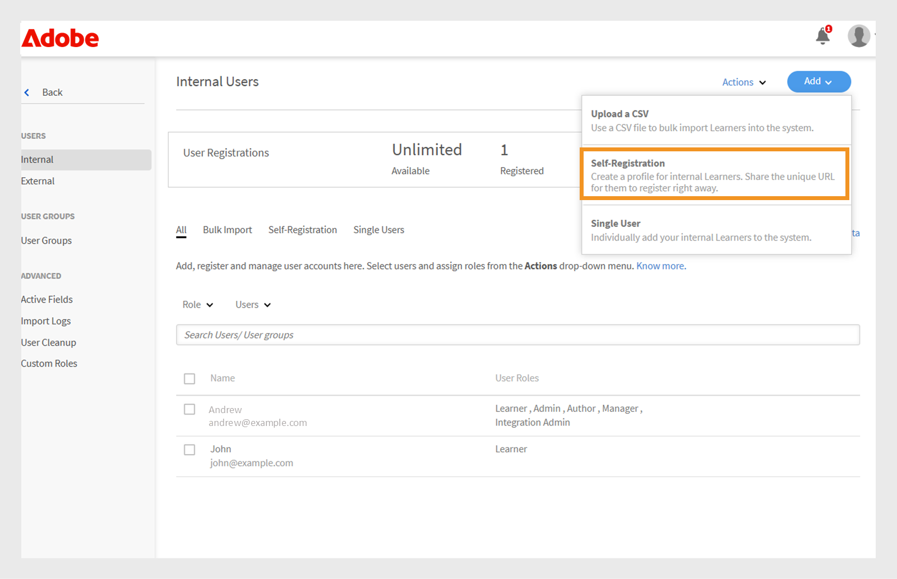
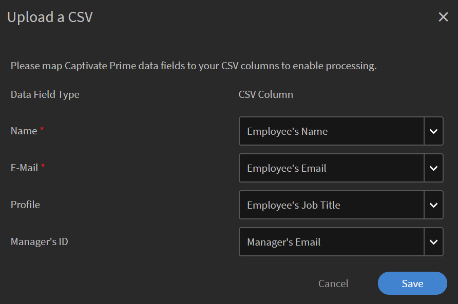
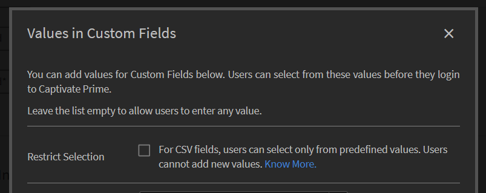

# Lägg till användare i Adobe Learning Manager

I Adobe Learning Manager är användare elever som använder utbildningsplattformen. Det finns två typer av användare: interna och externa användare.

Interna användare är anställda eller teammedlemmar i din organisation.

Externa användare är elever utanför företaget, t.ex. kunder, partner, leverantörer eller kunder, som har tillgång till ditt utbildningsinnehåll.

Med Adobe Learning Manager (ALM) kan administratörer registrera och hantera både interna och externa användare på olika sätt, bland annat manuellt, via CSV-överföring, självregistrering och systemintegreringar.

## Interna användare

Interna användare i Adobe Learning Manager är anställda eller teammedlemmar i organisationen. Du kan lägga till dem manuellt, överföra dem i grupp eller importera dem via systemintegreringar. När du har lagt till användarna kan du ordna dem i grupper, tilldela kurser och övervaka deras utbildningsframsteg.

Användare i Adobe Learning Manager kan ta på sig olika ansvarsområden och hantera olika uppgifter baserat på sina tilldelade roller. Varje roll, inklusive administratör, författare, instruktör och integrationsadministratör, erbjuder en uppsättning specifika funktioner som är anpassade för att stödja användarens ansvar inom plattformen.

Adobe Learning Manager har stöd för följande användarroller:

* **Administratör**: Hanterar användare och användargrupper, tilldelar roller och konfigurerar systemövergripande inställningar som datakällor, tillåtna domäner och visningsalternativ. Administratörer har också ansvar för att skapa och organisera utbildningsinnehåll, spåra elevframsteg, generera rapporter och konfigurera integreringar med externa system.
* **Författare**: Skapar och hanterar innehåll, inklusive moduler och kurser.
* **Chef**: övervakar teamets utbildningsaktiviteter, nominerar teammedlemmar till kurser, godkänner förfrågningar och ger feedback.
* **Integreringsadministratör**: Hanterar systemintegreringar och dataanslutningar mellan ALM och externa plattformar.
* **Anpassade roller**: Administratörer kan skapa anpassade roller för att ge användare anpassad åtkomst utifrån deras ansvarsområden. Läs den här artikeln om du vill ha mer information om anpassade roller.

### Metoder för att lägga till interna användare

Administratörer kan lägga till interna användare på följande sätt:

* **Lägg till en enskild användare**: Lägg till en användare i taget manuellt.
* **Egenregistreringsprofil**: Tillåt elever att registrera sig som elever i Adobe Learning Manager med hjälp av en registreringslänk som skapats av administratören.
* **Massöverföring via CSV**: Överför en CSV-fil om du vill lägga till flera användare samtidigt.

### Lägg till en intern användare manuellt

Administratörer kan lägga till enskilda användare manuellt genom att ange namn, e-post-ID, unik identifierare och chefens namn. Den unika identifieraren i Adobe Learning Manager är en obligatorisk identifierare som administratörer tilldelar när de skapar en användare. Den måste vara unik för varje användare och fungera som en enhetlig referens i hela systemet.

>[!INFO]
>
>Titta på den här ALM Academy-utbildningen om du vill veta mer om hur du lägger till enskilda användare i Adobe Learning Manager.  

Lägga till en enskild användare i Adobe Learning Manager:

1. Logga in som administratör.
2. Välj **Användare** och sedan **Intern**.
3. Välj **Lägg till** och välj sedan **En användare**.

   
   _Administratörsgränssnitt som visar alternativet att lägga till en enskild intern användare manuellt_
4. Vid uppmaningen **Lägg till användare** anger du användarens **namn**, **e-postadress** och **profil** (befattning).

   
   _Fält där du kan ange namn, e-postadress, unik identifierare och profil för en ny användare_
5. Sök efter användarens chef och välj namnet i listan över chefer.
6. Välj **Lägg till**.
Användaren får ett välkomstmeddelande med en inloggnings-URL för åtkomst.

### Tillåt självregistrering för interna användare

Självregistrering är en självbetjäningsprocess där användare kan gå till en registrerings-URL, ange sina uppgifter och automatiskt registrera sig på plattformen. Den här metoden minskar det administrativa arbetet genom att användare kan registrera sig via den angivna URL:en.

Så här skapar du en URL för självregistrering för en användare:

1. Logga in som administratör.
2. Välj **Användare** och sedan **Intern**.
3. Välj **Lägg till** i det övre högra hörnet och välj sedan **Självregistrering.**

   
   _Listruta för val av alternativ för självregistrering_
4. Skriv profilen i fältet **Profilnamn** (användarens befattning) i meddelandet **Lägg till självregistreringsprofil**.
5. Välj användarens chef genom att söka efter chefen i fältet **Chefens namn**. Chefen som har tilldelats självregistreringsprofilen bör vara en registrerad användare i Adobe Learning Manager.

   
   _Inmatningsfält för att ange jobbtitel och tilldela en chef en självregistreringsprofil_
6. Välj en bild med alternativet **Lägg till bild**. Bilden kommer att vara synlig för eleverna i profilavsnittet.
7. Välj **Spara**.

   I Adobe Learning Manager skapas en användarprofil och en URL för självregistrering genereras, som kan delas med användarna för att slutföra registreringen.

   
   _Bekräftelsemeddelande om att en självregistrerings-URL har skapats_
8. Dela webbadressen med de användare som vill registrera sig själva.

   URL:en kan delas med flera användare för registrering. Du kan till exempel generera en URL för profilen **Säljare** och dela den med säljassociationsteamet så att de kan registrera sig själva.

_Länk till självregistrering öppnar en registreringssida_

### Visa listan över URL:er för självregistrering

Så här visar du listan över URL:er för självregistrering:

1. Välj **Användare** och sedan **Intern**.
2. Välj **Självregistrering**.

   Administratörer kan se listan över URL:er för självregistrering.

_Listvy som visar befintliga URL:er för självregistrering som är tillgängliga för interna användare_

### Överför interna användare i grupp

Med Adobe Learning Manager kan administratörer lägga till flera användare samtidigt genom att överföra en CSV-fil med användarinformation, inklusive namn, e-postadress och chefens namn. Funktionen för gruppöverföring sparar tid och arbete jämfört med att lägga till användare enskilt.

>[!INFO]
>
>Titta på den här ALM Academy-utbildningen och lär dig lägga till användare i grupp via en CSV-fil.   

Lägga till flera användare:

1. Logga in som administratör.
2. Välj **Användare** och sedan **Intern**.
3. Välj **Lägg till** i det övre högra hörnet och välj **Överför en CSV**.

   
   _Alternativ för att överföra en CSV-fil för massimport av användare_

4. Förbered en CSV-fil med följande fält:

   * Medarbetarens namn*
   * Medarbetarens e-postadress*
   * Medarbetarens profil/beteckning
   * Chefens ID/e-postadress\
     (*) Obligatoriska fält.

5. Innan du lägger till en chefs e-post-ID för en medarbetare ska du kontrollera att chefen redan ingår som anställd i CSV-filen. Se t.ex. medarbetaren Howard Walters i bilden nedan.

   
   _Bild av CSV-exempelfil med alla fält_

6. Överför CSV-filen och mappa datafälten därefter.

   
   _CSV-mappningsgränssnitt för att justera kalkylbladskolumner mot systemfält_
7. Välj **Spara** för att importera användarna.

   Ett bekräftelsemeddelande visas när överföringen har slutförts.

   
   _Bilden visar statusen för CSV-överföringen som lyckad_

>[!NOTE]
>
>Underhåll en CSV-huvudfil för alla tillägg och borttagningar. Det går inte att uppdatera och överföra en befintlig CSV-fil på nytt.

När du överför en CSV-fil för att lägga till användare är det viktigt att inkludera all relaterad information i rätt ordning. Om du tilldelar en chefs e-post-ID till en anställd måste chefens information visas tidigare i CSV-filen. Detta säkerställer att systemet känner igen chefen som en befintlig användare innan de länkas till sina teammedlemmar. Säg att Howard Walters är chef. Lägg till all användarinformation i CSV-filen innan du listar anställda som rapporterar till honom.

### Hantera användarregistrering

När du har lagt till användare enskilt eller i grupp måste du registrera dem för att aktivera deras konton. Det gör att användare kan komma åt Adobe Learning Manager och börja använda plattformen.

Så här registrerar du användarna:

1. Välj **Användare** på administratörens startsida.
2. Markera kryssrutorna bredvid namnen på de användare du vill registrera.
3. Välj **Åtgärder** och välj sedan **Registrera**.

   
   _Registrera för att aktivera valda användare i Adobe Learning Manager_

4. Välj **Ja** för att aktivera användaren.

Ett bekräftelsemeddelande skickas till användaren. Användaren måste markera länken i e-postmeddelandet för att aktivera sitt konto och börja använda Adobe Learning Manager.

## Externa användare

Med Adobe Learning Manager kan du lägga till användare utanför företaget, t.ex. kunder, partner, leverantörer eller kunder, för att komma åt utbildningsinnehållet. När de har lagts till kan du gruppera dem, tilldela kurser och spåra deras utbildningsförlopp.

Du kan lägga till externa användare i Adobe Learning Manager på följande sätt:

* Skapa en extern registreringsprofil
* Aktivera registreringsprofilen
* Dela registreringslänken med externa användare
* Pausa eller återuppta profilen vid behov

Adobe Learning Manager stöder registrering av sådana användare via externa registreringsprofiler.

Gör så här om du vill skapa en extern användare:

1. Logga in som administratör.
2. Välj **Användare** och sedan **Externa**.
3. I det övre högra hörnet väljer du **Lägg till** för att skapa en registrering för en extern användare.
4. Ange följande i dialogrutan **Lägg till extern registreringsprofil**:

   * **Profilnamn:** Ange namnet på den partnerorganisation som vill få åtkomst till Adobe Learning Manager
   * **Chefens e-postadress:** Skriv chefens e-postadress till användaren.
   * **Platsbegränsning:** Ställ in det maximala antalet tillåtna registreringar.
   * **Förfallodatum:** Definiera det sista datumet för nya registreringar. När den har upphört fungerar inte länken för ny användarregistrering.

   
   _Dialogruta för att ange profilnamn, chefens e-postadress, platsgräns och utgångsdatum_

5. Välj en bild med alternativet **Lägg till bild**. Bilden kommer att vara synlig för eleverna i profilavsnittet.
6. Välj avsnittet **Avancerade inställningar** för att expandera det och ange den information som krävs:
   * **Inloggningskrav:** Skriv in antalet dagar. Om elever förblir inaktiva under hela perioden tas de automatiskt bort.
   * **Tillåtna domäner:** Skriv en kommaseparerad lista över tillåtna e-postdomäner. Endast användare med e-postadresser från godkända domäner kan registrera sig.
   * **E-postverifiering krävs:** Välj detta för att tvinga fram e-postverifiering under registreringen.

   
   _Panelen Avancerade inställningar för att ange inloggningskrav, tillåtna domäner och e-postverifiering_

7. Välj **Spara**.

En registrerings-URL genereras.

### Aktivera den externa profilen

Så här aktiverar du den externa profilen:

1. Leta reda på den nya profilen i listan över externa profiler.

2. Välj växlingsknappen **Status** för att aktivera den.

Administratören kan dela denna URL med den externa partnern så att denne kan registrera sig och logga in på Adobe Learning Manager med den.

_Välj växlingsknappen för att aktivera den externa profilen_

### Kopiera och dela registrerings-URL för en extern profil

Registrerings-URL:en för en extern profil kan kopieras från avsnittet **Externa användare**.

_Kopiera en extern profils registrerings-URL_

### Viktiga skillnader mellan interna och externa användarregistreringar

Det finns några skillnader mellan interna och externa registreringar:

| Interna användare | Externa användare |
|---|---|
| Kan logga in med autentiseringsuppgifter för Adobe ID eller SSO. | Kan logga in med valfritt e-post-ID. |
| Spelifiering är tillgänglig. | Spelifiering är tillgänglig. Administratören måste aktivera spelifiering för externa elever i inställningarna för [spelifiering](https://experienceleague.adobe.com/sv/docs/learning-manager/using/admin/gamification). |

### Pausa extern registreringsprofil

I Adobe Learning Manager kan administratörer hantera externa användarregistreringar genom att pausa sina profiler. Detta är användbart när du tillfälligt vill pausa nya användare från att ansluta med hjälp av en specifik extern användarprofil. Om du pausar en profil kan användare som har fått inbjudningar men ännu inte har registrerat sig inte slutföra registreringsprocessen. Åtgärden påverkar inte användare som redan har slutfört sin registrering.

Så här pausar du en extern profil:

1. Välj **Åtgärder** i det övre högra hörnet på sidan **Externa användare**.
2. Välj **Pausa** för att pausa den externa användarprofilen.

Detta blockerar registreringsprocessen för användare som ännu inte har accepterat sina inbjudningar. Observera att denna åtgärd endast påverkar användare som ännu inte har slutfört sin registrering.

_Alternativ för att pausa en befintlig extern användarprofil från menyn Åtgärder_

### Återuppta extern registreringsprofil

Om en extern profil tidigare har pausats kan administratörer återuppta den så att nya användare kan slutföra registreringen. Detta återaktiverar registreringsprocessen för användare som blev inbjudna men inte slutförde registreringen.

Så här återupptar du en extern användare:

1. Välj **Åtgärder** i det övre högra hörnet på sidan.
2. Välj **Återuppta** för att återuppta en pausad partners åtkomst.

_Alternativ för att återuppta en tidigare pausad extern användarprofil_

### Övervaka användningen av externa säten

Administratörer kan spåra antalet användare som har lagts till i varje extern profil i Adobe Learning.

Så här kontrollerar du använda platser:

1. Välj **Platser som används** i listan över externa profiler.

Du kan se antalet elever som har lagts till i partnerorganisationen och om eleverna är aktiva.

## Hantera användare

Administratörer kan redigera användarinformation, ta bort användare, tilldela roller och ta bort roller. Detta hjälper till att se till att alla användare har rätt åtkomst och rätt åtgärder.

>[!INFO]
>
>Titta på den här ALM Academy-utbildningen och lär dig tilldela och ta bort roller, skicka ett välkomstmeddelande via e-post och ta bort och rensa användare. [![knapp]](https://content.adobelearningmanageracademy.com/app/learner?accountId=98632#/course/7555586) 

### Redigera en användare

Använd alternativet **Redigera användare** i Adobe Learning Manager om du vill uppdatera en användares profilinformation, t.ex. namn, e-postadress, unik identifierare, profil och chefens namn. Administratörer kan göra dessa ändringar för att säkerställa att användardata förblir korrekta och uppdaterade.

Så här redigerar du en användare:

1. Välj **Användare** på administratörens startsida.
2. Välj användaren som du vill redigera i listan **Användare**.
3. Välj **Redigera profil**.

   
   _Alternativet Ta bort användare på menyn Åtgärder om du vill ta bort en användare från plattformen_

4. Välj **Ja** för att ta bort användaren.

Ett bekräftelsemeddelande visas när användaren har tagits bort.

## Tilldela en användare en roll

Användarroller i Adobe Learning Manager definierar vilka åtgärder varje person kan utföra i systemet. Varje roll levereras med specifika behörigheter baserat på användarens ansvarsområden.

Så här tilldelar du roller till användare:

1. Välj **Användare** på administratörens startsida.
2. Välj den användare som du vill tilldela en roll.
3. Välj **Åtgärder** i det övre högra hörnet.
4. Välj **Tilldela roll**.
5. Välj önskad roll.

   
   _Menyalternativen Tilldela roll visar tillgängliga roller för den valda användaren_

6. Välj **Ja** i bekräftelsedialogrutan.

## Ta bort en roll

När du tar bort en användarroll återkallas de behörigheter som beviljats av den rollen.

Så här tar du bort roller från användare:

1. Välj **Användare** på administratörens startsida.
2. Markera de användare vars roller du vill ta bort.
3. Välj **Åtgärder** och välj sedan **Ta bort roll**.

   
   _Alternativ för att ta bort tilldelade roller från en användare på menyn Åtgärder_

4. Välj **Ja** i bekräftelsedialogrutan.
<!--# Add users and create user groups

Learn how to add users or user groups in Learning Manager application.

<!---->

<!--## Overview {#overview}

In Adobe Learning Manager, you can assume the following roles:

* **Administrator:** An Administrator defines the training strategy for the organization. An Administrator can add learners, search required skills for learners, manage and assign courses, create learning plans, certifications, and learning programs, and manage reports for the entire organization.
* **Author:** Authors are Instructional Designers and content creators. An Author can add modules and courses to Learning Manager.
* **Manager:** A Manager manages the learning activities of a team. A Manager can nominate team members to take a course, approve requests from team members, and provide feedback on performance of their team members post-completion of training. Managers can also view reports for their team to track their performance.
* **Learner:** Learners can access courses, learning programs, and certifications assigned to them. Learners can also browse through all the available courses by using a catalog and enroll themselves for either courses, learning programs, or certifications.

As an Administrator, you can add users in three ways:

* Internal
* External
* User groups

## Add a single user {#addasingleuser}

Add internal learners to the Adobe Learning Manager using a single user option.

>[!INFO]
>
>In this training, you will learn how to add internal learners to the Adobe Learning Manager.    

If you're unable to launch the training, write to <almacademy@adobe.com>.

To add users,

1. Log into Adobe Learning Manager as an Administrator. 
1. On the home page, click **[!UICONTROL Add Users]**. On this page, you can add a single user or multiple users at a time using a CSV. You can also create a self-registration link for internal employees or create an external learner profile.
1. To add a single user, click **[!UICONTROL Add]** on the upper-right corner and choose the option **[!UICONTROL Single User]**.

1. To add a single user, click **[!UICONTROL Add]** on the upper-right corner and choose the option **Single User**.

   
   *Add a single internal user*

1. On the **[!UICONTROL Add User]** dialog, enter the details of the learner. For the field **[!UICONTROL Manager's Name]**, pick the name of an existing user in the system.

   
   *Add user dialog box*

1. To add the new user in Learning Manager, click **[!UICONTROL Add]**. After the user is added, the user receives a verification mail. The Learner then activates the account and starts using Learning Manager. This workflow is helpful if you need to add limited number of learners to your Learning Manager Account. But if you're planning to enroll all the employees of a large organization, you can add them in a singe attempt. For more information, see the next section.

## Add users in bulk {#addusersinbulk}

Typically, most organizations work with an HR Management System (HRMS), which maintains all employee records, such as, designation, location, date of joining, or employee hierarchy. You can export this data in a CSV format. To import a CSV, follow the steps below:

1. Click **[!UICONTROL Add]** on the upper-right corner, and choose the option **[!UICONTROL Upload a CSV]**.

   
   *Upload a CSV to add users in bulk*

1. The CSV that you upload consists of the fields, as shown below:

   
   *Structure of the CSV*

   You must maintain a master CSV and perform perform all additions and deletions on the master CSV. The master CSV contains the following fields:

   * name &#42;
   * email &#42;
   * profile
   * manager

   (&#42;) Required field.

1. After you click the option **[!UICONTROL Upload a CSV]**, the following dialog displays.

   
   *Upload a CSV dialog*

1. Choose the CSV or drag-and-drop the file. After you've chosen the file, map the data fields with the ones in the CSV file. Click the required drop-down and choose the right field.

   
   *Map fields in CSV*

1. To start importing the users, click **[!UICONTROL Save]**. You can see a confirmation message.

   
   *Confirmation message for successful upload of the CSV*

1. The new users are now added to your Adobe Learning Manager account. To select the new users, select the check-box next to the names so that everybody is selected. 

   
   *New users added*

>[!NOTE]
>
>For more information, see the FAQ, [Add users in bulk](../add-users-in-bulk.md).

>[!INFO]
>
>In this training, you will learn how to add users in bulk through a CSV.    

If you're unable to launch the training, write to <almacademy@adobe.com>.

## Register a user {#registerauser}

With the user selected, click **[!UICONTROL Actions]** on the upper-right corner and click **[!UICONTROL Register]**.

The selected users receive a Welcome email. If the learners have an existing Adobe ID, they can click this link. If they don't have an existing Adobe ID, they can go ahead and click the Welcome link to create an Adobe ID and link it to their Learning Manager account.

### Manage users

In this training, you will learn how to assign and remove roles, send a welcome email, and delete and purge users. 

If you're unable to launch the training, write to <almacademy@adobe.com>.

## Assign a role {#assignarole}

After adding learners to the Adobe Learning Manager account, if you want to change their roles, click Actions on the upper-right corner of the page. Choose the option **[!UICONTROL Assign Role]**. Here you can decide whether you want to give Author access or Admin access to the learner. After you have assigned a role, this learner has Author access to the account and can add modules and create courses. 

*Assign a role to a user*

## Remove a role {#removearole}

You can also remove Author or Admin access for the users. Select one or more learners, click **[!UICONTROL Actions]**, and select **[!UICONTROL Remove Role]**. Choose an option, for example, **[!UICONTROL Remove Author]**, and the author access gets revoked for this learner. 

>[!NOTE]
>
>You cannot manually assign a Manager role to someone in the system. They automatically get access to the Manager dashboard when one or more employees are added under them.

## Delete a user {#deleteauser}

To delete a user, click **[!UICONTROL Actions]**, and choose **[!UICONTROL Delete User]**. On the confirmation dialog, click **[!UICONTROL Yes]**, and the learner gets deleted.

*Confirmation message to delete a user*

## Edit a user {#editauser}

On the list of users, choose a user, and click the user. On the user details, click the **[!UICONTROL Edit]** ( ) button. On the **[!UICONTROL Edit User]** dialog, make the necessary edits and to save the changes, click **[!UICONTROL Save]**.

*Edit User dialog*

## Active fields

Active Fields in Adobe Learning Manager are customizable metadata fields used to store and manage user-specific information. These fields help define key attributes or characteristics associated with each user in the system.

### Manage user attributes

>[!INFO]
>
>In this training, you will learn how to add, customize, and configure Active Fields.    

If you're unable to launch the training, write to <almacademy@adobe.com>.

Adobe Learning Manager preserves the case sensitivity of the user attribute and its value. **For example**, the case sensitivity of a user attribute is 'location' and its value as 'PARIS' will be preserved and displayed in the same manner. In case of any issues, the Administrator can now edit the attribute name and values to correct any case sensitivity errors. 

The Administrator can do this by visiting **[!UICONTROL Admin app]** > **[!UICONTROL Users]** > **[!UICONTROL User groups]** and clicking on the group name.  

An Admin can add and update allowed attribute values for a learner through UI.

Types of active fields:

* Groupable: Learners would get grouped on the basis of the Values
* Reportable: Reporting user groups would be created based on the active fields
* Exportable: The fields will be seen in exported in user group report.

## Create a self-registration link {#createaselfregistrationlink}

You can also enable employees in your organization to register themselves as Learners to Adobe Learning Manager Account, without taking help from you as an administrator. The administrator can create a Self-Registration link and share with the employees, who can further register to Learning Manager using their Adobe credentials.

On the upper-right corner of the page, click **[!UICONTROL Add]**, and select **[!UICONTROL Self-Registration]**.

*Create link to self-register as learner*

The **[!UICONTROL Add Self-Registration Profile]** dialog appears. Give this profile a name. Then add the manager's name. It's important to know that the manager must already be registered learner in Learning Manager.

*Add profile for self-registration*

After you click **[!UICONTROL Save]**, a URL gets generated, which you can share with the learners, so that they can click the URL and self-register themselves.

## Enroll external learners {#enrollexternallearners}

In Adobe Learning Manager, you can also create Registration links for external partners or agencies with limited access to your account and provide them learning material.

There are a few differences between internal and external registrations.

<table>
 <tbody>
  <tr>
   <td>
    
<b>Internal users</b>
</td>
   <td>
    
<b>External users</b>
</td>
  </tr>
  <tr>
   <td>
    
Log in using Adobe ID or SSO credentials.
</td>
   <td>
    
Log in using any email ID.
</td>
  </tr>
  <tr>
   <td>
    
Gamification is available.
</td>
   <td>
    
Gamification is available. The admin must enable gamification for external learners in the Gamification settings.
</td>
  </tr>
  <tr>
   <td>
    
Learner hierarchies are available.
</td>
   <td>
    
Learner hierarchies are not available.
</td>
  </tr>
 </tbody>
</table>

To enroll external users, follow the steps below:

1. In the left navigation pane, click **[!UICONTROL External]**.

   
   
   *Enroll external users*

1. On the upper-right corner of the page, click **[!UICONTROL Add]**.

1. On the **Add External Registration Profile** dialog, add the following details:

   * The profile name of the partner organization.
   * The email address of the manager of the partner organization.
   * Seat limit for external enrollment for this partner.
   * Expiry date to set a deadline to stop allowing new registrations to this group. After the Expiry date, only the existing registered users can access this training.

   

   *Add External Registration Profile dialog*

   * In the **[!UICONTROL Advanced Settings]** section, enter the following:

     * **[!UICONTROL Login Requirement]:** Specify a value in days. Learners get deleted if they do not login for the above duration.
     * **[!UICONTROL Allowed Domains]:** A comma-separated list of whitelisted email domain names.
     * **[!UICONTROL Email Verification Required]:** Select this option to make email verification mandatory for a learner.

   

   *Enter the details in the Advanced Settings section* 

1. After you click **[!UICONTROL Save]**, you can see the following confirmation message. You must share the URL with your external partner.

   

## Enable an external profile {#enableanexternalprofile}

After an external profile has been created, you must enable its status. From the list of external profiles, choose the required profile, and toggle the status button.

*Enable an external profile*

This enables the External Enrollment link. A welcome email is automatically be sent to the partner. You can also copy the link and share with them by clicking the Copy URL icon (), or you can resend the welcome email to the partner organization by clicking the Mail icon ().

The partner manager can share the link with the employees who must take the training in PrLearning Managerime. When they click the link, they can self-enroll themselves after filling out some details to create their profile on Learning Manager. These users will not appear on the Learners tab along with the internal employees. You can see their names under the **[!UICONTROL External Learners]** tab.

## Pause an external profile {#pause}

After adding an external user group to Learning Manager, you can also pause the external users' registration process. When you pause, the external users' registration process is blocked. However, this process works only when the users haven't registered yet by accepting the invitation.

To pause the external user groups, choose a group or groups, click **[!UICONTROL Actions]** from the upper-right corner of the page, and click **[!UICONTROL Pause]**.

## Resume an external profile {#resumeanexternalprofile}

At any time, you can always revoke the paused state of an external partner and resume normal services. Click **[!UICONTROL Actions]** at the upper-right corner of the page and select **[!UICONTROL Resume]**.

The following states are applicable for external users:

* **Inactive state** - In this state, the external users' registration is expired. Administrators set the expiry date for the external users while adding them through the add user workflow.
* **Active state** - In this state, the external users can register to the Learning Manager application, and log in to the application.
* **Pause** - In this state, the registration process for external users is blocked. However, the existing users can continue to log in.

## Check used seats {#checkusedseats}

On the list of external profiles, click **[!UICONTROL Seats Used]**. You can view the number of learners in the partner organization who have been added.

*Check used seats*

## Delete a user {#Deleteauser-1}

Choose a user, and from the upper-right corner, click **[!UICONTROL Actions]** > **[!UICONTROL Delete User]**.

## Change profile {#changeprofile}

To move a user to another external profile, choose a user, from the upper-right corner, click **[!UICONTROL Actions]** > **[!UICONTROL Change Profile]**. From the list of profiles, choose a profile, and click **[!UICONTROL Change]**.

## Assign a role {#Assignarole-1}

Choose a user, and from the upper-right corner, click **[!UICONTROL Actions]** > **[!UICONTROL Assign Role]** > **Make `<role>`**. The user gets a new role.

## Remove a role {#Removearole-1}

Choose a user, and from the upper-right corner, click **[!UICONTROL Actions]** > **[!UICONTROL Remove Role]** > **Remove `<role>`**. The selected role gets removed from the list of roles that were assigned to the user.

>[!NOTE]
>
>Assigning a new role will not affect custom user groups. However, it will impact auto-generated user groups such as All Admins, All Authors, and similar role-based groups.

## Create user groups {#createusergroups}

A User Group is a set of users who are related to a category. User Groups help administrators to select learners in their organization based on their attributes, and then assign learning content to them. Also, these User Groups enable administrators to assign customized logos and catalogs to learners and show customized reports on their progress.

To access User Groups, on the left navigation pane, click **[!UICONTROL User Groups]**.

*Create user groups*

### Manage user groups

>[!INFO]
>
>In this training, you will learn how to create a user group by names, email IDs, and combining multiple auto-generated user groups.    

If you're unable to launch the training, write to <almacademy@adobe.com>.

There are two types of groups in Adobe Learning Manager, Custom and Auto-generated. When you add learners to your account, some groups are automatically created based on their common properties.

To see the automatically created groups, click the tab **[!UICONTROL Auto-generated]**.

*View Auto-generated groups*

You can see that there are different groups, like All Internal Users, All Managers, groups based on the Cost Center, based on the department, and based on the teams of the managers.

In addition to Auto-generated groups, you can create Custom groups. To add a new Custom Group, on the upper-right corner, click **[!UICONTROL Add]**. 

1. Enter the name, and description for the group.
1. Enter user name or profile in search-as-you-type field and select from the drop-down list, to add users.

1. To add more learners, click **[!UICONTROL Add More Users]**.

1. To create the user group, click **[!UICONTROL Save]**.

This Custom Group is now created and added to the profile. The User Groups that you create are dynamic in nature. If new users are added with similar attributes, they're automatically added to the User Group.

To view the list of groups a user belongs to, navigate to **[!UICONTROL User]** > **[!UICONTROL User Groups]**, search for the user's name, and select it. This will display all the groups the user is part of.

### Download the list of users in a user group

To download the list of users in a specific user group, navigate to **[!UICONTROL User]** > **[!UICONTROL User Groups]**, select the **[!UICONTROL Download icon]** next to the group. This will generate a CSV file containing the list of users in that group.

 

## Exclusion of user groups

At times you would want to exclude a small set of users from a large user group. This is required to enroll this specific set of users into training via Learning Plans or to setup the correct visibility of catalogs. In this release of Learning Manager, you can exclude learners or User Groups when you create a custom user group. In the Add User Group dialog, the Exclude Learners section enables you to achieve so.

*Exclude user groups*

For example, if you want to set up a Learning Plan so that all users belonging to location = California except Store-5 (located in California) get enrolled. 

## Advanced settings {#advancedsettings}

### Data Sources {#datasources}

You can use this feature when you want to import/sync the users or learning data from your organization's database in to the Learning Manager application. You can also set up the frequency of this sync. 

Click **[!UICONTROL Data Sources]** on the left pane under **[!UICONTROL Advanced]** section. 

*Data sources to iport or sync users*

Choose the data source type from the **[!UICONTROL Source]** drop-down, select the update frequency, and click **[!UICONTROL Sync now]** if you need to sync immediately or click **[!UICONTROL Save].** Data source types are SFDC, FTP, and so on for internal users. 

You can add multiple data sources. 

### Active Fields {#activefields}

This feature enables administrators to add more active fields in addition to what has been provided during user registration. 

Click **[!UICONTROL Active Fields]** available inside users page. Learners can only choose from the values given in custom values.

*Active fields*

### Configure Fields {#configurefields}

**Internal users**

You can add custom value for user fields for internal users.

To add  custom values, follow these steps:

1. Click  **[!UICONTROL Modify Values]** for an Internal user. 

   
   *Modify values for internal users*

1. The **Values in Custom field** dialog box appears.

   
   *Values in Custom Fields dialog box*

1. Select the value to add from the **[!UICONTROL Select Field]** drop-down menu.
1. Enter new values in the **[!UICONTROL New Value]** field.
1. Click **[!UICONTROL Done]**. 
1. Click Save on the top right corner to **[!UICONTROL Save]** changes.

**External users**

Add custom values similar to that for internal users.

*Modify values for external users*

### Settings {#settings}

**User Display**

If the option **Show only unfilled fields on Learner login** is enabled, a user only sees the blank fields upon login.

*Show unfilled fields*

Using this option, an Administrator can decide whether he/she wants to show the fields or hide them once these have been populated.

## Restrict Active Fields in reports {#restrictactivefields}

Learning Manager 27.7 introduces two new options- **[!UICONTROL Reportable]** and **[!UICONTROL Exportable]**, for Active Fields.

*Options in Active Fields*

For CSV fields and manually added fields, if an Active Field is marked as **[!UICONTROL Reportable]**, the Active Field becomes searchable in a filter inside a dashboard report.

*Filters in a dashboard report*

If an Active Field is marked as **[!UICONTROL Exportable]**, then the Active Field appears in the Excel file upon downloading any Excel report.

These options appear for both internal and external Active Fields.

You can only delete a custom Active Field.

## User Display

You can hide the entire 'Complete your profile' page from the learners. The page will not pop up once the learner logs in.

Note that the existing default behavior does not change. This is an optional capability now available to Administrators. 

Enable the options below:

*User Display section*

## Support for manual CSV fields by FTP and Box connectors {#import-connector}

Often, users want Active fields to be manually provided when a learner logs in to Learning Manager. This is possible in Learning Manager at present, when the user imports a CSV manually.

The CSV may not contain all the Active fields. For all the Active fields that are not updated in the uploaded CSV, the user needs to enter the data for such Active fields.

Presently, all Active fields must be mapped to some field from the source CSV.

It so happens that sometimes a user does not want to map an Active field to a field specified in the CSV. In such cases, the user can map the Active field to the value **[!UICONTROL DontImportFromSource]**. Select this value from the drop-down list, when importing users from FTP and Box connectors.

## Custom Roles {#customroles}

Add any field of your choice as part of your user information and click **[!UICONTROL Save]**. After adding the fields, you can also cross check the availabilities of the fields in the **[!UICONTROL Edit users]** dialog. 

After adding the fields, you can notice that the fields marked with tick mark are sourced from data source or CSV as mentioned in the below snapshot. Administrator can edit these sourced fields by enabling or disabling the fields. 

**Values for active fields in Learning Manager**

The values for active fields are fetched in the following ways: 

1. Learning Manager application imports metadata from data sources associated with your account. 
1. Metadata captured from the manually imported CSV file. 
1. Learners fill up metadata when they log in
1. Administrator enters data for the users. 

>[!NOTE]
>
>Learning Manager application creates user groups automatically, from these metadata. 

**Add custom value**

You can add custom value for user fields in the Internal and External user fields.

To add  custom values, follow these steps:

Custom fields can be added and deleted, they are applicable to all users. CSV fields can be enabled or disabled, they come into effect only when you upload CSV after making the modifications in Active fields. All internal active fields are applicable to all types of Internal users. External fields are applicable only to external users. If a custom field is present in CSV, on next upload it gets converted to a CSV field automatically and it is enabled. 

## Values for CSV fields {#valuesforcsvfields}

Users can only choose from predefined fields for CSV fields if the **[!UICONTROL Restrict Selection]** check-box is enabled.

*Restrict selection check-box*

## Import Logs {#importlogs}

In this space, you can view the CSV import history for the users the administrator has added using bulk import feature. You can also click **[!UICONTROL Add]** at the upper-right corner of the page to add users using CSV upload feature. 

## Multi-valued Active Fields

With this feature, you can have more than one field for an active field. In an account, there can be at most three multi-valued active fields. The multi-valued active fields are available for both external and internal users.

Once you mark an active field as multi-valued, you cannot convert it back to single valued. This is irreversible.

An existing single valued field cannot be marked as multi-valued field.

To create a multi-valued active field, follow the steps below:

1. Add an active field.

   
   *Add an active field*

1. Click Add.
1. In the Settings tab, mark the new field as multi-valued.

   
   *Mark as multi-valued*

   There is another checkbox, **[!UICONTROL Learner Configurable]**, which when disabled, the learner will not be able to see the field on the Profile page.

1. Add the values using a CSV or by clicking Modify Values.

   
   *Add values*

1. Click [!UICONTROL **Done**].

>[!NOTE]
>
>Once is the user group is created and the field is populated, multi values cannot be converted to single values, and vice versa.

### Add multi-valued active field via CSV

Follow the steps below:

1. Create a CSV with the new active fields as columns (comma-separated or single values).
1. Import the CSV.
1. Mark the fields as multi-valued in the Values in Custom Fields dialog.
1. Import the CSV again.

The CSV must have a column with the same name as that of an active field that was marked as multi-valued.

The CSV contains the fields:

* **[!UICONTROL User]**: User groups created as roles.
* **[!UICONTROL Roles]**: Multi-valued active field with values.

If the CSV is re-uploaded with new values or deleted values, the active fields and groups also get updated accordingly.

### Reports

All reports include the multi-valued active fields and their values.

The Administrator can add auto-generated active fields, and configure user activity and training reports.

The Learner Transcript report contains all the active fields and comma-separated values. The Administrator can then filter the data accordingly.

## User group report

Adobe Learning Manager's new User Group Report helps manage user groups by providing visibility into groups left unmanaged when admins left. Admins can access the reports under the **[!UICONTROL Users]** > **[!UICONTROL User Group]** section. It provides detailed information about each group, including:

* User group type
* Group name
* Description
* Created by (Name)
* Created by (Email)
* Created on (UTC Timezone)
* Number of Users

To download the report, follow these steps:

1. Log in as an **[!UICONTROL Admin]**.
2. Select **[!UICONTROL Users]** > **[!UICONTROL User Group]**.
3. Select **[!UICONTROL Actions]** > **[!UICONTROL Download User Group Report]**.

 
_Download the User Group report_

## Frequently Asked Questions {#faq}

+++How to register users in Learning Manager?

After adding a user and assigning a role to the user, you can register the user by performing the steps below:

1. With the user or users selected, click **[!UICONTROL Actions]** on the upper-right corner, and click **[!UICONTROL Register]**.

1. On the pop-up window, click **[!UICONTROL Yes]**.

The selected user(s) receive a Welcome email. If the learners have an existing Adobe ID, they can click this link. If they don't have an existing Adobe ID, they can go ahead and click the Welcome link to create an Adobe ID and link it to their Learning Manager account.

Clicking one of these links in the email is mandatory for the learners as it helps Learning Manager to verify the learner's account.

+++

+++How to edit user data?

To edit a user, follow the steps below:

1. In the list of users, click the user for who you want to edit the data.
1. Click the pencil icon, as shown below.

In the **Edit User** dialog, update the fields accordingly. To save the changes, click **[!UICONTROL Save]**.

+++

+++How to pause and resume an external user in Learning Manager?

In the list of External Users, choose the user that you want to delete. On the upper-right corner, click **[!UICONTROL Actions]** > **[!UICONTROL Pause]**.

For more information, see [Pause an external profile](add-users-user-groups.md#pause).

After you pause a profile, the external profile displays the status as ***Paused***.

+++

+++How to send welcome email to newly created external profile?

When adding an external user, in the **[!UICONTROL Add External Registration Profile]** dialog, enter the email of the external manager. When you click Save, a welcome email also gets sent to the email address that you had specified. If you want to send the welcome mail again, click the envelope icon, as shown below:

+++

+++How to create Custom User Groups?

Click **[!UICONTROL Users]** > **[!UICONTROL User Groups]** and on the User Groups page, click **[!UICONTROL Add]**. In the Add User Group dialog, add the users both individually and as a team.

+++

+++How to disable already filled active fields?

If you want learners to only see the active fields that are not filled by them, then follow the steps below:

1. Click **[!UICONTROL Users]** > **[!UICONTROL Active Fields]**.  

1. Click **[!UICONTROL Settings]** and enable the option **[!UICONTROL Show only unfilled fields on Learner login]**.

1. Click **[!UICONTROL Save]**.

+++

+++How to prevent learners from entering random values in the active fields.?

You can restrict the selection for learners so that they can only select the values that are pre-defined and not enter any random values. Follow the steps below:

1. Click **[!UICONTROL Users]** > **[!UICONTROL Active Fields]**.
1. Enable the option **[!UICONTROL Restrict Selection]**.
1. Click **[!UICONTROL Done]**.

+++

+++How do I differentiate CSV active fields and Custom Active fields?

You can only enable or disable CSV active fields, but cannot delete them. On the other hand, you cannot enable or disable custom active fields.

+++-->