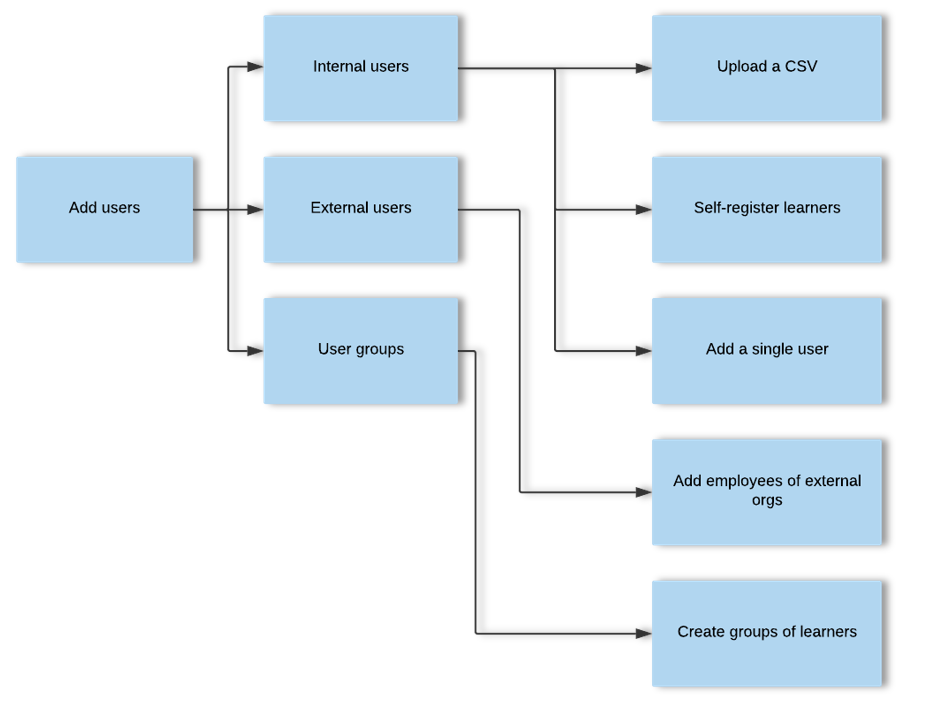
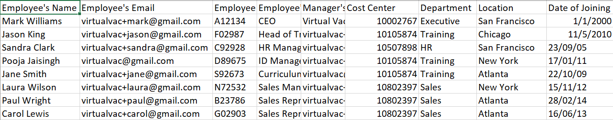
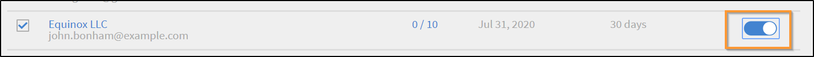

# Lägga till användare och skapa användargrupper

Lär dig lägga till användare eller användargrupper i Learning Manager-programmet.

<!---->

## Hantera användargrupper

>[!INFO]
>
>I den här utbildningen får du lära dig hur du skapar en användargrupp efter namn, e-post-ID:n och kombinerar flera automatiskt genererade användargrupper.  

<!--[Launch training](https://learningmanager.adobe.com/app/learner?accountId=98632&sdid=QLD1P6BS&mv=display&mv2=display#/course/7555694)-->

<!--In this training, you will learn how to create a user group by names, email IDs, and combining multiple auto-generated user groups.-->

<!---->

Om du inte kan starta utbildningen kan du skriva till <almacademy@adobe.com>.

## Översikt {#overview}

I Adobe Learning Manager kan du utföra följande uppgifter:

* **Administratör:** En administratör definierar organisationens utbildningsstrategi. En administratör kan lägga till elever, söka efter nödvändiga färdigheter för elever, hantera och tilldela kurser, skapa utbildningsplaner, certifieringar och utbildningsprogram samt hantera rapporter för hela organisationen.
* **Författare:** Författare är pedagogiska formgivare och innehållsskapare. En författare kan lägga till moduler och kurser i Learning Manager.
* **Chef:** En chef hanterar utbildningsaktiviteterna för ett team. En chef kan nominera teammedlemmar till en kurs, godkänna förfrågningar från teammedlemmar och ge feedback på teammedlemmarnas prestationer efter slutförd utbildning. Chefer kan också visa rapporter för sitt team för att spåra deras resultat.
* **Elev:** Elever kan komma åt kurser, utbildningsprogram och certifieringar som de tilldelats. Elever kan också bläddra igenom alla tillgängliga kurser genom att använda en katalog och registrera sig för antingen kurser, utbildningsprogram eller certifieringar.

Administratörer kan lägga till användare på tre sätt:

* Intern
* Extern
* Användargrupper

## Lägg till en enskild användare {#addasingleuser}

Lägg till interna elever i Adobe Learning Manager med ett enda användaralternativ.

Om du inte kan starta utbildningen kan du skriva till <almacademy@adobe.com>.

Om du vill lägga till användare

1. Logga in på Adobe Learning Manager som administratör.
1. På startsidan klickar du på **[!UICONTROL Add Users]**. På den här sidan kan du lägga till en enskild användare eller flera användare åt gången med en CSV-fil. Du kan även skapa en självregistreringslänk för interna medarbetare eller skapa en extern elevprofil.
1. Om du vill lägga till en enskild användare klickar du på **[!UICONTROL Add]** i det övre högra hörnet och välja alternativet **[!UICONTROL Single User]**.

1. Om du vill lägga till en enskild användare klickar du på **[!UICONTROL Add]** i det övre högra hörnet och välja alternativet **En användare**.

   
   *Lägg till en enskild intern användare*

1. På fliken **[!UICONTROL Add User]** -dialogrutan, ange elevens uppgifter. För fältet **[!UICONTROL Manager's Name]** väljer du namnet på en befintlig användare i systemet.

   
   *Dialogrutan Lägg till användare*

1. Om du vill lägga till den nya användaren i Learning Manager klickar du på **[!UICONTROL Add]**. När användaren har lagts till får användaren ett bekräftelsemeddelande. Eleven aktiverar sedan kontot och börjar använda Learning Manager. Detta arbetsflöde är användbart om du behöver lägga till ett begränsat antal elever i ditt konto för Learning Manager. Men om du planerar att registrera alla anställda i en stor organisation kan du lägga till dem i ett enda försök. Mer information finns i nästa avsnitt.

## Lägga till användare i grupp {#addusersinbulk}

Vanligtvis arbetar de flesta organisationer med ett HR-hanteringssystem (HRMS) som upprätthåller alla medarbetarposter, t.ex. utnämning, plats, datum för anslutning eller medarbetarhierarki. Du kan exportera dessa data i CSV-format. Importera en CSV-fil genom att följa stegen nedan:

1. Klicka **[!UICONTROL Add]** i det övre högra hörnet och väljer alternativet **[!UICONTROL Upload a CSV]**.

   
   *Överför en CSV-fil för att lägga till flera användare samtidigt*

1. CSV-filen som du överför består av fälten, som visas nedan:

   
   *CSV-filens struktur*

   Du måste upprätthålla en CSV-huvudfil och utföra alla tillägg och borttagningar i CSV-huvudfilen. CSV-huvudfilen innehåller följande fält:

   * namn &#42;
   * mejl &#42;
   * profil
   * chef

   (&#42;) Obligatoriskt fält.

1. När du har klickat på alternativet **[!UICONTROL Upload a CSV]** visas följande dialogruta.

   
   *Överför en CSV-dialogruta*

1. Välj CSV-filen eller dra och släpp filen. När du har valt filen mappar du datafälten med dem i CSV-filen. Klicka på önskad rullgardinsmeny och välj rätt fält.

   
   *Mappa fält i CSV*

1. Börja importera användarna genom att klicka på **[!UICONTROL Save]**. Du kan se ett bekräftelsemeddelande.

   
   *Bekräftelsemeddelande för lyckad överföring av CSV-filen*

1. De nya användarna läggs nu till i ditt Adobe Learning Manager-konto. Markera kryssrutan bredvid namnen så att alla markeras om du vill välja nya användare.

   
   *Nya användare har lagts till*

>[!NOTE]
>
>Mer information finns i Vanliga frågor och svar, [Lägga till användare i grupp](../add-users-in-bulk.md).

När du har valt användare kan du göra följande:

## Registrera en användare {#registerauser}

När användaren är markerad klickar du på **[!UICONTROL Actions]** i det övre högra hörnet och klicka på **[!UICONTROL Register]**.

De valda användarna får ett välkomstmeddelande via e-post. Om eleverna har ett Adobe ID kan de klicka på den här länken. Om de inte har ett Adobe ID kan de klicka på välkomstlänken för att skapa ett Adobe ID och länka det till sitt Learning Manager-konto.

## Tilldela en roll {#assignarole}

När du har lagt till elever i Adobe Learning Manager-kontot kan du klicka på Åtgärder uppe till höger på sidan om du vill ändra deras roller. Välj alternativet **[!UICONTROL Assign Role]**. Här kan du bestämma om du vill ge eleven författaråtkomst eller administratörsåtkomst. När du har tilldelat en roll har den här eleven författaråtkomst till kontot och kan lägga till moduler och skapa kurser.

*Tilldela en användare en roll*

## Ta bort en roll {#removearole}

Du kan också ta bort författar- eller administratörsåtkomst för användarna. Välj en eller flera elever, klicka på **[!UICONTROL Actions]** och välj **[!UICONTROL Remove Role]**. Välj ett alternativ, till exempel **[!UICONTROL Remove Author]** och författaråtkomsten återkallas för den här eleven.

>[!NOTE]
>
>Du kan inte tilldela någon i systemet en chefsroll manuellt. De får automatiskt tillgång till chefens kontrollpanel när en eller flera anställda läggs till under dem.

## Ta bort en användare {#deleteauser}

Om du vill ta bort en användare klickar du på **[!UICONTROL Actions]** och välja **[!UICONTROL Delete User]**. I bekräftelsedialogrutan klickar du på **[!UICONTROL Yes]** och eleven raderas.

*Bekräftelsemeddelande för att ta bort en användare*

## Redigera en användare {#editauser}

Välj en användare i listan med användare och klicka på användaren. På användarinformationen klickar du på **[!UICONTROL Edit]** ( ). På fliken **[!UICONTROL Edit User]** gör nödvändiga ändringar och sparar ändringarna genom att klicka på **[!UICONTROL Save]**.

*Dialogrutan Redigera användare*

## Aktiva fält

### Hantera användarattribut

I den här utbildningen får du lära dig hur du lägger till, anpassar och konfigurerar aktiva fält.

Om du inte kan starta utbildningen kan du skriva till <almacademy@adobe.com>.

I Adobe Learning Manager bevaras skiftlägeskänsligheten för användarattributet och dess värde. **Till exempel**&#x200B;är skiftlägeskänsligheten för ett användarattribut &#39;location&#39; och dess värde som &#39;PARIS&#39; bevaras och visas på samma sätt. Om det uppstår problem kan administratören nu redigera attributnamnet och attributvärdena för att korrigera eventuella skiftlägeskänslighetsfel.

Administratören kan göra detta genom att gå till **[!UICONTROL Admin app]** > **[!UICONTROL Users]** > **[!UICONTROL User groups]** och klicka på gruppnamnet.

En administratör kan lägga till och uppdatera tillåtna attributvärden för en elev via användargränssnittet.

Typer av aktiva fält:

* Grupperbart: Elever grupperas utifrån värdena
* Rapporteringsregister: Rapporterande användargrupper skapas baserat på de aktiva fälten
* Kan exporteras: Fälten visas i rapporten om användargrupper.

## Skapa en länk för självregistrering {#createaselfregistrationlink}

Du kan även göra det möjligt för anställda i organisationen att registrera sig som elever på Adobe Learning Manager-kontot utan att ta hjälp av dig som administratör. Administratören kan skapa en länk för självregistrering och dela med de anställda, som kan registrera sig ytterligare för Learning Manager med sina inloggningsuppgifter för Adobe.

Klicka på i det övre högra hörnet på sidan **[!UICONTROL Add]** och välj **[!UICONTROL Self-Registration]**.

*Skapa länk för att registrera dig som elev*

Inställningen **[!UICONTROL Add Self-Registration Profile]** visas. Ge profilen ett namn. Lägg sedan till chefens namn. Det är viktigt att veta att chefen redan måste vara registrerad elev i Learning Manager.

*Lägg till profil för självregistrering*

När du har klickat **[!UICONTROL Save]**, en URL genereras, vilken du kan dela med eleverna, så att de kan klicka på URL:en och själva registrera sig.

## Registrera externa elever {#enrollexternallearners}

I Adobe Learning Manager kan du även skapa registreringslänkar för externa partner eller byråer med begränsad åtkomst till ditt konto och ge dem utbildningsmaterial.

Det finns några skillnader mellan interna och externa registreringar.

<table>
 <tbody>
  <tr>
   <td>
    
<b>Interna användare</b>
</td>
   <td>
    
<b>Externa användare</b>
</td>
  </tr>
  <tr>
   <td>
    
Logga in med autentiseringsuppgifterna för Adobe ID eller SSO.
</td>
   <td>
    
Logga in med valfritt e-post-ID.
</td>
  </tr>
  <tr>
   <td>
    
Spelifiering är tillgänglig.
</td>
   <td>
    
Spelifiering är inte tillgänglig.
</td>
  </tr>
  <tr>
   <td>
    
Elevhierarkier är tillgängliga.
</td>
   <td>
    
Elevhierarkier är inte tillgängliga.
</td>
  </tr>
 </tbody>
</table>

Följ stegen nedan för att registrera externa användare:

1. Klicka på i det vänstra navigeringsfönstret **[!UICONTROL External]**.

   

   *Registrera externa användare*

1. Klicka på i det övre högra hörnet på sidan **[!UICONTROL Add]**.

1. På fliken **Lägg till extern registreringsprofil** dialogrutan lägger du till följande information:

   * Partnerorganisationens profilnamn.
   * E-postadressen till partnerorganisationens chef.
   * Platsbegränsning för extern registrering för denna partner.
   * Utgångsdatum för att ange en tidsgräns för att sluta tillåta nya registreringar i den här gruppen. Efter utgångsdatumet har endast befintliga registrerade användare tillgång till denna utbildning.

   

   *Dialogrutan Lägg till extern registreringsprofil*

   * I dialogrutan **[!UICONTROL Advanced Settings]** -avsnittet anger du följande:

      * **[!UICONTROL Login Requirement]:** Ange ett värde i dagar. Elever raderas om de inte loggar in under ovanstående tid.
      * **[!UICONTROL Allowed Domains]:** En kommaavgränsad lista med e-postdomännamn som är tillåtelselistade.
      * **[!UICONTROL Email Verification Required]:** Välj det här alternativet om du vill göra e-postverifiering obligatorisk för en elev.

   

   *Ange detaljerna i avsnittet Avancerade inställningar*

1. När du har klickat **[!UICONTROL Save]** visas följande bekräftelsemeddelande,. Du måste dela webbadressen med din externa partner.

   

## Aktivera en extern profil {#enableanexternalprofile}

När en extern profil har skapats måste du aktivera dess status. I listan över externa profiler väljer du önskad profil och växlar statusknappen.

*Aktivera en extern profil*

Då aktiveras länken Extern registrering. Ett välkomstmeddelande skickas automatiskt till partnern via e-post. Du kan också kopiera länken och dela den med dem genom att klicka på ikonen Kopiera URL (), eller så kan du skicka välkomstmeddelandet igen till partnerorganisationen genom att klicka på ikonen E-post ().

Partnerchefen kan dela länken med de anställda som måste genomgå utbildningen i PrLearning Manager. När de klickar på länken kan de registrera sig själva efter att ha fyllt i lite information för att skapa sin profil i Learning Manager. Dessa användare visas inte på fliken Elever tillsammans med de interna anställda. Du kan se deras namn under **[!UICONTROL External Learners]** -fliken.

## Pausa en extern profil {#pause}

När du har lagt till en extern användargrupp i Learning Manager kan du även pausa de externa användarnas registreringsprocess. När du pausar blockeras de externa användarnas registreringsprocess. Men den här processen fungerar bara när användarna inte har registrerat sig än genom att acceptera inbjudan.

Om du vill pausa de externa användargrupperna väljer du en eller flera grupper och klickar på **[!UICONTROL Actions]** från sidans övre högra hörn och klicka på **[!UICONTROL Pause]**.

## Återuppta en extern profil {#resumeanexternalprofile}

Du kan när som helst återkalla tillståndet pausad för en extern partner och återuppta normala tjänster. Klicka **[!UICONTROL Actions]** längst upp till höger på sidan och välja **[!UICONTROL Resume]**.

Följande tillstånd är tillämpliga för externa användare:

* **Inaktivt läge** - I det här läget har de externa användarnas registrering upphört. Administratörerna anger förfallodatumet för de externa användarna när de läggs till via arbetsflödet Lägg till användare.
* **Aktivt läge** - I det här läget kan externa användare registrera sig för Learning Manager-programmet och logga in på programmet.
* **Paus** - I det här läget är registreringsprocessen för externa användare blockerad. De befintliga användarna kan dock fortsätta att logga in.

## Kontrollera använda platser {#checkusedseats}

I listan över externa profiler klickar du på **[!UICONTROL Seats Used]**. Du kan se antalet elever i partnerorganisationen som har lagts till.

*Kontrollera använda platser*

## Ta bort en användare {#Deleteauser-1}

Välj en användare och klicka på i det övre högra hörnet **[!UICONTROL Actions]** > **[!UICONTROL Delete User]**.

## Ändra profil {#changeprofile}

Om du vill flytta en användare till en annan extern profil väljer du en användare. Klicka på i det övre högra hörnet **[!UICONTROL Actions]** > **[!UICONTROL Change Profile]**. Välj en profil i listan med profiler och klicka på **[!UICONTROL Change]**.

## Tilldela en roll {#Assignarole-1}

Välj en användare och klicka på i det övre högra hörnet **[!UICONTROL Actions]** > **[!UICONTROL Assign Role]** > **Tillverkare`<role>`**. Användaren får en ny roll.

## Ta bort en roll {#Removearole-1}

Välj en användare och klicka på i det övre högra hörnet **[!UICONTROL Actions]** > **[!UICONTROL Remove Role]** > **Ta bort`<role>`**. Den valda rollen tas bort från listan över roller som har tilldelats användaren.

## Skapa användargrupper {#createusergroups}

En användargrupp är en uppsättning användare som är relaterade till en kategori. Användargrupper hjälper administratörer att välja elever i organisationen utifrån deras attribut och sedan tilldela dem utbildningsinnehåll. Med de här användargrupperna kan administratörer också tilldela anpassade logotyper och kataloger till elever och visa anpassade rapporter om deras framsteg.

Om du vill komma åt användargrupper klickar du på **[!UICONTROL User Groups]**.

*Skapa användargrupper*

Det finns två grupptyper i Adobe Learning Manager, Anpassad och Automatiskt genererad. När du lägger till elever på ditt konto skapas vissa grupper automatiskt utifrån deras gemensamma egenskaper.

Klicka på fliken om du vill se automatiskt skapade grupper **[!UICONTROL Auto-generated]**.

*Visa automatiskt genererade grupper*

Du kan se att det finns olika grupper, som Alla interna användare, Alla chefer, grupper baserade på kostnadscentret, baserat på avdelningen och baserat på chefernas team.

Förutom automatiskt genererade grupper kan du även skapa egna grupper. Om du vill lägga till en ny anpassad grupp klickar du på i det övre högra hörnet **[!UICONTROL Add]**.

1. Ange gruppens namn och beskrivning.
1. Ange användarnamn eller profil i sökfältet när du skriver och välj från listrutan för att lägga till användare.

1. Klicka på för att lägga till fler elever **[!UICONTROL Add More Users]**.

1. Om du vill skapa användargruppen klickar du på **[!UICONTROL Save]**.

Denna anpassade grupp skapas nu och läggs till i profilen. De användargrupper du skapar är dynamiska till sin natur. Om nya användare läggs till med liknande attribut läggs de automatiskt till i användargruppen.

## Uteslutning av användargrupper

Ibland vill du utesluta en liten grupp användare från en stor användargrupp. Detta krävs för att registrera denna specifika uppsättning användare i utbildning via utbildningsplaner eller för att konfigurera korrekt synlighet för kataloger. I den här versionen av Learning Manager kan du utesluta elever eller användargrupper när du skapar en anpassad användargrupp. I dialogrutan Lägg till användargrupp kan du göra det med avsnittet Uteslut elever.

*Uteslut användargrupper*

Om du till exempel vill konfigurera en utbildningsplan så att alla användare som tillhör platsen = Kalifornien utom Store-5 (i Kalifornien) registreras.

## Avancerade inställningar {#advancedsettings}

### Datakällor {#datasources}

Du kan använda den här funktionen när du vill importera/synkronisera användarna eller utbildningsdata från organisationens databas till Learning Manager-programmet. Du kan även ställa in frekvensen för den här synkroniseringen.

Klicka **[!UICONTROL Data Sources]** i den vänstra rutan under **[!UICONTROL Advanced]** -sektionen.

*Datakällor för att importera eller synkronisera användare*

Välj typ av datakälla på menyn **[!UICONTROL Source]** väljer du uppdateringsfrekvens och klickar på **[!UICONTROL Sync now]** om du behöver synka direkt eller klicka på **[!UICONTROL Save].** Datakälltyper är SFDC, FTP och så vidare för interna användare.

Du kan lägga till flera datakällor.

### Aktiva fält {#activefields}

Med den här funktionen kan administratörer lägga till fler aktiva fält utöver dem som har tillhandahållits under användarregistreringen.

Klicka **[!UICONTROL Active Fields]** tillgänglig på sidan Användare. Elever kan bara välja mellan de värden som anges i anpassade värden.

*Aktiva fält*

### Konfigurera fält {#configurefields}

**Interna användare**

Du kan lägga till anpassade värden för användarfält för interna användare.

Följ de här stegen om du vill lägga till anpassade värden:

1. Klicka  **[!UICONTROL Modify Values]** för en intern användare.

   
   *Ändra värden för interna användare*

1. Inställningen **Värden i anpassat fält** visas.

   
   *Värden i dialogrutan Anpassade fält*

1. Välj det värde som ska läggas till från **[!UICONTROL Select Field]** rullgardinsmenyn.
1. Ange nya värden i **[!UICONTROL New Value]** område.
1. Klicka på **[!UICONTROL Done]**.
1. Klicka på Spara i det övre högra hörnet för att **[!UICONTROL Save]** ändringar.

**Externa användare**

Lägg till anpassade värden som liknar dem för interna användare.

*Ändra värden för externa användare*

### Inställningar {#settings}

**Användarvisning**

Om alternativet **Visa endast ofyllda fält vid elevinloggning** är aktiverat kan användaren bara se tomma fält vid inloggning.

*Visa ofyllda fält*

Med detta alternativ kan administratören avgöra om han/hon vill visa fälten eller dölja dem när de har fyllts i.

## Begränsa aktiva fält i rapporter {#restrictactivefields}

Learning Manager 27.7 introducerar två nya alternativ - **[!UICONTROL Reportable]** och **[!UICONTROL Exportable]**, för Aktiva fält.

*Alternativ i aktiva fält*

För CSV-fält och manuellt tillagda fält om ett aktivt fält är markerat som **[!UICONTROL Reportable]** blir det aktiva fältet sökbart i ett filter i en kontrollpanelsrapport.

*Filter i en kontrollpanelrapport*

Om ett aktivt fält är markerat som **[!UICONTROL Exportable]** visas det aktiva fältet i Excel-filen när en Excel-rapport hämtas.

Dessa alternativ visas både för interna och externa aktiva fält.

Du kan bara ta bort ett anpassat aktivt fält.

## Användarvisning

Du kan dölja hela sidan Slutför din profil för eleverna. Sidan visas inte när eleven loggar in.

Observera att det befintliga standardbeteendet inte ändras. Det här är en valfri funktion som nu är tillgänglig för administratörer.

Aktivera alternativen nedan:

*Avsnittet Användarvisning*

## Stöd för manuella CSV-fält via FTP- och Box-anslutningar {#import-connector}

Användarna vill ofta att aktiva fält ska anges manuellt när en elev loggar in på Learning Manager. Detta är möjligt i Learning Manager för närvarande, när användaren importerar en CSV-fil manuellt.

CSV-filen får inte innehålla alla aktiva fält. För alla Aktiva fält som inte uppdateras i den överförda CSV-filen måste användaren ange data för sådana Aktiva fält.

För närvarande måste alla aktiva fält mappas till något fält från CSV-källfilen.

Det händer att en användare inte vill mappa ett aktivt fält till ett fält som anges i CSV-filen. I sådana fall kan användaren mappa det aktiva fältet till värdet **[!UICONTROL DontImportFromSource]**. Välj det här värdet i listrutan när du importerar användare från FTP- och Box-anslutningar.

## Anpassade roller {#customroles}

Lägg till valfritt fält som en del av din användarinformation och klicka på **[!UICONTROL Save]**. När du har lagt till fälten kan du även kontrollera tillgängligheten för fälten i **[!UICONTROL Edit users]** dialog.

När du har lagt till fälten kan du se att de fält som är markerade med ett bockmärke kommer från datakällan eller CSV, som nämns i ögonblicksbilden nedan. Administratören kan redigera dessa källfält genom att aktivera eller inaktivera fälten.

**Värden för aktiva fält i Learning Manager**

Värdena för aktiva fält hämtas på följande sätt:

1. Programmet Learning Manager importerar metadata från datakällor som är kopplade till ditt konto.
1. Metadata som samlats in från den manuellt importerade CSV-filen.
1. Elever fyller i metadata när de loggar in
1. Administratören anger data för användarna.

>[!NOTE]
>
>Learning Manager-programmet skapar användargrupper automatiskt från dessa metadata.

**Lägg till anpassat värde**

Du kan lägga till anpassade värden för användarfält i fälten Intern och Extern användare.

Följ de här stegen om du vill lägga till anpassade värden:

Anpassade fält kan läggas till och tas bort och de gäller alla användare. CSV-fält kan aktiveras eller inaktiveras, de träder bara i kraft när du överför CSV efter att ha gjort ändringarna i aktiva fält. Alla interna aktiva fält kan användas för alla typer av interna användare. Externa fält är endast tillämpliga på externa användare. Om ett anpassat fält finns i CSV konverteras det automatiskt till ett CSV-fält vid nästa överföring och det aktiveras.

## Värden för CSV-fält {#valuesforcsvfields}

Användare kan bara välja bland fördefinierade fält för CSV-fält om **[!UICONTROL Restrict Selection]** kryssrutan har aktiverats.

*Kryssruta för att begränsa val*

## Importera loggar {#importlogs}

I det här området kan du visa CSV-importhistoriken för de användare som administratören har lagt till med hjälp av funktionen massimport. Du kan också klicka på **[!UICONTROL Add]** i det övre högra hörnet på sidan för att lägga till användare med funktionen för CSV-överföring.

## Aktiva fält med flera värden

Med den här funktionen kan du ha fler än ett fält för ett aktivt fält. Ett konto kan innehålla högst tre aktiva fält med flera värden. De aktiva fälten med flera värden är tillgängliga för både externa och interna användare.

När du har markerat ett aktivt fält som flervärdesfält kan du inte konvertera tillbaka det till enkelvärdesfält. Detta är oåterkalleligt.

Ett befintligt fält med ett enskilt värde kan inte markeras som ett fält med flera värden.

Skapa ett aktivt fält med flera värden genom att följa stegen nedan:

1. Lägg till ett aktivt fält.

   
   *Lägg till ett aktivt fält*

1. Klicka på Lägg till.
1. Markera det nya fältet som flervärdesfält på fliken Inställningar.

   
   *Markera som flera värden*

   Det finns en annan kryssruta, **[!UICONTROL Learner Configurable]**, som när den är inaktiverad inte kan se fältet på profilsidan.

1. Lägg till värdena med en CSV-fil eller genom att klicka på Ändra värden.

   
   *Lägg till värden*

1. Klicka [!UICONTROL **Klar**].

>[!NOTE]
>
>När användargruppen har skapats och fältet har fyllts i kan flera värden inte konverteras till enskilda värden, och vice versa.

### Lägg till aktivt fält med flera värden via CSV

Följ stegen nedan:

1. Skapa en CSV-fil med de nya aktiva fälten som kolumner (kommaavgränsade eller enskilda värden).
1. Importera CSV-filen.
1. Markera fälten som flervärdesfält i dialogrutan Värden i anpassade fält.
1. Importera CSV-filen igen.

CSV-filen måste ha en kolumn med samma namn som ett aktivt fält som har markerats som flera värden.

CSV-filen innehåller fälten:

* **[!UICONTROL User]**: Användargrupper som skapats som roller.
* **[!UICONTROL Roles]**: Aktivt fält med flera värden.

Om CSV-filen överförs med nya värden eller borttagna värden uppdateras även de aktiva fälten och grupperna.

### Rapporter

Alla rapporter innehåller aktiva fält med flera värden och deras värden.

Administratören kan lägga till automatiskt genererade aktiva fält och konfigurera användaraktivitets- och utbildningsrapporter.

Elevens betygsrapport innehåller alla aktiva fält och kommaavgränsade värden. Administratören kan sedan filtrera data på lämpligt sätt.

## Vanliga frågor {#faq}

+++Hur registrerar man användare i Learning Manager?

När du har lagt till en användare och tilldelat användaren en roll kan du registrera användaren genom att utföra stegen nedan:

1. När användaren eller användarna har valts klickar du på **[!UICONTROL Actions]** i det övre högra hörnet och klicka på **[!UICONTROL Register]**.

1. I popup-fönstret klickar du på **[!UICONTROL Yes]**.

De valda användarna får ett välkomstmeddelande via e-post. Om eleverna har ett Adobe ID kan de klicka på den här länken. Om de inte har ett Adobe ID kan de klicka på välkomstlänken för att skapa ett Adobe ID och länka det till sitt Learning Manager-konto.

Att klicka på en av dessa länkar i e-postmeddelandet är obligatoriskt för eleverna eftersom det hjälper Learning Manager att verifiera elevens konto.

+++

+++Hur redigerar man användardata?

Följ stegen nedan om du vill redigera en användare:

1. Klicka på användaren som du vill redigera data för i listan med användare.
1. Klicka på pennikonen som visas nedan.

I dialogrutan **Redigera användare** dialogrutan uppdaterar du fälten därefter. Klicka på för att spara ändringarna **[!UICONTROL Save]**.

+++

+++Hur pausar och återupptar man en extern användare i Learning Manager?

Välj den användare du vill ta bort i listan över externa användare. I det övre högra hörnet klickar du på **[!UICONTROL Actions]** > **[!UICONTROL Pause]**.

Mer information finns i [Pausa en extern profil](add-users-user-groups.md#pause).

När du har pausat en profil visar den externa profilen statusen som ***Pausad***.

+++

+++Hur skickar jag ett välkomstmeddelande till en nyligen skapad extern profil?

När du lägger till en extern användare visas **[!UICONTROL Add External Registration Profile]** anger du den externa chefens e-postadress. När du klickar på Spara skickas också ett välkomstmeddelande till den e-postadress du angav. Om du vill skicka välkomstmeddelandet igen klickar du på kuvertikonen enligt nedan:

+++

+++Hur skapar man anpassade användargrupper?

Klicka **[!UICONTROL Users]** > **[!UICONTROL User Groups]** och på sidan Användargrupper klickar du på **[!UICONTROL Add]**. I dialogrutan Lägg till användargrupp lägger du till användarna både enskilt och som ett team.

+++

+++Hur inaktiverar jag redan ifyllda aktiva fält?

Om du vill att elever bara ska se de aktiva fält som inte har fyllts i av dem följer du stegen nedan:

1. Klicka **[!UICONTROL Users]** > **[!UICONTROL Active Fields]**.

1. Klicka **[!UICONTROL Settings]** och aktivera alternativet **[!UICONTROL Show only unfilled fields on Learner login]**.

1. Klicka på **[!UICONTROL Save]**.

+++

+++Hur förhindrar jag att elever anger slumpmässiga värden i de aktiva fälten.?

Du kan begränsa urvalet för elever så att de bara kan välja de värden som är fördefinierade och inte ange några slumpmässiga värden. Följ stegen nedan:

1. Klicka **[!UICONTROL Users]** > **[!UICONTROL Active Fields]**.
1. Aktivera alternativet **[!UICONTROL Restrict Selection]**.
1. Klicka på **[!UICONTROL Done]**.

+++

+++Hur skiljer jag mellan CSV-aktiva fält och Anpassade aktiva fält?

Du kan bara aktivera eller inaktivera CSV-aktiva fält, men du kan inte ta bort dem. Du kan däremot inte aktivera eller inaktivera anpassade aktiva fält.

+++
