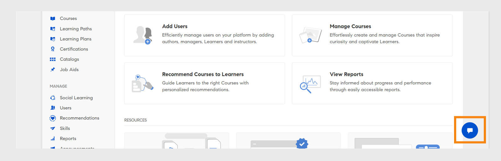

# Admin AI Assistant (beta) i Adobe Learning Manager

I komplexa utbildningsmiljöer kan administratörer få svårt att hitta innehåll eller slutföra uppgifter på grund av komplicerade menyer och frånkopplade arbetsflöden. Aktiviteter som att köra rapporter eller få åtkomst till viss information kan till exempel kräva att du navigerar i flera skärmar. Admin AI Assistant (beta) hjälper dig att hitta rätt information för att förstå och slutföra uppgifter effektivt.

Admin AI Assistant (beta) i Adobe Learning Manager hjälper administratörer att snabbt hitta svar på vanliga frågor, utforska systemfunktioner och förstå hur man utför viktiga uppgifter, bara genom att fråga på vanligt språk. Oavsett om du inte har använt Adobe Learning Manager förut eller om du letar efter snabbare sätt att felsöka kan Admin AI Assistant (beta) förenkla arbetsflödet genom att ge sammanhangsanpassad hjälp direkt på plattformen.

Det använder Adobe AI-funktioner för att möjliggöra naturliga språkfrågor över utbildningsinnehåll och systemarbetsflöden.  Administratörer kan ställa frågor som **hur man lägger till användare i Adobe Learning Manager** eller **hur man lägger till utbildningsvägar**. Adobe Learning Manager Admin AI Assistant (beta) utbildas uteslutande i offentligt tillgänglig dokumentation som ägs av Adobe, till exempel resurser som finns på **[!UICONTROL Experience League]**. Det lär sig inte av eller kommer inte åt kundinnehåll, internt utbildningsmaterial eller användargenererade data.

Den här assistenten minskar beroendet av manuell navigering, förkortar upptäcktstiden och hjälper dig att snabbt hitta användbara insikter.

<!--## Key benefits

* Perform common administrator tasks faster with conversational guidance.
* Get instant answers without browsing through extensive menus.
* Gain real-time insights and step-by-step guidance for administrative workflows.-->

>[!IMPORTANT]
>
>Det är endast tillgängligt för administratörer och stöder för närvarande endast engelska.

## Integritet, säkerhet och styrning

Admin AI Assistant (beta) är utformad för att hålla i fokus säkerhet och dataintegritet. Det här kan du förvänta dig:

* Admin AI Assistant (beta) använder inga personuppgifter, inklusive utbildningsändamål.
* Det har inte tillgång till utbildningsdata eller innehåll som lagras i Adobe Learning Manager.
* Admin AI Assistant (beta) varken kommer åt eller delar någon personligt identifierbar information (PII) eller delar privat eller känslig information.
* Eventuella uppmaningar från användare (till exempel frågor eller frågor) delas inte med andra kunder.

>[!IMPORTANT]
>
>Admin AI Assistant (beta) kommer att introduceras i faser, med kunder som får en två veckor lång förvarning. Kontakta din CSM (Customer Success Manager) om du behöver hjälp.

## Så här får du åtkomst till Admin AI Assistant (beta)

Starta Admin AI Assistant (beta) genom att följa dessa steg:

1. Logga in som administratör.
2. Välj chattikonen för att starta Admin AI Assistant (beta).

   
   _Välj chattbubblan för att starta Admin AI Assistant (Beta)_

   >[!NOTE]
   >
   >När du startar Admin AI Assistant (beta) för första gången måste du ge ditt samtycke innan du använder den. Dialogrutan för godkännande visas bara vid den första starten. Vid alla kommande starter tas du direkt till Admin AI Assistant (Beta) för att ange dina ledord.

3. Välj **[!UICONTROL Get started]**. Nu kan du använda Admin AI Assistant (beta).

   
   _Uppmana att godkänna användningsprincipen innan den första användningen_

## Använda Admin AI Assistant (beta)

Så här använder du Admin AI Assistant (beta):

1. Skriv ditt meddelande och tryck på **[!UICONTROL Enter]**. Svaret visas i Admin AI Assistant (beta).

   
   _En exempelfråga och ett svar från Admin AI Assistant (beta)_

### Exempeluppmaningar

Nedan följer några exempel på uppmaningar som administratörer kan använda för att effektivt använda Admin AI Assistant (beta):

* **Tilldela en användare en kurs**
   * **Fråga:**: &quot;Hur tilldelar jag en kurs till en användare?&quot;

  
  _Svar för frågan Hur tilldelar jag en användare en kurs_

* **Senaste registreringsrapport**
   * **Fråga**: Visa den senaste registreringsrapporten.

  
  _Svar på frågan Visa den senaste registreringsrapporten_

* **Ta bort en användare**
   * **Fråga**: &quot;Hur tar jag bort en användare?&quot;

  
  _Svar på fråga Hur kan jag ta bort en användare_

### Tips för att använda Admin AI Assistant (beta) effektivt

* **Var specifik med dina uppmaningar**: När du ställer en fråga ska du inkludera tydlig kontext och tydliga detaljer. Fråga till exempel &quot;Hur lägger jag till en användare i Adobe Learning Manager?&quot; i stället för &quot;Hur tilldelar jag en kurs till en användare i Adobe Learning Manager?&quot;
* **Använd ett klart och koncist språk**: Se till att dina frågor är enkla och fokuserade. Detta hjälper Admin AI Assistant (Beta) att förstå din avsikt och ge ett mer exakt svar.
* **Utforska olika funktioner**: Fråga om olika funktioner, till exempel registreringsrapporter, elevframsteg, innehållstilldelning eller certifieringsspårning, så att du kan få tillgång till alla tillgängliga supportalternativ.
* **Ge feedback**: Meddela oss om det var till hjälp när du har fått ett svar. Använd tummen upp, tummen ner, rapporten eller kommentarsfunktionerna för att dela din feedback. Din feedback spelar en viktig roll för att förbättra assistenten.

## Ge feedback på Admin AI Assistant (beta)-svar

Din feedback på svaren som genereras av Admin AI Assistant (Beta) hjälper till att förbättra dess noggrannhet, relevans och övergripande prestanda.

### Gilla eller ogilla ett svar

* Välj **[!UICONTROL Thumbs Up]** om svaret var hjälpsamt och korrekt.
* Välj **[!UICONTROL Thumbs Down]** om svaret var felaktigt eller inte till någon hjälp.

### Flagga ett svar

Gör så här för att flagga ett svar:

1. Välj **[!UICONTROL Flag]** i slutet av svaret.

   
   _Välj rapport på skärmen Admin AI Assistant_

2. Välj en eller flera anledningar, lägg till kommentarer om det behövs och välj sedan **[!UICONTROL Submit]**.

   
   _Administratörer betygsätter svaret med tummen upp eller ned med valfria kommentarer_

Adobe använder den här återkopplingen för att förbättra Admin AI Assistant (beta) över tid.

## Vanliga frågor

+++Kan jag använda Admin AI Assistant (beta) som elev?

Nej. Denna assistent är endast tillgänglig för administratörer.

+++

+++Är den tillgänglig i mobilappen?

Nej, inte just nu.

+++

+++Kan den utföra administratörsåtgärder?

Nej. Admin AI Assistant (beta) ger bara vägledning.

+++

+++Kommer den att stödja fler språk?

Adobe Learning Manager-teamet utvärderar flerspråkigt stöd för framtida uppdateringar.

+++
