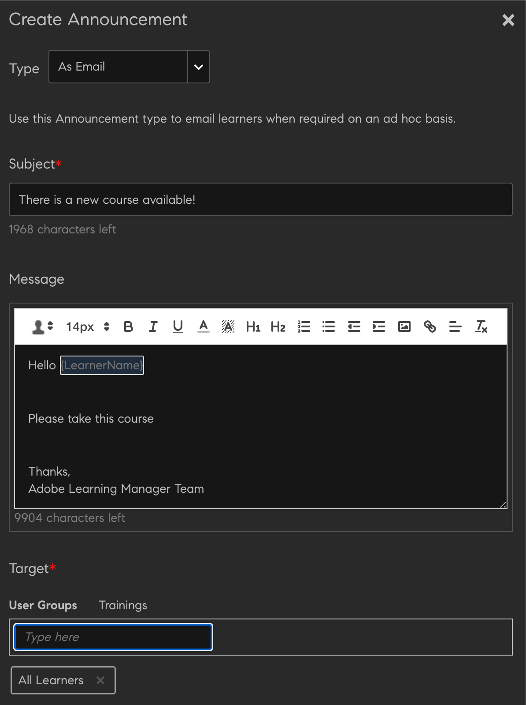

# Meddelanden

Ett meddelande är ett multimediemeddelande (text, bild eller video) som en administratör skickar till en viss grupp användare.

Administratören kan skicka meddelanden till elever för att informera dem om en händelse eller aktivitet. Tillkännagivandet kan vara en kombination av text, bilder eller videor. Du kan länka utbildningsobjekt som kurser, utbildningsprogram och certifieringar till ett meddelande.

Det finns fyra typer av meddelanden:

* Meddelande
* Redaktionsruta
* Rekommendation
* E-post

## Meddelande {#notification}

1. Du som är administratör klickar på Meddelanden i den vänstra rutan.
1. Klicka på Lägg till längst upp till höger på sidan.
1. I listrutan Typ väljer du alternativet **Som meddelande**.

*Anpassa aviseringen*

1. Lägg till meddelandet för meddelandet i fältet Meddelande. Här kan du också lägga till en URL-adress för meddelanden. Du måste dock lägga till URL-adressen i HTML-formuläret.

   Till exempel `code <a href="http://www.w3schools.com" target="_blank">Visit W3Schools</a>.`

   När du anger att målet är tomt och en användare sedan klickar på meddelande-URL:en, öppnas länken i en ny flik. Om du inte anger målet öppnas länken i samma webbläsare.

1. Du kan även lägga till bilagor som bilder eller videofiler för meddelandet.
1. Välj målanvändargrupperna eller målobjekten för utbildningen. Du kan bara välja en av dem för ett meddelande.

   Börja skriva användargruppens namn i textrutan och välj ett i listrutan. På samma sätt väljer du utbildningen genom att skriva objektnamnet i textrutan.

1. Klicka på Avancerade inställningar i dialogrutan. Du kan utföra följande åtgärder:

   * Gör meddelandet till ett klistermärke genom att markera kryssrutan Aktivera klisterlapp.
   * Välj leveranstid för meddelandet.

1. Välj **[!UICONTROL On a date]** om du vill schemalägga ett meddelande till ett senare datum och klicka på textområdet intill. En kalender visas där du kan välja startdatum. Välj slutdatum på samma sätt.
1. Klicka på **[!UICONTROL Save]**.
1. Klicka på inställningsikonen bredvid ett meddelande på fliken Utkast och klicka sedan på Skicka.

Om den bifogade filen är stor kan det ta en stund att överföra den. När du har klickat på Spara visas ett popup-fönster med ett meddelande eftersom överföringen bearbetas. Du får ett meddelande när bilagan har överförts.

## Redaktionsruta {#masthead}

När du väljer detta alternativ kommer de mediefiler du väljer att visas på elevens startsida. Masthead fungerar som en uppmaning till handling för de elever den är avsedd för.

Administratörer kan lägga till alt-text för alla mastheads för att förbättra tillgängligheten för elever. Det gör att elever med särskilda behov kan använda skärmläsare för att läsa alt-texten och förstå bilden. Du kan välja flera språk och ange alt-text för varje språk. Se till att du lägger till alt-texten på respektive språk.

Gör så här för att lägga till maskhuvudet:

1. Logga in som **[!UICONTROL Admin]**.
2. Välj **[!UICONTROL Announcements]** > **[!UICONTROL Add]**.
3. Välj **[!UICONTROL As Masthead]** i listrutan Typ.

   
   _Skapa ett meddelande_

4. Välj språk och överför bilden.

   >[!NOTE]
   >
   >Du kan välja flera språk och ange alt-text för varje språk. Se till att du lägger till alt-texten på respektive språk.

5. Ange lämplig text i fältet **[!UICONTROL Alt Text]**.
6. Lägg till en URL-adress för att omdirigera elever när de klickar på knappen på masthead i fältet **[!UICONTROL Action Button]**.
7. Välj målanvändargrupperna eller målobjekten för utbildningen. Du kan bara välja en av dem för ett meddelande.
8. I avsnittet **[!UICONTROL Advanced Settings]** finns följande alternativ:

   * Välj **[!UICONTROL Immediately]** om du vill att meddelandet ska publiceras just då.
   * Välj **[!UICONTROL Never]** om du inte vill att ditt meddelande ska upphöra.
   * Välj datumen **[!UICONTROL Start]** och **[!UICONTROL End]** för meddelandet.
9. Välj Spara och publicera meddelandet.

**Finns det någon gräns för antalet aktiva Masthead-meddelanden?**

Du kommer bara att se de senaste 10 Masthead tillkännagivanden.

## Rekommendation {#recommendation}

När du väljer det här alternativet rekommenderas valfri utbildning till angivna användargrupper. Rekommendationerna drivs av en maskininlärningsalgoritm.

*Välj rekommenderad utbildning som ska visas för en elev*

1. Välj den utbildning som du vill rekommendera eleverna. Du kan lägga till upp till tio utbildningar.

   Elever kommer bara att se de oregistrerade utbildningarna i Rekommendation efter organisation. Beroende på katalogens synlighet har eleven tillgång till utbildningen.

1. Välj målanvändargrupperna eller målobjekten för utbildningen. Du kan bara välja en av dem för ett meddelande.

   Börja skriva användargruppens namn i textrutan och välj ett i listrutan. På samma sätt väljer du utbildningen genom att skriva objektnamnet i textrutan.

1. I avsnittet Avancerade inställningar finns följande alternativ:

   * Klicka på **[!UICONTROL Immediately]** om du vill att meddelandet ska publiceras just då.
   * Klicka på **[!UICONTROL Never]** om du inte vill att meddelandet ska upphöra.
   * Välj datumen **[!UICONTROL Start]** och **[!UICONTROL End]** för meddelandet.

   <!---->

När du klickar på **[!UICONTROL Save]** kan du antingen publicera meddelandet direkt eller publicera det senare. Tills dess kommer tillkännagivandet att vara i ett utkast.

* Mastheads/Recommendations utlöser inga meddelanden.
* Mastheads/Recommendations visas inte i meddelanderapporten.

## Utkast, schemalagd och skickad lista {#draftscheduledandsentlist}

Vid administratörsinloggning kan du visa alla meddelanden på tre flikar, t.ex. Utkast, Schemalagt och Skickat.

<!---->

### Utkast {#draft}

På fliken Utkast kan du visa alla meddelanden som har skapats av en administratör men som ännu inte har sänts eller som ännu inte har schemalagts för sändning.

Som standard är alla meddelanden inställda för omedelbar sändning. Om du väljer inställningar > Skicka alternativ för ett oschemalagt meddelande, sedan sänds det omedelbart. Om du vill schemalägga en sändning av ett meddelande måste du välja start- och slutdatum i Avancerade inställningar.

### Schemalagt {#scheduled}

På fliken Schemalagd kan du visa alla meddelanden som är schemalagda för sändning vid ett senare tillfälle.

### Skickat {#sent}

På fliken Skickat kan du visa alla meddelanden som redan sänds.

## Som mejl

Använd det här alternativet för att skicka riktade ad hoc-e-postmeddelanden till elever i en vald användargrupp eller till elever som har registrerat sig för specifik utbildning.

*Skicka riktade ad hoc-e-postmeddelanden till elever*

*Administratören skapar ett e-postmeddelande*

1. Välj **[!UICONTROL Type as Email]**.
1. Ange e-postmeddelandets ämne och brödtext.
1. I avsnittet Mål kan du antingen:

   * Välj en användargrupp ELLER
   * Välj en kurs. Om kursen har flera instanser kan du välja önskad instans.

1. Klicka på **[!UICONTROL Save]**.
