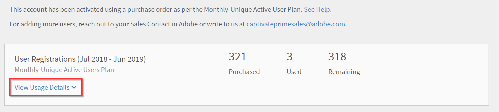

# Hantera order och fakturering för Learning Manager

Kreditkortsbaserat köp är endast tillgängligt i [Region i USA](http://learningmanager.adobe.com/).

Hantera Learning Manager-fakturering, gör beställningar med hjälp av ett kreditkort, prenumererar med en inköpsorder eller via en aktiv användarplan varje månad.

Adobe Learning Manager har en flexibel, kundvänlig och en av de bästa prismodellerna för att tillgodose ditt företags behov. Mer information finns i [Learning Manager](https://www.adobe.com/products/learningmanager.html) sidan.

Det är bara administratörerna i organisationen som kan hantera faktureringen.

Om du vill kontakta Adobe för mer information om Learning Manager-prenumeration och fakturering kan du skriva till oss på [learningmanagersales@adobe.com](mailto:learningmanagersales@adobe.com).

## Gör beställningar med kreditkort {#placeordersusingcreditcards}

Du kan köpa en prenumeration för högst 3 500 elever genom en enskild betalningsorder med kreditkort. Den första ordningen på kontot måste vara för minst 10 elever.

1. I Administratörsprogrammet klickar du på **[!UICONTROL Billing]** i den vänstra navigeringsrutan.

   

   *Starta fakturering för Adobe Learning Manager*

1. På fliken **[!UICONTROL Billing Information]** -sidan lägger du till antalet användare i **[!UICONTROL Add Users]** område. När du använder ett kreditkort för förbetalda prenumerationer kan du se antalet användare som du kan lägga till för prenumerationen. Antalet användare som du kan lägga till får inte överstiga antalet som nämns i avsnittet Återstår.1.

   

   *Lägg till antal användare*

1. När du har angett antalet användare som ska läggas till klickar du på Placera ordning i det övre högra hörnet på sidan.

   

1. Granska uppskattningen som visas på skärmen.

   

   *Beställ*

   Årsprenumerationsavgiften beräknas utifrån antalet användare som läggs till för prenumerationen. Om till exempel fyra användare läggs till beräknas årsavgiften med uttrycket 4 användare X$4X$12, vilket returnerar $192.

   Klicka **[!UICONTROL Proceed]**.

   *Granska uppskattningen*

1. Du kan visa det beräknade priset för beställningen på sidan Betalningsinformation. Valutan visas baserat på det aktuella språkområdet.

   

   *Visa betalningsinformation*

   Du kan också ändra språkinställning genom att välja land i listrutan.

   

   *Välj faktureringsland*

1. Ange dina kontaktuppgifter, välj kreditkortstyp och ange uppgifter om kreditkortet. När du har angett de obligatoriska uppgifterna klickar du på **[!UICONTROL Complete Order]**.
1. När du har beställt kan du klicka på fliken för att se de senast beställda paketen **[!UICONTROL Order History]** fliken på **[!UICONTROL Billing]** sidan.

   

   *Visa orderhistorik*

## Kontrollera orderstatus {#checkorderstatus}

Alla beställningar kan ha en av de fyra statusarna:

**Aktiv:** En order är aktiv och användarna har registrerats.

**Avstängd:** En order försätts i vänteläge i följande scenarier:

* Försenad betalning från kreditkortet
* Kreditkortets utgångsdatum.
* Betalningen avvisas för en återkommande betalningscykel.

**Avbrutet initierat:** En ordning försätts i detta tillstånd när Learning Manager-administratören inaktiverar kontot. Ordern försätts sedan i ett annullerat tillstånd efter att annulleringsbekräftelsen på ordern har mottagits.

## Uppdatera prenumerationsinformation {#updatesubscriptiondetails}

1. Klicka på i listan med beställningar **[!UICONTROL Edit]**.

   

   *Uppdatera prenumerationsinformation*

1. På sidan Prenumerationsinformation klickar du på **[!UICONTROL Edit Subscription]**.
1. Välj det objekt du vill redigera:

   * Betalningssätt: Använd det här alternativet om du vill uppdatera betalningsinformation, till exempel kreditkort.
   * Adress: Använd det här alternativet om du vill uppdatera adressinformationen.

## Avbryta en prenumeration {#cancelasubscription}

Så här avbryter du en beställning:

1. Klicka på Fakturering i den vänstra rutan på sidan Administratör.
1. På faktureringssidan väljer du **[!UICONTROL Actions]** > **[!UICONTROL Deactivate Account]**.
1. När administratören inaktiverar kontot avbryts alla beställningar på kontot från nästa faktureringscykel.

När ett konto inaktiveras av kunden försätts det i ett testläge under de kommande 30 dagarna. Kontoägaren får tre e-postpåminnelser om att återuppliva kontot. Om ägaren inte återaktiverar kontot kan ingen av användarna få tillgång till Learning Manager bortsett från ägaren.

## Gör beställningar via inköpsorder {#placeordersusingpurchaseorder}

Du kan välja inköpsorderprocessen som ett alternativt betalningssätt. Organisationens konto måste registreras hos Adobe. Ditt organisationskonto debiteras för den här processen. Kontot debiteras utifrån en elevs aktiviteter. Endast aktiviteter på utbildningsobjektnivå debiteras. Så här gör du en beställning med inköpsorder:

1. Skicka ett e-postmeddelande till [learningmanagersales@adobe.com](mailto:learningmanagersales@adobe.com) och ange antalet obligatoriska elever.
1. Learning Manager-teamet skickar en aktiveringsnyckel till dig.
1. Ange aktiveringsnyckeln på sidan Fakturering i administratörsprogrammet.
1. Klicka på Aktivera längst upp till höger på sidan.

## Kontrollera kontostatus {#checkaccountstatus}

När ett konto har aktiverats kan kontot ha något av följande tillstånd:

* **Testversion** - Du kan skapa ett Adobe Learning Manager-konto och använda det utan betalning i 30 dagar. Det finns ingen begränsning för antalet elever som är registrerade under utvärderingsperioden.
* **Aktiv** - I det här läget har kontot aktiva elevprenumerationer med återkommande månadsbetalning enligt prenumerationsordern.
* **Inaktiv** - Ett konto försätts i inaktivt läge i följande scenarier:

   * Efter utvärderingsperioden om det inte finns några aktiva prenumerationsbeställningar på kontot.
   * Administratören inaktiverar kontot, vilket innebär att alla befintliga beställningar på ett konto avbryts från nästa faktureringsperiod för prenumerationen.
   * Betalning avvisas för aktiva order på ett konto även efter påminnelser.

Ett inaktivt läge avbryter inte ditt konto med omedelbar effekt. Du får minst ett par påminnelser från Learning Manager-teamet där du ombeds att lämna den senaste informationen om

Ditt kreditkort om det har upphört att gälla. I inaktivt läge kan bara en administratör logga in i Captivate

Learning Manager-konto. Alla andra användare har inte åtkomst till kontot.

* **Aktivering krävs** - Ditt konto går till detta läge när Learning Manager-administratören väljer att inaktivera kontot. Alla beställningar på det här kontot annulleras. Inkasseringen av betalning för dessa order sker inte från nästa faktureringsperiod. Kontots status förblir i det här tillståndet fram till dagen för den senaste faktureringsperioden. I det här läget kan alla användare fortsätta använda applikationen utan påverkan fram till slutet av den senaste återkommande betalningsdagen.

## Avbryta en prenumeration {#Cancelasubscription-1}

Om du vill avbryta en aktiv prenumeration kontaktar du supportteamet för Learning Manager.

## Avgift för uppsägning av konto {#accountterminationfee}

Om du vill säga upp prenumerationen innan året är slut, debiteras en avgift för tidigare avslut. Uppsägningsavgiften motsvarar 50 % av prenumerationspriset för den återstående åtagandeperioden.

## MAU-plan (månadsunik aktiv användarplan) {#monthlyactiveusersmauplan}

Du kan välja en MAU-plan som önskat faktureringssätt. Det här alternativet genererar fakturering baserat på antalet unika aktiva användare varje månad. De unika aktiva användarna varje månad läggs till kumulativt för en period på 12 månader från och med den månad då planen aktiveras. Det här numret används för fakturering för perioden.

Använd följande exempel för att förstå hur MAU beräknas.

Låt det finnas ett fall där antalet användare per månad är följande:

* Månad 1 = 50
* Månad 2 = 500
* Månad 3 = 5 000
* Månad 4 till 12 = 10

Aktiva användare totalt som faktureras varje månad = månad 1 + månad 2 + månad 3 + månad 4 till 12 = 50 + 500 + 5000 + 90 = 5640.

Faktureringen för perioden skulle vara för 5640 användare.

I slutet av 12-månadersperioden återställs användningsantalet till noll och en ny period för MAU-planen inleds. Du kan lägga till flera aktiveringsnycklar för att öka antalet köpta platser.

Alla användare som utför följande åtgärder eller får slutföranden på grund av åtgärder som andra vidtar anses vara en unik aktiv användare varje månad för den kalendermånaden.

* Föra en kurs, ett utbildningsprogram eller en certifiering.
* Förbruka, hämta arbetsstöd eller kursbilagor.
* Använda, hämta eller skapa personliga anteckningar.
* Delta i social utbildning genom att skapa tavlor, inlägg eller kommentarer.
* Slutförande på grund av godkännanden av inlämning av externt certifikat eller närvaro för klassrumssessioner/virtuella klassrumssessioner.

## Visa användningsinformation {#viewusagedetails}

1. Om du vill visa antalet aktiva användare per månad klickar du på **[!UICONTROL View Usage Details]**.

   

   *Visa aktiva användare per månad*

1. Du kan visa följande på sidan som visas:

   * **Total användning:** Du kan kontrollera det totala antalet aktiva användare, användare som använder Learning Manager under en månad och antalet användare som ännu inte har registrerat sig för någon kurs.

   * **Månadsvis användning:** Du kan se en tabell med unika aktiva användare per månad.

## Hämta användningsrapport {#downloadusagereport}

Du kan även ladda ner data för antalet aktiva användare per månad och år. Klicka på för att hämta **[!UICONTROL Download Detailed Report]**.

På fliken **Generera rapportförfrågan** anger du de månader och år som krävs och klickar på **[!UICONTROL Generate]**.

*Hämta rapport över aktiv användning*

Om du stänger webbläsarfönstret kommer nedladdningen att påbörjas nästa gång du går in på Learning Manager.

Rapporterna sparas i webbläsarens mapp Nedladdningar.

## Avbryta en prenumeration

Om du vill avbryta en aktiv prenumeration kontaktar du supportteamet för Learning Manager.

## Vanliga frågor {#frequentlyaskedquestions}

+++Hur lägger man till/tar bort prenumerationer från ett konto?

Lägg till antalet användare du vill köpa prenumerationer på om du vill lägga till dem i ett konto. Klicka sedan på i det övre högra hörnet **[!UICONTROL Place Order]**. Granska uppskattningen och klicka på **[!UICONTROL Proceed]**. Ange dina kontouppgifter och även dina kreditkortsuppgifter. Klicka sedan på för att köpa prenumerationerna **[!UICONTROL Complete Order]**.

Om du vill ta bort en aktiv prenumeration kontaktar du Learning Manager-supportteamet.
+++

+++Hur ändrar jag ett kreditkort för prenumerationer?

I dialogrutan **[!UICONTROL Order History]** för ett aktivt konto, klicka på **[!UICONTROL Edit]**. På sidan Prenumerationsinformation klickar du sedan på **[!UICONTROL Edit Subscription]**. Ange dina nya kreditkortsuppgifter och klicka på **[!UICONTROL Update Payment Method]**.

*Visa kreditkortsuppgifter*
+++

+++Hur uppdaterar jag faktureringsinformationen i Learning Manager?

Följ stegen nedan för att uppdatera faktureringsinformationen:

1. Logga in som **Administratör** och klicka på **[!UICONTROL Billing]**.
1. Klicka på i listan med beställningar **[!UICONTROL Edit]**.
1. På sidan Prenumerationsinformation klickar du på **[!UICONTROL Edit Subscription]**.

Välj det objekt du vill redigera:

1. **[!UICONTROL Payment method]:** Använd det här alternativet om du vill uppdatera betalningsinformation, till exempel kreditkort.
1. **[!UICONTROL Address]:** Använd det här alternativet om du vill uppdatera adressinformationen.
+++

+++Kan jag säga upp en del av en prenumeration?

Nej, du kan inte avbryta en prenumeration partiellt. Om du behöver minska antalet licenser som du har köpt kan du säga upp prenumerationen i slutet av faktureringscykeln och sedan köpa det antal licenser som krävs.
+++

+++Hur får jag en faktura för mina kreditkortsbetalningar?

Kontakt [FastSpring](https://fastspring.com/) om du vill få en faktura för dina betalningar, på något av följande sätt:

* Skapa en tjänstförfrågan med FastSpring med hjälp av länken `https://questionacharge.com`.
* Skicka ett e-postmeddelande till FastSpring den `orders@fastspring.com` begäran om fakturan.
+++
