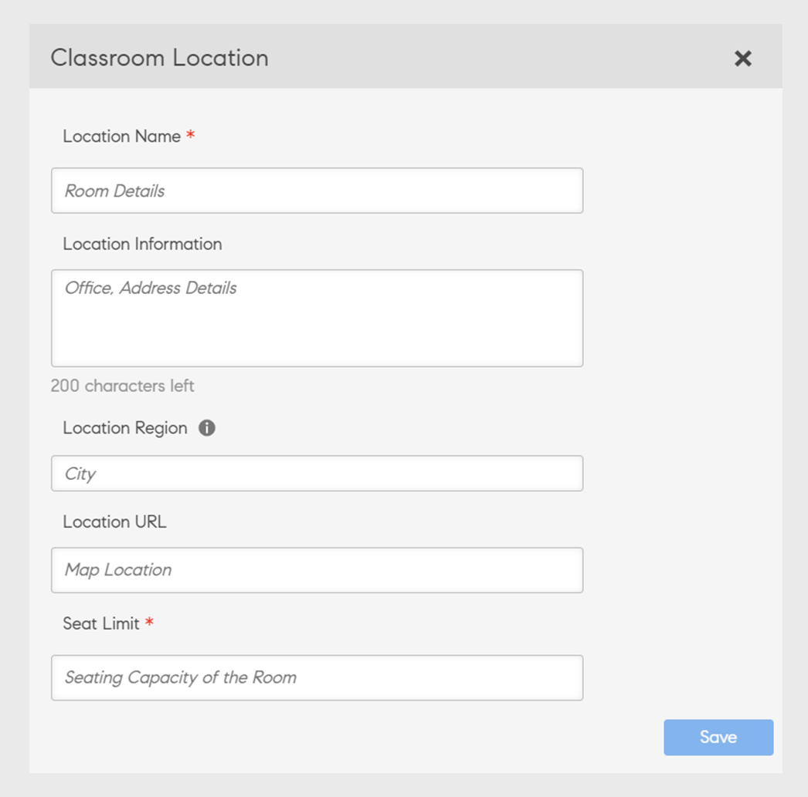

# Klassrum

## Översikt

Administratörer kan nu konfigurera ett bibliotek med klassrumsplatser. För varje klassrumsplats kan administratörerna ange metadata som omfattar platsnamn, platsgräns samt ytterligare information, t.ex. plats-URL. Författare och administratörer kan sedan använda dessa förkonfigurerade klassrumsplatser för att ställa in instruktörsledda utbildningshändelser (klassrumsmoduler).

Du kan lägga till en klassrumsplats på följande två sätt.

## Lägga till klassrum med användargränssnittet

Du kan lägga till en klassrumsplats med användargränssnittet:

1. Klicka på i administratörsprogrammet (gränssnittet för administratörsroller). **[!UICONTROL Settings]** > **[!UICONTROL Classroom Locations]**.

1. Klicka **[!UICONTROL Add]** > **[!UICONTROL New Location]**.

1. I dialogrutan **[!UICONTROL Classroom Location]** i dialogrutan anger du följande information:

   * Ange kommandot **[!UICONTROL Location Name]**. Använd ett unikt namn. Annars visas ett felmeddelande i Learning Manager.
   * Ange platsbeskrivningen i rutan **[!UICONTROL Location Information]** område. Det här fältet är valfritt.
   * Ange kommandot **[!UICONTROL Location URL]**. Eleven kan se den här informationen i klassrumsinformationen. URL-adressen kan också vara en URL-adress för mappningsplatsen om det behövs. Det här är ett valfritt fält.
   * Ange och välj **[!UICONTROL Location Region]**. Det här fältet är valfritt.
   * Ange antalet lediga platser i **[!UICONTROL Seat Limit]** område. Detta anger klassrummets kapacitet. Detta värde kan ändras när du skapar den faktiska lärarledda utbildningsevenemanget.

   

   *Lägg till en klassrumsplats*

När du har lagt till platsen **[!UICONTROL Settings]** > **[!UICONTROL Classroom Locations]** sidan visar mötesrummen:

*Visa alla mötesrum*

Listan innehåller följande fält:

**[!UICONTROL Location Name]** - Namn på klassrumsplatsen.

**[!UICONTROL Future Sessions]** - Antal händelser som kommer att inträffa på motsvarande plats. Klicka på numret om du vill visa informationen i en dialogruta.

*Visa framtida sessioner*

Dialogrutan visar information om varje session, inklusive namnet på sessionen, namnet på utbildningen som inkluderar sessionen samt sessionsschema. Den tid som visas överensstämmer med elevens systemtidszon.

Inställningen **[!UICONTROL Future Sessions]** fältvisning **nolla** när klassrummet inte används för någon session eller när klassrummet är associerat med tidigare sessioner.

**[!UICONTROL Seat Limit]** - Visar klassrummets kapacitet.

**Plats-URL** - URL som du angav när du skapade klassrumsplatsen.

**Platsinformation** - Klassrumsinformationen som du angav när du skapade klassrummet.

### Redigera klassrumsplatser

Följ stegen nedan om du vill redigera klassrumsplatser:

1. I Admin-programmet (gränssnittet för administratörsroller) väljer du **[!UICONTROL Settings]** > **[!UICONTROL Classroom Locations]**.

1. Håll pekaren över den önskade klassrumsplatsen som du vill redigera.

1. Välj **[!UICONTROL Edit Classroom Location]** -ikonen.

1. Ändra klassrumsplatsen och välj **[!UICONTROL Save]**.

## Lägga till klassrum med CSV

Du kan också lägga till en eller flera klassrumsplatser genom att importera en CSV-fil som innehåller klassrumsinformationen.

in **[!UICONTROL Admin app]** > **[!UICONTROL Settings]** > **[!UICONTROL Classroom Locations]** > **[!UICONTROL Add]** klickar du på **[!UICONTROL Bulk import locations]** knapp. Bläddra till den plats som innehåller CSV-filen och välj filen.

CSV-filen använder dessa fält för att lagra information om en eller flera klassrumsplatser:

* name
* information
* url
* region
* seatLimit

Du kan anpassa rubrikerna.

CSV-filen måste obligatoriskt innehålla alla kolumner i samma ordning som anges här.

När systemet har importerat CSV-filen läggs platserna till i biblioteket.

## Sök efter klassrum

Om du vill söka efter klassrum väljer du den virtuella klassrumskursen och går sedan till **[!UICONTROL Instances]** > **[!UICONTROL Sessions]**. En författare eller administratör kan börja skriva platsnamnet för att se relevanta resultat som börjar visas. De kan sedan välja en plats bland de visade resultaten. Om ingen plats visas i resultatet före typen kan användaren fortfarande lägga till namnet på den nya klassrumsplatsen. Observera att det här platsnamnet som skapats med arbetsflödet för att skapa session inte läggs till i platsbiblioteket som skapats av administratören.

När ett klassrum läggs till anger utbildningsplattformen även om klassrummet redan har bokats för den angivna tidsperioden. Det ger även alternativa tider slots som förslag. Det innebär att författaren kan justera mötestiden om han eller hon bestämmer sig för att använda samma plats i klassrummet.

*Sök efter klassrum*

## Administratör

Du som är administratör kan hantera instruktörer och kursinstanser.

### Konfigurera instruktörer:

I Admin-appen, under **[!UICONTROL Settings]** > **[!UICONTROL General]** kan administratörer hitta **[!UICONTROL Instructor Management]** alternativ. Den här funktionen ser till att endast förhandsgodkända användare som tilldelats som instruktörer kan läggas till för att genomföra sessioner.

Så här tilldelar du en instruktör:

1. Gå till **[!UICONTROL Getting Started]** sidan och välja **[!UICONTROL Users]** i den vänstra rutan.

1. Välj den användare du vill använda.

1. Tilldela användaren instruktörsrollen genom att välja **[!UICONTROL Actions]** > **[!UICONTROL Assign Role]**.

### Avbryta sessioner:

På fliken **[!UICONTROL Course Instance]** -sidan, kan administratörer avbryta en eller flera sessioner. När sessioner avbryts tar systemet bort alla sessionsdetaljer men behåller platsbegränsningen.

Dessutom kan administratörer:

* **[!UICONTROL View Enrollment]**: Få information om registrerade elever och elever på väntelistan för varje session.
* **[!UICONTROL Unenroll Learners]**: Ta bort elever från en kurs med avbrutna sessioner utan att ändra deras registreringsstatus.
* **[!UICONTROL Attendance Management]**: Markera närvaro för sessioner, även om sessionerna avbryts.
* **[!UICONTROL Course Completion]**: Administratörer kan markera en kurs som slutförd även om sessioner har avbrutits.
* **[!UICONTROL Rescheduling]**: Schemalägg annullerade sessioner för senare datum och lägg till en instruktör under omplaneringen.

Observera att elever fortsätter att vara registrerade för utbildningsinstansen efter uppsägningen. Deras registreringsstatus förblir oförändrad, till exempel bekräftad registrering, väntelista och väntande chefsgodkännande. Detta är användbart eftersom administratören kan ställa in och boka om den avbrutna sessionen i framtiden.

## Författare

Om administratören väljer **[!UICONTROL Instructor Management]** kan en författare endast söka efter och lägga till användare med instruktörsrollen i klassrumssessioner, virtuella klassrumssessioner, checklistor och modulerna för filinlämning.

Dessutom kan en författare:

* Lägg till och ta bort instruktörer från befintliga sessioner.
* Lägg till instruktörer till befintliga sessioner som redan har en eller flera instruktörer.

När en administratör har aktiverat **[!UICONTROL Instructor Management]** kan bara användare med instruktörsrollen läggas till som instruktör.

>[!NOTE]
>
>Detta gäller inte när du migrerar sessioner med CSV-filen för sessioner. I det här fallet kan en användare som inte har instruktörsrollen läggas till som instruktör.

På fliken **[!UICONTROL Course Instance]** kan en författare avbryta en eller flera sessioner. När sessioner avbryts tar systemet bort alla sessionsdetaljer men behåller platsbegränsningen.

Därför kan en författare använda **[!UICONTROL Cancel Session]** länkar för att avbryta en eller flera klassrumssessioner eller virtuella klassrumssessioner som är tillgängliga i samma eller olika kursinstanser.

## Begränsa till förbestämd lista över instruktörer

För närvarande kan användarna lägga till en registrerad användare som instruktör när de skapar en klassrums- eller virtuell klassrumssession. Den här funktionen ändras inte i den här versionen.

Administratörer har nu dock ytterligare ett alternativ för att ytterligare kontrollera vem som tilldelas som instruktör på utbildningsplattformen. Detta förhindrar att en ny instruktör oavsiktligt läggs till när en session skapas.

## Avbryt befintlig session

En författare eller administratör kan avbryta en session och boka om den om det behövs.

När en användare avbryter en session skickar systemet ett e-postmeddelande om annullering av mötet till alla registrerade elever och instruktörer. E-postmeddelandet innehåller den uppdaterade sessionsinformationen.

Det finns en mall som heter **[!UICONTROL Session Cancellation]** som hjälper till att avbryta en session.

På fliken **[!UICONTROL Course Instance]** varje session som visas under en kursinstans innehåller ett alternativ för att avbryta sessionen.

*Avbryt en befintlig session*

När du klickar på **[!UICONTROL Cancel Session]** visas ett varningsmeddelande.

Om du klickar på **[!UICONTROL Proceed]** avbryter systemet sessionen.

Systemet rensar också följande information efter att en session har avbrutits:

* Sessionens startdatum
* Sessionens slutdatum
* Sessionens starttid
* Sessionens sluttid
* Instruktörer som lagts till i sessionen
* URL för virtuellt klassrum
* Plats/plats har lagts till i sessionen
* Väntelistegräns tillagd av instruktören
