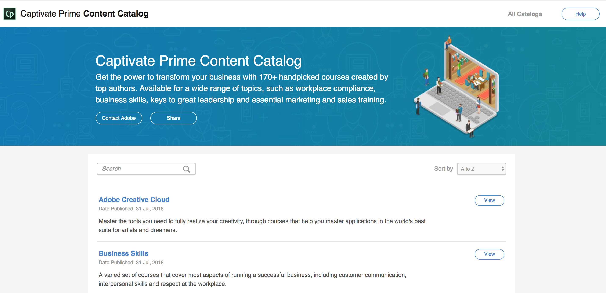

# INNEHÅLLSKATALOG FÖR LEARNING MANAGER

<!--Learning Manager introduces Content Catalog-->

Innehållskatalog stöds inte i en Azure-instans av Learning Manager.

* **Kurs** avser en enda konsolidering av Verk och eLearning-moduler inom ett specifikt ämne som skapas och tillhandahålls Kunden med Adobe Learning Manager.
* **Content Contributor** är ägare till kurser som har gett Adobe behörighet att ställa ut och underlicensiera sådana kurser på Adobe Learning Manager.

Learning Manager introducerar Content Catalog, en uppsättning med färdiga innehållsbaser som du kan köpa. Du kan följa kurser i företagskunskap, efterlevnad av regler på arbetsplatsen, Adobe Creative Cloud och teknik på vår utvalda innehållsplats.

I den vänstra rutan klickar du på Content Marketplace och sedan på **[!UICONTROL Creative Cloud Training]**.

<!---->

Klicka på för att se katalogdetaljer och kurser i varje katalog **[!UICONTROL View]**. I det nya fönstret visas alla kurser.

<!---->

Om du vill se information om kursen klickar du på **[!UICONTROL Visit]**. Använd kryssrutorna för att välja de kurser du är intresserad av.

* Du kan dela de valda kurserna med andra genom att välja  **[!UICONTROL Share]**.
* Du kan kontakta Adobe genom att markera  **[!UICONTROL Contact Adobe]**.

<!---->

Din e-postklient öppnas som standard i båda instanserna. Om du har valt specifika kurser med kryssrutorna läggs deras URL-adresser automatiskt till i e-postmeddelandet.

Om din e-postklient inte öppnas som standard kan du skicka ditt intresse via e-post till `learningmanagercontentcontentadmin@adobe.com`.

Du måste vara inloggad på Learning Manager för att få tillgång till innehållskatalogen.
