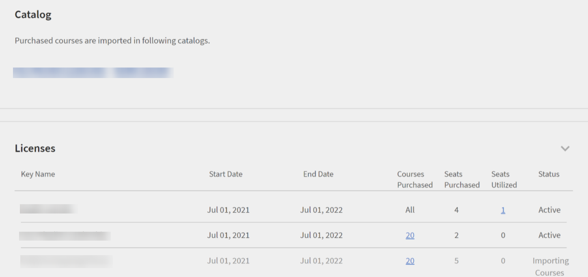

# Content Marketplace

Learning Manager erbjuder nu Content Marketplace så att du kan utforska och köpa utbildningar. Utforska över 70 000 kurser som täcker ett brett ämnesområde och som finns i flera format. Välj mellan kurerade spellistor som tillgodoser en mängd olika roller och uppfyller dina behov av lärande och kompetenshöjning.

I Administratörsappen finns det ett nytt alternativ **[!UICONTROL Content Marketplace]**, som du hittar på den vänstra panelen.

Användarna kan köpa från utvalda spellistor som täcker olika ämnen eller köpa hela katalogen.

På sidan visas två flikar, Företagsutbildning och Creative Cloud. Den första panelen öppnar marknaden där du kan hämta kurser åt dina elever. Den senare öppnar innehållskatalogen.

På sidan Företagsutbildning i administratörsappen kan du bjuda in användare och hämta Express Interest-rapporten och även köpa hela katalogen eller den utvalda spellistan.

**Bjud in användare**

Bjud in användare till Content Marketplace för att utforska innehåll och uttrycka intresse. Administratörer kan antingen bjuda in alla elever på kontot eller bjuda in utvalda elever. Du måste bjuda in elever för att ge dem åtkomst.

En elev kan också återkallas från alternativet Content Marketplace. Klicka på länken **[!UICONTROL Revoke Access]** om du vill återkalla åtkomsten.  Användarna kommer inte längre att kunna se sidan Content Marketplace i elevappen.

Det här alternativet är valt som standard för alla nya konton. För befintliga konton måste administratören bjuda in användarna att utforska marknadsplatsen.

## Inköp

Du får obegränsad tillgång till hela kursbiblioteket. Klicka på knappen **[!UICONTROL Purchase]** för att hämta ett inköpsbeställandeformulär.

*Ange antalet platser att köpa*

Ange antalet platser som du vill köpa kurserna för. Hämta formuläret för inköpsbeställning och skicka sedan formuläret till säljteamet hos Learning Manager.

Teamet kommer sedan att validera informationen och sedan generera en nyckel, som kommer att tillhandahållas dig. Det här är aktiveringsnyckeln som du använder för att ge dina användare åtkomst till innehållserbjudandet.

När nyckeln har genererats av CSAM-teamet kan administratören använda nyckeln för att importera kurserna och migrera kurserna till den befintliga katalogen eller den nya katalogen.

Under migreringen av kurser visas statusen som **[!UICONTROL Importing Courses]**. När migreringen har slutförts får administratören ett meddelande om att migreringen har slutförts och slutförts.

Avsnittet **[!UICONTROL Licenses]** visar sedan alla licenser som har förvärvats för kontot.

Administratören kan se länkarna till de köpta katalogerna på sidan Katalogöversikt.

När kurserna har lagts till i katalogen kan administratören bevilja olika användare eller användargrupper åtkomst till utbildningarna.

*Bevilja användare och användargrupper åtkomst till utbildning*

## Express interest-rapport

När en elev klickar på Uttryckt intresse för katalog i elevappen registreras intresset i en intresseanmälan. Administratören kan hämta rapporten. Rapporten (csv) innehåller följande fält:

* Katalognamn
* Antal användare som uttryckt intresse
* E-postadress till användaren som uttrycker intresse

## E-postmallar

Du kan använda tre e-postmallar till stöd för det här arbetsflödet:

1. **[!UICONTROL Content Activation Successful]:** Det här skickas när ett innehåll med ett nyckelnamn har köpts. All utbildning som har köpts är nu tillgänglig.
1. **[!UICONTROL Automated User Upload Failure]:** Detta skickas när den automatiska uppdateringen av CSV i kontot av någon anledning misslyckas.
1. **[!UICONTROL Invite Users to Explore Content]:** Det här är en inbjudan som skickas till elever per e-post när administratören köpte kurser. Administratören kan visa rapporten med uppgivna intressen för att förstå de övergripande kraven och fatta köpbeslutet.

1. Köpta kurser kan inte läggas till i återkommande certifikat.
1. Köpta kurser kan inte delas med kollegiala konton.
1. Köpta kurser kan förbrukas av alla användare som får tillgång till det. Konfigurera katalogsynligheten för att begränsa visningen av köpta kurser till vissa användare.
1. Köpta kurser kan inte förbrukas när aktiveringsnyckeln upphör att gälla. Köp/aktivera en annan nyckel för att tillåta förbrukning.

## Innehållsnav i Content Marketplace

Med innehållsnav kan administratörer och ämnesområdesexperter (SME) välja ut spellistor som krävs från elevappen. När formuläret har valts ut kan administratörer hämta det och dela det med försäljningsagenten i Adobe.

En administratör kan bjuda in små och medelstora företag att välja ut den spellista som de är intresserade av.

*Starta innehållsnavet från marknadsplatsen*

Innehållsnav är tillgänglig i elevrollen för alla administratörer. Administratörer gör det möjligt för små och medelstora företag att välja ut den spellista som de är intresserade av att köpa.

Sidan Innehållsnav är alltid synlig för administratörer i deras elevroll eftersom den gör det möjligt för dem att enkelt välja ut spellistor. Administratörer kan göra den här sidan tillgänglig för begränsade ämnesexperter på deras konto så att du lättare kan välja ut rätt spellista. Gå bara till sidan Företagsutbildning på administratörssidan och vidta åtgärder för att ge åtkomst.

*Visa resurser i innehållsnavet*

Learning Manager gör det också möjligt för administratörer att ladda ner en utvalda spellista och dela den med Adobe försäljningsteam. Innan du laddar ned urvalslistan, går du till Innehållsnav och väljer ut en spellista genom att lägga till en spellista i ditt bibliotek.

Klicka sedan på **[!UICONTROL Content Marketplace]** > **[!UICONTROL Enterprise Training]** > **[!UICONTROL Purchase section]** > **[!UICONTROL Curated Playlists]** som administratör. Klicka på knappen **[!UICONTROL Purchase]** för att ladda ned formuläret för inköpsbeställning som innehåller information om din utvalda spellista.

*Hämta formuläret för inköpsbeställning*

Kurserna och spellistan som du ser i innehållsnavet är desamma som de som visas på Content Marketplace. Innehållsnav ger bara administratörer och begränsade små och medelstora företag möjlighet att välja ut spellista enkelt för inköp.
