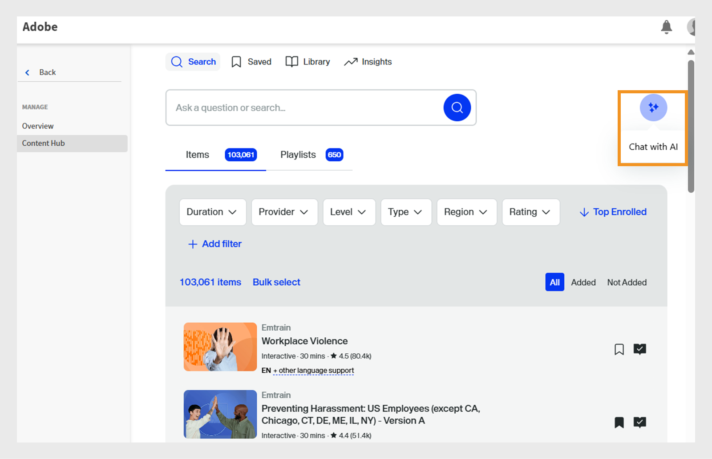

# Kurera Go1-kurser till en utbildningsväg

Administratörer behöver ofta välja kurser från flera databaser eller kataloger, vilket gör det svårt att identifiera de bästa alternativen. Detta är särskilt utmanande med Go1, där tusentals kurser finns tillgängliga. För att förenkla detta erbjuder vi en AI-driven kurateringsfunktion direkt i flödet för att skapa utbildningsvägar. Detta hjälper administratörer att snabbt upptäcka och välja de mest relevanta kurserna

Lägg till Go1-kurser direkt till utbildningsvägar och certifieringar. Skapa utbildningsvägar som innehåller Go1-kurser så att eleverna får tillgång till utvalda Go1-kurser som en del av utbildningen.

>[!INFO]
>
>Du behöver en aktiv Go1-licens för att lägga till Go1-kurser till utbildningsvägar eller certifieringar. Läs den här [artikeln](/help/migrated/administrators/feature-summary/content-marketplace.md) om du vill veta mer om Go1-licensinformation.

## Skapa en utbildningsväg

Så här skapar du en utbildningsväg med Go1-kurser:

1. Logga in på Adobe Learning Manager som administratör.
2. Välj **[!UICONTROL Learning Paths]** i den vänstra navigeringsrutan.
3. Välj **[!UICONTROL Add]**.

   
   _Välj Lägg till i avsnittet Utbildningsvägar för att skapa och organisera nya strukturerade utbildningsprogram för dina elever_

4. Ange de obligatoriska uppgifterna och välj **[!UICONTROL Save]**. Mer information finns i [artikeln](/help/migrated/administrators/feature-summary/learning-paths.md).
5. Du kan lägga till kurser i en utbildningsväg på följande sätt:

   * **[!UICONTROL Add Courses or Learning Paths]**: Lägg till befintliga kurser eller utbildningsvägar i Adobe Learning Manager.
   * **[!UICONTROL Curate content from Go1]**: Lägg till kurser från Go1-plattformen.
6. Välj **[!UICONTROL Curate content from Go1]**.

   
   _Lägg till Go1-kurser i din spellista för kompetensuppbyggnad för säljingenjörer så att du kan utöka utbildningsalternativen med utvalt innehåll från tredje part_
7. Administratörer kan skapa en spellista på följande sätt:

   * Använder **[!UICONTROL Go1 AI Assistant]**. Mer information finns i [Go1 AI Assistant](/help/migrated/administrators/feature-summary/content-marketplace/curate-go1-playlist.md#go1-ai-assistant).
   * Välj **[!UICONTROL Library]** i **[!UICONTROL Create playlist]** och välj något av följande:
a. **[!UICONTROL with AI]**: Skapa en spellista med hjälp av AI. Mer information finns i det här [avsnittet](/help/migrated/administrators/feature-summary/content-marketplace/curate-go1-playlist.md#create-a-playlist-with-ai).
b. **[!UICONTROL by myself]**: Skapa en spellista genom att manuellt lägga till kurser i den. Mer information finns i det här [avsnittet](/help/migrated/administrators/feature-summary/content-marketplace//curate-go1-playlist.md#create-a-playlist-manually).

### Go1 AI Assistant

Adobe Learning Manager tillhandahåller AI-driven hjälp för att förenkla kursurvalet för administratörer. Med AI-assistenten på sidan Innehållsnav kan administratörer ställa frågor, få personliga rekommendationer och skapa spellistor direkt. Dessutom är AI-stödet integrerat i flödet för att skapa utbildningsvägar, vilket hjälper administratörer att snabbt identifiera de mest relevanta kurserna från stora kataloger, till exempel Go1. Dessa funktioner effektiviserar kurateringsprocessen, sparar tid och ser till att eleverna får det bästa innehållet.

Skapa en spellista med AI:

1. Välj alternativet **[!UICONTROL Chat with AI]** på innehållsnavet **Go1**.

   
   _Skärmen Innehållsnav visar alternativet Chatta med AI, där administratörer kan interagera med AI-assistenten för att ställa frågor_

2. Skriv frågan och välj **[!UICONTROL Send]**.

   
   _AI-assistentskärm där administratörer kan skriva in frågor, få kursrekommendationer och skapa en spellista som är anpassad efter deras behov_
3. Välj kompetenserna och sedan **[!UICONTROL Compile into one list]**.

   
   _AI-assistentskärmen visar de relevanta kunskaperna för att välja och kompilera till spellista_
4. Välj **[!UICONTROL Convert to Playlist]**.

   
   _AI-assistentskärmen visar alternativet Konvertera till spellista för att sammanställa alla kurser till spellista_

5. Välj **[!UICONTROL View Playlist]**.

   
   _AI-assistentskärmen visar alternativet Visa spellista för att publicera och importera spellistan till utbildningsvägen_

6. Välj **[!UICONTROL Publish]** för att skapa spellistan. Du kan skapa ytterligare spellistor i Go1 och lägga till dem på en utbildningsväg.
7. Välj **Ja** i bekräftelsemeddelandet.
8. Välj spellista från **[!UICONTROL Select playlist to import prompt]**.

   
   _Markera och importera spellistan Sales Engineer Skills Enhancement från biblioteket Go1 i Adobe Learning Manager_

9. Välj **[!UICONTROL Add Playlists to Learning Path]** och sedan **[!UICONTROL Publish]**.

Kurserna i spellistan läggs till i utbildningsvägen. Administratörer kan sedan registrera elever som omedelbart kan börja ta kurserna.

### Skapa en spellista med AI

Administratörer kan skriva beskrivningen av spellistan i AI-dialogen. AI kommer att välja ut de relaterade kurserna och skapa en spellista baserat på kraven. AI genererar spellista genom att tolka utbildningsmålet eller uppmaningen som tillhandahålls av användaren. När du skapar en spellista kan administratörer välja att strukturera innehåll &quot;med AI&quot; vilket gör att systemet kan använda stora språkmodeller för att förstå de angivna utbildningsmålen och innehållspreferenser som längd och typ. AI söker sedan i innehållsbiblioteket efter relevanta utbildningsobjekt som matchar dessa kriterier.

1. Välj **[!UICONTROL Create playlist]** och sedan **[!UICONTROL with AI]**.

   
   _Skapa kurerade spellistor med AI, vilket möjliggör automatiserade kursrekommendationer som är anpassade efter elevens behov_

2. Skriv en kort beskrivning av spellistan i textfältet **[!UICONTROL Enter your learning goal]**. _Skapa t.ex. en kurerad utbildningsspellista för säljtekniker som fokuserar på att förbättra produktkunskap, teknisk kommunikation, kundengagemang och försäljning av lösningar_.

   
   _Skriv in ditt utbildningsmål för att skapa en anpassad spellista, så att Adobe Learning Manager kan rekommendera målinriktade kurser som är anpassade till dina elevers behov_

3. Välj **[!UICONTROL Next]**. Kommandotolken visar de färdigheter, den kurslängd och den kurstyp som krävs för urvalet.
4. Välj de kunskaper som krävs.

   
   _Välj kompetenser från listan för att välja ut kurser för säljteknikern_

5. Välj kurslängd och typ för din spellista.
   
   _Välj längd och typ av kurser för att välja ut kurser för säljteknikern_

6. Välj **[!UICONTROL Generate playlist]**. Spellistan skapas med 10 kurser på 2 sidor och administratörer kan använda den för att skapa en utbildningsväg.

   
   _Se över din utvalda spellista med kompetenshöjande säljtekniker i Adobe Learning Manager_

7. Bläddra och lägg till en bild i spellistan genom att välja **[!UICONTROL Select Image]**.
8. Ändra titeln med hjälp av tillgängliga AI-alternativ:

   * **[!UICONTROL Improve writing]**: Förfina den befintliga titeln så att den blir tydligare.
   * **[!UICONTROL Generate title]**: Skapa automatiskt en ny titel baserad på innehållet eller kontexten.

   
   _Go1 skärm för att skapa spellistor med AI-alternativ för att förbättra spellistans titel_

9. Ändra beskrivningen med hjälp av de tillgängliga AI-alternativen:
   * **[!UICONTROL Improve writing]**: Förfina den befintliga beskrivningen för att göra den tydligare.
   * **[!UICONTROL Generate description]**: Skapa automatiskt en ny beskrivning baserad på innehållet eller kontexten.
   * **[!UICONTROL  Make it shorter]**: Korta ned texten eller titeln samtidigt som du behåller huvudidén.

   
   _Go1 skärm för att skapa spellistor med AI-alternativ för att förbättra spellistans beskrivning_

10. Välj **[!UICONTROL Add item]** för att lägga till fler kurser i spellistan.

11. Välj **[!UICONTROL Publish]** för att skapa spellistan. Du kan skapa ytterligare spellistor i Go1 och lägga till dem på en utbildningsväg.
12. Välj **Ja** i bekräftelsemeddelandet.
13. Välj spellista från **[!UICONTROL Select playlist to import prompt]**.

   
   _Markera och importera spellistan Sales Engineer Skills Enhancement från biblioteket Go1 i Adobe Learning Manager_

14. Välj **[!UICONTROL Add Playlists to Learning Path]** och sedan **[!UICONTROL Publish]**.

Kurserna i spellistan läggs till i utbildningsvägen. Administratörer kan sedan registrera elever som omedelbart kan börja ta kurserna.

>[!NOTE]
>
>Administratörer kan också skapa spellistor direkt från sidan Innehållsnav. Visa [Innehållsnav](/help/migrated/administrators/feature-summary/content-marketplace.md#content-hub) för mer information.

## Skapa en spellista manuellt

Välj manuellt de kurser som bäst motsvarar elevernas krav och välj ut ytterligare relevanta kurser.

Så här skapar du en spellista manuellt:

1. Välj **[!UICONTROL Create playlist]** och sedan **[!UICONTROL by myself]**.

   
   _Skapa en spellista manuellt som ger administratörer full kontroll och möjlighet att välja kurser baserat på specifika elevbehov_

2. Bläddra och lägg till en bild i spellistan genom att välja **[!UICONTROL Select Image]**.
3. Ange titel och beskrivning för spellistan.

   
   _Lägg till en titel och en beskrivning i din spellista i Adobe Learning Manager för att tydligt definiera dess syfte och hjälpa elever att utvecklas mot riktade färdigheter_

4. Välj **[!UICONTROL Create]**.
5. Välj **[!UICONTROL Add item]** för att lägga till de relaterade kurserna.

   
   _Lägg till objekt i din spellista för kompetensutveckling för säljtekniker i Adobe Learning Manager för att välja ut målinriktade kurser_

6. Sök efter och välj de kurser som krävs.
7. Välj **[!UICONTROL Publish]**. Spellistan har skapats med relaterade kurser.
8. Välj **Ja** i bekräftelsemeddelandet.
9. Välj spellista från **[!UICONTROL Select playlist to import prompt]**.
10. Välj **[!UICONTROL Add Playlists to Learning Path]** och sedan **[!UICONTROL Publish]**.

Kurserna i spellistan läggs till i utbildningsvägen. Administratörer kan sedan registrera elever som omedelbart kan börja ta kurserna.

## Hantera Go1-spellistor

Administratörer kan hantera skapade Go1-spellistor genom att duplicera, dela eller ta bort dem.

### Duplicera spellistan

Så duplicerar du spellistan:

1. Logga in på Adobe Learning Manager som administratör.
2. Välj **[!UICONTROL Content Marketplace]**.
3. Välj **[!UICONTROL Content Hub]** och sedan **[!UICONTROL Library]**.
4. Välj spellista och sedan **[!UICONTROL Edit]**.
   
   _Go1-spellistans skärm visar alternativ för att redigera spellistan_
5. Markera ellipsen och välj sedan **[!UICONTROL Duplicate]**.
   
   _Hanteringsskärmen för spellistan, markerar dubblettalternativet_

Den valda spellistan dupliceras och läggs till i innehållsbiblioteket Go1

### Ta bort spellistan

Så här tar du bort spellistan:

1. Logga in på Adobe Learning Manager som administratör.
2. Välj **[!UICONTROL Content Marketplace]**.
3. Välj **[!UICONTROL Content Hub]** och sedan **[!UICONTROL Library]**.
4. Välj spellista och sedan **[!UICONTROL Edit]**.
   
   _Go1 Playlist-skärm med alternativ för att redigera spellistan_
5. Markera ellipsen och välj sedan **[!UICONTROL Delete playlist]**.
   
   _Hanteringsskärmen för spellistan visar alternativet Ta bort spellista_

Den valda spellistan raderas från biblioteket Go1.

### Dela spellistan

Alternativet Dela spellista stöds inte i Go1-integreringen med Adobe Learning Manager. Det här alternativet kommer att tas bort från gränssnittet i nästa version.

## Kursgränsen har överskridits

När administratörer lägger till Go1-kurser till en utbildningsväg kan de se ett fel om de nyligen tillagda kurserna inte har synkroniserats till Adobe Learning Manager än. Kurserna kommer att vara tillgängliga inom 48 till 72 timmar.

Om du lägger till spellistan nu inkluderas endast de kurser som redan är synkroniserade.

Om du vill inkludera alla kurser rekommenderar vi att du väntar tills synkroniseringen är klar innan du lägger till spellistan på en utbildningsväg.

## Go1 kurser i certifieringar

Administratörer kan lägga till Go1-kurser i certifieringsprogram i Adobe Learning Manager. När administratörer skapar en certifiering kan de söka efter och välja kurser från innehållskatalogen Go1. Alla Go1-kurser som importeras via Go1-planen är tillgängliga för urval inom certifieringsarbetsflödet.

Certifieringar som innehåller Go1-kurser kan konfigureras som antingen permanenta eller återkommande. Vid återkommande certifieringar förnyas certifikatet automatiskt efter det definierade tidsintervallet, så att eleverna kan gå tillbaka till Go1-kurserna och bibehålla sin certifieringsstatus.

I [Certifieringar](/help/migrated/administrators/feature-summary/certifications.md) finns mer information om hur du skapar certifikat.
