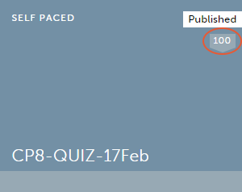
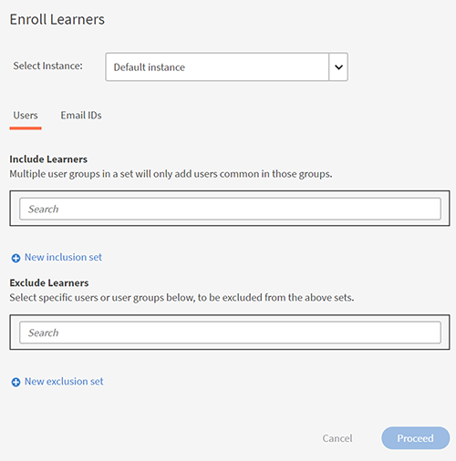

# Skapa kursmoduler, instanser och utbildningsprogram

Det här dokumentet består av hjälp med att skapa kursmoduler, instanser och kurser för administratörsrollen.

Författare skapar kurser. Elever kan gå kurserna och administratörer kan spåra elevers resultat baserat på kursförbrukningen.

## Översikt {#overview}

Författare skapar kurser. Elever följer sedan kurserna och administratörer kan spåra elevernas resultat baserat på kursförbrukningen. Administratörer kan se kurser som skapats av författare och utföra vissa aktiviteter som förklaras i det här avsnittet. Administratörer kan skapa unika utbildningsprogram med en fördefinierad uppsättning kurser för elever.

## Skapa instans av en kurs {#createinstanceofacourse}

### Hantera instanser

I den här utbildningen får du lära dig redigera instansinformation och instansegenskaper.

Om du inte kan starta utbildningen kan du skriva till <almacademy@adobe.com>.

### Skapa en instans

När en författare har skapat en kurs kan du skapa instanser av kursen. Genom att skapa instanser av en kurs kan du erbjuda samma kurs till dina elever vid olika tidsperioder. Elever kan välja vilken instans som helst och registrera sig. Du kan konfigurera varje instans så att den har sin egen uppsättning med utmärkelsetecken, feedback och andra inställningar.

Om du vill skapa en instans

1. I webbappen Administratör klickar du på **[!UICONTROL Courses]** i den vänstra rutan.
1. Välj den kurs som krävs i listan över kurser och klicka på **[!UICONTROL View Course]**.

   

   *Visa en kurs*

1. Skapa instanser genom att klicka på **[!UICONTROL Instances]** i den vänstra rutan. Varje kurs har en instans som standard. Du kan antingen ändra standardinstansen eller lägga till instanser. Du kan inte ta bort kursinstansen.
1. Om du vill skapa en instans klickar du på **[!UICONTROL Add New Instance]** i det övre högra hörnet av kursinformationen. En ny instans av kursen visas.
1. Ange instansens egenskaper:

   * I dialogrutan **[!UICONTROL Instance Name]** -fältet anger du namnet på den instans som du vill associera med kursen. Se till att du använder ett unikt namn för instansen.
   * Ange deadline för slutförande för instansen. Eleverna måste få statusen slutförd för kursen senast detta datum.
   * Klicka **[!UICONTROL Show More Options]** om du vill visa andra alternativ för tidsgräns.
   * **[!UICONTROL Enrollment Deadline]:** Detta är det datum då en elev förväntas registrera sig för ett utbildningsobjekt vid egenregistrering.
   * **[!UICONTROL Unenrollment Deadline]:** Du kan välja att begränsa avregistrering av eleven själv genom att ha en deadline för avregistrering.

   En administratör kan besluta att ha tidsgränser för slutförande av en kurs eller ett utbildningsprogram baserat på behov. Vi rekommenderar dock att du har en för klassrums-/virtuella klassrumsbaserade utbildningar.

   

   *Ange deadline för slutförande*

## Visa instansens egenskaper {#viewpropertiesoftheinstance}

*Visa instansens egenskaper*

1. **Moduler:** Antalet moduler som har skapats av kursförfattaren
1. **Elever registrerade:** Antalet elever som har registrerats för kursen av administratören.
1. **Sessioner:** Antalet virtuella klassrums- och klassrumsmoduler i kursen.
1. **Feedback har aktiverats:** Visar om L1-, L2- och L3-feedback har aktiverats för den här kursen.

## Ta bort en instans {#retireaninstance}

Utför stegen nedan om du vill ta en instans ur bruk.

1. I instansen klickar du på listrutan och väljer alternativet **[!UICONTROL Retire instance]**.

   

   *Ta bort en instans*

1. Klicka på fliken om du vill söka efter alla utfasade instanser **[!UICONTROL Retired]** på sidan Instanser.

## Återställa en instans {#restoreaninstance}

Så här återställer du en utfasad instans till ett aktiveringsläge:

1. I instansen klickar du på listrutan och väljer alternativet **[!UICONTROL Reopen instance]**.

   

   *Återställa en instans*

1. Instansen återställs nu till ett aktivt läge.

## Skicka e-postmeddelanden på instansnivå

Så här skickar du e-postmeddelanden på instansnivå till registrerade elever:

1. På sidan Instanser väljer du alternativen för en instans och klickar sedan på **[!UICONTROL Email Enrolled Learners]**.

*E-post till elever som har registrerat sig för instansen*

1. I dialogrutan Skapa meddelande väljer du Skriv som e-post. Ange ämne, skriv meddelandet och klicka på Spara. Utbildningen väljs ut automatiskt.

   

   *Skapa meddelande som e-post*

1. När du har klickat **[!UICONTROL Save]** visas ett bekräftelsemeddelande om att meddelandet har skapats. Klicka på för att publicera meddelandet **[!UICONTROL Publish Now]**.

   

### Registrera elever på kurser

Under den här utbildningen kommer du att lära dig hur du registrerar, avregistrerar och återregistrerar elever.

Om du inte kan starta utbildningen kan du skriva till <almacademy@adobe.com>.

### Registrera elever i olika instanser

1. Välj en kurs i listan över kurser.
1. Välj **[!UICONTROL Learners]** i den vänstra panelen.
1. Välj **[!UICONTROL Enroll]**.

   

   *Publicera kursen*

1. I dialogrutan [!UICONTROL **Registrera elever**] dialogrutan kan du:

   * Välj en instans för att registrera en elev från listrutan Välj instans.
   * Välj användaren eller användargrupperna eller båda i fältet Inkludera elever.
   * Välj de elever som du vill ska uteslutas från instansen i fältet Exkludera elever.
   * Längst ned i dialogrutan väljer du Ja om du vill att en eller flera elever ska registrera sig för den valda instansen.

1. Välj **[!UICONTROL Proceed]**.

   

   *Fortsätt till att registrera elever*

### Visa registreringsrapport för en instans

1. Välj en kurs i listan över kurser.
1. Välj **[!UICONTROL Learners]** i den vänstra panelen.
1. Välj **[!UICONTROL Actions]** > **[!UICONTROL Export]**.

Excel-filen innehåller kalkylblad för varje instans. Ett kalkylblad består av följande fält:

* Elever
* E-post
* Unikt användar-ID
* Kursnamn
* LO unikt ID
* Status
* Urvalskriterier
* Registreringsdatum/avregistreringsdatum (tidszonen UTC)
* Slutförandedatum (tidszonen UTC)
* Inlämningsdatum (tidszonen UTC)
* Påbörjad datum (tidszonen UTC)
* Quiz-poäng
* Chefens namn
* Adress
* användarstatus
* Expertområde
* Kommentarer
* Antal besök
* Besöksdatum
* Tidsstämplar (tidszonen UTC)
* Använd tid (i minuter)

>[!NOTE]
>
>Obs! Om du aktiverar multiregistrering läggs flera rader till i elevens betygsrapport för varje kurs (en rad för varje instans).
>
>Om du har ställt in rapporteringsautomatisering som endast förutser en rad per kurs måste du göra de nödvändiga justeringarna av rapporteringsautomatiseringen innan du aktiverar funktionen Flerregistrering.

## Ange eskaleringsnivå {#escalation}

För att skicka e-postmeddelanden måste en administratör uttryckligen välja eskaleringsnivån för att:

* Chef
* Chef och överhoppad chefsnivå

*Ange eskaleringsnivå*

## Kursmoderering {#coursemoderation}

När en författare lägger till, uppdaterar eller tar bort moduler och återpublicerar en kurs får alla administratörer ett meddelande om detta. Administratörer kan sedan visa ändringarna, jämföra det gamla och det nya innehållet genom att klicka på länken och godkänna eller avslå ändringarna.

Om du vill aktivera Kursmoderering klickar du på **[!UICONTROL Settings]** > **[!UICONTROL General]**. Välj **[!UICONTROL Course Moderation]** för att aktivera funktionen.

*Aktivera kursmoderering*

Klicka på meddelandet för att se de ändringar som författaren har gjort i kursen. Godkänn eller avvisa sedan de ändringar som författaren har gjort. Om du väljer att godkänna kommer kursen att publiceras igen. Om du avvisar uppdateringarna finns den tidigare versionen av kursen kvar. I båda fallen skickas ett meddelande till författaren.

*Författarförfrågningar för kursuppdateringar*

Om det finns flera författare som uppdaterar samma kurs kommer den senaste eller senast utförda ändringen att återspeglas i administratörens meddelande. Sedan kan du godkänna eller avvisa de senaste ändringarna.

## Lägg till feedback om L1 och L3 {#addl1andl3feedback}

Du kan lägga till L1- och L3-feedbackalternativ medan du skapar kurserna:

1. Klicka på Kurser i den vänstra rutan när du har loggat in som administratör. Lista över alla kurser visas på höger sida.
1. Klicka på den kursruta som du vill lägga till feedback om L1 eller L3 för
1. Klicka på instance default (standardinställning) i den vänstra rutan.
1. Klicka på växlingsknappen för cirkel på bredvid L1- eller L3-feedback för att aktivera den.
1. Lägg till L3-feedbackfrågan i textområdet under L3-frågan.

## Obligatorisk L1-feedback {#mandatory-l1-feedback}

Du kan göra alla frågor eller den första frågan obligatoriska i en L1-feedback.

*Gör alla frågor eller den första frågan obligatoriska i en L1-feedback*

Nu kan du skapa frågorna, som nu blir obligatoriska.

*Skapa frågorna*

Om de två obligatoriska frågorna av någon anledning inte har någon text visas frågorna inte i feedbackformuläret.

>[!NOTE]
>
>Det räcker inte att du aktiverar dessa inställningar på utbildningsprograminstansen. Du måste också aktivera dessa inställningar på nivån Kursinstans för varje kurs i Utbildningsprogrammet.

Om du aktiverar standardsidan för instanser **[!UICONTROL Make All Questions Mandatory]**, ärver alla nya instanser som skapas därefter dessa inställningar.

*Visa sidan Standardinställningar för instans*

## L1-feedback på kursnivå {#l1-feedback-course-level}

I tidigare versioner av Learning Manager kunde en administratör aktivera L1-feedback för utbildningsprogrammet.

I den här versionen av Learning Manager kan administratören skicka feedback om L1 för alla kurser som ingår i utbildningsprogrammet. Administratören måste se till att L1-feedback är aktiverad för alla kurser på kursinstansnivå.

1. Om du vill aktivera L1-feedback för varje kurs klickar du på i Admin-appen **[!UICONTROL Learning Programs]** > **[!UICONTROL View Learning Program]**.

1. Klicka **[!UICONTROL Instances]** > **[!UICONTROL L1 Feedback Enabled]**.

1. Aktivera alternativet **[!UICONTROL Enable for Each Course]**.

   

   *Aktivera kursfeedback*

   Endast aktivering av den här funktionen på nivån Utbildningsprogram aktiverar inte L1-feedback för kurserna i det här programmet. Gå till varje kurs i utbildningsprogrammet och aktivera växlingsknappen L1-feedback för att aktivera L1-feedback.

   

   *Aktivera L1-feedback för varje kurs*

   Om L1-feedback är aktiverad för alla kurser men är inaktiverad i instansen för utbildningsprogrammet kommer feedback om L1 inte att utlösas för kurserna.

## Språkspecifika frågeformulärsrapporter

Quizrapporter hjälper till att utvärdera en elevs resultat efter slutförande av ett utbildningsprogram eller en kurs.

Learning Manager underlättar för närvarande inlärning i 13 gränssnittsspråk och 32 innehållsspråk. Även om det här alternativet är elevvänligt och underlättar för oss att stödja våra globala elever är det besvärligt för administratörer att hämta rapporter som de försöker hämta på olika platser.

Quiz-rapporter, visa data på olika språk förutsatt att kursen erbjuds på flera språk. Hittills har rapporter som skapats av Admin visat svar under varandra oberoende av vilket språk frågeformuläret användes på. **Till exempel**, om en användare har gjort ett quiz på nederländska kan administratören bara visa de quiz-rapporter som användare på nederländska försöker sig på åt gången. Administratören som har valt engelska som gränssnittsspråk kunde inte visa rapporter för alla användare samtidigt, oavsett språket som användes.

Detta korrigeras nu eftersom administratören nu kan visa alla rapporter på respektive språk som eleven försökt alla på en gång, oavsett vilken innehållsplats som valts. Quiz-försök på olika språk läggs till som ytterligare kolumner i frågeformulärsrapporten.

## Aktivera L1-feedback på kontonivå {#l1-feedback-account-level}

*Aktivera L1-feedback på kontonivå*

En administratör kommer att kunna aktivera L1-feedback för nyligen skapade kurser och utbildningsprogram genom att aktivera den här inställningen på kontonivå. Att aktivera den här inställningen påverkar dock inte befintliga kurser och utbildningsprogram

Om detta är aktiverat kommer feedback för alla nya utbildningar och nya instanser att vara aktiverad som standard. Om en författare/administratör besöker instansen, standardvärden och stänger av den manuellt, respekteras instansen.

Om du vill aktivera L1-feedback klickar du på **[!UICONTROL Settings]** > **[!UICONTROL Feedback]**.

*Visa sidan Feedback-inställningar*

Klicka **[!UICONTROL Edit]** i det övre högra hörnet och aktivera L1-feedback.

När en författare skapar en kurs visas på sidan Instans i Admin-programmet **[!UICONTROL L1 feedback]** aktiveras automatiskt för den nya kursen.

<!---->

Du kan också inaktivera L1-feedback genom att växla knappen **[!UICONTROL Enable]** som visas nedan:

*Aktivera eller inaktivera L1-feedback*

## Lägg till beskrivande frågor för L1- och L3-feedback {#descriptive}

Som en del av november-versionen av Learning Manager har ett alternativ för att lägga till beskrivande frågor tillhandahållits. Administratörer har möjlighet att lägga till dessa frågor för elever. Denna bestämmelse kompletterar standarduppsättningen med frågor som tillhandahålls av Learning Manager. Du kan också göra dem obligatoriska genom att välja alternativet under frågan.

Du kan lägga till två beskrivande frågor för L1-feedback och en beskrivande fråga för L3-feedback.

När du har aktiverat L1-feedback kan du visa alternativen som visas på följande ögonblicksbild.

*Lägg till beskrivande frågor för L1- och L3-feedback*

Om du vill att frågeformuläret ska visas för eleven omedelbart efter slutförandet av kursen kan du välja alternativet.

Nedan visas ett urval av L1-frågeformuläret som referens. Elever kan se frågeformuläret i nedanstående format. Test-1 och Test-2 är beskrivande frågor.

*Ett exempel på frågor om feedback på kurs*

När du har aktiverat L3-feedback kan du visa alternativen som visas på ögonblicksbilden nedan:

*Aktivera L3-feedback*

Fråga 2 är den beskrivande frågan för L3-feedback. Du kan göra det obligatoriskt genom att klicka på alternativet under frågan.

Nedan visas ett urval av L3-frågeformuläret som referens. Elever kan se frågeformuläret i nedanstående format.

*Visa L3-feedbackutdata*

## Ställ in L1- och L3-feedbackfrågeformulär {#setupl1andl3feedbackquestionnaire}

Du kan ställa in L1- och L3-feedbackfrågeformulär och även ställa in påminnelser på kontonivå.

1. Klicka **[!UICONTROL Settings]** och därefter **[!UICONTROL Feedback]** i den vänstra rutan när du har loggat in som administratör.\
   Sidan med feedbackinställningar visas med två flikar: **[!UICONTROL L1 Feedback]** och **[!UICONTROL L3 Feedback]**.\
   **[!UICONTROL L1 Feedback]** -fliken består av en lista med standardvärden **[!UICONTROL L1 feedback]** frågeformulär för klassrumskurser och kurser i egen takt tillsammans med påminnelseinställningar. in **[!UICONTROL L3 Feedback]** -fliken kan du visa standardinställningarna för L3-feedback och påminnelser.

1. Klicka på Redigera längst upp till höger på sidan om du vill ändra den befintliga enkäten.\
   in **[!UICONTROL L1 Feedback]** kan du aktivera/inaktivera varje fråga genom att klicka på växlingsknappen Ja/Nej.\
   in **[!UICONTROL L3 Feedback]** kan du ändra standardsatsen för feedback.\
   Klicka **[!UICONTROL Add New Reminder]** längst ned på sidan och välja när påminnelserna ska skickas.

1. Klicka **[!UICONTROL Save]** längst upp till höger på sidan.

I L1-feedback kan du se två uppsättningar frågeformulär tillsammans med en standardfråga. Det första frågeformuläret avser kurser i egen takt som också kan användas för aktivitetsbaserade kurser. Andra uppsättningen enkäter kan användas för kurser av typen klassrum och virtuellt klassrum.

## Exportera checklistedata {#export-checklist-data}

Öppna en kurs som innehåller en checklista från listan över kurser. I den vänstra rutan visas ett alternativ **[!UICONTROL Checklist]**.

*Exportera checklistedata*

Klicka på alternativet och utför följande på kurssidan:

1. Markera instansen och modulen.
1. Klicka **[!UICONTROL Actions]** > **[!UICONTROL Export]** och exportera sedan checklisterapporten för eleven.

På fliken **[!UICONTROL Checklist]** kan instruktören exportera checklisterapporten från **[!UICONTROL Actions]** listruta.

CSV-rapporten innehåller följande fält:

* Användarnamn
* Mejladress till användare
* Chefens namn och e-postadress
* Utbildningsnamn
* Utbildningsinstans
* Instruktörens namn och e-postadress
* Inskickat den
* Utvärderingsstatus
* Frågor med faktisk text
* Användarstatus
* Profil
* Aktiva fält

När du laddar ned en rapport efter att du har valt ett statusfilter, kommer den nedladdade elevens betygsrapport att innehålla elevdata baserat på det tillämpade statusfiltret. Det tillagda filtret visas även för anpassad administratör och chef när de ska generera ett elevintyg.

## Visa kurser {#viewingcourses}

Du som är administratör kan visa en lista över alla tillgängliga kurser.   Klicka **[!UICONTROL Courses]** i den vänstra rutan för att visa listan över kurser med sök- och filtreringsalternativ. Du kan också visa kursens effektivitetsprocent för varje kurs på kursens miniatyrbilder.

>[!NOTE]
>
>Du kan ta en kurs ur bruk efter att den har konsumerats av elever eller när du vill lägga till en viss kurs efter publicering. Du kan endast dra in en kurs när den är i publicerat tillstånd. Du kan visa en lista över alla utfasade kurser genom att klicka på **[!UICONTROL Retired]** -fliken.

## Visa quiz-poäng {#viewquizscores}

1. Klicka på kursnamnet på kursens miniatyrbild.
1. Klicka på Quiz-poäng i den vänstra rutan.

Du kan visa quiz-poängen för en viss kurs baserat på användarnamn eller baserat på varje fråga. Välj Efter användare eller Efter fråga flikar därefter.

Välj instanstypen från rullgardinsmenyn för att visa poängen baserat på varje instans av kursen.

## Hantera elevlista för en kurs {#managelearnerslistforacourse}

1. Klicka på kursnamnet på kursens miniatyrbild.
1. I den vänstra rutan klickar du på **[!UICONTROL Learners]**.

*Välj elever i en kurs*

Du kan utföra följande åtgärder från sidan Elever:

* Välj den elev som du vill ta bort och klicka på [!UICONTROL **Åtgärder**] > [!UICONTROL **Ta bort**].
* Markera den elev vars närvaro du vill markera och klicka på [!UICONTROL **Åtgärder**] > [!UICONTROL **Markera som slutfört**].

Klicka på för att tillåta elever att återställa en modul och konsumera den igen [!UICONTROL **Återställ**]. Klicka på Ja i dialogrutan som visas för att bekräfta återställningen. Moduler som har slutförts kan inte återställas. Endast felaktiga eller ofullständiga moduler kan återställas.

Du kan också exportera elevlistan i ett Excel-ark. För att exportera listan över elever klickar du på [!UICONTROL **Åtgärder**] > [!UICONTROL **Exportera**].

>[!NOTE]
>
>Om det finns flera instanser för en kurs visas elevlistan i Excel på varje flik separat. Elevlistan består av elevnamn, status och urvalskriterier. Elevstatus kan **Inte påbörjad**, eller **Pågår**, eller **Slutfört**.

## Exportera elevnärvaro {#attendance}

För alla klassrum och VC-kurser kan du ladda ned listan över elever som har deltagit i denna kurs, för alla instanser.

På sidan med kursinformation klickar du på **[!UICONTROL Attendance and Scoring]** i den högra rutan.

I det övre högra hörnet på sidan klickar du på **[!UICONTROL Actions]** listruta. Klicka sedan på alternativet **[!UICONTROL Export Learner List (PDF)]**.

*Exportera listan över elever som PDF*

PDF kan du visa samma uppsättning med elever som en instruktör gör.

När du hämtar PDF kan du se tidszonen (i UTC) som användes när kursen skapades.

## Exportera elever i väntande godkännandetillstånd

En administratör, chef eller anpassad administratör kan exportera data för elever som har statusen Väntande på registrering till godkännande. Du kan exportera data via **Kurs > Elev** och klicka på listrutan Åtgärd.

Alternativet finns när ingen elev är registrerad/väntar på godkännande av chefsgodkänd kurs och en tom rapport genereras. Du kan också exportera när elever är i väntande tillstånd för godkännande, registreringsläge, väntande tillstånd och avregistrerat tillstånd.

Rapporten innehåller data för aktiva, borttagna och avbrutna användare om de väntar på godkännande. Rapporten innehåller också data om interna och externa användare som är i väntande läge för godkännande.

Om en elev som tidigare befann sig i väntande tillstånd för godkännande avregistrerar sig, kommer hans/hennes meritlista inte att finnas med i rapporten. Även om en elev som tidigare befann sig i läget Väntande godkännande och registreras till kursen av admin/chef/anpassad admin-registrering, finns hans/hennes post i rapporten.

## Visa feedback om L1 och L3 {#viewl1andl3feedback}

Du kan visa L1-feedback från elever för en kurs och L3-feedback från chefer för elever.

1. Klicka på valfri kursruta i kurslistan.
1. Klicka på L1-feedback eller L3-feedback i den vänstra rutan för att se den feedback som tagits emot.
1. Välj instansen i listrutan för att visa återkopplingen för den specifika instansen.

## Förhandsgranska kurser {#previewcourses}

Administratören kan förhandsgranska kurser genom att klicka på **[!UICONTROL Preview as learner]** när du visar kursmodulerna.

1. Klicka **[!UICONTROL Courses]** i den vänstra rutan när du har loggat in som administratör.
1. Klicka på en kursruta i listan över kurser på sidan.
1. Klicka på Förhandsgranska som elev i den vänstra rutan och klicka på modulnamnet på sidan för att förhandsgranska kursmodulen i spelaren.

## Kurseffektivitet {#courseeffectiveness}

Kursens effektivitet utvärderas för att förstå nyttan av en kurs för eleven. Det är en kombination av resultat från elevfeedback på kursinnehållet, quizresultaten för en elev och chefens feedback som utvärderar en elev baserat på lärdomar från kursen.

Administratören kan visa kurseffektivitetsklassificeringen på kursens miniatyrbilder så som visas på ögonblicksbilden nedan. Du kan se betyget för den här kursen som 100.

<!---->

Värdet för kurseffektivitet har erhållits med beaktande av L1-, L2- och L3-feedbackvärden. Klicka på värdet för kurseffektivitet för att visa uppdelningen av varje feedback. Ett popup-fönster visas enligt nedan.

*Visa kurseffektivitet för L1-, L2- och L3-feedback*

I den här exempelögonblicksbilden fick 1 av 1 användare alla tre feedback, därav är poängen 100/100. Från den här tabellen kan du förstå att om någon av de tre återkopplingarna (L1, L2 och L3 ) inte ges för en kurs, har det en negativ inverkan på den totala effektiviteten. Klicka på nedåtpilen i det nedre högra hörnet av popup-fönstret för att se hur beräkningarna av kurseffektivitet görs.

*Beräkning av kurseffektivitet*

Enligt cirkeldiagrammet ovan viktas L3-feedback från chefen mer.

## Söka efter kurser och utbildningsprogram {#searchingcoursesandlearningprograms}

Adobe Learning Manager gör det enklare för dig att snabbt hitta de kurser/utbildningsprogram du väljer. Du kan söka efter dina kurser på två sätt:

1. Använda sökfältet. Klicka på sökikonen som visas i det övre högra hörnet. Ett sökfält visas. Skriv in kursnamnet eller nyckelord som är associerade med dina kurser för att hitta dina kurser/utbildningsprogram. Du kan också söka med fördefinierade taggar som Captivate, C, Java och HTML. Taggar är sökbara i sökfältet, vilket innebär att taggarna visas i sökfältet när du skriver.
1. Genom att filtrera listan över kurser/utbildningsprogram med filtren. Du kan filtrera kurserna efter tillstånd som Alla, Publicerade, Utkast och Utfasade. Utkastfilter visas inte i administratörsläge.

Du kan söka baserat på kompetenser genom att klicka på Kompetenser och välja dem. Som administratör kan du sortera kurserna på fyra sätt så att du lättare hittar den kurs du behöver. Klicka på Sortera efter och välj Alfabetisk stigande ordning, Alfabetisk fallande ordning, Kursens uppdaterade datum eller kursernas effektivitet.

<!---->

Du kan sortera utbildningsprogram på tre sätt: stigande i alfabetisk ordning, fallande i alfabetisk ordning och baserat på uppdaterat datum.

## Registrera elever {#enrollinglearners}

Du kan följa samma steg för att registrera elever för kurser, utbildningsprogram och certifieringar. Chefer kan även registrera elever under honom/henne med följande steg.

Administratören registrerar vissa elever för obligatoriska kurser enligt organisationens krav:

1. Håll muspekaren på publicerade kursplattor och klicka på Registrera elever.\
   Du kan även klicka på en publicerad kursruta och klicka på elever i den vänstra rutan. En sida med en lista med elever visas. Klicka på Registrera.\
   Dialogrutan Registrera elever visas.

1. Välj instansen i listrutan Välj instans. I listrutan visas alla instanser, inklusive aktiva, utfasade och utgångna instanser.

>[!NOTE]
>
>Administratören kan ta bort registrerade elever för en kurs genom att klicka på rullgardinspilen på elevsidan och genom att klicka **[!UICONTROL Actions]** > **[!UICONTROL Remove]**.

*Lägg till kommentarer när du registrerar elever*

*Registrera elever*

## Användare

+++Inkludera elever

Välj de användargrupper och enskilda elever (med e-post-ID eller namn) som du vill inkludera. Lägg till alla användargrupper i en överlappning under samma uppsättning. Om du vill lägga till en annan användargrupp i unionen använder du en ny inkluderingsuppsättning.

+++

+++Exkludera elever

Välj de användargrupper och enskilda elever (med e-post-ID eller namn) som du vill utesluta. Lägg till alla användargrupper i en överlappning under samma uppsättning. Om du vill lägga till en annan användargrupp i en union använder du en ny inkluderingsuppsättning.

+++

## Mejl-ID för användare

+++Mejl-ID

Kopiera och klistra in e-post-id för elever som du vill registrera, separerade med semikolon, kommatecken eller radavstånd. Använd kommandot **[!UICONTROL Validate Email Ids]** alternativ för att validera posterna. Alla ogiltiga poster visas markerade med rött. Ta bort eller korrigera dessa poster och fortsätt genom att klicka på **[!UICONTROL Proceed.]**

*Registrera elever*

Dialogrutan Sammanfattning visas med antalet användare från inkluderingsuppsättningen, exkluderingsuppsättningen och användare som redan är registrerade i kursinstansen.

+++

### Lägg till kommentarer när du registrerar elever {#enroll-comments}

<!----->

Som administratör eller chef kan du lägga till kommentarer när du registrerar elever för en kurs. Du kan nämna ytterligare information om kohorten av användare som registreras. Dessa data exporteras i kursrapporter.

Kommentaren är **inte** visas för eleven.

När en administratör genererar elevens kursrapport visas eventuella kommentarer i rapporten. Dialogrutan Sammanfattning visas med antalet användare från inkluderingsuppsättningen, exkluderingsuppsättningen och användare som redan är registrerade i kursinstansen.

På fliken **[!UICONTROL Enroll Learners]** dialogrutan expanderar du alternativet **[!UICONTROL Advanced Options]**. I dialogrutan **[!UICONTROL Additional Comment]** -fältet, anger du önskad kommentar.

*Lägg till kommentarer för elever*

## Sök efter registrerade användare {#searchforusers}

Sök efter registrerade användare i utbildningsobjektets elevavsnitt med hjälp av typbaserad sökning. Med Type Ahead-sökning kan du progressivt söka efter registrerade användare med hjälp av namn, e-post-ID och uuid.

*Genomgång av sökning efter registrerade användare*

Den här typen av sökning kallas ibland även automatisk komplettering, inkrementell sökning, sökning allteftersom du skriver, textbunden sökning eller direktsökning.

När du skriver för en elev eller en användargrupp i sökfältet hittas en eller flera matchningar för söktermerna och visas direkt för dig.

Processen gör att du kan hitta vad du letar efter på ett mycket snabbare och mindre besvärligt sätt än att utföra ett antal sökningar i en rad.

Elever eller användargrupper visas i alla instanser efter en sökning. För varje elev visas instansen där eleven är registrerad i **[!UICONTROL Instance]** -kolumnen.

*Visa sökresultat*

Med hjälp av funktionen för framförläsning kan du:

* Visa alla registrerade användare, oavsett instans.
* Visa alla användargrupper som har en eller flera registrerade användare.

När en sökning har utförts kan du inte filtrera elever efter instanser. Alternativet att välja en instans från **[!UICONTROL Select Instance]** Listrutan är inaktiverad.

Med sökresultaten kan du dessutom välja en elev eller användargrupp och utföra följande åtgärder:

* Avregistrera
* Markera slutförande
* Återställ modul

När du utför en sökning är alternativet Avregistrera > Massutskick i listrutan Åtgärder inaktiverat för kurs-/utbildningsprogrammet.

## Dela QR-kod med elever som ska registreras, slutföras eller båda {#shareqrcodewithlearnerstoenrollcompleteorboth}

Administratörer i Adobe Learning Manager kan dela QR-koderna med elever för att snabbt registrera sig för kursen. De tre olika QR-koderna används för att markera &quot;registrering&quot;, &quot;slutförande&quot; eller &quot;registrering och slutförande&quot; för en kurs.

Elever kan enkelt använda enhetsappen Adobe Learning Manager för att skanna respektive QR-kod.

**Gör så här för att hämta QR-koden**:

1. Klicka **[!UICONTROL Courses]** från avsnittet Utbildning på den vänstra navigeringspanelen.
1. Välj en kurs > **[!UICONTROL View course]**.
1. Klicka på **[!UICONTROL Instances]** > **[!UICONTROL More]** > **[!UICONTROL QR code]**.

   <!---->

1. Aktivera QR-koden och klicka sedan på hämtningsikonerna Registrera, Slutför och Registrera och slutför för att hämta en PDF-fil som innehåller QR-koden för var och en. Administratören kan sedan dela QR-koden med elever.

   

   *Dela QR-kod med utforskare*

## Kursens livscykel {#courselifecycle}

Kursens livscykel ser normalt ut så här:

**Utkast** - När en författare har skapat en kurs och sparat den. I det här läget är kursen inte tillgänglig för elever ännu. Du kan radera en kurs i det här tillståndet.

**Publicerat** - När en författare har slutfört publiceringen av en kurs. I det här läget är kursen tillgänglig så att elever kan registrera sig.

**Utfasad** - Efter att ha publicerat en kurs kan en författare flytta den till ett utfasat tillstånd om han inte vill att kursen ska visas i kurskatalogen för elever. Du kan publicera om eller radera en kurs i det här tillståndet.

**Raderat** - En kurs under borttaget tillstånd är när den tas bort helt från Adobe Learning Manager-appen. Kurser kan bara tas bort av författare när de har statusen utkast. Du kan också ta bort kurser från utfasat tillstånd.

*Arbetsflöde för en kurscykel*

## Meddelandeinställningar {#notificationsettings}

Som administratör kan du justera aviseringsinställningarna. Mer information finns i [Meddelanden.](user-notifications.md)

## Vanliga frågor {#frequentlyaskedquestions}

+++Hur återställer jag modulen som administratör?

Välj elev eller elev eller en grupp på sidan Elever för en kurs genom att klicka på **[!UICONTROL Actions]** > **[!UICONTROL Reset Modules]**.

*Visa alternativ för att återställa moduler*

När du har klickat på alternativet återställs status för moduler för alla valda elever. Modulerna som slutförs återställs inte.

+++

+++Hur lägger man till kurs-URL så att elever omdirigeras direkt till kursen?

För musen över ett kurskort och klicka på **[!UICONTROL Copy URL]**. När du har kopierat URL:en kan eleverna komma åt kursen direkt med URL:en.

+++

+++Hur öppnar man en instans på nytt?

Om du vill öppna en utfasad instans på nytt klickar du på listrutan i instansen och klickar på **[!UICONTROL Reopen instance]**.

+++
