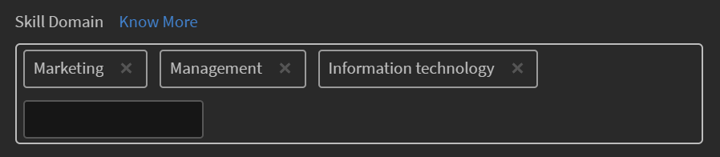

# Mappa kompetens med kompetensdomäner

Om du vill automatiskt välja ett inlägg som har publicerats av en användare av den AI-aktiverade kurateringsmotorn för en viss kompetensdomän, måste användarens företag ha sina anpassade färdigheter för att kunna mappas till de kunskapsdomäner som stöds och som finns i Learning Manager LMS.

När en administratör skapar en kompetens kan hen koppla den till de mest relevanta kunskapsdomänerna som Learning Manager stöder. Detta kommer ytterligare att beaktas i den automatiska kurateringsprocessen. Learning Manager LMS listar följande färdigheter:

* Försörjningskedjeförvaltning
* Redovisning
* Vetenskaplig forskning och teknik
* Datasäkerhet
* Strategisk förvaltning
* Sociala medier
* Medicin
* Ekonomi
* Arbetsplatssäkerhet
* Mjuka kompetenser
* Affärsrätt
* Hantering
* Personalförvaltning
* Teknisk kommunikation
* Affärsetik
* Hantering av kundrelationer
* Informationsteknik
* Produktion och tillverkning
* Marknadsföring
* Kvalitetshantering
* Affärsprocess
* Utbildning
* Design
* Analyser
* Försäljning

>[!NOTE]
>
>Om konfidenspoängen är mindre än 50 % markeras innehållet för manuell kuratering enligt algoritmen.

Följ stegen nedan om du vill lägga till en kompetensdomän:

1. Klicka på **[!UICONTROL Skills]** i den vänstra rutan i administratörsprogrammet.
1. Klicka på **[!UICONTROL Add]** längst upp till höger på sidan om du vill lägga till en kompetens.
1. Lägg till en kompetens och en beskrivning av kompetensen i dialogrutan **[!UICONTROL Add Skill]**.
1. Lägg till kompetensdomänerna i avsnittet **[!UICONTROL Skill Domain]**. När du anger en domän läggs domänerna till. De här domänerna fylls i från listan ovan.

   

   *Lägg till kompetensdomänerna i avsnittet Kompetensdomän*

1. Klicka på **[!UICONTROL Save]** för att spara ändringarna.

När en användare lägger upp ett innehåll på en anslagstavla blir innehållet kurerat och godkänns eller avvisas, beroende på förtroendepoängen mot den mappade kompetensen till anslagstavlan.

<!---->

Beroende på om innehållet som laddas upp har ett konfidensintervall på mer än 50 % laddas innehållet upp till anslagstavlan. Om ditt innehåll uppfyller villkoren får du en avisering om att innehållet har kurerats och nu är tillgängligt på tavlan.

*Visa meddelanden beroende på förtroendepoängen*
