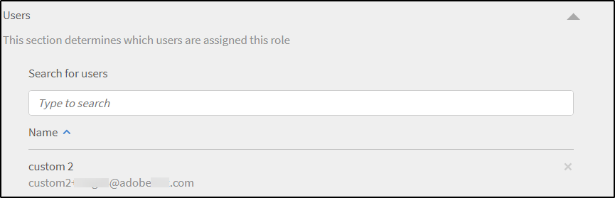
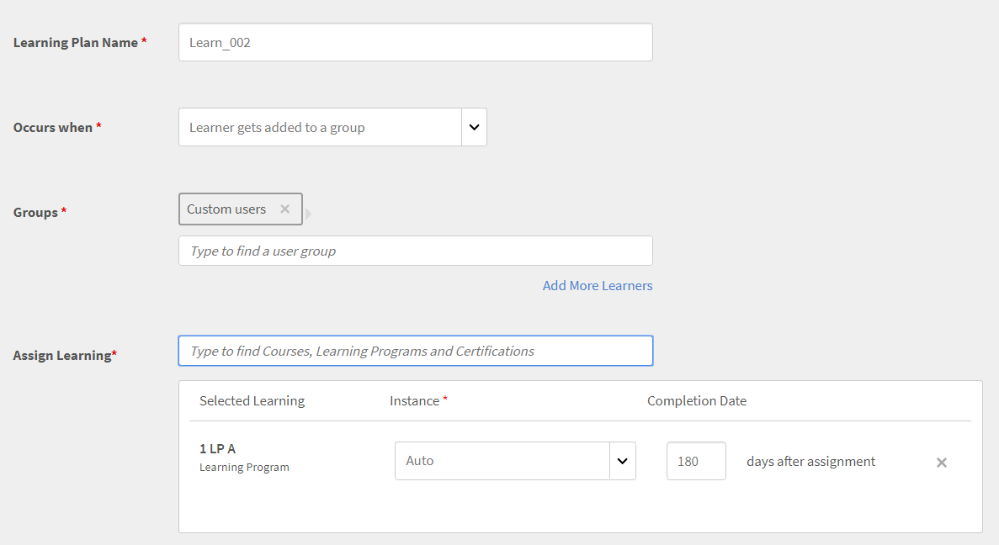

# Anpassade roller

Med den här funktionen kan du definiera anpassade roller och tilldela specifika ansvarsområden till en uppsättning användare. Med den här funktionen kan du tilldela ansvar utanför personens befintliga roll.

Du kan skapa en anpassad roll för att tillhandahålla redigeringsfunktioner som är begränsade till en viss katalog. Du kan också skapa en roll som är dedikerad till att hantera rapportering. Sådana roller kan sedan tilldelas enskilda personer som förväntas ta på sig dessa specifika ansvarsområden.

## Skapa en anpassad roll {#create-role}

1. Logga in som administratör. Öppna **[!UICONTROL Users]** > **[!UICONTROL Custom Role]**.
1. Välj **[!UICONTROL Create Role]**. Inställningen **[!UICONTROL Create New Role]** öppnas.

   

   *Skapa en anpassad roll*

1. Ange namnet i rutan **[!UICONTROL Name of the Role]** område.
1. **[!UICONTROL Account privileges]**: Dessa privilegier ger rollägarna tillgång till specifika systemkonfigurationsaspekter och som påverkar hela kontot. Välj åtkomstbehörigheter. Användaren får full kontroll över tilldelade behörigheter.

>[!NOTE]
>
>   Omfattningen är inte tillämplig på dessa privilegier.

*Ange omfång*

1. **Funktionsbehörigheter - kärnfunktioner**: Används för att ge åtkomst till specifika funktioner för hantering av utbildningsaktiviteter. Behörigheter till följande funktioner kan ges med detta alternativ.

   * Kataloger
   * Rapporter
   * Taggar

   

   *Ange omfattning för kataloger, rapporter och taggar*

1. **Funktionsprivilegier - utbildningsobjekt:**  Använd det här alternativet för att ge åtkomst till LO-relaterade funktioner. Du kan ge åtkomst till följande LO:er.

   * Certifieringar
   * Kurser
   * Arbetsstöd
   * Utbildningsprogram

   Du kan också bevilja specifik åtgärdskontroll för LO:er. Behörigheten kan vara något av följande:

   * Full kontroll
   * Redigera och ta bort
   * Registrering
   * Rapportera

   

   *Bevilja specifika behörigheter*

1. **Omfång för funktionsprivilegier:** Omfattningen av funktionsprivilegier som har tilldelats den här rollen kan begränsas till en viss användargrupp eller en eller flera kataloger.

   Kataloger: Använd alternativknappen för att ge kontroll över **[!UICONTROL All catalogs]** eller använda **[!UICONTROL Set access per Catalog]** för att ge åtkomst till specifika kataloger. Du kan också välja flera kataloger.

   Användargrupper: Ge åtkomst till **[!UICONTROL All User Groups]** eller använda **[!UICONTROL Set access per user group]** alternativ för att ge åtkomst till specifika användargrupper. Endast en användargrupp kan anges.

   >[!NOTE]
   >
   >Om du har valt Meddelande, Spelifiering, E-postmallar, Kompetenser och Användare under Kontobehörighet, ges åtkomst till användargruppen till alla användargrupper som standard och detta alternativ är inaktiverat.

   Om du har valt Utbildningsplaner under Kontobehörigheter tillhandahålls åtkomst till alla kataloger och användargrupper som standard och dessa alternativ under Omfång är inaktiverade.

   

   *Definiera behörighetsområden*

>[!NOTE]
>
>   I Learning Manager 27.6 kan du skapa en anpassad roll som omfattar flera kataloger där varje katalog ges olika uppsättning behörigheter.

Följ stegen nedan för att bevilja olika behörigheter till katalogerna:

1. Klicka på alternativet **[!UICONTROL Set access per Catalog]**.
1. Välj kataloger så kan du se behörighetsnivån för varje katalog. Behörigheterna är följande:

   <table>
        <tbody>
        <tr>
          <td>
          
<b>Behörighet</b>
</td>
          <td>
          
<b>Beskrivning</b>
</td>
        </tr>
        <tr>
          <td>
          
Full kontroll
</td>
          <td>
          
Ger fullständig kontroll över alla utbildningsobjekt. Behörigheter inkluderar Lägg till, Redigera, Ta bort, Läs, Registrera och Rapportera. 
</td>
        </tr>
        <tr>
          <td>
          
Rapportera
</td>
          <td>
          
Beviljar åtkomst till fliken Rapporter endast för utbildningsobjektet.
</td>
        </tr>
        <tr>
          <td>
          
Registrera
</td>
          <td>
          
Beviljar behörighet att endast registrera för utbildningsobjektet.
</td>
        </tr>
        <tr>
          <td>
          
Skrivskyddad
</td>
          <td>
          
Beviljar behörighet att endast visa utbildningsobjekt i katalogen.
</td>
        </tr>
        </tbody>
      </table>

1. Aktivera eller inaktivera behörigheterna enligt dina krav.
1. Klicka på för att spara ändringarna **[!UICONTROL OK]**. Om du sedan vill spara ändringarna för den anpassade rollen klickar du på **[!UICONTROL Save]**.

Tänk dig följande scenario.

Den resulterande behörigheten, som en anpassad användare har för ett utbildningsobjekt, är en skärningspunkt i behörigheten för utbildningsobjekt och katalogbehörighet.

En anpassad användare har fullständig behörighet till kurser och endast skrivskyddad åtkomst till katalog A men fullständig behörighet till katalog B. Resultaten är skrivskyddad åtkomst till kurserna i Katalog A och fullständig kontroll över kurserna i Katalog B.

En användare med en anpassad roll kan:

* Visa bara innehåll från de kataloger som han/hon har åtkomst till.
* Få åtkomst till valfritt utbildningsobjekt baserat på behörigheterna för katalogen som utbildningsobjektet ingår i.

Du som är administratör kan:

* Välj mer än en katalog för en anpassad roll.
* Ändra behörigheterna för en katalog när som helst.
* Ta bort katalogerna från ett omfång som du inte längre vill ge behörighet till.
* Bevilja implicit skrivbehörighet till en katalog när du beviljar behörighet till den.

Tabellen nedan visar hur behörigheter beviljas.

<table>
    <tbody>
     <tr>
      <td>
       
<strong> </strong>
</td>
      <td>
       
<strong>Behörighet på katalognivå</strong>
</td>
     </tr>
     <tr>
      <td>
       
<strong>Behörighet på nivå Utbildningsobjekt</strong>

       
<strong>(Exempel: kurser)</strong>
</td>
      <td>
       
Full kontroll
</td>
      <td>
       
Registrera
</td>
      <td>
       
Rapportera
</td>
      <td>
       
Skrivskyddad
</td>
     </tr>
     <tr>
      <td>
       
Full kontroll
</td>
      <td>
       
Full kontroll
</td>
      <td>
       
Registrera
</td>
      <td>
       
Rapportera
</td>
      <td>
       
Skrivskyddad
</td>
     </tr>
     <tr>
      <td>
       
Registrera
</td>
      <td>
       
Registrera
</td>
      <td>
       
Registrera
</td>
      <td>
       
Skrivskyddad
</td>
      <td>
       
Skrivskyddad
</td>
     </tr>
     <tr>
      <td>
       
Redigera och ta bort
</td>
      <td>
       
Redigera och ta bort
</td>
      <td>
       
Skrivskyddad
</td>
      <td>
       
Skrivskyddad
</td>
      <td>
       
Skrivskyddad
</td>
     </tr>
     <tr>
      <td>
       
Rapportera
</td>
      <td>
       
Rapportera
</td>
      <td>
       
Skrivskyddad
</td>
      <td>
       
Rapportera
</td>
      <td>
       
Skrivskyddad
</td>
     </tr>
    </tbody>
   </table>
1). **Användare:** Använd det här alternativet om du vill avgöra vilka användare som tilldelas den här rollen. Du kan välja en eller flera användare med sökrutan.

**Lägg till användare i CSV-överföring med anpassade roller:** Om du vill lägga till användare via en CSV-uppdatering lägger du till en CustomRole-kolumn i CSV-filen som administratören använde för att importera användare. Ange användarens roll under kolumnen Anpassad roll för de användare som du vill tilldela en anpassad roll till. Ladda upp CSV-filen genom att klicka på  **[!UICONTROL Add > Upload a CSV]**.

CustomRole columnNote:

* Du kan inte söka efter användargrupper.
* Du kan inte söka efter användare som redan har administratörsrollen tilldelad.
* Om du tilldelar en ny anpassad roll till en användare åsidosätts användarens tidigare anpassade roll.

<!---->

* En anpassad administratör med behörighet till inställningar kan konfigurera schemat för synkronisering eller synkronisering av användare från datakälla även om de inte har behörighet till användarentiteten.
* Om en anpassad administratör har behörighet i användarentiteten kan hen tilldela sig själv administratörsrollen och bli standardadministratör.

## Begränsa mappåtkomst för anpassade författare {#folder-custom-author}

Learning Manager stöder redan möjligheten att ge åtkomst till innehållsbiblioteket med anpassade roller. Alla anpassade författare som redan har tillgång till innehållsbiblioteket fortsätter att ha tillgång till alla innehållsfiler även efter att innehållsmappar har konfigurerats. Detta för att behålla det äldre beteendet. Administratörer behöver inte göra några ändringar om de vill fortsätta med det aktuella beteendet.

Om administratörerna vill begränsa åtkomsten till dessa anpassade författare måste de redigera den befintliga anpassade rollen och konfigurera dem genom att endast ge åtkomst till specifika innehållsmappar.

*Begränsa mappåtkomst för anpassade författare*

När du skapar en anpassad skapare kan du nu tilldela författaren innehållsmappar. Välj alternativet **Valda mappar**.

När du klickat på alternativet öppnas en ny dialogruta där du kan tilldela den anpassade skaparen mapparna.

*Välj mappar för den anpassade skaparen*

Välj mapparna och klicka på **[!UICONTROL OK]**.

## Instrumentpanel för utbildningssammanfattning för anpassad administratör {#custom-admin-dashboard}

Anpassade administratörer kan se samma vy som en administratör ser. En anpassad administratör kan ha data som ligger utanför hans eller hennes omfattning. Detta gäller endast om den anpassade administratören har fullständigt omfång. Om du vill bevilja fullständigt omfång när du skapar en anpassad administratör aktiverar du alternativet **[!UICONTROL Full Control]** i sammanfattningsrapport för konto.

*Skapa en anpassad roll*

Som ett resultat av detta har **[!UICONTROL All Catalogs]** och **[!UICONTROL All User Groups]** markeras och resten inaktiveras.

*Definiera behörighetsområden*

## Implicita behörigheter {#implicitpermissions}

När en användare tilldelas en roll med en specifik enhet kan det finnas fall där de behöver åtkomst till andra enheter samt kunna utföra uppgifter på den beviljade enheten. Om en användare till exempel ges behörigheten Skapa på kursenhet behöver hen åtkomst till Kompetens- och taggentiteter så att hen kan associera dem med kursen som skapas. I de här tabellerna finns information om implicita behörigheter.

<table>
 <tbody>
  <tr>
   <th>Åtkomsttyp</th>
   <th>Enhetsbehörighet har beviljats av admin</th>
   <th>implicit entitetsbehörighet</th>
   <th>Implicit åtkomst</th>
  </tr>
  <tr>
   <td>Hantera</td>
   <td>Användare</td>
   <td>Grupp</td>
   <td>Rå</td>
  </tr>
  <tr>
   <td>Registrera</td>
   <td>Alla förluster (kurs, arbetsstöd, utbildningsprogram, certifiering)</td>
   <td>Användare 
     Utbildningsplan</td>
   <td>Läs</td>
  </tr>
  <tr>
   <td>Skapa</td>
   <td>
    
Innehållsgrupp 
      Arbetsstöd 
</td>
   <td>Tagg</td>
   <td>Läs</td>
  </tr>
  <tr>
   <td>Skapa</td>
   <td>Kurs</td>
   <td>Innehållsgrupp 
     Tagg 
     Kompetens 
     Tecken 
     Arbetsstöd</td>
   <td>Läs om allt</td>
  </tr>
  <tr>
   <td>Skapa</td>
   <td>Utbildningsprogram 
     Certifiering </td>
   <td>Kurs 
     Tagg 
     Kompetens 
     Tecken</td>
   <td>Läs</td>
  </tr>
  <tr>
   <td>Skapa</td>
   <td>Utbildningsplan</td>
   <td>Katalog 
     Grupp 
     Kompetens 
     Alla förluster (kurs, arbetsstöd, utbildningsprogram, certifiering)</td>
   <td>Läs</td>
  </tr>
  <tr>
   <td>Skapa</td>
   <td>Meddelande</td>
   <td>Användare 
     Grupp 
     Alla förluster (kurs, arbetsstöd, utbildningsprogram, certifiering)</td>
   <td>Läs</td>
  </tr>
  <tr>
   <td>Skapa</td>
   <td>Spelifiering</td>
   <td>Varumärkning</td>
   <td>Skriva</td>
  </tr>
  <tr>
   <td>*</td>
   <td>Användare</td>
   <td>Fakturering</td>
   <td>Läs</td>
  </tr>
  <tr>
   <td>*</td>
   <td>Katalog</td>
   <td>Grupp 
     Alla förluster (kurs, arbetsstöd, utbildningsprogram, certifiering)</td>
   <td>Läs</td>
  </tr>
  <tr>
   <td>*</td>
   <td>Inställning</td>
   <td>Varumärkning 
     Användare</td>
   <td>Läs</td>
  </tr>
  <tr>
   <td>*</td>
   <td>Varumärkning</td>
   <td>Inställning</td>
   <td>Läs</td>
  </tr>
  <tr>
   <td>*</td>
   <td>Fakturering 
     Spelifiering</td>
   <td>Användare</td>
   <td>Läs</td>
  </tr>
 </tbody>
</table>

## Få åtkomst till en anpassad roll {#accessacustomrole}

När en administratör tilldelar en anpassad roll får du ett e-postmeddelande.

Obs! Om du redan är inloggad på Learning Manager med en anpassad roll måste du logga in på Learning Manager igen för att få åtkomst till den nya rollen.

Klicka på din profilikon i det övre högra hörnet av Learning Manager och välj rollen för att växla mellan roller.

## Utbildningsplaner som omfattas av konfigurerbara roller {#scopeconfigure}

I tidigare versioner av Learning Manager kunde valfri anpassad roll med behörighet att skapa utbildningsplaner omfatta utbildningsplanen för alla typer av användargrupper och utbildningsobjekt.

Inställningen Omfång brukade vara inaktiverad när åtkomst till utbildningsplan beviljades, vilket gav användaren åtkomst till Alla kataloger och Alla användargrupper som standard.

Alla utbildningsplaner som skapas av en administratör gäller som standard alla användare. Användare kan även tilldelas valfritt utbildningsobjekt. Å andra sidan har användare med anpassade roller åtkomst till fullständiga omfång, till exempel alla kataloger, utbildningsobjekt eller användargrupper. Detta innebar att administratörer inte kunde skapa anpassade roller som förväntat, vilket tillät åtkomst till utbildningsplaner för användare med begränsad omfattning.

I den här uppdateringen av Learning Manager kan du skapa anpassade roller för utbildningsplaner som tillåter omfång för användare och utbildningsobjekt. Med andra ord kan utbildningsplaner skapas med ett begränsat omfång som härrör från en anpassad administratörs rollomfång.

Nu kan en administratör definiera eller begränsa omfattningen när han/hon ger åtkomst till hantering av utbildningsplaner.

Anpassade administratörer kan skapa utbildningsplaner med en begränsad omfattning, som bestäms av omfattningen av den anpassade administratörens konfigurerbara roll. Sådana utbildningsplaner är bara tillgängliga för anpassade administratörer med samma roll, förutom att vara tillgängliga för vanliga administratörer. Dessutom kan de anpassade administratörerna inte se några andra utbildningsplaner i kontot.

Befintliga anpassade administratörer som har tillgång till utbildningsplaner har alltid full omfattning (per definition). De får tillgång till alla utbildningsplaner på kontot precis som en vanlig administratör. Nya anpassade roller som skapats med fullständigt omfång och nya anpassade administratörer som lagts till i sådana roller kommer att ha fortsatt åtkomst till alla utbildningsplaner.

Utbildningsplaner som skapas av administratörer och anpassade administratörer i hela omfattningen skapas som vanligt och begränsas inte av omfattningen.

I avsnittet **Omfång för funktionsbehörighet**, bevilja åtkomst till användargrupper och/eller katalog för den anpassade rollen.

*Bevilja åtkomst till användargrupper och/eller katalog för den anpassade rollen*

Tilldela en användare till den anpassade rollen.

*Tilldela en användare en anpassad roll*

Användaren loggar nu in i Learning Manager som anpassad administratör och lägger nu till en utbildningsplan.

När en ny elev läggs till kan den anpassade administratören bara välja en utbildning från den konfigurerbara rollens kataloger med omfång.

Den här utbildningsplanen gäller nu endast eleven om användaren även läggs till i gruppen inom utbildningsplanens begränsade användargrupp. Alla andra elever undantas från denna utbildningsplan.

## Eleven läggs till i gruppen {#learnergetsaddedtothegroup}

<!---->

Den anpassade administratören kan välja vilken användargrupp som helst som har användare inom rollens begränsade användargrupp.

När en användare läggs till i den angivna gruppen tilldelas utbildningsobjektet endast användare som redan ingår i utbildningsplanens omfattande användargrupp och som har lagts till i den angivna användargruppen.

## Ändring av omfattning {#changeinscope}

När administratören ändrar omfattningen av den anpassade rollen överlappas även ändringen av den anpassade administratören. När den anpassade administratören väljer en utbildningsplan som redan har omfattats av en tidigare anpassad roll visas ett meddelande enligt nedan:

*Meddelande efter omfångsändringar*

Den anpassade administratören måste nu uppdatera eller uppdatera det tidigare omfånget till det nya.

Klickning **[!UICONTROL Refresh Scope]** uppdaterar omfattningen. Ett varningsmeddelande visas.

*Varningsmeddelande när ett omfång har uppdaterats*

Klickning **[!UICONTROL Yes]** uppdaterar omfattningen.

## Lägg till spelifieringsrapport till en anpassad roll {#gamification-custom}

En administratör kan aktivera spelifieringsrapporter för en anpassad användare.

1. I dialogrutan **[!UICONTROL Custom Roles]** -sidan, anger du namnet på den anpassade rollen.
1. I dialogrutan **[!UICONTROL Feature Privileges: Core Features]** aktiverar du alternativet **[!UICONTROL Full Control]** för kategorin **[!UICONTROL Reports]**.

1. I avsnittet **[!UICONTROL Users]** väljer du den användare som ska tilldelas den nyligen skapade anpassade rollen.
1. Klicka **[!UICONTROL Save]**.

När en användare loggar in som anpassad administratör och klickar på **[!UICONTROL Reports]** i den vänstra rutan visas utskrifterna, som visas nedan:

*Hämta spelifieringsutskrifterna*

Klicka **[!UICONTROL Gamification Transcripts]**, välj en användare och generera rapporten.

Om en administratör ändrar nivåpunkterna visar rapporterna nivåer enligt de aktuella punkterna.

Återställning av spelifiering återställer inte den nivå som uppnåddes vid datumet.

## Vanliga frågor {#frequentlyaskedquestions}

+++Hur skapar man en anpassad roll?

En anpassad roll är som en delmängd av rollen Författare eller Administratör. Tillåt en eller flera behörigheter, definiera omfånget och tilldela rollen till en användare.

Klicka **[!UICONTROL Users]** > **[!UICONTROL Custom Roles]**. På sidan Anpassade roller klickar du på **[!UICONTROL Create Role]**. Ange namnet på den anpassade rollen och ange rollens privilegier. Mer information finns i [Skapa en anpassad roll](custom-role.md#create-role).
+++
