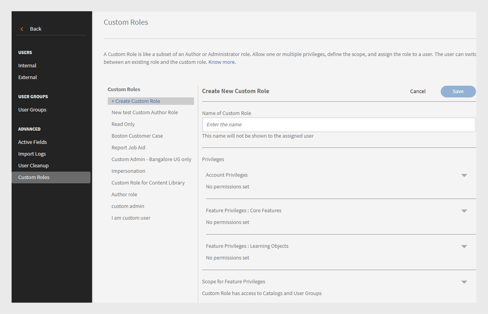
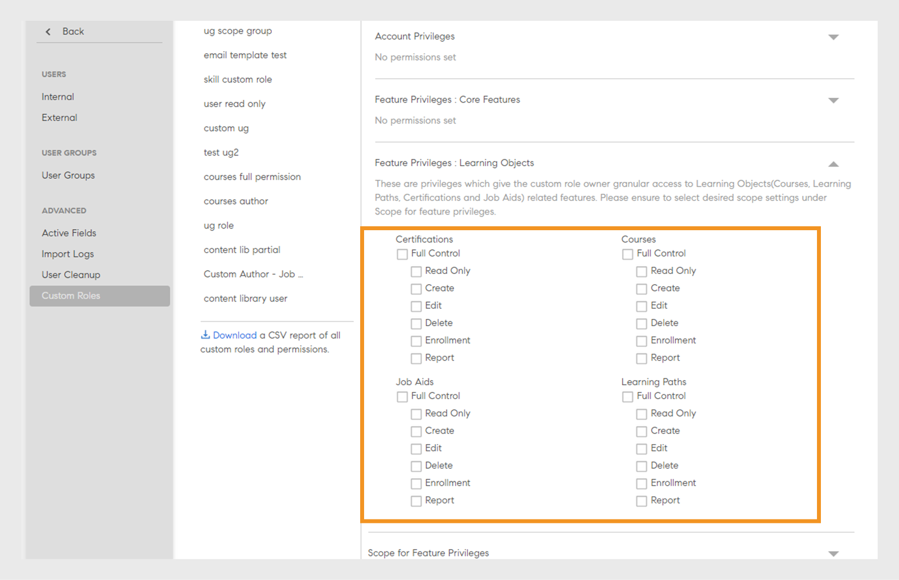

# Anpassade roller

Med den här funktionen kan du definiera anpassade roller och tilldela specifika ansvarsområden till en uppsättning användare. Med den här funktionen kan du tilldela ansvar utanför personens befintliga roll.

Du kan skapa en anpassad roll för att tillhandahålla redigeringsfunktioner som är begränsade till en viss katalog. Du kan också skapa en roll som är dedikerad till att hantera rapportering. Sådana roller kan sedan tilldelas enskilda personer som förväntas ta på sig dessa specifika ansvarsområden.

>[!NOTE]
>
>Om du lägger till en ny anpassad roll påverkas inte befintliga anpassade användargrupper eller rollbaserade grupper som Alla administratörer, Alla författare osv.

Administratören kan skapa anpassade administratörsroller och anpassade författarroller med anpassade behörigheter för varje roll. Nedan visas en översikt över de behörigheter som är kopplade till varje roll:

**Anpassade författarrollsbehörigheter**

Anpassade författare kan utföra följande åtgärder:

* Öppna innehållsbiblioteket för att lägga till, redigera eller ta bort kärninnehåll.
* Skapa, redigera och ta bort:
   * Kurser
   * Arbetsstöd
   * Certifieringar
   * Utbildningsvägar
   * Utbildningsplaner

Administratörer och författare, inklusive anpassade administratörer och anpassade författare, kan dela utbildningsobjekt (LO:er) med externt delade kataloger. Administratörer och författare bör kunna söka efter externt delade kataloger när de skapar utbildningsobjekt (LO).

**Behörigheter för anpassade administratörsroller**

Den anpassade administratörsrollen replikerar en uppsättning administratörsbehörigheter, inklusive åtkomst till behörigheter på kontonivå. Anpassade administratörer får behörigheter att hantera viktiga funktioner som rör utbildningsaktiviteter, till exempel:

* Utbildningsplaner
* Kataloger
* Rapporter
* Taggar

Dessutom kan anpassade administratörer:

* Hantera kurser och arbetsstöd, inklusive registrering och borttagning av användare.
* Skapa, redigera och radera certifieringar, utbildningsvägar och utbildningsplaner.
* Få tillgång till rapporterings- och registreringsfunktioner för alla utbildningsobjekt (LO).

Administratörer kan nu visa CSV-skapade behörigheter i Adobe Learning Manager. Alternativet Filtrera efter filtrerar anpassade roller efter administratör som har skapats och de som importeras via en CSV-fil. När du har valt en anpassad roll kan du se dess behörigheter.

_Filtrera anpassade roller_

## Skapa en anpassad roll {#create-role}

1. Logga in som administratör. Öppna **[!UICONTROL Users]** > **[!UICONTROL Custom Role]**.
2. Välj **[!UICONTROL Create Role]**. Fliken **[!UICONTROL Create New Role]** öppnas.

   

   *Skapa en anpassad roll*

3. Ange namnet i fältet **[!UICONTROL Name of the Role]**.
4. **[!UICONTROL Account privileges]**: De här behörigheterna ger rollägarna tillgång till specifika systemkonfigurationsaspekter och som påverkar hela kontot. Välj åtkomstbehörigheter. Användaren får full kontroll över tilldelade behörigheter.

   Administratörer kan bevilja detaljerade behörigheter för avsnittet Användare, som har interna/externa användare, användargrupper och avancerade användare.

   >[!NOTE]
   >
   >   Omfattningen är inte tillämplig på dessa privilegier.

   

   *Ange omfattningen*

5. **Funktionsprivilegier - Kärnfunktioner**: Används för att ge åtkomst till specifika funktioner för hantering av utbildningsaktiviteter. Behörigheter till följande funktioner kan ges med detta alternativ.

   Administratörer kan ge detaljerade behörigheter som skrivskyddade, skapa, redigera och ta bort behörigheter för katalogerna.

   * Kataloger
   * Rapporter
   * Taggar

   

   *Ange omfattning för kataloger, rapporter och taggar*

6. **Funktionsprivilegier - Utbildningsobjekt:** Använd det här alternativet för att ge åtkomst till LO-relaterade funktioner. Administratörer kan tillhandahålla detaljerade behörigheter för alla utbildningsobjekt, inklusive kurser, utbildningsvägar, certifieringar och arbetsstöd. De kan tilldela användare behörigheter som skapa, redigera, ta bort eller skrivskyddad åtkomst.

   * Certifieringar
   * Kurser
   * Arbetsstöd
   * Utbildningsprogram

   Du kan även bevilja specifik åtgärdskontroll för utbildningsobjekten. Behörigheten kan vara något av följande:

   * Skrivskyddat
   * Skapa
   * Redigera
   * Ta bort
   * Registrering
   * Rapportera

   Du kan också bevilja fullständig kontroll för LO:er.

   

   *Bevilja specifika behörigheter*

7. **Omfång för funktionsprivilegier:** Omfattningen för funktionsprivilegier som har tilldelats den här rollen kan begränsas till en specifik användargrupp eller en eller flera kataloger.

   Kataloger: Använd alternativknappen för att ge kontroll över **[!UICONTROL All catalogs]** eller använd alternativet **[!UICONTROL Set access per Catalog]** för att ge åtkomst till specifika kataloger. Du kan också välja flera kataloger.

   Användargrupper: Ge åtkomst till **[!UICONTROL All User Groups]** eller använd alternativet **[!UICONTROL Set access per user group]** för att ge åtkomst till specifika användargrupper. Endast en användargrupp kan anges.

   >[!NOTE]
   >
   >Om du har valt Meddelande, Spelifiering, E-postmallar, Kompetenser och Användare under Kontobehörighet, ges åtkomst till användargruppen till alla användargrupper som standard och detta alternativ är inaktiverat.

   Om du har valt Utbildningsplaner under Kontobehörigheter tillhandahålls åtkomst till alla kataloger och användargrupper som standard och dessa alternativ under Omfång är inaktiverade.

   

   *Definiera behörighetsområde*

>[!NOTE]
>
>   I Learning Manager 27.6 kan du skapa en anpassad roll som omfattar flera kataloger där varje katalog ges olika uppsättning behörigheter.

Följ stegen nedan för att bevilja olika behörigheter till katalogerna:

1. Klicka på alternativet **[!UICONTROL Set access per Catalog]**.
1. Välj kataloger så kan du se behörighetsnivån för varje katalog. Behörigheterna är följande:

   <table>
        <tbody>
        <tr>
          <td>
          
<b>Behörighet</b>
</td>
          <td>
          
<b>Beskrivning</b>
</td>
        </tr>
        <tr>
          <td>
          
Full kontroll
</td>
          <td>
          
Ger fullständig kontroll över alla utbildningsobjekt. Behörigheter inkluderar Lägg till, Redigera, Ta bort, Läs, Registrera och Rapportera. 
</td>
        </tr>
        <tr>
          <td>
          
Rapportera
</td>
          <td>
          
Beviljar åtkomst till fliken Rapporter endast för utbildningsobjektet.
</td>
        </tr>
        <tr>
          <td>
          
Registrera dig
</td>
          <td>
          
Beviljar behörighet att endast registrera för utbildningsobjektet.
</td>
        </tr>
        <tr>
          <td>
          
Skrivskyddad
</td>
          <td>
          
Beviljar behörighet att endast visa utbildningsobjekt i katalogen.
</td>
        </tr>
        </tbody>
      </table>

1. Aktivera eller inaktivera behörigheterna enligt dina krav.
1. Klicka på **[!UICONTROL OK]** för att spara ändringarna. Klicka sedan på **[!UICONTROL Save]** för att spara ändringarna för den anpassade rollen.

Tänk dig följande scenario.

Den resulterande behörigheten, som en anpassad användare har för ett utbildningsobjekt, är en skärningspunkt i behörigheten för utbildningsobjekt och katalogbehörighet.

En anpassad användare har fullständig behörighet till kurser och endast skrivskyddad åtkomst till katalog A men fullständig behörighet till katalog B. Resultaten är skrivskyddad åtkomst till kurserna i Katalog A och fullständig kontroll över kurserna i Katalog B.

En användare med en anpassad roll kan:

* Visa bara innehåll från de kataloger som han/hon har åtkomst till.
* Få åtkomst till valfritt utbildningsobjekt baserat på behörigheterna för katalogen som utbildningsobjektet ingår i.

  Du som är administratör kan:

* Välj mer än en katalog för en anpassad roll.
* Ändra behörigheterna för en katalog när som helst.
* Ta bort katalogerna från ett omfång som du inte längre vill ge behörighet till.
* Bevilja implicit skrivbehörighet till en katalog när du beviljar behörighet till den.

  Tabellen nedan visar hur behörigheter beviljas.

  <table>
    <tbody>
     <tr>
      <td>
       
<strong> </strong>
</td>
      <td>
       
<strong>Behörighet på katalognivå</strong>
</td>
     </tr>
     <tr>
      <td>
       
<strong>Behörighet på nivå Utbildningsobjekt</strong>

       
<strong>(Exempel: kurser)</strong>
</td>
      <td>
       
Full kontroll
</td>
      <td>
       
Registrera
</td>
      <td>
       
Rapportera
</td>
      <td>
       
Skrivskyddad
</td>
     </tr>
     <tr>
      <td>
       
Full kontroll
</td>
      <td>
       
Full kontroll
</td>
      <td>
       
Registrera
</td>
      <td>
       
Rapportera
</td>
      <td>
       
Skrivskyddad
</td>
     </tr>
     <tr>
      <td>
       
Registrera
</td>
      <td>
       
Registrera
</td>
      <td>
       
Registrera
</td>
      <td>
       
Skrivskyddad
</td>
      <td>
       
Skrivskyddad
</td>
     </tr>
     <tr>
      <td>
       
Redigera och ta bort
</td>
      <td>
       
Redigera och ta bort
</td>
      <td>
       
Skrivskyddad
</td>
      <td>
       
Skrivskyddad
</td>
      <td>
       
Skrivskyddad
</td>
     </tr>
     <tr>
      <td>
       
Rapportera
</td>
      <td>
       
Rapportera
</td>
      <td>
       
Skrivskyddad
</td>
      <td>
       
Rapportera
</td>
      <td>
       
Skrivskyddad
</td>
     </tr>
    </tbody>
   </table>

1. **Användare:** Använd det här alternativet för att avgöra vilka användare som tilldelas den här rollen. Du kan välja en eller flera användare med sökrutan.

   **Lägg till användare i CSV-överföring med anpassade roller:** Lägg till användare via CSV som överförts genom att lägga till en CustomRole-kolumn i .csv-filen som administratören använde för att importera användare. Ange användarens roll under kolumnen Anpassad roll för de användare som du vill tilldela en anpassad roll till. Klicka på **[!UICONTROL Add > Upload a CSV]** för att överföra CSV-filen.

   * Du kan inte söka efter användargrupper.
   * Du kan inte söka efter användare som redan har administratörsroll tilldelad.
   * Om du tilldelar en ny anpassad roll till en användare åsidosätts användarens tidigare anpassade roll.

   <!---->

   * En anpassad administratör med behörighet till inställningar kan konfigurera schemat för synkronisering eller synkronisering av användare från datakälla även om de inte har behörighet till användarentiteten.
   * Om en anpassad administratör har behörighet för användarentiteten kan hen tilldela sig själv administratörsrollen och bli standardadministratör.

## Tilldela flera anpassade roller till en användare

Du kan tilldela flera anpassade roller till användare på följande sätt:

* Med användargränssnittet: Du kan tilldela mer än en anpassad roll till en användare direkt från Adobe Learning Manager-gränssnittet.
* Med CSV-överföring: Du kan överföra en CSV-fil för att tilldela flera anpassade roller till flera användare samtidigt.

Det gör det enklare att hantera användaråtkomst och kontrollbehörigheter i systemet.

### Tilldela flera anpassade roller via användargränssnittet

Att tilldela flera anpassade roller via Admin Console i Adobe Learning Manager är ett snabbt och intuitivt alternativ som är perfekt för introduktion, behörighetsjusteringar och mindre uppdateringar. Roller kan tilldelas visuellt, utan att det behövs några CSV-överföringar, vilket minskar risken för fel och ger synlighet i realtid. Den här metoden stöder snabba uppdateringar när ansvarsområden flyttas och tillåter rollbyte och delegering efter behov.

Gör så här om du vill tilldela flera anpassade roller till en användare:

1. Logga in som administratör och välj **[!UICONTROL Users]**.
2. Välj **[!UICONTROL Custom Roles]** i den vänstra panelen.
3. Skapa en ny anpassad roll och lägg till kontobehörigheter, kataloger, utbildningsobjekt eller omfattningar. Se stegen som nämns [här](#create-a-custom-role).
4. Lägg till användare i den anpassade rollen.

   
   _Tilldela användare en anpassad roll_

5. Välj **[!UICONTROL Save]**.

Välj flera anpassade roller för en användare efter behov. Varje användare kan ha upp till 50 anpassade rolltilldelningar. Antalet tillgängliga roller minskar med varje tilldelning.

När du har tilldelat användare en annan anpassad roll kan du visa hur många rolltilldelningar som fortfarande är tillgängliga för varje användare.

>[!NOTE]
>
>Du kan tilldela upp till 50 roller till varje användare och lägga till upp till 500 användare till varje roll.

### Tilldela flera anpassade roller med CSV

Genom att överföra en CSV-fil i Adobe Learning Manager kan du effektivt tilldela anpassade roller gruppvis. Denna process är särskilt fördelaktig för introduktion av ett stort antal anställda, omorganisering av team eller uppdatering av tillgången till ny utbildning. CSV-import sparar manuell arbetsinsats, säkerställer konsekventa tilldelningar och minskar antalet fel. Den här metoden är särskilt användbar vid sammanslagningar, uppdateringar på hela avdelningen eller vid global lansering av utbildningar. Den här metoden hjälper administratörer att spara tid, standardisera roller och upprätthålla styrning.

Du kan nu tilldela flera roller till en användare via CSV-import genom att överföra två filer till Box:

* role.csv
* user_role.csv.

Filen user_role.csv innehåller fälten Anpassad roll och Användar-id.

Filen role.csv innehåller fält, anpassad roll, källa för att skapa och detaljerad information om kataloger, användare, kurser, utbildningsvägar med mera.

Om CSV-filen innehåller felaktiga data eller överskrider gränserna (50 roller per användare och 500 användare per roll) visas ett meddelande med felen.

_Felmeddelande för anpassade roller_
Användarna får ett e-postmeddelande när roller tilldelas, inklusive namnet på rollen.

### Hantera anpassade roller

Administratörer kan uppdatera, lägga till och ta bort anpassade roller för användare i Adobe Learning Manager när ansvarsområdena ändras. Detta garanterar att åtkomsten anpassas till aktuella roller utan att påverka utbildningshistorik eller registreringsdata. På sidan **[!UICONTROL Users]** kan administratören söka efter användare, visa deras roller och justera dem med alternativet Hantera anpassade roller. Det här guidade gränssnittet gör det enkelt att lägga till eller ta bort roller samtidigt som styrning och säkerhet upprätthålls.

>[!NOTE]
>
>Anpassade administratörer kan inte hantera anpassade roller (lägga till eller ta bort anpassade roller) eller uppgradera sig själva till administratörsrollen.

När du har tilldelat användare anpassade roller kan du lägga till eller ta bort anpassade roller från sidan **[!UICONTROL Users]**.

1. Sök efter en användare på sidan **[!UICONTROL Users]**.

   
   _Sök efter en användare på sidan Användare_

2. Välj rullgardinspilen i slutet av raden där användarnamnet visas och välj sedan **[!UICONTROL Manage custom roles]**.

   
   _Välj Hantera anpassade roller på användarsidan_

3. En dialogruta visas med en lista över de anpassade roller som tilldelats användaren. Välj **[!UICONTROL Add/remove roles]** för att lägga till eller ta bort anpassade roller som tilldelats användaren.

   
   _Välj Lägg till/ta bort roller i uppmaningen Hantera anpassade roller_

4. Sök efter andra anpassade roller som ska tilldelas användaren. Välj den anpassade rollen när du har hittat en.

   
   _Välj den anpassade rollen_

5. Välj **[!UICONTROL Save]**. En bekräftelsedialogruta för ändringen av den anpassade rollen visas. Välj **[!UICONTROL Yes]**.

   
   _Välj Ja i bekräftelsemeddelandet_

En tredje anpassad roll tilldelas användaren.

Följ de här stegen om du vill ta bort anpassade roller:

1. Sök efter en användare på sidan **[!UICONTROL Users]**.
2. Välj listrutan nära användaren och välj **[!UICONTROL Manage custom roles]**.
3. Välj **[!UICONTROL Add/remove roles]** för att lägga till eller ta bort anpassade roller.
4. Välj **[!UICONTROL remove icon]** för att ta bort den anpassade rollen.

   
   _Ta bort anpassade roller_

### Växla anpassade roller

Om du vill visa och välja anpassade roller som tilldelats dig använder du alternativet **[!UICONTROL Switch custom role]**.

_Välj anpassade roller_

Användarna får ett e-postmeddelande när de anpassade rollerna har tilldelats dem. E-postmeddelandena innehåller nu rollnamn för ökad tydlighet.

## Hämta rapporten om den anpassade rollen

Administratörer kan hämta en CSV-rapport med en lista över alla anpassade roller och deras associerade behörigheter. Rapporten visar om varje roll har skapats manuellt eller via CSV-överföring och ger en sammanfattning av åtkomsten och behörigheterna som har tilldelats varje roll.

Hämta rapporten genom att följa dessa steg:

1. Logga in som **[!UICONTROL Admin]**.
2. Välj **[!UICONTROL Users]** > **[!UICONTROL Custom Roles]**.
3. Välj alternativet **[!UICONTROL Download]** för att hämta CSV-rapporten.

_Ladda ned rapport om anpassade roller_

Rapporten innehåller två CSV-filer: role.csv och user_role.csv. Filen role.csv innehåller:

* Anpassad roll
* Användar-ID
* Källa för skapande.

Filen user_role.csv innehåller fält, anpassad roll, källa till skapande och detaljerad information om kataloger, användare, kurser, utbildningsvägar med mera.

## Granskningsspår för anpassade roller

Administratörer kan hämta granskningsrapporten för den anpassade rollen för att spåra alla ändringar som görs i de anpassade rollerna, inklusive att skapa, ändra och ta bort anpassade roller och deras tillhörande funktionsåtkomst.

Läs den här artikeln [Granskningsspår för anpassade roller](/help/migrated/administrators/feature-summary/reports.md#audit-trail-for-custom-roles) om du vill ha mer information.

## Begränsa mappåtkomst för anpassade författare {#folder-custom-author}

Learning Manager stöder redan möjligheten att ge åtkomst till innehållsbiblioteket med anpassade roller. Alla anpassade författare som redan har tillgång till innehållsbiblioteket fortsätter att ha tillgång till alla innehållsfiler även efter att innehållsmappar har konfigurerats. Detta för att behålla det äldre beteendet. Administratörer behöver inte göra några ändringar om de vill fortsätta med det aktuella beteendet.

Om administratörerna vill begränsa åtkomsten till dessa anpassade författare måste de redigera den befintliga anpassade rollen och konfigurera dem genom att endast ge åtkomst till specifika innehållsmappar.

*Begränsa mappåtkomst för anpassade författare*

När du skapar en anpassad skapare kan du nu tilldela författaren innehållsmappar. Välj alternativet **Valda mappar**.

När du klickat på alternativet öppnas en ny dialogruta där du kan tilldela den anpassade skaparen mapparna.

*Välj mappar för den anpassade skaparen*

Välj mapparna och klicka på **[!UICONTROL OK]**.

## Instrumentpanel för utbildningssammanfattning för anpassad administratör {#custom-admin-dashboard}

Anpassade administratörer kan se samma vy som en administratör ser. En anpassad administratör kan ha data som ligger utanför hans eller hennes omfattning. Detta gäller endast om den anpassade administratören har fullständigt omfång. Om du vill bevilja fullständigt omfång när du skapar en anpassad administratör aktiverar du alternativet **[!UICONTROL Full Control]** i sammanfattningsrapport för konto.

*Skapa en anpassad roll*

Det innebär att alternativen **[!UICONTROL All Catalogs]** och **[!UICONTROL All User Groups]** markeras och att resten inaktiveras.

*Definiera behörighetsområde*

## Implicita behörigheter {#implicitpermissions}

När en användare tilldelas en roll med en specifik enhet kan det finnas fall där de behöver åtkomst till andra enheter samt kunna utföra uppgifter på den beviljade enheten. Om en användare till exempel ges behörigheten Skapa på kursenhet behöver hen åtkomst till Kompetens- och taggentiteter så att hen kan associera dem med kursen som skapas. I de här tabellerna finns information om implicita behörigheter.

<table>
 <tbody>
  <tr>
   <th>Åtkomsttyp</th>
   <th>Enhetsbehörighet har beviljats av admin</th>
   <th>implicit entitetsbehörighet</th>
   <th>Implicit åtkomst</th>
  </tr>
  <tr>
   <td>Hantera</td>
   <td>Användare</td>
   <td>Grupp</td>
   <td>Rå</td>
  </tr>
  <tr>
   <td>Registrera dig</td>
   <td>Alla förluster (kurs, arbetsstöd, utbildningsprogram, certifiering)</td>
   <td>Användare 
     Utbildningsplan</td>
   <td>Läs</td>
  </tr>
  <tr>
   <td>Skapa</td>
   <td>
    
Innehållsgrupp 
      Arbetsstöd 
</td>
   <td>Tagg</td>
   <td>Läs</td>
  </tr>
  <tr>
   <td>Skapa</td>
   <td>Kurs</td>
   <td>Innehållsgrupp 
     Tagg 
     Kompetens 
     Utmärkelsetecken 
     Arbetsstöd</td>
   <td>Läs om allt</td>
  </tr>
  <tr>
   <td>Skapa</td>
   <td>Utbildningsprogram 
     Certifiering </td>
   <td>Kurs 
     Tagg 
     Kompetens 
     Tecken</td>
   <td>Läs</td>
  </tr>
  <tr>
   <td>Skapa</td>
   <td>Utbildningsplan</td>
   <td>Katalog 
     Grupp 
     Kompetens 
     Alla förluster (kurs, arbetsstöd, utbildningsprogram, certifiering)</td>
   <td>Läs</td>
  </tr>
  <tr>
   <td>Skapa</td>
   <td>Meddelande</td>
   <td>Användare 
     Grupp 
     Alla förluster (kurs, arbetsstöd, utbildningsprogram, certifiering)</td>
   <td>Läs</td>
  </tr>
  <tr>
   <td>Skapa</td>
   <td>Spelifiering</td>
   <td>Varumärke</td>
   <td>Skriva</td>
  </tr>
  <tr>
   <td>*</td>
   <td>Användare</td>
   <td>Fakturering</td>
   <td>Läs</td>
  </tr>
  <tr>
   <td>*</td>
   <td>Katalog</td>
   <td>Grupp 
     Alla förluster (kurs, arbetsstöd, utbildningsprogram, certifiering)</td>
   <td>Läs</td>
  </tr>
  <tr>
   <td>*</td>
   <td>Inställning</td>
   <td>Varumärkning 
     Användare</td>
   <td>Läs</td>
  </tr>
  <tr>
   <td>*</td>
   <td>Varumärke</td>
   <td>Inställning</td>
   <td>Läs</td>
  </tr>
  <tr>
   <td>*</td>
   <td>Fakturering 
     Spelifiering</td>
   <td>Användare</td>
   <td>Läs</td>
  </tr>
 </tbody>
</table>

## Få åtkomst till en anpassad roll {#accessacustomrole}

När en administratör tilldelar en anpassad roll får du ett e-postmeddelande.

Obs! Om du redan är inloggad på Learning Manager med en anpassad roll måste du logga in på Learning Manager igen för att få åtkomst till den nya rollen.

Klicka på din profilikon i det övre högra hörnet av Learning Manager och välj rollen för att växla mellan roller.

## Utbildningsplaner som omfattas av konfigurerbara roller {#scopeconfigure}

I tidigare versioner av Learning Manager kunde valfri anpassad roll med behörighet att skapa utbildningsplaner omfatta utbildningsplanen för alla typer av användargrupper och utbildningsobjekt.

Inställningen Omfång brukade vara inaktiverad när åtkomst till utbildningsplan beviljades, vilket gav användaren åtkomst till Alla kataloger och Alla användargrupper som standard.

Alla utbildningsplaner som skapas av en administratör gäller som standard alla användare. Användare kan även tilldelas valfritt utbildningsobjekt. Å andra sidan har användare med anpassade roller åtkomst till fullständiga omfång, till exempel alla kataloger, utbildningsobjekt eller användargrupper. Detta innebar att administratörer inte kunde skapa anpassade roller som förväntat, vilket tillät åtkomst till utbildningsplaner för användare med begränsad omfattning.

I den här uppdateringen av Learning Manager kan du skapa anpassade roller för utbildningsplaner som tillåter omfång för användare och utbildningsobjekt. Med andra ord kan utbildningsplaner skapas med ett begränsat omfång som härrör från en anpassad administratörs rollomfång.

Nu kan en administratör definiera eller begränsa omfattningen när han/hon beviljar åtkomst till hantering av utbildningsplaner.

Anpassade administratörer kan skapa utbildningsplaner med en begränsad omfattning, som bestäms av omfattningen av den anpassade administratörens konfigurerbara roll. Utbildningsplanerna är bara tillgängliga för anpassade administratörer med samma roll, förutom att vara tillgängliga för vanliga administratörer. Dessutom kan de anpassade administratörerna inte se några andra utbildningsplaner i kontot.

Befintliga anpassade administratörer som har tillgång till utbildningsplaner har alltid full omfattning (per definition). De får tillgång till alla utbildningsplaner på kontot precis som en vanlig administratör. Nya anpassade roller som skapats med fullständigt omfång och nya anpassade administratörer som lagts till i sådana roller kommer att ha fortsatt åtkomst till alla utbildningsplaner.

Utbildningsplaner som skapas av administratören och anpassade administratörer i hela omfattningen skapas som vanligt och begränsas inte av omfattningen.

I avsnittet **Omfång för funktionsprivilegier** beviljar du åtkomst till användargrupper och/eller katalog för den anpassade rollen.

*Bevilja åtkomst till användargrupper och/eller katalog för den anpassade rollen*

Tilldela en användare till den anpassade rollen.

*Tilldela en användare en anpassad roll*

Användaren loggar nu in i Learning Manager som anpassad administratör och lägger nu till en utbildningsplan.

När en ny elev läggs till kan den anpassade administratören endast välja en utbildning från den konfigurerbara rollens kataloger med omfång.

Den här utbildningsplanen gäller nu endast eleven om användaren även läggs till i gruppen inom utbildningsplanens begränsade användargrupp. Alla andra elever undantas från denna utbildningsplan.

## Eleven läggs till i gruppen {#learnergetsaddedtothegroup}

<!---->

Den anpassade administratören kan välja vilken användargrupp som helst som har användare inom rollens begränsade användargrupp.

När en användare läggs till i den angivna gruppen tilldelas utbildningsobjektet endast användare som redan ingår i utbildningsplanens omfattande användargrupp och som har lagts till i den angivna användargruppen.

## Ändring av omfattning {#changeinscope}

När administratören ändrar omfattningen av den anpassade rollen överlappas även ändringen av den anpassade administratören. När den anpassade administratören väljer en utbildningsplan som redan har omfattats av en tidigare anpassad roll visas ett meddelande enligt nedan:

*Meddelande efter att omfånget har ändrats*

Den anpassade administratören måste nu uppdatera eller uppdatera det tidigare omfånget till det nya.

Om du klickar på **[!UICONTROL Refresh Scope]** uppdateras omfånget. Ett varningsmeddelande visas.

*Varningsmeddelande efter uppdatering av ett scope*

Om du klickar på **[!UICONTROL Yes]** uppdateras omfånget.

## Lägg till spelifieringsrapport till en anpassad roll {#gamification-custom}

En administratör kan aktivera spelifieringsrapporter för en anpassad användare.

1. Ange namnet på den anpassade rollen på sidan **[!UICONTROL Custom Roles]**.
1. Aktivera alternativet **[!UICONTROL Full Control]** för kategorin **[!UICONTROL Reports]** i avsnittet **[!UICONTROL Feature Privileges: Core Features]**.

1. I avsnittet **[!UICONTROL Users]** väljer du den användare som ska tilldelas den nyligen skapade anpassade rollen.
1. Klicka på **[!UICONTROL Save]**.

När en användare loggar in som Anpassad administratör och klickar på **[!UICONTROL Reports]** i den vänstra rutan visas utskrifterna enligt nedan:

*Ladda ned transkriberingar av spelifiering*

Klicka på **[!UICONTROL Gamification Transcripts]**, välj en användare och generera rapporten.

Om en administratör ändrar nivåpunkterna visar rapporterna nivåer enligt de aktuella punkterna.

Återställning av spelifiering återställer inte den nivå som uppnåddes vid datumet.

## Vanliga frågor {#frequentlyaskedquestions}

+++Hur skapar man en anpassad roll?

En anpassad roll är som en delmängd av rollen Författare eller Administratör. Tillåt en eller flera behörigheter, definiera omfånget och tilldela rollen till en användare.

Klicka på **[!UICONTROL Users]** > **[!UICONTROL Custom Roles]**. Klicka på **[!UICONTROL Create Role]** på sidan Anpassade roller. Ange namnet på den anpassade rollen och ange rollens privilegier. Mer information finns i [Skapa en anpassad roll](custom-role.md#create-role).
+++

