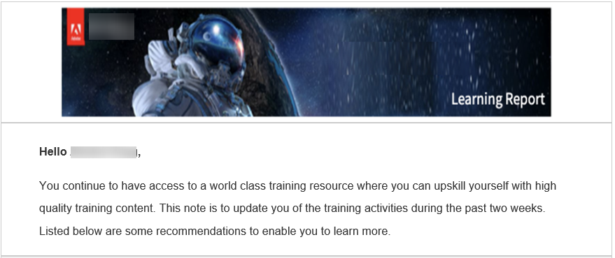
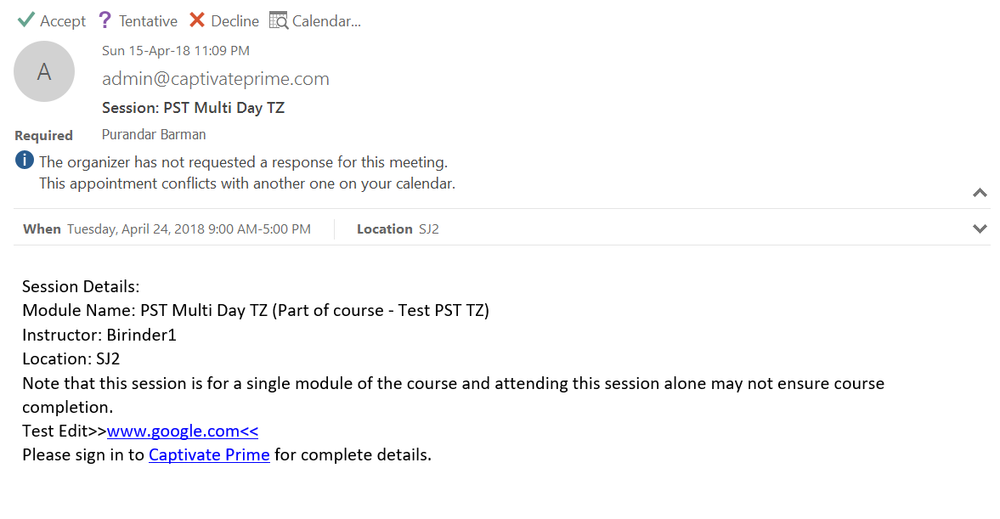

# E-postmallar

Händelserna i din utbildningsaktivitet utlöser e-postmeddelanden som skickas till elever. Du som är administratör kan enkelt aktivera, inaktivera eller ändra dessa e-postmallar.

Learning Manager-programmet skickar e-postmeddelanden till flera roller för användare baserat på händelser.

Du som är administratör kan anpassa e-postmallar genom att lägga till eller ändra innehåll och skicka meddelanden till användare för olika händelser som utlöses av elever, chefer och författare.

Administratörer kan också välja att inte skicka e-postmeddelanden för vissa händelser.

## Introduktion till e-postmallar

I den här utbildningen får du lära dig anpassa enskilda e-postmallar och anpassa inställningar på kurs- och kontonivå för e-postmallar.

<!--In this training, you will learn how to create a user group by names, email IDs, and combining multiple auto-generated user groups.-->

Skriv till <almacademy@adobe.com> om du inte kan starta utbildningen.

## Konfigurera e-postmallar {#configureemailtemplates}

Du som är administratör kan enkelt aktivera, inaktivera eller ändra dessa e-postmallar.

1. Klicka på **[!UICONTROL Email Templates]** i den vänstra rutan om du vill komma åt mallarna. På den här sidan visas tre olika kategorier av mallar, **[!UICONTROL General]**, **[!UICONTROL Learning Activity]** och **[!UICONTROL Reminders and Updates]**. Det finns en fjärde flik, **[!UICONTROL Settings]**, där du kan konfigurera mallarna.

   

   *Välj fliken Allmänt*

1. Klicka på en flik för att se listan över e-postmallar.

   

   *Visa listan över e-postmallar*

   Du kan enkelt aktivera eller inaktivera någon av dessa e-postaviseringar genom att klicka på växlingsknappen.

1. Om du vill ändra innehållet i mallen klickar du på mallnamnet. Här kan du se att du har olika mallar för olika typer av användare.

   

   *Visa mallen för ett e-postmeddelande*

1. Om du vill ändra innehållet i den här e-postmallen klickar du på e-postmeddelandets brödtext. Gör nu ändringarna i mallen. Du kan ändra texten och du kan också använda en av de här variablerna i ditt e-postmeddelande. Ändringarna i brödtextavsnittet kan bara tillämpas på den här e-postmallen. Men om du ändrar signaturen för det här e-postmeddelandet kan det tillämpas globalt på alla mallar.

   Håll muspekaren över varje ikon för att visa namnen.

   

   *Ändra e-postmallen*

   Du kan återställa meddelandets brödtext till standardinnehållet genom att klicka på länken **[!UICONTROL Revert to Original]** ovanför mallen.

1. Bekräfta ändringarna som har tillämpats på mallen genom att klicka på Spara. Nu kan användarna få e-postmeddelanden med den ändrade e-postmallen.

## Anpassa inställningar för en e-postmall {#customizesettingsofanemailtemplate}

1. Klicka på **[!UICONTROL Settings]** för att öppna inställningssidan. Nu kan du anpassa dina e-postmallar.
1. Om du vill anpassa namnet och e-post-ID som eleverna får e-postmeddelanden från redigerar du **[!UICONTROL Sender Name and Address].**

   Kontakta [***supporten för Adobe***](https://helpx.adobe.com/se/contact/enterprise-support.other.html#learning-manager) om du vill konfigurera eller ändra de här uppgifterna.

1. Anpassa din e-postbanderoll från alternativet **[!UICONTROL Email Banner]**. Ändra färg på banderollen genom att välja **[!UICONTROL Banner Background]**.

   Du kan använda en anpassad bild som banderoll genom att välja alternativet **[!UICONTROL Custom Image]**. Klicka på **[!UICONTROL Save]** när du har gjort ändringarna.

    

   *Anpassa bilden av en banderoll*

   Den anpassade bildstorleken måste vara 1 240 × 200 px och stöder .jpg, .jpeg och .png.

1. Redigera din e-postsignatur genom att klicka på **[!UICONTROL Edit]**. Gör nödvändiga ändringar och spara ändringen.

   

   *Anpassa din e-postsignatur*

1. Redigera konto-URL:en genom att klicka på Redigera på alternativet **[!UICONTROL Account URL]**.

   Konto-URL-länken visas i alla e-postmeddelanden, precis före signaturen. Ange den URL som krävs och klicka på **[!UICONTROL Save]**. Observera att den här URL:en bara är synlig för interna användare.

   

   *Anpassa konto-URL:en*

1. Konfigurera om chefer också måste ta emot e-postmeddelanden som skickas till deras direktrapporter med kryssrutan under alternativet **[!UICONTROL Optional Manager Email]**.

## Ange frekvens för sammanfattningsmeddelanden {#setfrequencyofdigestemails}

På sidan **[!UICONTROL Email templates]** > **[!UICONTROL Settings]** kan administratören ändra frekvensen för sammanfattningsmeddelanden som skickas till elever.

Klicka på **[!UICONTROL Edit]** i avsnittet **[!UICONTROL Digest Email Settings]**.

Välj **[!UICONTROL Biweekly]** eller **[!UICONTROL Monthly]** i listrutan.

* **[!UICONTROL Biweekly]:** Om du anger frekvensen till **[!UICONTROL Biweekly]** får eleverna e-postmeddelandet en gång varannan vecka.

* **[!UICONTROL Monthly]:** Om du anger frekvensen till **[!UICONTROL Monthly]** får eleverna e-postmeddelandet en gång i månaden.

*Ange frekvens för sammanfattningsmeddelanden*

När du aktiverar det här alternativet ställs frekvensen in på **[!UICONTROL Biweekly]** för befintliga/nya aktiva konton som standard.

### DND-lista med elever

Elever i en DND-lista kan inte se användarinställningar för sammanfattningsmeddelanden. Alternativet förblir inaktiverat och eleverna får inga e-postmeddelanden.

## E-postmeddelande med exempel till elever {#digest-email}

Följande exempel visar e-postmeddelandet som en elev får.

*Exempel på e-post*

### Utbildningsaktivitet

*E-post om utbildningsaktivitet*

### Rekommenderade utbildningar

*E-post om rekommenderad utbildning*

### Resultattavla

*Resultattavlans e-postadress*

### Senaste inlägg

*E-post om de senaste inläggen*

### Hämta e-poståtkomstrapport

Du kan ladda ned rapporten för e-poståtkomst genom att klicka på knappen **[!UICONTROL Download]**. Den här rapporten innehåller antalet användare som har fått e-postmeddelandet och antalet användare som har öppnat och klickat på länkarna.

## Anpassa e-postdomän {#customizeemaildomain}

Om du vill anpassa e-postdomänen och e-post-ID som dina elever får meddelanden från kontaktar du [***Learning Manager-supporten***](https://helpx.adobe.com/se/contact/enterprise-support.other.html#learning-manager) och anger detaljerna för domänen du vill lägga till och ditt nya e-post-ID.

Din begäran bearbetas och ett e-postmeddelande med en bekräftelselänk skickas till dig på den nya e-postadressen som du anger. Klicka på verifieringslänken i e-postmeddelandet för att bekräfta och slutföra verifieringsprocessen.

## Konfigurera Stör ej e-post {#dnd}

Som administratör kan du välja användare som kan ta emot e-postmeddelanden från Learning Manager och som inte kan det.

Du kan utföra detta genom att använda alternativet **[!UICONTROL Do Not Disturb]** på fliken **[!UICONTROL Settings]**. Användare kan läggas till i den här listan med sitt namn, e-post-ID eller unika användar-ID.

Sök efter en användare att lägga till i listan.

<!---->

## Blockerade e-postmeddelanden {#blockedemails}

I rullgardinsmenyn **Blockerade e-postmeddelanden** för varje användare kan du välja vilka typer av e-postmeddelanden som ska blockeras åt dem.

<!---->

Följande alternativ finns:

* **Dirigera e-post till elev:** Det här alternativet begränsar eller tillåter e-post som skickas till eleven.
* **Eskalering av e-postmeddelanden till elevens chef:** Det här alternativet begränsar eller tillåter e-postmeddelanden som skickas till elevens chef.
* **Om direktrapporter:** Det här alternativet begränsar eller tillåter inkommande e-postmeddelanden med eskalering som skickas till användarna om deras direktrapporter.
* **Om rapporter på överhoppningsnivå:** Det här alternativet begränsar eller tillåter inkommande e-postmeddelanden med eskalering som skickas till användarna om deras rapporter på andra nivån.

Om du vill ta bort en användare från listan kan du använda alternativet Ta bort som finns tillgängligt individuellt för varje användare på fliken Användare.

Du kan lägga till användare i DND-listan med hjälp av CSV-filer. Inkludera sant/falskt/tomt värde för var och en av följande kolumner:

* Blockera direktmeddelanden
* Blockera användareskalering
* Blockera inkommande direkta eskaleringar
* Blockera inkommande hoppa över eskaleringar

Ange sant i värdefältet för att blockera användare från att ta emot e-postmeddelanden för det valda alternativet. Om falskt anges som värde tas blockerade användare bort från blockeringen. Inga ändringar av tidigare markeringar görs om kolumnen lämnas tom.

## Flexibilitet när det gäller att anpassa mallarna

E-postmallar i Learning Manager innehåller nu fullt redigerbara avsnitt, vilket ger större flexibilitet att anpassa e-postkommunikation baserat på meddelande- och varumärkesinställningar.

De viktigaste förbättringarna av att anpassa e-postmallar är följande:

### Anpassa e-posthälsningsfras på kontonivå

Välj **[!UICONTROL Email Templates]** > **[!UICONTROL Settings]**. Välj **[!UICONTROL Edit]** i avsnittet **[!UICONTROL Email Salutation]**.

*Anpassa e-posthälsningsfras*

Du kan även anpassa följande:

* E-postbanderoll och e-postsignatur både på kursnivå och instansnivå.
* Redigera e-postsidfoten. Sidfotsområdet innehåller fördefinierade variabler för konto-URL:en, signaturen och eventuell text i fritt format som användaren lägger till.

Mallarna har även stöd för avancerade redigeringsfunktioner, till exempel att formateringen behålls när innehåll kopieras och klistras in från och till Microsoft Word.

## Inline-inbjudningar {#inlineinvitations}

Learning Manager-användare får nu inbjudningar via e-post. ICS-bilagor används inte längre för att skicka inbjudningar. Alla ändringar i inbjudan visas automatiskt i kalendern.

<!---->

## Vanliga frågor {#frequentlyaskedquestions}

+++Hur inaktiverar man hjälp i e-postmallar?

För närvarande går det inte att inaktivera **Hjälp** i e-postmallar i Learning Manager.

+++

+++Hur ändrar jag e-postmallar?

1. Du som är administratör loggar in på ditt Learning Manager-konto.
1. I den vänstra panelen klickar du på **[!UICONTROL Email Templates]** och väljer den e-postmall som du vill ändra.
1. Du kan anpassa mallarna genom att klicka på texten i mallens brödtext. Du kan infoga variabler i texten genom att klicka på motsvarande ikoner som visas på ögonblicksbilden. För muspekaren över varje ikon för att visa namnen och använda dem på mallen.
1. Klicka på **[!UICONTROL Save]** när du har gjort ändringar i mallen.

+++

+++Hur skapar man egna e-postmallar?

För närvarande går det inte att skapa anpassade e-postmallar. Du kan dock redigera och ändra befintliga mallar.

+++

+++Hur stänger man av e-postmallarna?

Om du vill stänga av e-postmallen markerar du mallen som ska inaktiveras och klickar på knappen för att växla mellan Ja och Nej.

+++

+++Hur ändrar jag avsändarens namn och adress i mallen?

Om du vill ändra avsändarens namn och e-postadress kontaktar du [Adobe Learning Manager support](https://helpx.adobe.com/se/contact/enterprise-support.other.html#learning-manager).

+++
