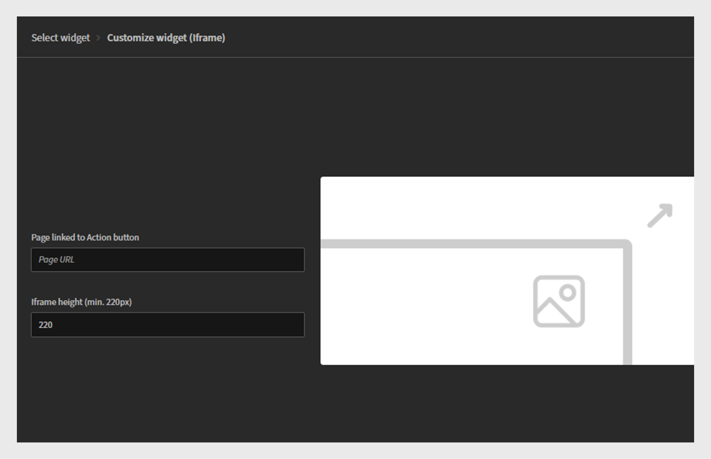

# Lägg till och konfigurera widgetar

## Kalenderwidget

I kalenderwidgeten visas schemalagda sessioner och utbildningar. Du kan bläddra i kalendern för att se utbildningar som planeras för de kommande månaderna. Det gör det möjligt att visa utbildningssessioner efter månad med möjlighet att bläddra åt vänster eller höger.

Kalenderwidgeten kan läggas till på en sida av en administratör för att visa utbildningsscheman. Elever kan interagera med kalendern genom att bläddra igenom månader för att se kommande sessioner. De kan filtrera sessioner för att snabbt hitta relevant utbildning.

### Lägg till en kalenderwidget

I ett finansföretag med separata team för försäljnings- och kundansvariga (CSM) kan administratörer använda den här widgeten för att framhäva teamspecifika utbildningssessioner. Exempel:

* Säljteamet kan se kommande sessioner om produktuppdateringar, efterlevnadsutbildning och säljseminarier.
* CSM-teamet kan se workshoppar för kundintroduktion, utbildning om kundkommunikation och kvalitetsprogram för tjänster.

Så här konfigurerar du kalenderwidgeten:

1. Logga in på Adobe Learning Manager som administratör.
2. Välj **[!UICONTROL Branding]** i den vänstra navigeringsrutan.
3. Välj **[!UICONTROL Custom Pages]**.
4. Välj den obligatoriska sidan och välj sedan **[!UICONTROL Page Design]**.
5. Välj **[!UICONTROL Edit]** och välj sedan layouten.
6. Välj **[!UICONTROL Add Widget]**.
7. Välj **[!UICONTROL Calendar]** och sedan **[!UICONTROL Proceed]**.

   
   _Widgetmarkeringsskärmen som visar kalenderwidgetalternativet om du vill visa utbildningssessioner i en kalender_

8. Skriv **[!UICONTROL Widget title]** och **[!UICONTROL Widget description]**.

   
   _Anpassningsskärmen för kalenderwidgeten, där administratörer kan ange widgetens titel, beskrivning och välja kataloger_

9. Välj en katalog genom att söka efter dess kurser och utbildningsvägar i widgeten **[!UICONTROL Calendar]**.
10. Välj **[!UICONTROL Add Widget]**.

Kalenderwidgeten läggs till på sidan. Administratören kan lägga till andra widgetar och publicera sidan.

>[!NOTE]
>
>Om inga kataloger har valts visas sessioner från alla kataloger.

## Kategorier-widget

I widgeten Kategorier visas utbildningsinnehåll som är organiserat i kataloger, produkter eller roller som kategorier. Det hjälper elever att enkelt bläddra bland och hitta utbildning grupperad efter ämnen, avdelningar, färdigheter eller andra relevanta klassificeringar.

Administratörer lägger till widgeten Kategorier på en sida för att visa kategoriserade utbildningsalternativ. Elever använder widgeten för att utforska utbildning genom att välja en kategori av intresse som sedan visar relaterade kurser eller vägar.

Titta i [Kataloger](/help/migrated/administrators/feature-summary/catalogs.md) och [Recommendations](/help/migrated/recommendations-adobe-learning-manager.md)-artiklar om du vill veta mer om hur du konfigurerar kataloger och rekommendationer.

### Lägga till en kategoriwidget

I ett företag för finansiella tjänster behöver olika team ofta tillgång till rollspecifik utbildning. Med kategoriwidgeten kan du ordna utbildningsinnehåll i tydliga, klickbara paneler, vilket gör det enklare för säljare och CSM-team att snabbt hitta det de behöver.

Så här konfigurerar du widgeten Kategorier:

1. Logga in på Adobe Learning Manager som administratör.
2. Välj **[!UICONTROL Branding]** i den vänstra navigeringsrutan.
3. Välj **[!UICONTROL Custom Pages]**.
4. Välj den obligatoriska sidan och välj sedan **[!UICONTROL Page Design]**.
5. Välj **[!UICONTROL Edit]** och välj sedan layouten.
6. Välj **[!UICONTROL Add Widget]**.
7. Välj **[!UICONTROL Categories]** och sedan **[!UICONTROL Proceed]**.

   
   _Widgetmarkeringsskärmen som visar kategoriwidgetalternativet om du vill ordna utbildningsinnehåll efter katalog, produkt eller roll för enkel navigering_

8. Välj de uppgifter som ska visas på kategorikorten:

   * **[!UICONTROL Category Image]**
   * **[!UICONTROL Category Description]**

9. Skriv **[!UICONTROL Widget title]** och **[!UICONTROL Widget description]**.
10. Sök efter och välj en katalog från **[!UICONTROL Category source]**.

    
    _Konfigurera alternativ för kategoriwidgeten för att ange widgetens titel och beskrivning och välj kategorikällan_

11. Välj **[!UICONTROL Add Widget]**.

Kategoriwidgeten läggs till på sidan. Administratörer kan lägga till andra widgetar och publicera sidan.

## Efterlevnadswidget

Widgeten Efterlevnadsstatus visar en elevs framsteg mot att uppfylla efterlevnad eller certifieringskrav. Den visar statusen för obligatorisk utbildning som tilldelats användaren, inklusive slutförda, väntande eller försenade kurser.

Administratörer lägger till widgeten Efterlevnadsstatus på sidor för att ge insyn i fortskridandet av efterlevnadsutbildningen. Elever använder det för att snabbt kontrollera vilka obligatoriska kurser de har slutfört och vilka som fortfarande behöver åtgärdas.

### Lägg till en widget för efterlevnadsstatus

I ett företag för finansiella tjänster måste både säljteamet och kundframgångschefen (CSM) slutföra efterlevnadsutbildningen i tid. Widgeten Efterlevnadsstatus gör det enklare för elever att spåra kommande deadlines och deras utbildningsframsteg direkt från sina teamspecifika sidor.

Så här konfigurerar du efterlevnadswidgeten:

1. Logga in på Adobe Learning Manager som administratör.
2. Välj **[!UICONTROL Branding]** i den vänstra navigeringsrutan.
3. Välj **[!UICONTROL Custom Pages]**.
4. Välj den obligatoriska sidan och välj sedan **[!UICONTROL Page Design]**.
5. Välj **[!UICONTROL Edit]** och välj sedan layouten.
6. Välj **[!UICONTROL Add Widget]**.
7. Välj **[!UICONTROL Compliance Status]** och sedan **[!UICONTROL Proceed]**.

   
   _Widgetvalsskärmen som visar efterlevnadsstatuswidgeten som används för att visa elevregistreringar med deadlines och statusindikatorer_

8. Skriv **[!UICONTROL Widget title]** och **[!UICONTROL Widget description]**.

   
   _Widgetskärmen Efterlevnadsstatus, där administratörer kan ställa in widgetens titel och beskrivning för att visa registreringens deadlines och status för elever_

9. Välj **[!UICONTROL Add widget]**.

Widgeten Efterlevnadsstatus kommer att läggas till på sidan. Administratörer kan lägga till andra widgetar och publicera sidan.

## Widget för kurser och banor

Widgeten Kurser och banor visar rekommenderade kurser och utbildningsvägar som är anpassade till elevens roll, intressen eller utbildningsbehov.

Administratörer lägger till widgeten Kurser och banor på sidor för att markera viktigt utbildningsinnehåll för specifika målgrupper. Elever använder widgeten för att bläddra bland rekommenderade kurser eller vägar och kan direkt registrera sig för kurserna.

### Lägg till en widget för kurser och banor

Ett finansiellt företag vill skapa rollspecifika utbildningssidor för sina två team: Sales och Customer Success Manager (CSM). Med widgeten Kurser och sökvägar kan du visa de mest relevanta utbildningsprogrammen för varje team.

Så här konfigurerar du widgeten Kurser och banor:

1. Logga in på Adobe Learning Manager som administratör.
2. Välj **[!UICONTROL Branding]** i den vänstra navigeringsrutan.
3. Välj **[!UICONTROL Custom Pages]**.
4. Välj den obligatoriska sidan och välj sedan **[!UICONTROL Page Design]**.
5. Välj **[!UICONTROL Edit]** och välj sedan layouten.
6. Välj **[!UICONTROL Add Widget]**.
7. Välj **[!UICONTROL Courses & Paths]**.

   
   _Widgetmarkeringsskärmen som framhäver widgeten Kurser och banor för att visa kurser, utbildningsvägar, certifieringar och arbetsstöd som interaktiva kort för elever_

8. Välj **[!UICONTROL Proceed]**.
9. Skriv **[!UICONTROL Widget title]** och **[!UICONTROL Widget description]**.
10. Välj kataloger eller välj manuellt upp till 25 kurser att visa.

_Widgeten Kurser och banor där administratörer anger widgetens titel, beskrivning och väljer kurser eller utbildningsvägar att visa som interaktiva kort_
&#x200B;11. Välj **[!UICONTROL Add widget]**.

Widgeten Kurser och banor läggs till på sidan. Administratörer kan lägga till andra widgetar och publicera sidan.

## Widget med innehållsruta

Med widgeten Innehållsruta kan administratörer lägga till anpassat innehåll såsom text, bilder, meddelanden eller länkar till en sida. Det ger ett flexibelt utrymme för att dela viktig information, tips, uppdateringar eller reklambudskap direkt i utbildningsmiljön.

### Lägga till widgeten Innehållsruta

Ett finansiellt företag vill skapa rollspecifika utbildningssidor för sina två team: Sales och Customer Success Manager (CSM). Med hjälp av widgeten Innehållsruta kan du lägga till anpassade avsnitt med titlar, beskrivningar, bilder och uppmaningsknappar som delar resurser, uppdateringar och motiveringsmeddelanden.

Så här konfigurerar du widgeten Innehållsruta:

1. Logga in på Adobe Learning Manager som administratör.
2. Välj **[!UICONTROL Branding]** i den vänstra navigeringsrutan.
3. Välj **[!UICONTROL Custom Pages]**.
4. Välj den obligatoriska sidan och välj sedan **[!UICONTROL Page Design]**.
5. Välj **[!UICONTROL Edit]** och välj sedan layouten.
6. Välj **[!UICONTROL Add Widget]**.
7. Välj **[!UICONTROL Content Box]** och sedan **[!UICONTROL Proceed]**.

   
   _Widgetmarkeringsskärmen som markerar rutan Innehåll för att visa anpassade bilder, text och åtgärdsknappar för att förbättra elevengagemanget_

8. Skriv **[!UICONTROL Title]** och **[!UICONTROL Description]**.
9. Skriv texten i **[!UICONTROL Action button label]** och ange en länk.
10. Välj något av alternativen för Bakgrundsfyllning:

    * **[!UICONTROL Color]**: Välj färg i färgväljaren eller skriv färgkoden i textfältet.
    * **[!UICONTROL Image]**: Bläddra och överför en bild.

11. Justera rutans höjd med alternativet **[!UICONTROL Content box height]**.
12. Markera alternativen för textformatering.

    
    _Anpassningsskärmen för innehållslådan, där administratörer kan ange en titel, beskrivning, åtgärdsknappsetikett och länk_

13. Välj **[!UICONTROL Add widgets]**.

Widgeten Innehållsruta läggs till på sidan. Administratörer kan lägga till andra widgetar och publicera sidan.

## Spelifieringwidget

Administratörer lägger till widgeten Spelifiering på anpassade sidor för att visa upp elevernas prestationer, som intjänade utmärkelsetecken, ackumulerade poäng och rankningar av resultattavlor. Elever kan följa sina framsteg och jämföra resultat med kollegor, vilket främjar motivation och uthålligt deltagande.

### Lägg till en widget för spelifiering

Ett finansföretag vill öka elevernas engagemang och motivation i sina två stora team: Sales and Customer Success Managers (CSM). Du kan använda widgeten Spelification till att belöna elever med poäng, utmärkelsetecken och rankningar av resultattavlan för att de har slutfört utbildningen och deltar aktivt.

För säljteamet kan spelifieringen fokusera på att belöna prestationer som är relaterade till säljkompetens, produktkunskap och utbildning om kundengagemang. För CSM-teamet kan det betona kundtjänstcertifieringar, efterlevnadsutbildning och klienthanteringsfärdigheter.

Så här konfigurerar du widgeten Spelifiering:

1. Logga in på Adobe Learning Manager som administratör.
2. Välj **[!UICONTROL Branding]** i den vänstra navigeringsrutan.
3. Välj **[!UICONTROL Custom Pages]**.
4. Välj den obligatoriska sidan och välj sedan **[!UICONTROL Page Design]**.
5. Välj **[!UICONTROL Edit]** och välj sedan layouten.
6. Välj **[!UICONTROL Add Widget]**.
7. Välj **[!UICONTROL Gamification]** och sedan **[!UICONTROL Proceed]**.

   
   _Widgetmarkeringsskärmen som visar spelifieringswidgeten som används för att visa utbildningsaktiviteter och prestationer på resultatlistan_

8. Skriv **[!UICONTROL Widget title]** och **[!UICONTROL Widget description]**.
9. Välj **[!UICONTROL Add widgets]**.

Widgeten Spelifiering läggs till på sidan. Administratörer kan lägga till andra widgetar och publicera sidan.

## HTML-widget

Med HTML-widgeten kan administratörer bädda in anpassad HTML-kod direkt på en sida. Det ger flexibilitet att lägga till anpassat innehåll, integrera verktyg från tredje part eller inkludera interaktiva element som går utöver standardwidgetfunktionerna. Det stöder omfattande anpassning via HTML, CSS och till och med JavaScript, vilket möjliggör unik design och externa integrationer inom utbildningsplattformen.

### Lägg till en HTML-widget

Ett finansföretag vill tillhandahålla anpassat, interaktivt innehåll anpassat till sina två huvudteam: säljare och kundansvariga (CSM). Med HTML-widgeten kan du bädda in anpassade HTML-baserade resurser som ekonomiska instrumentpaneler, datavisualiseringar, interaktiva formulär eller verktyg för marknadsanalys direkt i utbildningssidorna eller teamsidorna.

Så här konfigurerar du HTML-widgeten:

1. Logga in på Adobe Learning Manager som administratör.
2. Välj **[!UICONTROL Branding]** i den vänstra navigeringsrutan.
3. Välj **[!UICONTROL Custom Pages]**.
4. Välj den obligatoriska sidan och välj sedan **[!UICONTROL Page Design]**.
5. Välj **[!UICONTROL Edit]** och välj sedan layouten.
6. Välj **[!UICONTROL Add Widget]**.
7. Välj **[!UICONTROL HTML]** och sedan **[!UICONTROL Proceed]**.

   
   _Widgetmarkeringsskärmen som visar HTML-widgeten för att anpassa sidor med HTML, CSS och JavaScript-kod_

8. Skriv koden **[!UICONTROL HTML]**, **[!UICONTROL CSS]** och **[!UICONTROL JavaScript]** i respektive fält.
9. Välj **[!UICONTROL Add widget]**.

HTML-widgeten läggs till på sidan. Administratörer kan lägga till andra widgetar och publicera sidan.

## IFrame-widget

I iFrame-widgeten visas innehåll från en extern URL direkt på en sida på utbildningsplattformen. Den bäddar in en extern webbplats, ett verktyg eller ett program i en ram, så att eleverna kan visa och interagera med innehållet utan att lämna LMS.

### Lägga till en iFrame-widget

Ett finansiellt företag vill bädda in externa verktyg och resurser sömlöst inom sina interna utbildnings- och samarbetssidor för sina team som arbetar med försäljning och kundframgångshantering (CSM). Iframe-widgeten kan användas för att visa finansiella instrumentpaneler från tredje part, plattformar för marknadsanalys eller klienthanteringsportaler direkt i LMS-gränssnittet.

Så här konfigurerar du iframe-widgeten:

1. Logga in på Adobe Learning Manager som administratör.
2. Välj **[!UICONTROL Branding]** i den vänstra navigeringsrutan.
3. Välj **[!UICONTROL Custom Pages]**.
4. Välj den obligatoriska sidan och välj sedan **[!UICONTROL Page Design]**.
5. Välj **[!UICONTROL Edit]** och välj sedan layouten.
6. Välj **[!UICONTROL Add Widget]**.
7. Välj **[!UICONTROL Iframe]** och sedan **[!UICONTROL Proceed]**.

   
   _Widgetmarkeringsskärmen som visar Iframe-widgeten för att bädda in externa program eller webbsidor i ett markerat avsnitt_

8. Skriv URL-adressen i alternativet **[!UICONTROL Page linked to Action button]**.
9. Justera Iframe-höjden med alternativet **[!UICONTROL Iframe height]**.

   
   _Anpassningsskärmen för Iframe-widgeten, där administratörer kan ange en sidadress och ange iframe-höjd för att bädda in externt innehåll_

10. Välj **[!UICONTROL Add widget]**.

Iframe-widgeten läggs till på sidan. Administratörer kan lägga till andra widgetar och publicera sidan.

Administratörer måste inkludera åtkomsttoken som en frågeparameter i iframe-URL:en för att hämta rätt information. Om du till exempel vill visa information från Adobe Learning Manager inuti en iframe ska URL:en innehålla följande parametrar:

* userId: elevens unika identifierare
* konto-ID: Den kontoidentifierare som är associerad med eleven
* token: den autentiseringstoken som krävs för API-anrop
* språkinställning: elevens språk eller språkinställning

## Min utbildningswidget

Widgeten Min utbildning ger elever en anpassad vy över alla kurser, utbildningsprogram och certifieringar som de har tilldelat eller registrerat. Det organiserar utbildningsinnehåll efter typ och deadline, så att eleverna enkelt kan spåra framstegen och få tillgång till utbildningsmaterial. Med den här widgeten kan elever fokusera på sina nödvändiga utbildningar och se kommande deadlines under en kort period.

### Lägg till en My Learning-widget

Ett finansiellt företag vill erbjuda personliga utbildningsupplevelser som är skräddarsydda för dess två stora team: Sales and Customer Success Managers (CSM). Widgeten Min utbildning kan användas för att erbjuda varje teammedlem en samlad vy över deras tilldelade kurser, pågående utbildningsvägar och certifieringar.

Så här konfigurerar du widgeten Min utbildning:

1. Logga in på Adobe Learning Manager som administratör.
2. Välj **[!UICONTROL Branding]** i den vänstra navigeringsrutan.
3. Välj **[!UICONTROL Custom Pages]**.
4. Välj den obligatoriska sidan och välj sedan **[!UICONTROL Page Design]**.
5. Välj **[!UICONTROL Edit]** och välj sedan layouten.
6. Välj **[!UICONTROL Add Widget]**.
7. Välj **[!UICONTROL My Learning]** och sedan **[!UICONTROL Proceed]**.

   
   _Widget-urvalsskärm som markerar widgeten Min utbildning som används för att visa elevens personliga lista över registrerade kurser_

8. Skriv **[!UICONTROL Widget title]** och **[!UICONTROL Widget description]**.
9. Välj **[!UICONTROL Add widget]**.

Min utbildningswidget läggs till på sidan. Administratörer kan lägga till andra widgetar och publicera sidan.

## Widget för social utbildning

Med widgeten Social utbildning kan elever interagera, dela idéer och samarbeta på utbildningsplattformen. Det stöder publicering av olika typer av innehåll som text, videor, ljud, skärmdumpar, frågor och omröstningar. Elever kan kommentera, svara på, rösta upp eller ned inlägg och därmed främja peer-to-peer-kunskapsdelning och -engagemang. Widgeten skapar ett informellt utbildningsutrymme som kompletterar formell utbildning genom att uppmuntra social interaktion och kontinuerligt lärande.

### Lägg till en widget för social utbildning

Ett finansiellt företag vill ha samarbete och kunskapsdelning mellan sina två stora team: Sales and Customer Success Managers (CSM). Widgeten Social utbildning kan användas för att skapa interaktiva områden där teammedlemmar kan ställa frågor, dela med sig av bästa praxis, ladda upp nyttigt innehåll och engagera sig i diskussioner.

Så här konfigurerar du widgeten Social utbildning:

1. Logga in på Adobe Learning Manager som administratör.
2. Välj **[!UICONTROL Branding]** i den vänstra navigeringsrutan.
3. Välj **[!UICONTROL Custom Pages]**.
4. Välj den obligatoriska sidan och välj sedan **[!UICONTROL Page Design]**.
5. Välj **[!UICONTROL Edit]** och välj sedan layouten.
6. Välj **[!UICONTROL Add Widget]**.
7. Välj **[!UICONTROL Social Learning]** och sedan **[!UICONTROL Proceed]**.

   
   _Widgetmarkeringsskärmen som visar widgeten Social utbildning för att visa inlägg som uppmuntrar till samarbete och engagemang_

8. Skriv **[!UICONTROL Widget title]** och **[!UICONTROL Widget description]**.
9. Välj **[!UICONTROL Add widget]**.

Widgeten Social utbildning kommer att läggas till på sidan. Administratörer kan lägga till andra widgetar och publicera sidan.

## Nästa steg

När du har konfigurerat widgetar på sidorna använder du menyer för att ordna och gruppera sidorna.
