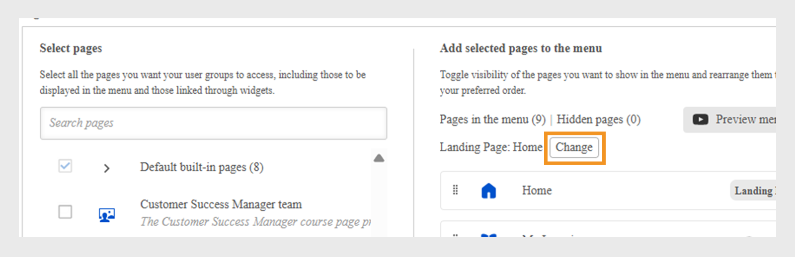

# Skapa en meny

Som administratör på ett finansiellt företag med två huvudteam, Sales och Customer Success Manager (CSM), bör du skapa separata menyer med respektive sidor. Detta gör det möjligt för elever att enkelt hitta kurser som är relevanta för deras roller under deras egen meny.

Som standard kan administratörer se standardmenyn på sidan **[!UICONTROL Menu]**, som inte kan tas bort. Den här menyn innehåller alla inbyggda sidor som visas i elevappen.

Så här skapar du en meny:

1. Logga in på Adobe Learning Manager som administratör.
2. Välj **[!UICONTROL Branding]** i den vänstra navigeringsrutan.
3. Välj **[!UICONTROL Menu]** och sedan **[!UICONTROL Create]**.

   
   _Menyskärmen visar alternativ för att visa, organisera och skapa anpassade menyer för olika elevgrupper_

4. Skriv **[!UICONTROL Menu name]** (till exempel Produktutbildning) och välj användargruppen i alternativet **[!UICONTROL Visible to]**.

   
   _Skärmen Skapa meny där administratörer kan ange ett menynamn för intern användning och ange användargrupper för att styra menysynligheten_

5. Följande typer av sidor finns på menyn:
   * **[!UICONTROL Built-in pages]**: Det här är standardsidorna som medföljer Adobe Learning Manager, till exempel Home, My Learning och Catalog. Administratörer kan inte ta bort de inbyggda sidorna från menyn. De kan dölja sidorna från menyn.
   * **[!UICONTROL Custom pages]**: Det här är administratörsskapade sidor med Experience Builder. Med anpassade sidor kan organisationer designa varumärkta, rollspecifika eller händelsebaserade upplevelser genom att lägga till widgetar, layouter och menyer som är anpassade för olika elevgrupper.
6. Välj **[!UICONTROL Change]** bredvid **[!UICONTROL Landing Page]** för att uppdatera elevens målsida.

   
   _Menykonfigurationsskärmen visar alternativet att välja sidor för att ändra målsidan för elevens gränssnitt_

7. Välj den anpassade sidan från alternativet **[!UICONTROL Select pages]**. Administratörer måste kunna välja endast publicerade anpassade sidor, inte de som har statusen Utkast.

   
   _Skärmen Sidval visar alternativet att inkludera den anpassade sidan för användargrupper och anpassa menyordningen_

8. Dra och släpp om du vill ändra ordningen på sidorna i menyn.
9. Välj **[!UICONTROL Preview menu]** för att visa menyn innan du sparar den.
10. Välj **[!UICONTROL Save]**.

Den skapade menyn visas för de valda eleverna. De kan komma åt de anpassade sidorna via sitt elevgränssnitt.

_Elevens användargränssnitt visar den anpassade sidan med utvalda utbildningsmoduler och enkel navigering från menyn på sidopanelen_

## Skapa en undermeny

Administratörer kan skapa en undermeny i menyn och lägga till anpassade sidor. Undermenyer har ingen startsida.

Så här skapar du en undermeny:

1. Välj **[!UICONTROL Create submenu]** på sidan **[!UICONTROL Menu configuration]**.

   
   _Menykonfigurationssidor markerar alternativet Skapa undermeny för att skapa undermenyer för eleverna_

2. Välj språk och skriv undermenyns rubrik.
3. Välj en ikon som ska visas bredvid undermenyn.
4. Välj **[!UICONTROL Add New Language]** för att skapa samma undermeny för olika språk. Om du till exempel lägger till engelska och franska kommer elever med gränssnittsspråket engelska valt att se den engelska undermenyn, medan elever med franska valt kommer att se den franska undermenyn.

   
   _Uppmaning på undermenyn visar alternativ för att välja undermenyns rubrik, språk och ikon som ska visas på menyn_

5. Välj **[!UICONTROL Proceed]**.
6. Dra och släpp sidorna på undermenyn.

## Konfigurera dolda sidor

Alternativet **[!UICONTROL Hide pages]** gör det möjligt för administratörer att hålla elevgränssnittet rent genom att visa färre sidor. Administratörer kan dölja sidor från menyn så att eleverna inte ser dem i elevgränssnittet, men eleverna kan fortfarande nå dessa sidor på andra sätt. Katalogsidan kan till exempel döljas på menyn, men nås via elevens startsida.

_Skärmen Menykonfiguration visar dolda sidor som katalog, social utbildning, färdigheter och märken_

>[!NOTE]
>
>Sidor på en undermeny kan inte döljas direkt. Om du vill dölja en sida drar du den först ut från undermenyn och döljer den sedan.

## Nästa steg

När du har ställt in sidor, widgetar och menyer kan du förbättra den övergripande elevupplevelsen genom att lägga till anpassningar med JavaScript och CSS.

