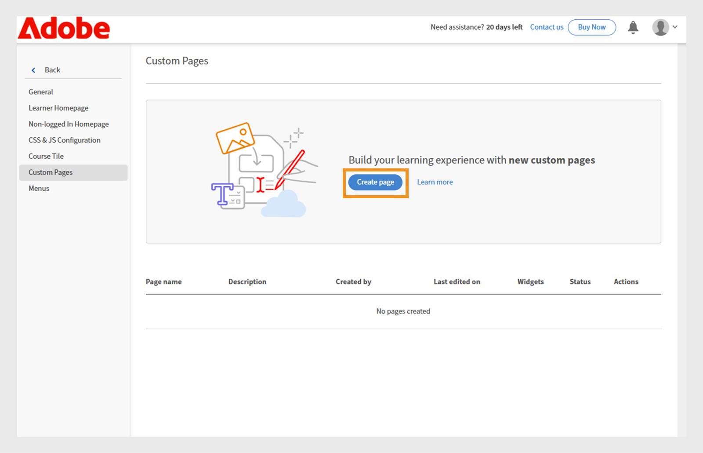

# Skapa en anpassad sida i Experience Builder

Administratörer på ett företag inom finansiella tjänster förvaltar två team: Försäljning och Kundframgång. Varje team har unika utbildningskrav, men båda har använt samma standardutbildningsportal. Detta har lett till förvirring, oreda och lågt engagemang bland elever.
Om du vill klara utmaningen utan att investera i en huvudlös version eller vänta på en anpassad utvecklarlösning kan du använda Experience Builder i Adobe Learning Manager. Med sidor, widgetar och menyer kan du designa varumärkta, rollspecifika portaler i bara några få steg, utan kodning.

Så här skapar du en anpassad sida för försäljningsteknikteamet i Adobe Learning Manager:

1. Logga in på Adobe Learning Manager som administratör.
2. Välj **[!UICONTROL Branding]** i den vänstra navigeringsrutan.
3. Välj **[!UICONTROL Custom Pages]**.
4. Välj **[!UICONTROL Create page]**.

   
   _Skärmen Anpassade sidor visar alternativet Skapa sida för att utforma nya anpassade utbildningsupplevelser_

5. Skriv **[!UICONTROL Page name]** (t.ex. Säljutbildning för säljteam).
6. Skriv **[!UICONTROL Page description]**.

   
   _Inställning av sidan Säljutbildning i Adobe Learning Manager, med fält för sidnamn, beskrivning, typ, URL och ikonkonfiguration för att skapa en riktad försäljningsportal_

7. Välj en av följande sidtyper:

   * **[!UICONTROL Build using ALM widgets]**: Administratören kan skapa en sida med hjälp av befintliga Adobe Learning Manager-widgetar. Skriv den anpassade strängen i fältet Page URL. Den här strängen läggs till i URL:en för den anpassade sidan.
   * **[!UICONTROL External page]**: Administratören kan lägga till en URL för den externa sidan. Om du väljer sidtypen extern skriver du den externa sidans URL i textfältet Sida-URL.

8. Välj **[!UICONTROL Change icon]** för att ändra sidans ikon.
9. Välj **[!UICONTROL Add New Language]** för att lägga till sidans standardspråk.
10. Välj **[!UICONTROL Save]**.

Sidan har skapats och sparats som ett utkast i avsnittet Anpassade sidor. Administratörer kan redigera och designa utkast av sidor med hjälp av widgetarna.

Nästa steg är att lägga till en layout till den anpassade sidan, där du kan lägga till och konfigurera widgetar.

## Sidlayout i Experience Builder

Designa sidan genom att välja lämplig avsnittslayout i listrutan. Den maximala bredden för en layout är 1 212 pixlar. Välj bland följande avsnittsalternativ beroende på hur många widgetar du vill lägga till och deras önskade storlek:

* **[!UICONTROL 1 column - Full section width]**: Innehållet sträcker sig över hela sektionens bredd och ger maximalt utrymme.
* **[!UICONTROL 2 columns - 1/2 section width each]**: Avsnittet delas upp jämnt i två lika breda kolumner.
* **[!UICONTROL 2 columns - 2/3 and 1/3 section width]**: Huvudinnehållet upptar två tredjedelar av bredden, medan sidoinnehållet använder en tredjedel.
* **[!UICONTROL 2 columns - 1/3 and 2/3 section width]**: Sidinnehållet tar en tredjedel och huvudinnehållet tar två tredjedelar av avsnittet.
* **[!UICONTROL 3 columns - 1/3 section width each]**: Avsnittet delas in i tre lika breda kolumner.

>[!NOTE]
>
>Högst 10 widgetar kan läggas till lodrätt i alla layouter, förutom layouten 1 kolumn - full avsnittsbredd.

Så här väljer du layout för sidan Säljutbildning i Experience Builder:

1. Logga in på Adobe Learning Manager som administratör.
2. Välj **[!UICONTROL Branding]** i den vänstra navigeringsrutan.
3. Välj **[!UICONTROL Custom Pages]** och välj sedan önskad sida.
4. Välj **[!UICONTROL Page Design]**.
5. Välj **[!UICONTROL Edit]**.

   
   _Skärmen Redigera siddesign för en anpassad sida för säljutbildning, med knappen Redigera för att lägga till sidavsnitt, widgetar och layout_ markerade

6. Välj alternativ i listrutan **[!UICONTROL Select section layout]**.

   
   _I dialogrutan för val av avsnittslayout kan administratörer välja widgetuppsättningar med en eller flera kolumner för anpassad siddesign_

7. Välj **[!UICONTROL Proceed]**.

Den tillagda layouten har följande alternativ:

* **[!UICONTROL Delete row]**: Ta bort raden från layouten.
* **[!UICONTROL Fit screen width]**: Justera layouten så att den automatiskt ändrar storlek så att den passar skärmen för bättre synlighet.
* **[!UICONTROL Reorder]**: Ändra ordningen på layouterna genom att dra och släppa dem på önskad plats.

_Sidlayout som visar layoutalternativen för att ordna om, expandera eller ta bort avsnittet_

Nästa steg är att lägga till och konfigurera widgetar på den anpassade sidan.

## Lägga till och konfigurera en widget

Lägg till widgetarna som behövs på de anpassade sidorna för säljutbildning baserat på kraven.

Så här konfigurerar du en widget på sidan Anpassad säljutbildning:

1. Välj **[!UICONTROL Add widget]** i layouten.

   
   _På siddesignskärmen kan administratörer välja och lägga till widgetar för att anpassa kurssidorna_

2. Välj **[!UICONTROL Content Box widget]** och sedan **[!UICONTROL Proceed]**.

   
   _Widgetmarkeringsskärmen som markerar rutan Innehåll för att visa anpassade bilder, text och åtgärdsknappar för att förbättra elevengagemanget_

3. Skriv **[!UICONTROL Title]** och **[!UICONTROL Description]**.
4. Skriv texten i **[!UICONTROL Action button label]** och ange en länk.
5. Konfigurera de återstående alternativen. Visa det här [avsnittet](/help/migrated/administrators/feature-summary/experience-builder/add-a-widget.md#content-box-widget) om du vill veta mer om **[!UICONTROL Content Box widget]**.

   
   _Skärmen Innehållsrutewidgetar visar alternativen för att konfigurera widgeten_

6. Skriv titel, beskrivning och åtgärdsknappsetiketten på skärmen **[!UICONTROL Content Box widget]** för försäljningstekniker
7. Välj **[!UICONTROL Add widget]**.
8. Välj **[!UICONTROL Save]** och välj bland följande alternativ:
a. **[!UICONTROL Save as Draft]**: Sidan sparas som ett utkast. Administratören kan redigera sidan senare.
b. **[!UICONTROL Save & Publish]**: Sidan kommer att publiceras och administratören kan lägga till den här sidan i menyn.

   
   _Med alternativen för att spara kan administratörer välja mellan att spara en sida som ett utkast för framtida redigering eller att publicera den för elevåtkomst_

Sidan kan sparas som ett utkast eller publiceras. Administratörer kan redigera utkast före publicering och även uppdatera och publicera om publicerade sidor.

Följ samma steg när du vill skapa sidor för Customer Success Manager-teamet.

## Förhandsvisa sidan

Så här förhandsgranskar du sidorna:

1. Logga in på Adobe Learning Manager som administratör.
2. Välj **[!UICONTROL Branding]** i den vänstra navigeringsrutan.
3. Välj **[!UICONTROL Custom Pages]**.
4. Välj den obligatoriska sidan och välj sedan **[!UICONTROL Page Design]**.
5. Välj **[!UICONTROL Edit]** och välj sedan **[!UICONTROL Preview page]** för att visa portalens förhandsgranskning.

   
   _Sidförhandsvisning med anpassad sidlayout och en banner, utvalda kurser_

6. Markera Inspect-läge om du vill visa widgetens höjd och bredd.

   
   _Skärmen Förhandsgranskning i Experience Builder med läget Inspect markerat så att administratörer kan granska och inspektera widgetarna_

## Skapa en sida på ett annat språk

Administratörer kan skapa flera språkspecifika anpassade sidor genom att välja önskade språk i Lägg till nytt språk när sidan skapas. När flera språk har lagts till måste widgetinformationen konfigureras separat för varje språk på motsvarande flik, bredvid fliken för standardspråk.

_Administratörer kan lägga till widgetinformation för ytterligare språk, till exempel franska, vid sidan av standardspråket_

## Hantera sidornas livscykel

Administratörer kan använda avsnittet Anpassade sidor för att redigera, ta bort och duplicera sidorna.

### Redigera sidan

Så här redigerar du anpassade sidor:

1. Logga in på Adobe Learning Manager som administratör.
2. Välj Varumärkning i den vänstra navigeringsrutan.
3. Välj Anpassade sidor.
4. Välj önskad sida och välj sedan Redigera.
5. Välj Spara.

Sidan uppdateras med ändringarna.

_Redigera den anpassade sidan så att administratörer kan uppdatera sidnamn, beskrivning och typ_

### Ta bort sidan

Så här tar du bort sidan:

1. Logga in på Adobe Learning Manager som administratör.
2. Välj Varumärkning i den vänstra navigeringsrutan.
3. Välj Anpassade sidor.
4. Välj önskad sida.
5. Välj Åtgärd och välj sedan Radera.

_Skärmen Anpassade sidor visar alternativ för att ta bort anpassade sidor som har skapats för produktutbildning_

### Duplicera sidan

Så duplicerar du sidan:

1. Logga in på Adobe Learning Manager som administratör.
2. Välj Varumärkning i den vänstra navigeringsrutan.
3. Välj Anpassade sidor.
4. Välj önskad sida.
5. Välj Åtgärd och välj sedan Duplicera.

_Skärmen Anpassade sidor visar alternativ för att duplicera de anpassade sidorna som har skapats för produktutbildning_

## Nästa steg

När du har skapat sidan lägger du till och konfigurerar widgetar på de anpassade sidorna enligt dina utbildningsbehov.
