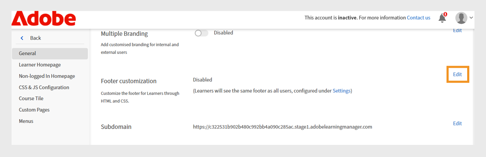

# Anpassa Experience Builder

## Anpassa en sidfot

Sidfoten visas längst ner i elevgränssnittet och visar vanligtvis standardinformation som konfigurerats i administratörsinställningarna. Administratörer kan ersätta detta med en anpassad sidfot för att skapa en varumärkt upplevelse. Med hjälp av HTML och CSS kan de definiera sidfotens utformning, layout och innehåll så att de matchar organisationens krav.

Du som är administratör på ett finansföretag kan konfigurera sidfoten med hjälp av det anpassade alternativet. Med det här alternativet kan du lägga till egna HTML- och CSS-format, vilket ger dig fullständig flexibilitet att utforma sidfoten.

Så här anpassar du sidfoten:

1. Logga in på Adobe Learning Manager som administratör.
2. Välj **[!UICONTROL Branding]** och sedan **[!UICONTROL General]**.
3. Välj **[!UICONTROL Edit]** bredvid alternativet **[!UICONTROL Footer customization]**.

   
   _Skärmen Allmänna inställningar i Adobe Learning Manager visar alternativ för att aktivera anpassning av sidfoten_

4. Välj växlingsknappen för att aktivera **[!UICONTROL Footer customization]**.

   
   _Anpassningsinställningar för sidfot i Adobe Learning Manager, som visar växlingsknappen för att aktivera anpassade sidfötter och fält för att lägga till HTML eller CSS för personlig varumärkning_

5. Skriv **[!UICONTROL HTML]** och **[!UICONTROL CSS]** på respektive flikar.

   
   _Sidfotsanpassningsskärmen i Adobe Learning Manager visar ett anpassat HTML-avsnitt för att lägga till, redigera eller formatera elevgränssnittssidfoten_

6. Välj **[!UICONTROL Preview]** för att visa den anpassade sidfoten innan du sparar den.

   
   _Förhandsvisning av en anpassad elevgränssnittssidfot i Adobe Learning Manager med kategoriserade länkar_

7. Välj **[!UICONTROL Save]**.

Den anpassade sidfoten visas för alla elever.

## Anpassa kursrutor

I ett finansföretag kan administratörer ställa in kursplattor för att bestämma vilka detaljer som elever ser. De kan till exempel visa kursbeskrivningen och färdighetsnamnet för efterlevnadsutbildning men dölja betyg eller författarens namn för att hålla fokus på obligatoriska krav.

Så här anpassar du kursrutorna:

1. Logga in på Adobe Learning Manager som administratör.
2. Välj **[!UICONTROL Branding]** och sedan **[!UICONTROL Course Tile]**.
3. Välj **[!UICONTROL Edit]**.

   
   _Inställningsskärmen för kurspanel i Adobe Learning Manager visar Redigera-alternativet för att anpassa panelen_

4. Välj alternativen nedan för att visa eller dölja detaljer som rör kursinformationen:

   a. **[!UICONTROL Format]**: Blandat/I egen takt/Klassrum/Virtuellt klassrum: Typ av utbildningsobjekt.
b. **[!UICONTROL Duration]**: Utbildningsobjektets längd.
c. **[!UICONTROL Skill/ Product]**: Visa nyckelkompetensen eller produkten som kursen omfattar.
d. **[!UICONTROL Rating]**: Visa kursens elevbetyg.
e. **[!UICONTROL Author name]**: Visar namnet på kursförfattaren
f. **[!UICONTROL Description (appears on hover)]**: Visa en kort sammanfattning av kursen när eleverna hovrar över kortet.
g. **[!UICONTROL Published date/ due date (appears on hover)]**: Visa antingen när kursen publicerades eller deadline för slutförande.

5. Välj alternativen nedan för att visa eller dölja information relaterad till kursåtgärder:

   a. **[!UICONTROL Add to Learning List button]**: Tillåt elever att spara kursen i sin personliga inlärningslista för framtida referens.
b. **[!UICONTROL Save button]**: Sparar alla ändringar som gjorts i kursinställningarna eller inställningarna.
c. **[!UICONTROL Enroll / Continue button]**: Gör det möjligt för elever att antingen registrera sig för en ny kurs eller fortsätta en kurs som de redan har startat. Om du döljer det här alternativet tas även åtgärderna Rekommendera inte och Hämta som visas bredvid alternativet bort.

   
   _Konfigurationsskärmen för kurspanel i Adobe Learning Manager, där administratörer väljer vilken information och vilka åtgärder som ska visas för elever_

6. En förhandsgranskning av kurspanelen visas på höger sida av skärmen.

   
   _Konfigurationsskärmen för kurspanelen i Adobe Learning Manager visar förhandsgranskningen av kurspanelen_

7. Välj **Spara**.

Den anpassade kurspanelen visas för alla elever.

**FÖRE ANPASSNING**


_Kurspanel i Adobe Learning Manager före anpassning_

**Efter anpassning**


_Kurspanel i Adobe Learning Manager efter anpassning_

## Anpassa med JavaScript och CSS

Som administratör på finansföretaget kan du anpassa elevappen genom att mata in CSS och JavaScript för att matcha ditt företags varumärkes- och regelkrav, vilket ger dig full kontroll över appens utseende, layout och interaktiva funktioner.

Så här anpassar du elevgränssnittet med CSS och JS:

1. Logga in på Adobe Learning Manager som administratör.
2. Välj **[!UICONTROL Branding]** och sedan **[!UICONTROL CSS & JS Configuration]**.
3. Välj **[!UICONTROL Edit]**.
4. Skriv den anpassade CSS-koden och JS-koden på respektive flik.

   
   _Skärmen CSS- och JS-konfiguration i Adobe Learning Manager där administratörer kan lägga till anpassade CSS- och JS_

5. Välj Spara.

Anpassningen visas för alla elever.

**Före anpassning**

Elevens hemsidesmeny är baserad på Adobe Learning Manager standarddesign.


_Adobe Learning Manager Elevens startsida före anpassning_

**Efter anpassning**

Efter att ha lagt till följande CSS och JS har elevens startsida uppdaterats baserat på anpassningen.

Exempel på CSS:

```
p{
display:block;
}

.withExtraMargin{
margin-right: 100px!important;
}
.alm-footer-extraMargin{
margin-top:0;
}

.alm-layout-almLayoutContainer{
margin: 0;
    margin-bottom: 5rem;
}
#page-756 #category-970151 .alm-category-card-cardLink
{
    height: 400px;

}
#page-756 #category-970151 .alm-category-card-header
{
height: 240px!important;
}
#page-656 .alm-category-card-cardLink{
    height: 380px;
background: white;
}
#page-656 .alm-category-card-header{
height: 200px!important;
}

#page-746 #html-636797 {
    background-color: #f7f9fc;
}

#page-746 .alm-layout-almLayoutContainer{
row-gap:0;
margin-bottom:0;
}

.alm-category-card-cardLink{
transition: border .3s ease;
}
.navText{
       font-size: 16px;
    cursor: pointer;
}
.submenuDownCaret{
display:none;}
.alm-catalog-container-pageContainer{
max-width: 1720px;
    width: 100%;
    padding: 0 40px;
    padding: 0 40px;
}


.pagenavbarcontainer.newNavbarContainer{
width: 1230px;
    margin: 0 auto;
}
div[automationid="learner-menu-inside-header"]{
margin-right:100px!important;
}
#searchScope,.searchSeparator,#searchInDropdown{
display:none!important;
}
#right-navbar{
    margin-right: 0;
}
#companyLogoImg{
cursor:pointer;
max-width:190px;
}
.alm-catalog-container-filtersContainer{
width:340px;
}
.alm-training-card-v2-imageFlipContainer{
border:none;
}
.newSearchBoxContainer{
border-radius: 5px !important;
    border-width: 2px !important;
    border-color: rgb(5, 32, 34) !important;
}
.searchBoxFlex{
width:250px!important;
flex-direction: row-reverse;
    padding-right: 10px;
}
.searchPlaceholderIcon svg{
    height: 16px;
    width: 16px;
}
.searchPlaceholderIcon svg path{
fill: black;
}
#page-656 .alm-layout-almLayoutContainer {
    padding-bottom: 5rem;
margin-bottom:0!important;
}
#page-656 .alm-strip-widget-header-stripHeaderContainer{
display:none;
}
#page-656 .content-wrapper{
padding-bottom:50px;
}
.myspan{
position: absolute;
    bottom: 10px;
    display: block;
    width: 85%;
    margin-left: 20px;
    margin-right: 20px;
    border-top: 1px solid #efefef !important;
    color: #5a697c !important;
    text-align: right;
    padding-top: 5px;
}
.alm-app-wrapperComponent{
padding-bottom:100px;}


@media (max-width: 768px) {
#page-656 .alm-category-widget-cardRow{
   flex-direction: column;
gap: 40px;
 }
#page-656 .alm-category-widget-stripCardContainerRow{
    width: 100%;
    display: flex;
    justify-content: center;
  }
}

@media (max-width: 768px) {
    .container2-right {
        display: none!important;
    }
.container-1 .content-wrapper{
    padding: 0 20px!important;
 }
}
```

Exempel på JS:

```
console.error("Hello Error")

setTimeout(() =>{
// Step 1: Check if #category-284977 is present
const categoryElement = document.querySelector('#category-284977');

if (categoryElement) {
  // Step 2: Find all elements with .alm-category-card-cardLink
  const cardLinks = categoryElement.querySelectorAll('.alm-category-card-cardLink');

  // Step 3: Loop over them and append span with random calculation
  cardLinks.forEach((link, index) => {
    const span = document.createElement('span');


    // Calculate number = (index+1) * 5
    let number = (index + 1) * 5;
if(index === 2){
number = number +2;
}
if(index == 3){
number = number - 7;
}

    span.textContent = `${number} courses`;
    span.classList.add('myspan');
    link.appendChild(span);
  });
}

},2000)
```


_Adobe Learning Manager Elevens startsida efter anpassning_

## Anpassa en widget

Administratörer kan anpassa widgetar på anpassade sidor genom att tillämpa CSS-klasser. De kan t.ex. justera texten i en innehållsrutewidget eller justera avståndet mellan kursplattor i widgeten Kurs och banor.

>[!TIP]
>
>Inspect elevsidan för att identifiera de format som du vill ändra. Kopiera de relevanta CSS-klasserna och klistra in dem på sidan CSS- och JS-konfiguration för att tillämpa dina anpassningar.

**Före anpassning**

Följande skärm visar utbildningssidan Säljtekniker innan du lägger till CSS-anpassningen.


_Elevsida för säljtekniker före anpassning_

**Efter anpassning**

När du har lagt till följande CSS-klasser uppdateras elevsidan enligt de format som har definierats i dessa klasser. Baserat på CSS-koden har texten i widgeten Innehållsruta justerats åt vänster och kursplattorna har nu ökat avståndet mellan dem.

```
.alm-custom-content-box-center {
    align-items: baseline;
    text-align: initial;
}
.alm-training-card-v2-imageContainer {
    border: 14px solid var(--prime-color-white);
    border-radius: -1px;
    height: 106%;
    position: relative;
    transition: all .1s ease-in-out;
}
.alm-course-path-widget-cardRow {
    display: flex;
    gap: 135px;
    margin: 0 0 21px;
    padding: 10px;
}
```


_Elevsida för säljtekniker efter anpassning_

### Fördefinierade CSS-klasser för widgetar

Nedan följer några fördefinierade CSS-klasser som är tillgängliga för widgetar.

| Widget-namn | Behållare-CSS |
|---|---|
| Kalender | alm-Calendar-widget-container |
| Kategori | alm-category-widget-container |
| Kategorikort | alm-category-card-container |
| Efterlevnad | alm-compliance-container |
| Kurs och banor | alm-course-path-widget-container |
| Kurs- och sökvägar för LO-kort | alm-training-card-v2-card |
| Innehållsruta | alm-custom-content-box-container |
| Spelifiering | alm-leaderboard-container |
| Socialt lärande | alm-social-learning-container |


