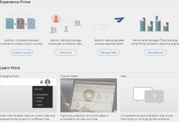

# Komma igång som administratör

Komma igång -sidan hjälper dig att gå igenom de viktigaste funktionerna i programmet.

När du loggar in som administratör kan du visa popup-fönstret med en lista med videor.

## Visa exempelvideor {#viewsamplevideos}

Bläddra igenom videosjälvstudiekurserna för att lära dig mer om de viktigaste funktionerna i din roll som administratör. Om du inte vill att det här popup-fönstret ska visas under inloggningen kan du inaktivera det genom att klicka på alternativet **[!UICONTROL Do not show at login]** längst ned till höger i popup-fönstret.

Klicka på **[!UICONTROL Close Window]** för att stänga popup-fönstret.

## Komma igång-sidan {#gettingstartedpage}

Från sidan Komma igång kan du utföra följande aktiviteter:

* Skapa kurser
* Lägg till användare
* Hantera användare
* Visa rapporter

Du kan också lära dig mer om Learning Manager-programmet genom att välja att visa självstudievideor, hjälpinnehåll och lära dig mer om olika roller.

