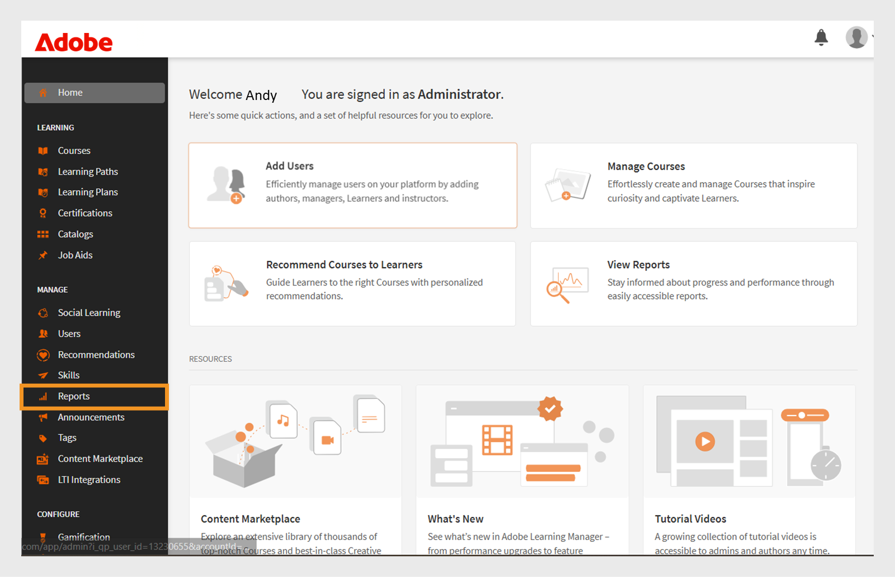
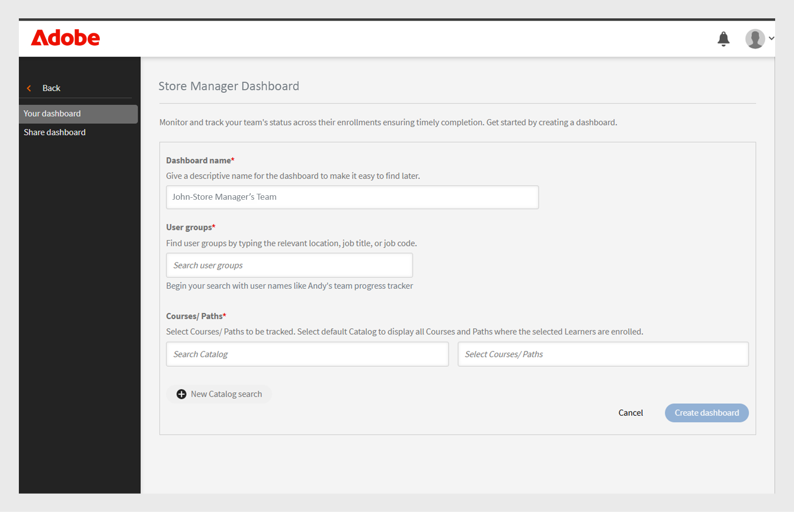

# Tavla för slutförda grupper

## Översikt över kontrollpanelen för lyckade gruppåtgärder

Med gruppkontrollpanelen (GSD) i Adobe Learning Manager kan administratörer och chefer övervaka elevens framsteg i nära realtid (60 minuters fördröjning från registrering, framsteg eller slutförande till reflektion på kontrollpanelen) på olika avdelningar eller användargrupper. Det stöder proaktiv spårning av kursens slutförande, registrering och väntande åtgärder, vilket gör det enklare att hantera inlärning för team. Visa den här [artikeln](/help/migrated/administrators/feature-summary/add-users-user-groups.md) om du vill veta mer om användargrupper.

## Viktiga användningsfall

Tavlan för lyckade gruppåtgärder erbjuder följande:

* **Förenklar spårning av elevframsteg**: Tavlan för gruppframgång innehåller en användarvänlig realtidsvy av elevdata, vilket minskar behovet av Excel-baserade utskrifter. Chefer och administratörer kan snabbt se elevregistreringar och kursframsteg för att stödja viktiga scenarier som:

   * **Prestandagranskningsberedskap**: Chefer kan bedöma kursförloppet för teammedlemmar före utvärderingscykler.
   * **Övervakning av efterlevnad**: Identifiera elever som inte har slutfört obligatoriska utbildningar.
   * **Spårning på teamnivå**: Franchise-, butik- eller regionchefer kan se till att deras team slutför den utbildning som krävs i tid.

* **Underlättar teamhantering**: Instrumentpanelen för gruppframgång är användbar för chefer med små team (under 50 personer), som butikschefer, franchisechef, återförsäljarchefer eller interna team. Det ger en teamvy och gör att chefer snabbt kan kontrollera om deras team har slutfört den nödvändiga uppsättningen kurser för att uppnå affärsmål.

## Använda kontrollpanelen för slutförda grupper

En administratör kan aktivera och skapa instrumentpanelerna genom att ge dem ett namn, välja användargrupper och välja kurser eller utbildningsvägar. Kontrollpanelerna kan delas med andra administratörer eller chefer.

### Aktivera kontrollpanelen för slutförda grupper

Administratören måste aktivera kontrollpanelen för lyckade gruppåtgärder för kontot. Gör så här för att aktivera kontrollpanelen för slutförda grupper:

1. Logga in som administratör.
2. Välj **[!UICONTROL Settings]**&#x200B;och sedan **[!UICONTROL Reports]**.
3. Välj växlingsfunktionen **[!UICONTROL Dashboard visibility]**.
4. Skriv namnet på instrumentpanelen (till exempel **[!UICONTROL Store Manager Dashboard]**).
   
   _Fält för instrumentpanelens namn, användargrupp och val av utbildningsväg_
5. Välj **[!UICONTROL Overview Visibility]** för att aktivera översiktsavsnittet på kontrollpanelen. I det här avsnittet kan du se förloppet för upp till 50 elever.
6. För avsnittet **[!UICONTROL Learner Transcript]** väljer du de obligatoriska kolumner som du vill visa.

   * Elev
   * Banor och kurser
   * Status
   * Registreringsdatum
   * Datum för senaste besöket
   * Slutförandedatum

När funktionen har aktiverats kan administratörer visa kontrollpanelen för lyckade grupper i avsnittet **[!UICONTROL Reports]**.

### Skapa en tavla för lyckade gruppåtgärder

Administratörer kan skapa upp till 100 instrumentpaneler för att visa elevernas framsteg. Så här skapar du en kontrollpanel:

1. Logga in som administratör och välj sidan **[!UICONTROL Reports]**.

   
   _Välj rapporter på administratörens startsida_

2. Välj kontrollpanelen för lyckade gruppåtgärder. Instrumentpanelens namn är **[!UICONTROL Store Manager Dashboard]**.

   
   _Välj instrumentpanel för Store Manager_

   >[!NOTE]
   >
   >Namnet som du angav när instrumentpanelen för gruppresultat aktiverades visas som instrumentpanelens namn.

3. Välj **[!UICONTROL Create New Dashboard]** i listrutan Välj kontrollpanel.

   
   _Välj alternativet för att skapa en GSD_

4. Skriv instrumentpanelens namn.
5. Välj en användargrupp som ska visas på kontrollpanelen.
6. Sök igenom kurserna eller utbildningsvägarna och välj dem från resultaten.

   
   _Välj användargrupp och kurser_

7. Välj **[!UICONTROL Create dashboard]**.

För större team skapar du en instrumentpanel genom att välja användargruppen **Standardkatalog** och **Alla elever** på fliken **[!UICONTROL Learner Transcript]**. Detta inkluderar alla kurser och elever i vyn **[!UICONTROL Learner Transcript]**, vilket gör det enklare att söka efter och spåra varje elevs framsteg.

### Visa kontrollpanelen för lyckade gruppåtgärder

När du har skapat en kontrollpanel kan administratören visa den genom att följa dessa steg:

1. Logga in som administratör.
2. Välj **[!UICONTROL Reports]** och sedan **[!UICONTROL Group Success Dashboard]**.
Instrumentpanelens namn är Store Manager-instrumentpanelen.
3. Välj skapad tavla i listrutan **[!UICONTROL Select dashboard]** i avsnittet **[!UICONTROL Your dashboards]**.
4. Kontrollpanelen är uppdelad i:
   * **[!UICONTROL Overview]**: Du kan snabbt se elevernas framsteg på enskilda kurser eller utbildningsvägar. Du kan visa framsteg på upp till 50 kurser eller utbildningsvägar och 50 elever samtidigt. Om du vill kontrollera en specifik elevs framsteg väljer du avsnittet **[!UICONTROL Learner Transcript]**.

   
   _Utbildningsstatus för elever i butikschefens team_

   * **[!UICONTROL Learner Transcript]**: Visa elevens framsteg genom att välja en specifik elev eller kurs. Sök efter en elev på instrumentpanelen för att kontrollera utbildningsförloppet. Om du har skapat instrumentpanelen med standardkatalogen och inkluderat alla elever kan du söka efter valfri elev för att enkelt granska deras framsteg.

   
   _Detaljerad elevtranskriptionsvy med kolumner för registrering och slutförande_

>[!NOTE]
>
>Välj **[!UICONTROL Go to Report]** på fliken **[!UICONTROL Learner Transcript]** för att hämta den detaljerade elevens betygsutdrag.

### Dela resultattavlan för grupper

Administratörer kan dela kontrollpaneler med andra administratörer eller chefer. Följ proceduren för att dela en kontrollpanel:

1. Välj **[!UICONTROL Reports]** och sedan **[!UICONTROL Group Success Dashboard]**. Instrumentpanelens namn är **[!UICONTROL Store Manager Dashboard]**.
2. Välj **[!UICONTROL Share]** i alternativet **[!UICONTROL Your dashboards]**.

   
   _Välj delningsknapp_

3. Sök efter användare eller användargrupper efter namn och välj dem.

   
   _Dela tavla med användare eller användargrupper_

4. Välj **[!UICONTROL Proceed]** för att dela instrumentpanelen.

Du kan se information om den delade instrumentpanelen under **[!UICONTROL Reports]**, välja **[!UICONTROL Group Success Dashboard]** (Store Manager-instrumentpanelen) och sedan **[!UICONTROL Shared dashboards]**.

_Visa den delade tavlan_

>[!NOTE]
>
>Hanteraren eller den anpassade administratören kan bara se de aktiverade katalogerna på instrumentpanelen för gruppframgång som delas av administratören.

### Begränsningar för resultattavlan för grupper

Detta är begränsningen för kontrollpanelen för lyckade gruppåtgärder:

* Återkommande certifikat stöds inte på instrumentpanelen.
* Kolumnen **[!UICONTROL Last access date]** på fliken **[!UICONTROL Learner Transcript]** visar för närvarande data för utbildningsvägar och certifieringar. Support för kurser planeras för en framtida uppdatering.

## Välja elever i flera användargrupper

När du väljer mer än en användargrupp använder Adobe Learning Manager särskilda regler för att avgöra vilka elever som ska inkluderas:

* **Användargrupper med samma aktiva fält**: Om användargrupperna använder samma fält (till exempel plats) innehåller systemet alla elever från båda grupperna. Det kombinerar värdena. Till exempel: **Plats = Bangalore** och **Plats = Chennai**. Det inkluderar elever från båda platserna.
* **Användargrupper med olika aktiva fält**: Om användargrupperna använder olika fält (till exempel plats och roll) innehåller systemet endast elever som uppfyller alla villkor. Till exempel: **Plats = Bangalore eller Chennai** och **Roll = Chef**. Det inkluderar endast elever som har chefsrollen och som finns i Bangalore eller Chennai.

* Samma aktiva fält: Elever kombineras (ELLER logik)
* Olika aktiva fält: Eleverna måste matcha alla kriterier (OCH logik)

Detta tillvägagångssätt hjälper dig att fokusera på rätt elever baserat på dina valda förutsättningar.
