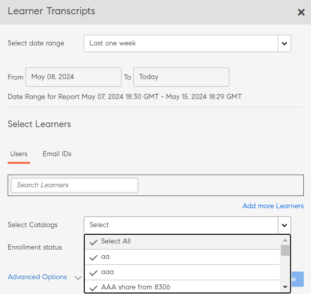

# Avskrifter från elever

Ladda ned elevutskrifter och hantera rapporter med hjälp av Learning Manager.

Adobe Learning Manager gör det möjligt för administratörer i en organisation att generera avskrifter som är kopplade till elever.

## Generera avskrifter från elever {#generatelearnertranscripts}

1. För att generera elevutskrifter, klicka på **[!UICONTROL Reports]** den vänstra rutan i Administratörsinloggning.

   Administratören navigerar **[!UICONTROL Custom Reports]** till fliken > **[!UICONTROL Excel Reports]** på **[!UICONTROL Reports]** sidan.

1. Klicka på länken **[!UICONTROL Learner Transcripts]**.

   Historiksidan **[!UICONTROL Learner Transcript]** visas med meddelandet - **Inga Learner Transcripts har genererats ännu** eller en lista över nedladdningar som har utlösts efter implementering av Learning Transcripts historiksida.

   <!---->

   En dialogruta för avskrifter av elever visas. Välj det datumintervall som du vill att utskriften ska genereras för.

   >[!NOTE]
   >
   >Som standard är startdatumet elevens registreringsdatum och till-datumet är alltid det aktuella datumet. Du kan bara ändra startdatumet från när du behöver data.

1. Välj elevernas namn i fältet **[!UICONTROL Select Learners]** och klicka på **[!UICONTROL Generate].**
1. Du kan välja en enskild elev eller grupper av elever. Om du vill lägga till fler än en elev klickar du på **[!UICONTROL Add More Learners]**.

   

   *Lägg till fler elever*

1. Du kan välja specifika kataloger genom att markera kryssrutan. Avskrift laddas endast ned för de angivna katalogerna. Du kan välja specifika kataloger genom att välja katalogen i **[!UICONTROL Select Catalogs]** listrutan.

   

1. När du exporterar Learner Transcripts finns det ett alternativ, **[!UICONTROL Enrollment Status]**. Den här listrutan innehåller följande alternativ:

   * Markera allt
   * Slutfört
   * Pågår
   * Inte påbörjad
   * Avregistrerad

   

   *Välj katalogen*

1. Du kan också ladda ner utskrifter för elever som har tagits bort från ett konto.

   För att ladda ner elevutskrifter av raderade användare, klicka på pilen **[!UICONTROL Advanced Options]** och aktivera kryssrutan **[!UICONTROL Include data of Deleted Learners]**.

   

   *Ladda ner Learner Transcripts av raderade elever*

1. Du kan välja att ladda ner information på modulnivå i Learner-utskriften genom att markera kryssrutan &quot;**[!UICONTROL Enable module level information]**&quot;. I det här fallet hämtas modulnamn och den tid som spenderas på varje modul som en del av avskriften om det här alternativet är aktiverat.
1. Du kan välja att ladda ner kompetensdata och sammanfattningsblad genom att aktivera kryssrutan &quot;**[!UICONTROL Include skills data and summary sheets]**&quot;.

   Transkriptioner genereras och laddas ner till din dator som .zip filer när kompetensdata inte finns med. Om kryssrutan Kompetensdata är aktiverad genereras och laddas utskrifter ner .xls filer.

## Generera Learner-utskrift med hjälp av copy-paste

Att hämta Learner-utskrifter blir en tråkig process eftersom det bara kan erhållas för en elev eller användargrupp en i taget. Här, med copy-paste-funktionen kan du kopiera listan över Learner e-post-ID och klistra in den på en gång.

1. Logga in som en **[!UICONTROL Administrator]** eller **[!UICONTROL Manager]**.
1. Gå till **[!UICONTROL Reports]** under **[!UICONTROL Manage]**, den laddar **[!UICONTROL User Activity]** sidan.
1. Klicka **[!UICONTROL Custom Reports]** på i den vänstra rutan och välj **[!UICONTROL Learner Transcripts]** från listan.
1. **[!UICONTROL Learner Transcripts]** På sidan klickar du på **[!UICONTROL Generate New]** knappen i det övre vänstra hörnet.
1. Välj önskade datum genom att klicka på i **[!UICONTROL Select date range]** rullgardinsmenyn. Klicka på **[!UICONTROL Email IDs]** tabbtangenten för att ange den kopierade listan med unika e-post-ID:n.

   

   *Kopiera och klistra in e-post-ID:n*

1. Används **[!UICONTROL Validate Email Ids]** för att kontrollera om det angivna id:t är korrekt.

   

   *Verifiera e-post-ID:n*

   Om det angivna e-post-ID:t är felaktigt, skulle det markeras i rött tillsammans med ett valideringsmeddelande enligt ovan.

   **[!UICONTROL Generate]** Knappen kommer inte att vara tillgänglig om inte alla angivna e-post-ID:n är korrekta.

   

   *Generera elevavskrifter*

1. Klicka på **[!UICONTROL Generate]** knappen för att generera Learner Transcripts för alla nämnda e-post-ID:n. Du kommer att få ett bekräftelsemeddelande enligt nedan som anger rapportgenerering.

   

   *Bekräftelsemeddelande om att rapporten genereras*

   Generera elevutskrifter kan kombineras för e-post-ID:n som anges under båda **[!UICONTROL Users]** och-fliken **[!UICONTROL Email IDs]** .

## Nedladdningar av Elevens historia {#ltdownload}

På nedladdningssidan **[!UICONTROL Learner Transcript]** , för att generera en rapport, när du klickar på **[!UICONTROL Generate New]** knappen, visas dialogrutan Elevutskrifter.

*Generera en rapport över alla Learner Transcripts*

Klicka och **[!UICONTROL Advanced Options]** expandera panelen.

Välj användarna och den katalog de tillhör. När du har klickat på **[!UICONTROL Generate]** knappen visas en dialogruta som nämner den ungefärliga tid det tar att ladda ned rapporten. Skapa rapporten genom att klicka på **[!UICONTROL Generate]**.

*Välj knappen Generera*

Transkriptionen genereras i bakgrunden och du kan fortsätta med dina uppgifter i Learning Manager. När utskriften har genererats kan du ladda ner utskriften från listan.

Som administratör kan du se alla utskrifter som genereras av någon i systemet.

*Visa historik över nedladdningar*

Nedladdningslistan visar följande attribut:

* **Elever:** De elever/elevgrupper vars utskrifter ska laddas ner.
* **Ytterligare data som ingår:** Beror på vilka ytterligare data administratören vill ladda ner från det avancerade alternativet i modalen Lägg till elevutskrift
* **Status:** Nedladdad, i kö eller pågående.
* **Från** och **Till**: Varaktighet för de utskrifter som ska laddas ner.
* **Tillämpade filter:** Om du har tillämpat filtren för registreringsstatus.
* **Genererad av:** Användar-ID för den Learning Manager-användare som har begärt nedladdningen.
* **Status:** Nedladdad, i kö eller pågående.

Du kan avbryta nedladdningen när som helst. Om ett jobb avbryts av administratören skickar Learning Manager ett meddelande i appen till den användare som utlöste elevutskriften.

*Kö för nedladdning av avskrift av elever*

Du kan **avbryta** nedladdningen när som helst. Om ett jobb avbryts skickar Learning Manager ett meddelande i appen till den användare som har avbrutit jobbet.

## Uppgifter om raderade elever {#dataofdeletedlearners}

Du kan inkludera data om raderade elever i listan Learner Transcript. I dialogrutan Elevavskrifter aktiverar du alternativet **[!UICONTROL Include data of Deleted Learners]**.

Efter att ha aktiverat alternativet och klickat på **[!UICONTROL Generate]**, visas de raderade elevernas data på nedladdningssidan för Learner Transcript, som visas nedan:

*Visa data för borttagna learbers*

## Anpassa kolumner {#customize-columns-lt}

En administratör kan anpassa kolumnerna som exporteras i en Learner Transcript-rapport. Administratörer, anpassade administratörer och chefer kan konfigurera kolumnerna innan de exporterar rapporten.

I dialogrutan **[!UICONTROL Learner Transcripts]** klickar du på **[!UICONTROL Advanced Options]**. I avsnittet **[!UICONTROL Configure Export Format]** väljer du de kolumner som du vill exportera.

*Anpassa kolumner som ska exporteras*

Anpassning tillåts endast när en användare laddar ned Learner Transcript i . CSV-format. När du laddar ner i . XLSX-format kommer valet av kolumnpreferens inte att respekteras och alla standardkolumner kommer att exporteras.

## Innehåll i avskriftsfilen för elever {#learnertranscriptfilecontent}

En typisk avskriftsfil för elever består av sex excelark i en enda fil. Elevavskriftsbladen ger en övergripande inblick i data, inklusive antalet elever som är involverade per kurs, deras färdigheter, slutförandeprocenten baserat på kurs eller elev och en instrumentpanel för efterlevnad. Följande är de instrumentpaneler som är tillgängliga i elevutskrifter:

**Transkribering av elever**

I excel-arket för elevutskrifter, tillsammans med profilinformation om eleven, tillhandahålls information om konsumtion av inlärningsobjekt, t.ex. inskrivningsdatum, startdatum, uppnått betyg, erhållet resultat från frågesport. Om kurser är en del av ett utbildningsprogram listas de separat förutom information om individuell kurskonsumtion.

**1- Instrumentpanel för inlärningsaktivitet**

I den här LO-specifika instrumentpanelen kan du se antalet elever för varje kurs, utbildningsprogram eller certifiering. Du kan visa förloppsbladet för elever för ett visst lärobjekt. Det här bladet visar data som antalet elever som har slutfört kursen eller utbildningsprogrammet, pågående elever och elevernas inlämningsdatum.

Användarnas framsteg för den specifika kursen beräknas baserat på inmatningsfälten där du anger inlämningsdatum och tröskelvärden för framstegsprocent. Om du till exempel anger 7 dagar och 70 % som värden i inmatningsfältet, visas kursförloppet för kurser som ska avslutas om 7 dagar och för kurser som har mer än 70 % förlopp. Du kan också ändra tidsperioden i det här bladet, där ändrade data automatiskt visas i den här instrumentpanelen.

**2 - Instrumentpanel för läraktivitet**

Den här instrumentpanelen för utbildning visar data för en specifik användare. Från den här instrumentpanelen kan du se de kurser, utbildningsprogram eller certifieringar som en viss användare har registrerat sig för. Tabellen visar också data om vilka lärobjekt som användaren har slutfört, vilka lärobjekt som pågår och kommande inlämningsdatum för användaren.

Användarnas framsteg för varje kurs beräknas baserat på de indata som du anger. Det vill säga förfallodatum och procentvärden för förlopp. Om du till exempel anger 7 dagar och 70 % som värden i inmatningsfältet, visas användarens framsteg för olika kurser som ska lämnas in om 7 dagar och för kurser som har mer än 70 % framsteg.

**Färdighet**

I kompetensbladet anges kompetensnamn, färdighetsnivå, nödvändiga poäng, intjänade poäng, slutförandeprocent och annan profilinformation. Ett exempel på en ögonblicksbild av excel-arket för färdigheter finns nedan som referens.

*Exempel på Excel-arket för färdigheter*

**1- Instrumentpanel för färdigheter**

I den här instrumentpanelen kan du se om din organisation är utrustad på olika färdigheter. För en specifik färdighet kan du kontrollera antalet användare i en organisation som ska ha den här färdigheten jämfört med antalet som faktiskt har kompetensen. Den här instrumentpanelen anger också de användare som måste uppdatera sina kunskaper. Det här värdet beräknas baserat på de indata som du anger i fältet Indata. Om du till exempel anger 50 dagar som indata tillhandahåller instrumentpanelen data om användare som behöver uppdatera sina kunskaper efter 50 dagar.

**2- Instrumentpanel för färdigheter**

Den här instrumentpanelen för färdigheter är mer användarspecifik. Du kan filtrera en specifik användare eller flera användare och visa deras kompetensnivå som en instrumentpanel. Det här bladet kan hjälpa chefer och administratörer att spåra hur skicklig varje elev är jämfört med hur skicklig de förväntas vara. Skill dashboard kastar också ljus över eleverna som måste fräscha upp sina färdigheter. Uppdateringslistan för elever beräknas baserat på antalet dagar som du anger i inmatningsfältet.

**Instrumentpanel för efterlevnad**

Instrumentpanelen för efterlevnad består av två delar – efterlevnadsrapport per användare och efterlevnadsrapport per utbildning. För den användarbaserade rapporten kan du använda instrumentpanelen för efterlevnad för att spåra användare som har kommande förfallodatum för viktiga efterlevnadsinitiativ. För den utbildningsbaserade rapporten kan du filtrera efter utbildningsprogram eller certifiering.

För båda efterlevnadsrapporterna filtrerar du efter förfallodatum för att visa lämpliga data.

### Kolumnerna Tid och datum i utskriften {#datetime}

Värdena i följande kolumner har minuter avrundade till närmaste minut och sekunder till 00:

* Registreringsdatum (tidszonen UTC)
* Påbörjad datum (tidszonen UTC)
* Slutförandedatum (tidszonen UTC)

*Kolumnerna Tid och datum i Excel-arket*

### Modulens varaktighet och ID-kolumner i avskriften {#moduledurationandidcolumnsinthetranscript}

Learner Transcript visar även kolumnerna- **[!UICONTROL Module Duration]** och **[!UICONTROL ID]**.

*Modulens varaktighet och ID-kolumner i avskriften*

### ANDRA kolumner i avskriften {#ModuledurationandIDcolumnsinthetranscript-1}

| **Spalt** | **Beskrivning** |
|---|---|
| Efter | Antal elever som uppnådde färdigheten före det angivna (värde) antalet dagar som behöver uppdateras |
| Kompetens | Färdighetsnamnen som tilldelas elever |
| Chefens namn | Chefens namn vars underordnade kompetensuppgifter ska visas i tabellen Kompetenssammanfattning |
| Radetiketter | Elevens namn med listan över tilldelade färdigheter |
| Antal kompetenser varje användare ska ha | Antal färdigheter som tilldelats eleven |
| Antal kompetenser varje användare har | Antal färdigheter som uppnåtts av eleven |
| Antal kompetenser som behöver fräschas upp | Antal elever vars färdigheter behöver uppdateras |
| Andel efterlevnad | Procentandelen framsteg för den tilldelade färdigheten |
| Inbäddad väg | Dessa rader visar namnet på det inbäddade utbildningsprogrammet. |
| Inbäddat väg-ID | De här raderna visar ID:n för det inbäddade utbildningsprogrammet |
| Inbäddad sökväg för språk | Dessa rader visar det språk som inlärningsprogrammet skapades på. |
