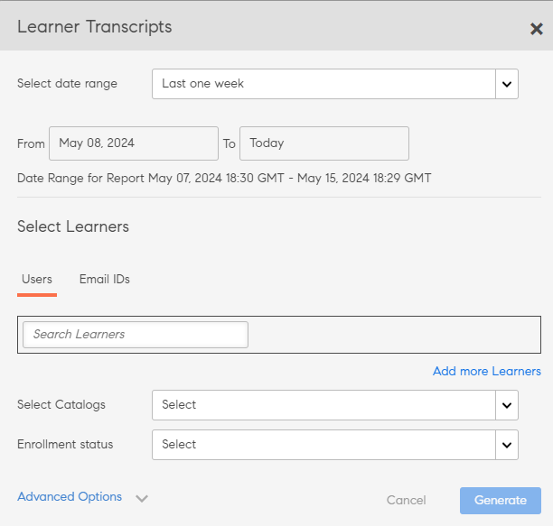
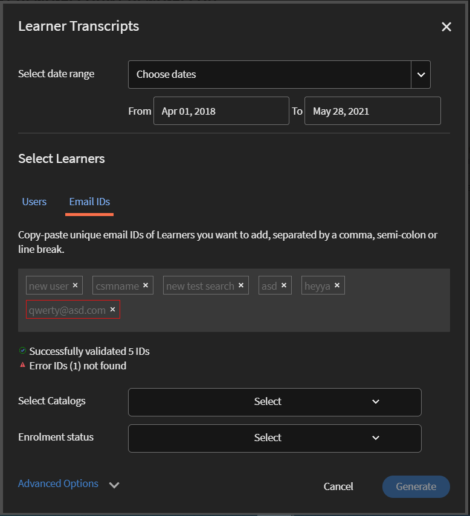
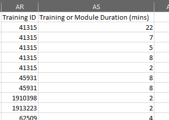

# Elevens betygsutdrag

Hämta elevens betygsutdrag och hantera rapporter med Learning Manager.

Med Adobe Learning Manager kan administratörer i en organisation generera utskrifter som är kopplade till elever.

## Generera elevbetygsutdrag {#generatelearnertranscripts}

1. Klicka på **[!UICONTROL Reports]** i den vänstra rutan i Administratörsinloggning för att generera elevens betygsutdrag.

   Administratören går till fliken **[!UICONTROL Custom Reports]** > **[!UICONTROL Excel Reports]** på sidan **[!UICONTROL Reports]**.

1. Klicka på länken **[!UICONTROL Learner Transcripts]**.

   Historiksidan **[!UICONTROL Learner Transcript]** visas med meddelandet: **Inga elevtranskriberingar har genererats än** eller en lista över nedladdningar som har utlösts efter att utbildningstranskriberingarna har implementerats.

   <!---->

   Dialogrutan Elevens betygsutdrag visas. Välj det datumintervall som du vill att transkriptionen ska genereras för.

   >[!NOTE]
   >
   >Som standard är från-startdatum elevens registreringsdatum och till-datum är alltid det aktuella datumet. Du kan bara ändra startdatumet från när du behöver informationen.

1. Välj elevnamnen i fältet **[!UICONTROL Select Learners]** och klicka på **[!UICONTROL Generate].**
1. Du kan välja en enskild elev eller grupper av elever. Klicka på **[!UICONTROL Add More Learners]** om du vill lägga till fler än en elev.

   

   *Lägg till fler elever*

1. Du kan välja specifika kataloger genom att markera kryssrutan. Betygsutdrag laddas bara ned för de angivna katalogerna. Du kan välja specifika kataloger genom att välja katalogen i listrutan **[!UICONTROL Select Catalogs]**.

   

1. Det finns ett alternativ, **[!UICONTROL Enrollment Status]**, när du exporterar elevens betygsutdrag. Den här listrutan innehåller följande alternativ:

   * Markera allt
   * Slutfört
   * Pågår
   * Inte påbörjad
   * Avregistrerad

   

   *Välj katalogen*

1. Du kan också hämta utskrifter för elever som har tagits bort från ett konto.

   Klicka på pilen **[!UICONTROL Advanced Options]** och aktivera kryssrutan **[!UICONTROL Include data of Deleted Learners]** för att hämta elevens betygsutdrag för borttagna användare.

   

   *Hämta elevens betygsutdrag för borttagna elever*

1. Du kan välja att hämta information på modulnivå i elevens betygsutdrag genom att aktivera kryssrutan **[!UICONTROL Enable module level information]**. I det här fallet hämtas modulnamn och den tid som tillbringas på varje modul som en del av transkriptionen om det här alternativet är aktiverat.
1. Du kan välja att hämta kompetensdata och sammanfattningsblad genom att markera kryssrutan **[!UICONTROL Include skills data and summary sheets]**.

   Betygsutdrag genereras och laddas ned till din dator som .zip-filer när kompetensdata inte ingår. Om kryssrutan Kunskapsdata är aktiverad genereras och hämtas betygsfiler.

## Generera elevens betygsutdrag med kopiera och klistra in

Att hämta elevens betygsutdrag blir en omständlig process eftersom det bara kan erhållas för en elev eller användargrupp en i taget. Med funktionen för att kopiera och klistra in kan du här kopiera listan över elevens e-postadresser och klistra in den på en gång.

1. Logga in som **[!UICONTROL Administrator]** eller **[!UICONTROL Manager]**.
1. Gå till **[!UICONTROL Reports]** under **[!UICONTROL Manage]**. Sidan **[!UICONTROL User Activity]** läses in.
1. Klicka på **[!UICONTROL Custom Reports]** i den vänstra rutan och välj **[!UICONTROL Learner Transcripts]** i listan.
1. Klicka på knappen **[!UICONTROL Generate New]** i det övre vänstra hörnet på sidan **[!UICONTROL Learner Transcripts]**.
1. Välj önskade datum genom att klicka på i listrutan **[!UICONTROL Select date range]**. Klicka på fliken **[!UICONTROL Email IDs]** för att ange den kopierade listan över unika e-postadresser.

   

   *Kopiera och klistra in e-post-ID:n*

1. Använd **[!UICONTROL Validate Email Ids]** för att verifiera om det angivna ID:t är korrekt.

   

   *Validera e-post-ID:n*

   Om det angivna e-post-ID:t är felaktigt markeras det i rött tillsammans med ett valideringsmeddelande enligt ovan.

   Knappen **[!UICONTROL Generate]** är inte tillgänglig om inte alla angivna e-post-ID:n är korrekta.

   

   *Generera elevens betygsutdrag*

1. Klicka på knappen **[!UICONTROL Generate]** för att generera elevens betygsutdrag för alla nämnda e-postadresser. Du får ett bekräftelsemeddelande enligt nedan om att skapa en rapport.

   

   *Bekräftelsemeddelande för rapporten som genereras*

   Generering av elevbetygsutdrag kan kombineras för e-post-ID som angetts på fliken **[!UICONTROL Users]** och **[!UICONTROL Email IDs]**.

## Historik över nedladdningar av elevbetygsutdrag {#ltdownload}

Dialogrutan Elevens betygsutdrag visas på hämtningssidan **[!UICONTROL Learner Transcript]** när du klickar på knappen **[!UICONTROL Generate New]** för att generera en rapport.

*Generera en rapport över alla elevens betygsutdrag*

Klicka på **[!UICONTROL Advanced Options]** och expandera panelen.

Välj användarna och katalogen de tillhör. När du har klickat på knappen **[!UICONTROL Generate]** visas en dialogruta som anger ungefärlig tid det tar att hämta rapporten. Klicka på **[!UICONTROL Generate]** för att generera rapporten.

*Välj knappen Generera*

Betygsutdraget genereras i bakgrunden och du kan fortsätta med dina uppgifter i Learning Manager. När transkriptionen har skapats kan du hämta den från listan.

Administratörer kan visa alla utskrifter som genereras av någon i systemet.

*Visa nedladdningshistoriken*

Nedladdningslistan innehåller följande attribut:

* **Elever:** Elever/elevgrupper vars utskrifter ska hämtas.
* **Ytterligare data som ingår:** Beroende på vilka ytterligare data som administratören vill hämta från alternativet Avancerat i det modala fönstret Lägg till elevens betygsutdrag
* **Status:** har hämtats, placerats i kö eller pågår.
* **Från** och **Till**: Längden på de utskrifter som ska hämtas.
* **Tillämpade filter:** Om du har tillämpat filtren för registreringsstatus.
* **Genererad av:** Användar-id för den Learning Manager-användare som begärde hämtningen.
* **Status:** har hämtats, placerats i kö eller pågår.

Du kan avbryta hämtningen när som helst. Om ett jobb avbryts av administratören skickar Learning Manager ett meddelande i appen till den användare som utlöste elevens betygsutdrag.

*Nedladdningskö för elevens betygsutdrag*

Du kan **avbryta** hämtningen när som helst. Om ett jobb avbryts skickar Learning Manager ett meddelande i appen till den användare som har avbrutit jobbet.

## Data för raderade elever {#dataofdeletedlearners}

Du kan inkludera raderade elevers data i listan Elevens betygsutdrag. Aktivera alternativet **[!UICONTROL Include data of Deleted Learners]** i dialogrutan Elevens betygsutdrag.

När du har aktiverat alternativet och klickat på **[!UICONTROL Generate]** visas borttagna elevdata på nedladdningssidan för elevbetygsutdrag enligt nedan:

*Visa data för borttagna elever*

## Anpassa kolumner {#customize-columns-lt}

En administratör kan anpassa de kolumner som exporteras i en elevens betygsrapport. Administratörer, anpassade administratörer och chefer kan konfigurera kolumnerna innan rapporten exporteras.

I dialogrutan **[!UICONTROL Learner Transcripts]** klickar du på **[!UICONTROL Advanced Options]**. Välj de kolumner som du vill exportera i avsnittet **[!UICONTROL Configure Export Format]**.

*Anpassa kolumner för export*

Anpassning är endast tillåtet när en användare hämtar elevens betygsutdrag i .CSV-format. När den laddas ner i .XLSX-format kommer valet av kolumninställning inte att följas och alla standardkolumner kommer att exporteras.

## Elevens filinnehåll i betygsutdrag {#learnertranscriptfilecontent}

En vanlig betygsfil för elever består av sex Excel-ark i en enda fil. Elevens betygsblad ger en övergripande inblick i data inklusive antalet elever som är inblandade per kurs, deras färdigheter, slutförandeprocenten baserad på kurs eller elev och en efterlevnadstavla. Följande instrumentpaneler är tillgängliga i elevutskrifter:

**Elevens betygsutdrag**

I Excel-bladet för elevbetygsutdrag, tillsammans med profilinformation om eleven, finns information om utbildningsobjektets förbrukning, t.ex. registreringsdatum, startdatum, uppnådd grad och erhållna quizpoäng. Om kurser ingår i något utbildningsprogram listas de separat, bortsett från enskilda uppgifter om kursens förbrukning.

**1- Tavla för utbildningsaktivitet**

På den här LO-specifika instrumentpanelen kan du se antalet elever för varje kurs, utbildningsprogram eller certifiering. Du kan visa förloppsindikatorn för elever för ett visst utbildningsobjekt. Denna tabell visar data som antal elever som har slutfört kursen eller utbildningsprogrammet, elever under utveckling och elevens förfallodatum.

Användarnas förlopp för den specifika kursen beräknas baserat på inmatningsfälten där du anger tröskelvärdena för förfallodatum och förloppsprocent. Om du till exempel anger 7 dagar och 70 % som värden i inmatningsfältet visas kursförloppet för kurser som förfaller om 7 dagar och för kurser som har mer än 70 % förlopp. Du kan också ändra tidsperioden i tabellen, där ändrade data visas automatiskt på kontrollpanelen.

**2 - tavla för utbildningsaktivitet**

Utbildningstavlan visar data för en specifik användare. På den här instrumentpanelen kan du se de kurser, utbildningsprogram eller certifieringar som en viss användare har registrerat sig för. Tabellen visar även data om vilka utbildningsobjekt användaren har slutfört, vilka utbildningsobjekt som pågår och kommande inlämningsdatum för användaren.

Användarnas förlopp för varje kurs beräknas utifrån de indata som du anger. Det vill säga värdena för förfallodatum och förloppsprocent. Om du till exempel anger 7 dagar och 70 % som värden i inmatningsfältet visas användarens förlopp för olika kurser som förfaller om 7 dagar och för kurser som har mer än 70 % förlopp.

**Kompetens**

I kompetensbladet anges färdighetsnamn, kompetensnivå, nödvändiga krediter, intjänade poäng, slutförandeprocent och andra profiluppgifter. Nedan hittar du ett exempel på en ögonblicksbild av Excel-sidan för kompetens.

*Exempel på Excel-sidan för kompetenser*

**1- Tavla för kompetenser**

På den här instrumentpanelen kan du se om din organisation är utrustad med olika färdigheter. För en specifik kompetens kan du kontrollera antalet användare i en organisation som förväntas ha denna kompetens kontra antalet som faktiskt har kompetensen. Kontrollpanelen anger även vilka användare som måste uppdatera sina kunskaper. Detta värde beräknas utifrån de indata som du anger i inmatningsfältet. Om du till exempel anger 50 dagar som indata visar kontrollpanelen data om användare som behöver uppdatera sina kunskaper efter 50 dagar.

**2- Tavla för kompetenser**

Denna tavla för kompetenser är mer användarspecifik. Du kan filtrera en eller flera användare och visa deras kunskapsnivå som en kontrollpanel. Detta blad kan hjälpa chefer och administratörer att spåra hur skickliga varje elev är jämfört med hur skickliga de förväntas vara. Instrumentpanelen för kompetens belyser också de elever som måste uppdatera sina färdigheter. Elevens uppdateringslista beräknas utifrån antalet dagar som du anger i inmatningsfältet.

**Efterlevnadstavla**

Efterlevnadstavlan består av två delar - efterlevnadsrapport per användare och efterlevnadsrapport per utbildning. För den användarbaserade rapporten kan du använda efterlevnadstavlan för att spåra användare som har kommande förfallodatum för viktiga efterlevnadsinitiativ. För den utbildningsbaserade rapporten kan du filtrera på utbildningsprogram eller certifiering.

Filtrera efter inlämningsdatum för att visa relevanta data för båda efterlevnadsrapporterna.

### Kolumner med tid och datum i avskriften {#datetime}

Värdena i följande kolumner har minuter avrundade till närmaste minut och sekunder till 00:

* Registreringsdatum (tidszonen UTC)
* Påbörjad datum (tidszonen UTC)
* Slutförandedatum (tidszonen UTC)

*Tid- och datumkolumner i Excel-bladet*

### Modulens varaktighet och ID-kolumner i transkriptet {#moduledurationandidcolumnsinthetranscript}

Elevens betygsutdrag visar även kolumnerna **[!UICONTROL Module Duration]** och **[!UICONTROL ID]**.

*Modulens varaktighet och ID-kolumner i transkriptionen*

### ÖVRIGA kolumner i utskriften {#ModuledurationandIDcolumnsinthetranscript-1}

| **Kolumn** | **Beskrivning** |
|---|---|
| Efter | Antal elever som uppnådde kompetensen före det angivna (värde) antalet dagar som behöver fräschas upp |
| Kompetens | De kompetensnamn som tilldelas elever |
| Chefens namn | Chefsnamnet vars underordnade data om kompetenssammanslagning ska visas i registret Kompetenssammanfattning |
| Radetiketter | Elevens namn med listan över tilldelade kompetenser |
| Antal kompetenser varje användare ska ha | Antal kompetenser som har tilldelats eleven |
| Antal kompetenser varje användare har | Antal kompetenser som uppnåtts av eleven |
| Antal kompetenser som behöver fräschas upp | Antal elever vars kompetens behöver fräschas upp |
| Andel efterlevnad | Förloppsprocenten för den tilldelade kompetensen |
| Inbäddad väg | Dessa rader visar namnet på det inbäddade utbildningsprogrammet. |
| Inbäddat väg-ID | Dessa rader visar ID:n för det inbäddade utbildningsprogrammet |
| Inbäddad sökväg för språk | Dessa rader visar det språk som utbildningsprogrammet skapades med. |
