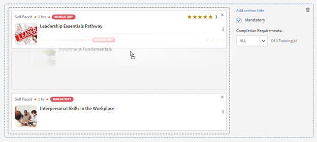
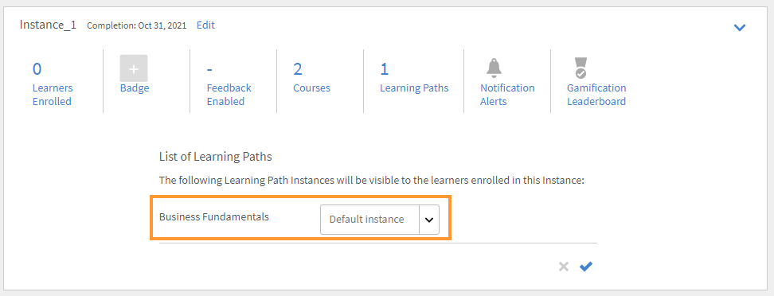

# Utbildningsvägar

## Vad är en utbildningsväg?

Administratörer är ofta intresserade av att bygga upp en detaljerad kursplan med djupgående kunskap om ett visst ämne eller ett expertområde. Det kan också vara en följd av utbildningskurser som medarbetarna eller kunderna förväntas slutföra. Detta kräver att man slår ihop en uppsättning kurser och program för att skapa ett komplett utbildningspaket.

Det är här utbildningsvägen kommer in i bilden. En utbildningsväg är en resa som en elev måste gå igenom för att behärska ett ämne över tid. Elever har kontroll över sin utbildningserfarenhet och kan förvärva och behålla kunskaper i egen takt på ett effektivare sätt.

Till exempel när nya anställda anställs utbildar en organisation om policyer och förfaranden, kultur, historia och så vidare. I en utbildningsväg anges kurserna utifrån de anställdas behov, så att de anställda kan registrera sig för kurserna enligt den utbildningsväg som har angetts för dem. du väljer, och du kan registrera användare på den här sökvägen så att de kan gå vidare från kurs till kurs.

## Skapa och konfigurera utbildningsvägar

I den här utbildningen får du lära dig skapa en utbildningsväg, lägga till en kurs i den, publicera och dra in en utbildningsväg och konfigurera instanser inom en utbildningsväg.

Om du inte kan starta utbildningen kan du skriva till <almacademy@adobe.com>.

## Fördelar med en utbildningsväg

Utbildningsvägar gör att du enkelt och problemfritt kan få ett utbildningsprogram. Här är några av de viktigaste fördelarna med en utbildningsväg:

1. Tilldela en färdighets- och kompetensnivå direkt till en utbildningsväg. Du behöver inte matcha kompetenspoäng. När en elev slutför en utbildningsväg uppnår han/hon den angivna kunskapsnivån.
1. Möjlighet att bädda in en befintlig utbildningsväg i en ny utbildningsväg. Inbäddningsfunktionen är endast tillgänglig för 1 nivå av inbäddning. Därför kan en utbildningsväg som redan innehåller en inbäddad bana inte bäddas in i en ny bana.
1. Möjlighet att lägga till förutsättningar, arbetsstöd och resurser på nivån för utbildningsvägen.
1. Möjlighet att skapa avsnitt. Varje avsnitt kan ha en titel.
1. Möjlighet att göra avsnitt obligatoriska och ange kriterier för slutförande.

## Lägg till en utbildningsväg i Learning Manager

I Learning Manager, i Admin-programmet, klickar du på **[!UICONTROL Learning Path]** i den vänstra panelen.

I dialogrutan **[!UICONTROL Learning Path]** sida, klicka på **[!UICONTROL Add]**. Ange uppgifterna.

*Lägg till en ny utbildningsväg*

När du har skapat utbildningsvägen väljer du den nyligen skapade utbildningsvägen och lägger till kurserna i sökvägen.

Du kan lägga till färdigheter och tilldela ett utmärkelsetecken till utbildningsvägen. Om du vill lägga till en kompetens väljer du den kompetens eller de färdigheter som krävs från **[!UICONTROL Pick a Skill]** listruta. Välj även nivån för kompetensen eller kompetenserna.

Tilldela ett utmärkelsetecken till utbildningsvägen. Välj ett märke i listan med tillgängliga märken.

Välj sekvenstyp för avsnitten och utbildningen som Beställd eller Osorterad beroende på dina önskemål.

Om du väljer Beställd visas kurserna i samma sekvens som du skapade dem. Om du väljer Osorterad sker ingen sekvensering av kurserna. Elever kan slutföra kurserna i valfri ordning.

Om du vill lägga till en kurs i utbildningsvägen klickar du på **[!UICONTROL Add Courses or Learning Paths]**.

I dialogrutan som visas väljer du den utbildning som du vill lägga till för utbildningsvägen.

*Lägg till utbildning på utbildningsvägen*

Du kan sortera kurserna ytterligare efter tilldelade kunskaper, ändrat datum och kursens effektivitet.

Klicka på när du har valt kurser eller utbildningsväg **[!UICONTROL Save]**.

Du kan göra detta i utbildningsvägen:

**Skapa och konfigurera ett avsnitt:** Ett avsnitt skapas för att gruppera flera utbildningskurser som slutför ett område eller en väsentlig del av utbildningen. Varje avsnitt kan ha en titel. Varje avsnitt kan också markeras som Obligatoriskt med specifika krav på slutförande.

**Gör kurserna obligatoriska i varje avsnitt:** Aktivera eller inaktivera kryssrutan Obligatorisk om du vill/inte vill göra utbildningarna obligatoriska inuti utbildningsvägen. Om du markerar kryssrutan kan du antingen göra alla utbildningar obligatoriska eller vissa av utbildningarna obligatoriska.

*Gör kurserna obligatoriska i varje avsnitt*

**Arrangera om ordningen:** Du kan flytta kurserna uppåt eller nedåt och ändra deras ordning.

*Arrangera om ordningen på utbildningen*

**Ta bort en kurs:** Klicka på X på kurskortet och ta bort kursen från utbildningsvägen.

*Ta bort en kurs från utbildningsvägen*

När du har gjort ändringarna klickar du på Publicera för att publicera utbildningsvägen.

## Kapslad lutningsbana

Du kan inkludera en utbildningsväg i en utbildningsväg, men du kan kapsla in högst en utbildningsväg i den.

Infoga utbildningsvägen som att infoga en kurs.

*Lägg till en utbildningsväg i en utbildningsväg*

## Inställningar för utbildningsväg

I avsnittet Inställningar kan du lägga till de krav och de arbetsstöd som en elev måste ta innan han/hon påbörjar utbildningsvägen. Du kan också lägga till resurser som är till hjälp för eleven.

*Ändra inställningar för en utbildningsväg*

## Instanser

Instanserna för utbildningsvägen visar ytterligare en ruta, **[!UICONTROL Learning Paths]**. Siffran visas i rutan. av utbildningsprogram som lagts till i en utbildningsväg.

I dialogrutan **Kurser** kan du se kursinstanserna som är synliga för eleverna som är registrerade i denna instans.

Inställningen **[!UICONTROL Enable Learners to Choose instances (Flexible Learning Path)]** kryssrutan är endast tillämplig på kurser. Alla underordnade utbildningsvägar får ett alternativ för att mappa en instans av ett utbildningsprogram med utbildningsvägen. Som standard är mappningen inställd på Standardinstans.

*Instanser för utbildningsväg*

## Meddelanden

Det finns tre alternativ:

1. **[!UICONTROL All Skill Levels Courses and Learning Paths (selected by default)]:** Eleven får meddelanden om ofullständiga kurser oavsett nivå i utbildningsvägen.
1. **[!UICONTROL Root Learning Path]:** Eleven får meddelanden om ofullständiga kurser som tillhör en överordnad utbildningsväg.
1. **[!UICONTROL Learning Path + first Skill Level children only]:** Eleven får meddelanden om ofullständiga kurser som är det första underordnade objektet till en överordnad utbildningsväg.

Meddelandepåminnelserna utlöses baserat på alternativet. Som standard används alternativet **[!UICONTROL All Levels Courses and Learning Paths]** har aktiverats för en instans.

## Viktig anmärkning

Observera att den befintliga funktionen i utbildningsprogrammen kommer att döpas om till Utbildningsväg omedelbart efter lanseringen. Om du vill fortsätta att kalla det för utbildningsprogram rekommenderar vi att du använder funktionen Terminologier för att tillämpa önskad terminologi. På så sätt kan du konsumera för att använda ordet Utbildningsprogram.

Utbildningsvägar ger dig en mängd funktioner. Vissa av dem är tillgängliga omedelbart efter versionen. Administratörer/författare kan börja använda dem. Utökade funktioner som &quot;Avsnitt&quot;, &quot;lägga till utbildningsväg i en annan sökväg&quot; osv. är avaktiverade och kan aktiveras genom att markera kryssrutan nedan.

Elever kan fortsätta att använda utbildningsprogram (som nu kallas utbildningsvägar) och författare/administratörer kan fortsätta att skapa dem också. För att dra nytta av de utökade funktionerna i utbildningsvägen som nämns ovan ska administratören aktivera inställningen enligt nedan. När den har aktiverats blir alla nya utökade funktioner i utbildningsvägen tillgängliga.

Inställningen **[!UICONTROL Settings]** > **[!UICONTROL General]** sidan har ett nytt alternativ för att aktivera utbildningsvägar. Om det här alternativet är aktiverat kan du lägga till kurser och utbildningsprogram på en utbildningsväg. Du kan inte ändra alternativet när det har aktiverats.

## Annan information om utbildningsväg

### Alternativet Utbildningsväg är inaktiverat/avmarkerat i Administratörsinställningar

**Konton som använder inbyggda webbappar**

**Elever**

* Som standard kommer elever att märka en ändring i terminologi från &quot;Utbildningsprogram&quot; till Utbildningsväg. Detta har gjorts för att göra gränssnittet mer intuitivt. Om du inte vill ha den här ändringen läser du punkterna nedan.

* Den här ändringen visas dock inte i användargränssnittet om du redan har använt funktionen &quot;Anpassad terminologi&quot; för att ersätta terminologin &quot;Utbildningsprogram&quot; med anpassad text.
* Om du inte har använt funktionen Anpassad terminologi ännu men nu vill behålla &quot;Utbildningsprogram&quot; som terminologi kan du göra det via funktionen &quot;Anpassad terminologi&quot; efter lanseringen.

* Det övergripande kosmetiska utseendet och känslan hos tidigare utbildningsprogram kommer att uppdateras till ett mer visuellt rikt utseende och känsla.

**Författare och administratörer**

* Terminologin i programmen Admin/Author är densamma som för elever.
* Gränssnittet för författare och administratörer att skapa och uppdatera de tidigare objekten för utbildningsprogrammet uppdateras nu till det nya gränssnittet. Det finns ingen förlust av funktionalitet, bara att användargränssnittet för att göra åtgärden kommer att vara mycket mer intuitivt. Dessa ändringar av användargränssnittet kommer att återspeglas i ditt konto, även om du har valt att inte aktivera utökade funktioner för utbildningsvägen utan att förlora funktionalitet.

* Observera att eventuella befintliga objekt för utbildningsprogrammet inte kommer att ändras så att det inte påverkar elever (förutom den terminologi som anges ovan). Författare/administratörer kan märka av en standardgruppering som kallas för &quot;Avsnitt&quot; i deras befintliga objekt, vilket inte skulle ha någon väsentlig inverkan vad funktionen beträffar. Författare/administratörer kan också se ytterligare funktioner som Kompetens, Arbetsstöd osv. Men eftersom du inte har använt det ännu kommer det inte att påverka elevsidan förrän du faktiskt börjar använda det.

**Rapportering**

* Om du inte aktiverar alternativet Utbildningsväg sker inga ändringar i elevens betygsrapportstruktur på grund av utbildningsvägen. Men som tidigare meddelats (se tabellen som delats i tidigare meddelande); en ny kolumn läggs till längst till höger i elevens betygsutdrag omedelbart efter utgivningen.

**Konton som använder fjärradministrerat LMS**

**Elever**

* Det finns inga ändringar för elever i det fjärradministrerade gränssnittet. Även API:er som används för att generera rapporterna ändras inte omedelbart.

**Författare och administratörer**

* Samma ändringar som för Författare/Administratörer ovan.

**Rapportering**

* Samma förändringar som den som redovisades ovan.

### Alternativet Utbildningsvägar är aktiverat/markerat i Administratörsinställningar

**Konton som använder inbyggda webbappar**

**Elever**

* Samma ändringar som för elever när alternativet är inaktiverat.
* När du börjar använda de utökade funktionerna i Utbildningsvägar kan elever ha nytta av att se mer detaljerade vägar med inbäddade vägar och avsnitt, Kompetenser och utmärkelsetecken som intjänas vid slutförande av utbildningsvägen, resurser på utbildningsnivå och andra fördelar.

**Författare och administratörer**

* Samma ändringar som för Författare och Administratörer när alternativet är inaktiverat.

* Användarna får mer funktionalitet när de skapar avancerade banor. Du kan definiera kompetensnivåer som en elev automatiskt ska uppnå när banan är slutförd (du behöver inte fokusera på aritmetiken för tillskrivningarna för nivåerna). Resurser kan läggas till på sökvägsnivå (inte möjligt för närvarande). Områden kan skapas där varje område har möjlighet att ha X av Y-alternativ. Du kan bädda in en utbildningsväg i en annan utbildningsväg (en hierarkinivå stöds)

**Rapportering**

* Några nya kolumner kommer att läggas till i strukturerna &quot;Elevens betygsutdrag&quot; och &quot;Innehållsrapport&quot; för att införliva den nya funktionen att bädda in banor i banor. Detta kan påverka den integrationskod som du kan ha skrivit för att exportera dessa data till ditt anpassade datalager/din anpassade databas utanför Learning Manager. Denna information lämnas i tabellen i tidigare meddelande.

**Konton som använder fjärradministrerat LMS**

**Elever**

* Det finns ingen förändring för dina elever, om du inte gör ändringar i din fjärradministrerade LMS-implementering, eftersom de API:er som du har byggt ditt fjärradministrerade gränssnitt på inte kommer att ändras.
* Om du börjar använda de utökade funktionerna i utbildningsvägar genom att skapa nya utbildningsvägar måste du dock göra ändringar i den fjärradministrerade LMS-implementeringen för att återspegla dem i elevappen. Med Learning Manager API:er kan du göra det.

**Författare och administratörer**

* Samma ändringar som för Författare/Administratörer ovan.

**Rapportering**

* Samma förändringar som den som redovisades ovan.
