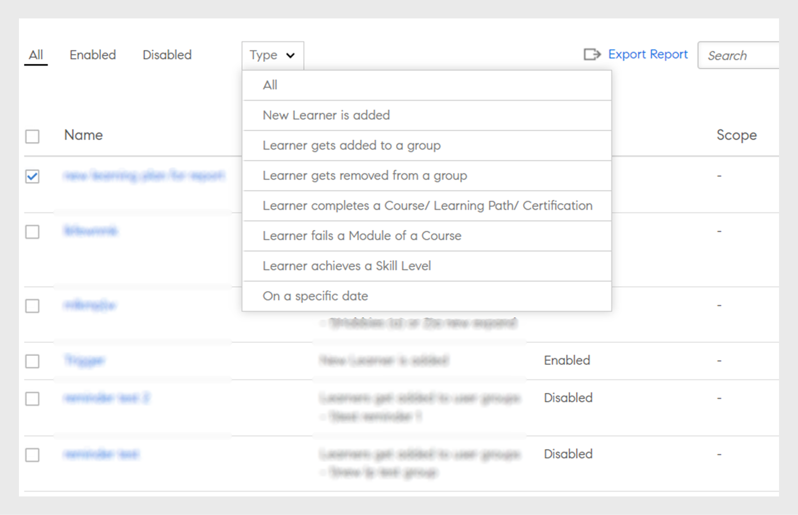

# Utbildningsplaner

Skapa utbildningsplaner för administratörer i Learning Manager.

## Översikt {#overview}

En utbildningsplan är en uppsättning regler som registrerar elever för angivna utbildningar baserat på vissa kriterier.

Med en utbildningsplan kan en administratör automatiskt tilldela kurser, utbildningsprogram eller certifieringar baserat på förekomsten av vissa händelser, som att ta in en ny anställd eller ändra de anställdas beteckning eller plats.

När en anställd t.ex. går med i en organisation tilldelas orienteringsprogrammet för nya anställda automatiskt till den anställde. Om en anställd befordras som chef tilldelas medarbetaren automatiskt ett nytt chefsorienteringsprogram.

Du kan registrera elever för alla kurser och utbildningsprogram automatiskt baserat på en fördefinierad uppsättning händelser. Du kan skapa utbildningsvägar till eleverna genom att automatiskt tilldela en uppföljningsutbildningsaktivitet efter att en elev har slutfört en kompetens, kurs eller ett utbildningsprogram.

## Skapa utbildningsplaner {#createlearningplans}

Om du vill skapa en utbildningsplan måste du logga in som administratör.

1. Klicka på **[!UICONTROL Learning Plans]** i den vänstra rutan. Om det finns några befintliga händelser visas de på sidan. Men om du konfigurerar funktionen för utbildningsplanen för första gången går du vidare till nästa steg.
1. Klicka på **[!UICONTROL Add]** i det övre högra hörnet på sidan. I dialogrutan **[!UICONTROL Add Learning Plan]** anger du namnet på utbildningsplanen som en medarbetare måste genomföra.

   

1. Välj önskad händelse i listrutan **[!UICONTROL Occurs when]**. Alternativen bestämmer när en elev tar kursen. När du har valt typ av evenemang väljer du lämplig utbildning, kurser, utbildningsprogram eller certifiering.

>[!NOTE]
>
> Både administratörer och författare kan skapa händelser för automatisk registrering.

Händelserna är:

**1 - Ny elev läggs till:** När en ny användare eller anställd ansluter sig till organisationen.

**2 - Eleven läggs till i en grupp:** När en ny användare eller anställd går med i en grupp.  Ange och välj användargruppen i listrutan som den här händelsen gäller. Du kan välja flera grupper. Du kan också tilldela den här händelsen till alla befintliga medlemmar i dessa grupper genom att välja alternativet.

Den här utbildningsplanen är särskilt utformad för användare av ***anpassade grupper***. Skriv namnet på gruppen i fältet och välj gruppen eller grupperna med hjälp av sökningstypen framåt.

**3 - Eleven tas bort från en grupp:** Händelsen utlöses när en användare eller elev tas bort från en grupp. Ange och välj användargruppen i listrutan som den här händelsen gäller. Du kan välja flera grupper.

**4 - Eleven slutför en kurs/utbildningsväg/certifiering:** Händelsen utlöses när en elev slutför ett utbildningsobjekt som kurs, utbildningsprogram och så vidare. Välj utbildningsobjektet som den här händelsen gäller för. Välj slutförandestatus för händelsen. Du kan även välja den användargrupp som eleven tillhör. Ange antalet dagar som denna händelse utlöses efter att utbildningsobjektet har slutförts. Välj alternativet om du vill tilldela denna händelse till befintliga användare som redan har slutfört utbildningsobjektet.

**5 - Eleven misslyckas med en modul i en kurs:** Händelsen aktiveras när en elev misslyckas med ett utbildningsobjekt som kurs, utbildningsprogram och så vidare. Välj utbildningsobjektet som den här händelsen gäller för. Du kan också välja den användargrupp som denna elev tillhör.

**4 - Eleven uppnår en kompetensnivå:** Ange kompetensnamnet och välj kompetensnivå. Du kan också välja den användargrupp som denna elev tillhör. Det är valfritt. Ange antalet dagar som den här händelsen ska utlösas när kompetensen har uppnåtts. Välj alternativet om du vill tilldela denna händelse till befintliga elever som redan har uppnått denna kompetens.

Ange dessutom antalet dagar efter vilka utbildningsplanen måste tilldelas eleverna.

**5 - På ett visst datum:** När händelserna måste inträffa på ett visst datum. Välj det datum då händelsen måste tilldelas. Välj de användargrupper som händelsen ska tilldelas automatiskt till. Välj de instanser som ska tilldelas och om du vill kan du ange efter hur många dagar händelsen måste utlösas.

1. Du kan välja instansen från rullgardinsmenyn **[!UICONTROL Instance]** för alla händelser. Du kan även välja instanser av den tilldelade utbildningen för valfri händelse.

   

   I Learning Manager skapar en utbildningsplan en egen instans, Auto. När du väljer en grupp, till exempel Alla elever, registreras då som standard alla elever i utbildningsplanen i instansen Auto.

   När du sparar utbildningsplanen visas instansen Auto som ett alternativ i listrutan **[!UICONTROL Select Instance]** i avsnittet Elever för en kurs.

1. Klicka på **[!UICONTROL Save]** för att spara utbildningsplanen.

## Avregistrera dig från utbildning {#unenroll-training}

När en utbildningsplan läggs till kan administratören avregistrera användare från specifika utbildningar baserat på vissa utlösare.

Klicka på **[!UICONTROL Learning Plans]** > **[!UICONTROL Add]** i Admin-appen.

Nästa avsnitt representerar utlösarna där alternativet **[!UICONTROL Unenroll from Training]** har lagts till.

## Eleven tas bort från en grupp {#learnergetsremovedfromagroup}

1. Lägg till en eller flera användargrupper. Om flera grupper väljs utlöses planen när en elev tas bort från någon av de nämnda grupperna.
1. Välj åtgärden som **[!UICONTROL Unenroll from training]**.

   1. Administratören kan välja de utbildningar som användaren ska avregistreras från när den tas bort från användargruppen.
   1. Instansen och slutförandedatumet gäller inte i det här scenariot.

## Eleven slutför en utbildning {#learnercompletesatraining}

1. Lägg till en eller flera användargrupper. Om flera grupper väljs utlöses planen när en elev slutför den angivna utbildningen.
1. Välj åtgärden som **[!UICONTROL Unenroll from training]**.

   1. Administratören kan välja de utbildningar som användaren ska avregistreras från när de läggs till i användargruppen.
   1. Instans- och slutförandedatum gäller inte i det här fallet.

## Eleven blir underkänd på en kursmodul

1. Lägg till en eller flera användargrupper. Om flera grupper väljs utlöses planen när en elev misslyckas med den angivna utbildningen.
1. Välj åtgärden som **[!UICONTROL Unenroll from training]**.

   1. Administratören kan välja de utbildningar som användaren ska avregistreras från när de läggs till i användargruppen.
   1. Instans- och slutförandedatum gäller inte i det här fallet.

## Eleven läggs till i en grupp {#learnergetsaddedtoagroup}

1. Lägg till en eller flera användargrupper. Om flera grupper väljs utlöses planen när en elev läggs till i någon av de nämnda grupperna.
1. Välj åtgärden Avregistrera dig från utbildning.

   1. Administratören kan välja de utbildningar som användaren ska avregistreras från när de läggs till i användargruppen.
   1. Instans- och slutförandedatum gäller inte i det här fallet.

## Eleven uppnår en kompetensnivå {#learnerachievesaskilllevel}

1. Ange den kompetens som ska uppnås.
1. Lägg till en eller flera användargrupper. Om flera grupper väljs utlöses planen när en elev uppnår den valda kompetensen.

## På ett specifikt datum {#onaspecificdate}

1. Välj det datum då elever ska avregistreras.
1. Lägg till en eller flera användargrupper. Om flera grupper väljs utlöses planen på datumet och avregistrerar användarna, som ingår i de valda grupperna.
1. Välj åtgärden Avregistrera dig från utbildning.

   1. Administratören kan välja de utbildningar som användaren ska avregistreras från när denne avregistreras på det angivna datumet.
   1. Instans- och slutförandedatum gäller inte i det här fallet.

## Redigera en utbildningsplan {#editalearningplan}

När du har skapat en utbildningsplan kan administratören redigera/uppdatera utbildningsplanen när som helst. Om du vill redigera markerar du namnet på utbildningsplanen och ändrar värdena i popup-dialogrutan **[!UICONTROL Edit Learning Plan]** som visas.  Välj **[!UICONTROL Save]**.

>[!NOTE]
>
>Du kan inte ändra alternativet **[!UICONTROL Occurs when]** i popup-fönstret **[!UICONTROL Edit Learning Plan]**.

## Aktivera en utbildningsplan {#enablealearningplan}

Som standard är alla nya utbildningsplaner som du har skapat i inaktiverat läge. Du måste göra det möjligt för en plan att tilldela en elev. När du aktiverar kryssrutan **[!UICONTROL Current Learners]** aktiveras händelsen av sig själv.

För att aktivera en utbildningsplan

1. Välj den plan du vill aktivera i listan över utbildningsplaner.

   

1. Klicka på **[!UICONTROL Actions]** > **[!UICONTROL Enable]** i det övre högra hörnet på sidan. Då aktiveras utbildningsplanen.

## Radera en utbildningsplan {#deletealearningplan}

För att radera en utbildningsplan,

1. Välj den plan som du vill ta bort i listan över utbildningsplaner.
1. Klicka på **[!UICONTROL Actions]** > **[!UICONTROL Delete]** i det övre högra hörnet på sidan.

## Inaktivera en utbildningsplan {#disablealearningplan}

Om du vill inaktivera en utbildningsplan

1. Klicka på fliken **[!UICONTROL Enabled]**.
1. Välj den plan som du vill inaktivera i listan över utbildningsplaner.
1. Klicka på **[!UICONTROL Actions]** > **[!UICONTROL Disable]** i det övre högra hörnet på sidan. Då flyttas planen till fliken **[!UICONTROL Disabled]**.

## Filtrera en utbildningsplan {#filteralearningplan}

Du kan filtrera utbildningsplaner efter typen av händelse som användes när en utbildningsplan skapades. Klicka på **[!UICONTROL Type]** och välj ett alternativ för att visa utbildningsplaner som matchar urvalet.

## Vanliga frågor {#frequentlyaskedquestions}

1. Hur konfigurerar jag Learning Manager för automatiska registreringar för registrering av nya anställningar?

   Välj alternativet **[!UICONTROL New Learner is added]** i listrutan **[!UICONTROL Occurs when]**. Tilldela sedan utbildningsobjekten, instansen och slutförandedatumet för eleven. Både administratörer och författare kan skapa händelser för automatisk registrering. Aktivera händelsen när den har skapats.

1. Hur konfigurerar jag en utbildningsplan/automatisk registrering för klassrumskurs och virtuella klassrumskurser?

   Vi rekommenderar att du konfigurerar kursinstansen med obligatoriska sessionsdetaljer. Skapa sedan en utbildningsplan och mappa den till kursinstansen som redan har skapats.

1. Hur visar jag listan över elever som har registrerats för en specifik utbildningsplan?

   När instansen Auto skapas klickar du på **[!UICONTROL Course]** > **[!UICONTROL Learners]** och väljer önskad instans i listrutan **[!UICONTROL Instance]**.
