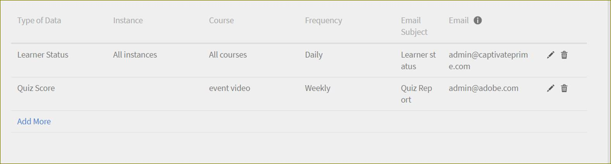

# Utbildningsprogram

>[!WARNING]
>
>Utbildningsprogram har tagits bort i Adobe Learning Manager.

Läs den här artikeln och lär dig skapa och hantera utbildningsprogram i Learning Manager

Utbildningsprogram är en uppsättning unikt utformade kurser som uppfyller specifika elevmål. Administratörer skapar dessa utbildningsprogram för elever. Du kan se dessa utbildningsprogram som en elev.

## Skapa ett utbildningsprogram {#createalearningprogram}

Administratörer kan skapa utbildningsprogram. Skapa ett utbildningsprogram genom att följa stegen nedan:

1. Logga in som administratör. Klicka **[!UICONTROL Learning program]** i den vänstra rutan. Sidan Utbildningsprogram visas med en lista över befintliga utbildningsprogram om de redan har skapats för din organisation.
1. Klicka på Lägg till längst upp till höger på sidan. Sidan Lägg till nytt utbildningsprogram visas.
1. Ange namn, översikt och förmåner för utbildningsprogrammet.
1. Klicka på Lägg till nytt språk överst på sidan för att skapa utbildningsprogrammen för andra språk. Välj de språk du behöver och klicka på Lägg till. Du kan behöva lägga till alla metadata för utbildningsprogrammet på alla valda språk. Annars visas den engelska informationen för andra språk.
1. Ange ett unikt ID för utbildningsobjekt för ditt utbildningsprogram. Det unika ID:t får endast innehålla alfabeten och siffror och inga specialtecken. Inga två utbildningsobjekt ska ha samma ID.
1. Välj registreringstypen som administratörsregistrering eller egenregistrering enligt ditt val. Välj avregistreringsalternativ och alternativ för kursbeställning och klicka på Spara. Om du väljer att registrera dig själv kan eleverna registrera sig för utbildningsprogrammet.

   Sidan Kurser visas för att lägga till kurser i utbildningsprogrammen. Du kan se läroplan och katalog flikar i det.

   **Anteckning**

   Alla typer av kurser kan läggas till i ett utbildningsprogram. Dessa inkluderar klassrums- och virtuella klassrumskurser, aktivitet, kurser du kan ta i egen takt och blandade kurser. Chefsnominerade och chefsgodkända kurser visas inte under kursurvalet i utbildningsprogram.

1. Du måste lägga till kurser i utbildningsprogrammet innan du publicerar det. Klicka **[!UICONTROL Catalog]** för att koppla kurser till utbildningsprogrammet. En lista över alla tillgängliga kurser visas.

1. Välj de kurser du vill lägga till i utbildningsprogrammet genom att hålla muspekaren över ett kurskort och klicka på det. Om kursen ännu inte har lagts till i utbildningsprogrammet kan du visa en +-symbol i mitten av kurskortet.

   Om du vill inkludera fler kurser upprepar du det här steget.

   **Anteckning**

   Visa listan över alla tillagda kurser i ditt utbildningsprogram i **[!UICONTROL Curriculum]** -fliken. Ytterligare etikett kan ses för de tillagda kurserna, längst ner på kurskortet i **[!UICONTROL Catalog]** -fliken.

1. Klicka **[!UICONTROL Back to programs]** högst upp i den vänstra rutan, för att se en lista över alla utbildningsprogram. Du kan se att ditt nyligen tillagda utbildningsprogram listas där.
1. Du kan publicera utbildningsprogrammet genom att klicka på Översikt i den vänstra rutan och välja Åtgärder > Publicera. Du kan också publicera utbildningsprogrammet i vyn Kurser och instanser genom att klicka på Publicera längst upp till höger på sidan.

## Lägg till elever i ett utbildningsprogram {#addlearnerstoalearningprogram}

Mer information om hur du registrerar elever och hur du följer dem finns i  [Registrerar elever.](courses.md#main-pars_header_1058138132)

## Aktivera fullständig katalogkontroll för utbildningsprogram {#catalog}

Som att bevilja fullständig [katalogkontroll för utbildningar eller moduler](shared-catalog-full-control.md)Du kan också aktivera fullständig katalogkontroll för utbildningsprogram.

## Återställ kurs

En administratör kan återställa förloppet för en kurs i ett utbildningsprogram.

Administratören kan återställa förloppet för kursen från ett utbildningsprogram.

För att återställa en kurs måste administratören välja en kurs från listrutan Kurser.

Sedan från **[!UICONTROL Actions]** listruta, klicka på **[!UICONTROL Reset Course]**.

Eleverna kan nu starta modulerna för de valda kurserna från början.

**Obs! Endast misslyckade och ofullständiga moduler av kursen kommer att återställas.**

## Skapa flera förekomster av utbildningsprogram {#createmultipleinstancesoflearningprograms}

Du kan skapa flera instanser av en kurs eller ett utbildningsprogram.

1. Klicka på Utbildningsprogram i den vänstra rutan.
1. Klicka på namnet på utbildningsprogrammet i listan med kurser/utbildningsprogram.
1. Klicka på Instanser i den vänstra rutan.
1. Klicka på Lägg till ny instans i det högra hörnet av det övre högra hörnet av kursinformationen.
1. En ny instans av utbildningsprogrammet visas.
1. Klicka på redigeringsikonerna (som visas med en röd pil i ögonblicksbilden) på den nya instansen för att ändra värdena för kurs-/utbildningsprogrammet som deadline, instansnamn, feedback och utmärkelsetecken. När du har gjort ändringarna klickar du på bockmarkeringen bredvid det ändrade värdet för att spara ändringarna. Klicka på X-markering om du vill avbryta ändringarna.

En administratör kan lägga till klassrums- och virtuella klassrumstyper till ett utbildningsprogram. Vilken session författaren än har gett när kursen skapades blir standardinstansen. När administratören lägger till kurser i ett utbildningsprogram mappas det som standard till standardinstansen av alla kurser, men administratören kan ändra instansmappningen. Antalet kurser som läggs till i ett utbildningsprogram visas också på instanssidan enligt nedan.

**Ändra instansmappning**

Klicka på kursantalet på instanssidan om du vill ändra instansmappningen. En kursinstansmappningsruta visas med en lista med instanser. Nu kan du välja instansmappning.

## SKAPA FLEXIBLA UTBILDNINGSPROGRAM {#flexible}

Med flexibla utbildningsprogram kan elever genomföra utbildningar som inte är begränsade till vad standardinstansen erbjuder. En administratör skapar olika instanser för att tillgodose elevernas behov. Den här typen av utbildningsprogram är vanligtvis en klassrums- eller VC-session. För att säkerställa att alla elever får möjlighet att närvara kan en administratör skapa mer än en instans av en kurssession för att få plats med olika tidszoner.

En administratör kan också mappa en instans av ett utbildningsprogram till en instans av en kurs som eleven väljer.

**Arbetsflöde**

1. Skapa några kurser med flera instanser.
1. Skapa ett utbildningsprogram och lägg till några kurser.
1. Skapa instanser av utbildningsprogrammet.
1. Registrera eleverna.

## Prenumeration {#subscription}

En administratör kan hämta quiz-poäng och elevstatusrapporter. De kan ange rapportfrekvens, e-postämne och mottagarnas e-post-ID. Beroende på den angivna frekvensen får mottagaren ett e-postmeddelande med rapporten bifogad.

## Visa quiz-poäng {#viewquizscores}

1. Klicka på panelen för valfritt utbildningsprogram
1. Klicka på Quiz-poäng i den vänstra rutan.

Du kan visa quiz-poängen för ett visst utbildningsprogram baserat på användarnamn eller baserat på varje fråga. Välj Efter användare eller Efter fråga flikar därefter.

Quizpoäng visas för en kurs i taget. Ändra kursnamnet från listrutan för att visa quizpoängen för andra kurser. Du kan också exportera quiz-poäng för varje kurs.

Välj instanstypen från rullgardinsmenyn för att visa poängen baserat på varje instans av utbildningsprogrammet.

## Visa feedback om L1 och L3 {#viewl1andl3feedback}

Administratörer kan aktivera L1- och L3-feedback för ett utbildningsprogram. Feedback om L1 som ges av eleven visas under fliken L1-feedback och feedback om L3 som ges av chefen visas under fliken L3-feedback.

## Avregistrering av elever {#unenrollmentforlearners}

När du skapar utbildningsprogram har administratören ett alternativ för att välja om elever kan avregistrera sig själva från utbildningsprogrammen. Om Administratör väljer alternativet kan eleven avregistrera sig själv.

## Markera slutförande {#markcompletion}

Administratörer kan markera ett utbildningsprogram som slutfört med det alternativ som är tillgängligt för dem. Gör så här för att ange att utbildningsprogrammet har slutförts.

1. Öppna fönstret **[!UICONTROL Learning Program]**.
1. Öppna fönstret **[!UICONTROL Learners]** i menyn till vänster.

   Inställningen **[!UICONTROL Learners]** sidan öppnas med listan över registrerade elever.

1. Markera en/flera/alla elever för att markera LP-slutförande med kryssrutan som finns för varje elev.
1. Klicka på **[!UICONTROL Users]** > **[!UICONTROL Action]** > **[!UICONTROL Mark completion]**.

   Om LP:n har flera kurser kommer alla kurser att markeras som fullständiga.

## Beställning av kurser i utbildningsprogrammet {#orderingofcoursesinlearningprogram}

Administratörer kan ange i vilken ordning eleverna ska gå kurserna i utbildningsprogrammet. När du har skapat ett utbildningsprogram kan du uppdatera denna kursordning när som helst.

Uppdatera ordningen på kurserna i ett utbildningsprogram

1. Klicka på kortet för utbildningsprogram och klicka på **[!UICONTROL Courses]** i den vänstra rutan.

1. En lista över kurskort som är associerade med utbildningsprogrammet visas. Klicka **[!UICONTROL Edit]** längst upp till höger på sidan.
1. Du kan ändra ordningen på listan genom att klicka på och dra varje kurskort till rätt plats.
1. Klicka på **[!UICONTROL Republish]**.

## Redigera ett publicerat utbildningsprogram {#editingapublishedlearningprogram}

Ett utbildningsprogram kan redigeras av en administratör vid publicerat tillstånd. I det här läget kan administratören redigera alla avsnitt i ett utbildningsprogram och publicera igen.

För att redigera ett publicerat utbildningsprogram klickar du på kortet för utbildningsprogrammet och klickar på **[!UICONTROL Edit]** längst upp till höger på sidan.

När du redigerar ett utbildningsprograms avsnitt måste du publicera utbildningsprogrammet på nytt om du måste flytta från sidan. Du får en dialogruta där du ombeds att publicera utbildningsprogrammet.
