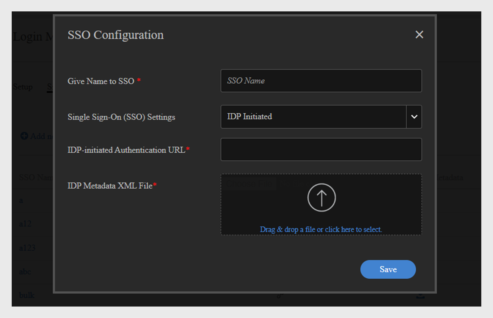

# Flera SSO-inloggningar {#multiple-sso-logins}

En administratör kan konfigurera flera inloggningsmetoder för både interna och externa användare. Adobe Learning Manager stöder flera SSO-inloggningar som hjälper administratörer att konfigurera inloggningsmetoden utifrån deras behov och användningsfall.

Avsikten är att låta administratörer konfigurera olika enkel inloggning för olika användargrupper baserat på deras plats, organisation osv.

Upp till 20 SSO-konfigurationer kan läggas till på ett konto. Dessa kan användas för att konfigurera enkel inloggning för både interna och externa användare.

>[!NOTE]
>
>När du aktiverar Multi-SSO kan du välja värden eller användargrupper i självregistreringsprofilen. När du väljer ett värde skapas en användargrupp med noll användare. En sådan användargrupp har ingen användare. När nästa CSV-fil importeras tas den här användargruppen bort.

## Aktivera flera SSO

Om du vill aktivera flera SSO väljer du **Inställningar** > **Inloggningsmetoder**.

Markera kryssrutan **[!UICONTROL Enable Multiple Single Sign-On (SSO)]** för interna eller externa användare på konfigurationssidan.

När Multi SSO är aktiverat blir inloggningsmetoden som valts för Standardinloggningsmetod standardinloggningstypen för användargrupper/profiler som inte är länkade till någon SSO-konfiguration. Standardinloggningen kan vara Adobe ID eller SSO eller ALM ID (externa användare).

>[!NOTE]
>
>Administratörer och anpassade administratörer med nödvändiga behörigheter kan utföra dessa steg.

Följ stegen nedan för att konfigurera enkel inloggning:

1. Klicka på Konfigurera enkel inloggning (SSO).
1. Klicka på Lägg till ny SSO-konfiguration.\
   
1. Lägg till detta i dialogrutan SSO-konfiguration:

   * Ange namnet på SSO.
   * Välj vilken typ av SSO- IdP som initierats eller SP.

      * Om du har valt IdP initierad anger du IdP:ns URL. Det här är den URL som kommer att vara den unika identifieraren för ditt program och är information som tillhandahålls av din IdP-tjänsteleverantör. Det här är den URL som alla Adobe Learning Manager-användare omdirigeras till efter inloggning.
      * Överför XML-filen för IdP-metadata från din IdP-leverantör. Den här filen innehåller information om den IdP som gör att Adobe Learning Manager kan acceptera SAML-försäkringar från den
      * Om du har valt SP initierat anger du Enhets-ID. Enhets-ID är en URL som tjänsteleverantören (SP) tillhandahåller.
      * Ange URL för SP-inloggning. Den här URL:en används av användarna för att logga in på programmet.

1. SSO-konfigurationen läggs till i listan.

## Konfigurera SSO för interna användare

### Användare från en CSV

Följ stegen nedan:

1. Importera den CSV-fil som innehåller de aktiva fälten och deras värden.
1. Klicka på Inställningar > Inloggningsmetoder.
1. Markera kryssrutan **[!UICONTROL Enable Multiple Single Sign-On (SSO)]** för inloggning.
1. Mappa SSO-konfigurationerna till värdena i det aktiva fältet.
1. Spara inställningarna. Importera CSV-filen igen.

### En användare

Följ stegen nedan:

1. Klicka på Inställningar > Inloggningsmetoder.
1. Markera kryssrutan **[!UICONTROL Enable Multiple Single Sign-On (SSO)]** för inloggning.
1. Välj ett aktivt fält för en SSO.
1. Länka SSO-konfigurationerna till värdena i fältet.
1. Spara inställningarna. Lägg till en enskild användare och tilldela ett värde till det aktiva fältet.

### Egenregistrerade användare

Följ stegen nedan:

1. Klicka på Inställningar > Inloggningsmetoder.
1. Markera kryssrutan **[!UICONTROL Enable Multiple Single Sign-On (SSO)]** för inloggning.
1. Länka SSO-konfigurationerna till värdena i fältet.
1. Spara inställningarna. Lägg till en enskild användare och tilldela ett värde till det aktiva fältet.
1. Lägg till en självregistreringsprofil.
1. Välj ett värde för SSO-fältet som konfigurerats.

När du har sparat profilinställningarna omdirigerar den kopierade URL:en användarna till SSO som är länkat till det värde som valts för profilen.

### Konfigurera SSO för externa användare

Följ stegen nedan:

1. Skapa en extern profil.
1. Klicka på Inställningar > Inloggningsmetoder.
1. Markera kryssrutan **[!UICONTROL Enable Multiple Single Sign-On (SSO)]** för inloggning.
1. Länka SSO-konfigurationen till den externa profil som skapats.
1. Spara inställningarna.

När du har sparat profilinställningarna kommer den kopierade externa profil-URL:en att omdirigera användarna till den SSO som är länkad till profilen.

## Vanliga frågor

+++ Vem kan aktivera flera SSO för användare?

Både administratören och den anpassade administratören kan aktivera flera SSO.
+++

+++Kan jag använda ett befintligt eller ett nytt aktivt fält med ett värde?

Ja, du kan använda ett befintligt eller ett nytt enskilt aktivt fält för att konfigurera flera SSO.
+++

+++Om det finns inaktiverade fält i en CSV-fil, kommer konfigurationen av flera SSO att misslyckas?

Nej, det påverkar inte konfigurationen av enkel inloggning. Användarna omdirigeras till en redan konfigurerad enkel inloggning.
+++

+++Kan en administratör lägga till nya värden i det aktiva fältet på sidan när denne konfigurerar flera SSO?

Ja, en administratör kan lägga till nya värden i de aktiva fälten.
+++

+++Kan jag inaktivera eller ta bort fält som är länkade till enkel inloggning?

Ja, du kan inaktivera eller ta bort fält som är länkade till SSO tills du tar bort länken mellan fälten från sidan SSO-konfiguration.
+++
