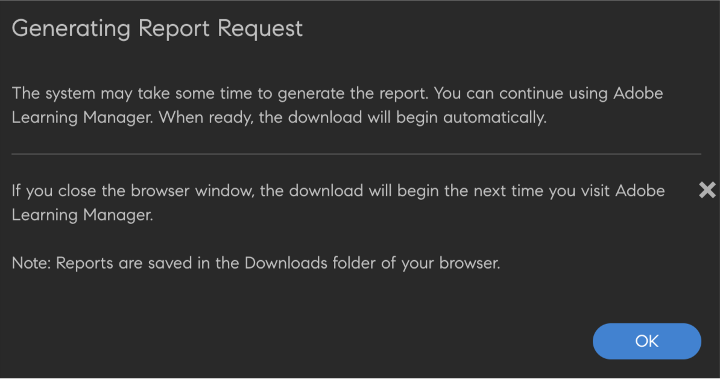

# Inbyggd utbyggbarhet

Du kan skapa anpassade upplevelser i den inbyggda versionen av Adobe Learning Manager så att du inte kan använda headless för enklare fall. Du kan också skapa anpassade program och placera dem på olika platser i den ursprungliga versionen av arbetsflödena för elev, chef, administratör, författare eller instruktör.

Adobe Learning Manager stöder 15 anropspunkter mellan admin, författare, elev, chef och instruktör.

## Skapa ett tillägg

1. Som administratör väljer du i den vänstra panelen **[!UICONTROL Native Extensions]**.
1. Välj Lägg till ett tillägg.
1. Ange namnet på tillägget i rutan **[!UICONTROL Name]** område.
1. Ange beskrivningen av tillägget i rutan **[!UICONTROL Description]** område.
1. Välj en startpunkt. En startpunkt är en plats i Adobe Learning Manager där en länk eller knapp kan infogas i en anpassad app. Följande startpunkter är tillgängliga:

   I det här exemplet väljer du **[!UICONTROL Admin]**, **[!UICONTROL Author: Course]**, **[!UICONTROL Learning Path]** - **[!UICONTROL Instances]** - **[!UICONTROL Instance row]**.

   
   *Välj startpunkt*

1. Ange den tilläggsetikett som ska visas i användargränssnittet i **[!UICONTROL Extension Label]** område.
1. Ange URL-adressen där du vill att tillägget ska vara i **[!UICONTROL URL]** område.
1. På rullgardinsmenyn Öppna i väljer du om du vill starta tillägget i en modal eller i en ny flik.
1. Välj storleken på det modala fönstret. Alternativen är tillgängliga om du har valt *I programmet* i föregående steg.

   För att bibehålla tillgängligheten i popup-fönstret måste tilläggsprogrammet skickas till händelsen när de har det sista fokuserbara elementet på sin webbplats och sedan väljer användaren TAB-tangenten. Det här behövs för att behålla fokus i popup-fönstret för att stödja tillgänglighet.

   ```
   window.parent.postMessage({*}
   
   { type: 'ALM_EXTENSION_APP', eventType: 'trapFocusInModal' }
   
   ,{}'');
   ```

1. Ange tilläggets omfattning. Följande omfång är tillgängliga:

   * **[!UICONTROL All Courses, Learning Paths and Certifications]**: Det här tillägget är aktiverat för alla kurser, utbildningsvägar och certifieringar. Tillsammans med administratörer kan författare inaktivera den för vissa kurser, utbildningsvägar och certifieringar.
   * **[!UICONTROL Selected Courses, Learning Paths and Certifications]**: Det här tillägget är inaktiverat för alla kurser, utbildningsvägar och certifieringar. Tillsammans med administratörer kan författare aktivera det för vissa kurser, utbildningsvägar och certifieringar.

1. Välj **[!UICONTROL Activate]** växlar för att göra tillägget aktivt. När tillägget har aktiverats visas det på den angivna anropspunkten enligt omfånget.
1. Välj **[!UICONTROL Save]** skapa tillägget i det övre högra hörnet på sidan.

## Öppna tillägget som administratör

1. Du som är administratör väljer **[!UICONTROL Learning Paths]** i det vänstra verktygsfältet.
1. Välj en kurs > **[!UICONTROL View Learning Path]**.
1. Välj **[!UICONTROL Instances]** i panelen till vänster.
1. Välj **[!UICONTROL More]** i avsnittet Instanser. Tillägget visas i avsnittet Instanser.

   
   *Välj tillägget*

   När du väljer filnamnstillägget visas det i det modala fönstret.

## Öppna tillägget som författare

1. Du som är administratör väljer **[!UICONTROL Learning Paths]** i det vänstra verktygsfältet.
1. Välj en kurs > **[!UICONTROL View Learning Path]**.
1. Välj **[!UICONTROL Instances]** i panelen till vänster.
1. Välj **[!UICONTROL More]** i avsnittet Instanser. Tillägget visas i avsnittet Instanser.

   
   *Få åtkomst till tillägget som författare*

   När du väljer filnamnstillägget visas det i det modala fönstret.

## Visa alla tillägg

Som administratör kan du visa alla tillägg på sidan Systemspecifika tillägg. Du kan se listan genom att välja Inbyggda tillägg i programmets vänstra panel.


*Visa alla tillägg*

## Aktivera eller inaktivera ett tillägg

Du som är författare kan aktivera eller inaktivera ett tillägg för en kurs, certifiering eller utbildningsväg på sidan Inställningar för en kurs.


*Aktivera ett tillägg*

## Dela en åtkomstnyckel

Du måste dela åtkomstnyckeln om du konfigurerar ett registreringstillägg.

Detta är viktigt eftersom om nyckeln inte genereras och delas kommer autentiseringen för registreringen att misslyckas och eleverna kan inte registrera sig för kurserna.

Åtkomstnyckeln måste delas för registrering i kurs eller utbildningsväg och certifikat.

Generera nyckeln på fliken Inställningar.


*Dela åtkomstnyckeln*

## Hämta tilläggsrapport

Du kan hämta den här rapporten på två sätt.

**Konfigurationsrapport för tillägg**

1. På sidan Tillägg väljer du **[!UICONTROL Extension Configuration Report]**.

   
   *Hämta tilläggsrapport*

   Rapporten genereras.

1. Välj OK.

   
   *Genererar rapporten*

   Rapporten innehåller följande fält:

   * Namn på förlängning
   * Poäng för tillämpning
   * Etikett
   * Öppna i URL
   * Omfång
   * Aktivera
   * LO unikt ID
   * Utbildnings-ID
   * Utbildningstyp
   * Utbildningsnamn

**Sidan Rapporter**

1. in **[!UICONTROL Reports]** > **[!UICONTROL Custom Reports]**, välj **[!UICONTROL Extension Configuration Report]**.

   
   *Hämta rapporten från sidan Rapporter*

Tillståndet måste vara i intervallet **0 - 4294967295**, när du konfigurerade registreringstillståndet.
