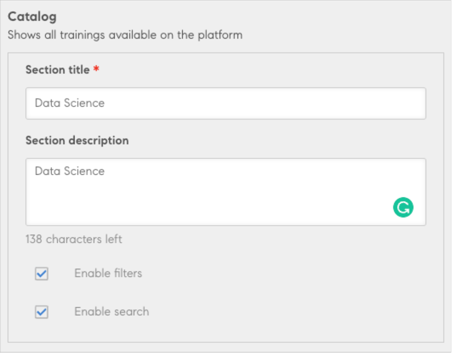

# Ej inloggad för elever

Adobe Learning Manager inbyggda portal har stöd för ett icke-loggat sätt att komma åt utbildningswebbplatsen. När det här läget är aktiverat kan elever upptäcka och komma åt utbildningswebbplatsen och kolla in olika kurser och tillgängligt innehåll.

Den icke-inloggade upplevelsen gör att elever kan bläddra bland kurser utan att vara inloggade på en portal.

För att den icke-inloggade startsidan ska aktiveras måste integreringsadministratören aktivera och konfigurera [Training Data Connector](/help/migrated/integration-admin/feature-summary/connectors.md#training-data-access).

Utbildningen kan sedan exporteras från kontakten.

>[!NOTE]
>
>Kontrollera att alternativet Native Learning Manager är valt.

Administratören kan ändra och konfigurera startsidan, som är avsedd för icke-inloggade användare.

## Elevens API

Adobe Learning Manager - Med elev-API:er kan du skapa en anpassad utbildningsupplevelse för dina användare. Användningen av dessa API:er kräver en giltig användartoken och ska bara användas i arbetsflöden där det finns en helt licensierad/registrerad elev.

>[!IMPORTANT]
>
>De ska inte användas, som det är, för någon form av datahämtning för att stödja icke-inloggade användare/delade användare eller andra sådana fall. Kontakta oss om du vill bygga upp en fjärradministrerad eller AEM-baserad icke-inloggad upplevelse. Vi kommer att föreslå det rätta tillvägagångssättet utifrån era krav.

De användningsfall som inte är inloggade kräver särskild hantering.

**Kontakta lösningsarkitekturteamet om du har frågor om lämplig användning av dessa API:er och se till att en lösningsarkitekt har testat en lösning innan du driftsätter den**.

## Öppna alternativen för startsidan

På Adobe Learning Manager-startsidan väljer du **Varumärkning**. I den vänstra rutan väljer du sedan Ej inloggad startsida.

*Välj alternativet Ej inloggad startsida*

## Lägg till en banderoll

Lägg till en banderoll för alla marknadsföringsmeddelanden eller visa dagens populära ämne. Välj **Lägg till banderoll**.

*Lägg till en banderoll*

Bläddra till platsen för bilden som ska användas som banderoll. Ange sedan en länk som en åtgärdsknapp på banderollbilden.

## Lägg till kategorier

Den här komponenten kan användas för att filtrera katalogen efter taggar, färdigheter och katalog. Detta avsnitt innehåller ett sidhuvud och en beskrivning för varje kategori. När användaren klickar omdirigeras användaren till katalogsidan med de filter som används.

Välj **[!UICONTROL Add category]**. Ange sedan information om kategorin.

*Lägg till kategorierna*

Spara kategorin. Kategorin läggs till i avsnittet.

## Lägg till en katalog

Lägg till en katalog för icke-inloggade användare så att de kan bläddra i all utbildning på plattformen.

*Lägg till en katalog*

All exporterad utbildning kommer att finnas.

## Funktioner utan stöd

* Arbetsstöd exporteras inte. Elever kan dock se dem efter inloggning.
* Sortera efter i katalogkomponenten.
* Standardvyinställning som används i administrationsprogrammet (Inställningar > Allmänt > Listvy).
* Stjärnrankning/effektivitet.
* Inställning för kortikon.
* Relevanta kunskaper och taggar inställning.
* Elevens appvy som visas katalogvis.
* Sidor med utbildningsöversikt - Om du klickar på kortet omdirigeras användaren till Sign Up, varefter användaren omdirigeras till sidan med utbildningsöversikten/instanssidan.
* Alla aktiverade kataloger kommer att finnas. En elev som inte har åtkomst till en katalog kan inte se katalogen och utbildningen i den efter att ha loggat in.
* För det inbyggda alternativet kommer ändringar av en kurs eller utbildningsväg att återspeglas efter 24 timmar, inte i realtid.
