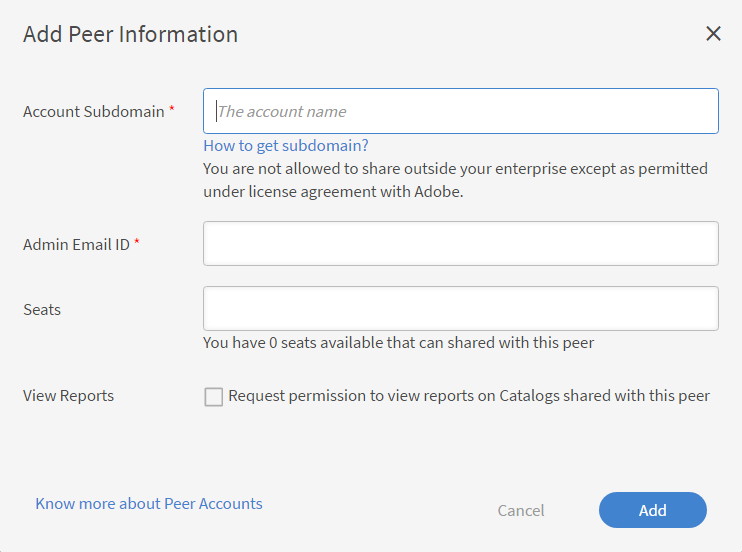
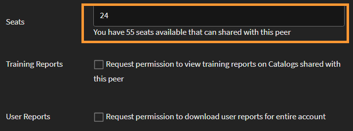

# Kollegiala konton

Läs den här artikeln när du vill veta hur du skapar och hanterar kollegiala konton i Learning Manager.

Learning Manager erbjuder möjligheten att dela köpta platser med hjälp av funktionen för kollegialt konto. Med kollegiala konton i Learning Manager kan en administratör dela de köpta platserna med de kollegiala konton som administratören är kopplad till. Dessutom kan administratören som har initierat delning av platser se rapporterna från kollegiala konton.

## Lägg till ett kollegialt konto {#addapeeraccount}

1. Klicka på på i kontrollpanelen för administratörer **[!UICONTROL Settings]** > **[!UICONTROL Peer Accounts]**.
1. Klicka på i det övre högra hörnet **[!UICONTROL Add]**.

   

   *Lägg till kollegialt konto*

1. I dialogrutan **[!UICONTROL Account Subdomain]** -fältet, anger du den underdomän som du vill etablera ett kollegialt konto med.

   

   *Lägg till en underdomän*

1. Ange e-post-ID för den administratör som antingen accepterar eller avvisar kollegialt konto-begäran.
1. Ange hur många platser du vill dela med kollegan. När du delar platser med det kollegiala kontot aktiveras läget Aktivt för det kollegiala kontot med de mottagna platserna, eller med kollegiets egna köpta platser.

   Om du anger ett tal som är högre än de tillgängliga platserna visas en varning.

1. Markera kryssrutan om du vill visa registreringsrapporter och delade katalograpporter för kollegor.
1. Klicka på Lägg till för att lägga till det kollegiala kontot.

   Om en administratör delar platser med en kollega kan den kollegiala administratören inte dela dem med någon annan. Kollegiet kan dock köpa vissa platser separat och dela dem.

## Visa rapporter som är kopplade till kollegiala konton {#viewreportsassociatedwithpeeraccounts}

När du har upprättat ett kollegialt konto kan du rita rapporter för de kollegiala kontona också. Om du som administratör initierar en begäran om kollegialt konto kan du visa rapporterna för det kollegiala kontot.

Om kollegiet även vill visa administratörsrapporterna måste peer skicka en separat begäran till administratören.

Information om hur du skapar och visar delade kataloger för det kollegiala kontot finns i [Visa kollegiala rapporter](reports.md#main-pars_header_894271250).

## Tar bort kollegiala konton {#deletingpeeraccounts}

Om du inte längre vill dela platser eller köp med ett konto kan du ta bort det kollegiala kontot.

1. Från Learning Manager-administratörsprogrammet klickar du på Inställningar > Kollegiala konton.
1. Välj det eller de kollegiala konton som du vill radera.
1. Gör något av följande:

   * Klicka på Ta bort längst upp till höger på sidan.
   * Klicka på Ta bort-ikonen bredvid det kollegiala konto som du vill ta bort.

   När ett kollegialt konto har tagits bort är de mottagna platserna inte längre tillgängliga. Om det kollegiala kontot bara har tagit emot platser och inga köpta platser går kontot till inaktivt läge.

## Användarrapport för kollegiala konton {#download-peer-account}

Administratören kan visa användarrapporten för det kollegiala kontot. Den överordnade kontoadministratören kan begära åtkomst till rapporten, och när den kollegiala kontoadministratören accepterar det kan den överordnade administratören visa antalet registrerade användare i det kollegiala kontot och hämta användarrapporten för kollegialt konto.

1. På sidan Peer Accounts (kollegiala konton) klickar du på **[!UICONTROL Add]**.
1. Aktivera alternativet, **[!UICONTROL Request permission to download user reports for entire account]**.

*Visa användarrapport för kollegialt konto*

Om du vill hämta rapporterna för kollegiala konton klickar du på **[!UICONTROL Download]**.

## Vanliga frågor {#frequentlyaskedquestions}

+++Hur delar jag platser från ett konto till ett annat?

När du lägger till ett kollegialt konto anger du antalet platser som du kan dela med ett annat kollegialt konto.

*Dela platser från ett konto till ett annat*
+++
