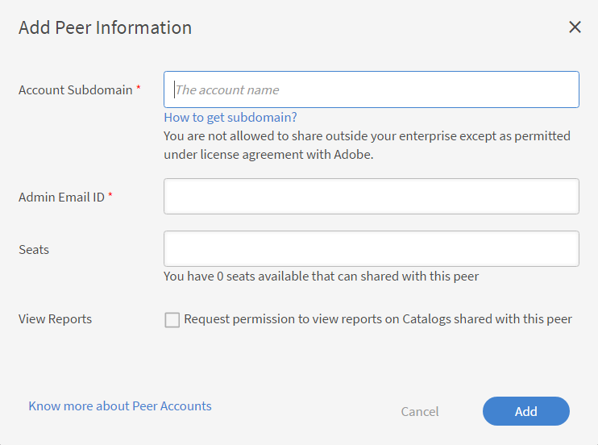

# Kollegiala konton

Läs den här artikeln när du vill veta hur du skapar och hanterar kollegiala konton i Learning Manager.

Learning Manager erbjuder möjligheten att dela köpta platser med hjälp av funktionen för kollegialt konto. Med kollegiala konton i Learning Manager kan en administratör dela de köpta platserna med de kollegiala konton som administratören är kopplad till. Dessutom kan administratören som har initierat delning av platser se rapporterna från kollegiala konton.

## Lägg till ett kollegialt konto {#addapeeraccount}

1. Klicka på **[!UICONTROL Settings]** > **[!UICONTROL Peer Accounts]** på kontrollpanelen för administratörer.
1. Klicka på **[!UICONTROL Add]** i det övre högra hörnet.

   

   *Lägg till kollegialt konto*

1. Ange underdomänen som du vill skapa ett kollegialt konto med i fältet **[!UICONTROL Account Subdomain]**.

   

   *Lägg till en underdomän*

>[!NOTE]
>
>Om du vill hitta underdomänen för ett annat konto kontrollerar du kontots URL. Underdomänen visas före huvuddomänen och hjälper till att identifiera det specifika kontot.
>
>Till exempel:
>
>I URL:en [https://www.learningmanager.com/accountname](https://www.learningmanager.com/accountname) är underdomänen **kontonamn**.
>
>I URL:en [https://www.accountname.learningmanager.com](https://www.accountname.learningmanager.com) är underdomänen också **kontonamn**.
>
>Underdomänen är unik för varje konto och används för att komma åt respektive Learning Manager-instans.

1. Ange e-post-ID för den administratör som antingen accepterar eller avvisar kollegialt konto-begäran.
1. Ange hur många platser du vill dela med kollegan. När du delar platser med det kollegiala kontot aktiveras läget Aktivt för det kollegiala kontot med de mottagna platserna, eller med kollegiets egna köpta platser.

   Om du anger ett tal som är högre än de tillgängliga platserna visas en varning.

1. Markera kryssrutan om du vill visa registreringsrapporter och delade katalograpporter för kollegor.
1. Klicka på Lägg till för att lägga till det kollegiala kontot.

   Om en administratör delar platser med en kollega kan den kollegiala administratören inte dela dem med någon annan. Kollegiet kan dock köpa vissa platser separat och dela dem.

## Visa platser som delas av kollegiala konton

Administratörer kan visa antalet platser som delas av kollegiala konton i administratörsgränssnittet.

Så här visar du de platser som delas av kollegialt konto:

1. Logga in på Adobe Learning Manager som administratör.
2. Välj **[!UICONTROL Users]** och sedan **[!UICONTROL Internal]**.

_Avsnittet Användare visar antalet platser som delas av det kollegiala kontot_

## Visa rapporter som är kopplade till kollegiala konton {#viewreportsassociatedwithpeeraccounts}

När du har upprättat ett kollegialt konto kan du rita rapporter för de kollegiala kontona också. Om du som administratör initierar en begäran om kollegialt konto kan du visa rapporterna för det kollegiala kontot.

Om kollegiet även vill visa administratörsrapporterna måste peer skicka en separat begäran till administratören.

Information om hur du skapar och visar delade kataloger för det kollegiala kontot finns i [Visa kollegiala rapporter](reports.md#main-pars_header_894271250).

## Tar bort kollegiala konton {#deletingpeeraccounts}

Om du inte längre vill dela platser eller köp med ett konto kan du ta bort det kollegiala kontot.

1. Från Learning Manager-administratörsprogrammet klickar du på Inställningar > Kollegiala konton.
1. Välj det eller de kollegiala konton som du vill radera.
1. Gör något av följande:

   * Klicka på Ta bort längst upp till höger på sidan.
   * Klicka på Ta bort-ikonen bredvid det kollegiala konto som du vill ta bort.

   När ett kollegialt konto har tagits bort är de mottagna platserna inte längre tillgängliga. Om det kollegiala kontot bara har tagit emot platser och inga köpta platser går kontot till inaktivt läge.

## Användarrapport för kollegiala konton {#download-peer-account}

Administratören kan visa användarrapporten för det kollegiala kontot. Den överordnade kontoadministratören kan begära åtkomst till rapporten, och när den kollegiala kontoadministratören accepterar det kan den överordnade administratören visa antalet registrerade användare i det kollegiala kontot och hämta användarrapporten för kollegialt konto.

1. Klicka på **[!UICONTROL Add]** på sidan Peer Accounts (kollegiala konton).
1. Aktivera alternativet **[!UICONTROL Request permission to download user reports for entire account]**.

*Visa användarrapport för kollegialt konto*

Klicka på **[!UICONTROL Download]** för att hämta rapporterna för kollegiala konton.

## Visning av författarnamn för delade kurser (inklusive tidigare förvärvade kurser)

I Adobe Learning Manager visas **originalförfattarens namn** för kurser som delas eller förvärvas via kollegiala konton.

Tidigare visades kurser som förvärvats från kollegiala konton ofta med författarnamnet som **extern författare**. Detta har förbättrats för att förbättra innehållstillskrivning och tydlighet.

### Så här fungerar det

* När en kurs delas från ett kollegialt konto, matchas nu Learning Manager och visar det **faktiska författarnamnet** från källkontot.
* Detta beteende gäller:
   * Kurser som nyligen delats
   * Kurser som förvärvades innan denna förbättring introducerades

### Retroaktivt beteende

Den här förbättringen tillämpas **retroaktivt**.\
Kurser som redan har hämtats från kollegiala konton före den här ändringen visar automatiskt rätt författarnamn.

Administratörer eller författare behöver inte göra något:

* Du behöver inte dela kursen igen
* Du behöver inte publicera eller redigera kursen på nytt
* Befintliga registreringar och framsteg för elever ändras inte

### Vad som inte ändras

* Ägarskap och behörigheter för kursen förblir desamma
* Endast det **visade författarnamnet** uppdateras
* Rapportering, registreringar och kursstruktur påverkas inte

Detta säkerställer konsekvent och korrekt tillskrivning av författare i allt delat innehåll, inklusive historiska kurser som förvärvats via kollegiala konton.

## Vanliga frågor {#frequentlyaskedquestions}

+++Hur delar jag platser från ett konto till ett annat?

När du lägger till ett kollegialt konto anger du antalet platser som du kan dela med ett annat kollegialt konto.

*Dela platser från ett konto till ett annat*
+++
