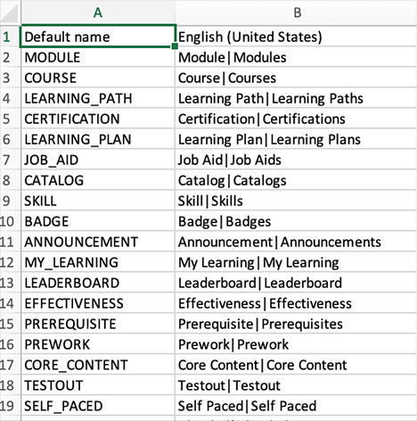

# Produktterminologi

>[!IMPORTANT]
>
>Produktterminologi är endast tillgänglig för den engelska versionen av Adobe Learning Manager.

## Vad är produktterminologi i Adobe Learning Manager

Adobe Learning Manager använder en standarduppsättning av terminologier i användargränssnittet. Administratörer kan ändra terminologin så att den passar organisationens behov.

Med funktionen Produktterminologi kan du byta namn på dessa terminologier och vara konsekvent med din organisations utbildningsstandarder.

## Hämta csv-filen för terminologi

Följ stegen nedan för att ändra terminologin:

1. Som administratör väljer du **[!UICONTROL Settings]** > **[!UICONTROL General]**.
1. I dialogrutan **[!UICONTROL Product Terminology]**, välj **[!UICONTROL Edit]**.

   
   _Produktterminologi_

1. Välj **[!UICONTROL Download Here]** och hämta mallen för terminologierna.

   
   _Hämta mallen_

## Ändra terminologierna

1. När du har hämtat CSV-filen ändrar du de terminologier som krävs i den andra kolumnen. Du kan till exempel ändra modul till Utbildning eller resultattavla till Rankning.

   
   _Redigera CSV-filen_

1. Spara ändringarna.

## Överför den uppdaterade CSV-filen

1. I dialogrutan **[!UICONTROL Product Terminology]** markerar du länken för att överföra CSV-filen.

   
   _Överför CSV-filen_

1. Överför den uppdaterade CSV-filen.
1. Välj **[!UICONTROL Save]**.

Ändringarna i terminologin återspeglar nu en författare, elev, chef, instruktör eller anpassad administratör för kontot.

## Återställ terminologierna

När du har överfört CSV-filen med de nya terminologierna kan du återställa till standardterminologierna.

Välj **[!UICONTROL Reset Product Terminology]**.

_Återställ produktterminologin_

När du klickar på länken visas ett bekräftelsemeddelande.

_Bekräftelsemeddelande_

Terminologierna återställs till sina ursprungliga namn.

## Vad ändras inte

Terminologiändringarna gäller inte för

* E-postmallar (**[!UICONTROL Admin]** > **[!UICONTROL Email Templates]**)

* Rapporter (**[!UICONTROL Admin]** > **[!UICONTROL Reports]**)

