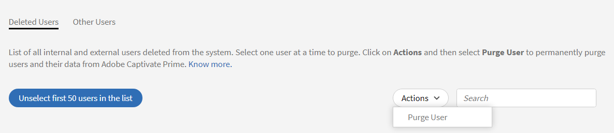

# Rensa användare

Lär dig mer om att rensa användardata i Learning Manager.

## Översikt {#overview}

Använd funktionen Rensa användare för att ta bort användarens personliga identifierbara information och utbildningsposter från Learning Manager. Observera att Ta bort och Rensa användare är två olika funktioner. Det går inte att återställa en borttagen användare eftersom alla användardata och utbildningsposter som är kopplade till en borttagen användare inte kan återställas.

Åtgärden Rensa användare kan ge följande resultat:

* Om en användare rensas fungerar inte länkarna i importloggar för att undvika att gamla CSV-filer hämtas och för att återföra användardata till systemet.
* Om en författare rensas ersätts författarens namn med namnet på den administratör som tömde användaren.
* Om instruktörer rensas tas de bort från sessionerna. Administratören måste ersätta/lägga till instruktörer för sådana sessioner.
* När du rensar en användare i Learning Manager tas användaren inte bort från externa program (system från tredje part eller andra program som du har skrivit). Kontakta externa programägare för att få användarna borttagna från sådana program.
* Om en rensad användare hänvisas till i konfigurationsinställningarna för en anslutning inaktiveras anslutningen. Anslutningen måste konfigureras om av administratören för att kunna återupptas.

<!---### Manage users

In this training, you will learn how to assign and remove roles, send a welcome email, and delete and purge users. 

If you're unable to launch the training, write to <almacademy@adobe.com>.-->

## Så här rensar du användare

Gör så här för att rensa användare:

1. Som administratör väljer du **[!UICONTROL Users]** i den vänstra rutan. Sidan **[!UICONTROL Internal Users]** öppnas.
1. Ta bort de användare du vill ta bort. Markera en eller flera användare i kryssrutan om du vill ta bort. Öppna listrutan **[!UICONTROL Action]** och välj **[!UICONTROL Delete User.]**
1. Välj **[!UICONTROL User Cleanup]** i den vänstra rutan. Sidan **[!UICONTROL User Cleanup]** visas med listan över borttagna användare. Använd alternativknapparna för att välja vilken användare som ska rensas. Du kan bara ta bort en användare åt gången.

   

   *Välj en användare att rensa*

1. Öppna rullgardinsmenyn **[!UICONTROL Actions]** och välj **[!UICONTROL Purge User]**.

   

   *Välj alternativet Rensa användare*

1. En dialogruta visas där du får bekräfta åtgärden. När de har rensats tas alla användardata och utbildningsposter som är kopplade till den valda användaren bort permanent. När åtgärden har rensats kan den inte ångras. Klicka på **[!UICONTROL Purge]** för att bekräfta.

   

   *Bekräftelsemeddelande efter att en användare har rensats*

1. När du har bekräftat och klickar på Rensa accepteras begäran om rensning. Du får ett meddelande när åtgärden är slutförd. Ett ID för begäran om rensning tillhandahålls också. Du kan ange detta ID till CSM för att spåra begäran.

>[!NOTE]
>
>När den borttagna användaren har lagts tillbaka i systemet behålls inte de tidigare rollerna (t.ex. admin, chef, författare, instruktör osv.). De läggs till med elevrollen.

## Massrensning av användare

Du kan välja de första 50 användarna och rensa dem i en bild. Detta gör att administratörer kan välja 50 användare samtidigt och tömma dem tillsammans. Detta hjälper administratörer när de vill ta bort flera användare samtidigt. Du bör alltid kontrollera vilka användare som har valts ut för rensning. Detta är viktigt för att säkerställa att endast rätt uppsättning användare rensas.

*Ta bort användare i grupp*

+++Läs om resultaten av åtgärden Rensa användare

<table>
 <tbody>
  <tr>
   <th><strong>Rensa med Learning Manager UI - Enterprise</strong></th>
   <th> </th>
  </tr>
  <tr>
   <td>Ta bort den valda användaren från det begärande företagskontot. </td>
   <td>Ja</td>
  </tr>
  <tr>
   <td>Ta bort alla användare från alla testversionskonton vars e-postadress, adobe_id, matchar e-postadressen för valda användare.</td>
   <td>Ja</td>
  </tr>
  <tr>
   <td>Ta bort alla användare från alla testversionskonton vars e-postadress adobe_id matchar valda användares e-postadress och som skapat testkontot.</td>
   <td>Nej</td>
  </tr>
  <tr>
   <td>Ta bort användarens e-postadress från alla andra fält i det begärande Enterprise-kontot och alla testversionskonton.</td>
   <td>Ja</td>
  </tr>
  <tr>
   <td>Meddela initieraren om borttagningsbekräftelse.</td>
   <td>Ja</td>
  </tr>
  <tr>
   <td><strong>Rensa med Learning Manager-gränssnitt - icke-företag</strong></td>
   <td> </td>
  </tr>
  <tr>
   <td>Ta bort den valda användaren från det begärande testkontot.</td>
   <td>Ja</td>
  </tr>
  <tr>
   <td>Ta bort alla användare från alla testversionskonton vars e-postadress, adobe_id, matchar e-postadressen för valda användare.</td>
   <td>Ja</td>
  </tr>
  <tr>
   <td>Ta bort alla användare från alla testversionskonton vars e-postadress adobe_id matchar valda användares e-postadress och som skapat testkontot.</td>
   <td>Nej</td>
  </tr>
  <tr>
   <td>Ta bort användarens e-postadress från alla andra fält i Alla testkonton.</td>
   <td>Ja</td>
  </tr>
  <tr>
   <td>Meddela initieraren om borttagningsbekräftelse.</td>
   <td>Ja</td>
  </tr>
  <tr>
   <td><strong>Rensa andra användare - enterprise (personer som inte är interna eller externa användare av Learning Manager)</strong></td>
   <td> </td>
  </tr>
  <tr>
   <td>Ta bort den valda användaren från alla andra fält i det begärande Enterprise-kontot och alla testversionskonton.</td>
   <td>Ja</td>
  </tr>
  <tr>
   <td>Ta bort användare från konton.</td>
   <td>Nej</td>
  </tr>
  <tr>
   <td>Meddela initieraren om borttagningsbekräftelse. </td>
   <td>Ja</td>
  </tr>
  <tr>
   <td><strong>Rensa</strong> <strong>andra användare - inte företag (personer som inte är interna eller externa Learning Manager-användare)</strong></td>
   <td> </td>
  </tr>
  <tr>
   <td>Ta bort markerad användare från alla andra fält i Alla testkonton.</td>
   <td>Ja</td>
  </tr>
  <tr>
   <td>Ta bort användare från konton.</td>
   <td>Nej</td>
  </tr>
  <tr>
   <td>Meddela initieraren om borttagningsbekräftelse.</td>
   <td>Ja</td>
  </tr>
  <tr>
   <td><strong>Rensa med Adobe IMS - Enterprise</strong></td>
   <td> </td>
  </tr>
  <tr>
   <td>Meddela Enterprise-administratören om förfrågan.</td>
   <td>Ja</td>
  </tr>
  <tr>
   <td>Markera E-postfält för att skicka meddelanden.</td>
   <td>Nej</td>
  </tr>
  <tr>
   <td><strong>Rensa med Adobe IMS - icke-enterprise</strong></td>
   <td> </td>
  </tr>
  <tr>
   <td>Ta bort alla användare med angivet Adobe ID/e-postadress från alla testkonton.</td>
   <td>Ja</td>
  </tr>
  <tr>
   <td>Ta bort alla användare av ett testkonto om den angivna e-postadressen/Adobe-ID:t skapade kontot.</td>
   <td>Ja</td>
  </tr>
  <tr>
   <td>Ta bort det valda e-post-id:t från alla andra fält i alla testkonton.</td>
   <td>Ja</td>
  </tr>
 </tbody>
</table>

+++

Learning Manager är nu GDPR-kompatibelt. Mer information om GDPR-kompatibilitet finns i [Learning Manager-kompatibilitet till GDPR](../../kb/prime-gdpr.md).

## Vanliga frågor {#frequentlyaskedquestions}

+++Hur många dagar tar det för en rensningsbegäran att slutföras?

En begäran om att ta bort användare tar högst 30 dagar att slutföra.
+++

+++Kan du göra en massutrensning i Learning Manager?

Ja, du kan utföra en rensning i grupp. Du kan dock bara radera 50 användare i grupp.
+++
