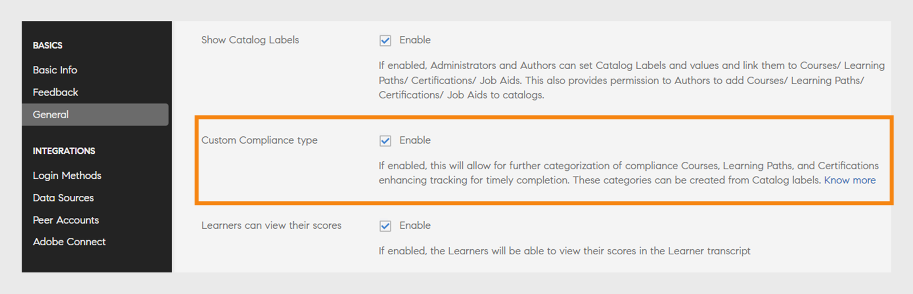
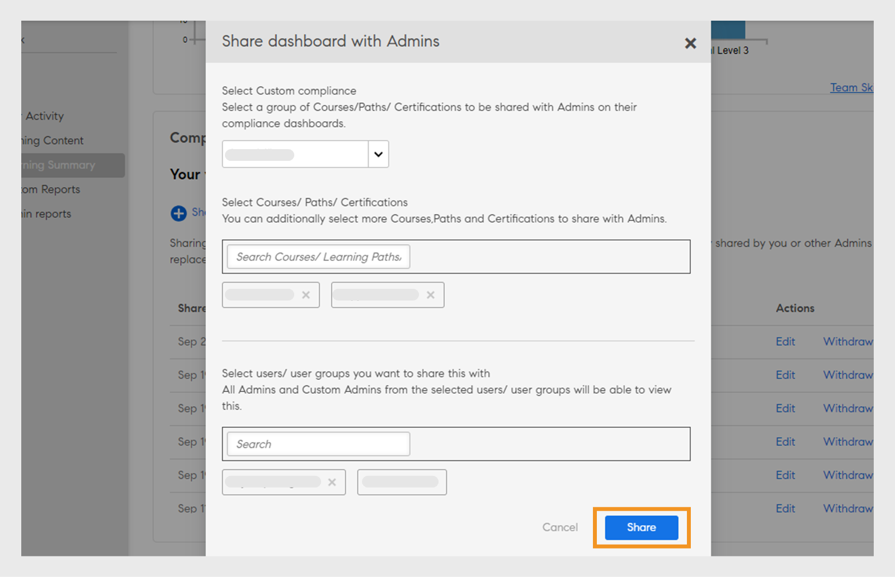

# Rapporter

Läs mer om de rapporter som är kopplade till administratörsrollen i Learning Manager-programmet.

Med Adobe Learning Manager kan du skapa olika rapporter för att följa, övervaka och kontrollera elevaktiviteter. Elevaktiviteter spåras och hämtas automatiskt till databasen. Chefs- och administratörsrapporter genereras från databasen.

## Översikt {#overview}

Genereringsprocessen för rapporter är densamma för både Administratör och Chef. Chefer kan visa rapporter som motsvarar deras underordnade, medan administratörer kan visa alla rapporter som gäller för hela organisationen.

Rapporter sammanställs i en kontrollpanel. En rapport måste finnas inuti en kontrollpanel. En **[!UICONTROL Default Dashboard]** finns som standard på sidan Rapporter. Alla rapporter som läggs till av dig placeras på den här standardkontrollpanelen. Om du vill lägga till rapporter i enskilda instrumentpaneler använder du listrutepilen och väljer **[!UICONTROL Add Report]**. Mer information om hur du skapar kontrollpaneler finns i avsnittet Kontrollpaneler på den här sidan.

## Typer av rapporter {#typesofreports}

Adobe Learning Manager har stöd för fyra huvudtyper av rapporter: slutförande, tidsåtgång, kompetens och effektivitet. Du kan använda följande rapporttyper för att generera rapporter om fler än 300 varianter:

* Statistik för kursleverans för elever
* Effektivitetsrapport för kurser
* Rapport över elevens kompetens
* Statistik för registrering i utbildningsprogram för elever
* Utbildningstid som elever lagt ner
* Antal elever
* Slutförande av certifiering

## Kontrollpaneler för användaraktivitet {#useractivitydashboards}

Se en sammanfattning av all användaraktivitet på plattformen över tid. Konfigurera användargrupper och tillämpa filter.

Kontrollpanelen för användaraktivitet visar aktiviteten för användare på kontot. De tre rapporterna som visas är:

* **Registrerade användare:** Den här rapporten innehåller information om antalet användare som är registrerade på ditt konto varje vecka. För konton med licenser för månatliga aktiva enheter visas MAU-enheterna i stället i rapporten.

* **Besöksrapport för användare:** Den här rapporten innehåller information om antalet användare som dagligen använder plattformen. Månadsvis rapport finns också tillgänglig.

* **Rapport över använd utbildningstid:** Den här rapporten innehåller information om den utbildningstid som används på plattformen varje dag. Månadsvis rapport finns också tillgänglig.

### Registrerade användare {#registeredusers}

Learning Manager registrerar antalet användare som registreras i systemet varje vecka. Administratörer kan se den här rapporten för att få en uppfattning om det registrerade antalet användare den dagen i veckan. Det registrerade antalet ändras inte om det en gång förvarats under en vecka. Därför är historiskt registrerat antal inte relaterat till den aktuella uppsättningen elever i systemet.

Den här rapporten innehåller information om antalet användare som är registrerade på ditt konto varje vecka.

För konton med licenser för månatliga aktiva enheter visas MAU-enheterna i stället i rapporten.

*Rapport över registrerade användare*

***För månatliga åtkomstenhetskonton:***

**Månadsrapport över aktiva användare**

Den här rapporten visar antalet elever som är aktiva på utbildningsplattformen varje månad. Användaren anses vara aktiv under månaden om han/hon utför någon av de utbildningsåtgärder som nämns här. Det är samma sätt som Månadens aktiva enheter räknas.

Det månatliga aktiva antalet när det har räknats och lagrats i en månad ändras inte. Därför är det historiska antal som visas inte relaterat till den aktuella uppsättningen elever i systemet.

### Användarbesök {#uservisits}

Den här rapporten visar det totala antalet elever som har tillgång till systemet under en dag- eller månadsperiod. Att bläddra på utbildningsplattformen utan att använda något lärande anses också som att &quot;komma åt&quot; utbildningsplattformen. Detta hjälper administratören att förstå den totala mängden användare som har åtkomst till systemet. Den första månaden skapar Learning Manager en post med det totala antalet användare som har tillgång till plattformen under föregående månad. Det registrerar även användargruppsinformation för dessa användare.

Endast de användargrupper som har konfigurerats av administratören registreras. Detta gör att administratörerna kan tillämpa filter på användargrupper även för historiska månadsdata. Observera att om konfigurationen av användargrupper ändras och Learning Manager inte har registrerat data för den här användargruppen under tidigare månader så kan inte Learning Manager visa data för den här nyligen konfigurerade användargruppen under de föregående månaderna.

Den här rapporten innehåller användare som använder plattformen med alla format som webben, mobilappen, fjärradministrerade anpassade lösningar och så vidare. Användningsdiagrammet för enhetsappen anger endast de användare som använder plattformen med Learning Managers enhetsapp. Detta hjälper administratörer att identifiera användningen av mobilappen i sina konton.

*Besöksrapport för användare*

### Rapport över använd utbildningstid {#learningtimespentreport}

Här visas ett linjediagram med två axlar som visar den totala inlärningstiden för alla elever under en 12-månadersperiod. Den andra axeln representerar mediantid för att lära sig för en individ.

Tiden för olika utbildningsobjekt, till exempel utbildningsprogram och certifieringar, beräknas för följande:

* Kurs i egen takt med statiskt och interaktivt innehåll
* Aktivitetskurser med URL.
* Helgsessioner med helgflaggan aktiverad.
* VC-anslutningssession där närvaro markeras automatiskt.
* Den tid som ägnas åt olika utbildningsobjekt, till exempel utbildningsprogram och certifieringar
* xAPI-satser för en xAPI-aktivitetskurs.

Du kan exportera diagrammet som ett Excel-kalkylblad ytterligare.

Det finns ett filter för att välja konfiguration av användargrupp, vilket underlättar visning av data med avseende på olika användargrupper.

Det valda filtret för datum och användargrupp används i alla relevanta diagram på kontrollpanelen.

>[!NOTE]
>
>För **[!UICONTROL User Visits]**- och **[!UICONTROL Learning Time Spent]**-rapporter kommer standarddata (när ingen användargrupp har konfigurerats) som visas att visas för hela kontot.

## Instrumentpanel för utbildningsinnehåll {#trainingcontentdashboard}

På instrumentpanelen för utbildningsinnehåll finns insikter om utbildningar som är tillgängliga på plattformen. Du kan visa populära utbildningar eller spåra alla tillgängliga utbildningar.

### Utbildningsrapport {#trainingsreport}

Den här rapporten innehåller information om det totala antalet utbildningar som är tillgängliga på plattformen (i publicerat skick) per månad under månad. Det ger en antydan om antalet utbildningar som erbjuds över tiden.

*Utbildningsrapport*

### Aktiv utbildningsrapport {#activetrainingsreport}

Den här rapporten innehåller information om utbildningarna som är aktiva inom det valda tidsintervallet. Aktiva utbildningar är utbildningar som registreras, visas i spelare eller slutförs inom angiven tid.

För aktiva utbildningar kommer data för alla rotanvändargrupper (med chefsroll) att vara tillgängliga för urval när ingen konfiguration av användargrupper är klar. Förutom rotanvändargrupperna kan du konfigurera ytterligare 10 användargrupper om det behövs.

*Aktiv utbildningsrapport*

>[!NOTE]
>
>Data visas inte som förväntat när **[!UICONTROL All Users]** och **[!UICONTROL 12 months]** filter har valts, men data visas när du väljer **[!UICONTROL All internal user group].**

<table>
 <tbody>
  <tr>
   <td>
    
<b>Referens</b>
</td>
   <td>
    
<b>Metrisk</b>
</td>
   <td>
    
<b>Beskrivning</b>
</td>
  </tr>
  <tr>
   <td>
    
1
</td>
   <td>
    
Startförhållande (%)
</td>
   <td>
    
Förhållandet mellan antalet elever som har startat kursen och antalet registreringar.
</td>
  </tr>
  <tr>
   <td>
    
2
</td>
   <td>
    
Andel slutfört (%)
</td>
   <td>
    
Förhållandet mellan det totala antalet användare som har slutfört kursen och det totala antalet användare som har startat kursen. 
</td>
  </tr>
  <tr>
   <td>
    
3
</td>
   <td>
    
Feedback från elev
</td>
   <td>
    
Genomsnitt av alla L1-feedbacksvar som mottagits på en skala från 1 till 10 avrundat till närmaste heltal. 
</td>
  </tr>
  <tr>
   <td>
    
4
</td>
   <td>
    
Feedback från chef
</td>
   <td>
    
Genomsnitt av alla L3-svar som mottagits på en skala från 1 till 5 avrundat till närmaste heltal 
</td>
  </tr>
 </tbody>
</table>

Utbildningsrapporten har ytterligare två kolumner:

1. Genomsnittlig stjärnrankning för en kurs.
1. Antal elever som har betygsatt kursen.
1. Inbäddad väg
1. Inbäddat väg-ID
1. Inbäddat kurs-ID

>[!NOTE]
>
>Startkvot, slutförandegrad, elevfeedback och chefsfeedback påverkas inte av de filter som tillämpas. Filtren påverkar endast registrering, visningar och slutföranden.

>[!NOTE]
>
>För båda rapporterna (Utbildningsinnehåll, Användaraktivitet) kan du konfigurera högst 10 användargrupper. Det kan ta upp till 24 timmar för bearbetningen att slutföras och göra de nyligen konfigurerade filtren tillgängliga.

## Instrumentpaneler med utbildningssammanfattning {#dashboards}

### Generera kontrollpanelsrapporter

>[!INFO]
>
>I den här utbildningen får du lära dig hur du genererar kontrollpanelsrapporter från databasen.    

Skriv till <almacademy@adobe.com> om du inte kan starta utbildningen.

Se en sammanfattande rapport över alla utbildningsaktiviteter i plattformen. På den här sidan visas följande sammanfattningsinformation för den valda rotanvändarens team och externa profiler. Du kan även välja Tidsintervall:

* Utbildningssammanfattning i form av registreringar, vyer och slutföranden
* Viktigaste kompetenserna
* Sammanfattning av efterlevnad

*Översiktsdiagram*

Om det finns interna rotnivåhanterare visas de efter varandra.

Alla externa profiler visas efter interna profiler (interna rotnivåanvändare).

Om en extern profil har en chef visas chefshierarkin i listrutan **[!UICONTROL Showing Data For]**. Användaren listas i chefshierarkin på sidan med all information (utbildningssammanfattning, efterlevnad och kompetensstatus)

I annat fall visas alla enskilda användaruppgifter i listan.

Klicka på **[!UICONTROL Learning Summary Details]** om du vill se mer detaljerad information om registreringar av olika interna team.

*Sammanfattning av utbildning*

När du klickar på en registrering kan du se eleverna för varje chef och registrering till vilka utbildningsobjekt. Du kan också se förloppet och slutförandet för varje elev.

*elever som tilldelats en chef*

Klicka på ett team och exportera dess rapport som en CSV. En administratör kan exportera rapporten för vilken användargrupp eller användare som helst genom att välja användargruppen eller den enskilda användaren och sedan exportera information från listrutan **[!UICONTROL Action]**.

Du kan också se ett stapeldiagram över kompetenser som pågår och har uppnåtts. Du kan lägga till/ta bort kompetenser som du vill ha med i diagrammet.

*Skicklighetsstatus i stapeldiagram*

### Efterlevnadstavla

**Adobe Learning Manager** har en efterlevnadstavla för alla administratörer och chefer. Administratörer kan skapa en efterlevnadstavla och dela den med chefer. Chefer kommer att kunna se den nyligen delade instrumentpanelen i sina appar och kan enkelt spåra hur deras teammedlemmar följer reglerna för en viss utbildning. Efterlevnadstavlan gör att administratörer kan kategorisera anpassade efterlevnadskurser i specifika kategorier (t.ex. Försäljning, Marknadsföring och Juridik). Anpassade kompatibilitetskategorier drivs av **[!UICONTROL Catalog Labels]**.

_Efterlevnadstavla - administratörsvy_

Administratörer kan också kontrollera efterlevnadsstatusen för varje chefs team genom att välja **[!UICONTROL Go to Compliance dashboard]**. Administratörer kan dela en uppsättning utbildningskurser med chefer enskilt eller med en grupp. Detta hjälper chefer att enkelt spåra hur deras teammedlemmar följer den angivna utbildningen.

#### Administratörsarbetsflöde

##### Skapa anpassade kompatibilitetsetiketter

En efterlevnadsetikett är en typ av katalogetikett som kategoriserar kurser/utbildningsvägar/certifieringar som en efterlevnadstyp.
Skapa en anpassad kompatibilitetsetikett genom att följa dessa steg:

1. Gå till **[!UICONTROL Settings]** > **[!UICONTROL General]** i Administratörsprogrammet.
1. Välj alternativet **[!UICONTROL Custom Compliance type]** för att aktivera den anpassade kompatibilitetsetiketten.

   
   _Aktivera anpassad efterlevnad_

   >[!NOTE]
   >
   >Denna nya katalogetikett har introducerats för att kategorisera kurser, utbildningsvägar och certifieringar som en efterlevnadstyp. Om du vill aktivera alternativet **[!UICONTROL Custom Compliance type]** måste du först aktivera alternativet **[!UICONTROL Show Catalog Label]** på samma sida.

1. Gå till **[!UICONTROL Settings]** > **[!UICONTROL Catalog Label]** och välj **[!UICONTROL Compliance type]**.
1. Skriv värdena (t.ex. Legal, Sales) i textrutan **[!UICONTROL Value]** och välj **[!UICONTROL Add Value]**.

   
   _Lägg till värden för anpassad efterlevnad_

1. Välj **[!UICONTROL Save]**.

>[!NOTE]
>
>Författaren måste lägga till dessa kompatibilitetsetiketter när han/hon skapar/redigerar kurserna i programmet. Se [Lägg till kompatibilitetsetiketter till en kurs/utbildningsväg/certifiering](/help/migrated/authors/feature-summary/courses.md#add-compliance-labels-to-courselearning-pathcertification).

##### Skapa och dela en efterlevnadstavla

Gör så här för att skapa och dela en efterlevnadstavla:

1. Gå till **[!UICONTROL Reports]** > **[!UICONTROL Learning Summary]**.
1. Välj **[!UICONTROL Shared with Managers]** i avsnittet **[!UICONTROL Compliance Dashboard]**.
1. Välj **[!UICONTROL Share dashboard]** och välj de skapade etiketterna i listrutan **[!UICONTROL Select Compliance Label]**.

   
   _Välj kompatibilitetstyp_

1. Skriv och välj chefens namn i textrutan **[!UICONTROL Share with]**.
1. Välj **[!UICONTROL Share]** för att skicka instrumentpanelen till den valda hanteraren.

>[!NOTE]
>
>Om du delar den nya instrumentpanelen skrivs den befintliga instrumentpanelen över i den valda chefens app. Chefer kommer att kunna se den nyligen delade kontrollpanelen av administratörerna.

#### Dela efterlevnadstavla med administratörer och anpassade administratörer

Administratörer kan dela kontrollpanelen med andra administratörer och anpassade administratörer, vilket ger dem omedelbar åtkomst till alla efterlevnadstavlor.

Följ de här stegen för att dela kontrollpanelen med administratörer och anpassade administratörer:

1. Logga in som **[!UICONTROL Admin]**.
2. Gå till **[!UICONTROL Reports]** > **[!UICONTROL Learning Summary]**.
3. Välj **[!UICONTROL Admin View]** i avsnittet **[!UICONTROL Compliance Dashboard]**.
4. Välj knappen **[!UICONTROL Share Dashboard]**.

   
   _Dela tavla - Admin_

5. Välj kompatibilitetsetiketterna på rullgardinsmenyn **[!UICONTROL Select Custom Compliance]**. Det här alternativet markerar alla kurser som har de valda kompatibilitetsetiketterna.
6. Välj de ytterligare kurser, utbildningsvägar eller certifieringar som du vill dela med administratörer.

   
   _Dela efterlevnadstavla_

7. Välj de användare eller användargrupper som du vill dela kontrollpanelen med och välj **[!UICONTROL Share]**.

##### Visa efterlevnadstavlan - Anpassade administratörer och andra administratörer

Alla anpassade administratörer och andra administratörer från den valda användargruppen kan se efterlevnadstavlan i sitt program.

Följ de här stegen för att visa efterlevnadstavlan:

1. Gå till **[!UICONTROL Reports]** > **[!UICONTROL Learning Summary]** > **[!UICONTROL Compliance Dashboard]**.
2. Välj **[!UICONTROL Your View]** i avsnittet **[!UICONTROL Compliance Dashboard]**.
3. Välj alternativet **[!UICONTROL Go to Compliance Dashboard]** så kan du se den nya efterlevnadstavlan som delas av administratören.

   
   _Visa efterlevnadstavlan - anpassad administratör_

#### Dela med butikschefer

Administratörer kan dela efterlevnadstavlan med butikschefer, vilket gör att de kan övervaka sina elevers efterlevnadsframsteg.

Så här delar du instrumentpanelen med butikschefer:

1. Logga in som **[!UICONTROL Admin]**.
2. Gå till **[!UICONTROL Reports]** > **[!UICONTROL Learning Summary]** > **[!UICONTROL Compliance Dashboard]**.
3. Välj **[!UICONTROL Manager View]** i avsnittet **[!UICONTROL Compliance Dashboard]**.
4. Välj knappen **[!UICONTROL Share Dashboard]**.

   
   _Dela efterlevnadstavlan med chefer_

5. Välj kompatibilitetsetiketterna på rullgardinsmenyn **[!UICONTROL Select Custom Compliance]**.
Det här alternativet markerar alla kurser som har de valda kompatibilitetsetiketterna.
6. Välj de ytterligare kurser, utbildningsvägar eller certifieringar som du vill dela med administratörer.
7. Välj de användare eller användargrupper som du vill dela kontrollpanelen med och välj **[!UICONTROL Share]**.

##### Visa efterlevnadstavlan - chef

Se den här artikeln [Visa efterlevnadstavlan](/help/migrated/managers/feature-summary/manager-dashboard.md#view-the-dashboard) för mer information.

#### Redigera kontrollpanelen

Följ de här stegen för att redigera efterlevnadstavlan:

1. Logga in som **[!UICONTROL Admin]**.
2. Gå till **[!UICONTROL Reports]** > **[!UICONTROL Learning Summary]** > **[!UICONTROL Compliance Dashboard]**.
3. Välj **[!UICONTROL Admin View]** eller **[!UICONTROL Manager View]** i avsnittet **[!UICONTROL Compliance Dashboard]**. Du kan se kontrollpanelerna för efterlevnad i det här avsnittet.
4. Välj **[!UICONTROL Edit]** på efterlevnadstavlan som du vill redigera.

   
   _Redigera efterlevnadstavlan_

5. Ändra de obligatoriska uppgifterna och välj **[!UICONTROL Share]**.
6. Efterlevnadstavlan delas med de valda cheferna.

#### Dra tillbaka kontrollpanelen - Admin

Gör så här för att dra tillbaka efterlevnadstavlan:

1. Logga in som **[!UICONTROL Admin]**.
2. Gå till **[!UICONTROL Reports]** > **[!UICONTROL Learning Summary]** > **[!UICONTROL Compliance Dashboard]**.
3. Välj **[!UICONTROL Admin View]** eller **[!UICONTROL Manager View]** i avsnittet **[!UICONTROL Compliance Dashboard]**. Du kan se kontrollpanelerna för efterlevnad i det här avsnittet.
4. Välj **[!UICONTROL Withdraw]** på efterlevnadstavlan som du vill ta bort och välj **[!UICONTROL Proceed]**.
5. Den här åtgärden tar bort den delade efterlevnadstavlan från chefens app.

   
   _Dra tillbaka efterlevnadstavlan_

#### Ange standardwidget för efterlevnad för elever

Följ de här stegen för att ställa in standardwidgeten för efterlevnad för elever:

1. Logga in som **[!UICONTROL Admin]**.
2. Gå till **[!UICONTROL Reports]** > **[!UICONTROL Learning Summary]** > **[!UICONTROL Compliance Dashboard]**.
3. Välj **[!UICONTROL Learner View]** i avsnittet **[!UICONTROL Compliance Dashboard]**.
4. Välj **[!UICONTROL Change]** i avsnittet **[!UICONTROL Learner View]**.

   
   _Ställ in standardwidgeten för efterlevnad för elever_
5. Välj kompatibilitetsetiketterna i listrutan **[!UICONTROL Custom Compliance]**. Det här alternativet markerar alla kurser som har de valda kompatibilitetsetiketterna.
6. Välj **[!UICONTROL Proceed]** för att ange standardwidgeten för efterlevnad.

Elever kan se de valda kurserna eller utbildningsvägarna i efterlevnadswidgeten på sin startsida. Mer information finns i [widgeten Efterlevnadstavla](/help/migrated/learners/feature-summary/learner-home-page.md#compliance-dashboard-widget).

## Anpassade rapporter

Administratörer kan skapa specifika rapporter med hjälp av den anpassade mall som är tillgänglig i avsnittet **[!UICONTROL Reports]**.

### Exempelrapporter {#samplereports}

Fliken **[!UICONTROL Sample Reports]** visar några indikativa rapporter som baseras på exempeldatapunkter. Utforska dessa rapporter och få en uppfattning om olika typer av funktionsrika rapporter som du kan generera med hjälp av dina kontodata.

### Rapporter för kontrollpanelen {#dashboardreports}

En kontrollpanel är en samling rapporter. Rapporter kan grupperas i en kontrollpanel enligt ditt val. Klicka på fliken Tavla för att se alla tavlor som du har skapat. I listrutan **[!UICONTROL View Dashboard]** kan du välja standardtavlan eller en instrumentpanel som du skapade.

### Excel-rapporter {#excelreports}

På fliken **[!UICONTROL Excel Reports]** kan du exportera rapporter i XLS-filformat.

Nedan visas de rapporttyper som är tillgängliga för hämtning.

* Kursrapporter
* Elevens betygsutdrag
* Notisrapport
* Arbetsstödsrapport
* Verifieringskedja för innehåll
* Verifieringskedja för användare
* Rapport över inloggning/åtkomst
* Spelifieringsutdrag
* Verifieringskedja för spelifiering

### Elevens betygsutdrag {#learnertranscripts}

Elevens betygsutdrag i Excel-rapporter visar kolumnerna Obligatoriska krediter och intjänade poäng i decimaltal.

### Kursrapporter {#coursereports}

Du som är administratör kan hämta rapporter för kurser. Gör så här:

1. Öppna **[!UICONTROL Reports]** > **[!UICONTROL Custom Reports]** > **[!UICONTROL Excel Reports]** > **[!UICONTROL Course Reports]**.
1. Dialogrutan **[!UICONTROL Course Report]** visas. Välj kursen som du vill hämta rapporten från och klicka på **[!UICONTROL Show]**.

   
   *Kursrapporter*

1. Du omdirigeras till kurssidan. Du kan exportera quiz-poäng per användare och per fråga baserat på varje registrering genom att välja den specifika registreringstypen.
1. Välj **[!UICONTROL Export Quiz Score]** för att exportera rapporten. En **[!UICONTROL Generating Report Request]**-dialogruta visas. Klicka på **[!UICONTROL OK]** för att bekräfta.

   
   *Genererar rapportförfrågan*

   >[!NOTE]
   >
   >Den exporterade quiz-poängrapporten innehåller poänginformationen för varje försök om alternativet Flera försök är konfigurerat för modulen.

### Generera kursrapporter

>[!INFO]
>
>I den här utbildningen får du lära dig hur du exporterar kursrapporter och konfigurerar e-postprenumerationer för rapporterna.    

Skriv till <almacademy@adobe.com> om du inte kan starta utbildningen.

### Elevens betygsutdrag {#LearnerTranscripts-1}

Med Adobe Learning Manager kan administratörer i en organisation generera utskrifter som är kopplade till elever. Elevens betygsrapport innehåller följande:

1. Elevens betygsutdrag: instrumentpanel för utbildningsaktivitet
1. Kompetens: instrumentpanel för kompetens
1. Efterlevnadstavla

Elevens betygsutdrag i Excel-rapporter visar kolumnerna Obligatoriska krediter och intjänade poäng i decimaltal.

Mer information om hur du genererar elevbetygsrapporter och mer information finns i [Elevbetygsutdrag](learner-transcripts.md).

### Meddelanderapporter {#announcementsreports}

Administratörer kan skapa rapporter över alla meddelanden som skickas. Rapporten innehåller information om:

* Meddelandetyp
* Meddelandenamn
* Meddelandedatum
* Tillstånd för tillkännagivandet
* Elevens namn

Gör något av följande för att hämta en rapport:

1. Öppna **[!UICONTROL Reports]** > **[!UICONTROL Custom Reports]** > **[!UICONTROL Excel Reports]** > **[!UICONTROL Announcements Report]**. Dialogrutan **[!UICONTROL Generating Report Request]** öppnas. Klicka på OK.
1. [!UICONTROL **Meddelanden**] > [!UICONTROL **Åtgärder**] > [!UICONTROL **Exportera rapport**].

   
   *Meddelanderapport*

1. Du kan extrahera en rapport för ett specifikt meddelande genom att klicka på **[!UICONTROL Export Report]** under inställningsikonen.

   
   *Rapport för specifika meddelanden*

### Arbetsstödsrapport {#jobaidsreport}

Arbetsstöd är utbildningsinnehåll som en elev kan komma åt utan att behöva registrera sig för ett specifikt utbildningsobjekt som en kurs eller ett utbildningsprogram. Administratörer kan extrahera och ladda ner Job Aids-rapporten.

Den extraherade rapporten innehåller information om följande:

* Namn
* Typ av arbetsstöd
* Status för arbetsstöd (offentliggjort eller återkallat)
* Registreringsdatum
* Datum för slutförande
* Nedladdningsdatum
* Elevens namn
* Chefens namn
* Skapad av

Gör något av följande för att hämta en rapport:

* Öppna **[!UICONTROL Reports]** > **[!UICONTROL Custom Reports]** > **[!UICONTROL Excel Reports]** > **[!UICONTROL Job Aid Reports]**. Dialogrutan **[!UICONTROL Generating Report Request]** visas. Klicka på **[!UICONTROL Ok]**.
* Öppna **[!UICONTROL Job Aid]** > **[!UICONTROL Actions]** > **[!UICONTROL Export Report]**.

*Arbetsstödsrapport*

* Du kan även extrahera en rapport för ett specifikt arbetsstöd genom att klicka på **[!UICONTROL Export Report]** under inställningsikonen.

*Rapport för specifikt arbetsstöd*

### Arbetsstödsrapport

När du har valt **[!UICONTROL Job Aids Report]** i listan visas två alternativ:

*Ladda ned rapport om arbetsstöd för användarregistrering*

**Alla arbetsstöd**: Om antalet arbetsstöd på kontot är färre än 10 miljoner innehåller den genererade rapporten registreringsinformation för alla arbetsstöd. Detta är standardvalet. Om antalet rader överstiger 10 miljoner visas ett fel och du måste välja de nödvändiga arbetsstöden manuellt.

**Valda arbetsstöd**: Om du väljer det här alternativet kan du ange de arbetsstöd som du vill generera rapporten för. Du kan välja högst tio arbetsstöd. Adobe Learning Manager kontrollerar om arbetsstödet överstiger 10 miljoner.

*Välj ett arbetsstöd*

**Rapport om arbetsstöd**

Om du väljer det här alternativet hämtas information om alla arbetsstöd i systemet tillsammans med metadata och utbildning.

Den hämtade rapporten består av följande fält:

* Arbetsstödsnamn
* Språk
* ID
* Typ
* Varaktighet (minuter)
* Status
* Datum för publicering (tidszonen UTC)
* Skapad per namn
* Skapad per mejl
* Skapat av unikt användar-ID
* Katalog(er)
* Utbildningsväg(ar)
* Kurs(er)
* Tagg(ar)
* Kompetens(er)

**Registreringsrapport för arbetsstöd**

Registreringsrapporten innehåller information om användarregistrering och annan information.

Den hämtade rapporten består av följande fält:

* Arbetsstödsnamn
* Typ
* Status
* Datum registrerad (tidszonen UTC)
* Datum för slutförande (tidszonen UTC)
* Nedladdningsdatum (tidszonen UTC)
* Elevnamn
* E-post
* Unikt användar-ID
* Chefens namn
* Mejladress till chef
* Unikt användar-ID för chef
* Tilldelad efter namn
* Tilldelad per e-post
* Tilldelat av unikt användar-ID
* Skapad per namn
* Skapad per e-post
* Skapat av unikt användar-ID
* Jobbkod
* Nytt fält
* Profil

### Verifieringskedjan för innehåll {#contentaudittrailreports}

Använd rapportgeneratorn **[!UICONTROL Content Audit Trail]** för att generera en rapport över alla ändringar och redigeringar som gjorts på en kurs under dess livstid i systemet. Följande information hämtades i den genererade rapporten.

* Objekt-id
* Objektnamn
* Objekttyp
* Ändringstyp
* Beskrivning
* Refererat objekt-ID
* Refererat objektnamn
* Ändrat per användarnamn
* Ändrad av användar-ID
* Ändringsdatum (tidszonen UTC)

I kolumnen **Ändringstyp** visas följande information:

| Ändringstyp | Beskrivning |
| --- | --- |
| Skapa | Kursen har skapats |
| Lägg till certifiering | Certifieringen har lagts till i katalogen |
| Ta bort certifiering | Certifieringen har tagits bort från katalogen |
| Lägg till innehåll | Innehåll har lagts till i modul |
| Lägg till kurs | Kursen har lagts till i utbildningsvägen |
| Ta bort kurs | Kursen har tagits bort från utbildningsvägen |
| LÄGG TILL ANPASSAD ETIKETT | Anpassad etikett har lagts till i katalogen |
| Ta bort anpassad etikett | Anpassad etikett borttagen från katalogen |
| Ta bort | Katalogen raderades |
| Lägg till arbetsstöd | Arbetsstöd har lagts till i katalogen |
| Ta bort arbetsstöd | Arbetsstöd har tagits bort från katalogen |
| Lägg till utbildningsväg | Utbildningsväg tillagd i katalog |
| Ta bort utbildningsväg | Utbildningsväg borttagen från katalog |
| Lägg till modulinnehåll | Modulen har lagts till i kursen (avsnittet Innehåll) |
| Ta bort modulinnehåll | Modulen har tagits bort från kursen (avsnittet Innehåll) |
| Publicerat | Kursen eller utbildningsvägen har publicerats och lagts till i standardkatalogen |
| Återpublicerad | Kursen har publicerats om |
| Resurstillägg | Resursen har lagts till i kursen |
| Resurs - ta bort | Resursen har tagits bort från kursen |
| Utfasad | Kursen har fasats ut |
| Lägg till delad katalog | Katalogen har delats i katalogen |
| Ta bort delad katalog | Katalogdelning har tagits bort från katalogen |
| Uppdatering av delad katalog | Delningsläge för katalog : aktiv |
| Uppdatera | Kurs eller utbildningsväg har uppdaterats |
| Lägg till användargrupp | Användargrupp har lagts till i katalogen |
| Ta bort användargrupp | Användargruppen togs bort från katalogen |

Information om metadata hämtas inte i den genererade rapporten.

Följ de här stegen för att generera en granskningsrapport för kursspår.

1. Välj **[!UICONTROL Report]** > **[!UICONTROL Excel reports]** > **[!UICONTROL Course Audit Trail]**. Dialogrutan **[!UICONTROL Content Audit Trail]** visas.

   
   *Kursens granskningsspår*

1. Välj kursen, utbildningsprogrammet och certifieringen som du vill hämta rapporten för. Om det inte anges hämtas alla rapporter som standard.
1. Välj ett datumintervall för rapporten och klicka på **[!UICONTROL Generate]**.
1. Rapporten skapas och du meddelas att innehållsgranskningsrapporten är klar. Du kan hämta rapporten.

### Verifieringskedjan för användare {#useraudittrailreports}

Verifieringskedjan för användare visar livscykeln för användare, användargrupper och självregistreringsprofiler. Tillägg av användare, borttagning, ändring i chef, registreras. Skapande och radering av självregistreringsprofiler registreras. Du kan även pausa och återuppta självregistreringen.

Du kan lägga till, aktivera, inaktivera, pausa och återuppta för externa profiler medan du kan lägga till, ta bort, pausa och återuppta för egenregistrering. CSV-uppladdningar hämtas också.

1. Välj **[!UICONTROL Report > Excel report > User Trail]**. Dialogrutan Verifieringskedja för användare visas.
1. Dialogrutan Verifieringskedja för användare visas. Välj datumintervallet på snabbmenyn. Du kan antingen välja att generera rapport för den senaste veckan, den senaste månaden eller välja anpassat datum.

   
   *Verifieringskedja för användare*

1. Klicka på **[!UICONTROL Generate]** för att generera rapporten.

Det finns två filter i dialogrutan **[!UICONTROL User Audit Trail Report]**.

**Filter för datumintervall:** Välj det datumintervall som du vill generera rapporten för. Det finns tre alternativ:

* Senaste veckan
* Senaste månaden
* Anpassat datum

Välj elevfilter: Sök efter en användare eller användargrupp.

Den exporterade rapporten innehåller data för de användare som uppfyller båda de angivna sökkriterierna.

*Verifieringskedja för användare*

>[!NOTE]
>
>När en kompetens tilldelas eller tas bort kan kompetensen spåras för användargranskningsrapporten för både tilldelade och borttagna.

### RAPPORT ÖVER TILLÄGGSKONFIGURATION

Den här rapporten innehåller information om konfigurationsinformationen för alla tillagda interna tillägg, inklusive deras aktiveringstillstånd. Läs om hur du hämtar tilläggsrapporten i [Hämta tilläggsrapporten](native-extensibility.md#download-extension-report).

### xAPI-aktivitetsrapport

Den här rapporten innehåller data för alla xAPI-satser som har registrerats och genererats under xAPI-aktivitetsmoduler.

Hämta den här rapporten genom att följa stegen nedan:

1. Välj **[!UICONTROL Report > Excel report > xAPI Activity Report]**. Dialogrutan xAPI-aktivitetsrapport visas.
1. Välj datumintervallet på snabbmenyn. Du kan antingen välja att generera rapport för den senaste veckan, den senaste månaden eller välja anpassat datum.
1. Välj elever och aktivitet i listrutan.
1. Välj **[!UICONTROL Generate]** för att generera rapporten.

### Spelifieringsrapporter {#gamification}

Administratörer kan hämta transkribering av spelifiering i CSV-format. Du kan antingen hämta rapporten för enskilda användare eller användargrupper. Användarnamn, användarens e-postadress, användarens UUID, det totala antalet gjorda användarpoäng, uppdelning av insamlade poäng, namnet på de grupper som användaren spelar i, namnet på chefen och aktiva fältvärden hämtas i rapporten. Administratörer kan använda den här rapporten för att utvärdera och förstå användarrankningar på organisationsnivå eller för en viss grupp.

1. Välj Rapport > Excel-rapport > Spelifieringsrapport.

   
   *Spelifieringsrapport*

1. Dialogrutan Transkribering av spelifiering visas. Välj elever genom att använda deras namn, profil, användargrupper, e-post-ID eller UUID.

   
   *Dialogrutan Transkribering av spelifiering*

1. Klicka på **[!UICONTROL Generate]** för att generera rapporten.

   När du har genererat rapporten för en elev måste du kunna exportera aktuell och uppnådd information för alla användare (interna, externa eller borttagna) på kontot. Du kan också kontrollera datumen för de nivåer som en elev uppnått:

   * Brons har uppnåtts datum
   * Silver har uppnåtts datum
   * Guld har uppnåtts datum
   * Platina har uppnåtts datum

   Dessa kolumner innehåller de datum då nivån uppnåddes för första gången. Kolumnen **[!UICONTROL Current Level]** visar elevens aktuella nivå.

   När administratören återställer spelifieringen återställs alla poäng för eleven därefter.

### Verifieringskedjan för spelifiering {#gamification-audit-trail}

Den här rapporten innehåller historik och orsaker till att elever fick spelifieringspoäng för varje regel.

### Hämta rapporten

1. Välj URL för granskningsspår för spelifiering.
1. Välj datumintervall i popup-fönstret **Granskningsspår för spelifiering**.
1. Välj **Generera**.

Rapporten hämtas i CSV-format. Filen innehåller följande kolumner:

* Namn
* Email/UUID,
* Status
* Åtgärd
* poäng,
* Balansera poäng
* Regel/uppgift
* regel/uppgift underuppgift,
* Regel/uppgiftsinformation
* typ,
* Namn,
* Instansens NameDate har uppnåtts (tidszonen UTC)
* Regel/aktivitetens starttid
* Regel/sluttid för aktivitet

### Rapport över registrering och avregistrering {#enrollmentandunenrollmentreport}

Administratörer och chefer kan extrahera en rapport över elever som har registrerats och avregistrerats. Som administratör kan du se någon av eleven, administratören eller chefen som har registrerats eller avregistrerats från en instans av en kurs, ett utbildningsprogram eller en certifiering och exportera rapporten. Medan du som är chef kan du bara hämta en rapport om dina teammedlemmar. Som chef kan du inte se raderade elever eller ditt namn i chefsappen som en registrerad eller oregistrerad elev.

Hämta en rapport genom att följa dessa steg: Öppna **[!UICONTROL Course/ Learning program/ Certification]** > **[!UICONTROL Learners]** > **[!UICONTROL Action]** > **[!UICONTROL Export report]**.

*Avregistreringsrapport*

### Feedbackrapport {#feedback-report}

Som administratör kan du nu hämta både elevfeedback (L1) och chefsfeedback (L3) för valda utbildningar under en angiven period.

Du kan exportera data från användargränssnittet eller via PowerBI-anslutningen för mer djupgående analys.

Feedback-rapporter för L1 och L3 ger ett alternativ för att hämta en konsoliderad feedback-rapport för L1- och L3-svaren för valda utbildningar för ett intervall på **ett år** eller för upp till 10 valda utbildningar för ett datumintervall.

Logga in som administratör, klicka på **[!UICONTROL Reports]** > **[!UICONTROL Custom Reports]** och klicka på **[!UICONTROL Feedback Report]** i listan med rapporter.

*Hämta feedbackrapporten*

Om du klickar på Hämta efter att du har valt filtren visas ett meddelande om att du vill hämta rapporten i CSV-format.

Den hämtade rapporten innehåller information som utbildningsnamn och -typ, instansnamn, elevnamn och e-postadress, typ av feedback: L1 eller L3, datum för feedback som har skickats för nya data.

För befintliga data före den här funktionsimplementeringen visas LO-slutförandedatum, LO-slutförandedatum, L1-feedbackfråga Faktisk text och text i klassrum i egen takt i olika kolumner, L1-feedback respektive svar, chefens namn och e-postadress, L3-feedbackvärde och inlämningsdatum, Aktiva fält.

Du kan också exportera data från användargränssnittet eller till Power BI, som stöder alla utbildningar för alla datumintervall för mer djupgående analyser

### Utbildningsrapport {#training-report}

Learning Manager stöder utbildningsrapport som gör det möjligt för administratörer att hämta utbildningsinformation och tillhörande metadata som författare, publiceringsdatum, färdigheter, katalogetiketter osv.

Klicka på **[!UICONTROL Reports]** > **[!UICONTROL Custom Reports]** > **[!UICONTROL Excel Reports]** > **[!UICONTROL Trainings Report]** i Admin-appen.

Du kan hämta rapporter för följande:

* Valda utbildningar (gräns 10) - väljer en eller flera utbildningar (upp till 10) från valfri katalog
* Utbildningar i valda kataloger (gräns 5) - (katalogval kommer att finnas tillgängligt upp till fem kataloger)
* Alla utbildningar - (alla utbildningar på kontot)

*Hämta utbildningsrapporten*

I avsnittet Avancerade alternativ finns följande alternativ:

* Inkludera kursmappningar med utbildningsprogram/certifiering
* Inkludera modulnivåinformation

När du har valt filtren och klickar på Hämta får du ett meddelande om att hämta rapporten i CSV-format.

Rapporten innehåller följande fält:

*Katalognamn, Utbildningstyp, Utbildnings-ID, Utbildningens unika ID, Utbildningsnamn, Underkurser, Moduler, Utbildningens eller modulens längd, Format, Utbildningens status, Kompetenser, Författare, Senast publicerat datum, Senast slutfört datum, Instruktörer Registreringsantal, Antal påbörjade, Antal slutförda, Gen. L1-poäng, Gen. L2-poäng, Gen. L3-poäng, Antal mottagna svar mottagna, katalogetiketter och taggar.*

*Ytterligare alternativ*

### Sammanfattningsrapport för session {#session-summary-report}

Sessionssammanfattningsrapporten innehåller alla sessioner som är planerade för en elev inom ett visst datum.

Detta gör att administratören kan exportera alla virtuella sessionsdetaljer och klassrumssessionsdetaljer som faller under det angivna datumintervallet. Administratören kan också exportera sessionsrapporten för specifika utbildningar eller instruktörer.

Det hjälper även administratören att förstå de sessioner som planeras varje månad och identifiera instruktörernas schema och de sessioner som redan har levererats.

Klicka på **[!UICONTROL Custom Reports]** > **[!UICONTROL Session Summary Report]** som administratör.

Välj datumintervall och utbildning eller instruktör för en sammanfattning i dialogrutan som följer.

*Sammanfattningsrapport för session*

Den hämtade csv-filen innehåller följande fält:

* Startdatum och -tid
* Slutdatum och sluttid

* Modulnamn
* Sessionens varaktighet (i minuter)
* Platsantal
* Plats
* Instansnamn
* Kursnamn
* Kurs-ID
* Instruktörens namn
* Mejladress till instruktör
* Antal registreringar
* Sessionstyp
* Väntlistegräns
* Antal väntelistor
* Mejladress till användare på väntelistan
* Information om platsen
* Platsens region

### Rapport över instruktörsanvändning

Den här rapporten visar den tid (i minuter) som en instruktör tilldelar sessioner varje dag. Rapporten kan laddas ned under tre månader från det valda startdatumet.

Hämta rapporten genom att klicka på **[!UICONTROL Reports]** > **[!UICONTROL Custom Reports]** > **[!UICONTROL Instructor Utilization Report]**.

Välj en instruktör eller flera instruktörer och datumintervallet.

*Hämta användningsrapport för instruktör*

Den hämtade rapporten innehåller följande fält:

* Instruktörens namn
* Instruktörs-ID
* Kompetensnivå
* Datum som kolumner. Om instruktören används på ett datum visas antalet sessioner. Om instruktören inte används på en dag visas värdet noll.

Rapporten innehåller poster för tre månader från den valda månaden.

Lämna fältet Instruktör tomt om du vill hämta poster för alla instruktörer.

En anpassad administratör med behörighet att generera rapporter kan också hämta den här rapporten.

### Verifieringskedjan för användare - rapport

Den här rapporten innehåller information om elever som bytte instans, &quot;från instans&quot; till &quot;instans&quot;, växlade efter tid, datum osv.

Välj elever eller en användargrupp.

Hämta rapporten genom att klicka på **[!UICONTROL Reports]** > **[!UICONTROL Custom Reports]** > **[!UICONTROL User Audit Trail Report]**.

*Hämta en rapport över granskningsspår för användare*

### Rapport över utbildningsplan

Den här rapporten innehåller information om alla utbildningsplaner i ett konto, t.ex. relaterade användargrupper, status och utlösarinformation.

Rapporten innehåller följande:

* Utbildningsplanens namn
* Text (inträffar när)
* Utbildning (slutförd)
* Kompetens (uppnådd)
* Datum (på datum)
* Åtgärd
* Status, skapad av
* Skapandedatum
* Senast ändrad den
* Användargrupp (gäller för)
* Användargrupp (lägg till)
* Registrera dig efter
* Typ(er) av utbildningselement
* Utbildningselement
* Instanser av utbildningselement
* Utbildningselement
* Slutförandedatum
* Påminnelse om utbildningselement
* Omfång – katalog
* Omfång – användargrupp

### Granskningsspår för anpassade roller

Administratörer kan hämta granskningsrapporten för den anpassade rollen för att spåra alla ändringar som görs i de anpassade rollerna, däribland att skapa, ändra och ta bort anpassade roller och deras tillhörande funktionsåtkomst.

Hämta rapporten genom att följa dessa steg:

1. Logga in som administratör.
2. Välj Rapporter > Anpassade rapporter.
3. Välj granskningsspår för anpassad roll och välj datumintervall
4. Välj Generera för att hämta rapporten.

Granskningsspår för den anpassade rollen innehåller följande fält:

* Roll-ID
* Rollnamn
* Aktivitetstyp
* Ändringstyp
* Beskrivning
* Refererad objekttyp
* Refererat objekt-ID
* Refererat objektnamn
* Refererat objektmejl
* Ändrat per användarnamn
* Ändrad av användar-UUID
* Ändrat per användares mejl
* Ändringsdatum (tidszonen UTC)
* Källa

## E-postprenumerationer {#emailsubscriptions}

Du kan få dina favoritrapporter via e-post genom att prenumerera på dem.

### Konfigurera e-postprenumerationer

>[!INFO]
>
>I den här utbildningen får du lära dig konfigurera e-postprenumerationer för rapporter från instrumentpanelen.    

Skriv till <almacademy@adobe.com> om du inte kan starta utbildningen.

Klicka på fliken **[!UICONTROL Subscription]** på sidan **[!UICONTROL Reports]**. Sidan Rapportprenumeration visas.

Du väljer rapportnamnet i listrutan genom att börja skriva rapportnamnet i fältet Rapporter. Välj hur ofta du vill skicka e-post i listrutan. Du kan lägga till e-postmeddelandets ämne och ange ett alternativt e-post-ID.

Du kan redigera och radera prenumerationer.

## Historiska rapporter

Historikrapporter i Adobe Learning Manager (ALM) hänvisar till de rapporter som samlar historiska data och aktiviteter inom utbildningsplattformen. Dessa rapporter ger insikter om tidigare elevaktiviteter, utbildningsinnehåll, användargruppers prestanda och andra relevanta data. De historiska rapporterna gör det möjligt för administratörer att spåra, övervaka och analysera utbildningsinitiativs framsteg och effektivitet över tid.

### Rapporter om kursåtkomst

Rapporter om kursåtkomst ger information om varje kurs återbesök.

Hämta den här rapporten genom att följa stegen nedan:

1. Gå till **[!UICONTROL Reports]** > **[!UICONTROL Custom Reports]** > **[!UICONTROL Historic Reports]**.
1. Välj **[!UICONTROL Course Access Report]**. Dialogrutan Generera rapportbegäran öppnas.
1. Välj år och kvartal i listrutan.
1. Välj **[!UICONTROL Generate]**.

### Rapporter om inloggning/åtkomst

Inloggnings-/åtkomstrapporterna ger information om användarinloggningar och åtkomst. Du kan skapa en rapport med tre månaders data åt gången.

Hämta den här rapporten genom att följa stegen nedan:

1. Gå till **[!UICONTROL Reports]** > **[!UICONTROL Custom Reports]** > **[!UICONTROL Historic Reports]**.
1. Välj **[!UICONTROL Login/Access report]**. Dialogrutan Generera rapportbegäran öppnas.
1. Välj år och kvartal i listrutan.
1. Välj **[!UICONTROL Generate]**.

## Skapa en kontrollpanel {#createadashboard}

1. Om du vill börja skapa egna tavlor klickar du på Lägg till tavla till höger på sidan.

   
   *Lägg till instrumentpaneler*

1. Ange namn och beskrivning för instrumentpanelen.
1. Om du vill dela kontrollpanelen med en chef väljer du den i fältet **[!UICONTROL Share With]**. Du kan använda valfria normala urvalskriterier för den här åtgärden.
1. Klicka på **[!UICONTROL Save].**

Du kan visa den nyligen skapade tavlan på fliken **[!UICONTROL Dashboard Reports]**.

Om du vill lägga till rapporter på tavlan klickar du på listrutan i det övre högra hörnet av tavlan och sedan på **[!UICONTROL Add Report]**. Den rapport du skapar på det här sättet är kopplad till din kontrollpanel.

>[!NOTE]
>
>Rapporterna som du skapar genom att klicka på Lägg till längst upp till höger på sidan Rapporter läggs till i standardkontrollpanelen.

## Delade instrumentpaneler {#shareddashboards}

Delade tavlor är en samling rapporter som har delats med dig av andra användare i organisationen. Alla rapporter som du lägger till på en delad tavla delas automatiskt med andra användare som har åtkomst till den tavlan.

Du kan dela tavlan på följande två sätt:

* Genom att ange användare i fältet **[!UICONTROL Share With]** som tavlan delas med.
* Välj Redigera tavla i listrutan och ange användarinformation för att dela tavlan.

>[!NOTE]
>
>En chef kan bara visa rapporter om sina teammedlemmar från en delad kontrollpanel.

## Nedladdningar {#downloads}

Det exporterade kalkylbladet med kontrollpanelsrapporter innehåller detaljerad information i stället för rapportsammanfattning. Den nedladdade rapporten följer formatet för elevens betygsutdrag.

## Skapa rapporter {#report}

1. Klicka på Rapporter i den vänstra rutan. Sidan Rapportsammanfattning visas.

   >[!NOTE]
   >
   >Som standard visas minst tre exempelrapporter på fliken Exempeltavla. Du kan bara visa exempelrapporter för att få en uppfattning om hur du kan skapa och anpassa dem.

1. Klicka på **[!UICONTROL Add]** i det övre högra hörnet på sidan.
1. I dialogrutan **[!UICONTROL Add Report]** i listrutan Typ kan du välja en av de fördefinierade rapporterna eller välja **[!UICONTROL Custom]**. Om du väljer en fördefinierad rapport ser du att formuläret är förifyllt. Du kan göra ytterligare ändringar i vissa av fälten och klicka på **[!UICONTROL Save]**. Rapporten läggs då till i din standardtavla.

   
   *Skapa rapport*

   I **[!UICONTROL Report Type]** kan du välja en fördefinierad uppsättning rapporter eller anpassade värden. Du kan visa följande rapporter som en del av en fördefinierad uppsättning rapporter:

   * Kompetenser som tilldelats och uppnåtts
   * Kurs registrerad och slutförd
   * Kursernas effektivitet
   * Registrerade och slutförda utbildningsprogram
   * Använd utbildningstid per kurs
   * Använd utbildningstid per kvartal
   * Slutförande av certifiering

1. Välj **[!UICONTROL Y-axis]** för din rapport från rullgardinsmenyn. För vissa av de valda kriterierna kan du välja ett eller flera lägen från lägesalternativen. Till exempel för ett primärt kriterium för kursregistreringsstatistik kan tillstånden vara slutförda, ofullständiga och registrerade. Primära intervalldata visas i form av stolpdiagram i rapporten.

   
   *Axlar för rapporter*

1. Välj de sekundära **[!UICONTROL Y-axis]** kriterierna/intervallet för din rapport från rullgardinsmenyn. Om du till exempel har ett registreringsalternativ för utbildningsprogram väljer du ett eller flera tillstånd i listrutan Tillstånd. Sekundära områdesdata representeras i form av linjediagram.
1. Markera X**-axel**-kriterierna för rapporten i listrutan. Om x-axeln väljs som datum, finns det ett alternativ för att gruppera x-axelkriteriet efter dag, månad, kvartal och år.
1. Välj önskat alternativ i listrutan i avsnittet Tidsrymd. Du kan välja bland följande alternativ:

   * Senaste månaden
   * Kvartal
   * År
   * QTD (senaste 90 dagarna)
   * YTD (senaste 365 dagarna)
   * Datumintervall. Ange värden i datumfälten **[!UICONTROL From]** och **[!UICONTROL To]**.

   

1. **Filter**

   Filter visas längst ned i dialogrutan Lägg till rapport baserat på de typer av rapporter som du har valt. Några av de mer framträdande filtren nämns nedan.

   * **Chef:** Du kan välja vilken du vill av hanterarna baserat på hierarki. För vissa chefer kan det finnas underordnade chefer och flera anställda som rapporterar till varje underordnad chef.
   * **Profil:** Välj anställningsbeteckning. Det skulle vara till hjälp för att visa rapporter om anställda baserat på deras profil/beteckning. Till exempel datavetare, ingenjör.
   * **Användargrupp:** Välj vilken användargrupp du vill filtrera rapporterna från. Learning Manager hämtar användargrupperna som definierats för ditt konto från funktionen Användare.
   * **Innehåll:** Du kan filtrera din rapport baserat på valfri kurs genom att välja dem i listrutan.

   Expandera det här avsnittet och välj de filter som behövs.

   
   *Välj filter*

1. Klicka på **[!UICONTROL Save]** för att slutföra skapandet av en rapport.

   
   *Exempelrapport*

## Redigera en rapport {#editareport}

I rapporten klickar du på rullgardinspilen och väljer alternativet **[!UICONTROL Edit Report]**.

*Redigera en rapport*

Gör de ändringar som krävs i rapporten. Klicka på **[!UICONTROL Save]** för att spara ändringarna.

## Flytta en rapport till en kontrollpanel {#moveareporttoadashboard}

Välj det här alternativet om du vill flytta den aktuella rapporten till en befintlig kontrollpanel. Om du vill flytta rapporten klickar du på alternativet **[!UICONTROL Move to Dashboard]**.

*Flytta en rapport till en tavla*

Välj tavlan dit du vill flytta rapporten och klicka på **[!UICONTROL Move]**.

## Skapa en kopia av en rapport {#createacopyofareport}

Välj alternativet **[!UICONTROL Create a Copy]** för att skapa en kopia av rapporten.

*Skapa en kopia av en rapport*

Välj tavlan dit du vill kopiera rapporten. Klicka på **[!UICONTROL Copy]** om du vill börja kopiera.

## Ta bort en rapport {#deleteareport}

Om du vill ta bort en rapport väljer du alternativet **[!UICONTROL Delete Report]**. När du har tagit bort rapporten kan du inte återställa den. Processen är oåterkallelig. Var försiktig när du tar bort en rapport.

*Ta bort en rapport*

## Hämta en rapport {#downloadareport}

Välj alternativet **[!UICONTROL Download Report]** för att hämta rapporten.

*Hämta en rapport*

## Ändra storlek på en rapport {#resizeareport}

Du kan ändra storlek på dina rapporter i storlekarna 1×1 (medel) och 1×2 (stor). Detta ger dig en bättre fastighet att visa dina rapporter. Du kan också enkelt panorera och zooma i dessa rapporter.

## Filter {#filters}

Filter visas längst ned i dialogrutan **[!UICONTROL Add]**-rapport baserat på de typer av rapporter som du har valt. Några av de mer framträdande filtren nämns nedan.

**Chef** Du kan välja vilken du vill av cheferna baserat på hierarki. För vissa chefer kan det finnas underordnade chefer och flera anställda som rapporterar till varje underordnad chef.

**Profil** Välj anställningsbeteckning. Det skulle vara till hjälp för att visa rapporter om anställda baserat på deras profil/beteckning. Till exempel datavetare, ingenjör.

**Användargrupp** Välj vilken användargrupp du vill filtrera rapporterna från. Learning Manager hämtar användargrupperna som definierats för ditt konto från funktionen Användare.

**Kurs** Du kan filtrera din rapport baserat på valfri kurs genom att välja dem i listrutan.

*Filtrera en rapport*

Ovanför teckenförklaringen kan du visa en zoomningsruta. För markören över det, klicka och dra tvärsnittet över någon del av diagramområdet i zoomningsrutan för att zooma in.

Du kan visa de sekundära y-axelvärdena i form av en linje tvärs över diagramstaplarna. I exemplet ovan kan du till exempel se värdena för effektivitet i grå linje tvärs över diagrammet.

## Rapporter om användargrupper {#user-group-reporting}

Spåra hur användargrupper som avdelningar, externa partner och roller presterar i jämförelse med andra användargrupper eller mot andra utbildningsmål.

### Användargrupper {#usergroups}

Om du vill skapa rapporter baserade på användargrupper väljer du **[!UICONTROL User Group]** i x-axeln från listan med rullgardinsalternativ som visas i skärmbilden nedan.

*Rapporter om användargrupper*

Om du vill välja en användargrupp skriver du namnet på gruppen. Du kan se de föreslagna grupperna som visas enligt den sträng du anger. När du ser en lista över grupper väljer du önskad användargrupp.

Du kan också välja flera användargrupper med hjälp av typsnittssökning.

Om du har valt flera användargrupper när du har sparat och genererat den här rapporten, genereras rapporten med alla användargrupper som visas i stapeldiagrammet bredvid varandra längs x-axeln.

Med den här rapporten över användargrupper kan du jämföra prestanda hos en avdelning/roll med den andra för att utvärdera deras utbildningsresultat.

### Anpassade användargrupper/användarattribut {#customusergroupsuserattributes}

Du kan också skapa anpassade användargrupper med funktionen Lägg till användare/användargrupper i Learning Manager. När du har skapat användargrupperna kan du skapa rapporter för dessa anpassade användargrupper med hjälp av en lista med attribut som plats, gren.

Välj alternativet för användarattribut i x-axeln och välj attributet från rullgardinsmenyn **select** bredvid det. Om du vill skapa en anpassad användargruppsrapport baserad på dessa attribut måste du också välja lämplig användargrupp i filtret.

## Visa rapporter {#viewingreports}

På sidan Rapporter kan du visa alla rapporter. Du kan minimera varje rapport genom att klicka på minusikonen (-) längst upp till höger i varje rapport. Klicka på ikonen (+) för att visa din rapport igen.

## Snabbvy med olika datum {#quickviewwithdifferentdates}

Du kan ändra datumintervallet/värdet för en rapport och visa snabbt för ett annat datum utan att ändra och spara rapporten. Klicka på redigeringsikonen (som visas med en pil i ögonblicksbilden nedan) bredvid datumintervallet, t.ex. QTD, sista året. Bekräfta ändringen genom att välja det nya värdet på snabbmenyn och klicka på bockmarkeringen. Du kan avbryta ändringen genom att klicka på X-markeringen.

>[!NOTE]
>
>Datumvärdena som du använder för att visa rapporten är tillfälliga. Den här vyn av rapporten hämtas inte när du väljer hämtningsalternativet. Den här vyn är bara tillfällig vy.

*Visa antalet elever*

## Snabbvy med olika chefer {#quickviewwithdifferentmanagers}

Om det finns flera chefer som rapporterar till dig kan du visa rapporterna snabbt för varje chef. Om du vill visa unika rapporter för varje chef väljer du namnet på chefen i listrutan.

>[!NOTE]
>
>De chefsvärden som du använder för att visa rapporten är tillfälliga. Den här vyn av rapporten hämtas inte när du väljer hämtningsalternativet. Den här vyn är bara tillfällig vy.

## Visa kursrapporter {#viewcoursereports}

Du kan visa rapporterna för varje kurs genom att följa stegen nedan:

1. Klicka på länken **[!UICONTROL View course reports]** på fliken Mina instrumentpaneler på sidan Rapporter.\
   En popup-dialogruta visas. Ett textinmatningsfält visas där du kan ange önskad kurs och föreslagna kursnamn visas i listrutan. Välj kursen från listan som visas.

   

   *Visa kursrapporter*

1. Välj en valfri kurs i listrutan och klicka på Visa.
1. Du dirigeras till sidan quiz-poängresultat för den valda kursen för att visa den kursspecifika rapporten.

**Redigera/flytta till tavla/skapa en kopia/ta bort/ändra storlek på rapport**

Om du vill visa listrutealternativ som Redigera/Flytta till kontrollpanel/Skapa en kopia/Ta bort/Ändra storlek klickar du på rullgardinspilen längst upp till höger i varje rapport.

*Redigera/flytta till tavla/skapa en kopia/ta bort/ändra storlek på rapporter*

**[!UICONTROL Edit]** Klicka på Återställ om du vill gå tillbaka till de ursprungliga värdena när du ändrar data. Klicka på Spara när du har ändrat värdena.

**[!UICONTROL Move to Dashboard]** Du kan flytta den aktuella rapporten till en annan tavla, som väljs från listan över tavlor.

**[!UICONTROL Create a Copy]** Du kan kopiera rapporten till samma eller en annan tavla, som väljs från listan över tavlor.

**[!UICONTROL Delete]** Klicka på Ta bort om du vill ta bort rapporten. Ett varningsmeddelande/bekräftelsemeddelande visas innan du kan ta bort rapporten.

**[!UICONTROL Resize]** Du kan ändra storlek på dina rapporter i storlekarna 1×1(medel) och 2×2(stor).

## Generera och visa rapporter för kollegialt konto {#generateandviewreportsforpeeraccount}

Som administratör kan du, förutom att skapa rapporter för ditt konto, även generera och visa rapporter för kollegiala konton som du har angett.

När du har upprättat ett kollegialt konto hos en annan användare kan du visa rapporterna för det kollegiala kontot från sidan **[!UICONTROL Reports]**. När du skapar en rapport hittar du fältet **[!UICONTROL Select Account]**. I listrutan som listar alla kollegiala konton som du är associerad med väljer du det konto som du vill visa de delade rapporterna för.

När du skapar ett kollegialt konto och alternativet Dela katalog inte har valts kan du inte visa det kollegiala kontot i den här listan.

*Hantera rapporter för kollegialt konto*

1. Markera x- och y-axlarna för den här rapporten och ange datumet för rapporten.
1. Observera att knappen Delade kataloger är automatiskt aktiverad i filterfältet. Det är obligatoriskt. Om Delad katalog inte är aktiverad innebär det att du inte kan generera eller visa rapporter för det kollegiala kontot.
1. I listrutan nedan Delad katalog väljer du den delade katalog som du vill visa rapporten för.
1. Klicka på [!UICONTROL **Spara**].

   
   *Välj Delad katalog för kollegialt konto*

1. När du har klickat på **[!UICONTROL Save]** kan du visa den grafiska representationen av dina rapporter på standardkontrollpanelen. Från den här instrumentpanelen kan du filtrera rapporten ytterligare av chefen för det specifika kollegiala kontot.
1. Om det sker några ändringar i katalogen från din sida återspeglas ändringarna omedelbart i de rapporter och tavlor som genereras av kollegiet. Men när kollegan ändrar katalogen visas inte ändringarna automatiskt på instrumentpanelen.
1. Om du vill att instrumentpanelen ska uppdateras automatiskt måste din kollega skicka en ny kollegial begäran till dig.

   >[!NOTE]
   >
   >Chefer kan inte visa kollegiala rapporter.

## Vanliga frågor {#frequentlyaskedquestions}

+++Hur delar man en anpassad tavla med en chef?

Ange namn och beskrivning när du skapar en kontrollpanel. Om du vill dela med chefer anger du chefens namn i fältet **[!UICONTROL Share With]**.

*Dela en tavla*
+++
