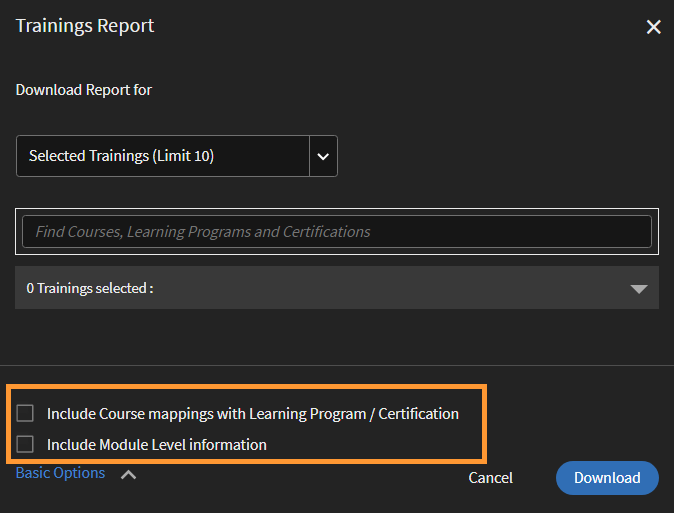
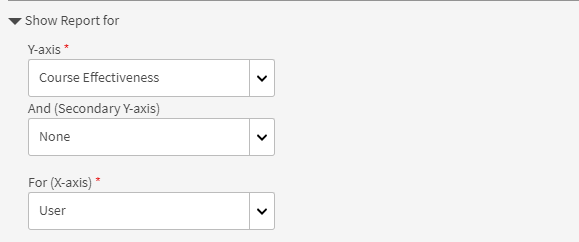
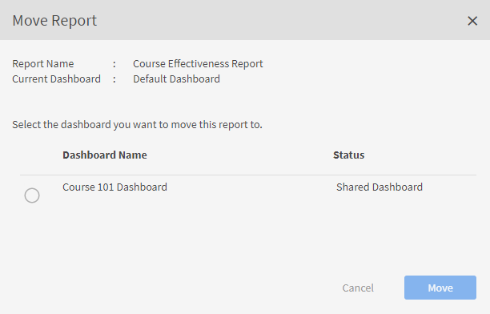

# Rapporter

Lär dig mer om de rapporter som är associerade med administratörsrollen i Learning Manager-programmet.

Med Adobe Learning Manager kan ni skapa olika rapporter för att spåra, övervaka och styra elevernas aktiviteter. Elevernas aktiviteter spåras och registreras automatiskt i databasen. Rapporter om chefer och administratörer genereras från databasen.

## Översikt {#overview}

Processen för generering av rapporter är likadan för både administratör och chef. Chefer kan visa rapporter som motsvarar sina underordnade medan administratören kan visa alla organisationsomfattande rapporter.

Rapporter sammanställs i en instrumentpanel. En rapport måste finnas i en instrumentpanel. A **[!UICONTROL Default Dashboard]** finns som standard på rapportsidan. Alla rapporter som du lägger till flyttas till den här standardinstrumentpanelen. Om du vill lägga till rapporter i enskilda instrumentpaneler använder du listrutepilen och väljer **[!UICONTROL Add Report]**. Mer information om hur du skapar instrumentpaneler finns i avsnittet Instrumentpaneler på den här sidan.

## Typer av rapporter {#typesofreports}

Adobe Learning Manager har stöd för fyra huvudtyper av rapporter, t.ex. slutförande, tidsåtgång, kompetens och effektivitet. Du kan använda följande rapporttyper för att generera rapporter med 300+ varianter:

* Statistik över kursleveranser för elever
* Rapporten om kursernas effektivitet
* Färdighetsbaserad rapport för elever
* Statistik över inskrivning av utbildningsprogram för elever
* Inlärningstid som eleverna ägnar åt
* Antal elever
* Slutförande av certifiering

## Instrumentpaneler för användaraktivitet {#useractivitydashboards}

Se en sammanfattning av all användaraktivitet på plattformen över tid. Konfigurera användargrupper och tillämpa filter.

Instrumentpanelen för användaraktivitet visar aktiviteten för användare på kontot. De tre rapporter som listas är:

* **Registrerade användare:** Den här rapporten ger information om antalet användare som är registrerade på ditt konto vecka för vecka. För konton med licensiering av månatliga aktiva enheter visar rapporten MAU-enheterna i stället.

* **Rapport om användarbesök:** Den här rapporten ger information om antalet användare som använder plattformen dagligen. Månadsrapport finns också tillgänglig.

* **Rapport om inlärningstid:** Den här rapporten ger information om den inlärningstid som spenderas på plattformen dagligen. Månadsrapport finns också tillgänglig.

### Registrerade användare {#registeredusers}

Learning Manager registrerar antalet användare som är registrerade i systemet varje vecka. Administratörer kan visa den här rapporten för att förstå det registrerade antalet användare på den veckodagen. Det registrerade antalet som har lagrats i en vecka ändras inte. Därför är det historiska registrerade antalet inte relaterat till den aktuella uppsättningen elever i systemet.

Den här rapporten ger information om antalet användare som är registrerade på ditt konto vecka för vecka.

För konton med licensiering av månatliga aktiva enheter visar rapporten MAU-enheterna i stället.

*Rapport över registrerade användare*

***För konton med månadsåtkomstenhet:***

**Rapport över månatliga aktiva användare**

Den här rapporten visar antalet elever som är aktiva i lärplattformen varje månad. Användaren anses vara aktiv för månaden om han/hon utför någon av de inlärningsåtgärder som nämns här. Det är på samma sätt som månatliga aktiva enheter räknas.

Det månatliga aktiva antalet när det har räknats och lagrats i en månad ändras inte. Därför är det historiska antalet som visas inte relaterat till den aktuella uppsättningen elever i systemet.

### Besök av användare {#uservisits}

Den här rapporten visar det totala antalet elever som har åtkomst till systemet under en dags- eller månadsperiod. Att surfa på lärplattformen utan att konsumera något lärande anses också som att &quot;få tillgång till&quot; lärplattformen. Detta hjälper administratören att förstå den totala uppsättningen användare som har åtkomst till systemet. Den första i månaden skapar Learning Manager ett register över det totala antalet användare som har åtkomst till plattformen under föregående månad. Den samlar också in användargruppsinformation för dessa användare.

Endast de användargrupper som konfigurerats av administratören registreras. Detta gör det möjligt för administratörerna att tillämpa filter på användargrupper även för historiska månadsdata. Observera att om konfigurationen av användargrupper ändras och Learning Manager inte har registrerat data för den här användargruppen under tidigare månader, kan Learning Manager inte visa data för dessa nyligen konfigurerade användargrupper för tidigare månader.

Den här rapporten innehåller användare som har åtkomst till plattformen med alla format som webb, mobilapp, headless anpassade lösningar och så vidare. I användningsdiagrammet för enhetsappar nämns specifikt endast de användare som har åtkomst till plattformen med hjälp av Learning Manager-enhetens app. Detta hjälper administratörer att identifiera användningen av mobilappen på deras konto.

*Rapport om användarbesök*

### Rapport över tillbringad inlärningstid {#learningtimespentreport}

Här kan du se ett linjediagram med dubbla axlar som visar den totala inlärningstiden för alla elever under en 12-månadersperiod. Den andra axeln representerar mediantiden som spenderas på lärande för en individ.

Den tid som spenderas för olika lärobjekt, till exempel utbildningsprogram och certifieringar, beräknas för följande:

* Kurs i egen takt med statiskt och interaktivt innehåll
* Aktivitetskurser med url.
* Helgsessioner med helgflaggan aktiverad.
* VC connect-session där närvaro markeras automatiskt.
* Den tid som spenderas på olika lärobjekt, till exempel utbildningsprogram och certifieringar
* xAPI-satser för en xAPI-aktivitetskurs.

Du kan exportera diagrammet som ett Excel-kalkylblad.

Det finns ett filter för att välja användargruppskonfiguration som hjälper dig att visa data med avseende på olika användargrupper.

Det valda datum- och användargruppsfiltret tillämpas på alla relevanta diagram i instrumentpanelen.

>[!NOTE]
>
>För **[!UICONTROL User Visits]** och **[!UICONTROL Learning Time Spent]** rapporter kommer standarddata (när ingen användargrupp har konfigurerats) att visas för hela kontot.

## Instrumentpanel för utbildningsinnehåll {#trainingcontentdashboard}

Instrumentpanelen för utbildningsinnehåll ger insikter om utbildningar som finns tillgängliga på plattformen. Du kan se populära utbildningar eller spåra alla tillgängliga utbildningar.

### Rapport om utbildningar {#trainingsreport}

Den här rapporten ger information om det totala antalet utbildningar som är tillgängliga på plattformen (i publicerat tillstånd) månad för månad. Det ger en indikation på antalet utbildningar som erbjuds över tid.

*Rapport om träning*

### Rapport om aktiva träningspass {#activetrainingsreport}

Den här rapporten ger information om de träningar som är aktiva under det valda tidsintervallet. Aktiva träningar är träningar som registreras, visas i spelaren eller slutförs inom den givna tiden.

För aktiva träningar kommer data för alla interna grupper för rotanvändare (med chefsroll) att vara tillgängliga för val när ingen användargruppskonfiguration är klar. Förutom rotanvändargrupperna kan du konfigurera ytterligare 10 användargrupper om det behövs.

*Rapport om aktiva träningspass*

>[!NOTE]
>
>Data visas inte som förväntat när **[!UICONTROL All Users]** och **[!UICONTROL 12 months]** filter väljs, men data visas när du väljer **[!UICONTROL All internal user group].**

<table>
 <tbody>
  <tr>
   <td>
    
<b>Hänvisning</b>
</td>
   <td>
    
<b>Metrisk</b>
</td>
   <td>
    
<b>Beskrivning</b>
</td>
  </tr>
  <tr>
   <td>
    
1
</td>
   <td>
    
Startkvot (%)
</td>
   <td>
    
Förhållandet mellan antalet elever som har påbörjat kursen och antalet inskrivningar.
</td>
  </tr>
  <tr>
   <td>
    
2
</td>
   <td>
    
Slutförandegrad (%)
</td>
   <td>
    
Förhållandet mellan det totala antalet användare som har slutfört kursen och det totala antalet användare som har påbörjat kursen. 
</td>
  </tr>
  <tr>
   <td>
    
3
</td>
   <td>
    
Feedback från elever
</td>
   <td>
    
Medelvärdet av alla L1-feedbacksvar som mottagits på en skala från 1 till 10, avrundat till närmaste heltal. 
</td>
  </tr>
  <tr>
   <td>
    
4
</td>
   <td>
    
Feedback från chef
</td>
   <td>
    
Medelvärdet av alla L3-feedbacksvar som mottagits på en skala från 1 till 5 avrundat till närmaste heltal 
</td>
  </tr>
 </tbody>
</table>

Träningsrapporten har ytterligare två kolumner:

1. Genomsnittligt stjärnbetyg för en kurs.
1. Antal elever som har bedömt kursen.
1. Inbäddad väg
1. Inbäddat väg-ID
1. Inbäddat kurs-ID

>[!NOTE]
>
>Startkvot, Slutförandekvot, Elevfeedback och Tränarfeedback påverkas inte av de filter som används. Filtren påverkar endast registrering, visningar och slutföranden.

>[!NOTE]
>
>För båda rapporterna (Utbildningsinnehåll, Användaraktivitet) kan du konfigurera maximalt 10 användargrupper. Det kan ta upp till 24 timmar innan bearbetningen har slutförts och de nyligen konfigurerade filtren blir tillgängliga.

## Instrumentpaneler för utbildningssammanfattning {#dashboards}

### Generera instrumentpanelsrapporter

>[!INFO]
>
>I den här utbildningen får du lära dig hur du genererar instrumentpanelsrapporter från databasen.    

Om du inte kan starta träningen skriver du till <almacademy@adobe.com>.

Se en sammanfattande rapport över alla läraktiviteter på plattformen. På den här sidan kan du se följande sammanfattande information för den valda rotanvändarens team och externa profiler. Tidsintervall kan också väljas:

* Utbildningssammanfattning i form av registreringar, visningar och slutföranden
* Toppkompetens
* Sammanfattning av efterlevnad

*Sammanfattande diagram*

Om det finns interna rotnivåhanterare kommer de att visas en efter en.

Alla externa profiler kommer att listas efter interna profiler (användare på intern rotnivå).

Om en extern profil har en chef kommer chefshierarkin att visas i **[!UICONTROL Showing Data For]** listrutan. Användaren kommer att listas i chefshierarkin på alla informationssidor (Utbildningssammanfattning, efterlevnad och kompetensstatus)

Om inte, kommer alla individuella användaruppgifter att visas i listan.

Om du vill se mer detaljerad information om registreringar för olika interna team klickar du på **[!UICONTROL Learning Summary Details]**.

*Information om inlärningssammanfattning*

När du klickar på en inskrivning kan du se vilka elever som ska användas för varje chef och vilka utbildningsobjekt som ska användas. Du kan också se information om framsteg och slutförande för varje elev.

*Elever som har tilldelats en chef*

Klicka på ett team och exportera dess rapport som en csv. En administratör kan exportera rapporten för någon i användargruppen eller enskilda användare genom att välja användargruppen eller den enskilda användaren och sedan exportera information från **[!UICONTROL Action]** listrutan.

Du kan också se en stapeldiagramvy över färdigheter som pågår och har uppnåtts. Du kan lägga till/ta bort färdigheter som du vill ska visas i diagrammet.

*Staplat stapeldiagram för färdighetsstatus*

### Instrumentpanel för efterlevnad

**Adobe Learning Manager** erbjuder en kontrollpanel för efterlevnad för alla administratörer och chefer. Administratörer kan skapa en instrumentpanel för efterlevnad och dela den med chefer. Chefer kommer att kunna se den nyligen delade instrumentpanelen i sin app och kan enkelt spåra efterlevnaden av sina teammedlemmar för en viss utbildning. Instrumentpanelen för efterlevnad gör det möjligt för administratörer att kategorisera anpassade efterlevnadskurser i specifika kategorier (till exempel försäljning, marknadsföring och juridik). Anpassade efterlevnadskategorier drivs av **[!UICONTROL Catalog Labels]**.

_Instrumentpanel för efterlevnad – administratörsvy_

Administratörer kan också kontrollera efterlevnadsstatusen för varje chefs team genom att välja **[!UICONTROL Go to Compliance dashboard]**. Administratörer kan dela en uppsättning utbildningskurser med chefer individuellt eller med en grupp. Detta hjälper chefer att enkelt spåra sina lagkamraters efterlevnad för den angivna utbildningen.

#### Arbetsflöde för administratör

##### Skapa anpassade efterlevnadsetiketter

En efterlevnadsetikett är en typ av katalogetikett som kategoriserar kurser/utbildningsvägar/certifieringar som en efterlevnadstyp.
Följ dessa steg om du vill skapa en anpassad efterlevnadsetikett:

1. I administratörsappen går du till **[!UICONTROL Settings]** > **[!UICONTROL General]**.
1. Välj **[!UICONTROL Custom Compliance type]** alternativ för att aktivera den anpassade efterlevnadsetiketten.

   
   _Aktivera anpassad efterlevnad_

   >[!NOTE]
   >
   >Den här nya katalogetiketten har introducerats för att kategorisera kurser, utbildningsvägar och certifieringar som en efterlevnadstyp. Om du vill aktivera alternativet **[!UICONTROL  Custom Compliance type]** måste du först aktivera alternativet **[!UICONTROL Show Catalog Label]** på samma sida.

1. Gå till **[!UICONTROL Settings]** > **[!UICONTROL Catalog Label]** och välj **[!UICONTROL Compliance type]**.
1. Skriv in värdena (t.ex. Legal, Sales) i **[!UICONTROL Value]** textrutan och välj **[!UICONTROL Add Value]**.

   
   _Lägga till värden för anpassad efterlevnad_

1. Välj **[!UICONTROL Save]**.

>[!NOTE]
>
>Författaren måste lägga till dessa efterlevnadsetiketter när han eller hon skapar/redigerar kurserna i sin app. Se [Lägga till efterlevnadsetiketter för en kurs/utbildningsväg/certifiering](/help/migrated/authors/feature-summary/courses.md#add-compliance-labels-to-courselearning-pathcertification).

##### Skapa och dela en instrumentpanel för efterlevnad

Följ dessa steg om du vill skapa och dela en instrumentpanel för efterlevnad:

1. Gå till **[!UICONTROL Reports]** > **[!UICONTROL Learning Summary]**.
1. I avsnittet **[!UICONTROL Compliance Dashboard]** väljer du **[!UICONTROL Shared with Managers]**.
1. Välj **[!UICONTROL Share dashboard]** och välj de skapade etiketterna från rullgardinsmenyn **[!UICONTROL Custom compliance]** .

   
   _Välj typ av efterlevnad_

1. Skriv och välj chefens namn i textrutan **[!UICONTROL Share with]** .
1. Välj **[!UICONTROL Share]** det här alternativet om du vill skicka instrumentpanelen till den valda chefen.

>[!NOTE]
>
>Om du delar den nya instrumentpanelen skrivs den befintliga instrumentpanelen över i den valda chefens app. Chefer kommer att kunna se den nyligen delade instrumentpanelen av administratörerna.

<!--In the final visualization, you can check the compliance status of learners, and take appropriate action.

Also, an Admin can view individual training data in the **[!UICONTROL Compliance Dashboard]**.

For instance, the Administrator has identified three trainings to track compliance. Learning Manager provides the compliance snapshot for all three trainings at once.

Now an Admin can click on any training and quickly view the compliance for the selected training.

*View Compliance dashboard*

You can also see the compliance status for each internal team.

Click the link **[!UICONTROL Compliance Status Details]** on the bottom of the visualization. 

You can see that, for a team, the number of learners in the team are violating or honoring the learning compliance.

*Compliance status of a team*

### Share training with managers

Learning Manager offers compliance dashboard to all Administrators and Managers. Managers find it very useful to track compliance of their team members for a particular training. At the same time, Administrators would like all Managers to add compliance trainings to their dashboard and track it. 

In Learning Manager, the **[!UICONTROL Share with Managers]** workflow allows Administrators to share training with Managers, so that they can get added to a manager's Compliance Dashboard. Thus, Managers do not need to take any action and can start tracking compliance immediately. 

An Administrator can share a set of training courses with managers individually or with a group. This sharing can help a manager easily track the compliance of his/her team for the specified training.

The Administrator can "push" a default list of compliance training to be viewed in the manager's compliance dashboard.

### Share training

1. In **[!UICONTROL Reports]** > **[!UICONTROL Learning Summary]**, scroll down, and click the tab **[!UICONTROL Share with Managers]**. 

   
   *Share training with managers*

1. To add training or multiple training, click **[!UICONTROL Share more]**.   

1. In the **[!UICONTROL Share with Managers]** dialog, choose the training(s) and the manager(s).

   
   *Select training to share with managers*

1. Click **[!UICONTROL Share]**.

The training is now shared with the specified manager.

### View training

In the list of shared training, click **[!UICONTROL View]**. You can view the training that is assigned to a manager or some managers.

### Withdraw training

1. To withdraw training from a manager, click **[!UICONTROL Withdraw]**.  

1. Click **[!UICONTROL Proceed]**. This withdraws previously shared training from the Manager's compliance dashboard.-->

## Anpassade rapporter

Administratörer kan generera specifika rapporter med hjälp av den anpassade mallen som **[!UICONTROL Reports]** finns i avsnittet.

### Exempel på rapporter {#samplereports}

Fliken **[!UICONTROL Sample Reports]** för att visa några indikativa rapporter som baseras på exempeldatapunkter. Utforska dessa rapporter för att få en uppfattning om olika typer av funktionsrika rapporter som du kan generera med hjälp av din kontodata.

### Rapporter på instrumentpanelen {#dashboardreports}

En instrumentpanel är en samling rapporter. Rapporter kan grupperas i en instrumentpanel enligt ditt val. Om du vill visa alla anslagstavlor som du har skapat klickar du på den här anslagstavlan. I listrutan **[!UICONTROL View Dashboard]** kan du välja standardtavlan eller en instrumentpanel som du har skapat.

### Excel-rapporter {#excelreports}

På **[!UICONTROL Excel Reports]** fliken kan du exportera rapporter i XLS-filformat.

Följande rapporttyper är tillgängliga för nedladdning.

* Rapporter om kursen
* Elevens betygsutdrag
* Notisrapport
* Arbetsstödsrapport
* Verifieringskedja för innehåll
* Verifieringskedja för användare
* Rapport om inloggning/åtkomst
* Spelifieringsutdrag
* Verifieringskedja för spelifiering

### Avskrifter från elever {#learnertranscripts}

Learner Transcripts in Excel-rapporterna visar kolumnerna Credits Required och Credits Earned i decimaltal.

### Rapporter om kursen {#coursereports}

Som administratör kan du ladda ner rapporter för kurser. Följ de här stegen:

1. Öppna **[!UICONTROL Reports]** > **[!UICONTROL Custom Reports]** > **[!UICONTROL Excel Reports]** > **[!UICONTROL Course Reports]**.
1. Dialogrutan **[!UICONTROL Course Report]** visas. Markera den kurs som du vill hämta rapporten för och klicka på **[!UICONTROL Show]**.

   
   *Rapporter om kurser*

1. Du omdirigeras till kurssidan. Du kan exportera quizpoäng per användare och per fråga baserat på varje registrering genom att välja den specifika registreringstypen.
1. Välj **[!UICONTROL Export Quiz Score]** det här alternativet om du vill exportera rapporten. En **[!UICONTROL Generating Report Request]** dialogruta visas. Klicka **[!UICONTROL OK]** för att bekräfta.

   
   *Generera rapportbegäran*

   >[!NOTE]
   >
   >Exporterad poängrapport för frågesport kommer att innehålla poänginformationen för varje försök om alternativet för flera försök är konfigurerat för modulen.

### Elevens betygsutdrag {#LearnerTranscripts-1}

Adobe Learning Manager gör det möjligt för administratörer i en organisation att generera avskrifter som är kopplade till elever. Learner Transcript-rapporten innehåller följande:

1. Transkribering av elever: Instrumentpanel för läraktivitet
1. Färdighet: Instrumentpanel för färdigheter
1. Efterlevnadstavla

Learner Transcripts in Excel-rapporterna visar kolumnerna Credits Required och Credits Earned i decimaltal.

Mer information om hur du genererar Learner Transcript-rapporter och mer information finns i [Learner Transcripts](learner-transcripts.md).

### Meddelanden Rapporter {#announcementsreports}

Som administratör kan du skapa en rapport över alla anslag som du skickar. Rapporten innehåller uppgifter om:

* Typ av anslag
* Namn på meddelande
* Datum för tillkännagivande
* Status för tillkännagivandet
* Elevens namn

Om du vill ladda ned en rapport följer du något av följande steg:

1. Öppna **[!UICONTROL Reports]** > **[!UICONTROL Custom Reports]** > **[!UICONTROL Excel Reports]** > **[!UICONTROL Announcements Report]**. Dialogrutan **[!UICONTROL Generating Report Request]** öppnas. Klicka på OK.
1. [!UICONTROL **Meddelanden**] > [!UICONTROL **åtgärder**] > [!UICONTROL **exportrapporten**].

   
   *Rapport om meddelanden*

1. Du kan ta ut en rapport för ett specifikt meddelande genom att klicka **[!UICONTROL Export Report]** under inställningsikonen.

   
   *Rapportera för specifika anslag*

### Arbetsstödsrapport {#jobaidsreport}

Jobbhjälpmedel är utbildningsinnehåll som en elev kan komma åt utan att behöva registrera sig för något specifikt inlärningsobjekt som en kurs eller ett utbildningsprogram. Administratörer kan extrahera och ladda ner Job Aids-rapporten.

Den extraherade rapporten innehåller information om följande:

* Namn
* Typ av jobbstöd
* Tillståndet för sysselsättningsstöd (offentliggjort eller återkallat)
* Datum för inskrivning
* Datum för färdigställande
* Datum för nedladdning
* Elevens namn
* Chefens namn
* Skapad av

Om du vill ladda ned en rapport gör du något av följande:

* Öppna  **[!UICONTROL Reports]** > **[!UICONTROL Custom Reports]** > **[!UICONTROL Excel Reports]** > **[!UICONTROL Job Aid Reports]**. Dialogrutan **[!UICONTROL Generating Report Request]** visas. Klicka på **[!UICONTROL Ok]**.
* Öppna **[!UICONTROL Job Aid]** > **[!UICONTROL Actions]** > **[!UICONTROL Export Report]**.

*Rapport om jobbhjälpmedel*

* Du kan också ta ut en rapport för ett specifikt jobbstöd genom att klicka **[!UICONTROL Export Report]** under inställningsikonen.

*Rapport för specifikt jobbstöd*

### Arbetsstödsrapport

När du har valt **[!UICONTROL Job Aids Report]** i listan visas två alternativ:

*Ladda ner Job Aids Användarregistreringsrapport*

**Alla jobbhjälpmedel**: Om antalet jobbhjälpmedel på kontot är färre än 10 miljoner, kommer den genererade rapporten att innehålla inskrivningsinformation för alla jobbhjälpmedel. Detta kommer att vara standardvalet. Om antalet rader överstiger 10 miljoner visas ett fel och du måste välja de jobbhjälpmedel som krävs manuellt.

**Valda jobbhjälpmedel**: Om du väljer det här alternativet kan du ange de jobbhjälpmedel som du vill generera rapporten för. Du kan välja högst 10 jobbhjälpmedel. Adobe Learning Manager kontrollerar om antalet jobbhjälpmedel överstiger 10 miljoner.

*Välj ett jobb Hjälp*

**Rapport om jobbhjälpmedel**

Om du väljer det här alternativet laddas information om alla jobbhjälpmedel som finns i systemet tillsammans med deras metadata och utbildning ned.

Den nedladdade rapporten består av följande fält:

* Arbetsstödsnamn
* Språk
* ID
* Typ
* Varaktighet (minuter)
* Status
* Datum för publicering (tidszonen UTC)
* Skapad per namn
* Skapad per mejl
* Skapat av unikt användar-ID
* Katalog(er)
* Utbildningsväg(ar)
* Kurs(er)
* Tagg(ar)
* Kompetens(er)

**Rapport om användarregistrering för jobbhjälpmedel**

Registreringsrapporten innehåller information om användarregistrering och annan information.

Den nedladdade rapporten består av följande fält:

* Arbetsstödsnamn
* Typ
* Status
* Datum för registrering (UTC-tidszon)
* Datum slutfört (UTC-tidszon)
* Nedladdningsdatum (UTC-tidszon)
* Elevnamn
* E-post
* Unikt användar-ID
* Chefens namn
* Mejladress till chef
* Unikt användar-ID för chef
* Tilldelad efter namn
* Tilldelad via e-post
* Tilldelad av användarens unika ID
* Skapad av namn
* Skapad av e-post
* Skapad av användarens unika ID
* Jobb kod
* Nytt fält
* Profil

### Rapporter om granskningsspår för innehåll {#contentaudittrailreports}

Använd rapportgeneratorn **[!UICONTROL Content Audit Trail]** för att generera en rapport över alla ändringar och redigeringar som gjorts i en kurs under dess livstid i systemet. Den genererade rapporten har följande information hämtad.

* Objekt-id
* Objektets namn
* Typ av objekt
* Typ av ändring
* Beskrivning
* Refererat objekt-ID
* Namn på refererat objekt
* Ändrad av användarnamn
* Ändrad av användar-ID
* Ändrat datum (UTC-tidszon)

I kolumnen **Ändringstyp** får du följande information:

| Typ av ändring | Beskrivning |
| --- | --- |
| Skapa | Kurs skapad |
| Certifiering Lägg till | Certifiering tillagd i katalogen |
| Certifiering Ta bort | Certifieringen har tagits bort från katalogen |
| Innehåll Lägg till | Innehåll som lagts till i modulen |
| Lägg till kurs | Kurs har lagts till i Utbildningsväg |
| Kurs Ta bort | Kursen har tagits bort från Utbildningsväg |
| Lägg till anpassad etikett | Anpassad etikett har lagts till i katalogen |
| Ta bort anpassad etikett | Anpassad etikett har tagits bort från katalogen |
| Ta bort | Katalogen har tagits bort |
| Jobbstöd Lägg till | Jobbstöd har lagts till i katalogen |
| Ta bort jobbstöd | Jobbhjälp har tagits bort från katalogen |
| Lägg till utbildningsväg | Utbildningsväg har lagts till i katalogen |
| Utbildningsväg Ta bort | Utbildningsväg har tagits bort från katalogen |
| Modul Innehåll Lägg till | Modul tillagd i kurs (avsnittet Innehåll) |
| Modulinnehåll Ta bort | Modulen har tagits bort från kursen (avsnittet Innehåll) |
| Publicerat | Kurs eller utbildningsväg publicerad och tillagd i standardkatalogen |
| Publiceras | Kursen återpublicerad |
| Lägg till resurs | Resurs tillagd i kurs |
| Ta bort resurs | Resursen har tagits bort från kursen |
| Utfasad | Kursen är pensionerad |
| Lägg till delad katalog | Katalog som delas med katalog |
| Ta bort delad katalog | Katalogdelning har tagits bort från katalogen |
| Uppdatering av delad katalog | Katalogdelningstillstånd : aktiv |
| Uppdatera | Kurs eller utbildningsväg har uppdaterats |
| Lägg till användargrupp | Användargrupp har lagts till i katalogen |
| Ta bort användargrupp | Användargrupp har tagits bort från katalogen |

Information om metadata hämtas inte i den genererade rapporten.

Följ dessa steg för att generera en granskningsrapport för kursspåret.

1. Välj **[!UICONTROL Report]** > **[!UICONTROL Excel reports]** > **[!UICONTROL Course Audit Trail]**. Dialogrutan **[!UICONTROL Content Audit Trail]** visas.

   
   *Verifieringskedja för kurser*

1. Välj den kurs, det utbildningsprogram och den certifiering som du vill ladda ner rapporten för. Om inget anges laddas alla rapporter ned som standard.
1. Välj ett datumintervall för rapporten och klicka på **[!UICONTROL Generate]**.
1. Rapporten genereras och du får ett meddelande om att innehållsgranskningsrapporten är klar. Du kan ladda ned rapporten.

### Granskningsloggrapporter för användare {#useraudittrailreports}

Verifieringskedja för användare registrerar livscykeln för användare, användargrupper och självregistreringsprofiler. Tillägg av användare, borttagning, ändring i Manager fångas alla. Skapande och radering av självregistreringsprofiler registreras. Du kan också pausa och återuppta självregistreringen.

Du kan lägga till, aktivera, inaktivera, pausa eller återuppta för externa profiler medan du kan lägga till, ta bort, pausa eller återuppta för självregistrering. CSV-uppladdningar registreras också.

1. Välj  **[!UICONTROL Report > Excel report > User Trail]**. Dialogrutan Spår för användargranskning visas.
1. Dialogrutan Spår för användargranskning visas. Välj datumintervall på popup-menyn. Du kan antingen välja att generera rapport för den senaste veckan, den senaste månaden eller välja anpassat datum.

   
   *Verifieringskedja för användare*

1. Klicka **[!UICONTROL Generate]** för att generera rapporten.

Det finns två filter i dialogrutan **[!UICONTROL User Audit Trail Report]** .

**Filter för datumilska:** Välj det datumintervall som du vill generera rapporten för. Det finns tre alternativ:

* Senaste veckan
* Senaste en månad
* Anpassat datum

Välj Elevfilter: Sök efter en användare eller en användargrupp.

Den exporterade rapporten kommer att innehålla data om de användare som uppfyller båda de angivna sökkriterierna.

*Verifieringskedja för användare*

>[!NOTE]
>
>När en färdighet tilldelas eller tas bort kan färdigheten spåras för användargranskningsrapporten för både tilldelad eller borttagen.

### Konfigurationsrapport för tillägg

Den här rapporten innehåller information om konfigurationsdetaljerna för alla tillagda ANE-tillägg, inklusive deras aktiveringstillstånd. Läs mer om hur du laddar ned tilläggsrapport i Ladda [ned tilläggsrapport](native-extensibility.md#download-extension-report).

### Aktivitetsrapport för xAPI

Den här rapporten innehåller data för alla xAPI-satser som registrerats och genererats under xAPI-aktivitetsmoduler.

Följ dessa steg för att ladda ned den här rapporten:

1. Välj  **[!UICONTROL Report > Excel report > xAPI Activity Report]**. Dialogrutan xAPI-aktivitetsrapport visas.
1. Välj datumintervall på popup-menyn. Du kan antingen välja att generera rapport för den senaste veckan, den senaste månaden eller välja anpassat datum.
1. Välj elever och aktivitet från rullgardinsmenyn.
1. Välj **[!UICONTROL Generate]** det här alternativet om du vill generera rapporten.

### Rapporter om spelifiering {#gamification}

Administratörer kan ladda ner gamification-transkriptioner i CSV-format. Du kan antingen ladda ner rapporten för enskilda användare eller användargrupper. Användarnamn, användarens e-postadress, användarens UUID, totalt antal användarpoäng, uppdelning av insamlade poäng, namn på grupper som användaren spelar i, namn på chef och aktiva fältvärden hämtas i rapporten. Administratörer kan använda den här rapporten för att utvärdera och förstå användarrankningar på organisationsnivå eller för en viss grupp.

1. Välj Rapport > Excel-rapport > Gamification-rapport.

   
   *Rapport om spelifiering*

1. Dialogrutan Gamification-transkriptioner visas. Välj elever med deras namn, profil, användargrupper, e-post-ID eller UUID.

   
   *Dialogrutan för avskrifter av spelifiering*

1. Klicka  **[!UICONTROL Generate]** för att generera rapporten.

   När du har genererat rapporten för en elev måste du kunna exportera aktuell och uppnådd information för alla användare (interna, externa eller borttagna) på kontot. Du kan också kontrollera datumen för de nivåer som uppnåtts av en elev:

   * Brons har uppnåtts datum
   * Silver har uppnåtts datum
   * Guld har uppnåtts datum
   * Platina har uppnåtts datum

   Dessa kolumner innehåller de datum då nivån uppnåddes vid första gången. Kolumnen **[!UICONTROL Current Level]** visar den aktuella nivån för eleven.

   När administratören återställer spelifieringen återställs alla poäng för eleven i enlighet med detta.

### Rapporten Granskningsspår för spelifiering {#gamification-audit-trail}

Den här rapporten innehåller historiken och orsakerna till elevernas spelifieringspoäng som tjänats in för varje regel.

### Ladda ner rapporten

1. Välj webbadressen till granskningsspåret för spelifiering.
1. **I popup-fönstret Granskningsspår** för spelifiering väljer du datumintervallet.
1. Välj **Generera**.

Rapporten laddas ned som en CSV-fil. Filen innehåller följande kolumner:

* Namn
* E-post/UUID,
* Status
* Åtgärd
* Poäng
* Balansera poäng
* Regel/ Uppgift
* Regel/uppgift,
* Information om regel/uppgift
* Typ
* Namn
* InstansnamnDatum uppnått (UTC-tidszon)
* Starttid för regel/uppgift
* Sluttid för regel/uppgift

### Rapport om inskrivning och avregistrering {#enrollmentandunenrollmentreport}

Administratörer och chefer kan ta fram en rapport över de elever som har skrivits in och avregistrerats. Som administratör kan du se alla elever, administratörer eller chefer som har skrivits in eller avregistrerats från en instans av en kurs, ett utbildningsprogram eller en certifiering och exportera rapporten. Medan du som chef bara kan hämta en rapport om dina teammedlemmar. Som chef kan du inte se de borttagna eleverna eller ditt eget namn i manager-applikationen som en inskriven eller en oregistrerad elev.

Följ dessa steg för att ladda ned en rapport: Öppna >  **[!UICONTROL Course/ Learning program/ Certification]** **[!UICONTROL Learners]** > **[!UICONTROL Action]** > **[!UICONTROL Export report]**.

*Rapport om avregistrering*

### Rapport om återkoppling {#feedback-report}

Som administratör kan du nu hämta både elevåterkoppling (L1) och chefsåterkoppling (L3) för utvalda utbildningar under en viss period.

Du kan exportera data från användargränssnittet eller via PowerBI-anslutningsappen för mer djupgående analys.

L1- och L3-feedbackrapporter ger ett alternativ för att ladda ner en konsoliderad feedbackrapport för L1- och L3-svaren för utvalda utbildningar för ett **ettårsintervall** eller för upp till 10 utvalda utbildningar för valfritt datumintervall.

Logga in som administratör, klicka på **[!UICONTROL Reports]** > **[!UICONTROL Custom Reports]** och klicka på i listan över rapporter .**[!UICONTROL Feedback Report]**

*Ladda ned feedbackrapport*

Om du klickar på ladda ned när du har valt filtren får du ett meddelande om att ladda ned rapporten i CSV-format.

Den nedladdade rapporten kommer att innehålla information som utbildningsnamn och -typ, instansnamn, elevnamn och e-postadress, typ av feedback: L1 eller L3, datum för den feedback som skickats för nya data.

För befintliga data före implementeringen av den här funktionen kommer LO:s slutförandedatum att visas, LO:s slutförandedatum, L1 Feedback-fråga, Faktisk text i egen takt och klassrumstext i olika kolumner, L1-feedback respektive svar, Chefens namn och e-post, L3-feedbackvärde och inlämnat datum, Aktiva fält.

Du kan också exportera data från användargränssnittet eller till Power BI, som stöder alla utbildningar för alla datumintervall för mer djupgående analys

### Rapport om utbildningar {#training-report}

Learning Manager stöder utbildningsrapport som gör det möjligt för administratörer att ladda ner utbildningsinformation och dess tillhörande metadata som författare, publiceringsdatum, färdigheter, katalogetiketter etc.

I Admin-appen klickar du på **[!UICONTROL Reports]** > **[!UICONTROL Custom Reports]** > **[!UICONTROL Excel Reports]** > **[!UICONTROL Trainings Report]**.

Du kan ladda ned rapporter för följande:

* Valda utbildningar (Gräns 10) – Väljer en eller flera utbildningar (upp till 10) från valfri katalog
* Utbildningar i de valda katalogerna (gräns 5) - (katalogval kommer att vara tillgängligt upp till fem kataloger)
* Alla utbildningar - (alla utbildningar på kontot)

*Ladda ner träningsrapport*

I avsnittet Avancerade alternativ är följande alternativ tillgängliga:

* Inkludera kursmappningar med utbildningsprogram/certifiering
* Inkludera information på modulnivå

När du har valt filtren och klickat på Ladda ned får du ett meddelande om att ladda ned rapporten i CSV-format.

Rapporten kommer att ha följande fält:

*Katalognamn, Utbildningstyp, Utbildnings-ID, Unikt utbildnings-ID, Utbildningsnamn, Delutbildningar, Moduler, Utbildnings- eller Modulens varaktighet, Format, Utbildningsstatus, Färdigheter, Författare, Senaste publiceringsdatum, Senast slutförda datum, Antal instruktörer Registrering, Antal påbörjade, Antal slutföranden, Genomsnittlig L1-poäng, Genomsnittlig L2-poäng, Genomsnittlig L3-poäng, L1-svar mottagna, L2-svar mottagna, L3-svar mottagna, katalogetiketter och taggar.*

*Ytterligare alternativ*

### Sammanfattande rapport för session {#session-summary-report}

Sessionssammanfattningsrapporten innehåller alla sessioner som planerats för en elev inom ett visst datum.

Detta gör det möjligt för administratören att exportera all information om virtuella sessioner och klassrumssessioner som faller under det angivna datumintervallet. Administratören kan också exportera sessionsrapporten med avseende på specifika utbildningar eller instruktörer.

Detta kommer också att hjälpa administratören att förstå de sessioner som planeras på månadsbasis och identifiera instruktörernas schema och redan levererade sessioner.

Som administratör klickar du på **[!UICONTROL Custom Reports]** > **[!UICONTROL Session Summary Report]**.

I dialogrutan som följer väljer du datumintervall och antingen utbildning eller instruktör för en sammanfattning.

*Sammanfattande rapport för session*

Den nedladdade CSV-filen innehåller följande fält:

* Startdatum och starttid
* Slutdatum och sluttid

* Modulnamn
* Sessionens varaktighet (i minuter)
* Antal platser
* Plats
* Instansnamn
* Kursnamn
* Kurs-ID
* Instruktörens namn
* Mejladress till instruktör
* Antal registreringar
* Sessionstyp
* Väntlistegräns
* Antal väntelistor
* E-postadresser till användare på väntelista
* Information om platsen
* Platsens region

### Rapport om instruktörsanvändning

Den här rapporten visar den tid (i minuter) som en instruktör dagligen ägnar åt att undervisa i tilldelade sessioner. Rapporten kan laddas ner under en period av tre månader från det valda startdatumet.

Ladda ned rapporten genom att klicka på **[!UICONTROL Reports]** > **[!UICONTROL Custom Reports]** > **[!UICONTROL Instructor Utilization Report]**.

Välj en instruktör eller flera lärare och datumintervallet.

*instruktörsanvändning Ladda ner rapport om instruktörsanvändning*

Den nedladdade rapporten innehåller följande fält:

* Instruktörens namn
* Instruktörs-ID
* Kompetensnivå
* Datum som kolumner. Om instruktören används på ett datum listas antalet sessioner. Om instruktören inte används på en dag visar värdet noll.

Rapporten innehåller poster för tre månader från den valda månaden.

Om du vill hämta poster för alla lärare lämnar du fältet Instruktör tomt.

Dessutom kan en anpassad administratör med behörighet att generera rapporter hämta den här rapporten.

### Rapport om granskningsspår för användare

Den här rapporten samlar in information om de elever som bytte instans, &quot;från instans&quot; till &quot;till instans&quot;, växlade efter tid, datum osv.

Välj elever eller en användargrupp.

Ladda ned rapporten genom att klicka på **[!UICONTROL Reports]** > **[!UICONTROL Custom Reports]** > **[!UICONTROL User Audit Trail Report]**.

*Ladda ned rapport om användargranskningsspår*

### Rapport över utbildningsplan

Den här rapporten innehåller information om alla utbildningsplaner i ett konto, till exempel relaterade användargrupper, status och utlösarinformation.

Rapporten innehåller följande:

* Namn på utbildningsplanen
* Typ (inträffar när)
* Utbildning (avslutad)
* Färdighet (uppnådd)
* Datum (på datum)
* Åtgärd
* Status, skapad av
* Skapad den
* Datum för senaste ändring
* Användargrupp (gäller för)
* Användargrupp (lägg till)
* Registrera dig efter
* Typer av utbildningselement
* Lärande(n)
* Instans(er) av utbildningselement
* Lärande element
* Slutförandedatum
* Påminnelse om utbildningselement
* Omfång – katalog
* Omfång – användargrupp

## E-post-prenumerationer {#emailsubscriptions}

Du kan få dina favoritrapporter i ett e-postmeddelande genom att prenumerera på dem.

### Konfigurera e-postprenumerationer

>[!INFO]
>
>I den här utbildningen får du lära dig hur du ställer in e-postprenumerationer för instrumentpanelsrapporter.    

Om du inte kan starta träningen skriver du till <almacademy@adobe.com>.

På **[!UICONTROL Reports]** sidan klickar du på fliken  **[!UICONTROL Subscription]** . Prenumerationssidan för rapporter visas.

Om du vill välja rapportnamnet i listrutan börjar du skriva rapportnamnet i fältet Rapporter. Välj hur ofta du vill skicka e-post i listrutan. Du kan lägga till ämnet för e-postmeddelandet och ange ett alternativt e-post-ID.

Du kan redigera och ta bort prenumerationer.

## Historiska rapporter

Historiska rapporter i Adobe Learning Manager (ALM) refererar till de rapporter som samlar in historiska data och aktiviteter i lärplattformen. Dessa rapporter ger insikter i tidigare elevaktiviteter, utbildningsinnehåll, användargruppsprestationer och annan relevant data. De historiska rapporterna gör det möjligt för administratörer att spåra, övervaka och analysera framstegen och effektiviteten i utbildningsinitiativ över tid.

### Rapporter om kursåtkomst

Kursåtkomstrapporterna ger information om varje kurss återbesök.

Följ dessa steg för att ladda ned den här rapporten:

1. Gå till **[!UICONTROL Reports]** > **[!UICONTROL Custom Reports]** > **[!UICONTROL Historic Reports]**.
1. Välj **[!UICONTROL Course Access Report]**. Dialogrutan Generera rapportbegäran öppnas.
1. Välj år och kvartal från rullgardinsmenyn.
1. Välj **[!UICONTROL Generate]**.

### Inloggnings-/åtkomstrapporter

Inloggnings-/åtkomstrapporterna ger information om användarinloggningar och åtkomst. Du kan generera en rapport som innehåller tre månaders data i taget.

Följ dessa steg för att ladda ned den här rapporten:

1. Gå till **[!UICONTROL Reports]** > **[!UICONTROL Custom Reports]** > **[!UICONTROL Historic Reports]**.
1. Välj **[!UICONTROL Login/Access report]**. Dialogrutan Generera rapportbegäran öppnas.
1. Välj år och kvartal från rullgardinsmenyn.
1. Välj **[!UICONTROL Generate]**.

## Skapa en instrumentpanel {#createadashboard}

1. Om du vill börja skapa egna anslagstavlor klickar du på Lägg till instrumentpanel till höger på sidan.

   
   *Lägga till instrumentpaneler*

1. Ange namn och beskrivning av instrumentpanelen.
1. Om du vill dela instrumentpanelen med en chef väljer du dem i **[!UICONTROL Share With]** fältet. Du kan använda vilket normalt urvalskriterium som helst för den här operationen.
1. Klicka på **[!UICONTROL Save].**

Du kan se den nyligen skapade anslagstavlan på fliken **[!UICONTROL Dashboard Reports]** .

Om du vill lägga till rapporter på din tavla klickar du på rullgardinsmenyn längst upp till höger i din tavla och klickar på **[!UICONTROL Add Report]**. Rapporten som du skapar på det här sättet är kopplad till instrumentpanelen.

>[!NOTE]
>
>Rapporterna som du skapar genom att klicka på Lägg till i det övre högra hörnet på sidan Rapporter läggs till i standardinstrumentpanelen.

## Delade instrumentpaneler {#shareddashboards}

Delade tavlor är en samling rapporter som har delats med dig av andra användare inom din organisation. Alla rapporter som du lägger till på en delad tavla delas automatiskt med andra användare som har åtkomst till den tavlan.

Du kan dela anslagstavlan på två sätt:

* Genom att ange användare i **[!UICONTROL Share With]** fält som instrumentpanelen delas med.
* Välj Redigera anslagstavla i listrutan och ange användarinformation för att dela instrumentpanelen.

>[!NOTE]
>
>En chef kan bara visa sina teammedlemmars rapporter från en delad instrumentpanel.

## Nedladdningar {#downloads}

Det exporterade bladet med instrumentpanelsrapporter ger detaljerad information i stället för rapportsammanfattning. Den nedladdade rapporten följer formatet för en Learner Transcript.

## Skapa rapporter {#report}

1. Klicka på Rapporter i den vänstra rutan. Sidan Rapportsammanfattning visas.

   >[!NOTE]
   >
   >Som standard visas minst tre exempelrapporter på fliken exempeltavla. Du kan bara visa exempelrapporterna för att få en uppfattning om hur du kan skapa och anpassa dem.

1. I det övre högra hörnet på sidan klickar du på **[!UICONTROL Add]**.
1. **[!UICONTROL Add Report]** I dialogrutan i listrutan Typ kan du välja antingen en av de fördefinierade rapporterna eller välja **[!UICONTROL Custom]**. Om du väljer en fördefinierad rapport kan du se att formuläret är förifyllt. Du kan göra ytterligare ändringar i några av fälten och klicka på **[!UICONTROL Save]**. Då läggs rapporten till på standardinstrumentpanelen.

   
   *Skapa rapport*

   I **[!UICONTROL Report Type]** kan du välja en fördefinierad uppsättning rapporter eller välja anpassade värden. Du kan visa följande rapporter som en del av en fördefinierad uppsättning rapporter:

   * Tilldelade och uppnådda färdigheter
   * Kurs registrerad och avslutad
   * Kursernas effektivitet
   * Utbildningsprogram inskrivna och slutförda
   * Inlärningstid som spenderas per kurs
   * Inlärningstid som spenderas per kvartal
   * Slutförande av certifiering

1. Välj den **[!UICONTROL Y-axis]** för din rapport från rullgardinsalternativen. För vissa av de valda kriterierna kan du välja ett eller flera tillstånd bland alternativen för lägen. För ett huvudkriterium för kursinskrivningsstatistik kan tillstånden till exempel vara slutförda, ofullständiga och inskrivna. Primära intervalldata representeras i form av stapeldiagram i rapporten.

   
   *Axlar för rapporter*

1. Välj det sekundära **[!UICONTROL Y-axis]** kriteriet/intervallet för rapporten i listrutan. Om du till exempel vill registrera ett utbildningsprogram väljer du ett eller flera tillstånd i listrutan Tillstånd. Data för sekundärt intervall representeras i form av linjediagram.
1. Välj lämpliga kriterier för X**-axeln** för din rapport från de nedrullningsbara alternativen. Om x-axeln väljs som datum finns det ett alternativ för att gruppera x-axelns kriterium efter dag, månad, kvartal och år.
1. I avsnittet Tidsintervall väljer du lämpligt alternativ i listrutan. De tillgängliga alternativen är:

   * Senaste månaden
   * Kvartal
   * År
   * QTD (senaste 90 dagarna)
   * Hittills i år (senaste 365 dagarna)
   * Datumintervall. Ange värden i fälten och **[!UICONTROL From]** **[!UICONTROL To]** date.

   

1. **Avsnittet Filter**

   Filter visas i dialogrutan Lägg till rapport längst ner baserat på vilka typer av rapporter du har valt. Några av de framträdande filtren nämns nedan.

   * **Chef:** Du kan välja vilken som helst av cheferna baserat på hierarki. För vissa chefer kan det finnas underordnade chefer och flera anställda som rapporterar till varje underordnad chef.
   * **Profil:** Välj beteckningen på din anställd. Det skulle hjälpa till att visa rapporter om anställda baserat på deras profil/beteckning. Till exempel datavetare, ingenjör.
   * **Användargrupp:** Välj den användargrupp som du vill filtrera rapporterna utifrån. Learning Manager hämtar de användargrupper som definierats för ditt konto från funktionen Användare.
   * **Innehåll:** Du kan filtrera din rapport baserat på vilken kurs som helst genom att välja dem i rullgardinsmenyn.

   Expandera det här avsnittet och välj de filter som krävs.

   
   *Välj filter*

1. Klicka **[!UICONTROL Save]** här om du vill slutföra skapandet av en rapport.

   
   *Exempel på rapport*

## Redigera en rapport {#editareport}

Klicka på listrutepilen i rapporten och välj alternativet **[!UICONTROL Edit Report]**.

*Redigera en rapport*

Gör de ändringar som krävs i rapporten. Spara ändringarna genom att klicka på **[!UICONTROL Save]**.

## Flytta en rapport till en instrumentpanel {#moveareporttoadashboard}

Välj det här alternativet om du vill flytta den aktuella rapporten till en befintlig instrumentpanel. Om du vill flytta rapporten klickar du på alternativet **[!UICONTROL Move to Dashboard]**.

*Flytta en rapport till en instrumentpanel*

Välj den instrumentpanel som du vill att rapporten ska flyttas till och klicka på **[!UICONTROL Move]**.

## Skapa en kopia av en rapport {#createacopyofareport}

Om du vill skapa en kopia av rapporten väljer du alternativet **[!UICONTROL Create a Copy]**.

*Skapa en kopia av en rapport*

Välj den instrumentpanel som du vill kopiera rapporten till. Börja kopiera genom att klicka på **[!UICONTROL Copy]**.

## Ta bort en rapport {#deleteareport}

Om du vill ta bort en rapport väljer du alternativet **[!UICONTROL Delete Report]**. När du har tagit bort rapporten kan du inte återställa den. Processen är oåterkallelig. Var försiktig när du tar bort en rapport.

*Ta bort en rapport*

## Ladda ned en rapport {#downloadareport}

Om du vill ladda ned rapporten väljer du alternativet **[!UICONTROL Download Report]**.

*Ladda ned en rapport*

## Ändra storlek på en rapport {#resizeareport}

Du kan ändra storlek på dina rapporter i storlekarna 1×1 (medel) och 1×2 (stor). Detta ger dig en bättre fastighet för att se dina rapporter. Du kan också enkelt panorera och zooma dessa rapporter.

## Filter {#filters}

Filter visas i **[!UICONTROL Add]** rapportdialogrutan längst ner baserat på vilka typer av rapporter du har valt. Några av de framträdande filtren nämns nedan.

**Chef** Du kan välja vilken som helst av cheferna baserat på hierarki. För vissa chefer kan det finnas underordnade chefer och flera anställda som rapporterar till varje underordnad chef.

**Profil** Välj beteckning på din anställde. Det skulle hjälpa till att visa rapporter om anställda baserat på deras profil/beteckning. Till exempel datavetare, ingenjör.

**Användargrupp** Välj den användargrupp som du vill filtrera rapporterna utifrån. Learning Manager hämtar de användargrupper som definierats för ditt konto från funktionen Användare.

**Kurs** Du kan filtrera din rapport baserat på vilken kurs som helst genom att välja dem i listrutan.

*Filtrera en rapport*

Ovanför teckenförklaringen för diagrammet kan du visa en zoomruta. Flytta markören över den, klicka och dra tvärfältet över någon del av zoomrutans diagramområde för att zooma in.

Du kan visa de sekundära y-axelns värden i form av en linje över diagramstaplarna. I exemplet ovan kan du till exempel se värdena för Effektivitet i en grå linje över diagrammet.

## Rapporter för användargrupper {#user-group-reporting}

Spåra hur användargrupper som avdelningar, externa partner och roller presterar i jämförelse med andra användargrupper eller mot andra läroplansmål.

### Användargrupper {#usergroups}

Om du vill generera rapporter baserat på användargrupper väljer du **[!UICONTROL User Group]** på x-axeln i listan med nedrullningsbara alternativ som visas i skärmdumpen nedan.

*Rapporter för användargrupper*

Om du vill välja en användargrupp skriver du namnet på gruppen. Du kan se de föreslagna grupperna som visas enligt den sträng du anger. När du ser en lista med grupper väljer du den användargrupp som krävs.

Du kan också välja flera användargrupper med hjälp av sökning i förväg.

När du har sparat och genererat den här rapporten, om du har valt flera användargrupper, genereras rapporten med alla användargrupper representerade i stapeldiagrammet bredvid varandra på x-axeln.

Med den här användargruppsrapporten kan du jämföra en avdelning/avdelning/roll med en annan för att utvärdera deras inlärningsprestationer.

### Anpassade användargrupper/användarattribut {#customusergroupsuserattributes}

Du kan även skapa anpassade användargrupper med hjälp av funktionen Lägg till användare/användargrupper i Learning Manager. När du har skapat användargrupperna kan du generera rapporter för de anpassade användargrupperna med hjälp av en lista med attribut som plats, gren.

På x-axeln väljer du alternativet för användarattribut och väljer attributet i **** listrutan bredvid det. Om du vill skapa en anpassad användargruppsrapport baserat på dessa attribut måste du också välja lämplig användargrupp i filtret.

## Visa rapporter {#viewingreports}

På sidan Rapporter kan du visa alla rapporter. Du kan minimera varje rapport genom att klicka på minusikonen (-) i det övre högra hörnet av varje rapport. Klicka på ikonen (+) för att visa rapporten igen.

## Snabbvy med olika datum {#quickviewwithdifferentdates}

Du kan ändra datumintervallet/värdet för en rapport och snabbt visa för ett annat datum utan att ändra och spara rapporten. Klicka på redigeringsikonen (som visas med en pil i ögonblicksbilden nedan) bredvid datumintervallet, till exempel QTD, senaste året. Bekräfta ändringen genom att välja det nya värdet från popupmenyn och klicka på bockmarkeringen. Du kan avbryta ändringen genom att klicka på X-märket.

>[!NOTE]
>
>De datumvärden som du använder för att visa rapporten är tillfälliga. Den här vyn av rapporten laddas inte ned när du väljer nedladdningsalternativet. Den här vyn är bara en tillfällig vy.

*Visa antal elever*

## Snabbvy med olika chefer {#quickviewwithdifferentmanagers}

Om det finns flera chefer som rapporterar till dig kan du snabbt visa rapporterna för varje chef. Om du vill visa en unik rapport för varje chef väljer du chefens namn i listrutan.

>[!NOTE]
>
>Chefsvärdena som du använder för att visa rapporten är tillfälliga. Den här vyn av rapporten laddas inte ned när du väljer nedladdningsalternativet. Den här vyn är bara en tillfällig vy.

## Visa kursrapporter {#viewcoursereports}

### Generera kursrapporter

>[!INFO]
>
>I den här utbildningen får du lära dig hur du exporterar kursrapporter och sätter upp e-postprenumerationer för dessa rapporter.    

Om du inte kan starta träningen skriver du till <almacademy@adobe.com>.

Du kan visa de rapporter som är specifika för varje kurs genom att följa stegen nedan:

1. Klicka på **[!UICONTROL View course reports]** länken på fliken Mina instrumentpaneler på sidan Rapporter.\
   En popup-dialogruta visas. Ett textinmatningsfält visas där du kan ange den obligatoriska kursen och föreslagna kursnamn visas i rullgardinsmenyn. Välj kursen från listan som visas.

   

   *Visa kursrapporter*

1. Välj den kurs du vill ha i rullgardinsmenyn och klicka på Visa.
1. Du omdirigeras till sidan Resultat av quizpoäng för den valda kursen för att se den kursspecifika rapporten.

**Redigera/Flytta till tavla/Skapa en rapport för att kopiera/ta bort/ändra storlek på**

Om du vill visa rullgardinsmenyalternativ som Redigera/Flytta till instrumentpanel/Skapa en kopia/Ta bort/Ändra storlek klickar du på rullgardinspilen i det övre högra hörnet av varje rapport.

*Redigera/Flytta till tavla/Skapa en Kopiera/Ta bort/Ändra storlek på rapporter*

**[!UICONTROL Edit]** Om du vill gå tillbaka till de ursprungliga värdena när du ändrar data klickar du på Återställ. Klicka på Spara när du har ändrat värdena.

**[!UICONTROL Move to Dashboard]** Du kan flytta den aktuella rapporten till en annan instrumentpanel, som väljs från listan över instrumentpaneler.

**[!UICONTROL Create a Copy]** Du kan kopiera rapporten till samma eller en annan instrumentpanel, som väljs från listan över instrumentpaneler.

**[!UICONTROL Delete]** Klicka på Ta bort för att ta bort rapporten. Ett varnings-/bekräftelsemeddelande visas innan du kan ta bort rapporten.

**[!UICONTROL Resize]** Du kan ändra storlek på dina rapporter i storlekarna 1×1 (medel) och 2×2 (stor).

## Generera och visa rapporter för peer-konto {#generateandviewreportsforpeeraccount}

Som administratör kan du, förutom att generera rapporter för ditt konto, även generera och visa rapporter för peer-konton som du har angett.

När du har skapat ett peer-konto med en annan användare kan du visa rapporterna för det peer-kontot från **[!UICONTROL Reports]** sidan. När du skapar en rapport hittar **[!UICONTROL Select Account]** du fältet. I listrutan, som visar alla peer-konton som du är associerad med, väljer du det konto som du vill visa de delade rapporterna för.

När du skapar ett peer-konto kan du inte visa det peer-kontot i den här listan om alternativet Dela katalog inte har valts.

*Hantera rapporter för peer-konto*

1. Markera x-axeln och y-axeln för den här rapporten och välj datum för den här rapporten.
1. Observera att filterfältet, knappen Delade kataloger aktiveras automatiskt. Det är obligatoriskt. Om Delad katalog inte är aktiverat innebär det att du inte kan generera eller visa rapporter för peer-kontot.
1. I listrutan under Delad katalog väljer du den delade katalog som du vill visa rapporten för.
1. Klicka på [!UICONTROL **Spara**].

   
   *Välj Delad katalog för peer-konto*

1. När du har klickat **[!UICONTROL Save]** kan du visa den grafiska representationen av dina rapporter i din standardinstrumentpanel. Från den här instrumentpanelen kan du filtrera rapporten ytterligare efter chefen för det specifika peer-kontot.
1. Om det finns några ändringar i katalogen från din sida återspeglas ändringarna omedelbart i rapporterna och instrumentpanelen som genereras av peer. Men när peer-datorn ändrar katalogen visas inte ändringarna automatiskt på instrumentpanelen.
1. Om du vill att din instrumentpanel ska uppdateras automatiskt måste din kollega skicka en ny peer-begäran till dig.

   >[!NOTE]
   >
   >Chefer kan inte se kamratrapporter.

## Vanliga frågor {#frequentlyaskedquestions}

+++Hur delar man en anpassad instrumentpanel med en chef?

När du skapar en instrumentpanel anger du namn och beskrivning. Om du vill dela med chefer anger du chefens namn i **[!UICONTROL Share With]** fältet.

*Dela en instrumentpanel*
+++
