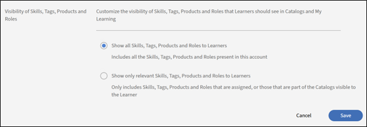

# Grundläggande inställningar i Adobe Learning Manager

## Översikt

Avsnittet Grundläggande information är grunden i Adobe Learning Manager-konfigurationen. Det innehåller viktiga organisatoriska parametrar som definierar hur utbildningsplattformen fungerar i olika regioner, språk och affärssammanhang.

## Viktiga fördelar

* Tillhandahåller regionspecifik innehållsleverans och användarupplevelse.
* Standardiserar tidsvisningar, datumformat och valutarepresentationer.
* Ger automatiska justeringar av sommartid för valda tidszoner.
* Minskar behovet av manuella justeringar över hela plattformen.

## Konfigurera grundläggande inställningar

### Få åtkomst till grundläggande informationsinställningar

1. Logga in på Adobe Learning Manager som administratör.
2. Välj **[!UICONTROL Settings]** i det vänstra navigeringsfältet.

   

3. Välj **[!UICONTROL Basic Info]** i kategorin **[!UICONTROL Basics]**.

   

4. Välj **[!UICONTROL Change]** för att ändra grundinställningarna.

### Ändra grundläggande inställningar

**Land/region**

I listrutan Land/region i Adobe Learning Manager administratörsinställningar kan du ange vilket land eller region som är kopplat till respektive organisation. Den här inställningen används för lokalisering, vilket säkerställer att plattformen följer regionala inställningar, kompatibilitetskrav och tidszoner.

**Tidszon**

Med listrutan Tidszon kan du definiera standardtidszonen för plattformen. Detta säkerställer att alla tidskänsliga aktiviteter, t.ex. kursplaner, deadlines och rapporter är korrekt anpassade till organisationens eller elevernas lokala tid.

**Språk**

Språk avser kontots språk och nationella inställningar. Med listrutan Språk kan administratörer konfigurera språket som plattformens gränssnitt och innehåll visas för användarna. Det här alternativet ser till att elever och administratörer kan interagera med plattformen på sitt önskade språk.

**Budgetåret börjar från**

Med det här alternativet kan du ange startmånaden för organisationens räkenskapsår. Om organisationens räkenskapsår till exempel börjar i december kan du ange det här alternativet till december. Rapporterna och analyserna kommer sedan att anpassas till denna räkenskapsperiod.

**Valuta**

Med alternativet Valuta kan du definiera standardvalutan för kontot. Den här valutan används för att prissätta utbildningsobjekt, t.ex. kurser, utbildningsvägar och certifieringar. Om din organisation t.ex. har verksamhet i USA kan du ange valutan till USD ($). På samma sätt kan du välja EUR (EUR) för insatser i Europa.

### Ändra inställningar för feedback

Inställningarna för feedback i Adobe Learning Manager ger administratörer verktyg för att samla in och hantera feedback från elever (L1) och chefer (L3). Dessa inställningar säkerställer att kurser och utbildningsmål utvärderas effektivt, vilket möjliggör kontinuerlig förbättring.

Innan du börjar samla värdefulla insikter från dina elever måste du aktivera funktionen för feedback om L1 och ange dess parametrar. Det första steget innebär att gå till området Inställningar för feedback och aktivera funktionen för alla nya kurser samt att välja det primära språket för dina feedbackformulär.

### Aktivera L1-feedback

På fliken L1-feedback letar du upp växlingsknappen som är märkt Aktivera L1-feedback för nyligen skapad kurs och utbildningsväg. Välj reglaget för att aktivera det. Detta inkluderar automatiskt ett L1-feedbackformulär för alla nya kurser du skapar.

**Välj ett standardspråk**

Använd listrutan Språk för att välja standardspråk för dina feedbackformulär. Detta garanterar att frågorna presenteras för eleverna på rätt språk.

**Konfigurera enkäter för olika kurstyper**

Med Adobe Learning Manager kan du anpassa frågorna beroende på om kursen är en modul du tar för egen hand eller en instruktörsledd klassrumssession. Detta säkerställer att den feedback du får är specifik och relevant. I det här steget kommer du att välja och förfina frågorna för både kurser i egen takt och klassrumskurser för att samla in de mest meningsfulla uppgifterna.

**För kurser i egen takt**:

* **Obligatorisk fråga**: Frågeformuläret innehåller en obligatorisk fråga: &quot;Hur troligt är det att du skulle rekommendera den här kursen till en kollega?&quot;. Det här är en NPS-fråga (Net Promoter Score) som ger ett nyckelmått för övergripande kurstillfredsställelse.
* **Anpassa frågor**: Granska listan med frågor. Om du vill inkludera en fråga i feedbackformuläret ser du till att växlingsknappen bredvid den är inställd på Ja. Om du vill ta bort en fråga växlar du till Nej.
* **Lägg till anpassade frågor**: Om du har ytterligare frågor som rör ditt innehåll du går över till väljer du länken Lägg till mer för att skapa och lägga till nya anpassade instruktioner i frågeformuläret.

**För klassrumskurser**:

* **Anpassa frågor**: Granska listan med frågor som är anpassade för klassrumsbaserad utbildning. Växla reglaget bredvid varje fråga till Ja för att inkludera den eller Nej för att exkludera den från feedbackformuläret.
* **Lägg till anpassade frågor**: Om du vill lägga till nya frågor som är specifika för din klassrumsmiljö eller din stil väljer du länken Lägg till fler för att skapa och lägga till dem i listan.

**Ställ in feedbackpåminnelser**

Du kan maximera svarsfrekvensen genom att konfigurera automatiska påminnelser. Det här steget visar hur du ställer in och schemalägger dessa påminnelser, anger när de skickas, hur ofta de återkommer och hur länge. Genom att påminna elever i förebyggande syfte kan du avsevärt öka mängden feedback som du samlar in.

1. **Lägg till en ny påminnelse**: Välj **[!UICONTROL Add New Reminder]** i avsnittet **[!UICONTROL L1 Feedback Reminders]**.

   

2. **Definiera påminnelseschema**: I panelen **Påminnelseinställningar** som visas använder du listrutorna och inmatningsfälten för att konfigurera påminnelsen:

   a. **[!UICONTROL When to send]**: Välj om påminnelsen ska skickas **[!UICONTROL On Course Completion]** eller **[!UICONTROL After Course]**.
b) **[!UICONTROL Recurrence]**: Välj hur ofta påminnelsen ska visas (till exempel Varje vecka).
c) **[!UICONTROL For]**: Ange den totala varaktigheten (i veckor) som påminnelserna ska skickas för (till exempel fyra veckor).

3. **[!UICONTROL  Save the reminder]**: Välj den blå bockikonen för att spara den nya påminnelsekonfigurationen. Du kan upprepa den här processen om du vill lägga till fler påminnelser vid behov.

   

4. Välj **[!UICONTROL Save]** i det övre högra hörnet på sidan för att tillämpa inställningarna för L1-feedback.

### Aktivera L3-feedback

Innan du kan samla in feedback från en elevs chef måste du konfigurera inställningarna för feedback om L3. Det första steget innebär att gå till sidan Feedback-inställningar och välja fliken L3-feedback. Härifrån kan du ställa in språket för feedbackbegäran och granska den primära frågan som skickas till chefen.

**Välj fliken L3-feedback**

Välj fliken L3-feedback på sidan Feedback-inställningar.

**Granska feedbackutdraget**

Feedback om L3 begärs från elevens chef som en enda instruktion som de kan samtycka till eller inte hålla med om. Standardmeddelandet som visas är: &quot;Medarbetarens resultat har uppvisat en tydlig förbättring efter att ha genomgått utbildningen.&quot; Du kan ändra detta uttalande så att det passar organisationens behov bättre.

**Välj ett standardspråk**

Välj språk i listrutan Språk för att välja standardspråk för feedbackbegäran.

**Ställ in feedbackpåminnelser**

För att se till att chefer ger feedback i tid måste du konfigurera automatiska påminnelser. Det här steget innebär att du konfigurerar när dessa påminnelser skickas och hur ofta de återkommer. Skärmbilden visar att L3-feedbackpåminnelser kan konfigureras så att de skickas en gång efter slutförandet av kursen, men du kan lägga till fler påminnelser vid behov.

1. **[!UICONTROL Add a new reminder]**: Välj länken **[!UICONTROL Add New Reminder]** för att skapa en ny påminnelse.
2. **[!UICONTROL Define reminder schedule]**: Välj rullgardinsmenyerna och inmatningsfälten på panelen **[!UICONTROL Reminder Settings]** för att konfigurera påminnelsen:
a. **[!UICONTROL When to send]**: Välj när påminnelsen skickas. Alternativen är: **[!UICONTROL On Course Completion]** och **[!UICONTROL After Course completion]**.
b) **[!UICONTROL Recurrence]**: Välj frekvens för påminnelsen. Om upprepningen är **[!UICONTROL Once]** innebär det att chefen får ett meddelande för att ge feedback. De tillgängliga alternativen är - En gång, Varje dag, Varje vecka och Varje månad.
3. När du har ställt in schemat väljer du den blå bockmarkeringsikonen för att spara påminnelsekonfigurationen. Påminnelsen visas i listan med befintliga påminnelser.

   

4. Välj **[!UICONTROL Save]** i det övre högra hörnet på sidan för att tillämpa inställningarna för L3-feedback.

## Allmänna inställningar

### Översikt

De allmänna inställningarna i Adobe Learning Manager ger administratörer en central plats för att konfigurera den övergripande elevupplevelsen och administrationsprocesserna. Med de här inställningarna kan du aktivera eller inaktivera olika funktioner för att anpassa plattformen efter organisationens specifika behov.

Viktiga konfigurerbara allmänna inställningar inkluderar:

* **Kursens effektivitet och moderation:** Välj att visa en bedömning av kursens effektivitet för elever och aktivera en kursmodereringsfunktion som kräver administratörsgodkännande för alla kursändringar.
* **Funktioner för elevengagemang:** Du kan aktivera eller inaktivera funktioner som **diskussionstavlan** för kurskommentarer, kompetenser från externa källor för elever och **Sammandrag av e-postmeddelanden** för att hålla eleverna informerade om nytt innehåll och framsteg.
* **I inställningarna för innehåll och kurshantering:** kan du konfigurera **flera försök** för interaktiv e-utbildning, lägga till **unika ID:n för utbildningsobjekt** i innehållet och ange standardbeteende för **uppdateringar av modulversion**.
* **Användarhantering:** Aktivera **Registrera användare automatiskt** för att automatiskt lägga till nya användare i systemet och **Ta bort interna användare automatiskt** som har varit inaktiva under en viss period.
* **Anpassning och visning**: Du har kontroll över vad eleverna ser, till exempel att aktivera eller inaktivera **filterpaneler** för sökning, visa **Katalogetiketter** och anpassa upp till tre **Sidfotslänkar**.

### Kursmoderering

Med hjälp av kursmoderering kan du övervaka och hantera författarnas uppdateringar av kurser. Det säkerställer att alla ändringar i kursinnehållet granskas och godkänns av administratörer innan de publiceras för elever. Om du väljer Kursmoderering måste författarna söka godkännande från administratörer för att publicera en kurs om de har gjort några ändringar av kursen.

När en författare uppdaterar en kurs, till exempel, lägger till eller tar bort en eller flera moduler och försöker publicera kursen

1. Du får meddelanden när författaren publicerar en kurs igen med ändringar.
2. Markera meddelandet om du vill visa de ändringar som gjorts av författaren.
3. Jämför det gamla och det nya innehållet.
4. Godkänn eller avslå ändringar:
a. Godkänn ändringarna för att återpublicera kursen med uppdateringar.
b) Ignorera ändringarna för att hålla den tidigare versionen av kursen aktiv.
5. Författarna informeras om ditt beslut, oavsett om det blir ett godkännande eller avslag.

### Diskussionstavla

Med diskussionstavlan i Adobe Learning Manager kan elever delta i diskussioner som rör kurser, moduler eller utbildningsprogram. Du kan aktivera och hantera den här funktionen för att främja samarbete och kunskapsdelning mellan elever. Diskussionstavlor är kopplade till specifika kurser eller moduler, vilket gör dem relevanta i sammanhanget.

Som elev kan du interagera med andra elever och dina instruktörer på fliken Diskussion. Du kan visa inläggen för alla kurser som du visar eller registrerar dig för. Om en administratör har aktiverat diskussioner för en kurs kan du visa fliken Diskussion bredvid fliken Anteckningar för kursen.

När du väljer fliken Diskussioner för en kurs kan du se befintliga inlägg och kommentarer för kursen. Om du redan har registrerat dig till kursen kan du också börja skriva inlägg eller kommentarer så att andra användare kan se dem. När du har skrivit meddelandet klickar du på Publicera. Ditt inlägg måste innehålla minst 10 tecken.

Inlägget visas omedelbart på fliken Diskussioner. Du kan sortera inläggen som Nyast först eller Äldst först och ta bort de inlägg som du skrev. Även efter att du avregistrerat dig från kursen kan du fortfarande se alla inlägg och ta bort inläggen som du skrev.

Som administratör kan du moderera diskussionerna för att säkerställa relevans och lämplighet. Eleverna får meddelanden om svar eller uppdateringar i diskussioner de ingår i.

### Flera försök

Om du väljer det här alternativet kan författare ange antalet återförsök som är möjliga på kurs- eller modulnivå. Det gör det möjligt för elever att ta om kursen eller bedömningen när den är klar.  Den här inställningen är användbar för kurser som innehåller frågeformulär, tester eller kurstyper som kräver utvärdering.

### Synlighet av kompetenser, taggar, produkter och roller

Det här alternativet avgör om eleverna bara ser kunskaper och taggar som är tilldelade, eller om de ingår i kataloger som är synliga för elever, eller alla färdigheter och taggar. Detta inkluderar färdigheter, taggar, produkter och roller som är kopplade till kurser eller utbildningsvägar.

Välj **[!UICONTROL Edit]** för att begränsa vad en elev kan se:

Eleverna utforskar sedan de färdigheter och taggar som är synliga för dem och prenumererar på de färdigheter de väljer.

### Unika ID för utbildningsobjekt

Med det här alternativet kan du tilldela varje utbildningsobjekt en unik identifierare (till exempel kurser, utbildningsvägar, certifieringar eller arbetsstöd). Detta säkerställer att varje utbildningsobjekt har ett specifikt ID, som kan vara användbart för spårning, rapportering och integrering med externa system.

När det här alternativet är aktiverat ser författarna ett fält för att lägga till ID för utbildningsobjekt när de skapar ett utbildningsobjekt. De kan lägga till ID:n därefter. Unika ID:n lämpar sig för integrering med system från tredje part, däribland system för registrering av inlärning (LRS) och system för hantering av inlärning (LMS). De unika ID:n gör det också enklare för dig eller en författare att söka efter specifika utbildningsobjekt och spåra dem via elevens betygsutdrag.

### Visa filterpaneler

Med det här alternativet kan du styra vilka filteralternativ som är tillgängliga för elever i elevtillämpningen. Dessa filter hjälper elever att förfina sina sökresultat i avsnitten Min utbildning och Katalog för en elev. Följande filteralternativ är tillgängliga att välja:

* Grupper
* Kataloger
* Typ
* Format
* Varaktighet
* Kompetenser
* Färdighetsnivåer
* Taggar
* Pris
* Prisintervall
* Platser
* Produkter
* Nivåer för rekommendation

>[!NOTE]
>
>Filtren **[!UICONTROL Format]** och **[!UICONTROL Duration]** är avstängda som standard och visas inte för eleverna direkt. Du måste välja dem uttryckligen.

### Produktterminologi

Adobe Learning Manager har viss produktterminologi för att definiera utbildningsobjekt, till exempel kurser, utbildningsvägar eller arbetsstöd. Du kan anpassa terminologin på engelska och franska enligt dina önskemål. Hämta mallen Produktterminologi och ersätt t.ex. utbildningsplanen med den föreskrivande regeln. På samma sätt ändrar du liknande poster på franska. Ladda sedan upp den ändrade mallen och välj Spara för att uppdatera terminologierna i produkten.

Mer information finns i Produktterminologi i Adobe Learning Manager.

### Uppdatering av modulversion

Med det här alternativet kan administratörer uppdatera innehållet i en modul utan att störa förloppet för elever som redan är registrerade i kurser som innehåller den modulen. Det gör att elever kan fortsätta sin utbildningsresa smidigt medan författare kan hålla innehållet uppdaterat. När alternativet är aktiverat kan författare överföra en ny version av en modul (till exempel SCORM-, AICC- eller xAPI-paket) för att ersätta den befintliga versionen.

* Elever som redan har startat modulen kommer att fortsätta med den version de registrerades i.
* Nya elever får automatiskt tillgång till den uppdaterade versionen.
* Adobe Learning Manager håller reda på olika versioner av modulen för rapporterings- och granskningsändamål.

### Registrera användare automatiskt

Med det här alternativet kan du automatiskt registrera användare i specifika kataloger eller utbildningsinnehåll när de läggs till i systemet. Detta garanterar att användarna har omedelbar tillgång till relevanta utbildningsmaterial utan att behöva göra något manuellt.

* Nya användare registreras automatiskt i fördefinierade kataloger eller kurser när de läggs till i systemet.
* Administratörer kan definiera regler för att avgöra vilka kataloger eller kurser användare automatiskt registreras för, baserat på användarattribut som roller, grupper eller andra kriterier. Se [Utbildningsplaner i Adobe Learning Manager](/help/migrated/administrators/feature-summary/learning-plans.md) eller [Registrera externa användargrupper automatiskt på kurser vid registrering](https://elearning.adobe.com/2024/05/automatically-enroll-external-user-groups-in-courses-upon-registration/) om du vill ha mer information.

### Ta bort interna användare automatiskt

Det här alternativet tar bort användare om de inte har tillgång till Adobe Learning Manager under en viss tid.  Ange hur många dagar en användare kan ha åtkomst utan att logga in på Adobe Learning Manager. Med det här alternativet kan du även automatiskt ta bort inaktiva interna användare från systemet efter en viss tid. Detta hjälper till att upprätthålla en ren och organiserad användardatabas genom att ta bort användare som inte längre är aktiva.

* Interna användare som har varit inaktiva under en angiven tid tas bort automatiskt.
* Användarna meddelas före borttagningen, vilket ger dem möjlighet att logga in och förhindra borttagning.
* En borttagen användare måste kontakta kontoadministratören för att få åtkomst återställd.

### Visa katalogetiketter

Med det här alternativet kan författare ange katalogetiketter när de skapar ett utbildningsobjekt. En elev ser sedan katalogetiketterna i katalogavsnittet i elevappen. Dessa etiketter hjälper elever att identifiera och skilja mellan olika kataloger som är tillgängliga för dem. Om alternativet är avmarkerat flyttas kurserna eller utbildningsobjekten till standardkatalogen.

### Anpassad kompatibilitetstyp

Med det här alternativet kan en författare definiera och hantera efterlevnadstyper som är anpassade till deras organisations specifika krav, samtidigt som utbildningsobjekt skapas. Författare kan lägga till en efterlevnadsetikett och en deadline till kursen de skapar.
Detta är särskilt användbart för att följa och genomdriva efterlevnadsutbildning för anställda baserat på unika organisationspolicyer.

### Elever kan visa sina poäng

Om du väljer det här alternativet ser du till att eleverna kan se sina quiz-poäng i elevens betygsutdrag. I transkriptionerna hjälper kolumnerna Quiz_score, Quiz_score_max, Highest_Quiz_score och Highest_Quiz_score_max eleven att se sina bedömningspoäng. Dessa poäng hjälper elever att följa sina framsteg och förstå sina prestationer.

Om du avmarkerar alternativet visas inte quiz-poängen i elevens betygsutdrag.

### Sammandragsmeddelande

Med det här alternativet kan du skicka sammanfattande e-postmeddelanden till elever med uppdateringar om deras utbildningsaktiviteter, framsteg och kommande deadlines. Dessa e-postmeddelanden är utformade för att hålla elever informerade och engagerade i sina utbildningsprogram. Dessa e-postmeddelanden tar upp elevernas aktiviteter, t.ex. slutförda kurser.

Du kan ändra frekvensen för e-postmeddelanden i inställningarna för E-postmall. Dessutom kan du anpassa innehållet i sammanfattningsmeddelandena så att de innehåller specifik information som är relevant för elever.

>[!NOTE]
>
>* För aktiva konton inaktiveras sammanfattningsmeddelanden som standard, vilket du kan aktivera manuellt.
>* För testkonton är alternativet för sammanfattningsmeddelanden fortfarande inaktiverat och du kan inte aktivera det.

### Aktivera ikoner för kurs/utbildningsväg/certifiering/arbetsstödskort

Det här alternativet gör det möjligt för författare att lägga till omslagsbilder på elevens kurskort för olika typer av utbildningsinnehåll. Dessa bilder hjälper elever att enkelt identifiera typen av innehåll (till exempel kurs, utbildningsväg, certifiering eller arbetsstöd) vid en snabbtitt. När du skapar ett utbildningsobjekt kan författare lägga till omslagsbilder till kurser.

Om du inte markerar alternativet visas inga ikoner på korten.

### Sidfotslänkar

Med det här alternativet kan du anpassa sidfotsavsnittet i elevappen genom att lägga till länkar till externa resurser, företagets webbplatser eller andra relevanta sidor. Dessa länkar visas längst ner i elevens appgränssnitt och kan användas för att ge snabb åtkomst till viktig information. Länkarna kan dirigera elever till externa webbplatser, hjälpsidor eller företagspolicyer. De ger elever enkel tillgång till ytterligare resurser direkt från appen.

Så här kan du anpassa sidfotslänkarna:

1. **[!UICONTROL Add links]**: Välj **[!UICONTROL Add More]** och ange namn och URL eller e-post-ID i de angivna fälten. Se till att URL:en har prefixet http:// eller https://.
2. **[!UICONTROL Replicate across locales]**: Välj **[!UICONTROL Replicate]** för att överföra ändringarna över alla språk och se till att alla språk får samma namn och URL.
3. Välj **[!UICONTROL Save]** för att tillämpa ändringarna.

**Ytterligare alternativ:**

* Återställ standardvärden: Välj ikonen Återställ om du vill återställa standardvärdena i fälten Hjälp och Kontakta administratören.
* Anpassa för alla språk: Välj ett språk i listrutan och lägg sedan till namnet och webbadressen för det språket. Spara ändringarna för att uppdatera sidfotslänkarna för det valda språket.

### Rapportera tidszon

Med det här alternativet kan du ange en inställning på kontonivå för att exportera rapporten Utbildningsutskrifter och Sessionssammanfattning i specifika tidszoner. Du kan välja bland följande alternativ:

* UTC (Standardbeteende)
* Tidszonsinställning på kontonivå

Det här alternativet ser också till att elevens betygsutdrag som har hämtats med Job API återspeglar den valda tidszonen.

### Badgr-integrering

Genom att välja alternativet kan eleverna:

* Ladda upp deras märken till webbplatsen Badgr.
* Dela utmärkelsetecknen på sociala medier.

Så fungerar det:

* Markera alternativet i avsnittet Badgr-integrering.
* Elever loggar in på sitt Badgr-konto från Adobe Learning Manager.
* Märken som intjänats i Adobe Learning Manager laddas upp automatiskt till Badgr-kontot.

>[!NOTE]
>
>* Adobe Learning Manager tillhandahåller inte ett Badgr-konto som en del av integreringen. Elever måste skapa sina egna Badgr-konton.
>* Elever kan konfigurera sitt Badgr-konto direkt från sidan Märken i elevappen.

Mer information finns i [Stöd för Badgr](/help/migrated/learners/feature-summary/badges.md#support-for-badgr-badges)-märken.

### Visa stjärngraderingar

Med det här alternativet kan du aktivera eller inaktivera visning av kursbetyg i elevappen. När det här alternativet är aktiverat kan elever visa betyg för kurser, vilket hjälper dem att fatta välgrundade beslut om att registrera sig för en kurs.

* Om alternativet Kurseffektivitet väljs kommer eleverna att kunna se endast värdet av kurseffektiviteten. Kursens effektivitet beräknas baserat på elevfeedback (L1), quizpoäng (L2) och chefsfeedback (L3).
* Om alternativet Stjärngradering väljs kommer eleverna endast att kunna visa det genomsnittliga stjärnbetyget och antalet elever som har betygsatt kursen. Stjärnrankningen är genomsnittet av alla betyg som ges av elever efter avslutad kurs.

För nya konton är alternativet Stjärngradering aktiverat som standard i avsnittet Visa graderingar.

För befintliga konton gäller att om alternativet Kurseffektivitet har aktiverats på kontot tidigare ska avsnittet Visa betyg aktiveras med alternativet Kurseffektivitet valt. Om alternativet Kurseffektivitet är inaktiverat, inaktiveras även avsnittet Visa stjärngraderingar. När avsnittet Visa stjärngradering är aktiverat är alternativet Stjärngradering aktiverat som standard.

### Standardvy (elevroll)

Detta alternativ hänvisar till elevens vy av kurskatalogen. Markera kryssrutan Listvy för att ändra elevens vy från standardrutnätsvyn till listvyn.

### Utbildningsvägar

Om du väljer **[!UICONTROL Enable Extended features of Learning Path]** kan du inkludera utbildningsvägar i utbildningsvägar och kombinera dessa med kurser. Alternativet är oåterkalleligt.

### Instruktörshantering

Det här alternativet gör att författare kan välja instruktörer för en virtuell klassrums- eller klassrumssession från en förutbestämd lista.

**Viktiga funktioner:**

* Begränsa val av instruktör: Endast användare med instruktörsrollen kan tilldelas sessioner.
* Inverkan på migreringsarbetsflöden: Den här begränsningen gäller inte migreringsarbetsflöden.

### Modulförhandsgranskning

Om du väljer Aktivera kan författare förhandsgranska en kurs som elever efter att ha skapat kursen.

### Aktivera priser för kurser/utbildningsvägar/certifieringar

Med det här alternativet kan du aktivera e-handelsfunktioner för kurser, utbildningsvägar och certifieringar. Den här funktionen används främst för att integrera Adobe Learning Manager med Adobe Commerce, vilket gör att företag kan tjäna pengar på sina utbildningserbjudanden.
När du har aktiverat funktionen visas fältet Valuta på sidan Grundläggande information.

När kurserna är avgiftsbelagda kan författarna specificera kursen, utbildningsvägen eller priset för certifieringen. Elever kan köpa utbildning direkt från Adobe Learning Manager eller [egna AEM-webbplatser](/help/migrated/integrate-aem-learning-manager.md).

>[!NOTE]
>
>Vissa typer av utbildning, såsom återkommande certifieringar och chefsgodkända kurser, kan inte köpas.

### Aktivera flera artiklar-SKU-kundvagn

Med det här alternativet kan elever lägga till flera utbildningsobjekt (kurser, utbildningsvägar, certifieringar) i en kundvagn och köpa dem tillsammans. Den här funktionen ingår i e-handelsfunktionen som är integrerad med Adobe Commerce.

Den här funktionen är särskilt användbar för organisationer som säljer flera utbildningsobjekt och vill effektivisera inköpsprocessen för elever.

**Viktiga funktioner:**

* Flera köp: Elever kan lägga till flera artiklar i vagnen och köpa dem i en enda transaktion. Se Flerartikelvagn för mer information.
*Effektiv utcheckning: Minskar behovet för elever att göra separata inköp för varje utbildningspost.
* SKU-hantering: Administratörer kan hantera SKU:er för kurser, utbildningsvägar och certifieringar för att säkerställa korrekt spårning och rapportering.

### Spelarinställningar

Med det här alternativet kan man anpassa Fluidic-spelaren för olika kurser på kursnivå. Författare kan konfigurera hur utbildningsinnehåll visas för elever i spelaren. Detta inkluderar inställningar relaterade till innehållsspråk, gränssnittsinställningar och uppspelningsalternativ.

### Chefer kan markera som slutförda

Med det här alternativet kan chefer markera kurser, certifieringar eller slutföranden av utbildningsvägar för sin personal. Den här funktionen är användbar i scenarier där elever har slutfört utbildning utanför plattformen eller behöver manuell hantering för att uppdatera sina framsteg.
Chefer kan markera slutförda kurser via:

* Modulen Checklista: Modulen Checklista låter chefer utvärdera elevers prestanda baserat på specifika uppgifter eller kriterier. Författare måste aktivera den här modulen när kursen skapas och tilldela chefer som granskare.
* Kurssida: På kurssidan:
a.    Välj fliken **[!UICONTROL Learners]** i den vänstra rutan.
b)    Välj den elev vars närvaro du vill markera.
c)    Välj **[!UICONTROL Actions]** > **[!UICONTROL Mark Completion]**.

**Ytterligare anteckningar:**

* Chefer kan också exportera elevlistan för rapporteringsändamål.
* Om en kurs innehåller flera instanser kan chefer visa och hantera elever separat för varje instans.

### Fasa ut

Med det här alternativet kan författare ta bort utbildningsinnehåll (kurser, utbildningsvägar, certifieringar) som inte längre är relevant eller behövs. Utfasat innehåll tas bort från elevens katalog men förblir tillgängligt i rapporter och historiska data för spårningsändamål. Det finns två alternativ:

1. När de har fasats ut kan registrerade elever se och utföra åtgärder, men ännu inte registrerade elever förlorar åtkomsten:
a. Registrerade elever:
i) Elever som redan är registrerade för en utfasad kurs eller utbildningsväg har fortfarande tillgång till innehållet.
ii) De kan fortsätta att utföra åtgärder som att slutföra kursen eller visa materialet.
b) Ännu inte registrerade elever:
i) Elever som inte har registrerat sig till kursen eller utbildningsvägen innan den togs ur bruk ser inte längre innehållet i katalogen.
ii) De förlorar helt åtkomsten till det indragna innehållet.
2. När elever har dragit sig tillbaka förlorar både registrerade och ännu inte registrerade elever åtkomst:
a. Registrerade elever:
i) Elever som redan var registrerade för kursen eller utbildningsvägen kommer att förlora åtkomsten till innehållet när det tas bort.
ii) De kan inte längre visa eller utföra åtgärder på det indragna innehållet.
b) Ännu inte registrerade elever:
i) Elever som inte har registrerat sig till kursen eller utbildningsvägen kommer också att förlora åtkomsten, eftersom innehållet inte längre visas i katalogen.

### Automatisk utfasning

Med det här alternativet kan författare ange ett datum då en kurs automatiskt ska tas ur bruk. När en kurs läggs i malpåse är den inte längre tillgänglig för nya registreringar, men elever som redan är registrerade kan fortfarande komma åt och slutföra kursen.

Viktiga kommentarer:

* När datumet för automatisk utfasning har angetts flyttas kursen automatiskt till läget Utfasad det angivna datumet.
* Pensionerade kurser visas inte i kurskatalogen för nya elever, men befintliga elever kan fortfarande komma åt och slutföra dem.

### Visa alla registrerade kurser i sökresultat

Det här alternativet ger elever möjlighet att visa kurser i sökresultat även om eleverna är en del av deras registrerade utbildningsväg eller certifiering.

### Import av kompetenser

Med det här alternativet kan du importera kunskaper från externa källor, som LinkedIn Learning och Go1, med hjälp av respektive anslutningar. Den här funktionen integrerar externa Skills Cloud och Talent Management Systems i Adobe Learning Manager, vilket förbättrar plattformens förmåga att hantera och utnyttja kompetenser effektivt.

Kunskaperna från externa innehållsleverantörer läggs till i det administratörsdefinierade kunskapslagret i Adobe Learning Manager. Dessa färdigheter blir tillgängliga för författare under arbetsflödet för att skapa kursen.

1. Välj **[!UICONTROL Enable]**.

   

2. Välj en innehållsleverantör i listrutan **[!UICONTROL Select Skills Source]**.
3. Välj **[!UICONTROL Save]**.
Observera att när alternativet har aktiverats är åtgärden oåterkallelig. Du kan inte inaktivera eller byta till en annan källa senare.

