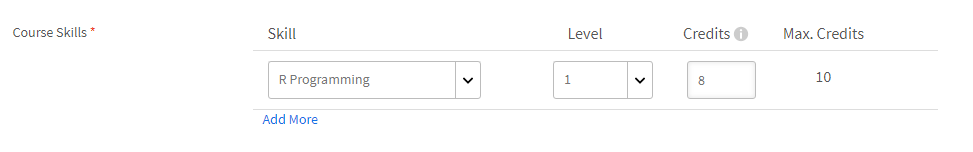

# Skapa och ändra kompetenser och nivåer

Skapa, tilldela och ändra kunskaper och nivåer.

Kompetenskarta är en gruppering av kompetenser, kunskaper och egenskaper hos en anställd i en organisation. Dessa kompetenskartor hjälper företag/organisationer att ställa upp eller höja prestandaförväntningarna för sina anställda. Kompetenser gör att medarbetarna kan anpassa sitt beteende till organisationens förväntningar.

Med Adobe Learning Manager kan du mappa prestanda för elever baserat på deras kunskapsuppsättningar med hjälp av kunskapskartan. När eleverna har slutfört vissa kurser kan de veta hur de ställer sig till varje färdighet genom att titta på färdighetskartorna.

Det grundläggande syftet med kompetenser i Learning Manager LMS är att ge administratören ett verktyg som anpassar inlärningen till affärsmålen.

## Lägg till en kompetens {#addaskill}

Du som är administratör kan göra följande:

* Mappa en domän till en kompetens.
* Lägg till flera kunskapsnivåer.
* Lägg till ett märke på en nivå.

Följ stegen nedan för att lägga till en kompetens:

1. I den vänstra rutan väljer du **[!UICONTROL Skills]** > **[!UICONTROL Add]** > **[!UICONTROL Add SKills]**. Ge kompetensen ett namn och en beskrivning.

   

   *Lägg till namn och beskrivning för en kompetens*

1. Tilldela en domän till kompetensen. När du skapar en kompetens kan du koppla den till de mest relevanta kompetensdomänerna som Learning Manager stöder. Mer information finns i [***Mappa kompetens med domäner***](/help/migrated/administrators/feature-summary/curation-skills.md).

   Börja skriva domänen i fältet så kan du se rekommendationer. Välj det eller de alternativ som är relevanta för kompetensen.

   

   *Lägg till en domän*

1. Tilldela nivåerna till kompetensen. Lägg till en nivå genom att klicka på **[!UICONTROL Add]**.

   Du kan skapa och tilldela kompetenser till anställda. Det finns olika nivåer för färdigheter och varje nivå kräver ett visst antal poäng att förtjäna.

   Du kan tilldela högst tre nivåer till en kompetens. Utbildningsvägen är att registrera elever till olika utbildningsobjekt, som sedan omvandlas till ett visst antal poäng som uppfyller kraven för de olika nivåerna av en kompetens.

   När dessa utbildningsobjekt (LO:er) och nivåer har uppnåtts är eleven nu rustad för att prestera på en mer produktiv nivå än tidigare.

   

   *Lägg till kunskapsnivåer*

   När du lägger till en kompetens kan du även tilldela decimaler till poäng. Krediterna visas upp till två decimaler.

   Decimalstöd är bara tillgängligt på engelska.

1. Välj ett märke för nivån. Från **[!UICONTROL Badge]** väljer du en bild som måste användas som ett märke för den nivån.
1. Klicka på för att spara ändringarna **[!UICONTROL Save]**.

   När kompetensen har skapats kan du hitta den nya kompetensen på **[!UICONTROL Skill]** sidan. Du kan också se domänerna och den korta beskrivningen av kompetensen. Du kan också visa nivåerna och krediterna som har tilldelats varje nivå.

   

   *Visa lista över kompetenser*

## Tilldela kompetensen till elever {#assigntheskilltolearners}

Administratörer kan tilldela eleverna kunskaperna.

När du har skapat dina färdigheter och sparat dem listas de på sidan Kunskaper. Nu kan du börja tilldela eleverna de här kunskaperna på följande sätt:

1. På fliken **[!UICONTROL Skill]** klickar du på hyperlänken med antalet elever som har registrerats för kompetensen. För en nyskapad kompetens är antalet elever på alla nivåer noll.

   

   *Visa elever som har tilldelats en kompetens*

   I det här exemplet lägger du till elever för nivå 1. Klicka på hyperlänken bredvid Nivå 1.

1. I dialogrutan Elever klickar du på **[!UICONTROL Add Learners]**.

   

   *Lägg till elever*

1. Sök efter elever och lägg till eleverna. Du kan även lägga till användargrupper.

   

   *Sök efter och lägg till elever*

1. Klicka på för att spara ändringarna **[!UICONTROL Save]**.

   När du har tilldelat eleverna registreras alla elever i en användargrupp automatiskt till kompetensen som standard. Du kan få eleverna att välja bort automatisk registrering genom att klicka på **[!UICONTROL Auto Enroll]** knapp.

   

   *Inaktivera automatisk registrering*

   Enskilda elever kan registrera sig själva automatiskt eller kan registreras av administratören i ett utbildningsprogram.

1. När du har klickat **[!UICONTROL Close]** kan du se det totala antalet elever som har tilldelats kompetensen du har skapat.

   I det här exemplet finns två enskilda elever och tre elever i en användargrupp.

   

   *Antal elever som har tilldelats en kompetens*

## Tilldela kompetensen till en kurs {#assignskilltocourse}

När du har skapat kompetensen kan en författare skapa en kurs och tilldela kompetensen till kursen.

*Tilldela en kurs kompetenser*

När författaren publicerar kursen, på **[!UICONTROL Skill]** kan du se antalet kurser som är kopplade till en kompetensnivå, som ökas när du tilldelar kompetensen till en ny kurs.

*Antal kurser som är kopplade till en kompetensnivå*

## Tilldela ett arbetsstöd till kompetensen {#assignajobaidtotheskill}

Arbetsstöd är utbildningsinnehåll som en elev kan komma åt utan att registrera sig för ett specifikt utbildningsobjekt som en kurs eller ett utbildningsprogram.

När du skapar ett arbetsstöd kan en författare koppla en kompetensnivå till det. Att skapa ett arbetsstöd utan kompetens och koppla det till en kurs med en kompetens kopplar inte kompetensen till arbetsstödet.

*Skapa ett arbetsstöd*

På fliken **[!UICONTROL Skill]** kan du se antalet arbetsstöd som är kopplade till den kompetensnivån.

*Antal arbetsstöd för en kompetens*

## Sök efter kompetens {#searchskill}

Sök efter valfri kompetens genom att skriva namnet på kompetensen och välja kompetensen från de tillgängliga alternativen. Sök framåt är också tillämpligt här.

Du kan söka efter kunskaper i både **[!UICONTROL Active]** och **[!UICONTROL Retired]** delar av sidan Kompetenser.

## Redigera en kompetens {#editaskill}

På fliken **[!UICONTROL Skill]** klickar du på den kompetens du vill ändra. I dialogrutan **[!UICONTROL Edit Skill]** dialogrutan, göra nödvändiga ändringar, till exempel,

* Lägga till eller ta bort en kompetensdomän.
* Redigera kompetensens namn och beskrivning.
* Lägga till en kunskapsnivå eller ändra en befintlig nivå.
* Lägga till eller ta bort ett utmärkelsetecken för en kompetens.

När du har gjort ändringarna klickar du på **[!UICONTROL Save]**.

## Ta bort en kompetens {#retireaskill}

För att ta en kompetens ur bruk, på **[!UICONTROL Skill]** väljer du den kompetens som du vill ta ur bruk.

Från **[!UICONTROL Actions]** i det övre högra hörnet på sidan klickar du på **[!UICONTROL Retire]**.

När du tar en kompetens ur anspråk visas den inte längre på kursen.

När en kompetens pensioneras kan den inte kopplas till fler kurser eller arbetsstöd eller tilldelas elever förrän den har publicerats igen. Befintliga associationer och uppdrag påverkas inte av att kompetensen upphör.

## Återpublicera en kompetens {#republishaskill}

När du har dragit tillbaka en kompetens visas den borttagna kompetensen i **[!UICONTROL Retired]** -fliken. På fliken visas en lista över alla kompetenser som har fasats ut.

Om du vill återpublicera en utfasad kompetens väljer du kompetensen och **[!UICONTROL Actions]** meny, klicka på **[!UICONTROL Republish]**.

Detta återställer kompetensen och du kan se kompetensen igen i **[!UICONTROL Active]** -fliken.

## Ta bort en kompetens {#deleteaskill}

Du kan bara ta bort en kompetens som har fasats ut tidigare.

I dialogrutan **[!UICONTROL Retired]** -fliken, väljer du den kompetens som du vill ta bort och från **[!UICONTROL Actions]** meny, klicka på **[!UICONTROL Delete]**.

Du kan bara ta bort en kompetens som inte är kopplad till några elever, kurser eller arbetsstöd.

## Tilldela kunskaper till instruktörer

Lägg till en CSV-fil som består av instruktörers kunskaper. Dessa kompetenser läggs sedan till i listan över kompetenser.

1. I det övre högra hörnet på skärmen väljer du **[!UICONTROL Add]** > **[!UICONTROL Assign skills to instructor]**.
1. Överför en CSV-fil. Kolumnerna i CSV-filen är:

   * Kompetensens namn
   * Kompetensnivå
   * Instruktörens e-postadress eller instruktörens UUID

   För UUID-aktiverade konton ersätter du kolumnen Instruktörs-e-post med instruktörens UUID.

   Klicka på Spara.

   

   *Lägga till instruktörsfärdigheter från en CSV*

1. Ett bekräftelsemeddelande visas.

   Obs! Följande felmeddelande visas om CSV-filen innehåller felaktiga fält.

   

   *Felmeddelande för felaktiga fält*

### Sidan Kompetenser

På sidan Kompetenser finns en kolumn som heter Instruktörer, som anger antalet instruktörer som har tilldelats en kompetens. Om du klickar på antalet instruktörer visas ett popup-fönster med de instruktörer som har tilldelats kompetensen.

*Sidan Kompetenser*

### Hämta CSV-filen för kompetenstilldelning

1. På sidan Kompetenser klickar du på **[!UICONTROL Add]** > **[!UICONTROL Assign Skills to instructor]**.
1. I dialogrutan klickar du **[!UICONTROL Previously Added Assignment]**.
1. CSV-filen som du överförde senast hämtas.

>[!NOTE]
>
>Vi rekommenderar att du hämtar CSV-filen för kunskapstilldelning först, redigerar den och sedan överför filen.

## Vanliga frågor {#frequentlyaskedquestions}

+++Hur kan jag ta bort en elev från en kompetens?

Du kan inte ta bort en elev från en kompetens. Du kan dock lägga till nya elever eller användargrupper till kompetensen.
+++

+++Hur registrerar man elever automatiskt för en kompetens?

Funktionen för automatisk registrering är endast avsedd för användargrupper. När du registrerar en användargrupp, till exempel Alla författare, för en kompetens och sparar den är automatisk registrering som standard aktiverad. Så alla nya tillägg till användargruppen Alla författare tilldelas också kompetensen.

Om du stoppar automatisk registrering för den kunskapsnivån för Alla författare tilldelas alla nya användare som läggs till i användargruppen Alla författare inte kompetensen.
+++

+++Hur startar man om automatisk registrering?

Registrera samma användargrupp på kompetensnivån igen som den automatiska registreringen stoppades för.

Detta startar om Automatisk registrering och även de elever som lades till i gruppen när den här funktionen var Av tilldelas kompetensen nu.

Det vill säga när du registrerar en användargrupp på nytt för att starta automatisk registrering uppdaterar den användargruppsmedlemmarna och tilldelar kompetensen till alla aktuella medlemmar.
+++

+++Hur tilldelar jag en kompetens till en kurs?

Se avsnittet [Tilldela en kurs kompetenser](skills-levels.md#assignskilltocourse) för mer information om proceduren.
+++

+++Hur ändrar jag en kompetensnivå?

Om du vill ändra en eller flera nivåer i en kompetens redigerar du kompetensen och ändrar egenskaperna för de befintliga nivåerna.
+++

+++Hur aktiverar jag märken och färdigheter så att de är knutna till slutförandet av kursen?

Kompetenser kan knytas till slutförande av kursen när du skapar en kurs som författare. I avsnittet Inställningar kan du ange kunskapsvillkoren för slutförande av kursen.

Om du vill aktivera märken för kursens slutförande går du till **[!UICONTROL Instances]** -avsnittet i appen Författare, aktivera det märke som krävs.
+++

+++Kan en administratör markera ett märke som slutfört även om märket visar &quot;Pågår&quot;?

En administratör kan markera ett utbildningsobjekt som slutfört. Kompetens och utmärkelsetecken är kopplade till utbildningsobjektet och kan inte markeras **[!UICONTROL Complete]** separat.

Med andra ord, för att uppnå märket, **ett måste slutföra det associerade utbildningsobjektet**.
+++

### Mer

* [Kompetenser och Adobe Learning Manager](https://elearning.adobe.com/2018/11/skills-captivate-prime/)
