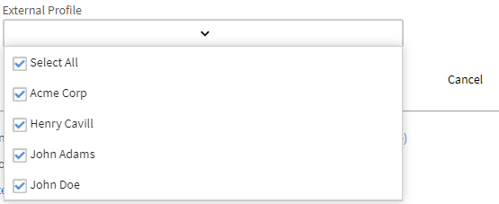
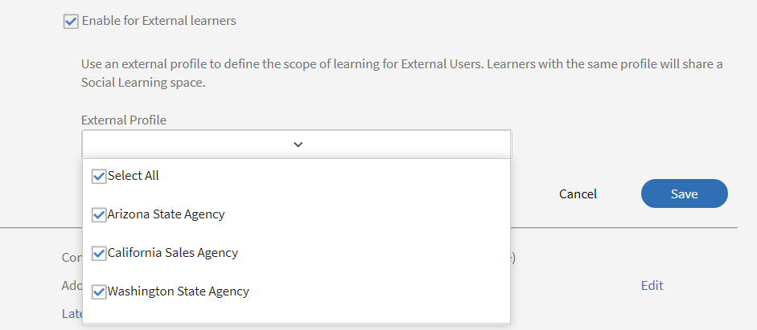

# Övervaka och moderera social utbildning som administratör

Du som är administratör kan aktivera, inaktivera och övervaka aktiviteter som utförs i Social utbildning. När funktionen för social utbildning är aktiverad kan eleverna visa den och börja delta i social utbildning.

Med social utbildning kan elever studera var som helst och dela innehåll med sina kollegor. Med den här funktionen kan elever interagera, utbyta idéer och samarbeta för att förbättra sin övergripande utbildningsupplevelse.

## Aktivera och konfigurera inställningar i social utbildning {#enableandconfiguresettingsinsociallearning}

Gör så här för att aktivera och konfigurera funktionen för social utbildning:

1. Klicka på **[!UICONTROL Social Learning]** i den vänstra navigeringspanelen. Du omdirigeras till sidan Aktivitet.
1. Aktivera funktionen **[!UICONTROL Social Learning]** med knappen **[!UICONTROL Enable]** på sidan Aktivitet om du aktiverar den för första gången. Annars kan den aktiveras från sidan **[!UICONTROL Settings]**.

   En popup-dialogruta visas som skärmbilden nedan.

    

   *Aktivera social utbildning*

<!--  -->

Administratören kan konfigurera inställningar för social utbildning. Inställningarna innehåller typer av innehållskurvor som **[!UICONTROL Manual-Only Curation]** och **[!UICONTROL No Curation]**. Omfångsinställningarna kan ställas in till ett annat omfång som användartypen (intern/extern) eller andra aktiva fält som finns på kontot. Administratören kan ange URL-sökvägen där eleverna kan hämta Adobe Learning Manager-datorprogrammet.

### Kuratering av innehåll {#contentcuration}

Eftersom social utbildning är ett informellt lärande, har den liknande funktioner som andra sociala medieplattformar. Människor tycker ofta att sociala medier är distraherande eftersom de ofta konsumerar irrelevant innehåll som påverkar deras produktivitet. Denna tanke kan tillgodoses genom moderering och kuratering av innehållet.

**[!UICONTROL Manual-Only Curation]** och **[!UICONTROL No Curation]** är två kurateringsalternativ som kan väljas av administratören.

**[!UICONTROL Auto-assisted Manual Curation]:** Learning Manager har en artificiell intelligens-baserad automatisk kurateringsmotor som på ett intelligent sätt kan ta reda på kärnan i innehållet i alla format som senare kan användas av önskade elever. Den kan också godkänna eller avvisa ett innehåll från att publiceras baserat på den angivna förtroendepoängen.

Adarsh är till exempel elev och tyckte att en blogg var intressant, så han publicerar den på Adobe Learning Manager Social Learning-plattform. Inlägget matas sedan till den AI-drivna Content Curation Engine som förutsäger de färdigheter som finns i innehållet och jämför dessa färdigheter med de tillhörande styrelsekompetenserna. Om någon av kunskaperna matchar läggs innehållet upp på annat sätt så att det skickas för endast manuell kuratering.

Minsta konfidenspoäng som krävs för publicering är 50%.

**[!UICONTROL Manual-Only Curation]:** Om du vill kontrollera innehållets äkthet innan det publiceras kan administratören aktivera inställningen för manuell kuratering. När inställningen Endast manuell kuratering har aktiverats går den till de bästa små och medelstora företagen (högst 3) för kuratering. Baserat på det genomsnittliga svaret godkänns/avvisas posten i enlighet med detta. Om svaret är större än 50 procent avvisas inlägget direkt, annars avvisas det. [Klicka här](social-learning-configurations-as-an-admin.md#SubjectMatterExpertsSMEs) om du vill ha mer information om små och medelstora företag.

I den nya omfattningen får han/hon poäng för aktiviteter över hela linjen.

På de sociala ledartavlorna kan en användare se alla användare inom hans/hennes område tillsammans med speciella användare.

Om du har fått särskilda användarbehörigheter kan du se alla användare på kontot på din resultattavla, oavsett användarnas omfång.

Om särskilda användare blir små och medelstora företag genom att få tillräckligt med poäng visas de i listan **[!UICONTROL Top Subject Matter Experts]** på den sociala resultattavlan.

Vänta i 60 minuter för att ändringarna ska börja gälla.

### Omfångsinställningar {#scopesettings}

I Social utbildning avgör ett omfång vilka tavlor du ser, som styr innehållets synlighet. Om en användare har ett omfång, till exempel ***Vendor_A***, kan användaren bara se tavlor och tillhörande inlägg som har skapats av andra som tillhör samma omfång ***Vendor_A***.

Detta gör att administratörerna kan ha en grupp användare, t.ex. leverantörer, partner eller avdelningar i en separat organisation.

Aktivera social utbildning och resultattavla för både interna och externa användare.

Det finns separata avsnitt för att aktivera interna och externa användare.

**Aktivera för interna elever**

I det här avsnittet kan du välja användarkarakteristik för att definiera omfattningen av social utbildning för interna användare. Användare med samma egenskaper **värde** delar samma område för social utbildning.

Välj önskat alternativ i listrutan **Användaregenskap**.

*Välj användaregenskaperna för att definiera omfånget*

Som standard är alternativet **[!UICONTROL All Internal Users]** i listrutan Användaregenskap alltid markerat.

Du kan ange omfång för interna användare baserat på deras aktiva fält.

**Aktivera för externa elever**

Använd en extern profil för att definiera utbildningens omfattning för externa användare. Elever med samma externa profil delar ett gemensamt socialt inlärningsområde.

*Aktivera omfång för externa elever*

Omfånget för externa användare baseras på deras externa profiler.

Om du till exempel aktiverar **[!UICONTROL Acme Corp]** kan alla elever som tillhör Acme Corp se tavlorna som de har skapat i listan ovan. Om du inaktiverar alternativet **Henry Cavill** kan eleverna inte se någon tavla som har skapats av Henry Cavill.

Administratören kan bestämma synligheten för innehållet baserat på det aktiva fält som visas i fältet **[!UICONTROL User characteristic]**.

Administratören kan till exempel ange omfattningen till **[!UICONTROL User Type (Internal/External)]** användare. När omfånget ställs in på Användartyp är det innehåll som delas på den sociala utbildningsplattformen av en intern elev endast synligt för andra interna elever i organisationen och inte för externa användare och omvänt.

När en användaregenskap har valts av administratören kan hen begränsa funktionen för social utbildning till elever och elevgrupper genom att markera kryssrutan under fältet Användaregenskap. Klicka på värdefältet för att välja den eller de elevgrupper som du vill aktivera funktionen Social utbildning för.

Som standard anges omfånget av **[!UICONTROL User Type]** som är interna eller externa elever.

Om det aktiva fältet inte innehåller något värde kommer listrutan **[!UICONTROL Value]** inte att vara synlig för administratören.

<!-- -->

Användare kan också publicera sitt innehåll med hjälp av Adobe Learning Manager-datorprogrammet. Beroende på om du använder Mac eller Windows kan du klicka på länkarna för att hämta datorprogrammet och följa anvisningarna för att installera det på datorn. [Klicka här](../../kb/troubleshooting-issues-with-adobe-learning-manager-desktop-app.md) om du har installationsproblem.

### Hämta konfigurationer {#downloadconfigurations}

<!---->

För Enterprise-servrar kan administratören ändra platsen där eleverna kan hämta datorprogrammet för både Windows och Mac.

*Ändra hämtningsplatsen*

Webbadressen för företagsservern måste vara offentlig.

### Behörigheter för att skapa tavla {#permission}

För att begränsa skapandet av tavlor för alla elever och för att moderera tavlorna effektivt, kan en administratör bevilja behörigheter att skapa tavlor för en utvald grupp användare.

*Ange behörigheter för att skapa en tavla*

Som standard är alternativet **[!UICONTROL All Learners]** aktiverat.

**[!UICONTROL All Learners]:** Om du väljer det här alternativet kan alla interna och externa användare skapa tavlor.

**En grupp elever:** Om du väljer det här alternativet kan bara användare som har behörighet att skapa en tavla se länken **[!UICONTROL Create New Board]** i Social utbildning. Välj den användargrupp som måste ges behörighet att skapa en tavla. Du kan även lägga till både automatiskt genererade och anpassade användargrupper.

<!---->

Användare som delar samma omfång kan bara se tavlan. För användare utan behörighet förblir länken **[!UICONTROL Create New Board]** osynlig.

Vänta i 60 minuter för att ändringarna ska börja gälla.

## Särskilda användare {#privilege}

En administratör kan ge särskilda behörigheter till en användargrupp, med vilken medlemmar i gruppen kan delta i alla tavlor. Eventuella begränsningar som har angetts i avsnittet Omfångsinställningar kringgås av den särskilda användargruppen.

Användargruppen kan antingen genereras automatiskt eller vara anpassad.

En användare som har fått det här privilegiet har åtkomst till alla tavlor, förutom **privata tavlor**.

*Bevilja särskilda behörigheter*

När administratören väljer en användargrupp har som standard alla användare i gruppen åtkomst till alla tavlor, oavsett användarens omfång. Alla användare med dessa utökade behörigheter kan visa och delta i alla interna och externa tavlor.

Specialanvändare får kurateringsförfrågningar i alla omfång om användarna har tillräckligt med poäng för små och medelstora företag för den kompetensen.

Om användaren inte har de SMF-poäng som krävs, överförs kurateringsbehörigheterna till de tre bästa SMF för den kompetensen.

I den nya omfattningen får han/hon poäng för aktiviteter över hela linjen.

På de sociala ledartavlorna kan en användare se alla användare inom hans/hennes område tillsammans med speciella användare.

Om du har fått särskilda användarbehörigheter kan du se alla användare på kontot på din resultattavla, oavsett användarnas omfång.

Om särskilda användare blir små och medelstora företag genom att få tillräckligt med poäng visas de i listan **[!UICONTROL Top Subject Matter Experts]** på den sociala resultattavlan.

Vänta i 60 minuter för att ändringarna ska börja gälla.

### Anpassa den sociala banderollen {#customize-social-banner}

Administratören kan anpassa titeln och undertiteln som visas i rubrikbilden på Social Learning-startsidan. Oavsett vad administratören bestämmer sig för att ange som titel och undertitel finns samma funktioner på elevens startsida för social utbildning.

1. Klicka på **[!UICONTROL Social Learning]** > **[!UICONTROL Settings]** i Admin-appen.
1. Klicka på **[!UICONTROL Customize]**.
1. Ändra banderollbilden. Bildens mått måste vara minst **1600 px X 240 px**.
1. Växla alternativet för att dölja eller visa länken **[!UICONTROL Know More]** på banderollen.
1. Ange rubriken och underrubriken i fälten som anges nedan:

   

   *Anpassa den sociala banderollen*

Det finns några andra alternativ:

* **[!UICONTROL Language]:** Välj vilket språk rubriken och underrubriken ska översättas till i listrutan. Du kan också lägga till anpassad text för olika språk.
* **[!UICONTROL Replicate]:** Klicka på den här knappen för att replikera titel och underrubrik på alla språk.
* **[!UICONTROL Reset]:** Klicka på den här knappen om du vill återgå till den ursprungliga titeln och undertiteln.

  På startsidan för Social utbildning visas informationen från administratören som sidhuvud.

  <!---->

### Vyn Social utbildning

En administratör kan välja vyn social utbildning från följande inställningar:

* Inläggsvisning - Om du väljer det här alternativet visas de enskilda inläggen på alla tavlor.
* Kortvy - om du väljer det här alternativet visas alla tillgängliga tavlor.

## Automatiskt urval av innehåll {#autocuration}

Att moderera innehåll manuellt kan ofta vara tidsödande och ge upphov till fel. Dessutom är processen inte skalbar och lämpar sig inte för stora mängder sociala aktiviteter. Därför blir kuratering av innehåll automatiskt viktigt när det används av många användare som är aktiva socialt.

I Learning Manager finns det ett alternativ för att välja ut innehåll automatiskt. Kurateringen drivs av en AI-aktiverad motor, som mappar fungerar med de fördefinierade kunskaperna, efter att administratören mappar de fördefinierade kunskaperna med en kompetens. Mer information finns i [Mappning av kompetensdomän](curation-skills.md).

I automatiskt urval kan följande typer av innehåll användas:

* PDF
* Ljud- och videofiler
* Presentations - PPT eller PPTX
* Dokument - .doc, .docx

En administratör kan aktivera alternativet att välja ut innehåll automatiskt inifrån Administratörsappen.

1. Klicka på **[!UICONTROL Social Learning]** i den vänstra rutan i Admin-programmet.
1. Klicka på fliken **[!UICONTROL Settings]** på sidan.
1. Aktivera alternativet **[!UICONTROL Auto-assisted Manual Curation]**.

   

   *Välj alternativet Automatisk handledning*

När en användare överför ett innehåll på en tavla, skrapar en AI-baserad algoritm texten från innehållet och texten överförs sedan till kurateringsmotorn. Kurateringsmotorn försöker hitta de färdigheter som finns i innehållet.

De förväntade kunskaperna från det uppladdade innehållet matchas med de på tavlan där innehållet överfördes.  Om någon kompetens matchar med en självsäkerhet poäng på mer än 50% av tavlan skicklighet, innehållet är upplagd på tavlan. Om konfidenspoängen är mindre än 50 % skickas innehållet för manuell kuratering.

När ett innehåll kurateras automatiskt får användaren ett meddelande om att innehållet är tillgängligt på tavlan där det tidigare överfördes.

*Flödesschema med kurateringsinställningar*

Vi rekommenderar att administratören lägger till små och medelstora företag för färdigheter om kuratering endast manuellt är PÅ. Administratören kan lägga till små och medelstora företag genom att i förväg ge små och medelstora företag poäng till användare som har expertis på området. [Klicka här](social-learning-configurations-as-an-admin.md#SubjectMatterExpertsSMEs) om du vill veta mer om hur du ger poäng till små och medelstora företag.

**Inget kurateringsnummer:** Alla elevens inlägg publiceras automatiskt utan någon innehållsmoderering.

<!---->

## Vanliga frågor om automatiskt urval av innehåll {#faq-auto-curation}

+++Hur lång tid har en SME på sig att kuratera ett inlägg?

Ett litet eller medelstort företag får minst 24 timmar på sig att välja ut ett inlägg. På grund av skillnader i tidszon kan den öka till 47 timmar.

+++

+++Går det till nästa omgång med tre små och medelstora företag om alla tre finns tillgängliga? Är det alltid tre små och medelstora företag som engagerar sig?

Begäran om kuratering hamnar högst upp bland de små och medelstora företagen den första dagen. Om de inte svarar går begäran vidare till de tre följande små och medelstora företagen dagen därpå.

Om de tre nya små och medelstora företagen inte svarar går begäran till moderatorerna i styrelsen.

Om tavlans moderatorer inte svarar godkänns förfrågan automatiskt.

+++

+++Om två små och medelstora företag väljer ut och ett inte gör det - hamnar begäran på det fjärde små och medelstora företaget eller motsvarar begäran genomsnittet för den första omgången små och medelstora företag som tillsätter tjänsten?

50 % godkännande krävs för att godkänna inlägget. På samma sätt används 50 % avvisande för att avvisa inlägget. Vid varje godkännande som görs av ett litet eller medelstort företag bedöms det om det har nått 50 procent.

Om den efter en dag inte når upp till 50 % skickas den till nästa grupp små och medelstora företag och upphör att gälla de tidigare obesvarade kurateringsansökningarna.

Till exempel, På den första dagen skickas kurateringsbegäran till tre små och medelstora företag, och ett av dem godkänner den, två av dem svarade inte. Nästa dag går begäran om kuratering till nästa grupp med tre små och medelstora företag. På den här nivån finns det nu totalt fyra aktiva små och medelstora företag. Minst två SEM måste godkänna det för att kurateringen ska godkännas.(Om 2 godkänner och 2 avvisar, kommer det som når först 50% att tas.)

+++

+++Från vad jag ser en &quot;moderator&quot; tilldelas endast (och det är inte obligatoriskt) när någon skapar en ny tavla - Vad är nyttan för en elev att tilldela en &quot;moderator&quot; till en tavla om små och medelstora företag kommer att tilldelas den kompetens som en styrelse är kopplad till?

Följande ansvar har en moderator för socialnämnden:

* Möjlighet att redigera kortnamn, beskrivning, inställningar för kortsynlighet och annan konfiguration.
* Möjlighet att radera ett inlägg på tavlan om inlägget inte är lämpligt för publiken.
* Moderator får meddelanden om att rapportera missbruk för tavlan.
* Moderator får begäran om kuratering om inget litet eller medelstort företag är närvarande för styrelsen.

+++

+++Vårt utbildningsteam kommer att lägga till/övervaka de färdigheter som hör till kompetensnivån samt de små och medelstora företag som har tilldelats kompetenserna.

Små och medelstora företag läggs till/tilldelas baserat på kompetens, inte kompetensnivå. Det här är som det är tänkt.

+++

+++Vad är skillnaden mellan en &quot;moderator&quot; för social utbildning och ett &quot;litet eller medelstort företag&quot; för social utbildning?

**Moderatorer:** Sekundära ägare av tavlan. De läggs till av skaparna medan styrelsen skapande av tavlan så att de kan styra tavlan i frånvaro av kreatör. Som standard är det moderatorn som skapar tavlan.

**Små och medelstora företag:** Ämnesämnesexperter är experter på specifika färdigheter. Administratörer kan tilldela små och medelstora företag en viss kompetens för att välja ut innehåll för den kompetensen. Små och medelstora företag får ta emot kurateringsförfrågningar för styrelser som är kopplade till deras kompetens. Elever kan också bli små och medelstora företag genom att få poäng för små och medelstora företag.

+++

+++Om det finns två eller tre små och medelstora företag som har tilldelats en kompetens - beror godkännande eller avslag av en tjänst för social utbildning på alla kurateringar av små och medelstora företag eller den som först kuraterar?

50 % godkännande krävs för att godkänna inlägget. På samma sätt används 50 % avvisande för att avvisa inlägget. Vid varje godkännande som görs av ett litet eller medelstort företag bedöms det om det har nått 50 procent.

Om den efter en dag inte når upp till 50 % skickas den till nästa grupp små och medelstora företag och upphör att gälla de tidigare obesvarade kurateringsansökningarna.

+++

## Trender {#trends}

Elevens sociala aktivitetstrender kan ses och spåras på fliken Aktivitet i avsnittet Trender. Dessa data kan visas för olika tidsperioder som de senaste sju dagarna, den senaste månaden, de senaste tre månaderna och all tid.

De senaste sju dagarna är standardvärdet i datumfiltret.

>[!NOTE]
>
>De senaste sju dagarna är standardvärdet i datumfiltret.

Det första visuella objektet ger administratören följande information om den tidsperiod som har valts från datumfiltret:

1. **[!UICONTROL New Posts]**: Visar antalet nya inlägg som har skapats inom datumperioden. Det totala antalet inlägg under hela perioden visas också.
1. **[!UICONTROL Percentage of Active users]**: Visar den totala procentandelen aktiva användare i social utbildning jämfört med det totala antalet användare som är tillgängliga på kontot.
1. **[!UICONTROL New Boards]**: Visar antalet nya tavlor som har skapats. Här visas även det totala antalet tavlor för hela perioden.

Den andra bilden är ett linjediagram som visar trenden för antalet tavlor eller inlägg som skapats baserat på den tidsperiod som valts från datumfiltret. Klicka på filtret för att visa de olika tidsalternativen, t.ex. de senaste sju dagarna, den senaste månaden, de senaste tre månaderna och all tid.

*Linjediagram som visar trenden*

## Kompetenser {#skills}

Du kan visa alla färdigheter som har använts i plattformen för social aktivitet i det här avsnittet. Administratören kan använda sökfältet för att leta efter en kompetens som ännu inte har använts när en anslagstavla skapas och mappa små och medelstora företag till den. Genom att utföra detta får små och medelstora företag ett meddelande när en anslagstavla skapas med denna kompetens och de kan granska inlägget som en del av det manuella kurateringsarbetsflödet.

För ett konto med Social utbildning inaktiverat visas inga färdigheter. Sökfältet är även tillgängligt för sådana konton så att administratören har möjlighet att söka efter en kompetens och lägga till små och medelstora företag i den.

Administratören kan visa aktivitetspoäng, antal inlägg, anslagstavlor, användare och namn på små och medelstora företag för varje kompetens som användes när en anslagstavla eller ett inlägg skapades.

<!---->

<table>
 <tbody>
  <tr>
   <td>
    
<b>SL. Nej.</b>
</td>
   <td>
    
<b>Kolumnnamn</b>
</td>
   <td>
    
<b>Förklaring</b>
</td>
  </tr>
  <tr>
   <td>
    
1
</td>
   <td>
    
Kompetensens namn
</td>
   <td>
    
Visar namn på kompetenser som används i Social utbildning.
</td>
  </tr>
  <tr>
   <td>
    
2
</td>
   <td>
    
Aktivitetspoäng
</td>
   <td>
    
Visar summan av aktivitetspoäng för alla tavlor som tillhör kompetensen.
</td>
  </tr>
  <tr>
   <td>
    
3
</td>
   <td>
    
Inlägg
</td>
   <td>
    
Visar det totala antalet inlägg som har skapats med en kompetens.
</td>
  </tr>
  <tr>
   <td>
    
4
</td>
   <td>
    
Tavlor
</td>
   <td>
    
Visar det totala antalet tavlor som har skapats med en kompetens.
</td>
  </tr>
  <tr>
   <td>
    
5
</td>
   <td>
    
Användare
</td>
   <td>
    
Visar det totala antalet elever som har använt den kompetensen.
</td>
  </tr>
  <tr>
   <td>
    
6
</td>
   <td>
    
SMF
</td>
   <td>
    
Visar de tre bästa små och medelstora företagen för den kompetensen. Administratören kan lägga till eller ändra små och medelstora företag genom att klicka på länken.
</td>
  </tr>
 </tbody>
</table>

## Kompetensdomän {#skilldomain}

Baserat på de färdigheter som främst används av slutanvändare av Learning Manager har Adobe Learning Manager kategoriserat en lista med 25 kompetensdomäner som används i det automatiska kurateringssystemet för att välja ut innehåll. Administratören måste mappa de konfigurerade företagskunskaperna till de kompetensdomäner som tillhandahålls av Prime. Mappningen av färdigheter kan göras från sidan Administratörskunskaper när du skapar en kompetens eller genom att ändra en befintlig kompetens. [Klicka här](skills-levels.md#Createaskillandalevel) om du vill ha mer information om hur du kartlägger eller lägger till en kompetens.

+++Lista över kompetensdomäner som används av kurateringssystemet för Learning Manager

1. Redovisning
1. Analyser
1. Affärsetik
1. Affärsrätt
1. Affärsprocess
1. Datasäkerhet
1. Hantering av kundrelationer
1. Design
1. Ekonomi
1. Personalförvaltning
1. Informationsteknik
1. Utbildning
1. Hantering
1. Marknadsföring
1. Medicin
1. Produktion och tillverkning
1. Kvalitetshantering
1. Försäljning
1. Vetenskaplig forskning och teknik
1. Sociala medier
1. Mjuka kompetenser
1. Strategisk förvaltning
1. Försörjningskedjeförvaltning
1. Teknisk kommunikation
1. Arbetsplatssäkerhet

+++

## Ämnesområdesexperter (SMF) {#subjectmatterexpertssmes}

**Ämnesområdesexperter** är personer som har stor kunskap och expertis i en kompetens. Ett **litet eller medelstort företag** spelar en viktig roll för social utbildning när administratören har angett kurateringsinställningarna som manuella eller när automatisk kuratering inte kan kuratera innehållet. Endast de tre översta små och medelstora företagen visas i kolumnen Små och medelstora företag.

## Krav på små och medelstora företag {#requirementstobeansme}

Små och medelstora företag kan endast få status genom att få poäng för små och medelstora företag genom verksamhet inom social utbildning. Administratören kan tilldela poäng till ett litet eller medelstort företag på grundval av deras sakkunskap på kompetensnivå.

## Lägga till små och medelstora företag i en kompetens {#addingsmestoaskill}

Följ de här stegen om du vill lägga till små och medelstora företag i en kompetens:

1. Klicka på **[!UICONTROL Add SMEs]** eller **[!UICONTROL Modify SMEs]**.

   

   *Lägg till eller ändra SME*

1. Klicka på **[!UICONTROL Advanced Options]** i popup-dialogrutan.

   

   *Visa dialogrutan Avancerade alternativ*

1. Sök efter användaren med kunskap om kompetensen. När användaren har hittats anger du antalet poäng du vill ge honom eller henne i inmatningsrutan **Lägg till punkter**.

   Om användaren redan har poäng läggs antalet nya poäng som användaren får till det aktuella antalet poäng.

   Som standard är den aktuella punkten 0 för varje ny användare som går över till social utbildning.

   

   *Lägg till poäng för en användare*

1. Genom att markera kryssrutan **[!UICONTROL Enable Minimum SME Points]** kan du ange en gräns för det minsta antalet poäng som en användare måste visa som ett litet eller medelstort företag i listan över de största små och medelstora företagen. När tröskelvärdet väl har fastställts är små och medelstora företag med poäng som är mindre än eller lika med det lägsta poängvärdet inte med i förteckningen över små och medelstora företag.

   Om kryssrutan **[!UICONTROL Enable Minimum SME Points]** inte markeras kommer de tre översta användarna med de högsta poängen att betraktas som små och medelstora företag för just den kompetensen.

1. Klicka på knappen **[!UICONTROL Save]** om du vill visa ändringarna.

## SMF-punktsystem {#smepointsystem}

**Små och medelstora företag tilldelas poäng baserat på följande:**

* 2 poäng ges till en användare varje gång en annan användare stödjer ett inlägg som skapats av honom / henne.
* 2 poäng ges till en användare varje gång en annan användare uppdaterar sin kommentar.
* 5 poäng ges till en elev för att svara på en fråga.
* 2 poäng ges till eleven varje gång svaret ges en uppröst.

## Statuspoäng för små och medelstora företag baserat på kurateringsaktivitet {#smestatuspointsbasedoncurationactivity}

**Små och medelstora företag tilldelas ett antal poäng som också baseras på kurateringsaktiviteter för följande:**

* När ett inlägg skickas för manuell kuratering eftersom den automatiska kurateringen inte är säker på om innehållet är relevant eller inte, får SME 5 poäng vid inlämning av moderering.

## Sociala aktiviteter för månatligt aktiva användare, faktureringsplan {#socialactivitiesformonthlyactiveusersbillingplan}

Varje gång en användare skapar en ny anslagstavla för sociala medier, inlägg på sociala medier eller en social kommentar räknas den som giltig aktivitet som räknas av från MAU-planen (**Monthly Activation User**) om kontot följer MAU-faktureringsmodellen. Mer information finns i [faktureringshantering](billing-management.md).

## Vanliga frågor {#frequentlyaskedquestions}

+++Hur möjliggör man social inlärning för externa elever?

Aktivera alternativet **[!UICONTROL Enable for External learners]** i avsnittet Omfångsinställningar i **[!UICONTROL Social Learning]** > **[!UICONTROL Settings]**. I listrutan väljer du en extern profil och definierar utbildningens omfattning för den profilen.

*Välj alternativet Aktivera för externa elever*
+++
