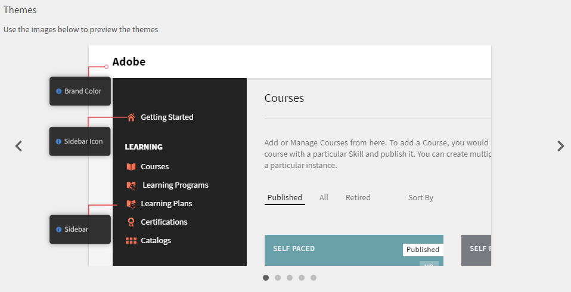

# Färgteman

Färgteman och varumärken i Learning Manager

Med Learning Manager kan du ändra utseendet på appen för att matcha din organisations krav på varumärken.

## Varumärkning {#branding}

Klicka **[!UICONTROL Branding]** i den vänstra rutan om du vill uppdatera ditt organisationsnamn ändrar du underdomänen samt loggstilar och teman. Klicka **[!UICONTROL Edit]** ändra innehållet bredvid varje ämne.

## Formatera logotyp {#logostyling}

Klicka **[!UICONTROL Edit]** för att ställa in utseendet på din logotyp och ditt företagsnamn i Learning Manager-programmet.

Klicka **[!UICONTROL Upload new logo]** och välj logotypen på datorn att ladda upp. Du kan förhandsgranska logotypens utseende och organisationens namn nedan. Välj en rubrikstil och klicka på **[!UICONTROL Save]**.

## Teman {#themes}

En uppsättning med fem representativa bilder tillhandahålls för att förhandsgranska dina färgtemaändringar innan du tillämpar dem på ditt program. Bläddra igenom bilderna genom att klicka på symbolerna &lt; och > till vänster och höger om bilderna för att förhandsgranska dem. Du kan också klicka i navigeringscirklarna längst ned i de här bilderna för att bläddra igenom uppsättningen med förhandsvisningsbilder.

**Välj ett tema**

Klicka på **[!UICONTROL Show hints]** nedanför det här avsnittet för att visa bildtipsen som visas nedan.

*Visa tips för ett tema*

Learning Manager-programmet erbjuder fem färgtemaalternativ för användare:

* Prime-standard
* Stenar
* Karneval
* Höst
* Vinterhimmel
* Klart

*Anpassa färger i ett tema*

Du kan anpassa färg på den översta raden, accentfärg (till exempel ikonfärg i den vänstra rutan), primärfärg och intensitet på sidofält för teman förutom standardtemat.

I dialogrutan **[!UICONTROL Primary color]** -väljaren kan du välja den färg som används för det integrerande användargränssnittet.

Om du vill anpassa väljer du tematyp i den vänstra rutan och klickar på rutorna bredvid varumärkets färg och sidopanelens ikonfärger. Klicka på sidofältet i sidofältets ljusstyrka, dra framåt eller bakåt för att justera ljusstyrkan. Titta på förhandsvisningen i bilderna ovan när du ändrar dessa alternativ.

Klicka **[!UICONTROL Reset Theme]** för att återställa temats ursprungliga inställningar. Klicka **[!UICONTROL Save]** efter att du slutfört ändringarna.

**Direktförhandsvisning**

Klicka **[!UICONTROL Live Preview]** längst ned till vänster i avsnittet Teman. Ett popup-fönster visas enligt nedan:

*Popup-fönstret Direktförhandsvisning*

Välj önskat tema i listrutan, justera inställningarna och klicka på **[!UICONTROL Preview]** för att se ändringarna direkt i programmet. Nu kan du gå igenom alla funktioner i programmet och bevittna ändringarna. Du kan också ändra dina roller när du går igenom förhandsvisning i realtid. När du är nöjd med ändringarna kan du återgå till popup-funktionen för förhandsvisning av live-tema och klicka på **[!UICONTROL Apply Theme]**.

Medan du förhandsgranskar ändringarna live visas popup-fönstret för direktförhandsgranskning av tema fortfarande längst ned på skärmen. Du kan välja att minimera popup-fönstret.

## Anpassa ditt konto {#customize}

Med Adobe Learning Manager kan du anpassa ditt konto för att ge en förbättrad användarupplevelse.

I listan nedan visas de komponenter som kan anpassas. Kontakta Learning Manager för att anpassa kontot  [hålla uppe](mailto:captivateprimesupport@adobe.com).

<table>
 <tbody>
  <tr>
   <td>
    
<b>Anpassa</b>
</td>
   <td>
    
<b>Vad rekommenderas</b>
</td>
  </tr>
  <tr>
   <td>
    
Anpassa färger på utbildningskort
</td>
   <td>
    
 

    <ul>
     <li>Högst 12 egna färger. </li>
     <li>Färger tillämpas på alla utbildningsobjekt. Färgerna kommer att appliceras sekventiellt på alla utbildningsobjekt (utbildningar) och den hexadecimala färgkoden är det format som krävs för alla färger,#ffffff.</li>
     <li>Om bara en färg anges används den färgen på alla utbildningsobjekt.</li>
    </ul>
    
 
</td>
  </tr>
  <tr>
   <td>
    
Bild för markörpekare
</td>
   <td>
    
Den anpassade bilden visas när användaren hovrar över ett utbildningsobjekt. 

    <ul>
     <li>Anpassad bild som används visas när användaren för musen över Learning Manager-webbsidan. </li>
     <li>Rekommenderad storlek - 16 × 16 eller 24 × 24 px</li>
     <li>Rekommenderat bildformat - PNG, JPG</li>
    </ul></td>
  </tr>
  <tr>
   <td>
    
Förloppsikonbild
</td>
   <td>Visas när du navigerar mellan sidor. Finns på platser där du ser den "4-kvadratiska" förlopp gif. 
    <ul>
     <li>Rekommenderad storlek - högst 32 × 32 px</li>
     <li>Rekommenderat bildformat - GIF, PNG, JPG</li>
    </ul>
    
 
</td>
  </tr>
  <tr>
   <td>
    
Teckensnitt
</td>
   <td>
    
Om du vill använda teckensnitten måste du ha ett CDN. Dessutom måste du dela teckensnittsfamiljen som ska användas.

    
<b>Obs!</b> Teckensnittsfamiljen måste stödjas i alla webbläsare.
</td>
  </tr>
  <tr>
   <td>
    
Bakgrundsbild
</td>
   <td>
    
En bakgrundsbild syns bara i elevrollen. 

    
Du måste ha bilden som du behöver för att ansöka till elevens bakgrund.

    <ul>
     <li><b>Rekommenderat bildformat:</b> PNG, JPG, JPEG</li>
     <li><b>Rekommenderad storlek: </b>1 400 × 908 px</li>
    </ul></td>
  </tr>
 </tbody>
</table>

## Konfigurera rekommendationsinställningar {#configurerecommendationsettings}

På **Varumärkning** > **Allmänt** kan du konfigurera rekommendationsomfattningar för interna och externa elever och göra det möjligt för elever att välja färdigheter på elevens startsida.

På fliken **Allmänt** -sidan har du följande alternativ:

<table>
 <tbody>
  <tr>
   <td>
    
Elevens startsida
</td>
   <td>
    
Välj endera <strong>Klassisk </strong>eller <strong>Integrerande</strong>. Om du väljer Immersive visas andra alternativ.
</td>
  </tr>
  <tr>
   <td>
    
Utbildningstyp 
</td>
   <td>
    
Välj endera <strong>Egen </strong>eller <strong>Branschanpassad</strong>. Om det finns färre än 1 000 elever betraktas hela kontot som ett enda scope. Rekommendationen är baserad på alla elever. 
</td>
  </tr>
  <tr>
   <td>
    
Inställning av rekommendationsomfattning 
</td>
   <td>
    
Välj ett eller flera aktiva fält. För <strong>Egen</strong>, kan du välja högst ett aktivt fält. För <strong>Branschanpassad</strong>kan du välja högst fem aktiva fält. 
</td>
  </tr>
  <tr>
   <td>
    
Låt eleven utforska intresseområden
</td>
   <td>
    
Endast för klassisk användning. Välj <strong>Ja </strong>eller <strong>Nej</strong>. 
</td>
  </tr>
  <tr>
   <td>
    
Uppmana användare att välja intresseområden (kompetenser)  
</td>
   <td>
    
Endast för en uppslukande upplevelse. Välj <strong>Ja</strong> eller <strong>Nej</strong>. 
</td>
  </tr>
 </tbody>
</table>
