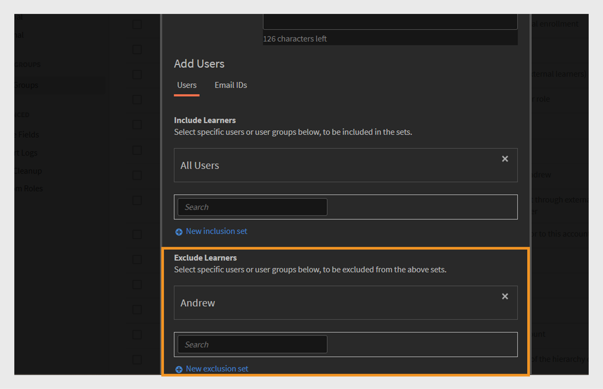

# Användargrupper i Adobe Learning Manager

Med hjälp av användargrupper i Adobe Learning Manager kan du ordna elever utifrån vanliga attribut som avdelning, plats eller roll. Genom att gruppera användare blir det enklare att tilldela kurser, hantera behörigheter och spåra utbildningsförloppet för flera användare samtidigt.

>[!INFO]
>
>Titta på den här ALM Academy-utbildningen och lär dig skapa en användargrupp utifrån namn, e-post-ID och kombinera flera automatiskt genererade användargrupper.   

## Typer av användargrupper

Adobe Learning Manager stöder följande användargrupper:

1. **Automatiskt genererade användargrupper:** I Adobe Learning Manager skapas vissa användargrupper automatiskt utifrån användarroller och attribut. Dessa systemdefinierade grupper omfattar Alla författare, Alla administratörer, Alla elever och Alla hanterare. Adobe Learning Manager genererar dessa grupper för att hjälpa till att ordna användare efter roll. Du kan inte byta namn på eller ta bort dessa systemdefinierade grupper.

2. **Anpassade användargrupper:** I Adobe Learning Manager kan administratörer skapa anpassade användargrupper för att organisera elever baserat på specifika villkor. Dessa grupper är dynamiska och lägger automatiskt till användare som uppfyller de definierade villkoren. Anpassade grupper hjälper till att tilldela riktade utbildningsvägar, tillämpa anpassade varumärken och generera fokuserade rapporter. De är ett flexibelt verktyg för att hantera och anpassa utbildningsupplevelsen.

## Skapa en anpassad användargrupp

Administratörer skapar användargrupper manuellt för att ordna användare baserat på definierade attribut. Dessa grupper kan vara dynamiska och automatiskt lägga till användare som uppfyller de angivna villkoren. Användargrupper förenklar uppgifter som att tilldela utbildningsvägar, använda anpassade varumärken och generera målinriktade rapporter.

Så här skapar du en anpassad användargrupp:

1. Välj **Användare** på administratörens startsida.
2. Välj **Användargrupper** och välj sedan **Lägg till**.

   
   _Knapp för att lägga till en ny användargrupp på sidan Användargrupper_

3. Skriv gruppnamnet och beskrivningen.

   
   _Inmatningsfält för att ange gruppnamn och valfri beskrivning_

## Lägg till användare i användargruppen

Administratörer kan lägga till användare i en användargrupp på två sätt:

### Avsnittet Användare

Administratörer kan använda uppsättningarna med inkludering och undantag för att lägga till och ta bort användare eller användargrupper i avsnittet Användare.

* **Inkluderingsuppsättningar** lägger till användare i en anpassad användargrupp. Du kan inkludera en eller flera användargrupper, och Adobe Learning Manager använder logik (AND/OR) för att bestämma vilken användare som ska inkluderas. Se det här [avsnittet](#_Inclusion_and_exclusion) om du vill veta mer om OCH/ELLER logik.
* **Undantagsuppsättningar** tar bort användare från gruppen, även om de ingick i inkluderingsuppsättningen. Detta förfinar gruppens användarlista.

Så här lägger du till användare i gruppen:

1. Sök efter och välj användare eller befintlig användargrupp i fältet **Inkludera elever**.

_Inkluderingsinställningar för att lägga till specifika användare eller grupper i en anpassad användargrupp_

### Avsnittet E-post-ID

1. Skriv användarens e-postadresser i ett komma-, semikolon- eller radbrytningsformat för att lägga till användarna i gruppen.

2. Välj **Validera e-post-ID:n**.

   
   _Välj Validera e-post-ID för att validera de angivna e-post-ID:n_

   Du får ett felmeddelande om Adobe Learning Manager inte har e-post-ID eller om e-post-ID:t är felaktigt.

   
   _Fält för att ange flera e-postadresser manuellt för att lägga till användare i en grupp_

3. Välj **Spara** för att skapa gruppen.

## Uteslut användare från gruppen

Administratörer kan utesluta specifika användare från en användargrupp även om de uppfyller gruppens kriterier. Detta är praktiskt om du vill göra undantag, t.ex. förhindra att vissa användare får tilldelade kurser eller visas i rapporter som är länkade till den gruppen.

Om du vill utesluta specifika användare eller hela användargrupper när du skapar en anpassad användargrupp:

1. Välj en **användargrupp** och välj sedan **Lägg till**.
2. Gå till avsnittet **Uteslut elever**.
3. Välj de användare eller grupper du vill utesluta.

_Undantagsinställningar för att ta bort användare eller grupper från en anpassad grupp_

## Visa gruppmedlemmar

Administratörer kan visa en lista över användare i en användargrupp, inklusive information som namn, e-post-ID och status. Så här visar du listan med användare:

1. Välj **Användare** och sedan **Användargrupper**.
2. Markera en grupp och välj sedan värdet i **Nej. av kolumnen Personer**.

_Lista över användare som för närvarande ingår i en vald användargrupp_

_Lista över tillgängliga användare i den valda användargruppen_

## Hämta gruppmedlemmar

Administratörer kan hämta en lista över gruppmedlemmar för att granska användarinformation, inklusive namn, e-post, status, datum då den lades till (tidszonen UTC), borttagningsdatum (tidszonen UTC) och senaste inloggningsdatum (tidszonen UTC). Detta underlättar spårning, rapportering och granskning av gruppmedlemskap.

1. Välj **Användare** och sedan **Användargrupper**.
2. Välj hämtningsikonen bredvid en grupp för att exportera rapporten som en CSV-fil.

_Ladda ned en ikon för att exportera gruppmedlemsdata som en CSV-fil_

Nedan visas kolumnerna i gruppmedlemsrapporten:

* **Namn**: Användarens namn
* **E-post**: Användarens e-post-ID
* **Status**: Användarens status (registrerad eller inte registrerad).
* **Tillagd datum (tidszonen UTC)**: Datum då användaren lades till i tidszonen UTC.
* **Borttagningsdatum (tidszonen UTC)**: Det datum då användaren togs bort i tidszonen UTC.
* **Senaste inloggningsdatum (tidszonen UTC)**: Det datum då användaren senast loggade in i tidszonen UTC.

_Exempel-CSV innehåller användarinformation_

## Redigera en användargrupp

Administratörer kan redigera en grupp för att ändra dess namn, beskrivning eller annan information.

Så här redigerar du en användargrupp:

1. Välj **Användare** på administratörens startsida.
2. Välj **Användargrupper**.
3. Välj den användargrupp som du vill redigera.
4. Gör nödvändiga ändringar, som att uppdatera namnet, beskrivningen eller andra uppgifter.
5. Välj **Spara** för att tillämpa ändringarna. Ändringarna tillämpas på användargruppen.

_Fält för att ändra användargruppens namn, beskrivning eller medlemskapsregler_

## Radera en användargrupp

Administratörer kan ta bort användargrupper som inte längre behövs för att hålla grupplistan organiserad och uppdaterad.

Så här tar du bort en användargrupp:

1. Välj **Användare** och sedan **Användargrupper**.
2. Markera gruppen som du vill ta bort.
3. Välj **Åtgärder** och välj sedan **Ta bort**.

   
   _Alternativet Ta bort på menyn Åtgärder om du vill ta bort en användargrupp_

4. Bekräfta borttagningen när du uppmanas till det. Användargruppen tas bort.

## Hämta användargruppsrapport

Adobe Learning Manager användargruppsrapporter ger administratörer och chefer insikter i olika användargruppers prestanda, t.ex. avdelningar, roller eller externa partner. Dessa rapporter möjliggör jämförelser mellan grupper för att bedöma utbildningsframsteg, slutförandegrad för kurser och engagemangsnivåer.

Så här hämtar du rapporten:

1. Välj **Användare** och sedan **Användargrupper**.
2. Välj **Åtgärder** och välj sedan **Hämta användargruppsrapport**.

_Alternativ för att hämta information och metadata på gruppnivå från menyn Åtgärder_

Rapporten innehåller följande:

| Kolumn | Beskrivning |
|---|---|
| Typ av användargrupp | Användargruppens kategori, till exempel automatiskt genererad eller anpassad grupp. |
| Namn | Namnet som tilldelats användargruppen. |
| Beskrivning | En kort förklaring av användargruppens syfte eller omfattning. |
| Skapad av (namn) | Det fullständiga namnet på administratören som skapade gruppen. |
| Skapad av (e-post) | E-postadressen till administratören som skapade gruppen. |
| Skapad den (tidszonen UTC) | Datum och tid då gruppen skapades visas i UTC (Coordinated Universal Time). |
| Antal användare | Det totala antalet användare som för närvarande ingår i gruppen. |

_Användargruppsrapporten innehåller alla fält_

## Regler för inkludering och uteslutande för att skapa anpassade användargrupper

När du skapar en **anpassad användargrupp** genom att lägga till automatiskt genererade eller befintliga användargrupper tillämpar Adobe Learning Manager specifika **regler för inkludering och uteslutning** baserat på **OCH/ELLER logik**. Dessa regler beror på hur användargrupper kombineras i uppsättningarna Inkludering och Uteslutning.

Du kan lägga till en eller flera automatiskt genererade användargrupper i inkluderingsuppsättningen. Vilken logik som tillämpas beror på hur du markerar dessa grupper:

### Användning och logik i användargrupper

Om du väljer flera användargrupper i samma inkluderingsuppsättning måste användarna uppfylla alla villkor för att inkluderas.

Exempel:

* Säljteamgrupp: 120 användare
* Plats (Bangalore) grupp: 80 användare
* Vanliga användare i **båda** grupperna: 40 användare

Adobe Learning Manager använder OCH-logik för att skapa en grupp med endast 40 användare. Dessa användare ingår i säljteamet och finns också i Bangalore, uppfyller båda villkoren.

_Exempel som visar flera grupper tillsammans med AND-logik_

### Använda OR-logik i användargrupper

Om du lägger till användargrupper i separata inkluderingsuppsättningar inkluderas användare som uppfyller alla villkor. Exempel:

* Säljteamgrupp: 120 användare
* Plats (Bangalore) grupp: 80 användare
* Totalt antal användare i någon av grupperna: 160 användare (vissa användare kan finnas i båda grupperna)

När du använder OR-logik lägger Adobe Learning Manager till användare som antingen finns i säljteamet eller i Bangalore. Det innebär att det inkluderar användare som matchar något av de två villkoren. Därför ingår 160 användare i gruppen efter att dubbletter har tagits bort.

_Exempel som visar flera grupper kombinerat med OR-logik_

