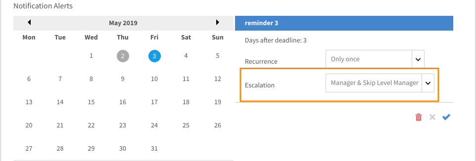

# Meddelanden

Aviseringsfunktionen gäller alla användare av Adobe Learning Manager. Men varje användare baserat på sin roll får olika typer av meddelanden i olika scenarier. Alla aviseringar och meddelanden till användare visas i popup-dialogrutan Aviseringar.

## Åtkomstmeddelanden {#accessnotifications}

Användare kan se meddelanden genom att klicka på aviseringsikonen i det övre högra hörnet av fönstret. Den här popup-dialogrutan visar markeringar av alla meddelanden tillsammans med tidpunkten för förekomsten med en rullningslist. Om du vill visa mer information om alla meddelanden klickar du på Visa alla meddelanden längst ned i popup-dialogrutan. Sidan Meddelanden visas.

Du kan känna till antalet senaste meddelanden med det markerade numret högst upp i aviseringsikonen. Om det till exempel finns fem senaste meddelanden efter din föregående inloggning, kan du se siffran 5 visas ovanpå aviseringsikonen. Dessa siffror försvinner när du läser alla de senaste meddelandena.

## Typer av meddelanden för administratörer {#typesofnotificationsforadministrators}

Administratörer får meddelanden i följande fall:

* När en csv-lista med användare har överförts.
* När överföringen av en CSV-lista med användare misslyckas. Administratören får ett meddelande med orsaken till felet.
* Administratören kan också ställa in aviseringsaviseringar på instansnivå för kurser och utbildningsprogram. I det här fallet får administratören meddelandena baserat på den frekvens som valts på instansnivå.

>[!NOTE]
>
>Om en administratör har författar- eller chefsbehörighet utöver sin roll får administratören meddelanden om varje roll.

Ett exempel på meddelandefönster för administratörsrollen visas i följande skärmbild:

*Visa administratörsmeddelanden*

Det här popup-fönstret visar markeringar av alla meddelanden tillsammans med tidpunkten för förekomsten och en rullningslist. Du kan ta reda på antalet senaste meddelanden baserat på det markerade numret högst upp på aviseringsikonen. Om det till exempel finns fem senaste meddelanden efter din föregående inloggning, kan du se siffran 5 visas ovanpå aviseringsikonen. Dessa siffror försvinner när du läser alla de senaste meddelandena.

Klicka **[!UICONTROL Show all notifications]** längst ned i popup-fönstret för meddelanden för att visa alla meddelanden på en separat sida.

## Ställ in eskaleringsmeddelanden för flera nivåer {#setupmultilevelescalationnotifications}

Eskalering av e-postmeddelanden när elever missar en deadline kan skickas till chefen och en skippansvarig. Du kan konfigurera eskaleringsmeddelanden på flera nivåer för icke-slutförande av kursen under processen med att skapa en kurs, eller till och med efter att den har skapats. Eskalering av meddelanden kan ställas in så att de skickas med en angiven frekvens till en chef eller en överhoppningshanterare.

1. Logga in som Administratör eller Författare och klicka på Kurser.
1. Välj kursen som du vill ändra eskaleringsmeddelandena för och klicka på **[!UICONTROL View Course]**.

   

   *Välj alternativet Visa kurs*

1. Klicka på **[!UICONTROL Instances]** > **[!UICONTROL Notification Alerts]**.

   

   *Välj alternativet Aviseringar*

1. En kalender öppnas som anger den inställda tidsgränsen för kursen markerad med rött. Klicka på det markerade datumet för att se påminnelserna inställda för eleven.

   

   *Visa påminnelser om deadline*

1. Ställ in påminnelser genom att välja datum före deadline. Detta gör att du kan ställa in påminnelser för eleven om den annalkande deadline.

   

   *Ange ett påminnelsedatum för deadline*

1. Välj ett datum efter deadline för att ställa in ett schema med påminnelser för eleven och eskaleringsmeddelanden till chefen.

   

   *Ange påminnelser och eskaleringsdatum*

1. Om eleven fortfarande inte lyckas slutföra kursen även efter eskalering till chefen, kan inställningarna eskalera till elevens skip manager. Klicka på ett datum efter den förlängda tidsgränsen, välj upprepning av påminnelser, antal dagar för schemat och välj **Chef och överhoppad chefsnivå** i **Eskalering** Listruta. Klicka på den blå bockmarkeringen för att spara aviseringsinställningarna.

   

   *Spara meddelandeinställningarna*

## Vanliga frågor {#frequentlyaskedquestions}

+++Hur ställer du in påminnelsemeddelanden på instansen?

Klicka på Meddelandeaviseringar för en instans. En kalender öppnas som anger den inställda tidsgränsen för kursen markerad med rött. Klicka på det markerade datumet för att se påminnelserna inställda för eleven. Ställ in påminnelserna som förklaras i det här [avsnitt](user-notifications.md#Setupmultilevelescalationnotifications).
+++
