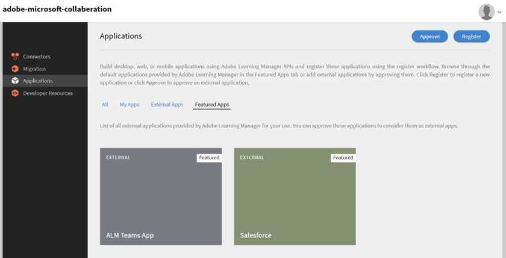

# Adobe Learning Manager-app för Microsoft Teams

## Så konfigurerar du

Att konfigurera ALM i MS Teams innebär tre steg och kräver hjälp från ALM-administratören och Microsoft Azure Administrator. I vissa organisationer är Azure Administrator och MS Teams-administratörer inte desamma och därför krävs det ytterligare MS Teams-administratörer också.

**ALM-administratör - integrationsadministratörsrollen godkänner teamappen**

När integreringsadministratören har godkänt MS Teams-appen är Adobe Learning Manager-appen tillgänglig i MS Teams-appbutiken, och eleverna har tillgång till den. Appen kommer dock inte att ha meddelanden, tyst inloggning och appen kommer inte att vara fäst för eleverna i MS Teams.

**Microsoft Azure-administratören godkänner behörigheten för ALM-appen i Azure-instrumentpanelen**

Azure-administratören måste godkänna de behörigheter som krävs för ALM-appen. Detta gör att ALM-appen kan skicka meddelanden till MS Teams och tillåta tyst inloggning. Vid tyst inloggning behöver användare inte logga in separat på Adobe Learning Manager i webbläsaren.

**MS Teams-administratör skapar en policy för ALM-team**

MS Teams-administratören i administrationscentret bör fästa ALM-appen hos alla sina användare och tillåta det som en global policy. Om ALM bara används av en viss grupp i företaget måste MS Teams-administratören välja en anpassad policy och endast tillämpa den på den specifika gruppen.

## Integreringsadministratörsrollen godkänner Teams-appen

Följ stegen nedan:

1. I programmet Integreringsadministratör väljer du **[!UICONTROL Applications]** > **[!UICONTROL Featured Apps]** och välj **[!UICONTROL ALM Teams app]**.

   
   *Välj ALM Teams-app*

1. I det övre högra hörnet på skärmen väljer du **[!UICONTROL Approve]**.

   
   *Välj Godkänn på sidan Programinställningar*

1. Välj **[!UICONTROL OK]** i dialogrutan som visas.

   
   *Välj OK efter godkännande*

1. När den har godkänts kan du se ALM Teams-appen i avsnittet Externa appar.

   
   *ALM Teams-appen visas på sidan Program*

Nu kan användarna få åtkomst till ALM-appen i MS Teams.

## Microsoft Azure-administratören godkänner behörigheten för ALM-appen i Azure-instrumentpanelen

Följ stegen nedan:

1. Du som är Azure-administratör går till avsnittet Hantera Azure Active Directory på Azure-kontrollpanelen.

   
   *Starta Azure-instrumentpanelen*

1. Klistra in följande länk i ett separat webbläsarfönster:

   `https://login.microsoftonline.com/<tenantIdTobeReplaced>/oauth2/authorize?client_id=8d349d9f-bf59-4ece-8022-a41e87d81903&response_type=code&redirect_uri=https://learningmanager.adobe.com`

1. I länken ovan ersätter du `<tenantIdTobeReplaced>` med klientorganisations-id:t tillgängligt på sidan Översikt nedan. Ange den nya URL:en.

1. Lägg till Adobe Learning Manager-appen i dina Azure-program.

   
   *Lägg till i Azure*

1. Välj fliken Företagsprogram och välj Alla program. Du kommer att se ALMTeamsApp anges där.

   
   *Visa ALM-appen*

1. Klicka på programmet och gå till fliken Behörigheter.

   
   *Visa fliken Behörigheter*

1. Välj på fliken Behörigheter **[!UICONTROL Grant admin consent for MSFT]**&quot; för att ge behörigheter till ALM-teamprogram.

   
   *Välj behörigheter*

1. Välj **[!UICONTROL Accept]**.

   
   *Välj Acceptera*

1. När de här behörigheterna har beviljats ger de ALM-appen möjlighet att tillåta tysta inloggningar och skicka meddelanden till eleverna i MS Teams-appen.

   
   *Åtkomst har beviljats*

## MS Teams-administratören skapar en policy för Teams-programmet

Följ stegen nedan:

1. Du som är administratör för MS Teams kan skapa en policy för att lägga till Teams-appen i elevens Teams-app i Admin Center.

   
   *Skapa en profil*

1. Gå till avsnittet Konfigurera principer. Skapa en global profil och välj **[!UICONTROL Add apps]** i underavsnittet Fästa appar.

   
   *Lägg till principen*

1. I följande dialogruta söker du efter **[!UICONTROL Adobe Learning Manager]** och lägg till programmet. Då läggs Adobe Learning Manager till i avsnittet Installerade appar.

   
   *Installera appen*

1. Spara principen. Det gör att appen är tillgänglig för alla i organisationen.

Administratörer kan också skapa en anpassad policy i stället för en global policy. Lägg till Adobe Learning Manager till den anpassade policyn och tillämpa sedan den anpassade policyn på endast de användare som behöver få tillgång till Adobe Learning Manager.
