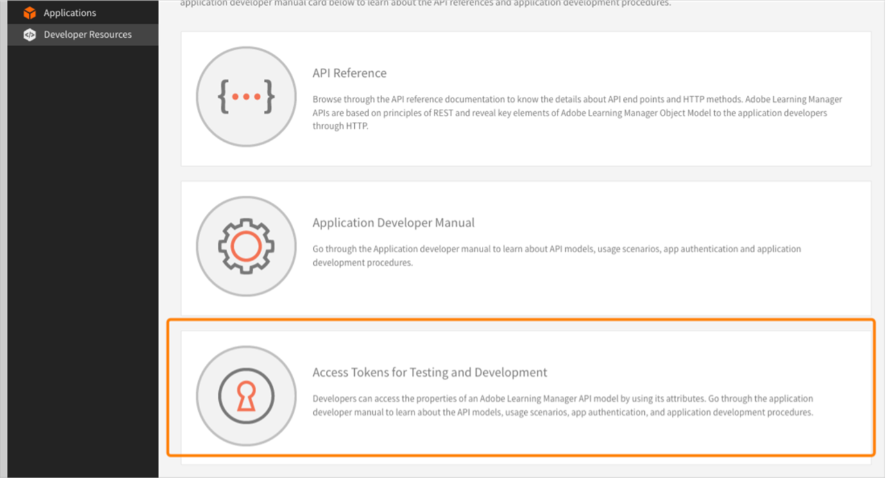
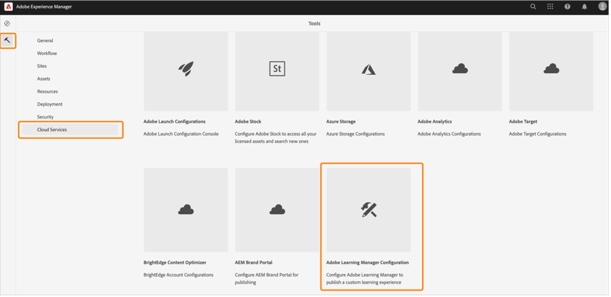

# Referenspaket för Adobe Learning Manager (ALM-referensplats) för AEM Sites

Adobe Learning Manager (ALM) integreras med Adobe Experience Manager-webbplatser (AEM). Detta gör att du kan skapa din egen webbplats och responsiva mobilgränssnitt för Adobe Learning Manager med minimal kodning ansträngning. Med denna integrering kan du skapa anpassade utbildningsupplevelser för dina användare.

För att skapa en sådan upplevelse tillhandahåller ALM ett referenspaket för Adobe Learning Manager (ALM-referenspaket för webbplats) för AEM Sites i form av en ZIP-fil som du kan installera på din AEM Sites-instans.

Paketet innehåller webbsidesmallar och webbplatskomponenter från AEM Sites tillsammans med inbäddningsbara widgetar, t.ex. Utbildningskatalog, inbäddade widgetar, kalender och så vidare.

När du har installerat ALM-referenspaketet kan du börja skapa en webbplats för Adobe Learning Manager som du kan vara värd för på din AEM Sites-instans. Användarna kan sedan dra och släppa komponenterna på webbplatsen.

Installera ALM-referensplatspaket

## Krav

* Licenser för AEM Sites och Adobe Commerce.
* AEM On-premise 6.5 eller Adobe Experience Manager - Cloud Service
* Adobe Commerce 2.4.3

När du har skyddat AEM Sites-miljön måste du installera ALM-referenspaketet. Detta paket innehåller AEM-webbsidor och webbplatskomponenter som hjälper dig att konstruera utbildningsplattformen.

Referenswebbplatspaketet finns på [**GitHub-databas**](https://github.com/adobe/adobe-learning-manager-reference-site/releases/tag/1.0.0).

Mer information finns i filen VIKTIGT.

## Skapa ett program i [!DNL Adobe Learning Manager]

När du har installerat AEM-webbplatspaketet måste du konfigurera ett ALM-program för att ansluta utbildningsportalen till AEM-webbplatsen.

Detta scenario är tillämpligt när AEM används med [!DNL Adobe Learning Manager].

Följ stegen nedan:

1. Som integrationsadministratör klickar du på **[!UICONTROL Applications]**.
1. Om du vill skapa ett nytt program klickar du på i det övre högra hörnet på sidan **[!UICONTROL Register]**.
1. Ange följande information på skärmen Registrera ett nytt program:

   1. Programnamn: Namnet på programmet som du skapar.
   1. URL: Din organisations URL.
   1. Omdirigeringsdomäner: Värddomänerna för AEM-webbplatsen. Du kan även använda jokertecken.
   1. Beskrivning: Beskrivning av programmet.
   1. Omfång: Välj läsåtkomst för elevrollen och elevrollen skrivåtkomst.
   1. Endast för det här kontot?: Välj Ja om du vill använda programmet för det befintliga ALM-kontot.

1. När du har gjort ändringarna klickar du på Spara.

Anteckna programautentiseringsuppgifterna från skärmen.

*Programautentiseringsuppgifter*

Klicka på för att godkänna programmet. **[!UICONTROL Approve]**.

## Hämta token

1. Klicka på på fliken Utvecklarresurser **[!UICONTROL Access Tokens for Testing and Development]**.

   

   *Välj åtkomsttoken för testning och utveckling*

1. Ange följande uppgifter:

   
   *Ange tokeninformation*

   1. Hämta OAuth-kod: Ange klient-ID från föregående avsnitt och ändra omfånget. Klicka på Skicka för att få OAuth-koden.
   1. Hämta uppdateringstoken: Ange klient-ID:t och hemligheten från föregående avsnitt. Ange även OAuth-koden som du fick från föregående steg. Klicka på Skicka.
   1. Hämta åtkomsttoken: Ange klient-ID:t och hemligheten från föregående avsnitt. Ange även uppdateringstoken som du fick från föregående steg. Klicka på Skicka.
   1. Hämta information om åtkomsttoken: Ange den åtkomsttoken som du fick i det föregående steget. Klicka på Skicka.

1. Du kan hämta informationen från JSON-svaret som följer. Svaret består av åtkomsttoken, uppdateringstoken, användarroll, konto-ID, användar-ID och hur lång tid som förfaller. Notera uppdateringstoken eftersom du kommer att återanvända den.

## Konfigurera ALM-konto i AEM

1. Starta din AEM-instans.
1. Klicka på Inställningar > Cloud Service.
1. Klicka på Konfiguration av Adobe Learning Manager.

   
   *Välj konfiguration för Adobe Learning Manager*

1. Klicka på Skapa > Konfigurationsmapp. Ge mappen ett namn.

   
   *Skapa konfiguration*

1. Välj den konfiguration du skapade i utbildningsprojektet.

1. Ange konfigurationsinformation.

   
   *Skapa konfigurationsmapp*

   1. Läge för Adobe Learning Manager: Välj hur du vill att elever som är inloggade och inte inloggade ska få utbildningsupplevelsen.
   1. URL till Adobe Learning Manager: Ange URL:en till ALM-instansen där utbildningstjänsterna finns.
   1. Konto-ID: ID för ALM-kontot.
   1. Klient-ID, Klienthemlighet och Författarens uppdateringstoken: Ange de autentiseringsuppgifter du fick när du skapade programmet i ALM.
   1. Anpassning av Widget: Mer information finns i [Integrera med AEM](/help/migrated/integrate-aem-learning-manager.md) `.`

1. Spara och stäng konfigurationen.

### AEM + Adobe Learning Manager (inloggade/ej inloggade användare)

Med Adobe Learning Manager kan du nu visa upp dina produkter och din utbildning för befintliga och potentiella kunder och partners utan att behöva skapa eller logga in på konton. Den här funktionen hjälper dig att anpassa produkter och utbildningar genom att ge elever en snabb och enkel förhandsvisning av utbildningen, vilket hjälper till att framhäva och främja produktfunktioner. Därför kan du effektivt visa upp dina produkter och erbjudanden, särskilt för potentiella kunder och partners, vilket resulterar i ökad produktmedvetenhet. Enkel åtkomst och bättre åtkomlighet leder till ökat intresse, vilket hjälper till att driva utbildningsregistreringar och inlärningsanpassning.

Med hjälp av det här arbetsflödet kan en elev förhandsgranska en utbildning, få tillgång till utbildningsinformation eller söka efter utbildning utan att logga in på Adobe Learning Manager. Det här arbetsflödet gäller inte det inbyggda Learning Manager-gränssnittet (gäller ENDAST AEM Sites och andra fjärradministrerade gränssnitt).

**Konfigurera och aktivera anslutningen för utbildningsplattformen**

I det här avsnittet beskrivs de steg som krävs för att konfigurera och aktivera följande anslutning:

**Åtkomst till utbildningsdata**

Med den här anslutningen kan ditt AEM Sites-baserade eller något annat anpassat användargränssnitt hämta och återge utbildningsinformation till eleverna och göra en sömlös sökning efter utbildningsinformation antingen före eller efter att en elev loggar in.

Den här anslutningen krävs bara om du använder AEM Sites-baserade eller andra fjärradministrerade gränssnitt.

Kopplingen exporterar utbildningsmetadata till en datalagrings- och hämtningslösning samt ett sökaktiveringssystem. Du kan därför konfigurera ditt AEM Sites-baserade eller något annat anpassat användargränssnitt för användning av dessa två tjänster för att hämta utbildningsdata, återge webbsidor och ge eleverna tillgång till optimerade sökfunktioner för utbildning. Ett gränssnitt som inte är inloggat i AEM Sites kan till exempel använda de exporterade metadata som är till hjälp för en elev att söka efter, bläddra bland och komma åt utbildningssidor som visar utbildningsinformation.

Aktivera den här anslutningen för att skapa och återge dina AEM Sites-baserade webbsidor och leverera anpassade upplevelser till dina elever både före och efter inloggningen. Aktivera den här anslutningen för att skapa och återge dina AEM Sites-baserade webbsidor och leverera anpassade upplevelser till dina elever både före och efter inloggningen.

* CDN-bas-URL för Adobe Learning Manager - Ange bas-URL:en för CDN-tjänstsökvägen för datahämtning från anslutningssidan för utbildningsdataåtkomst.
* Uppdateringstoken för administratör - Ange den uppdateringstoken som du fastställde i det tidigare avsnittet.
* Bas-URL för utbildningsmetadata - ange bas-URL:en för sökaktiveringen och sökvägen till sökdatahämtningstjänsten från sidan Anslutning av utbildningsdata.
* Registrera URL för Adobe Learning Manager - Ange den URL för självregistrering som genereras av kontots integreringsadministratör, som används av elever för att registrera sig för utbildning.

### AEM + Adobe Learning Manager + Adobe Commerce (inloggade/icke inloggade användare)

Adobe Learning Manager tillhandahåller nu lösningar som hjälper dig att sömlöst integrera utbildningsplattformen med Adobe Commerce. Med den här versionen kan du enkelt ansluta dina inbyggda AEM-platsbaserade eller andra Headless Learning Manager-gränssnitt till Adobe Commerce. Med integreringen kan du förverkliga e-handelsmöjligheter inom utbildningsplattformen. Du kan nu erbjuda kunder och affärspartners betald utbildning samt enkelt möjliggöra inköp av utbildning i både inbyggda och icke-inbyggda Learning Manager-gränssnitt. En elev kan även förhandsgranska en utbildning, få tillgång till utbildningsinformation eller söka efter utbildning utan att logga in på Adobe Learning Manager.

En användare kan använda det redan befintliga AEM-programmet och godkänna det i stället för att skapa ett.

* CDN-bas-URL för Adobe Learning Manager - Ange bas-URL:en för CDN-tjänstsökvägen för datahämtning från anslutningssidan för Adobe Commerce.
* Adobe Commerce-URL - Ange URL:en till den Adobe Commerce-instans du använder.
* GraphQL-proxysökväg - Komponenterna för Learning Manager på klientsidan kommer åt Adobe Commerce GraphQL-slutpunkten direkt, och därför kan CORS-fel uppstå. För att undvika det här felet måste alla anrop antingen skickas från samma slutpunkt som AEM eller skickas via en proxy som lägger till CORS-rubriker.
* Adobe Commerce-butiksnamn - Ange det Adobe Commerce-butiksnamn som du fastställde i det tidigare avsnittet.
* Livslängd för Adobe Commerce-kundtoken (i sekunder) - Ange livstid för kundtoken som anger den förutbestämda perioden för en inloggningssession.
* Uppdateringstoken för administratör - Ange den uppdateringstoken som du fastställde i det tidigare avsnittet.

## Anpassa webbsidor

Anpassa dina webbsidor med hjälp av webbplatsen AEM-referenser och de tillgängliga widgetarna.

1. Starta din AEM-instans.
1. Klicka på Webbplatser och öppna konfigurationssidan.
1. Klicka på **[!UICONTROL Learning Site]** > **[!UICONTROL Language Masters]** > **[!UICONTROL English]**. Alla webbsidor i projektet ingår i mappen.

   
   *Visa alla webbsidor*

1. Välj en mall och klicka på **[!UICONTROL Edit]**.

1. På sidan klickar du på knappen Komponentinställningar och ändrar komponentens egenskaper.

   
   *Knappen Välj inställningar*

1. Förhandsgranska ändringarna eller publicera sidan.

## Skapa webbsidor

Förutom de mallar du kan använda som tillhandahålls av referenspaketet för webbplatser kan du också skapa webbsidor baserade på mallarna i AEM.

1. På AEM-huvudsidan klickar du på Skapa > Sida.

1. Välj den mall som du vill anpassa. Klicka på Nästa.

1. Ange sidegenskaper.

   
   *Sidegenskaper*

1. Om du vill skapa sidan klickar du på **[!UICONTROL Create]**.

1. Välj den nya sidan och klicka på **[!UICONTROL Edit]**.

1. Infoga en komponent på sidan, till exempel **UTBILDNING - INNEHÅLL**.

   
   *Filtrera efter plats*

1. Välj de katalogfilter som ska visas på sidan.

## Skapa webbplats från utkast

ALM-referenspaketet innehåller en plan för utbildningswebbplatsen som du kan använda för att skapa en webbplats för utbildningsplattformen. Med AEM-ritningar kan du skapa webbsidor direkt från AEM Sites-komponenter. Du behöver inte använda några mallar.

1. Klicka på på AEM-startsidan **[!UICONTROL Sites]**.

1. Klicka **[!UICONTROL Create]** > **[!UICONTROL Site]**.

1. Klicka på Utskrift av utbildningswebbplats.

   

   *Skapa webbplats från utkast*

1. Klicka på Nästa.

1. På egenskapssidan anger du sidans metadata. Klicka på Skapa.

   
   *Välj plan för utbildningswebbplats*

1. Klicka på hyperlänken Hem om du vill gå till startsidan för webbplatsen som du har skapat. På den här sidan kan du anpassa widgetarna och katalogkomponenterna.

## Koda din webbplats

Förutom att använda de inbyggda mallarna och skapa din webbplats från grunden med hjälp av WYSIWYG-komponenterna, kan du också skriva kod och bygga webbplatsen.

Koden finns i [Referenswebbplats för GitHub-databas](https://github.com/adobe/adobe-learning-manager-reference-site) för att du ska komma igång.

Huvuddelarna i mallen är:

* kärna: Java-paket som innehåller alla kärnfunktioner som OSGi-tjänster, lyssnare eller schemaläggare, samt komponentrelaterad Java-kod som servlets eller begärandefilter.
* ui.apps: innehåller /apps (och /etc) delar av projektet, dvs JS&amp;CSS-klientbibliotek, komponenter, mallar.
* ui.content: Innehåller exempelinnehåll med komponenterna från ui.apps
* ui.frontend: Innehåller React-komponenter.

All kod finns i rapporten så att du kommer igång.

## Importera och lägg till Learning Manager-komponenter på befintlig webbsida eller i befintlig mall

När du installerar AEM-referensplatspaket läggs Learning Manager-komponenterna till i din AEM Sites-instans. Som standard kan du lägga till de här komponenterna på webbprojektets (webbplats) utbildningswebbplats, som vi tillhandahåller direkt i lådan. Dessa komponenter finns även på webbplatsen som du skapar från planen för utbildningswebbplatsen.

Om du vill använda dessa nyligen tillagda Learning Manager-komponenter i ditt befintliga webbprojekt eller på din webbplats bör du importera dem på följande sätt.

1. Installera ALM-referensplatspaketet.

1. Öppna webbprojektet och gå till HTML-filen (för den webbsida eller webbmall där du vill lägga till komponenterna i Learning Manager).
1. Ansluta till ett möte

   Öppna HTML-filen och lägg till följande kodfragment i sidkomponenten så att koden körs innan utbildningskomponenterna som finns i sidåtergivningen.

   *`<sly data-sly-use.configModel="com.adobe.learning.core.models.GlobalConfigurationModel"/>`*
   *`<meta name="cp-config" content="${configModel.config}" />`*

   Föregående kod lägger till den mappade konfigurationen i metataggen på sidan, vilket krävs för att utbildningskomponenterna ska återges. Mer information finns i [Referenssiter för Adobe Learning Manager](https://github.com/adobe/adobe-learning-manager-reference-site/blob/master/ui.apps/src/main/content/jcr_root/apps/learning/components/page/customheaderlibs.html).

1. Se till att du har mappat konfigurationen till webbprojektet.
1. Öppna AEM Sites-mallen där du vill importera Learning Manager-komponenterna.
1. På mallsidans redigerare går du till behållaren Tillåtna komponenter och väljer **integritetspolicy**.
1. På sidan Policy går du till Egenskaper > Tillåtna komponenter och väljer följande komponenter: Utbildning - innehåll, Utbildning - formulär och Utbildning - struktur

Följande procedur gör att mallen kan uppfylla klientbiblioteksberoendena för de importerade Learning Manager-komponenterna.

Webbsidorna som innehåller dessa komponenter bör läsa in dessa bibliotek för att kunna återge och använda komponenterna.

1. På mallsidans redigerare klickar du på Sidinformation och sedan på Sidpolicy.
1. På sidan Policy går du till Egenskaper > Klientbibliotek och lägger till dessa på mallsidan:

   1. learning.site
   1. learning.ui
   1. learning.commerce

När du har sparat den här mallen kan du lägga till Learning Manager-komponenterna på alla webbsidor som härleds från mallen.
