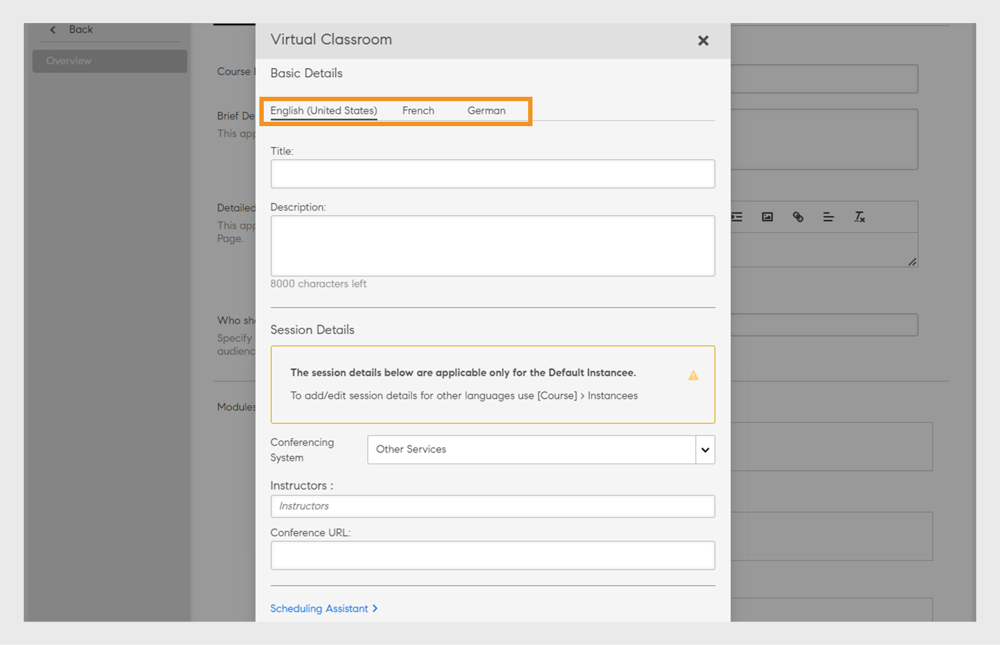

# Lägg till utbildningsobjekt på olika språk

Läs det här avsnittet om du vill veta hur du lägger till kurser, certifieringar och utbildningsplaner på olika språk.

Som författare kan du skapa utbildningsobjekt som kurser, certifieringar och utbildningsplaner. Du kan också skapa dessa utbildningsobjekt på olika språk.

Med Learning Manager kan du skapa utbildningsobjekt på flera språk. Du kan lägga till innehållet och/eller metadata på ytterligare språk när du skapar utbildningsobjektet. Du kan även redigera uppgifterna om ditt utbildningsobjekt när som helst och erbjuda ditt utbildningsobjekt på ytterligare språk.

Klicka på den kurs, certifiering eller utbildningsplan som du vill lägga till nya språk för att lägga till ett nytt språk. På sidan Grundläggande information klickar du på Lägg till nytt språk högst upp.

*Lägg till ett nytt språk*

Välj det eller de ytterligare språk som du vill erbjuda eleverna i dialogrutan och klicka på Spara.

*Välj ett språk*

Återpublicera kursen så att ändringarna verkställs.

## Flerspråksstöd för CR/VC-instanser med språktaggning

Med Adobe Learning Manager (ALM) kan författare skapa språkspecifika instanser med språktaggning för klassrums- och virtuella klassrumsmoduler. Den här funktionen ger elever tillgång till CR/VC-moduler på deras önskade språk. En författare kan till exempel skapa en CR/VC-modul med två instanser: en på engelska och en på franska. Elever kan välja instanserna på sitt önskade språk.

### Arbetsflöde

Först skapar och publicerar författaren en kurs på flera språk, vilket aktiverar språkalternativen på sidan för att skapa instanser. Författaren kan sedan skapa olika instanser genom att välja ett språk för var och en. Elever kan välja instansen baserat på det språk som de har mappats till.

### Skapa en kurs med flera språk

Följ de här stegen för att skapa en kurs med flera språk:

1. Logga in som **[!UICONTROL Author]**.
2. Välj **[!UICONTROL Courses]** > **[!UICONTROL Add]** för att skapa en kurs.
3. Skriv in **[!UICONTROL Name]** och **[!UICONTROL Description]** för kursen.
4. Välj **[!UICONTROL Add New Language]** och välj de språk som krävs. Då skapas flera flikar för varje språk.

   
   _Lägg till nytt språk - kurs_
5. Gå till respektive språkflikar och skriv in **[!UICONTROL Name]** och **[!UICONTROL Description]** för kursen.
6. På fliken Engelska (USA) väljer du **[!UICONTROL Add Module]** > **[!UICONTROL Virtual Classroom Module]**.

   >[!NOTE]
   >
   >Proceduren är densamma för klassrumsmodulen.

   
Lägg till nytt språk för VC-modulen

7. Skriv **[!UICONTROL Title]** och **[!UICONTROL Description]** på varje språkflik och välj **[!UICONTROL Add]**.
8. Ange de uppgifter som krävs för kursen och publicera kursen.

### Skapa instanser för varje språk

Du kan skapa instanser för varje språk från programmen Admin och Author. Följ de här stegen för att skapa instanserna från skaparprogrammet:

1. Logga in som **[!UICONTROL Author]**.
2. Välj **[!UICONTROL Courses]** och välj flerspråkskursen.
3. Välj **[!UICONTROL Instances]** > **[!UICONTROL Add New Instance]** för att skapa instanserna.
4. Skriv **[!UICONTROL Instance Name]** och välj **[!UICONTROL Completion Deadline]**.
5. Välj **[!UICONTROL Show More Options]** för att se de andra alternativen.
6. Välj önskat språk i listrutan **[!UICONTROL Language]**.

   
   _Välj språk för instansen_

7. Ange övriga uppgifter och välj **[!UICONTROL Save]**.
8. Skapa instanser för andra språk med samma steg. Eleverna kommer att kunna se alla språkinstanser för den här kursen.

### Välj instansen och registrera dig - elevarbetsflöde

Elever kan se de här språkinstanserna i sina program. De kan välja önskad språkinstans, registrera sig och närvara vid CR/VC-sessionerna på det språket.

Följ de här stegen för att välja instansen och registrera dig:

1. Gå till **[!UICONTROL Catalog]** och välj kursen i elevappen.
2. Du kan se följande skärm med flera instanser.

   
   _VC-modul för elever_

3. Du kan filtrera bort med hjälp av alternativet Språkfilter. Välj önskat språk och delta i kursen.
4. När du har valt kan du se följande information på sidan Kursöversikt.

_Instansinformation_

