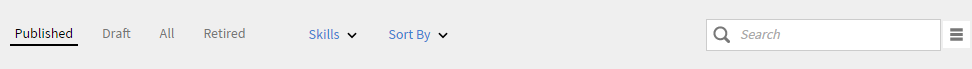
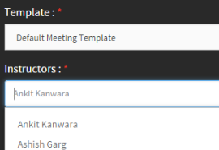

# Kataloger

Kataloger i Learning Manager består av kurser, utbildningsprogram och certifieringar för elevrollen i kontot Learning Manager.

## Kataloger {#Catalogs-1}

Alla kurser som finns i Learning Manager finns i avsnittet kurser. Samma sak gäller för Utbildningsprogram , Certifikat och så vidare.

Gå till avsnittet om du bara vill visa kurserna som en författare har skapat **Mina kurser**.

Du som är författare kan se kurskatalogen som är en samling av alla kurser på kontot.

När du har loggat in som författare klickar du på **KURSKATALOG** i den vänstra rutan för att visa listan över alla kurser som är tillgängliga i Learning Manager för din organisation.

Använd filteralternativen som visas i ögonblicksbilden nedan för att hitta kurserna i katalogen.

*Hitta kurserna i katalogen*

## Skapa en virtuell klassrumskurs (VC) med Adobe Connect {#createvirtualclassroomvccoursewithadobeconnect}

1. På sidan Mina kurser klickar du på Lägg till moduler och väljer Virtuellt klassrum. Dialogrutan Skapa virtuellt klassrum visas.
1. I dialogrutan **dialog>konferenssystem** alternativ, välj Adobe Connect
1. Ange titel, beskrivning, VC-datum, starttid och sluttid.

   Om Adobe Connect inte är konfigurerat för ditt konto visas ett varningsmeddelande som i skärmbilden ovan. Mallalternativ, instruktörer och andra Adobe Connect-alternativ är inaktiverade. Du måste kontakta administratören för att konfigurera Adobe Connect för ditt konto.

1. Programmet Adobe Learning Manager hämtar standardmallarna (möte, utbildning och händelse) och instruktörslistan (användare med värdbehörigheter) från Adobe Connect. Välj önskad mall.

1. Välj instruktör för din VC-kurs i listan över instruktörer.

   

   *Välj instruktören i listan*

1. Ange kriterier för slutförande av VC-kursen. Kriterier för slutförande är den procentandel av den totala längden på kursen som en elev måste delta i för att anses vara slutförd. Till exempel, längden på kursen är 1 timme. Om du anger 50 % som kriterium för slutförande, anses kursen vara slutförd för eleven om en elev deltar i kursen även under 30 minuter.

1. Klicka **[!UICONTROL Done]**.
