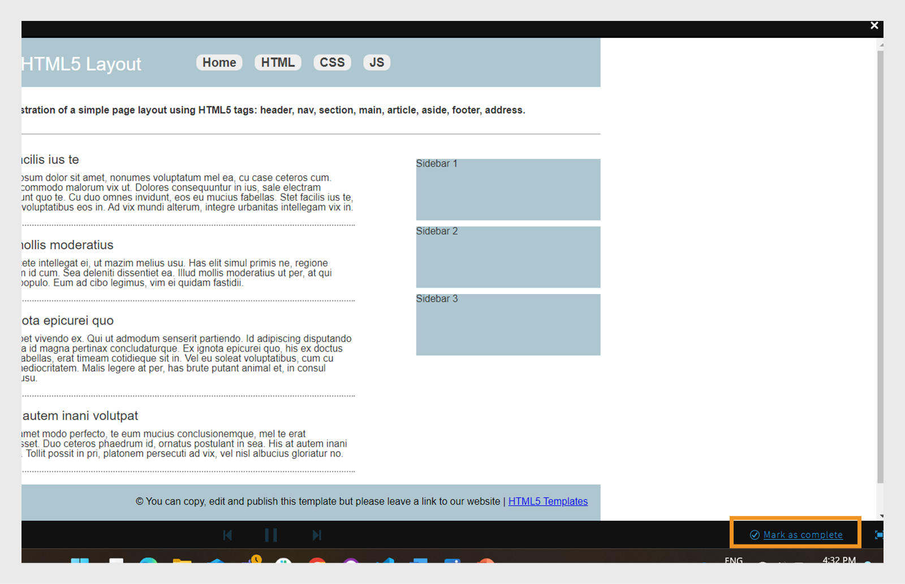
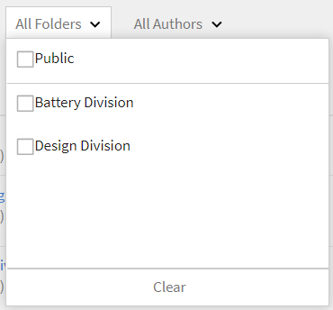
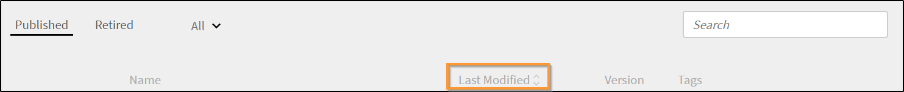
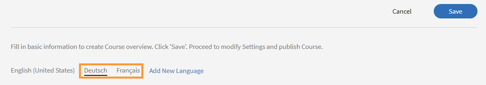

# Innehållsbibliotek

Lär dig skapa innehåll som följer kurser i din egen takt.

## Innehållsbibliotek {#contentlibrary}

Innehåll är byggstenen i en kurs. Författare skapar ett bibliotek med innehåll som kan anpassas till kurser som innehåll de själva tar hand om. Endast författare har tillgång till det här innehållsbiblioteket.

## Innehållstyper som stöds {#supported}

Du kan överföra både interaktivt och statiskt innehåll i biblioteket.

Tabellen nedan visar vilken typ av interaktiva och statiska filtyper som du kan överföra till biblioteket.

<table>
 <tbody>
  <tr>
   <td>
    
<b>Interaktivt innehåll</b>
</td>
   <td>
    
<b>Innehållstyp</b>
</td>
   <td>
    
<b>Tillägg</b>
</td>
  </tr>
  <tr>
   <td>
    
 
</td>
   <td>
    

    <ul>
     <li>SCORM 1.2</li>
     <li>SCORM 2004</li>
     <li>AICC</li>
     <li>TinCan</li>
    </ul>
    

</td>
   <td>
    
komprimera
</td>
  </tr>
  <tr>
   <td>
    
<b>Statiskt innehåll</b>
</td>
   <td>
    
<b>Innehållstyp</b>
</td>
   <td>
    
<b>Tillägg</b>
</td>
  </tr>
  <tr>
   <td>
    
 
</td>
   <td>
    
Video
</td>
   <td>
    
mp4, wmv, 3gp, 3g2, 3gp2, asf, avi, f4v h264, mpe, mpeg, mpg, mpg2, m4v, mov, wmv
</td>
  </tr>
  <tr>
   <td>
    
 
</td>
   <td>
    
Ljud
</td>
   <td>
    
mp3, wav, aac, m4a, wma, vorbis, pcm, eac3, amr, ac3
</td>
  </tr>
  <tr>
   <td>
    
 
</td>
   <td>
    
PDF
</td>
   <td>
    
pdf
</td>
  </tr>
  <tr>
   <td>
    
 
</td>
   <td>
    
MS PowerPoint
</td>
   <td>
    
pptx, ppt
</td>
  </tr>
  <tr>
   <td>
    
 
</td>
   <td>
    
MS Word
</td>
   <td>
    
docx, doc
</td>
  </tr>
  <tr>
   <td>
    
 
</td>
   <td>
    
MS Excel
</td>
   <td>
    
xlsx, xls
</td>
  </tr>
  <tr>
   <td>
    
 
</td>
   <td>
    
HTML
</td>
   <td>
    
html eller htm
</td>
  </tr>
 </tbody>
</table>

## Lägga till nytt innehåll i biblioteket {#addnewcontentinthelibrary}

**Författare** kan lägga till innehåll i ALM. Det finns två typer av innehåll i ALM: **[!UICONTROL Content]** och **[!UICONTROL Quiz]**. Information om hur du lägger till innehåll finns i [Lägga till statiskt innehåll](content-library.md#addstaticcontent) och [Skapa ett frågeformulär](content-library.md##createaquiz).

## Lägga till statiskt innehåll {#addstaticcontent}

1. Välj **[!UICONTROL Content Library]** i den vänstra rutan när du har loggat in som **Författare** och välj **[!UICONTROL Add]**.

   Du kan också välja **[!UICONTROL Create Content]** från sidan **[!UICONTROL Getting Started]**.

1. Skriv ett namn på innehållet du vill överföra i fältet **[!UICONTROL Name]**.
1. Skriv beskrivningen för innehållet i fältet **[!UICONTROL Description]**. Kontrollera att den beskrivning du vill ange är meningsfull. Teckengränsen är 400 tecken.
1. Om du vill lägga till innehållet väljer du **[!UICONTROL Add Content File]** och överför resursfilen. När du lägger till innehåll för flera språk kan du inte kombinera statiskt och interaktivt innehåll i en enda grupp. Antingen ska allt ditt innehåll på alla språk vara statiskt, eller så ska allt innehåll vara interaktivt.

   Om du vill ersätta innehållet kan du ersätta ett statiskt innehåll med ett annat statiskt innehåll. Detsamma gäller interaktivt innehåll.

1. I fältet **[!UICONTROL Duration]** kan du välja att ange den förväntade tiden som en elev tillbringar i den här modulen. Varaktigheten anges i minuter.

   Om eleven markerar en kurs som slutförd beräknar vi utbildningstiden baserat på den angivna varaktigheten. Om eleven förbrukar innehållet i spelaren läggs tiden som tillbringas i spelaren till inlärningstiden. Om den faktiska innehållstiden är kortare än den angivna varaktigheten visar spelaren innehållstiden i befintligt skick. Inga ändringar görs i detta fall.

1. Skriv taggarna för det överförda innehållet i fältet **[!UICONTROL Tags]** så att innehållet kan identifieras.

   En författare kan använda dessa taggar för att söka efter innehållet när han eller hon lägger till innehållet i kursen.

### Lägg till filtypen HTML5 i innehållsbiblioteket

Författare kan lägga till HTML5-innehåll som en .zip-fil i innehåll de själva har skapat. ZIP-mappen bör innehålla en HTML-fil med namnet `index.html`. Om det finns flera HTML-filer bör alla vara länkade, med huvudfilen `index.html`. Elever kan se HTML5-innehåll i fluidic-spelaren. Författaren kan lägga till HTML5-innehållet i modulen för eget tempo i en kurs och ange slutförandevillkor. Författare kan ställa upp kriterier för att slutföra HTML på ett av två sätt:

* Eleven kan själv markera den som slutförd.
* Den markeras som slutförd när de startar kursen.

Följ de här stegen om du vill lägga till HTML-filtypen (.zip) i innehållsbiblioteket.

1. I skaparappen väljer du **[!UICONTROL Create Content]** på startsidan.
1. Välj **[!UICONTROL Add]** > **[!UICONTROL Content]** på skärmen **[!UICONTROL Content Library]**.
1. Ange innehållets namn och beskrivning.
1. Markera alternativet **[!UICONTROL Add Content File]** och bläddra sedan och markera HTML-filerna (packas som en mapp).
1. När innehållet har lagts till kan du visa innehållet i avsnittet **[!UICONTROL Content Library]**.
1. Markera HTML-innehållet och välj sedan **[!UICONTROL Edit]**.
1. Välj något av följande alternativ från alternativet **[!UICONTROL Completion Criteria]**.
   * **[!UICONTROL On Launching content]**: Kursen markeras som slutförd automatiskt när eleven startar den.
   * **[!UICONTROL Learner marks complete]**: Eleven kan markera kursen som slutförd i fluidic-spelaren.

   
   _Kriterier för slutförande_

1. Välj **[!UICONTROL Save]**.
1. Skapa en kurs genom att lägga till det här innehållet.  Mer information finns i [Skapa, ändra och publicera kurser](/help/migrated/authors/feature-summary/courses.md).

Om en författare väljer urvalskriterierna **[!UICONTROL On Launching content]** i elevappen kommer kursen att markeras som slutförd när eleven startar den. När en författare väljer **[!UICONTROL Learner marks complete]** kan eleven markera kursen som slutförd.

_Elevmärken slutförda_

### Versionshantering {#versioning}

Innehållsbiblioteket underhåller också versioner av det överförda innehållet. Om du gör några ändringar i innehållet, t.ex. en PowerPoint-presentation och överför PPT-filen på nytt i biblioteket, ökas versionsnumret med ett steg. Det hjälper dig att spåra ändringar i innehållet.

## Lägga till interaktivt innehåll {#addinteractivecontent}

1. Välj **[!UICONTROL Content Library]** i den vänstra rutan när du har loggat in som **Författare** och välj **[!UICONTROL Add]**.

   Du kan också välja **[!UICONTROL Create Content]** från sidan **[!UICONTROL Getting Started]**.

1. Skriv ett namn på innehållet du vill överföra i fältet **[!UICONTROL Name]**.
1. Skriv beskrivningen för innehållet i fältet **[!UICONTROL Description]**.

   >[!NOTE]
   >
   >Kontrollera att den beskrivning du vill ange är meningsfull. Teckengränsen är 245 tecken.

1. Om du vill lägga till innehållet väljer du **[!UICONTROL Add Content File]** och överför resursfilen. När du lägger till innehåll för flera språk kan du inte kombinera statiskt och interaktivt innehåll i en enda grupp. Antingen ska allt ditt innehåll på alla språk vara statiskt, eller så ska allt innehåll vara interaktivt.

* [Filtyper som stöds](content-library.md#supported)

  Det interaktiva innehållet kan vara ett SCORM-, AICC- eller Captivate-publicerat projekt. Filen måste vara en zip-fil.

  Du kan också lägga till HTML-innehåll som har genererats från Captivate, Presenter eller Presenter Video Express.

1. Learning Manager stöder bildtexter för videoinnehåll som laddats upp i Learning Manager. Nu kan användarna ladda upp filen som innehåller bildtexter tillsammans med videofilen.

   Därefter kan eleverna visa bildtexterna under uppspelningen av videomodulen.

   Det format som stöds är [Web Video-textspår (webVTT)](https://www.w3.org/TR/webvtt1/).

   Bildtextstöd är tillgängligt för videoinnehåll som laddas upp i innehållsbiblioteket i Learning Manager.

   När du som författare laddar upp ett video- eller ljudinnehåll kan du även ladda upp VTT-filen som innehåller bildtexterna.

   Undertexterna visas sedan i Fluidic-spelaren. Bildtexterna uppfyller också [WCAG2.0-standarderna](https://www.w3.org/TR/WCAG20/).

   När du lägger till ett videoinnehåll i biblioteket kan du också lägga till VTT-filen, som **måste** vara en giltig fil.

   

   *Lägg till en webvtt-fil*

   Den överförda VTT-filen motsvarar den befintliga versionen av innehållet. Den överförda webVTT-filen länkar inte till den äldre versionen av innehållet.

   Om du skapar innehållet på olika språk kan du överföra olika webVTT-filer för varje språk. Eleverna kan se beskrivningar som motsvarar det språk som valts under uppspelningen.

   >[!NOTE]
   >
   >   En VTT-fil stöder ett språk. Om du vill använda flera språk överför du flera videofiler för varje innehållsspråk och överför sedan deras respektive VTT-fil för varje videofil.

   Du som är författare uppmanas att ange en ny vtt-fil varje gång du ändrar innehåll, video eller ljud.

   När du har lagt till detta innehåll i en kurs och när du förhandsgranskar kursen som elev kan du se bildtexterna på videon.

   I spelaren växlar du knappen CC i Fluidic-spelaren för att visa eller dölja bildtexterna.

   Samma vy finns i **elevappen** samt i **Förhandsgranska som elev**.

   När du **lägger till, uppdaterar eller tar bort** VTT-filen får du ett meddelande.
WebVTT-stöd är inte tillgängligt för:

   1. Videomeddelanden.
   1. Video spelas upp i e-utbildningsinnehållet. Det här drivs av innehållet.
   1. Videon har laddats upp i Social utbildning.
   1. Video skapad i Learning Manager-datorprogram.
   1. Videoinnehåll som skapats via migreringsprocessen.
   1. Videouppspelning i mobilappen i offlineläge.

1. I fältet **[!UICONTROL Duration]** kan du välja att ange den förväntade tiden som en elev skulle tillbringa i den här modulen. Varaktigheten anges i minuter.
1. Ange taggarna för det överförda innehållet i fältet **[!UICONTROL Tags]** så att innehållet kan identifieras.

### Stöd för delad katalog

Om ett säljarkonto delar en katalog som innehåller kurserna och kurserna innehåller modulerna, ljudet eller videon med undertexterna måste kurserna fungera på samma sätt i köparkontot.

Modulpropageringen ska fungera korrekt från säljare till inköpskonto. Detta kan inkludera - redigera/ta bort/lägga till vtt-filen i modulen.

När du har överfört innehållet kan du se ett meddelande genom att klicka på klockikonen överst till höger på sidan. Varje gång du ändrar ett innehåll och överför det på nytt visas ett meddelande. Om du gör ändringarna får du bara meddelandet, inte andra författare.

## Skapa ett quiz {#createaquiz}

Skapa utvärderingar i Adobe Learning Manager med det nya verktyget för att skapa quiz på sidan Innehållsbibliotek. De utvärderingar som skapas blir en del av innehållsbiblioteket och kan läggas till i en &quot;gemensam&quot; mapp för återanvändning av kurser.

1. Välj Innehållsbibliotek på den vänstra panelen.
1. I det övre högra hörnet på skärmen väljer du **Lägg till > Quiz**.
1. Skriv frågeformulärets namn och beskrivning på sidan Skapa quiz.
1. Välj **Lägg till frågeformulärsfråga** i avsnittet Quiz-innehåll.
1. Välj frågetyp i dialogrutan Quiz-fråga. Det finns tre typer av frågor:
   * Flervalsfråga
   * Sant eller falskt
   * Fyll i tomrummet
1. Ange frågan och välj rätt svar.
1. Ange poängen för frågeformuläret.
1. Om du vill att frågan ska besvaras korrekt när du skickar frågeformuläret markerar du kryssrutan **Obligatoriskt svar för att skicka frågeformuläret**.
1. Välj **Spara och stäng**.
1. Ange de punkter som ska skickas i frågeformuläret i fältet **kriterier för överföring**.
1. Om du vill att en elev ska visa ett korrekt svar aktiverar du växlingsknappen **Visa korrekta svar** för elever efter frågeformuläret.
1. Om du vill att frågor och svar ska visas slumpmässigt aktiverar du växlarna:
   * Slumpmässig frågeordning
   * Ordna svarsalternativ slumpmässigt
1. Ange en mapp där du vill lägga till frågeformuläret så att frågeformuläret blir tillgängligt för alla författare.
1. Ange i fältet **Varaktighet** den tid som eleven måste lägga på frågeformuläret.
1. Ange ett märkord i listan med redan skapade märkord.
1. Lägg till logotyp och bakgrund i frågeformuläret.
1. **Publish** visas längst upp till höger på sidan.

Följ de här stegen om du vill lägga till frågeformulär på olika språk:

1. Om du vill lägga till frågeformuläret för olika språk väljer du fliken **Lägg till nytt språk** och väljer önskade språk. Med det här tillvägagångssättet kan du lägga till flerspråkigt stöd för ditt innehåll.

   

   *Lägg till nytt språk för ett innehåll*

1. Upprepa processen för överföring av innehåll för de nya språken.
1. Om du vill ta bort ett språk väljer du fliken **[!UICONTROL Add New Language]** och rensar markeringen.

   Klicka på **[!UICONTROL Save]** när du har gjort ändringarna. I biblioteket är det nya innehållet nu tillgängligt för konsumtion.

Frågesporten läggs till i **[!UICONTROL Content Library]**. Precis som allt annat innehåll i innehållsbiblioteket kan du ta bort ett frågeformulär och ta bort det.

## Lägg till i mapp {#add-folder}

När en administratör har skapat innehållsmapparna kan du som författare överföra innehållet till en innehållsmapp, så att innehållet bara är synligt för dig eller en utvald grupp författare på kontot. Du kan också göra innehållet offentligt och synligt för alla författare på kontot.

**Exempel på användning**

Exempelvis vill myndigheter ha full kontroll över innehållet och någon som förbiser innehållet måste ha tillgång till allt innehåll. Samtidigt måste innehållsskapare i byråer endast ha tillgång till sitt eget innehåll, och i vissa fall till någon annans innehåll.

Innehållsbibliotek med befintligt innehåll (dvs. innehåll som laddas upp innan innehållsmappar konfigureras) definieras som **Gemensam mapp**. Mappen kan inte tas bort eller dras tillbaka. Innehåll som ingår i mappen Offentlig är tillgängligt för alla typer av författare. När Innehållsmappar har konfigurerats bör standardförfattare och anpassade författare välja mappen där innehållet ska placeras när nytt innehåll överförs.

>[!NOTE]
>
>Gemensamma och privata mappar utesluter varandra. Det innebär att innehållet **inte kan** associeras med mappen Offentlig och Privat samtidigt. Den kan antingen kopplas till den gemensamma mappen **eller** och kopplas till en eller flera privata mappar när som helst.

När du lägger till ett innehåll kan du välja mappen där innehållet ska placeras.

*Lägg till innehåll i mappen*

Om du väljer **Offentlig** kommer innehållet att vara synligt för alla författare. Allt innehåll som fanns på kontot och som inte ingår i någon mapp kommer som standard att finnas i den gemensamma mappen.

Observera att innehållsmappar helt enkelt är virtuella fack för att länka innehållet. Om ett innehåll placeras i två mappar innebär det att innehållsfilen alltid är en enda fil men länkad till flera mappar. Om innehållet uppdateras av den anpassade författaren-1 som har åtkomst till anpassade mappar-1 kommer samma uppdaterade innehåll alltså även att återspeglas i anpassade mappar-2 som öppnas av anpassade författare-2.

Det finns två alternativ för att hantera innehållsmappar i innehållsbiblioteket:

**Alla mappar**

Det är en lista som visar alla mappar som har skapats på kontot.

*Visa alla mappar*

**Alla författare**

Det är en lista som visar författarna som har skapat innehållet och laddat upp det i biblioteket.

*Visa alla författare*

Det här är tillgängligt **endast** när en administratör skapar en ny mapp.

## Flytta innehåll till en mapp {#movecontenttofolder}

Flytta innehållet i en gemensam mapp till en privat mapp genom att

1. Välj **Offentlig** mapp från rullgardinsmenyn **Alla mappar**.

   

   *Visa allt uppladdat innehåll*

1. Välj det innehåll som du vill flytta det till en mapp. Klicka sedan på **[!UICONTROL Actions]** > **[!UICONTROL Organize Content]** > **[!UICONTROL Move Content to Folder]**.

   

   *Flytta markerat innehåll till mappen*

1. Välj mappen dit du vill flytta innehållet. Klicka på **[!UICONTROL Move]**.

## Kopiera innehåll till en mapp {#copycontenttofolder}

Om du kopierar en mapp lägger du till en tagg i mappen. Kopieringsåtgärden skapar inte kopior av innehållet utan lägger bara till en association med angivna mappar.

*Kopiera en mapp*

## Avlänka mapp {#unlinkfolder}

Avlänkning innebär att innehållet tas bort från den markerade mappen.

Det går inte att ta bort länkningen från en angiven mapp **ENDAST** om den också är kopplad till andra mappar. Om innehåll som avlänkas bara är kopplat till en mapp bör du i stället använda åtgärden FLYTTA.

>[!NOTE]
>
>Menyn Organisera under Åtgärder inaktiveras från början. För att använda den måste du först markera en mapp i listrutan Mapp.

*Bryt länken till en mapp*

## Lägg till innehåll för olika språk {#addcontentfordifferentlanguages}

1. Om du vill lägga till innehåll för olika språk klickar du på fliken **Lägg till nytt språk** och väljer önskade språk. Med det här tillvägagångssättet kan du lägga till flerspråkigt stöd för ditt innehåll.

   

   *Lägg till nytt språk för ett innehåll*

1. Upprepa processen för överföring av innehåll för de nya språken.
1. Om du vill ta bort ett språk klickar du på fliken Lägg till nytt språk och avmarkerar markeringen.

   När du har gjort ändringarna klickar du på Spara. I biblioteket är det nya innehållet nu tillgängligt för konsumtion.

## Ange slutförandevillkor {#setcompletioncriteria}

<table>
 <tbody>
  <tr>
   <td>
    
<b>Statiskt innehåll</b>
</td>
   <td>
    
<b>Interaktivt innehåll</b>
</td>
  </tr>
  <tr>
   <td>
    
Du kan bara ange <b>kriterier för slutförande</b> för innehållet för följande alternativ:

    <ul>
     <li>Vid inläsning av innehåll</li>
     <li>Baserat på den lägsta andelen som krävs</li>
    </ul></td>
   <td>
    
Du kan ange både <b>kriterier för slutförande</b> och <b>Slutfört</b> för innehållet för följande alternativ:

    <ul>
     <li>Vid inläsning av innehåll</li>
     <li>Baserat på den lägsta andelen som krävs</li>
     <li>Alternativ för godkänt eller försökt quiz</li>
    </ul>
    
<b>OBS!</b> Du kan bara redigera HTML-innehåll från Captivate, Presenter Video Express eller Presenter.
</td>
  </tr>
 </tbody>
</table>

När du har lagt till innehållet kan du ändra villkoren för slutförande av det.

I Learning Manager delas utmärkelsetecken och kompetens ut baserat på framgång och slutförande. Om eleven har slutfört en kurs men inte lyckas, får eleven inte det utmärkelsetecken och den kompetens som motsvarar uppdragsbeskrivningen.

Om du till exempel har använt Adobe Captivate för att skapa kursen och ställt in utbildningsparametrarna i dialogrutan Preferenser migreras samma inställningar till Learning Manager i alternativen för slutförandekriterier.

I avsnittet Kriterier för slutförande kan du ange de alternativ som nämns nedan:

**Vid start av innehåll:** Om du aktiverar det här alternativet definierar du slutförandevillkoren för innehållet när en elev öppnar innehållet.

**Baserat på den lägsta andelen som krävs:** Ställ in ett värde som den lägsta andelen av förbrukningen hos din elev. Om du till exempel anger procentvärdet till 50 kan eleven förbruka 50 % av innehållet och fortfarande uppfylla slutförandekriterierna.

**Quiz:** Välj ett av följande kriterier:

* **Quiz godkändes:** Statusen rapporteras endast som Slutförd om en elev klarar quiz.
* **Försök till quiz:** Status rapporteras som slutfört om elever försöker utföra quiz oavsett om de klarar eller inte klarar quiz.
* **Quiz godkändes eller också har gränsen nåtts:** Statusen rapporteras som Slutförd om eleverna klarar frågeformuläret eller har gjort alla försök. Till exempel, om antalet försök som anges i kursen är två, och:

   * Om eleverna gör det första försöket och godkänns rapporteras statusen som Slutfört och Godkänt.
   * Om elever gör det första försöket och misslyckas rapporteras statusen som ofullständig och Misslyckad eftersom försöksgränsen fortfarande inte har nåtts.
   * Om eleverna gör om frågeformuläret och misslyckas rapporteras statusen som Slutfört och Misslyckat.
   * Om eleverna försöker quiz igen och godkänns rapporteras statusen som Slutfört och Godkänt.

## Ange villkor för slutförande {#setsuccesscriteria}

På samma sätt kan du definiera kriterier för att kursen ska lyckas. Ett kriterium för lyckade resultat anger att en elevs resultat är Godkänt eller Misslyckat. Om du har startat en kurs i Captivate kan du ställa in framgångsvillkoren för kursen i dialogrutan Preferenser enligt nedan:

Du har till exempel laddat upp en modul som innehåller ett quiz. Nu har du ställt in kriterier för slutförande för den modulen på Vid start av innehåll och Kriterier för slutförande till Quiz Godkänt.

Om eleven har startat kursen och misslyckats med quiz markeras kursen som slutförd, men framgångsvillkoren uppfylls bara när eleven klarat quiz.

## Alternativ för innehållsfilter {#contentfilteroptions}

### Sortera efter datum {#sortaccordingtodate}

Ordna innehållet efter när det senast ändrades. Du kan antingen sortera innehållet i stigande eller fallande ordning.

*Sortera innehåll efter datum*

### Sortera efter användning {#sortaccordingtousage}

Ordna innehållet utifrån om innehållet används i någon kurs. I listrutan Format väljer du Används eller Oanvänd.

*Sortera innehåll efter användning*

## Sök efter innehåll {#searchforcontent}

I innehållsbiblioteket kan du söka efter ett innehåll genom att välja antingen namnet på innehållet eller de taggar som är associerade med innehållet.

Ange namnet på en kurs eller en tagg i sökfältet så ser du rekommendationerna.

<!---->

## Ta bort innehåll {#retirecontent}

När du har publicerat ett innehåll kan du inte ta bort det. Du måste ta innehållet ur bruk först. När du markerar ett innehåll som utfasat är det inte längre synligt för elever. Innehållet flyttas även till avsnittet Utfasade. Du kan även flytta innehållet till publicerat läge senare.

Gör så här om du vill ta innehåll ur bruk:

* Välj det innehåll som du vill ta ur bruk i innehållsbiblioteket.
* Välj Åtgärd > Ta bort.

Innehåll som används i något utbildningsobjekt påverkas inte. Elever kan fortfarande komma åt innehållet.

>[!NOTE]
>
>Du kan också lägga till innehåll från avsnittet **[!UICONTROL Retired]**, navigera till **[!UICONTROL Content Library]** > **[!UICONTROL Retired]** och välja **[!UICONTROL Add Content]**. Mer information finns i [Lägg till statiskt innehåll](content-library.md#addstaticcontent).

## Återpublicera utfasat innehåll {#republishretiredcontent}

När du har dragit tillbaka ett innehåll kan du återpublicera det och se till att det visas i listan Publicerat. Om du till exempel har fasat ut version 1 av ett innehåll och vill ersätta den med version 2 kan du flytta version 1.pptx, till exempel till den publicerade listan, och uppdatera filen med version 2.pptx. Den nya filen blir tillgänglig för konsumtion på olika kurser.

Så här återpublicerar du det utfasade innehållet

1. Gå till fliken **Utfasade** och välj innehållet som du vill återpublicera.
1. Välj **Åtgärd** > **Återpublicera**.

Innehållet visas nu i listan Publicerat.

## Ta bort innehåll {#deletecontent}

När du har tagit ett innehåll ur bruk kan du ta bort det.

* Gå till fliken Pensionerade och välj innehållet du vill ta bort.
* Välj Åtgärd > Ta bort.

Observera att befintliga kurser som använder innehållet, som har tagits bort från innehållsbiblioteket, fortsätter att använda innehållet.

## Vanliga frågor {#frequentlyaskedquestions}

+++ Hur överför jag ett SCORM-innehåll i Adobe Learning Manager?

Skapa en SCORM-kompatibel e-kurs i ett valfritt verktyg, till exempel Adobe Captivate, och publicera innehållet som en zip-fil. Ladda sedan upp zip-filen i katalogen i Learning Manager och ange kriterier för slutförande och slutförande.
+++

+++Hur överför jag en ny version av samma innehåll till Learning Manager?

I Learning Manager underhåller innehållsbiblioteket även versioner av ditt överförda innehåll. Om du gör ändringar i innehållet, t.ex. en PowerPoint-presentation och överför presentationen på nytt i biblioteket, ökas versionsnumret med ett steg. Det hjälper dig att spåra ändringar i innehållet. En ny version av innehållet kan tillämpas på alla utbildningsobjekt samtidigt eller du kan tillämpa individuella uppdateringar för varje kurs.
+++

+++Hur redigerar jag detaljerna för en kurs på ett annat språk?
När du har lagt till ett språk/språk som beskrivs i ett tidigare avsnitt klickar du på varje språkflik och lägger sedan till/redigerar kursinformationen.

&lt;!——>
+++
