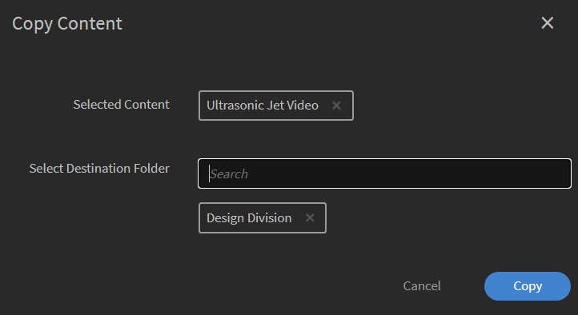

# Bibliotek med innehåll

Lär dig hur du skapar innehåll som passar dina kurser som innehåll i egen takt.

## Bibliotek med innehåll {#contentlibrary}

Innehållet är byggstenen i en kurs. Författare skapar ett bibliotek med innehåll som kan anpassas till kurser som innehåll i egen takt. Endast författare har tillgång till det här innehållsbiblioteket.

## Innehållstyper som stöds {#supported}

Du kan ladda upp både interaktivt och statiskt innehåll i biblioteket.

Tabellen nedan visar vilken typ av interaktiva och statiska filtyper som du kan ladda upp till biblioteket.

<table>
 <tbody>
  <tr>
   <td>
    
<b>Interaktivt innehåll</b>
</td>
   <td>
    
<b>Typ av innehåll</b>
</td>
   <td>
    
<b>Tillägg</b>
</td>
  </tr>
  <tr>
   <td>
    
 
</td>
   <td>
    

    <ul>
     <li>SCORM 1.2</li>
     <li>SCORM 2004</li>
     <li>AICC</li>
     <li>TinCan</li>
    </ul>
    

</td>
   <td>
    
Zip
</td>
  </tr>
  <tr>
   <td>
    
<b>Statiskt innehåll</b>
</td>
   <td>
    
<b>Typ av innehåll</b>
</td>
   <td>
    
<b>Tillägg</b>
</td>
  </tr>
  <tr>
   <td>
    
 
</td>
   <td>
    
Video
</td>
   <td>
    
mp4, wmv, 3gp, 3g2, 3gp2, asf, avi, f4v h264, mpe, mpeg, mpg, mpg2, m4v, mov, wmv
</td>
  </tr>
  <tr>
   <td>
    
 
</td>
   <td>
    
Ljud
</td>
   <td>
    
mp3, wav, aac, m4a, wma, vorbis, pcm, eac3, amr, ac3
</td>
  </tr>
  <tr>
   <td>
    
 
</td>
   <td>
    
PDF
</td>
   <td>
    
PDF
</td>
  </tr>
  <tr>
   <td>
    
 
</td>
   <td>
    
MS PowerPoint
</td>
   <td>
    
pptx, ppt
</td>
  </tr>
  <tr>
   <td>
    
 
</td>
   <td>
    
MS Word
</td>
   <td>
    
docx, doc
</td>
  </tr>
  <tr>
   <td>
    
 
</td>
   <td>
    
MS Excel
</td>
   <td>
    
xlsx, xls
</td>
  </tr>
  <tr>
   <td>
    
 
</td>
   <td>
    
HTML
</td>
   <td>
    
HTML eller HTM
</td>
  </tr>
 </tbody>
</table>

## Lägga till nytt innehåll i biblioteket {#addnewcontentinthelibrary}

**Författare** kan lägga till innehåll i ALM. Det finns två typer av innehåll i ALM: **[!UICONTROL Content]** och **[!UICONTROL Quiz]**. Mer information om hur du lägger till innehåll finns i [Lägga till statiskt innehåll](content-library.md#addstaticcontent) och [Skapa ett quiz](content-library.md##createaquiz).

## Lägga till statiskt innehåll {#addstaticcontent}

1. Välj **[!UICONTROL Content Library]** i den vänstra rutan när du har loggat in som **författare** och välj **[!UICONTROL Add]**.

   Alternativt kan du välja **[!UICONTROL Create Content]** från **[!UICONTROL Getting Started]** sidan.

1. I fältet **[!UICONTROL Name]** skriver du ett namn på det innehåll som du vill ladda upp.
1. I fältet **[!UICONTROL Description]** skriver du en beskrivning av innehållet. Se till att beskrivningen du vill ange är meningsfull. Teckengränsen är 400 tecken.
1. Om du vill lägga till innehållet väljer du **[!UICONTROL Add Content File]** och laddar upp resursfilen. När du lägger till innehåll för flera språk kan du inte kombinera statiskt och interaktivt innehåll i en enda grupp. Antingen ska allt innehåll på alla språk vara statiskt, eller så ska allt innehåll vara interaktivt.

   Om du vill ersätta innehållet kan du ersätta ett statiskt innehåll med ett annat statiskt innehåll. Samma sak gäller för interaktivt innehåll.

1. I fältet kan du välja att skriva in den förväntade tiden som en elev skulle spendera i den här modulen **[!UICONTROL Duration]** . Varaktigheten är i minuter.

   Om eleven markerar en kurs som slutförd beräknar vi inlärningstiden baserat på den angivna varaktigheten. Om eleven konsumerar innehållet i spelaren läggs den tid som spenderas i spelaren till den tid som spenderas på inlärningstiden. Om den faktiska innehållstiden är kortare än den angivna varaktigheten visas innehållstiden som den är. Inga ändringar görs i det här fallet.

1. **[!UICONTROL Tags]** I fältet skriver du taggarna för det uppladdade innehållet så att ditt innehåll blir upptäckbart.

   En författare kan använda dessa taggar för att söka efter innehållet när han eller hon lägger till innehållet i kursen.

### Lägga till HTML5-filtyp i innehållsbiblioteket

Författare kan lägga till HTML5-innehåll som en .zip-fil i innehåll i egen takt. Den .zip mappen ska innehålla en HTML-fil med namnet `index.html`. Om det finns flera HTML-filer ska alla vara länkade, med huvudfilen namnet `index.html`. Eleverna kan se HTML5-innehållet i fluidic player. Författaren kan lägga till det här HTML5-innehållet i modulen i en kurs i egen takt och ställa in kriterierna för slutförande. Författare kan ställa in kriterierna för att slutföra HTML-kursen på ett av två sätt:

* Eleven kan själv markera den som slutförd.
* Den kommer att markeras som slutförd när de startar kursen.

Om du vill lägga till HTML-filtypen(.zip) i innehållsbiblioteket följer du dessa steg.

1. I författarappen väljer du **[!UICONTROL Create Content]** på startsidan.
1. På skärmen **[!UICONTROL Content Library]** väljer du **[!UICONTROL Add]** > **[!UICONTROL Content]**.
1. Ange namn och beskrivning av innehållet.
1. Välj alternativet **[!UICONTROL Add Content File]** och bläddra sedan och välj HTML-filerna (zippade som en mapp).
1. När innehållet har lagts till kan du se innehållet i **[!UICONTROL Content Library]** avsnittet.
1. Markera HTML-innehållet och välj **[!UICONTROL Edit]** sedan .
1. Välj något av följande alternativ från alternativet **[!UICONTROL Completion Criteria]** .
   * **[!UICONTROL On Launching content]**: Kursen markeras automatiskt som slutförd när eleven startar den.
   * **[!UICONTROL Learner marks complete]**: Eleven har möjlighet att markera kursen som slutförd i fluidic-spelaren.

   
   _Kriterier för slutförande_

1. Välj **[!UICONTROL Save]**.
1. Skapa en kurs genom att lägga till det här innehållet.  Mer information finns i [Skapa, ändra och publicera kurser](/help/migrated/authors/feature-summary/courses.md).

Om en författare väljer urvalskriterier som **[!UICONTROL On Launching content]**, kommer kursen att markeras som slutförd i elevappen när eleven startar den. När en författare väljer **[!UICONTROL Learner marks complete]** kommer eleven att ha möjlighet att markera kursen som slutförd.

_Elevens betyg är klara_

### Versionshantering {#versioning}

Innehållsbiblioteket har också versionshantering av ditt uppladdade innehåll. Om du gör någon ändring i innehållet, till exempel en PowerPoint-presentation, och laddar upp PPT igen i biblioteket, ökas versionsnumret med ett. Detta hjälper dig att spåra ändringar i ditt innehåll.

## Lägg till interaktivt innehåll {#addinteractivecontent}

1. Välj **[!UICONTROL Content Library]** i den vänstra rutan när du har loggat in som **författare** och välj **[!UICONTROL Add]**.

   Alternativt kan du välja **[!UICONTROL Create Content]** från **[!UICONTROL Getting Started]** sidan.

1. I fältet **[!UICONTROL Name]** skriver du ett namn på det innehåll som du vill ladda upp.
1. I fältet **[!UICONTROL Description]** skriver du en beskrivning av innehållet.

   >[!NOTE]
   >
   >Se till att beskrivningen du vill ange är meningsfull. Teckengränsen är 245 tecken.

1. Om du vill lägga till innehållet väljer du **[!UICONTROL Add Content File]** och laddar upp resursfilen. När du lägger till innehåll för flera språk kan du inte kombinera statiskt och interaktivt innehåll i en enda grupp. Antingen ska allt innehåll på alla språk vara statiskt, eller så ska allt innehåll vara interaktivt.

* [Filtyper som stöds](content-library.md#supported)

  Det interaktiva innehållet kan vara ett SCORM-, AICC- eller ett Captivate-publicerat projekt. Filen måste vara en zip-fil.

  Du kan också lägga till HTML-innehåll som genererats från Captivate, Presenter eller Presenter Video Express.

1. Learning Manager har stöd för undertexter för videoinnehåll som laddats upp i Learning Manager. Nu kan författare ladda upp filen som innehåller bildtexter, tillsammans med videofilen.

   Sedan kan eleverna se bildtexterna under uppspelningen av videomodulen.

   Det format som stöds är [Web Video Text Tracks (webVTT).](https://www.w3.org/TR/webvtt1/)

   Stöd för undertexter är tillgängligt för videoinnehåll som laddats upp i Innehållsbibliotek i Learning Manager.

   När du som författare laddar upp ett video- eller ljudinnehåll kan du också ladda upp VTT-filen som innehåller undertexterna.

   Undertexterna visas sedan i Fluidic Player. Undertexterna är också förenliga med [WCAG2.0-standarderna](https://www.w3.org/TR/WCAG20/).

   När du lägger till ett videoinnehåll i biblioteket kan du också lägga till VTT-filen, som **måste** vara en giltig fil.

   

   *Lägga till en webvtt-fil*

   Den uppladdade VTT-filen motsvarar den befintliga versionen av innehållet. Det innebär att den uppladdade webVTT-filen inte länkar till den äldre versionen av innehållet.

   Om du skapar innehållet på olika språk kan du ladda upp en annan webVTT-fil för varje språk. Eleverna kommer att kunna se undertexter som motsvarar det språk som valts under uppspelningen.

   >[!NOTE]
   >
   >   En VTT-fil har stöd för ett språk. Om du vill ha stöd för flera språk laddar du upp flera videofiler för varje innehållsspråk och laddar sedan upp dess respektive VTT-fil för varje videofil.

   Som författare uppmanas du som författare att ange en ny vtt-fil varje gång du ändrar innehåll, video eller ljud.

   När du har lagt till det här innehållet i en kurs och när du förhandsgranskar kursen som elev kan du se undertexterna på videon.

   På spelaren växlar du CC-knappen på Fluidic-spelaren för att visa eller dölja bildtexterna.

   Samma vy finns i **learner-appen** samt i **Preview som learner**.

   När du **lägger till, uppdaterar eller tar bort** vtt-filen får du ett meddelande.
WebVTT-stöd är inte tillgängligt för:

   1. Videomeddelanden.
   1. Video som spelas upp i eLearning-innehållet. Detta drivs av innehållet.
   1. Video uppladdad i Social Learning.
   1. Video som skapats i Learning Manager-skrivbordsappen.
   1. Videoinnehåll som skapats med hjälp av migreringsprocessen.
   1. Videouppspelning i mobilappen i offlineläge.

1. I fältet **[!UICONTROL Duration]** kan du valfritt ange den förväntade tiden som en elev skulle spendera i den här modulen. Varaktigheten är i minuter.
1. **[!UICONTROL Tags]** I fältet anger du taggarna för det uppladdade innehållet så att ditt innehåll blir upptäckbart.

### Stöd för delad katalog

Om ett säljarkonto delar en katalog som innehåller kurserna, och kurserna innehåller modulerna, ljudet eller videon med undertexterna, måste kurserna bete sig likadant på köparkontot.

Modulspridning bör fungera korrekt från säljare till köparens konto. Detta kan inkludera - redigera/ta bort/lägga till vtt-filen i modulen.

När du har laddat upp innehållet kan du se ett meddelande genom att klicka på klockikonen i det övre högra hörnet på sidan. Varje gång du ändrar ett innehåll och laddar upp det igen får du en avisering. Om du gör ändringarna är det bara du som får aviseringen, inte andra författare.

## Skapa ett quiz {#createaquiz}

Skapa bedömningar i Adobe Learning Manager med det nya verktyget för att skapa quiz på sidan Innehållsbibliotek. Utvärderingarna som skapas blir en del av innehållsbiblioteket och kan läggas till i en &quot;offentlig&quot; mapp för att kursen ska kunna återanvändas.

1. Välj Innehållsbibliotek i den vänstra panelen.
1. I det övre högra hörnet av skärmen väljer du **Lägg till > Quiz**.
1. På sidan Skapa quiz skriver du quizets namn och beskrivning.
1. I avsnittet Quiz-innehåll väljer du **Lägg till quiz-fråga**.
1. I dialogrutan Quiz-fråga väljer du typ av fråga. Det finns tre typer av frågor:
   * Flervalsfråga
   * Sant eller falskt
   * Fyll i det som saknas
1. Ange frågan och välj rätt svar.
1. Ställ in poängen för frågesporten.
1. Om du vill att frågan ska besvaras korrekt för att klara quizet markerar du kryssrutan **Obligatoriskt att svara rätt för att klara quizet**.
1. Välj **Spara och stäng**.
1. Ange poängen för att klara quizet i **fältet Kriterier för godkänt** .
1. Om du vill att en elev ska se ett korrekt svar aktiverar du reglaget **Visa korrekta svar** för elever efter quizet.
1. Om du vill att frågorna och svaren ska visas slumpmässigt aktiverar du växlarna:
   * Slumpmässig frågeordning
   * Slumpmässig ordning på svarsalternativ
1. Ange en mapp för att lägga till quizet så att quizet blir tillgängligt för alla författare.
1. I fältet **Varaktighet** anger du den tid som eleven måste ägna åt testet.
1. Ange en tagg i listan över taggar som redan har skapats.
1. Lägg till en logotyp och bakgrund i frågesporten.
1. I det övre högra hörnet på sidan väljer du **Publicera**.

För att lägga till frågesporter på olika språk, följ stegen:

1. Om du vill lägga till quizet för olika språk väljer du **fliken Lägg till nytt språk** och väljer de språk som krävs. Med den här metoden kan du lägga till flerspråkigt stöd för ditt innehåll.

   

   *Lägga till nytt språk för ett innehåll*

1. Upprepa innehållsuppladdningsprocessen för de nya språken.
1. Om du vill ta bort ett språk väljer **[!UICONTROL Add New Language]** du fliken och rensar markeringen.

   När du har gjort ändringarna klickar du på **[!UICONTROL Save]**. I biblioteket är det nya innehållet nu tillgängligt för konsumtion.

Quizet läggs till i .**[!UICONTROL Content Library]** Precis som med allt innehåll i innehållsbiblioteket kan du dra tillbaka ett quiz och sedan ta bort det.

## Lägg till i mapp {#add-folder}

När en administratör har skapat innehållsmapparna kan du, som författare, ladda upp ett innehåll till en innehållsmapp, så att innehållet bara är synligt för dig eller en utvald grupp av författare i kontot. Du kan också göra innehållet offentligt och göra det synligt för alla författare på kontot.

**Exempel på användning**

Till exempel vill byråer ha full kontroll över innehållet och någon som har överseende över innehållet måste ha tillgång till allt innehåll. Samtidigt måste innehållsskapare på byråer endast ha tillgång till sitt eget innehåll, och i vissa fall tillgång till någon annans innehåll.

Innehållsbibliotek med befintligt innehåll (d.v.s. innehåll som laddats upp innan du konfigurerar innehållsmappar) definieras som **offentlig mapp**. Det går inte att dra tillbaka eller ta bort den här mappen. Innehåll som är en del av den gemensamma mappen är tillgängligt för alla typer av författare. När innehållsmappar har konfigurerats bör standardförfattare och anpassade författare välja den mapp där innehållet ska placeras, när de laddar upp nytt innehåll.

>[!NOTE]
>
>Gemensamma mappar och privata mappar är ömsesidigt uteslutande. Det innebär att innehåll **inte kan** associeras med den gemensamma mappen och den privata mappen samtidigt. Den kan antingen kopplas till den gemensamma mappen, **eller** så kan den kopplas till en eller flera privata mappar när som helst.

När du lägger till ett innehåll kan du välja den mapp där innehållet ska finnas.

*Lägg till innehåll i mappen*

Om du väljer **Offentlig** kommer innehållet att vara synligt för alla författare. Allt innehåll som fanns på kontot och som inte är en del av någon mapp kommer att finnas i den gemensamma mappen som standard.

Observera att innehållsmappar helt enkelt är virtuella fack för att länka innehållet. Om ett innehåll placeras i två mappar innebär det att innehållsfilen alltid är en enda fil men länkad till flera mappar. Således, om innehållet uppdateras av custom-author-1 som har åtkomst till custom-folder-1, kommer samma uppdaterade innehåll också att återspeglas i custom-folder-2 som används av custom-author-2.

I innehållsbiblioteket finns det två alternativ för att hantera innehållsmapparna:

**Alla mappar**

Det är en lista som visar alla mappar som har skapats i kontot.

*Visa alla mappar*

**Alla författare**

Det är en lista som visar författarna som har skapat innehåll och laddat upp det i biblioteket.

*Visa alla författare*

Detta är endast **tillgängligt** när en administratör skapar en ny mapp.

## Flytta innehåll till mapp {#movecontenttofolder}

Om du vill flytta innehållet i en gemensam mapp till en privat mapp

1. Välj **Gemensam** mapp i **listrutan Alla mappar** .

   

   *Visa allt uppladdat innehåll*

1. Välj det innehåll som du vill flytta det till en mapp. Klicka sedan på **[!UICONTROL Actions]** > **[!UICONTROL Organize Content]** > **[!UICONTROL Move Content to Folder]**.

   

   *Flytta ett markerat innehåll till en mapp*

1. Välj den mapp som du vill flytta innehållet till. Klicka på **[!UICONTROL Move]**.

## Kopiera innehåll till mapp {#copycontenttofolder}

Att kopiera en mapp innebär att du lägger till en tagg i mappen. Kopieringsåtgärden skapar inte kopior av innehåll, utan lägger bara till en association med angivna mappar.

*Kopiera en mapp*

## Ta bort länk till mapp {#unlinkfolder}

Att ta bort länken innebär att ta bort innehållet från den valda mappen.

Innehåll kan ENDAST **kopplas bort från en angiven mapp** om det också är associerat med andra mappar. Om innehåll som inte är länkat bara är associerat med en mapp är det lämpligt att använda MOVE-åtgärden i stället.

>[!NOTE]
>
>Organiseringsmenyn, under Åtgärder, är inaktiverad från början. För att använda det måste du först välja en mapp i mappens rullgardinsmeny.

*Ta bort länken till en mapp*

## Lägga till innehåll för olika språk {#addcontentfordifferentlanguages}

1. Om du vill lägga till innehåll för olika språk klickar du på **fliken Lägg till nytt språk** och väljer de språk som krävs. Med den här metoden kan du lägga till flerspråkigt stöd för ditt innehåll.

   

   *Lägga till nytt språk för ett innehåll*

1. Upprepa innehållsuppladdningsprocessen för de nya språken.
1. Om du vill ta bort ett språk klickar du på fliken Lägg till nytt språk och avmarkerar ditt val.

   När du har gjort ändringarna klickar du på Spara. I biblioteket är det nya innehållet nu tillgängligt för konsumtion.

## Ange kriterier för slutförande {#setcompletioncriteria}

<table>
 <tbody>
  <tr>
   <td>
    
<b>Statiskt innehåll</b>
</td>
   <td>
    
<b>Interaktivt innehåll</b>
</td>
  </tr>
  <tr>
   <td>
    
Du kan bara ange <b>slutförandekriterier</b> för innehållet för följande alternativ:

    <ul>
     <li>Vid inläsning av innehåll</li>
     <li>Baserat på den lägsta andelen som krävs</li>
    </ul></td>
   <td>
    
Du kan ange både <b>slutförande</b> - och <b>framgångskriterier</b> för innehållet för följande alternativ:

    <ul>
     <li>Vid inläsning av innehåll</li>
     <li>Baserat på den lägsta andelen som krävs</li>
     <li>Godkända quiz eller försök till alternativ</li>
    </ul>
    
<b></b> Endast HTML-innehåll från Captivate, Presenter Video Express eller Presenter kan redigeras.
</td>
  </tr>
 </tbody>
</table>

När du har lagt till innehållet kan du ändra slutförandekriterierna för innehållet.

I Learning Manager delas utmärkelser och färdigheter ut baserat på framgång och slutförande. Om eleven har slutfört en kurs men inte är framgångsrik, får eleven inte det märke och den färdighet som motsvarar LO.

Om du till exempel har använt Adobe Captivate för att skapa din kurs och ställa in inlärningsparametrarna i dialogrutan Inställningar, migreras samma inställningar till Learning Manager i alternativen för Slutförandekriterier.

I avsnittet Slutförandekriterier kan du ställa in alternativen som nämns nedan:

**Vid start av innehåll:** Om du aktiverar det här alternativet definierar du slutförandekriterierna för innehållet när en elev öppnar innehållet.

**Baserat på den minsta procent som krävs:** Ange ett värde som minsta procentandel av din elevs konsumtion. Om du till exempel ställer in procentsatsen som 50 kan din elev konsumera 50 % av innehållet och ändå uppfylla slutförandekriterierna.

**Quiz:** Välj ett av följande kriterier:

* **Quiz godkänt:** Statusen rapporteras som Slutfört endast om en elev klarar quizet.
* **Quiz försökt:** Statusen rapporteras som Slutfört om elever försöker sig på quizet oavsett om de klarar eller misslyckas med quizet.
* **Quiz godkänt eller gräns uppnådd:** Statusen rapporteras som Slutförd om eleverna klarar quizet eller har gjort alla försök. Till exempel, om antalet försök som ställts in i kursen är två, och:

   * Om eleverna gör det första försöket och blir godkända, rapporteras statusen som Slutförd och Godkänd.
   * Om eleverna gör det första försöket och misslyckas rapporteras statusen som Ofullständig och Misslyckad eftersom försöksgränsen fortfarande inte har uppnåtts.
   * Om eleverna gör om quizet och misslyckas rapporteras statusen som Slutförd och Misslyckad.
   * Om eleverna försöker göra testet igen och blir godkända, rapporteras statusen som Slutförd och Godkänd.

## Ange kriterier för framgång {#setsuccesscriteria}

På samma sätt kan du definiera framgångskriterierna för kursen. Ett framgångskriterium anger en elevs prestation som godkänd eller misslyckad. Om du har skapat en kurs i Captivate kan du ställa in framgångskriterierna för kursen i dialogrutan Inställningar, som visas nedan:

Du har till exempel laddat upp en modul som innehåller ett quiz. Nu har du ställt in Slutförandekriterier för den modulen till Vid lansering av innehåll och Framgångskriterier till Quiz godkänt.

Om eleven har startat kursen och misslyckats med frågesporten kommer kursen att markeras som Slutförd, men framgångskriterierna uppfylls först när eleven klarar frågesporten.

## Alternativ för innehållsfilter {#contentfilteroptions}

### Sortera efter datum {#sortaccordingtodate}

Ordna innehållet efter när innehållet senast ändrades. Du kan antingen sortera innehållet i stigande eller fallande ordning.

*Sortera innehåll efter datum*

### Sortera efter användning {#sortaccordingtousage}

Ordna innehållet efter om innehållet används i någon kurs. I listrutan Typ väljer du Används eller Oanvänd.

*Sortera innehåll efter användning*

## Söka efter innehåll {#searchforcontent}

I innehållsbiblioteket kan du söka efter ett innehåll genom att välja antingen namnet på innehållet eller de taggar som är associerade med innehållet.

I sökfältet anger du namnet på en kurs eller en tagg så kan du se rekommendationerna.

<!---->

## Dra tillbaka innehåll {#retirecontent}

När du har publicerat ett innehåll kan du inte ta bort innehållet. Du måste dra tillbaka innehållet först. När du markerar ett innehåll som Tillbakadraget är innehållet inte längre synligt för eleverna. Innehållet flyttas också till avsnittet Tillbakadragen. Du kan också flytta innehållet till publicerat tillstånd senare.

Följ dessa steg om du vill dra tillbaka innehåll:

* I Innehållsbibliotek väljer du det innehåll som du vill dra tillbaka.
* Välj Åtgärd > dra tillbaka.

Allt innehåll som används i lärobjekt påverkas inte. Eleverna kan fortfarande fortsätta att komma åt innehållet.

>[!NOTE]
>
>Du kan också lägga till innehåll från **[!UICONTROL Retired]** avsnittet, navigera till **[!UICONTROL Content Library]** > **[!UICONTROL Retired]** och välja **[!UICONTROL Add Content]**. Mer information finns i [Lägga till statiskt innehåll](content-library.md#addstaticcontent).

## Publicera om tillbakadraget innehåll {#republishretiredcontent}

När du har dragit tillbaka ett innehåll kan du publicera om innehållet och göra så att innehållet visas i listan Publicerad. Om du till exempel har dragit tillbaka version 1 av ett innehåll och vill ersätta den med version 2 kan du flytta version1.pptx, till exempel till listan Publicerad, och uppdatera filen med version2.pptx. Den nya filen blir tillgänglig för användning i olika kurser.

Om du vill publicera om det tillbakadragna innehållet,

1. Gå till fliken Tillbakadragen **** och välj det innehåll som du vill publicera om.
1. Välj **Åtgärd** > **Publicera** om.

Innehållet visas nu i listan Publicerad.

## Ta bort innehåll {#deletecontent}

När du har dragit tillbaka ett innehåll kan du ta bort det.

* Gå till fliken Tillbakadragen och välj det innehåll som du vill ta bort.
* Välj Åtgärd > Ta bort.

Observera att befintliga kurser som använder innehållet, som tas bort från innehållsbiblioteket, kommer att fortsätta att använda innehållet.

## Vanliga frågor {#frequentlyaskedquestions}

+++ Hur laddar man upp ett SCORM-innehåll i Adobe Learning Manager?

Skapa en SCORM-kompatibel eLearning-kurs i valfritt verktyg, till exempel Adobe Captivate, och publicera innehållet som en zip-fil. I Learning Manager laddar du sedan upp zip-filen i katalogen och anger kriterierna för slutförande och framgång.
+++

+++Hur laddar jag upp en ny version av samma innehåll till Learning Manager?

I Learning Manager underhåller innehållsbiblioteket även versioner av ditt uppladdade innehåll. Om du gör ändringar i innehållet, till exempel en PowerPoint-presentation, och laddar upp presentationen igen i biblioteket, ökas versionsnumret med ett. Detta hjälper dig att spåra ändringar i ditt innehåll. En ny version av innehållet kan tillämpas på alla lärobjekt samtidigt, eller så kan du tillämpa individuella uppdateringar för varje kurs.
+++

+++Hur redigerar man detaljerna i en kurs på ett annat språk?
När du har lagt till ett eller flera språk, enligt beskrivningen i ett tidigare avsnitt, klickar du på varje språkflik och lägger sedan till/redigerar kursinformationen.

&lt;!----->
+++
