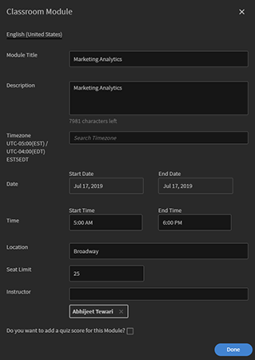
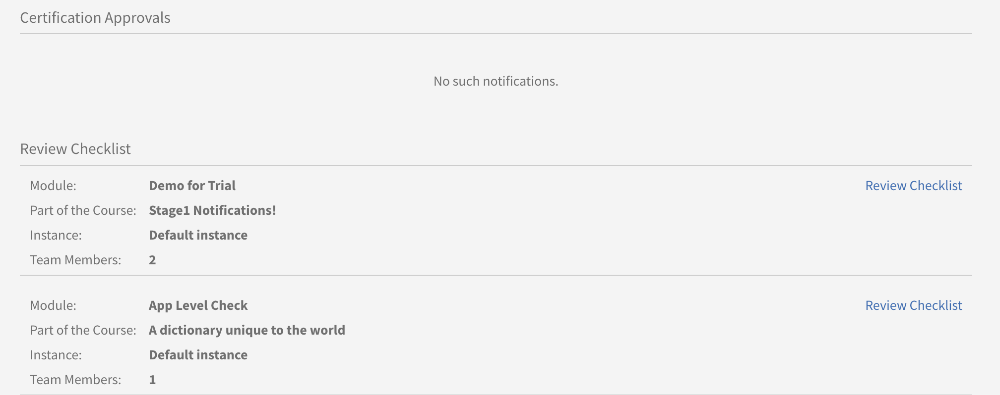

# Skapa, ändra och publicera kurser

Läs den här artikeln om du vill lära dig hur du skapar kurser, certifieringar och utbildningsprogram i Learning Manager.

Författare kan skapa utbildningsobjekt som kurser, certifieringar och utbildningsplaner. Elever kan nyttja dessa utbildningsobjekt, medan administratörer kan spåra elevernas framsteg.

## Kurser i Learning Manager {#coursesincaptivateprime}

Med Adobe Learning Manager kan författare skapa kurser med en eller flera moduler som är relaterade till virtuell utbildning, utbildning i egen takt, klassrumsutbildning och aktiviteter. Administratörer kan vidare använda dessa kurser för att skapa kursinstanser, registrera elever, tilldela utmärkelsetecken och aktivera feedback för kurserna. De kan också skapa utbildningsprogram, utbildningsplaner och certifieringar med hjälp av dessa kurser.

Författare kan använda e-utbildningsinnehåll som skapats med vilket e-utbildningsverktyg som helst. Andra kursformat som kan användas är videofiler, PDF, doc, docx, PPT och PPTX.

## Skapa en kurs - grundläggande arbetsflöde {#createacoursebasicworkflow}

Följ stegen nedan för att skapa en kurs:

1. Logga in på Adobe Learning Manager som författare eftersom det bara är författare som har rätt att skapa kurser. På sidan Komma igång klickar du på **[!UICONTROL Create Courses]**.
1. Ange namnet på kursen på sidan **Kursöversikt**. Ange nu en kort beskrivning av kursen som visas på kurskortet. Beskrivningen får innehålla högst 140 tecken. Ange sedan den detaljerade översikten för kursen som visas på sidan Kursinformation. Beskrivningen får inte överstiga 1 500 tecken.

   Som författare kan du se beskrivningen av modulerna när du lägger till modulen i en kurs.

1. För att göra din kurs tillgänglig på andra språk klickar du på Lägg till nytt språk från det övre vänstra hörnet på sidan. Välj det eller de språk som du vill göra kursen tillgänglig på. Klicka på **[!UICONTROL Save]**. Mer information finns i [Lägg till innehåll för olika språk](/help/migrated/authors/feature-summary/content-library.md).
1. **Ändra kursinställningar**-

   1. Välj en färdighet för kursen på sidan Kursinställningar. Välj önskad kompetens i listrutan Kompetens. I listrutan Nivå väljer du sedan önskad nivå.
   1. Välj kursfärdigheter, nivå och ange poäng för kompetensen. Lägg till fler kompetenser om det behövs.
   1. Välj typ av registrering i listrutan **Registreringstyp**.

   Följande typer av registreringar finns:

   * **Chefsnominerad:** Endast chefer kan nominera dessa kurser. En elev kan inte registrera sig för dessa typer av kurser.
   * **Chefsgodkända:** Chefer godkänner dessa kurser. Elever kan registrera sig för dessa kurser, men de registreras inte direkt till dessa typer av kurser utan chefens godkännande. En aviseringsbegäran skickas till chefer när elever registrerar sig för dessa typer av kurser. Efter chefens godkännande listas dessa kurser som registrerade för elever.
   * **Egenregistrerade:** Elever kan direkt registrera sig för den här typen av kurser.

1. Klicka på **[!UICONTROL Save]** för att spara ändringarna. Klicka på **[!UICONTROL Publish]** för att publicera kursen.

## Skapa en kurs - avancerat arbetsflöde {#createacourseadvancedworkflow}

1. Logga in på Adobe Learning Manager som författare eftersom det bara är författare som har rätt att skapa kurser. På sidan Komma igång klickar du på **[!UICONTROL Create Courses]**.
1. Ange namnet på kursen på sidan **Kursöversikt**. Ange nu en kort beskrivning av kursen som visas på kurskortet. Beskrivningen får innehålla högst 140 tecken. Ange sedan den detaljerade översikten för kursen som visas på sidan Kursinformation. Beskrivningen får inte överstiga 1 500 tecken.
1. För att göra din kurs tillgänglig på andra språk klickar du på Lägg till nytt språk från det övre vänstra hörnet på sidan. Välj det eller de språk som du vill göra kursen tillgänglig på. Klicka på **[!UICONTROL Save]**. Mer information finns i [Lägg till innehåll för olika språk](/help/migrated/authors/feature-summary/content-library.md).
1. **Ändra kursinställningar**-

   1. Välj en färdighet för kursen på sidan Kursinställningar. Välj önskad kompetens i listrutan Kompetens. I listrutan Nivå väljer du sedan önskad nivå.
   1. Välj kursfärdigheter, nivå och ange poäng för kompetensen. Lägg till fler kompetenser om det behövs.
   1. Lägg till anpassade kompatibilitetsetiketter i kursen, om det behövs. Se [Lägg till kompatibilitetsetiketter i kurs/utbildningsväg/certifiering](/help/migrated/authors/feature-summary/courses.md#add-compliance-labels-to-courselearning-pathcertification).
   1. Välj typ av registrering i listrutan **Registreringstyp**.

   Följande typer av registreringar finns:

   * **Chefsnominerad:** Endast chefer kan nominera dessa kurser. En elev kan inte registrera sig för dessa typer av kurser.
   * **Chefsgodkända:** Chefer godkänner dessa kurser. Elever kan registrera sig för dessa kurser, men de registreras inte direkt till dessa typer av kurser utan chefens godkännande. En aviseringsbegäran skickas till chefer när elever registrerar sig för dessa typer av kurser. Efter chefens godkännande listas dessa kurser som registrerade för elever.
   * **Egenregistrerade:** Elever kan direkt registrera sig för den här typen av kurser.

1. Välj om du vill ange ett pris för kursen eller göra den gratis. Om du vill att kursen ska betalas väljer du alternativet **[!UICONTROL Paid]** och anger ett pris. Priset visas sedan på kurskortet och sidan Kursöversikt för en elev.

   OBS! Detta aktiveras bara när Adobe Commerce-anslutningen har konfigurerats.

1. Om du vill ge elever möjlighet att avregistrera sig själva från din kurs ska du aktivera kryssrutan **Elever kan avregistrera sig själva**.

1. **Instanskonfiguration**

   Om du aktiverar det här alternativet kan elever som är i läget Pågår besöka andra instanser och registrera sig där. En elev kan sedan behålla förloppet i föregående instans.

   Om du efter att ha publicerat kursen kommer tillbaka till sidan Inställningar är alternativet inte längre redigerbart.

   Du kan aktivera alternativet för följande kurstyper:

   * I egen takt
   * Klassrum
   * Aktivitet
   * Blandat

   Obs! Om du har aktiverat alternativet Instanskonfiguration i källkursen när du duplicerar en kurs förblir alternativet inaktiverat i målkursen.

   **Instansväxling stöds inte för**:

   * Betalda kurser
   * Kurser av typen chefsnominerad registrering.

   Konfigurationen av instansväxling sprids inte till kollegiala konton om den delas via katalogen. Alternativet förblir inaktiverat i målkursen.

1. **Flera registreringar**

   Med hjälp av detta kan du registrera elever i mer än en kursinstans vid en eller olika perioder.

   Aktivera växeln **Flera registreringar** för att växla mellan olika kursregistreringar för en elev. Om du har aktiverat instansväxling kan du inte använda Flera registreringar.

1. Välj de kurser som är obligatoriska och som måste slutföras innan du påbörjar kursen. Klicka på fältet Kurser och välj från listan över kurser.
1. Aktivera kryssrutan **Aktivera** **Förutsättningar** om du vill att de obligatoriska kurserna ska vara obligatoriska.
1. Lägg till nyckelord som taggar relaterade till din kurs. Dessa taggar hjälper eleverna att enkelt hitta din kurs under sökningen. Alla dessa taggar läggs till automatiskt baserat på de moduler som vi har lagt till. Om du har andra taggar som du vill lägga till i kursen kan du ange dem.
1. Lägg till nyckelord som taggar relaterade till din kurs. Dessa taggar hjälper eleverna att enkelt hitta din kurs under sökningen. Alla dessa taggar läggs till automatiskt baserat på de moduler som vi har lagt till. Om du har andra taggar som du vill lägga till i kursen kan du ange dem.
1. I fältet Ta bort automatiskt väljer du ett datum när kursen tas ur bruk. Administratören måste aktivera alternativet Ta bort automatiskt först.
1. Klicka på **[!UICONTROL Save]** för att spara ändringarna. Klicka på **[!UICONTROL Publish]** för att publicera kursen.

### Lägg till efterlevnadsetiketter till kurs/utbildningsväg/certifiering {#add-custom-compliance-label}

Följ de här stegen om du vill lägga till kompatibilitetsetiketterna i kurserna:

1. Gå till **[!UICONTROL Courses]**/**[!UICONTROL Learning Paths]**/**[!UICONTROL Certifications]** i skaparappen och välj **[!UICONTROL Add]**.
1. Skriv namnet och andra uppgifter som beskrivning och kunskaper.
1. Skriv och välj kompatibilitetsetiketten i textrutan **[!UICONTROL Custom compliance]**.

   
   _Lägg till anpassad efterlevnad_

   >[!IMPORTANT]
   >
   >Se till att ange en deadline för kursen när du lägger till anpassad efterlevnad.

   >[!NOTE]
   >
   >Högst 50 kurser, utbildningsvägar eller certifieringar kan ha samma värde för en anpassad överensstämmelsetypetikett.

1. Spara och publicera kursen/utbildningsvägen/certifieringen.
Nu betraktas kursen/utbildningsvägen/certifieringen som en efterlevnadstyp. Administratörer kan lägga till kursen i efterlevnadstavlan och dela den med chefer för att spåra förloppet

>[!NOTE]
>
>Författare kan även lägga till kompatibilitetsetiketterna i en befintlig kurs/utbildningsväg/certifiering genom att redigera dem.

## Spelifieringspunkter

Du kan tilldela spelifieringspoäng på kurs- och kursinstansnivåerna. På så sätt kan du ge poäng till olika kurser eller instanser. Elever sporras att gå specifika kurser eller föredrar en viss kursinstans framför andra.

1. Välj **[!UICONTROL Gamification Points]** på kursinstansnivån.


*Ställ in poäng för spelifiering*

1. Välj **[!UICONTROL Edit]**.
1. Om du väljer Använd inställningar på kursnivå visas följande alternativ:

   * **[!UICONTROL On completion]**: Välj den här växlingsknappen om du vill att eleven ska få 100 poäng när hen slutför en kurs.
   * **Fler regler**

      * **[!UICONTROL Early completion]**: Om du väljer detta alternativ tilldelas de första 30 eleverna 100 poäng när de slutför en kurs.
      * **[!UICONTROL Timely completion]**: Om du väljer detta får eleverna 100 poäng om de slutför en kurs inom 999 dagar.

1. Om du markerar **[!UICONTROL Use custom settings]** visas följande alternativ:

   * **[!UICONTROL On completion]**: Välj den här växlingsknappen om du vill att eleven ska få 100 poäng när hen slutför en kurs.
   * **Fler regler**

      * **[!UICONTROL Early completion]**: Om du väljer detta alternativ kan du bestämma hur många elever som ska tilldelas specifika poäng.
      * **[!UICONTROL Timely completion]**: Om du väljer detta alternativ kan du bestämma antalet poäng som elever tilldelas om de slutför en kurs inom en angiven tid.

   

   *Ange tidigt slutförande i tid*

1. Välj **[!UICONTROL Save]**.

## Samla utbildningsresurser

En författare kan bestämma om han eller hon vill aggregera utbildningsresurserna på nivån Utbildningsplan eller låta dem stanna på nivån för en enskild kurs.

Välj **[!UICONTROL Learning Path]** > **[!UICONTROL Settings]** som författare. Klicka på **[!UICONTROL Edit]**.

I avsnittet **[!UICONTROL Resources]** visas om resurser på utbildningsvägsnivå visas i kryssrutan Visa resurser för ingående kurs sammansatt på nivån Utbildningsväg när den är aktiverad.

>[!NOTE]
>
>På sidan Inställningar för en utbildningsväg kan en administratör också aktivera det här alternativet, som visar resurser på kursnivån som skulle visas på nivån Utbildningsväg.

## Schemaläggningsassistent

Hantera konflikter vid bokning av instruktörer och klassrum. Om du vill veta vid vilken tidpunkt och vilket datum en instruktör är tillgänglig innan du tilldelar honom till kursen ska du använda schemaläggningsassistenten.

När du skapar en kurs, för en VC- eller CR-kurs, klickar du på Scheduling Assistant.


*Starta schemaläggningsassistenten*

Schemaläggningsassistenten öppnas.


*Dialogrutan Schemaläggningsassistenten*

Med schemaläggningsassistenten kan du:

* Sök lärare efter deras namn.
* Sök instruktörer efter deras kunskaper.

### Sök instruktörer efter namn

I fältet Instruktör skriver du namnet på instruktören eller söker efter ett ofullständigt instruktörsnamn. En lista med instruktörer visas, där du kan välja en instruktör.


*Sök efter instruktörer*

Flera instruktörer kan väljas men endast en instruktör kan tilldelas åt gången. Den valda tiden markeras i fönstret för tidskonflikt. I närheten av instruktören visas en kryssikon som du klickar på för att ta bort instruktören.


*Sök efter flera instruktörer*

### Sök instruktörer efter kompetens

Sök efter en instruktör med en eller flera färdigheter. För sökningen används operatorn OCH.

Kompetenser kan endast sökas efter delar av eller hela kompetensnamnet, inte efter kompetensnivå.

På assistenten anger du instruktörens namn, plats och platsgräns.

Du kan också söka kompetens, som visas efter att du har klickat på filterikonen till höger i sökrutan Instruktör. Skärmbilden nedan visar knappen.


*Sök efter instruktörer efter kompetens*

### Filter för användargrupper

Välj filtret i fältet Instruktör. Det finns ett **[!UICONTROL User Group]**-filter som en författare eller anpassad författare kan hitta rätt instruktör genom att använda värdena i användargruppen.

Om båda filtren används visas en lista med instruktörer som tillhör användargruppen och som har de valda kunskaperna.

Detta gäller schemaläggningsassistenten på sidan Kurser eller instanser.


*Filtrera på användargrupper*

### Instanssida

Du kan också komma åt Schemaläggningsassistenten från instanssidan, som visas nedan.

Schemaläggningsassistenten finns även på instanssidan för administratörer och anpassade administratörer/författare.


*Schemalägg instruktörer från sidan Instanser*

### Sök efter en plats

Du kan söka efter en plats genom att ange både klassrumsnamnet och platsregionsnamnet på både modulsidan och sidan Schemaläggningsassistenten.

## RTF-formatering

När du skapar en kurs, ett utbildningsprogram, en certifiering eller ett arbetsstöd kan författaren mata in olika typer av innehåll som text, bild eller använda olika textformateringsalternativ.

När du skapar en kurs kan du se textredigeraren i fältet Kursöversikt. Du kan formatera innehåll, lägga till bilder, lägga till hyperlänkar och så vidare.


*Starta textredigeraren*

På samma sätt kan du använda textredigeraren för att ändra beskrivningen när du skapar en:

**Utbildningsprogram**


*Använd textredigerare för ett utbildningsprogram*

**Certifiering**


*Använd textredigerare för ett certifikat*

**Arbetsstöd**


*Använd RTF-redigerare för arbetsstöd*

Dessutom kan du använda textredigeraren för andra språk.

## Stöd för RTF-beskrivning för fjärradministrerat användargränssnitt

### Varför krävs CSS?

RTF består av HTML-kod. Om markeringen återges i befintligt skick kommer standardformatet att användas i webbläsaren. Det här passar ofta inte så bra ihop med företagets stilriktlinjer. En CSS krävs för att uppfylla riktlinjerna.

### Standardformat

Den bifogade CSS-formatmallen innehåller den formatering som används av Learning Manager. Formateringen ändras med tanke på de flesta användningsfallen. Hämta den bifogade CSS-filen och importera den till webbappen enligt dina konventioner och bygg system. De CSS-klasser som definierats har namnutrymmen under klassen ql-editor och påverkar inte dina befintliga format.

### Anpassa format

Standardstilen kanske inte uppfyller alla behov. Anpassningarna kan göras genom att åsidosätta den CSS-kod som anges. All formatering lindas under ql-editor som underordnade väljare. Följande klasser används:

* Indrag: **li.ql-indent-$number**. $number varierar från 1-9
* storlek: **ql-size-small**, **ql-size-large**, **ql-size-large**

* justering: **ql-align-center**, **ql-align-adjust**, **ql-align-right**

* färg: **ql-color-$color**. $color = vit, röd, orange, gul, grön, blå, lila
* bakgrund: **ql-bg-$color**. $color = svart, röd, orange, gul, grön, blå, lila
* html-taggar: p, ol, ul, pre, blockquote, h1, h2, h3, h4, h5, h6

[CSS-fil som ska användas för anpassning.](assets/ql-headless.css)

### API-ÄNDRINGAR FÖR ATT AKTIVERA ÅTERGIVNING AV RTF-ÖVERSIKTER

När kunder bygger ett fjärradministrerat gränssnitt måste de visa utbildningsobjekten i det anpassade användargränssnitt som de utvecklar. För att göra detta använder man vanligtvis [GET /learningObjects](https://learningmanagereu.adobe.com/docs/primeapi/v2/#!/learning_object/get_learningObjects)-API:et som visas. Nu när Learning Manager stöder hämtning av &quot;RTF&quot; för översiktsfältet visar även datamodellen för utbildningsobjekt i API-svaren samma sak. Se fältet med namnet &quot;richTextOverview&quot; i avsnittet om modellen i API-svaret nedan. Observera även att fältet som visades tidigare (&quot;översikt&quot;) förblir oförändrat för bakåtkompatibilitet.

```
{ 
 "data": [ 
 { 
 "id": "string", 
 "type": "string", 
 "attributes": { 
 … 
 "localizedMetadata": [ 
 { 
 "description": "string", 
 "locale": "string", 
 "name": "string", 
 "overview": "string", 
 "richTextOverview": "string" 
 } 
 ], 
 … 
 }, 
 "relationships": { 
 … 
 } 
 } 
 } 
 ] 
} 
```

Kunder som redan använder översiktsfältet påverkas inte i sitt huvudlösa gränssnitt och ser bara vanlig text som förut. Om kunder vill använda RTF-översikten måste de skapa rikt formaterade översikter för sina utbildningsobjekt i användargränssnittet för författare och efter det kommer Learning Manager att börja returnera RTF-översikten också, utöver oformaterad text (som tidigare) i API-svarsmodellen.

Kunden måste dock inkludera en CSS-kod för att kunna återge den detaljerade texten i användargränssnittet. Detta förklaras i detalj i följande avsnitt.

## Tillåt flera försök {#allowmultipleattempts}

När administratören har aktiverat flera försök kan du som författare konfigurera flera försök för en interaktiv e-utbildningsmodul på kurs- eller modulnivå.


*Konfigurera flera försök för en interaktiv e-utbildningsmodul*

<table>
 <tbody>
  <tr>
   <td>
    <p><b>Alternativ</b></p></td>
   <td>
    <p><b>Beskrivning</b></p></td>
  </tr>
  <tr>
   <td>
    <p>Ställ in antal försök till</p></td>
   <td>
    <p>Du kan ställa in antalet försök för en modul till oändligt eller ange en definitiv gräns.<span style="font-size: 0.8125rem;">Förslagsinformationen visas för eleven när den har aktiverats. Eleven kan välja att göra om ett försök med modulen genom att klicka på knappen Försök igen.</span></p></td>
  </tr>
  <tr>
   <td>
    <p>Avsluta nytt försök så snart modulen har slutförts eller godkänts</p></td>
   <td>
    <p>Aktivera kryssrutan "Stoppa nytt försök när modulen är slutförd eller godkänd" för att konfigurera när elever ska hindras från att välja alternativet nytt försök. Alternativet "Försök igen" kommer att tas bort från elevvyn när de har slutfört modulen.</p></td>
  </tr>
  <tr>
   <td>
    <p>Lås modul mellan försök 0:0:1 Format: Dagar/timmar/minuter</p></td>
   <td>
    <p>Du kan låsa moduler under en viss tid mellan försöken genom att markera kryssrutan <b>Lås modulen mellan försöken 0:0:1 Format: Dagar/Timmar/Minuter</b>. När en modul är låst kan eleven inte besöka modulen förrän den angivna låsningstiden har gått ut. </p>
    <p>Du kan definiera slutvillkoren för ett försök genom att markera kryssrutorna <b>Stäng spelare</b> eller <b>Slutförande</b>.</p></td>
  </tr>
  <tr>
   <td>
    <p>Avslutning av spelare</p></td>
   <td>
    <p>Varje modulstart behandlas som ett nytt försök om kriteriet har valts som <b>Avslutning av spelare</b>. En elev uppmanas att ange information om modullås och försök till detaljer när spelaren stängs.</p></td>
  </tr>
  <tr>
   <td>
    <p>Slutförande</p></td>
   <td>
    <p>Om slutet av ett försök baseras på <b>Slutförande</b> beräknas det utifrån kriteriet för lyckat innehåll. Eleverna får inte göra om försök med modulen förrän innehållet har skickat informationen om slutförandet. Information om modullås och försök meddelas eleven när ett försök avslutas.</p></td>
  </tr>
  <tr>
   <td>
    <p>Ange tidsgräns för att slutföra modul</p></td>
   <td>
    <p>Författare kan ange en tidsgräns för att slutföra en modul genom att markera kryssrutan <b>Ange en tidsgräns för att slutföra modul</b>.</p>
    <p>Varje spelaruppskjutning betraktas som ett nytt försök och eleven uppmanas att ange tidsinformationen vid uppskjutningen.</p>
    <p><b>Obs!</b><span style="font-size: 0.8125rem;">Försöket avslutas automatiskt när tiden har gått ut. Om du även stänger spelaren avslutas det aktuella försöket.</span></p></td>
  </tr>
  <tr>
   <td>
    <p>Flera försök på modulnivå</p></td>
   <td>
    <p>Om du väljer ett försök på modulnivå från listrutan Ange försök på kan du konfigurera alternativen på individuell modulnivå.</p></td>
  </tr>
 </tbody>
</table>

## Kursmoduler {#coursemodules}

### Lägg till moduler {#addmodules}

Nu kan du lägga till modulerna Innehåll, Förarbete och Testa. **Innehåll** moduler är de huvudmoduler som kursen består av. Modulerna **Förarbete** innehåller grundläggande information som kan hjälpa elever att förbereda sig för kursen. Dessa moduler är inte obligatoriska för eleverna att slutföra. **Testa** moduler hjälper elever att hoppa över innehållet och göra testet om de redan känner till innehållet och vill göra testet för att uppfylla efterlevnadskravet.

Följ stegen nedan om du vill lägga till en innehållsmodul:

1. Klicka på **[!UICONTROL Add Modules]**. Det finns fyra alternativ för att lägga till moduler. Det första alternativet är att lägga till moduler i eget tempo. Det här är modulerna som du skapar och lägger till i modulbiblioteket i Adobe Learning Manager. Det andra alternativet är att konfigurera det virtuella klassrummet. Den tredje är att konfigurera en klassrumsmodul och den fjärde är Aktivitetsmodul.

   

   *Lägg till en modul för en kurs*

   **Modul i egen takt:** I det här läget kan du starta och slutföra en kursmodul i din egen takt. Du kan ange ett eget schema.

   När du har klickat på alternativet visas en lista med moduler för eget tempo som redan har lagts till i modulbiblioteket. Här kan du antingen bläddra igenom listan och välja vilka du vill lägga till, eller så kan du söka efter moduler genom att skriva modulens namn i sökfältet eller modultaggarna.

   Klicka på **[!UICONTROL Add]** när du har valt moduler. Dessa moduler visas nu i avsnittet Innehåll.

   Du kan även ändra ordning på modulerna. Dra en modul och flytta den uppåt eller nedåt och ordna modulerna i rätt ordning.

   **Virtuell klassrumsmodul:** I det här läget kan elever delta i onlinelektioner live ledda av en utbildad instruktör. Ange sessionens titel, beskrivning och varaktighet. Du kan också ange webbadressen till konferensen och vilka instruktörer som ska leda sessionen. Klicka på **[!UICONTROL Done]** för att spara ändringarna.

   

   *Lägg till en VC-modul*

   När du skapar en kurs med hjälp av dialogrutan Konfiguration av virtuellt klassrum ställer du in **konferenssystemet** på Teams-anslutningen som du skapade. Välj om du vill ha en mötesorganisatör för evenemanget.

   Om du väljer **Ja** för en mötesorganisatör måste du ange namnet på organisatören. Ange namnet och välj organisatör.

   **Förbipassering av lobby**

   * Om du väljer **Ja** kan alla elever ansluta till mötet.
   * Om du väljer **Nej** skickas en begäran till organisatören om att tillåta eller förhindra att eleven ansluter till mötet.

   **Obs!** En elev måste vara tillgänglig på Microsoft Teams. Eleven kan dock gå med i Learning Manager som gäst.

   **Klassrumsmodul:** I det här läget deltar elever vid personliga lektioner lett av en utbildad instruktör. Ange sessionens titel, beskrivning och varaktighet. Du kan också ange var klassen och instruktörerna som ska genomföra sessionen ska vara placerade. Klicka på **[!UICONTROL Done]** för att spara ändringarna.

   

   *Lägg till en klassrumsmodul*

   När du skapar en kurs ska du i dialogrutan Konfiguration av virtuellt klassrum ställa in konferenssystemet på Microsoft Teams-anslutningen som du skapade. Välj om du vill ha en mötesorganisatör för evenemanget.

   Om du väljer Ja för en mötesorganisatör måste du ange namnet på organisatören. Skriv namnet på organisatören och välj organisatören.

   **Förbipassering av lobby**

   * Om du väljer Ja kan alla elever ansluta till mötet.
   * Om du väljer Nej skickas en begäran till organisatören om att tillåta eller förhindra eleven från att ansluta till mötet.

   **Obs!** Om en elev vill gå med i Microsoft Teams som gäst måste han/hon ange e-postadressen. E-postmeddelandet måste finnas i Learning Manager.

   **Aktivitetsmodul:** I det här läget måste eleverna slutföra en uppsättning aktiviteter, som workshops, övningar, frågeformulär och andra utbildningsaktiviteter. Ange rubriken, beskrivningen och den externa webbadressen för referens. Klicka på **[!UICONTROL Done]** för att spara ändringarna.

   

   *Lägg till en aktivitetsmodul*

   Du kan ange varaktigheten när du lägger till en aktivitetsmodul i en kurs för filinlämning av aktivitetstyp och xAPI-baserade moduler.

1. På samma sätt lägger du till moduler för lägena Förarbete och Testa.
1. Välj ordningsföljd för moduler i sorterad eller osorterad ordning enligt dina önskemål.

   Om du väljer **Ordnad** visas modulerna i samma sekvens som du skapade dem. Om du väljer **Osorterad**, kommer modulerna inte att sekvenseras. Elever kan slutföra modulerna i valfri ordning.

1. I rullgardinsmenyn Obligatoriska moduler väljer du antalet moduler som eleven måste ta för att slutföra kursen.
1. Lägg till en omslagsbild och banderollbilden för kursen. Katalogerna skapas av administratören. Mer information finns i [Kataloger](/help/migrated/administrators/feature-summary/catalogs.md).

   **Obs!** De rekommenderade måtten är:

   * **Omslagsbild:** 300 px x 300 px
   * **Banderollbild:** 1 600 px 140 px

1. Klicka på **[!UICONTROL Save]** i det övre högra hörnet på sidan.

#### Lägg till länken HTML i modulen Aktivitet

Författare kan lägga till HTML-länkar i aktivitetsmodulen och ange slutförandevillkor. Så här lägger du till en HTML-länk och anger ett slutförandevillkor:

1. I skaparappen väljer du **[!UICONTROL Create Courses]** på startsidan.
1. Välj **[!UICONTROL Add]** från skärmen **[!UICONTROL Course Catalog]**
1. Skriv namnet på och beskrivningen av kursen.
1. Välj **[!UICONTROL Module]** > **[!UICONTROL Add Module]** i alternativet **[!UICONTROL Activity Module]**.
1. Skriv namn och beskrivning i uppmaningen **[!UICONTROL Activity Module]**.
1. Välj **[!UICONTROL Type]** som **[!UICONTROL External URL]**.
1. Välj något av följande alternativ från alternativet **[!UICONTROL Completion Criteria]**.
   * **[!UICONTROL Learner marks complete]**: Eleven kan markera kursen som slutförd i Fluidic-spelaren.
   * **[!UICONTROL On Launching content]**: Kursen markeras automatiskt som slutförd när eleven startar den.

   
   _Kriterier för slutförande_

1. Välj **[!UICONTROL Add]** och publicera kursen.

### Byt ut modulerna i publicerade kurser

Adobe Learning Manager tillhandahåller verktyg för att skapa, redigera och hantera kurser som består av flera innehållsmoduler. När kursinnehållet behöver uppdateras eller förbättras kan författare ersätta befintliga moduler utan att störa elevens framsteg.

Ersätta modulerna:

1. Logga in på Adobe Learning Manager som författare.
2. Välj **[!UICONTROL Courses]** i den vänstra navigeringsrutan.
3. Välj en kurs och välj sedan **[!UICONTROL Edit]**.
4. Välj den modul du vill ändra.
5. Ändra titel och beskrivning.
6. Välj modul med alternativet **Innehåll**.
   
7. Välj **[!UICONTROL Done]**.
8. Välj **[!UICONTROL Republish]**.

Eleverna behåller sina framsteg i andra moduler men måste slutföra den nya modulen för att slutföra kursen.

## Checklista {#create-checklist}

Utvärdering är en viktig aspekt av alla system för hantering av inlärning. Utvärderingar online är ett av de bästa sätten att utvärdera en elevs förståelse av ett ämne. Men ofta är det nödvändigt att utvärdera en persons förståelse när hon/han är på jobbet genom att observera honom/henne utföra de nödvändiga uppgifterna.

Man kan tänka sig butiksanställda eller lagerarbetare som genomgår en utvärdering för de uppgifter de förväntas utföra på daglig basis. Det kan vara de steg som utförs för att reparera en kaffemaskin eller de steg som krävs för att packa ett material. Instruktörer kan utvärdera anställda för sådana uppgifter på grundval av en checklista och utvärdera dem som godkända eller underkända i utvärderingsaktiviteten.

### Skapa en checklista {#createachecklist}

Det är bara en författare som kan skapa en checklista. En checklista är en typ av aktivitetsmodul. När du konfigurerar en aktivitetsmodul kan du som författare välja en aktivitet som **Checklista**, som visas nedan:


*Skapa en checklista*

När du har valt alternativet **Checklista** visas ytterligare några alternativ.

**Checklistetyp:** Välj ett alternativ, **Ja/nej** eller **1-5**. Om du väljer Ja/Nej innehåller checklistan frågor som bara kan besvaras med Ja eller Nej. Om du väljer 1-5 kan du se en Likertchecklista, där du kan betygsätta en fråga på en femgradig skala.

**Kriterier för godkänt:**

<table>
 <tbody>
  <tr>
   <td>
    <p>Om du hade valt <b>Ja/nej</b>, så...</p></td>
   <td>
    <p>Om du hade valt <b>1-5</b> så...</p></td>
  </tr>
  <tr>
   <td>
    <p>Ange kriteriet för godkänt som antalet svar som Ja. Om du till exempel anger 3 godkänner eleven kursen om han/hon får minst tre <b>Ja </b>svar, efter utvärdering av en instruktör.</p></td>
   <td>
    <p>Ange kriterier för godkänt som ett tröskelvärde för ett tal mellan 1 och 5. Om du till exempel skriver in 2 och 4 godkänner eleven kursen om han/hon uppnår minst <b>två </b>utvärderingar som har poäng högre än eller lika med <b>fyra</b>.</p></td>
  </tr>
 </tbody>
</table>

Välj en eller flera instruktörer som ska utvärdera eleven.

Om du har något att kommentera eller en anteckning kan du lägga till det i textfältet **Anteckning till instruktör**.

Nu lägger du till checklistefrågorna. Klicka på **[!UICONTROL Add]**. Du kan bara lägga till högst 150 frågor.


*Lägg till checklistefrågor*

Klicka på **[!UICONTROL Add more]** om du vill lägga till fler frågor.

Spara ändringarna, lägg till modulen och publicera kursen.

### Lägg till kompetenser {#addskills}

Ange följande information på den här sidan:

1. Välj kursfärdigheter, nivå och ange poäng för kompetensen. Lägg till fler kompetenser om det behövs.

   

   *Lägg till kompetenser för en kurs*

1. Välj typ av registrering. Följande alternativ finns:

   * **Chefsnominerad:** Endast chefer kan nominera dessa kurser. En elev kan inte registrera sig för dessa typer av kurser.
   * **Chefsgodkända:** Chefer godkänner dessa kurser. Elever kan registrera sig för dessa kurser, men de registreras inte direkt till dessa typer av kurser utan chefens godkännande. En aviseringsbegäran skickas till chefer när elever registrerar sig för dessa typer av kurser. Efter chefens godkännande listas dessa kurser som registrerade för elever.
   * **Egenregistrerade:** Elever kan direkt registrera sig för den här typen av kurser.

1. Om du vill ge elever möjlighet att avregistrera sig själva från din kurs ska du aktivera kryssrutan **Elever kan avregistrera sig själva**.
1. Välj de kurser som är obligatoriska och som måste slutföras innan du påbörjar kursen. Klicka på fältet Kurser och välj från listan över kurser.

   

   *Lägg till obligatoriska kurser*

1. Aktivera kryssrutan **Förutsättningar** om du vill att jag ska få de obligatoriska kurserna.
1. Lägg till nyckelord som taggar relaterade till din kurs. Dessa taggar hjälper eleverna att enkelt hitta din kurs under sökningen. Alla dessa taggar läggs till automatiskt baserat på de moduler som vi har lagt till. Om du har andra taggar som du vill lägga till i kursen kan du ange dem.
1. Lägg till profilerna för din målgrupp för kursen genom att klicka i textområdet och välja profilerna från förslagen.
1. Lägg till resursfiler till din kurs som extra material. Dra dina material som text, video eller ljudfiler.
1. Nu kommer den här kursen att vara tillgänglig för dessa elever som har dessa profiler som en rekommenderad kurs. Du kan även bifoga ytterligare resurser till dina elever i detta avsnitt. Elever kommer att kunna hämta dessa filer för senare referens. När du är klar med alla dessa ändringar går du vidare och klickar på **[!UICONTROL Save]** i det övre högra hörnet. Då sparas kursen som ett utkast. Kursen sparas som utkast som standard.

## Tilldela instruktörer för moduler {#assigninstructorsformodules}

1. När du har skapat moduler till din kurs kan du tilldela instruktörer till modulerna. Klicka på **[!UICONTROL Course Catalog]** på kontrollpanelen Författare.
1. Klicka på kursen vars modul du vill tilldela instruktörer.
1. Klicka på modulen som du vill tilldela en instruktör i avsnittet **Lägg till moduler**.
1. Ange användarnamnet för användaren som du vill tilldela instruktörsrollen i fältet **Instruktör**.

   

   *Tilldela en instruktörsroll till en användare*

1. Klicka på **[!UICONTROL Republish]** om du vill återpublicera kursen med uppdateringarna.

### Tillåt att instruktörer markerar framsteg

Med Adobe Learning Manager kan instruktörer markera elevernas framgångsstatus i ett klassrum eller en virtuell klassrumsmodul. Författare kan ge instruktörer behörighet att markera status som lyckad för elever när de skapar klassrumsmoduler eller virtuella klassrumsmoduler. Instruktörer kan markera framgången genom att markera en elev som godkänd eller ej, vilket säkerställer att förloppet uppdateras därefter.

Så här tillåter du att instruktörer markerar elevens framgång:

1. Logga in på Adobe Learning Manager som författare.
2. Välj **[!UICONTROL Create Courses]** på startsidan.
3. Välj **[!UICONTROL Add]**.
4. Ange nödvändig information och välj **[!UICONTROL Add Modules]**.
5. Välj **[!UICONTROL Virtual Classroom Module]** eller **[!UICONTROL Classroom Module]**.
6. Ange nödvändiga uppgifter och välj datum.
7. Välj alternativet **[!UICONTROL Allow Instructor to mark success]**.

   
   _Skärmen Sessionsdetaljer med alternativet Tillåt instruktör att markera slutförda aktiviteter markerat för klassrums- eller virtuella klassrumsmoduler_

8. Välj **[!UICONTROL Done]**.


## Checklista för observation

En checklista modul kan nu granskas av chefer förutom instruktörer. Personer chefer, samt icke-hierarkiska chefer, såsom butikschefer eller platschefer, kan granska och slutföra checklistan.

Kursförfattare kan lägga till personhanterare och icke-hierarkiska chefer (om tillämpligt) som granskare genom att välja dessa rollalternativ i avsnittet Granskare när de konfigurerar en checklistmodul. Detta kan göras på kursinstansnivå.


*Lägg till granskare i en aktivitetsmodul*

Om du väljer alternativet **[!UICONTROL +Managers]** aktiveras en elevs chef i organisationshierarkin automatiskt för att granska checklistan. Du behöver inte söka efter och lägga till chefsnamn individuellt.

Om din kontoadministratör har konfigurerat icke-hierarkiska chefsroller (t.ex. platshanterare eller platshanterare) genom att använda alternativet Aktiva fält, kommer dessa chefsroller att vara tillgängliga för dig att välja och aktivera dem för att granska checklistan.

Du behöver inte söka efter och lägga till chefsnamn individuellt. När elever registrerar sig för checklistan kommer den automatiskt att skicka ett meddelande till sina chefer/butikschefer för granskning tillsammans med vald instruktör. Det här arbetsflödet gör det enkelt för författare att inte nämna enskilda chefers namn.

I exempelskärmbilden ovan aktiverar du alternativet **[!UICONTROL +Store Managers]** automatiskt den icke-hierarkiska hanteraren justerad mot eleven för att granska checklistan. Observera att &quot;store&quot; här ersätts av det aktiva fält som administratören har definierat.

Uppdateringar av checklistmodulen inkluderar även meddelanden till instruktörer och chefer när en elev är registrerad i en kurs som har en checklistmodul i sig. Granskaren får ett meddelande i Learning Manager-meddelandecentret samt på instruktörens/chefens instrumentpanel om att en checklisteåtgärd ska utföras.

<!---->

Granskaren kan visa information om alla väntande checklista för granskningsobjekt från menyn Checklistor samt meddelandemenyn när hen loggar in som instruktör/chef.



*Godkännanden för certifiering*

När granskaren har klickat på Granska checklista kan han/hon slutföra utvärderingen.


*Granska väntande checklista för granskningsobjekt*

Rapporteringen kan hämtas på checklistor, som innehåller detaljerad information om elevutvärdering, granskarens namn, roll och e-post.

CSV-filen med checklisterapporter innehåller de nya och uppdaterade fälten:

* Granskarens namn i stället för instruktörens namn
* Granskarens e-postadress i stället för instruktörens
* Granskarroll - möjliga värden är Chef, Butik/Platshanteraren, Instruktör

## Förhandsgranska en kurs {#previewacourse}

När kursen har skapats och sparats som ett utkast kan du förhandsgranska kursen som elev och sedan publicera den för att göra den tillgänglig i kurskatalogen.

Klicka på **[!UICONTROL Preview as learner]** om du vill förhandsgranska kursen.


*Förhandsgranska en kurs som elev*

Detta öppnar sidan **Översikt** av kursen där du kan se modulerna, deras ordning och andra detaljer som rör kursen.


*Visa moduler och annan relaterad information*

Om du vill se hur eleverna kan uppleva kursen klickar du på var och en av dessa moduler för att börja spela upp den. Detta börjar spela kursen i Fluidic Player.

## En kurs i Publish {#publishacourse}

Efter att ha förhandsgranskat kursen som elev kan du publicera den, så att den blir tillgänglig för elever att konsumera. Observera att kursen fortfarande är i utkastläge.

Kursens livscykel ser normalt ut så här:

* **Utkast** - när en författare har skapat en kurs och sparat den. I det här läget är kursen inte tillgänglig för elever ännu.
* **Publicerad** - när en författare har slutfört publiceringen av en kurs. I det här läget är kursen tillgänglig så att elever kan registrera sig. Du kan även redigera en kurs i det här läget.
* **Utfasad** - Efter att ha publicerat en kurs kan en författare flytta den till ett utfasat tillstånd om författaren inte vill att kursen ska visas i kurskatalogen för elever.
* **Borttaget** - En kurs under borttaget tillstånd tas bort helt från Adobe Learning Manager-programmet. Det är bara författare som kan ta bort kurser när de är i tillståndet Utkast eller Utfasad.


*Arbetsflöde i en kurscykel*

Klicka på **[!UICONTROL Publish]** längst upp till höger på sidan om du vill publicera kursen som du har skapat.


*Publish en kurs*

Klicka på **[!UICONTROL OK]** i bekräftelsemeddelandet som visas.

Kursen är nu tillgänglig i kurskatalogen.

## Visa en kurs {#viewacourse}

Du kan visa en lista över alla tillgängliga kurser som författare. Klicka på Kurskatalog för att se alla kurser i Learning Manager-kontot. Klicka på **[!UICONTROL My Courses]** för att se alla dina redigerade kurser i Learning Manager.

Håll pekaren över alternativen på kurskortet och klicka på **[!UICONTROL View Course]**.


*Visa en kurs*

Fönstret med kursinformation visas. Kursen är i skrivskyddat läge. Klicka på **[!UICONTROL Edit]** om du vill ändra kursen.

## Ta bort en kurs {#retireacourse}

Vid utfasning av en kurs döljs den för elever, även om de är registrerade eller redan har slutfört den. Om du tar en kurs ur bruk kan du inte registrera nya elever på kursen. Elever som redan är registrerade kan ta kursen.

Om du vill ta en kurs ur bruk ska du gå till kurskortet, hålla pekaren över alternativen och klicka på Ta bort kurs.


*Ta en kurs ur bruk*

Klicka på **[!UICONTROL Yes]** i bekräftelsefönstret som visas.

## Duplicera en kurs {#duplicateacourse}

Du kan skapa en kopia av kursen och sedan ändra kursen. Om du vill säkerhetskopiera kursen kan du duplicera den.

## Sök efter kurser {#searchforcourses}

Adobe Learning Manager gör det enklare för dig att snabbt hitta de kurser du väljer. Du kan söka efter dina kurser på följande sätt:

**Sökfält:** Klicka på sökfältet längst upp till höger på sidan **Kurskatalog**. Skriv in kursnamnet eller nyckelord som är associerade med dina kurser. Du kan också söka med taggar som läggs till när kursen skapas. Taggar är sökbara i sökfältet för kurser, vilket innebär att taggarna visas i sökfältet när du skriver.


*Sök efter kurser*

**Filtrera listan med kurser:** Du kan filtrera kurserna efter tillstånd som Alla, Publicerat, Utkast och Utfasade. Beroende på ditt val kan du visa den filtrerade listan över kurser och välja de kurser som krävs.

Du som är författare kan även sortera kurserna så att de lättare hittar den kurs du behöver. Klicka på **[!UICONTROL Sort by]** och välj alfabetisk stigande ordning, alfabetisk fallande ordning, datum då kursen skapades, datum då kursen uppdaterades och kursernas effektivitet.


*Filtrera listan med kurser*

## Registrera elever i en kurs {#enrolllearnersinacourse}

Om du vill registrera elever för kurserna, eller om du vill tillåta chefer att nominera elever för kurserna, måste du växla till administratörsläget eftersom endast administratörer har behörighet att registrera elever för kurserna.

Växla till administratörsläge genom att

1. Klicka på din profilbild och välj sedan Administratör.
1. Klicka på **[!UICONTROL Courses]** i den vänstra rutan i administratörsläge. På denna sida kan du se alla kurser som har skapats av alla författare i ditt Learning Manager-konto.
1. Om du vill registrera elever håller du pekaren över kurskortet så kan du se alternativet **Registrera elever**. Klicka på det här alternativet.

   

   *Registrera elever på en kurs*

1. I dialogrutan Registrera elever kan du i det övre högra hörnet se att alternativet **Standardinstans** är valt. Så snart en kurs skapas av en författare skapas en standardinstans av kursen.

   

   *Visa standardinstansen av en kurs*

1. Börja skriva namnet på en elev i fältet Inkludera elever och välj en elev. Här kan du även lägga till användargrupper. Om du vill registrera alla elever i ditt Learning Manager-konto börjar du skriva alla. Du kan även registrera elever i ett team.

   

   *Lägg till elever i en kurs*

1. Om du vill utesluta någon elev från kursen. anger du namnet på eleven i fältet **Exkludera elever**.
1. När du har registrerat eleverna klickar du på **[!UICONTROL Proceed]**. I dialogrutan Registrera elever kan du visa sammanfattningen av registreringen.

   

   *Visa kursregistreringssammanfattning*

1. Klicka på **[!UICONTROL Enroll]** för att registrera alla elever i kursen. Dessa elever har nu registrerats för denna kurs. Eleverna får ett meddelande om att gå vidare och ta kursen. Upprepa registreringsproceduren om du vill registrera fler elever.

## Ändringar av kursinstanssidan för Connect VC-moduler {#connect-vc}

När du hämtar en Connect-kurs kan du skapa två typer av rum:

* Dynamisk
* Bestående

En beständig URL har alltid åtgärdats. Men för användare som inte har Connect och ett eget mötesrum måste de använda ett dynamiskt mötesrum under körning. Då kan människor ansluta sig till mötet.


*Alternativ för dynamiska mötesrum*

Du kan nu ändra URL:en till det beständiga rummet på sidan **Kursinstans**.

<!--|  |  |
|---|---|-->

## Avregistrera elever från en kurs {#unenrolllearnersfromacourse}

När du skapar en kurs kan en författare aktivera alternativet **Elever kan avregistrera sig själva**, så att elever som tar kursen kan avregistrera sig från kursen.

En administratör kan också avregistrera elever från kursen.


*Avregistrera elever från en kurs*

Mer information finns i [Avregistrera elever](/help/migrated/administrators/feature-summary/courses.md).

## Lägg till kursmoduler för Captivate och Presenter {#addcoursemodulesforcaptivateandpresenter}

Du kan även publicera kursmodulerna till Learning Manager från Adobe Captivate och Adobe Presenter via Publish-menyn.

1. Klicka på **[!UICONTROL Publish]** > **[!UICONTROL Publish to Learning Manager]** i Captivate.
1. Ange underdomännamnet eller e-post-ID:t och klicka på **[!UICONTROL Submit]**. Om du har flera konton uppmanas du att välja konto.
1. Logga in med autentiseringsuppgifterna för Adobe. Klicka på **[!UICONTROL Create Account]** om du inte har något Adobe-ID. Efter auktoriseringen dirigeras du till modulpubliceringssidan.
1. Ange all grundläggande information om modulen och klicka på Publish.

Du kan se den publicerade modulen på sidan Learning Manager-moduler. Mer information finns i [Publish-projekt till Adobe Learning Manager](https://helpx.adobe.com/se/captivate/classic/publish-project-to-captivate-prime.html).

## Kurseffektivitet {#courseeffectiveness}

Poäng för kurseffektivitet hjälper författare att utvärdera kurserna som inte fungerar enligt elevernas behov och ändra dem därefter. Kursens effektivitet utvärderas för att förstå nyttan av en kurs för eleven. Det är en kombination av resultat från elevfeedback på kursinnehållet. Kursens quiz är ett resultat för en elev och chefens feedback som utvärderar en elev baserat på inlärning från kursen.

I **Mina kurser** kan en författare visa kursens effektivitetsklassificering på kursens miniatyrbilder enligt bilden nedan. Du kan se betyget för den här kursen som 100.

<!---->

Värdet för kurseffektivitet har erhållits med beaktande av L1-, L2- och L3-feedbackvärden. Klicka på värdet för kurseffektivitet för att visa uppdelningen av varje feedback. En popup-meny visas enligt nedan.


*Beräkning av kursens effektivitet*

I den här exempelögonblicksbilden fick 1 av 1 användare alla tre typerna av feedback, därför är poängen 100/100. Från den här tabellen kan du förstå den feedback som saknas för att förbättra den övergripande effektiviteten. Om du vill se hur kurseffektiviteten beräknas, klickar du på nedåtpilen längst ned till höger på snabbmenyn.

<!---->

Enligt cirkeldiagrammet ovan viktas L3-feedback från chefen mer.

## Certifieringar och utbildningsprogram {#certificationsandlearningprograms}

Både Författare och Administratör kan skapa certifieringar och utbildningsprogram för elever från appen Författare. På startsidan klickar du på antingen Certifieringar eller Utbildningsprogram för att skapa respektive utbildningsobjekt.

Information om hur du skapar och hanterar certifieringar och utbildningsprogram finns i [Certifieringar](/help/migrated/administrators/feature-summary/certifications.md) och [Utbildningsprogram](/help/migrated/administrators/feature-summary/learning-programs.md).

## Obligatoriska kurser för extern certifiering {#mandatorycoursesforexternalcertification}

I tidigare versioner av Learning Manager var slutförande av kursen från eleven i extern certifiering inte obligatoriskt för att slutföra ett certifikat.

Nu kan du göra kurser obligatoriska genom att aktivera alternativet **Ange kurser som krävs som obligatoriska för slutförande av certifikat** på fliken Kursplan.


*Ange obligatoriska kurser för att slutföra ett certifikat*

När kurser anges som obligatoriska:

* På chefens inlämningssida visas eleverna först efter att eleverna har slutfört kurserna.
* Eleven kan bara ladda upp en fil efter att ha slutfört kursen.

## Vanliga frågor {#frequentlyaskedquestions}

+++Hur tar man bort &quot;sök chefsnominering&quot; för en kurs?

Gör följande:

1. Logga in på Learning Manager som författare.
1. Öppna kursen.
1. Klicka på **[!UICONTROL Settings]** > **[!UICONTROL Edit]** i den vänstra rutan.
1. I listrutan **Registreringstyp** ändrar du registreringstypen från **Nominerad från chef** till **Godkänd från chef** eller **Egenregistrerad**.

1. När du har ändrat typ av registrering, publicera kursen igen.

+++

+++Hur kombinerar man kurser?

Du kan kombinera kurser via ett utbildningsprogram.

1. Logga in på Learning Manager som administratör.
1. Klicka på **[!UICONTROL Learning Programs]** i den vänstra rutan.
1. Klicka på **[!UICONTROL Add]** om du vill lägga till ett utbildningsprogram.
1. Ange information om utbildningsprogrammet och klicka på **[!UICONTROL Save]** för att spara utbildningsprogrammet.
1. Klicka på **[!UICONTROL Catalog]** när du har skapat utbildningsprogrammet.
1. Klicka på **[!UICONTROL Add]** på ett kurskort, som visas nedan. Upprepa processen för alla kurser du vill lägga till i utbildningsprogrammet.


Klicka på **[!UICONTROL Publish]** när du har lagt till alla kurser som krävs i utbildningsprogrammet.

I ett utbildningsprogram kan du bara lägga till egenregistrerade kurser och inte chefsnominerade eller chefsgodkända kurser. Detta är ett standardbeteende i Learning Manager.

+++

+++Hur ser man till att alla elever inte kan se alla kurser?

Det kan du göra med hjälp av kataloger. En standardkatalog innehåller alla kurser som har lagts till i Learning Manager som standard.

Du måste inaktivera standardkatalogen och skapa anpassade kataloger.

1. Logga in på Learning Manager som administratör.
1. Klicka på **[!UICONTROL Catalogs]** i den vänstra rutan.
1. Skapa en katalog genom att klicka på **[!UICONTROL Create]**. Ange uppgifterna och klicka på **[!UICONTROL Save]**.

1. I katalogalternativen kan du välja olika typer av utbildningar som du kan lägga till, till exempel utbildningsprogram, certifiering eller kurs.
1. Klicka på **[!UICONTROL Add Content]** i avsnittet Utbildningsprogram.
1. I den vänstra rutan klickar du på **[!UICONTROL Share Internally]** eller **[!UICONTROL Share Externally]** beroende på målgruppen som du vill nå.

1. Klicka på **[!UICONTROL Add User Groups]** om du vill lägga till en användargrupp.
1. Inaktivera **D[!UICONTROL efault Catalog]** på sidan Kataloger och aktivera katalogen som du har skapat.


+++

+++Hur omregistrerar man sig för en slutförd kurs?

En slutförd kurs kan inte återställas. En elev **kan inte registreras om** till en slutförd kurs.

+++

+++Hur kan elever se kursen även efter att de har slutfört den?

En elev kan visa en kurs efter slutförande genom att klicka på knappen Besök igen i kursen.

Utför stegen nedan:

1. Logga in som elev.
1. Öppna kursen som du har slutfört.
1. Klicka på **[!UICONTROL Revisit]**.

+++

+++Hur lägger man till resursfilen i kursen?

När du skapar en kurs kan du lägga till video-, ljud-, pdf- eller textfiler till kursen som är relevanta för kursen så att eleven kan få tillgång till ytterligare utbildningsmaterial.


+++

+++Hur ställer man in flera försök på modul?

**Förhandskrav:** Administratören måste aktivera alternativet **Flera försök** i **Inställningar > Allmänt** i Admin-appen.

Du som är författare aktiverar alternativet **Tillåt flera försök** på sidan Kursöversikt.

Mer information finns i avsnittet [om flera försök](courses.md#Allowmultipleattempts).

+++

+++Kan du hämta innehåll som har överförts till Adobe Learning Manager och ändra det?

Nej, innehållet som laddas upp i Learning Manager är en publicerad zip-fil och är inte källfilen. Även om innehållet hämtas kan det därför inte redigeras i ett redigeringsverktyg. Du behöver en källfil för att redigera innehållet.

+++
