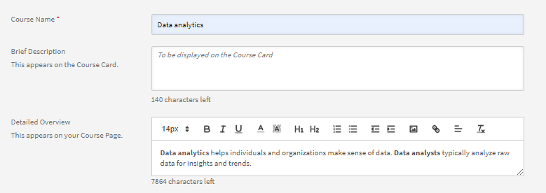
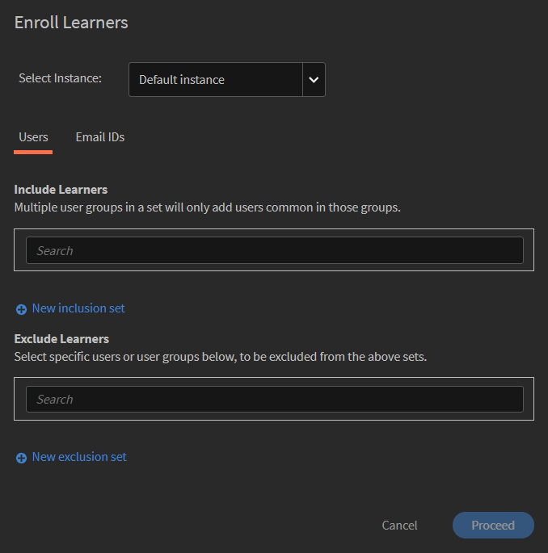

# Skapa, ändra och publicera kurser

Om du vill lära dig hur du skapar kurser, certifieringar och utbildningsprogram i Learning Manager kan du läsa den här artikeln.

Författare kan skapa lärobjekt som kurser, certifieringar och utbildningsplaner. Elever kan använda dessa lärobjekt, medan administratörer kan spåra elevernas framsteg.

## Kurser i Learning Manager {#coursesincaptivateprime}

Adobe Learning Manager gör det möjligt för författare att skapa kurser med hjälp av en eller flera moduler som är relaterade till virtuell utbildning, utbildning i egen takt, klassrumsutbildning och aktiviteter. Administratörer kan vidare använda dessa kurser för att skapa kursinstanser, registrera elever, tilldela märken och möjliggöra återkoppling för dessa kurser. De kan också skapa inlärningsprogram, inlärningsplaner och certifieringar med hjälp av dessa kurser.

Författare kan använda e-learninginnehåll som har skapats med vilket eLearning-verktyg som helst. Andra kursformat som stöds inkluderar videofiler, PDF, doc, docx, PPT och PPTX.

## Skapa en kurs - Grundläggande arbetsflöde {#createacoursebasicworkflow}

För att skapa en kurs, följ stegen nedan:

1. Logga in på Adobe Learning Manager som författare, eftersom det bara är författare som har behörighet att skapa kurser. På sidan Komma igång klickar du nu på **[!UICONTROL Create Courses]**.
1. **På sidan Kursöversikt** anger du namnet på kursen. Ange nu en kort beskrivning av den här kursen, som visas på kurskortet. Beskrivningen får inte vara längre än 140 tecken. Ange sedan den detaljerade översikten för kursen, som visas på sidan Kursinformation. Beskrivningen får inte vara längre än 1500 tecken.

   Som författare kan du se beskrivningen av modulerna när du lägger till modulen i en kurs.

1. Om du vill göra din kurs tillgänglig på andra språk klickar du på Lägg till nytt språk längst upp till vänster på sidan. Välj det eller de språk som du vill göra din kurs tillgänglig på. Klicka på **[!UICONTROL Save]**. Mer information finns i [Lägga till innehåll för olika språk](/help/migrated/authors/feature-summary/content-library.md).
1. **Ändra kursinställningar**-

   1. På sidan Kursinställningar väljer du en färdighet för kursen. I listrutan Färdighet väljer du den färdighet som krävs. Välj sedan önskad nivå i listrutan Nivå.
   1. Välj kursens färdigheter, nivå och sätt poängen för färdigheten. Lägg till fler färdigheter om det behövs.
   1. **I listrutan Registreringstyp** väljer du typ av registrering.

   Följande är typerna av registreringar:

   * **Nominerade chefer:** Endast chefer kan nominera dessa kurser. En elev kan inte anmäla sig till dessa typer av kurser.
   * **Godkänd av chef:** Chefer godkänner dessa kurser. Elever kan anmäla sig till dessa kurser, men de är inte inskrivna direkt på dessa typer av kurser utan chefens godkännande. En meddelandeförfrågan skickas till chefer när elever registrerar sig för dessa typer av kurser. Efter chefens godkännande listas dessa kurser som inskrivna för elever.
   * **Självinskrivna:** Elever kan anmäla sig direkt till dessa typer av kurser.

1. Spara ändringarna genom att klicka på **[!UICONTROL Save]**. Om du vill publicera kursen klickar du på **[!UICONTROL Publish]**.

## Skapa en kurs - Avancerat arbetsflöde {#createacourseadvancedworkflow}

1. Logga in på Adobe Learning Manager som författare, eftersom det bara är författare som har behörighet att skapa kurser. På sidan Komma igång klickar du nu på **[!UICONTROL Create Courses]**.
1. **På sidan Kursöversikt** anger du namnet på kursen. Ange nu en kort beskrivning av den här kursen, som visas på kurskortet. Beskrivningen får inte vara längre än 140 tecken. Ange sedan den detaljerade översikten för kursen, som visas på sidan Kursinformation. Beskrivningen får inte vara längre än 1500 tecken.
1. Om du vill göra din kurs tillgänglig på andra språk klickar du på Lägg till nytt språk längst upp till vänster på sidan. Välj det eller de språk som du vill göra din kurs tillgänglig på. Klicka på **[!UICONTROL Save]**. Mer information finns i [Lägga till innehåll för olika språk](/help/migrated/authors/feature-summary/content-library.md).
1. **Ändra kursinställningar**-

   1. På sidan Kursinställningar väljer du en färdighet för kursen. I listrutan Färdighet väljer du den färdighet som krävs. Välj sedan önskad nivå i listrutan Nivå.
   1. Välj kursens färdigheter, nivå och sätt poängen för färdigheten. Lägg till fler färdigheter om det behövs.
   1. Lägg till anpassade efterlevnadsetiketter i kursen om det behövs. Se [Lägga till efterlevnadsetiketter i en kurs/utbildningsväg/certifiering](/help/migrated/authors/feature-summary/courses.md#add-compliance-labels-to-courselearning-pathcertification).
   1. **I listrutan Registreringstyp** väljer du typ av registrering.

   Följande är typerna av registreringar:

   * **Nominerade chefer:** Endast chefer kan nominera dessa kurser. En elev kan inte anmäla sig till dessa typer av kurser.
   * **Godkänd av chef:** Chefer godkänner dessa kurser. Elever kan anmäla sig till dessa kurser, men de är inte inskrivna direkt på dessa typer av kurser utan chefens godkännande. En meddelandeförfrågan skickas till chefer när elever registrerar sig för dessa typer av kurser. Efter chefens godkännande listas dessa kurser som inskrivna för elever.
   * **Självinskrivna:** Elever kan anmäla sig direkt till dessa typer av kurser.

1. Välj om du vill sätta ett pris för din kurs eller göra den gratis. Om du vill att kursen ska vara betald, välj alternativet **[!UICONTROL Paid]** och ange ett pris. Priset visas sedan på kurskortet och på sidan Kursöversikt för en deltagare.

   Detta är bara aktiverat när Adobe Commerce Connector har konfigurerats.

1. Om du vill ge eleverna möjlighet att avregistrera sig själva från din kurs markerar du kryssrutan **Elever kan avregistrera sig själva**.

1. **Konfiguration av instans**

   Om du aktiverar det här alternativet kan elever som befinner sig i tillståndet Pågår besöka andra instanser och registrera sig där. En elev kan sedan behålla förloppet från den föregående instansen.

   När du har publicerat kursen och kommer tillbaka till sidan Inställningar är alternativet inte längre redigerbart.

   Du kan aktivera alternativet för följande kurstyper:

   * I egen takt
   * Klassrum
   * Aktivitet
   * Blandat

   Observera: När du duplicerar en kurs och har aktiverat alternativet Instanskonfiguration i källkursen, förblir alternativet inaktiverat i målkursen.

   **Instansväxeln stöds inte för**:

   * Betalda kurser
   * Kurser som nominerats av chefer och som är av inskrivningstyp.

   Konfigurationen av instansväxeln kommer inte att spridas till peer-konton om den delas via katalogen, alternativet förblir inaktiverat i målkursen.

1. **Flera registreringar**

   Med hjälp av detta kan du anmäla elever till mer än en kursomgång vid en eller olika perioder.

   Aktivera växlingsknappen **Flera inskrivningar** för att växla mellan olika kursinskrivningar för en elev. Om du har aktiverat Instansväxel kan du inte använda multipel registrering.

1. Välj de förkunskapskurser som måste slutföras innan du påbörjar din kurs. Klicka på fältet Kurser och välj från listan över kurser.
1. Markera kryssrutan **Aktivera** **förkunskapskrav** om du vill att de förkunskapskurser som krävs ska göras obligatoriska för mig.
1. Lägg till nyckelord som taggar som är relaterade till din kurs. Dessa taggar hjälper eleverna att enkelt hitta din kurs under sökningen. Alla dessa taggar läggs till automatiskt baserat på de moduler som vi har lagt till. Om du har andra taggar som du vill lägga till i den här kursen kan du gå vidare och ange den.
1. Lägg till nyckelord som taggar som är relaterade till din kurs. Dessa taggar hjälper eleverna att enkelt hitta din kurs under sökningen. Alla dessa taggar läggs till automatiskt baserat på de moduler som vi har lagt till. Om du har andra taggar som du vill lägga till i den här kursen kan du gå vidare och ange den.
1. I fältet Automatisk tillbakadragning väljer du ett datum då kursen dras tillbaka. Administratören måste aktivera alternativet Dra tillbaka automatiskt först.
1. Spara ändringarna genom att klicka på **[!UICONTROL Save]**. Om du vill publicera kursen klickar du på **[!UICONTROL Publish]**.

### Lägga till efterlevnadsetiketter i en kurs/utbildningsväg/certifiering {#add-custom-compliance-label}

Om du vill lägga till efterlevnadsetiketter i kurser följer du dessa steg:

1. I författarappen går du till **[!UICONTROL Courses]**/**[!UICONTROL Learning Paths]**/**[!UICONTROL Certifications]** och väljer **[!UICONTROL Add]**.
1. Skriv namnet och andra detaljer, till exempel beskrivning, färdigheter.
1. I textrutan **[!UICONTROL Custom compliance]** skriver du och väljer efterlevnadsetiketten.

   
   _Lägg till anpassad efterlevnad_

   >[!IMPORTANT]
   >
   >Se till att ange en deadline för kursen när du lägger till anpassad efterlevnad.

1. Spara och publicera kursen/utbildningsvägen/certifieringen.
Nu betraktas kursen/utbildningsvägen/certifieringen som en efterlevnadstyp. Administratörer kan lägga till den här kursen i instrumentpanelen för efterlevnad och dela den med chefer för att spåra framstegen

>[!NOTE]
>
>Författare kan även lägga till efterlevnadsetiketter i en befintlig kurs/utbildningsväg/certifiering genom att redigera dem.

## Poäng för spelifiering

Du kan tilldela spelifieringspoäng på kurs- och kursomgångsnivå. Med detta kan du tilldela poäng till olika kurser eller instanser. Eleverna uppmuntras att ta specifika kurser eller föredra en viss kursomgång framför andra.

1. På kursinstansnivå väljer du **[!UICONTROL Gamification Points]**.


*Börvärden för gamification*

1. Välj **[!UICONTROL Edit]**.
1. Om du väljer Använd inställningar för kursnivå visas följande alternativ:

   * **[!UICONTROL On completion]**: Välj den här växeln om du vill att eleven ska få 100 poäng när de slutför en kurs.
   * **Fler regler**

      * **[!UICONTROL Early completion]**: Om du väljer detta får de första 30 eleverna 100 poäng när de slutför en kurs.
      * **[!UICONTROL Timely completion]**: Om du väljer detta får eleverna 100 poäng om de slutför en kurs inom 999 dagar.

1. Om du väljer **[!UICONTROL Use custom settings]** visas följande alternativ:

   * **[!UICONTROL On completion]**: Välj den här växeln om du vill att eleven ska få 100 poäng när de slutför en kurs.
   * **Fler regler**

      * **[!UICONTROL Early completion]**: Om du väljer detta kan du bestämma hur många elever som ska tilldelas angivna poäng.
      * **[!UICONTROL Timely completion]**: Om du väljer detta kan du bestämma hur många poäng eleverna kommer att tilldelas om de slutför en kurs inom en viss tid.

   

   *Ställ in tidigt och snabbt slutförande*

1. Välj **[!UICONTROL Save]**.

## Samla lärresurser

En författare kan bestämma om han eller hon vill samla lärresurserna på utbildningsplansnivå eller låta dem vara kvar på en enskild kursnivå.

Som författare väljer du **[!UICONTROL Learning Path]** > **[!UICONTROL Settings]**. Klicka på **[!UICONTROL Edit]**.

**[!UICONTROL Resources]** När kryssrutan är aktiverad visar kryssrutan Visa ingående kursresurser aggregerade på Utbildningsväg-nivå om resurser som finns på kursnivå ska visas på Utbildningsväg-nivå.

>[!NOTE]
>
>På sidan Inställningar för en utbildningsväg kan en administratör också aktivera det här alternativet, som visar resurser som finns på kursnivå och som skulle visas på utbildningsvägsnivå.

## Schemaläggningsassistent

Hantera konflikter vid bokning av lärare och klassrum. Om du vill veta vid vilken tid och datum en lärare är tillgänglig innan du tilldelar honom eller henne till kursen kan du använda Schemaläggningsassistenten.

När du skapar en kurs klickar du på Schemaläggningsassistenten för en VC- eller CR-kurs.


*Starta schemaläggningsassistenten*

Fönstret Schemaläggningsassistenten öppnas.


*Dialogrutan Schemaläggningsassistenten*

I Schemaläggningsassistenten kan du:

* Sök efter instruktörer efter deras namn.
* Sök instruktörer efter deras färdigheter.

### Sök instruktörer efter deras namn

I fältet Instruktör skriver du namnet på läraren eller söker efter en del av lärarens namn. En lista över lärare visas där du kan välja en lärare.


*Sök efter instruktörer*

Du kan välja flera lärare, men du kan bara tilldela en lärare åt gången. Den valda tiden kommer att markeras i fönstret för tidskonflikter. Nära läraren visas en kryssikon som du klickar på för att ta bort läraren.


*Sök efter flera lärare*

### Sök instruktörer efter kompetens

Sök efter en instruktör med en eller flera färdigheter. Sökningen använder operatorn AND.

Färdigheter kan endast sökas efter partiellt eller fullständigt kompetensnamn, inte efter kompetensnivå.

På assistenten anger du namnet på instruktören, platsen och platsgränsen.

Du kan också söka färdighet, som skulle visas efter att ha klickat på filterikonen som finns på höger sida av instruktörens sökruta. Skärmbilden nedan visar knappen.


*Sök efter instruktörer efter kompetens*

### Filter för användargrupp

Välj filtret i fältet Instruktör. Det finns ett **[!UICONTROL User Group]** filter för att en författare eller egen författare kan hitta rätt lärare genom att använda värdena i användargruppen.

Om båda filtren används visas en lista över lärare som tillhör användargruppen och har de valda färdigheterna.

Detta gäller för Schemaläggningsassistenten på sidan Kurser eller Instanser.


*Filtrera efter användargrupper*

### Sidan Instans

Du kan också komma åt Schemaläggningsassistenten från sidan Instans, som visas nedan.

Schemaläggningsassistenten är också tillgänglig på sidan Instans för administratörer och anpassad administratör/författare.


*Schemalägg lärare från sidan Instanser*

### Sök efter en plats

Du kan söka efter en plats genom att ange både klassrummets namn och namnet på platsregionen på sidorna för både modulen och schemaläggningsassistenten.

## Formatera RTF

När författare skapar en kurs, ett utbildningsprogram, en certifiering eller ett jobbstöd kan de mata in olika typer av innehåll som text, bild eller använda olika textformateringsalternativ.

När du skapar en kurs kan du se RTF-redigeraren i fältet Kursöversikt. Du kan formatera ditt innehåll, lägga till bilder, lägga till hyperlänkar och så vidare.



*Starta RTF-redigeraren*

På samma sätt kan du använda RTF-redigeraren för att ändra beskrivningen när du skapar en:

**Utbildningsprogram**


*Använda RTF-redigeraren för ett utbildningsprogram*

**Intygande**


*Använd RTF-redigerare för en certifiering*

**Stöd till arbetsmarknaden**


*Använd RTF-redigerare som jobbhjälp*

Dessutom kan du använda RTF-redigeraren för andra språk.

## Stöd för RTF-beskrivningar för headless-användargränssnitt

### Varför krävs CSS?

RTF består av HTML-kod. Om du återger koden som den är skulle det resultera i en standardformatering som tillämpas av webbläsaren. Detta går ofta inte bra ihop med företagets stilriktlinjer. En CSS krävs för att uppfylla riktlinjerna.

### Standardformat

Den bifogade CSS-formatmallen innehåller den formatering som används av Learning Manager. Stylingen är justerad med tanke på majoriteten av användningsfallen. Ladda ner den bifogade CSS-filen och importera den till din webbapp enligt dina konventioner och byggsystem. CSS-klasserna som definieras har namnrymd under ql-editor-klassen och de stör inte dina befintliga stilar.

### Anpassa stilar

Standardformatet kanske inte uppfyller allas behov. Anpassningarna kan göras genom att överlagra den medföljande CSS. All styling är insvept under ql-editor som underordnade väljare. Följande klasser används:

* Indrag: **li.ql-indent-$number**. $number varierar från 1-9
* Storlek: **ql-storlek-liten**, **ql-storlek-stor**, **ql-storlek-enorm**

* Justering: **ql-align-center**, ql-align-justify **,****ql-align-right**

* Färg: **ql-color-$color**. $color = vit, röd, orange, gul, grön, blå, lila
* Bakgrund: **ql-bg-$color**. $color = svart, röd, orange, gul, grön, blå, lila
* HTML-taggar: P, OL, UL, PRE, BLOCKQUOTE, H1, H2, H3, H4, H5, H6

[CSS-fil som ska användas för anpassning.](assets/ql-headless.css)

### API-ÄNDRINGAR FÖR ATT MÖJLIGGÖRA ÅTERGIVNING AV RTF-ÖVERSIKTER

När kunder skapar ett headless-gränssnitt har de ett behov av att visa inlärningsobjekten i det anpassade användargränssnitt som de utvecklar. För att göra detta skulle man vanligtvis använda API:et [GET /learningObjects](https://learningmanagereu.adobe.com/docs/primeapi/v2/#!/learning_object/get_learningObjects) som exponeras. Nu när Learning Manager har stöd för att samla in &quot;RTF&quot; för översiktsfältet visar även datamodellen för Learning Objects i API-svaren samma sak. Se fältet med namnet &quot;richTextOverview&quot; i fragmentet av modellen i API-svaret nedan. Observera också att fältet som visades tidigare (&quot;översikt&quot;) förblir oförändrat för bakåtkompatibilitet.

```
{ 
 "data": [ 
 { 
 "id": "string", 
 "type": "string", 
 "attributes": { 
 … 
 "localizedMetadata": [ 
 { 
 "description": "string", 
 "locale": "string", 
 "name": "string", 
 "overview": "string", 
 "richTextOverview": "string" 
 } 
 ], 
 … 
 }, 
 "relationships": { 
 … 
 } 
 } 
 } 
 ] 
} 
```

Kunder som redan använder översiktsfältet förblir opåverkade i sitt headless-gränssnitt kommer att se oformaterad text som tidigare. Om kunderna vill dra nytta av RTF-översikten måste de skapa formaterade översikter för sina utbildningsobjekt i användargränssnittet för författare och efter det börjar Learning Manager även returnera RTF-översikten, förutom den oformaterade texten (som tidigare) i API-svarsmodellen.

Men för att återge denna RTF-text i användargränssnittet måste kunden inkludera en CSS. Detta förklaras i detalj i följande avsnitt.

## Tillåt flera försök {#allowmultipleattempts}

När administratören har aktiverat flera försök kan du som författare konfigurera flera försök för en interaktiv e-learningmodul på kurs- eller modulnivå.


*Konfigurera flera försök för en interaktiv e-learningmodul*

<table>
 <tbody>
  <tr>
   <td>
    <p><b>Alternativ</b></p></td>
   <td>
    <p><b>Beskrivning</b></p></td>
  </tr>
  <tr>
   <td>
    <p>Ställ in antal försök till</p></td>
   <td>
    <p>Du kan ställa in antalet försök för en modul till oändligt eller ange en definitiv gräns.<span style="font-size: 0.8125rem;">Försöksinformationen kommer att visas för eleven när den är aktiverad. Eleven kan välja att göra ett nytt försök genom att klicka på knappen "Gör ett nytt försök".</span></p></td>
  </tr>
  <tr>
   <td>
    <p>Stoppa ett nytt försök när modulen har slutförts eller godkänts</p></td>
   <td>
    <p>För att konfigurera när eleverna ska sluta välja alternativet för nytt försök, markera kryssrutan "Stoppa nytt försök när modulen har slutförts eller godkänts". Alternativet "Försök igen" kommer att tas bort från elevvyn när de har slutfört modulen.</p></td>
  </tr>
  <tr>
   <td>
    <p>Lås modul mellan försök 0:0:1 Format: Dagar/Timmar/Minuter</p></td>
   <td>
    <p>Du kan låsa moduler under en viss tid mellan försöken, genom att markera kryssrutan "<b>Lås modul mellan försök 0:0:1 Format: Dagar/Timmar/Minuter</b>". När en modul är låst kan eleven inte besöka modulen förrän den angivna låstiden har löpt ut. </p>
    <p>Du kan definiera slutkriterierna för ett försök genom att markera kryssrutorna "<b>Spelarstängning</b>" eller "<b>Slutförande</b>".</p></td>
  </tr>
  <tr>
   <td>
    <p>Avslutning av spelare</p></td>
   <td>
    <p>Varje modulstart behandlas som ett nytt försök om kriteriet är valt som "<b>Stäng</b> spelare". En elev uppmanas att ange information om modullås och försöksdetaljer när spelaren stängs.</p></td>
  </tr>
  <tr>
   <td>
    <p>Slutförande</p></td>
   <td>
    <p>Om slutet av ett försök baseras på <b>slutförande</b> beräknas det baserat på kriterierna för att lyckas med innehållet. Eleverna får inte försöka göra om modulen förrän innehållet skickar information om slutförande. Information om modullås och försök kommuniceras till eleven när ett försök avslutas.</p></td>
  </tr>
  <tr>
   <td>
    <p>Ange tidsgräns för att slutföra modul</p></td>
   <td>
    <p>Författare kan ställa in en tidsgräns för att slutföra en modul genom att markera kryssrutan "<b>Ange tidsgräns för att slutföra modulen</b>".</p>
    <p>Varje spelarstart betraktas som ett nytt försök och eleven uppmanas att ange tidsinformationen under lanseringen.</p>
    <p><b>Notera:</b><span style="font-size: 0.8125rem;">Försöket kommer att avslutas automatiskt när tiden har gått. Om du även stänger spelaren avslutas det aktuella försöket.</span></p></td>
  </tr>
  <tr>
   <td>
    <p>Flera försök på modulnivå</p></td>
   <td>
    <p>Om du väljer ett försök på "Modulnivå" i listrutan "Ange försök vid" kan du konfigurera alternativen på individuell modulnivå.</p></td>
  </tr>
 </tbody>
</table>

## Kursens delkurser {#coursemodules}

### Lägg till moduler {#addmodules}

Nu kan du lägga till modulerna Innehåll, Prework och Testout. **Innehållsmoduler** är de huvudmoduler som utgör kursen. **Förarbetsmoduler** innehåller viss grundläggande information som kan hjälpa eleverna att göra sig redo för kursen. Dessa moduler är inte obligatoriska för eleverna att genomföra. **Testout-moduler** hjälper eleverna att hoppa över innehållet och göra testet om de redan är medvetna om innehållet och vill göra testet för att uppfylla efterlevnadskravet.

Om du vill lägga till en innehållsmodul utför du stegen nedan:

1. Klicka på **[!UICONTROL Add Modules]**. Du kan se fyra alternativ för att lägga till moduler. Det första alternativet är att lägga till moduler i egen takt. Det här är de moduler som du skapar och lägger till i modulbiblioteket i Adobe Learning Manager. Det andra alternativet är att ställa in det virtuella klassrummet. Den tredje är att ställa in en klassrumsmodul, och den fjärde är aktivitetsmodulen.

   

   *Lägga till en modul för en kurs*

   **Modul i egen takt:** I det här läget kan du starta och slutföra en kursmodul i din egen takt. Du kan ställa in ditt eget schema.

   När du har klickat på alternativet kan du se listan över moduler i egen takt som redan har lagts till i ditt modulbibliotek. Här kan du antingen bläddra igenom listan och välja de du vill lägga till, eller så kan du söka fram modulerna genom att skriva in modulens namn i sökfältet eller modultaggarna.

   När du har valt modulerna klickar du på **[!UICONTROL Add]**. Dessa moduler visas nu under avsnittet Innehåll.

   Du kan också ordna om modulerna. Dra valfri modul och flytta den uppåt eller nedåt och ordna modulerna i rätt ordning.

   **Virtuell klassrumsmodul:** I det här läget kan eleverna delta i liveföreläsningar online, underlättade av en utbildad instruktör. Ange titel, beskrivning och ange sessionens varaktighet. Du kan också ange konferensens URL och de instruktörer som ska genomföra sessionen. Spara ändringarna genom att klicka på **[!UICONTROL Done]**.

   

   *Lägga till en VC-modul*

   När du skapar en kurs med hjälp av konfigurationsdialogrutan för virtuellt klassrum ställer du in **konferenssystemet** på den Teams-anslutning som du skapade. Välj om du vill ha en mötesorganisatör för händelsen.

   Om du väljer **Ja** för en mötesorganisatör måste du ange namnet på organisatören. Skriv namnet och välj organisatören.

   **Förbikoppling av lobbyn**

   * Om du väljer **Ja** kan alla elever delta i mötet.
   * Om du väljer **Nej** skickas en begäran till organisatören om att tillåta eller förhindra eleven från att delta i mötet.

   **Obs!:** En elev måste vara tillgänglig på Microsoft Teams. Eleven kan dock gå med i Learning Manager som gäst.

   **Klassrumsmodul:** I det här läget deltar eleverna i personliga föreläsningar, som underlättas av en utbildad instruktör. Ange titel, beskrivning och ange sessionens varaktighet. Du kan också ange platsen för klassen och vilka lärare som ska genomföra sessionen. Spara ändringarna genom att klicka på **[!UICONTROL Done]**.

   

   *Lägga till en klassrumsmodul*

   När du skapar en kurs går du till konfigurationsdialogrutan för virtuellt klassrum och ställer in konferenssystemet på den Microsoft Teams-anslutning som du skapade. Välj om du vill ha en mötesorganisatör för händelsen.

   Om du väljer Ja för en mötesorganisatör måste du ange namnet på organisatören. Skriv namnet på organisatören och välj organisatören.

   **Förbikoppling av lobbyn**

   * Om du väljer Ja kan alla elever delta i mötet.
   * Om du väljer Nej skickas en begäran till organisatören om att tillåta eller förhindra eleven från att delta i mötet.

   **Notera:** Om en elev vill gå med i Microsoft Teams som gäst måste han/hon ange e-postadressen. E-postadressen måste finnas i Learning Manager.

   **Aktivitetsmodul:** I det här läget måste eleverna genomföra en uppsättning aktiviteter, t.ex. workshops, övningar, frågeformulär och andra inlärningsaktiviteter. Ange titel, beskrivning och den externa URL:en som referens. Spara ändringarna genom att klicka på **[!UICONTROL Done]**.

   

   *Lägga till en aktivitetsmodul*

   Du kan ange varaktigheten när du lägger till en aktivitetsmodul i en kurs för aktivitetstypen Filinlämning och xAPI-baserade moduler.

1. På samma sätt kan du lägga till moduler för förarbete- och testläge.
1. Välj sekvenseringstyp för moduler som Beställd eller Oordnad baserat på dina önskemål.

   Om du väljer **Ordnad** visas modulerna i samma ordning som du skapade dem. Om du väljer **Oordnad sekvenseras** inte modulerna. Eleverna kan slutföra modulerna i vilken ordning som helst.

1. I listrutan Obligatoriska moduler väljer du det antal moduler som eleven måste ta för att slutföra kursen.
1. Lägg till en omslagsbild och banderollbilden för kursen. Katalogerna skapas av administratören. Mer information finns i [Kataloger](/help/migrated/administrators/feature-summary/catalogs.md).

   **Notera:** De rekommenderade måtten är:

   * **Omslagsbild:** 300 px x 300 px
   * **Bild på banner:** 1600 px x 140 px

1. I det övre högra hörnet på sidan klickar du på **[!UICONTROL Save]**.

#### Lägg till HTML-länk i aktivitetsmodulen

Författare kan lägga till HTML-länkar i aktivitetsmodulen och ställa in kriterier för slutförande. Om du vill lägga till en HTML-länk och ange ett slutförandekriterium följer du dessa steg:

1. I författarappen väljer du **[!UICONTROL Create Courses]** på startsidan.
1. Välj **[!UICONTROL Add]** från skärmen **[!UICONTROL Course Catalog]**
1. Skriv in kursens namn och beskrivning.
1. I alternativet **[!UICONTROL Module]** väljer du **[!UICONTROL Add Module]** > **[!UICONTROL Activity Module]**.
1. I prompten **[!UICONTROL Activity Module]** skriver du namn och beskrivning.
1. Välj som **[!UICONTROL Type]** **[!UICONTROL External URL]**.
1. Välj något av följande alternativ från alternativet **[!UICONTROL Completion Criteria]** .
   * **[!UICONTROL Learner marks complete]**: Eleven har möjlighet att markera kursen som slutförd i Fluidic Player.
   * **[!UICONTROL On Launching content]**: Kursen kommer automatiskt att markeras som slutförd när eleven startar den.

   
   _Kriterier för slutförande_

1. Välj **[!UICONTROL Add]** och publicera kursen.

## Checklista {#create-checklist}

Utvärdering är en viktig aspekt av alla LMS. Onlinebedömningar är ett av de bästa sätten att utvärdera en elevs förståelse av ett ämne. Men ofta är det nödvändigt att utvärdera en persons förståelse medan han/hon är på jobbet genom att observera honom/henne utföra de nödvändiga uppgifterna.

Tänk på butiksanställda eller lagerarbetare som genomgår utvärdering för de uppgifter de ska utföra dagligen. Det kan vara de steg som utförs för att reparera en kaffemaskin eller de steg som ingår i att packa ett material. Instruktörer kan utvärdera anställda för sådana uppgifter baserat på en checklista och utvärdera dem som godkända eller underkända i utvärderingsaktiviteten.

### Skapa en checklista {#createachecklist}

Endast en författare kan skapa en checklista. En checklista är en typ av aktivitetsmodul. När du ställer in en aktivitetsmodul kan du, en författare, välja en aktivitet som **checklista**, enligt nedan:


*Skapa en checklista*

När du väljer alternativet **Checklista** ser du några ytterligare alternativ.

**Typ av checklista:** Välj valfritt alternativ, **Ja/Nej** eller **1-5**. Om du väljer Ja/Nej kommer checklistan att innehålla frågor som endast kan besvaras med Ja eller Nej. Om du väljer 1-5 kan du se en Likert-checklista, där du kan betygsätta en fråga på en femgradig skala.

**Kriterier för godkänt:**

<table>
 <tbody>
  <tr>
   <td>
    <p>Om du hade valt <b>Ja/Nej</b>, då...</p></td>
   <td>
    <p>Om du hade valt <b>1-5</b>, då...</p></td>
  </tr>
  <tr>
   <td>
    <p>Ange kriterierna för godkännande som antalet svar som Ja. Till exempel, om du anger 3, blir eleven godkänd på kursen, om han/hon får minst tre <b>Ja-svar </b>, när den utvärderas av en lärare.</p></td>
   <td>
    <p>Ställ in kriterierna för godkännande som ett tröskelvärde för ett tal mellan 1 och 5. Till exempel, om du anger 2 och 4, så klarar eleven kursen om han/hon uppnår minst <b>två </b>utvärderingar som har poäng större än eller lika med <b>fyra</b>.</p></td>
  </tr>
 </tbody>
</table>

Välj en eller flera instruktörer som kommer att utvärdera eleven.

Om du har något att kommentera eller en anteckning kan du lägga till den i textfältet Anteckning **till lärare** .

Lägg nu till frågorna i checklistan. Klicka på **[!UICONTROL Add]**. Du kan bara lägga till upp till 150 frågor.


*Lägg till checklistefrågor*

Om du vill lägga till fler frågor klickar du på **[!UICONTROL Add more]**.

Spara ändringarna, lägg till modulen och publicera kursen.

### Lägg till färdigheter {#addskills}

På den här sidan anger du följande information:

1. Välj kursens färdigheter, nivå och sätt poängen för färdigheten. Lägg till fler färdigheter om det behövs.

   

   *Lägga till färdigheter för en kurs*

1. Välj typ av registrering. Följande är alternativen:

   * **Nominerade chefer:** Endast chefer kan nominera dessa kurser. En elev kan inte anmäla sig till dessa typer av kurser.
   * **Godkänd av chef:** Chefer godkänner dessa kurser. Elever kan anmäla sig till dessa kurser, men de är inte inskrivna direkt på dessa typer av kurser utan chefens godkännande. En meddelandeförfrågan skickas till chefer när elever registrerar sig för dessa typer av kurser. Efter chefens godkännande listas dessa kurser som inskrivna för elever.
   * **Självinskrivna:** Elever kan anmäla sig direkt till dessa typer av kurser.

1. Om du vill ge eleverna möjlighet att avregistrera sig själva från din kurs markerar du kryssrutan **Elever kan avregistrera sig själva**.
1. Välj de förkunskapskurser som måste slutföras innan du påbörjar din kurs. Klicka på fältet Kurser och välj från listan över kurser.

   

   *Lägg till förkunskapskurser*

1. Markera kryssrutan Förkunskapskrav **** om du vill att de förkunskapskurser som ska göras obligatoriska för mig.
1. Lägg till nyckelord som taggar som är relaterade till din kurs. Dessa taggar hjälper eleverna att enkelt hitta din kurs under sökningen. Alla dessa taggar läggs till automatiskt baserat på de moduler som vi har lagt till. Om du har andra taggar som du vill lägga till i den här kursen kan du gå vidare och ange den.
1. Lägg till profilerna för din målgrupp för den här kursen genom att klicka på textområdet och välja profiler från förslagen.
1. Lägg till resursfiler för din kurs som extra material. Dra ditt material, t.ex. text-, video- eller ljudfiler.
1. Nu kommer den här kursen att vara tillgänglig för dessa elever som har dessa profiler som en rekommenderad kurs. Du kan också bifoga ytterligare resurser för dina elever i det här avsnittet. Eleverna kommer att kunna ladda ner dessa filer för senare referens. När du är klar med alla dessa ändringar, gå vidare och klicka **[!UICONTROL Save]** på det övre högra hörnet. Detta kommer att spara din kurs som ett utkast. Din kurs sparas som utkast som standard.

## Tilldela lärare för moduler {#assigninstructorsformodules}

1. När du har skapat moduler för din kurs kan du tilldela lärare till modulerna. På instrumentpanelen Författare klickar du på **[!UICONTROL Course Catalog]**.
1. Klicka på den kurs vars modul du vill tilldela lärare till.
1. I avsnittet Lägg till **moduler** klickar du på den modul som du vill tilldela en lärare till.
1. I fältet **Instruktör** anger du användarnamnet för den användare som du vill tilldela instruktörsrollen.

   

   *Tilldela en instruktörsroll till en användare*

1. Om du vill publicera om kursen med uppdateringarna klickar du på **[!UICONTROL Republish]**.

## Checklista för observation

En checklistamodul kan nu granskas av chefer utöver instruktörer. People Managers, såväl som icke-hierarkiska chefer, till exempel butikschefer eller platschefer, kan granska och slutföra checklistan.

Kursförfattare kan lägga till personer, chefer såväl som icke-hierarkiska chefer (om tillämpligt) som granskare genom att välja dessa rollalternativ i avsnittet &quot;Granskare&quot; när du ställer in en checklistamodul. Detta kan göras på kursomgångsnivå.


*Lägga till granskare i en aktivitetsmodul*

Om du väljer alternativet &quot;**[!UICONTROL +Managers]**&quot; aktiveras automatiskt en elevs chef i organisationshierarkin för att granska checklistan. Du behöver inte söka efter och lägga till namn på ansvariga individuellt.

Om din kontoadministratör har ställt in icke-hierarkiska chefsroller (t.ex. platschefer eller platschefer) med hjälp av alternativet Aktiva fält, kommer dessa chefsroller att vara tillgängliga för dig att välja och göra det möjligt för dem att granska checklistan.

Du behöver inte söka efter och lägga till namn på ansvariga individuellt. När elever anmäler sig till checklistekursen kommer den automatiskt att skicka ett meddelande till sina chefer/butikschefer för granskning tillsammans med valfri instruktör. Det här arbetsflödet gör det enkelt för författare att inte nämna enskilda chefers namn.

I exempelskärmdumpen ovan kommer alternativet &quot;**[!UICONTROL +Store Managers]**&quot; automatiskt att göra det möjligt för den icke-hierarkiska chefen som är anpassad till eleven att granska checklistan. Observera att &quot;butik&quot; här kommer att ersättas av det aktiva fältet som definieras av administratören.

Uppdateringar av checklistemodulen inkluderar även meddelanden till lärare och chefer när en elev är inskriven i en kurs som innehåller en checklistamodul. Granskaren får ett meddelande i meddelandecentret för Learning Manager samt på instrumentpanelen för lärare/chef om att det är dags att vidta en åtgärd i checklistan.

<!---->

Granskaren kommer att kunna se information om alla väntande granskningsobjekt för checklistor från menyn Checklistor samt menyn Meddelanden när de loggar in som instruktör/chef.


*Godkännanden för certifiering*

När du har klickat på Checklista för granskning kan granskaren slutföra utvärderingen.


*Granska väntande checklista, granskningsobjekt*

Rapportering kan laddas ner på checklistor, som innehåller detaljerad information om elevutvärdering, granskarens namn, roll och e-post.

CSV-filen Checklista Rapport har de nya och uppdaterade fälten:

* Granskarens namn i stället för lärarens namn
* Granskarens e-postadress i stället för lärarens e-postadress
* Granskarroll – Möjliga värden är Chef, Butiks-/platschef, Instruktör

## Förhandsgranska en kurs {#previewacourse}

När kursen har skapats och sparats som ett utkast kan du förhandsgranska kursen som elev och sedan publicera den för att göra den tillgänglig i kurskatalogen.

Om du vill förhandsgranska kursen klickar du på **[!UICONTROL Preview as learner]**.


*Förhandsgranska en kurs som elev*

Då öppnas sidan **Kursöversikt** där du kan se modulerna, deras ordning och annan information som är relaterad till kursen.


*Visa moduler och annan relaterad information*

För att se hur eleverna kan uppleva den här kursen, klicka på var och en av dessa moduler för att börja spela den. Detta börjar spela banan i Fluidic Player.

## Publicera en kurs {#publishacourse}

När du har förhandsgranskat kursen som elev kan du publicera kursen så att den blir tillgänglig för elever att använda. Observera att kursen fortfarande är i ett utkastläge.

En typisk kurslivscykel ser ut så här:

* **Utkast** - När en författare slutför skapandet av en kurs och sparar den. I det här läget är kursen ännu inte tillgänglig för elever.
* **Publicerad** - När en författare slutför publiceringen av en kurs. I detta läge är kursen tillgänglig för elever att anmäla sig. Du kan även redigera en kurs i det här läget.
* **Tillbakadragen** – När en författare har publicerat en kurs kan han eller hon flytta den till ett tillbakadraget läge om författaren inte vill att kursen ska visas i kurskatalogen för elever.
* **Borttagen** - En kurs i borttaget läge är när den tas bort helt från Adobe Learning Manager-programmet. Det är bara författare som kan ta bort kurser när de är i statusen Utkast eller Tillbakadragen.


*Arbetsflöde för en kurslivscykel*

Om du vill publicera kursen som du har skapat klickar du **[!UICONTROL Publish]** på längst upp till höger på sidan.


*Publicera en kurs*

I popup-meddelandet för bekräftelse som visas klickar du på **[!UICONTROL OK]**.

Kursen är nu tillgänglig i kurskatalogen.

## Visa en kurs {#viewacourse}

Som författare kan du se en lista över alla tillgängliga kurser. Om du vill visa alla kurser i Learning Manager-kontot klickar du på Kurskatalog. Om du vill visa alla dina skapade kurser i Learning Manager klickar du på **[!UICONTROL My Courses]**.

Håll muspekaren över alternativen på kurskortet och klicka på **[!UICONTROL View Course]**.


*Visa en kurs*

Fönstret med kursinformation visas. Kursen är i ett skrivskyddat läge. Om du vill ändra kursen klickar du på **[!UICONTROL Edit]**.

## Pensionera en kurs {#retireacourse}

Om du drar tillbaka en kurs kan du inte skriva in nya elever till kursen. Elever som redan är inskrivna kan gå kursen.

Om du vill dra tillbaka en kurs håller du muspekaren över alternativen på kurskortet och klickar på Avsluta kurs.


*Pensionera en kurs*

I popup-fönstret för bekräftelse som visas klickar du på **[!UICONTROL Yes]**.

## Duplicera en kurs {#duplicateacourse}

Du kan skapa en kopia av kursen och sedan ändra kursen. Om du vill säkerhetskopiera din kurs kan du duplicera kursen.

## Sök efter kurser {#searchforcourses}

Adobe Learning Manager gör det enklare för dig att snabbt hitta de kurser du vill ha. Du kan söka efter dina kurser på följande sätt:

**Sökfält:** Klicka på sökfältet längst upp till höger på **sidan Kurskatalog** . Skriv in kursnamnet eller eventuella nyckelord som är kopplade till dina kurser. Du kan även söka med hjälp av taggar som läggs till när du skapar kurser. Taggar är sökbara i fältet Sök kurser, vilket innebär att taggarna visas i sökfältet medan du skriver.


*Sök efter kurser*

**Filterlista över kurser:** Du kan filtrera kurserna efter tillstånd, till exempel Alla, Publicerade, Utkast och Pensionerade. Baserat på ditt val kan du se den filtrerade listan över kurser och välja de kurser som krävs.

Som författare kan du också sortera kurserna för att bättre hitta din önskade kurs. Klicka **[!UICONTROL Sort by]** och välj alfabetisk stigande ordning, alfabetisk fallande ordning, datum då kursen skapades, datum för kursuppdatering och kursernas effektivitet.


*Filtrera lista över kurser*

## Skriva in elever i en kurs {#enrolllearnersinacourse}

Om du vill skriva in elever till kurserna, eller om du vill tillåta chefer att nominera elever till kurserna, måste du växla till administratörsläget, eftersom endast administratörer har behörighet att skriva in elever för kurserna.

För att växla till administratörsläge,

1. Klicka på din profilbild och välj sedan Administratör.
1. I administratörsläget klickar du på **[!UICONTROL Courses]** i den vänstra rutan. På den här sidan kan du se alla kurser som har skapats av alla författare i ditt Learning Manager-konto.
1. För att skriva in eleverna, håll muspekaren över kurskortet och du kan se alternativet **Inskriv elever**. Klicka på det här alternativet.

   

   *Anmäla elever till en kurs*

1. I dialogrutan Registrera elever, i det övre högra hörnet, ser du att alternativet **Standardinstans** är valt. Så snart en kurs har skapats av en författare skapas en standardinstans av kursen.

   

   *Visa standardinstans av en kurs*

1. Börja skriva namnet på en elev i fältet Inkludera elever och välj en elev. Du kan också lägga till användargrupper här. Om du vill registrera alla elever i ditt Learning Manager-konto börjar du skriva alla. Du kan också skriva in elever i ett team.

   

   *Lägga till learhers i en kurs*

1. Om du vill utesluta en elev från kursen anger du namnet på eleven i **fältet Uteslut elever** .
1. När du har registrerat eleverna klickar du på **[!UICONTROL Proceed]**. I dialogrutan Skriv in elever kan du visa sammanfattningen av registreringen.

   

   *Visa sammanfattning av kursinskrivning*

1. Om du vill skriva in alla elever i kursen klickar du på **[!UICONTROL Enroll]**. Dessa elever är nu framgångsrikt inskrivna för den här kursen. Eleverna får ett meddelande om att gå vidare och gå kursen. Om du vill registrera fler elever upprepar du registreringsproceduren.

## Ändringar på sidan Kursomgång för Connect VC-moduler {#connect-vc}

När du hämtar en Connect-kurs kan du skapa två typer av rum:

* Dynamisk
* Ihärdig

En beständig URL är alltid fast. Men för användare som inte har Connect och ett eget mötesrum måste de använda ett dynamiskt mötesrum vid körning. Personer kan sedan delta i sitt möte.


*Alternativ för dynamiska mötesrum*

Du kan nu ändra webbadressen till det beständiga rummet på **sidan Kursinstans** .

<!--|  |  |
|---|---|-->

## Avregistrera elever från en kurs {#unenrolllearnersfromacourse}

När en författare skapar en kurs kan han eller hon aktivera alternativet **Elever kan avregistrera sig själva, så att elever som går kursen kan avregistrera sig** från kursen.

En administratör kan även avregistrera elever från kursen.


*Avregistrera elever från en kurs*

Mer information finns i [Avregistrera elever](/help/migrated/administrators/feature-summary/courses.md).

## Lägg till kursmoduler för Captivate och Presenter {#addcoursemodulesforcaptivateandpresenter}

Du kan också publicera kursmodulerna till Learning Manager från Adobe Captivate och Adobe Presenter med hjälp av Publicera-menyn.

1. I Captivate klickar du på **[!UICONTROL Publish]** > **[!UICONTROL Publish to Learning Manager]**.
1. Ange underdomännamnet eller e-post-ID:t och klicka på **[!UICONTROL Submit]**. Om du har flera konton uppmanas du att välja kontot.
1. Logga in med inloggningsuppgifter för Adobe. Om du inte har ett Adobe-ID klickar du på **[!UICONTROL Create Account]**. Efter auktorisering dirigeras du till modulens publiceringssida.
1. Ange all grundläggande information om modulen och klicka på Publicera.

Du kan se den publicerade modulen på sidan Learning Manager-moduler. Mer information finns i [Publicera projekt i Adobe Learning Manager](https://helpx.adobe.com/captivate/classic/publish-project-to-captivate-prime.html).

## Kursens effektivitet {#courseeffectiveness}

Kursens effektivitetspoäng hjälper författarna att utvärdera de kurser som inte fungerar enligt elevernas behov och modifiera dem därefter. Kursens effektivitet utvärderas för att förstå hur användbar en kurs är för eleven. Det är en kombination av resultat från elevernas återkoppling på kursinnehållet. Kursquizet är resultat för en elev och chefens feedback som utvärderar en elev baserat på lärande från kursen.

I **Mina kurser** kan en författare se kursens effektivitetsbetyg på kursminiatyrerna som visas i ögonblicksbilden nedan. Du kan se betyget för den här kursen som 100.

<!---->

Kursens effektivitetsbetyg tas fram med hänsyn till L1, L2 och L3 återkopplingsvärden. Om du vill se uppdelningen av varje återkoppling klickar du på värdet för kursens effektivitet. En popup-meny visas som visas nedan.


*Beräkning av kursens effektivitet*

I den här exempelbilden fick 1 av 1 användare alla tre typerna av feedback, vilket innebär att poängen är 100/100. Från den här tabellen kan du förstå den saknade feedbacken för att förbättra den övergripande effektiviteten. Om du vill se hur kursens effektivitet beräknas klickar du på nedåtpilen längst ned till höger på popupmenyn.

<!---->

Enligt cirkeldiagrammet som visas ovan ges mer vikt till L3-feedback från chefen.

## Certifieringar och utbildningsprogram {#certificationsandlearningprograms}

Både författare och administratör kan skapa certifieringar och utbildningsprogram för elever från författarappen. På startsidan klickar du på antingen Certifieringar eller Utbildningsprogram för att skapa respektive lärobjekt.

Mer information om hur du skapar och hanterar certifieringar och utbildningsprogram finns i  [Certifieringar](/help/migrated/administrators/feature-summary/certifications.md) och  [utbildningsprogram](/help/migrated/administrators/feature-summary/learning-programs.md).

## Obligatoriska kurser för extern certifiering {#mandatorycoursesforexternalcertification}

I tidigare versioner av Learning Manager var det inte obligatoriskt att slutföra en kurs från eleven i extern certifiering för att slutföra ett certifikat.

Du kan nu göra kurser obligatoriska genom att aktivera alternativet **Ange obligatoriska kurser som obligatoriska för slutförande** av certifikat på fliken Läroplan.


*Ställ in obligatoriska kurser för att slutföra ett certifikat*

När kurser är satta som obligatoriska:

* Inlämningssidan för Chefen listar eleverna först efter att eleverna har slutfört kurserna.
* Eleven kan endast ladda upp en fil efter att ha avslutat kursen.

## Vanliga frågor {#frequentlyaskedquestions}

+++Hur tar man bort &quot;sök chefsnominering&quot; för en kurs?

Utför följande steg:

1. Logga in på Learning Manager som författare.
1. Öppna kursen.
1. I den vänstra rutan klickar du på **[!UICONTROL Settings]** > **[!UICONTROL Edit]**.
1. **I listrutan Inskrivningstyp** ändrar du inskrivningstypen från **Nominerad** chef till **Godkänd** av chef eller **Självinskriven**.

1. När du har ändrat typ av inskrivning publicerar du kursen på nytt.

+++

+++Hur kombinerar man kurser?

Du kan kombinera kurser via ett Learning Program.

1. Logga in på Learning Manager som administratör.
1. I den vänstra rutan klickar du på **[!UICONTROL Learning Programs]**.
1. Om du vill lägga till ett utbildningsprogram klickar du på **[!UICONTROL Add]**.
1. Ange information om utbildningsprogrammet och spara utbildningsprogrammet genom att klicka på **[!UICONTROL Save]**.
1. När du har skapat utbildningsprogrammet klickar du på **[!UICONTROL Catalog]**.
1. På ett kurskort klickar du på **[!UICONTROL Add]**, som visas nedan. Upprepa processen för så många kurser som du vill lägga till i utbildningsprogrammet.


När du har lagt till alla kurser som krävs i utbildningsprogrammet klickar du på **[!UICONTROL Publish]**.

I ett Learning-program kan du bara lägga till självinskrivna kurser och inte kurser som är nominerade av chefer eller godkända av manager. Det här är ett standardbeteende i Learning Manager.

+++

+++Hur ser man till att alla elever inte kan se alla kurser?

Du kan uppnå detta via kataloger. En standardkatalog innehåller alla kurser som läggs till i Learning Manager som standard.

Du måste inaktivera standardkatalogen och skapa anpassade kataloger.

1. Logga in på Learning Manager som administratör.
1. I den vänstra rutan klickar du på **[!UICONTROL Catalogs]**.
1. Skapa en katalog genom att klicka på **[!UICONTROL Create]**. Ange uppgifterna och klicka på **[!UICONTROL Save]**.

1. I de nyskapade katalogalternativen kan du välja olika typer av utbildning som du kan lägga till, till exempel utbildningsprogram, certifiering eller kurs.
1. I avsnittet Utbildningsprogram klickar du på **[!UICONTROL Add Content]**.
1. I den vänstra rutan klickar du på **[!UICONTROL Share Internally]** eller **[!UICONTROL Share Externally]** beroende på vilken målgrupp du vill rikta dig till.

1. Om du vill lägga till en användargrupp klickar du på **[!UICONTROL Add User Groups]**.
1. På sidan Kataloger inaktiverar **du D[!UICONTROL efault Catalog]** och aktiverar den katalog som du har skapat.


+++

+++Hur anmäler man sig till en avslutad kurs igen?

En slutförd kurs kan inte återställas. En elev **kan inte skrivas** in på nytt till en avslutad kurs.

+++

+++Hur kan elever se kursen även efter att de har slutfört den?

En elev kan se en kurs efter slutförandet genom att klicka på knappen Gå tillbaka i kursen.

Utför stegen nedan:

1. Logga in som en elev.
1. Öppna den kurs som du har slutfört.
1. Klicka på **[!UICONTROL Revisit]**.

+++

+++Hur lägger man till resursfil i kursen?

När du skapar en kurs kan du lägga till video-, ljud-, pdf- eller textfiler till kursen som är relevanta för kursen så att eleven kan komma åt ytterligare utbildningsmaterial.


+++

+++Hur ställer jag in flera försök på modulen?

**Förutsättning:** Administratören måste aktivera alternativet **Flera försök** i **Inställningar > Allmänt** i Admin-appen.

Som författare går du till sidan Kursöversikt och aktiverar alternativet **Tillåt flera försök**.

Mer information finns i avsnittet [om flera försök](courses.md#Allowmultipleattempts).

+++

+++Kan du ladda ner innehållet som har laddats upp till Adobe Learning Manager för att ändra innehållet?

Nej, innehållet som laddas upp i Learning Manager är en publicerad zip-fil och är inte källfilen. Även om innehållet har laddats ned kan det därför inte redigeras i ett redigeringsverktyg. Du behöver en källfil för att redigera innehållet.

+++
