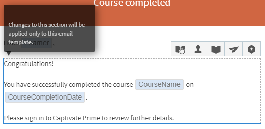

# E-postmallar

Läs den här artikeln om du vill veta hur du konfigurerar e-postmallar för händelser som rör alla utbildningsobjekt.

Learning Manager-programmet skickar e-postmeddelanden till flera roller för användare baserat på händelser.

Du som är författare kan anpassa e-postmallar genom att lägga till eller ändra innehåll och skicka meddelanden till användare för olika händelser som utlöses av elever, chefer och författaraktiviteter. Du kan till exempel skicka ett anpassat e-postmeddelande när en elev registrerar sig för din kurs. Vid registrering får eleven automatiskt det kursspecifika e-postmeddelandet.

Du kan också välja att inte skicka e-postmeddelanden för vissa händelser genom att inaktivera alternativet för e-postmall.

## Konfigurera e-postmeddelanden {#settingemailnotifications}

1. I programmet Författare väljer du utbildningsobjektet som du vill konfigurera e-postmallen för. Till exempel Kurser.

1. På sidan Utbildningsobjekt klickar du på kursen, certifieringen eller utbildningsprogrammet som du vill konfigurera e-postinställningarna för.

1. På sidan med information om utbildningsobjekt väljer du **E-postmallar** > **Alla mallar**. E-postmallar är tillgängliga för **standardinstans** och **aktuell kurs**. Du kan växla mellan dem med hjälp av listrutan i det övre högra hörnet.

   Du kan se listan över mallar som är tillgängliga för det utbildningsobjekt du har valt.

   
   *Lista över mallar*

1. Klicka på händelsens namn när du vill visa mallen i förhandsgranskningsläge.

   

   *Se förhandsgranskning av mall*

   Du kan anpassa varje mall genom att klicka på texten i mallens brödtext. Du kan infoga variabler i texten genom att klicka på motsvarande ikoner som visas på ögonblicksbilden. Håll muspekaren över varje ikon för att visa namnen.

   
   *Infoga en variabel*

   Följande variabler är tillgängliga:

   * LPName
   * Deadline för slutförande av LP
   * Elevnamn
   * LearnerEmail
   * Kursnamn
   * Kursbeskrivning
   * CourseCompletionDeadline
   * CourseSkillDetails
   * CourseBadge

   Du kan återställa meddelandet till standardinnehållet genom att klicka på länken Återgå till ursprungligt foto ovanför mallen.

   Som du ser överst i mallen kan du anpassa mallen för flera roller (chef, elev och så vidare) beroende på typen av e-postavisering.

1. Klicka på Spara längst ned på mallsidan.
1. På sidan E-postmallar klickar du på knappen Ja/Nej för att skicka eller inaktivera meddelandet.

*Aktivera eller inaktivera e-postavisering*

Om cirkeln i aviseringsknappen vid varje händelsenamn finns intill Ja (med blå skugga som bakgrund) aktiveras aviseringen. Om det är i gråton och cirkeln finns bredvid Nej inaktiveras meddelandet.

När du konfigurerar en e-postmall på kursnivån har den företräde framför inställningarna på administratörsnivå för just den kursen.

## Inställningar för e-postmall

Författaren kan ange följande i inställningarna för e-postmallen:

* **E-postbanderoll**: Gör att du kan ändra e-postbanderollen.

* **E-postsignatur**: Gör att du kan lägga till eller redigera e-postsignaturen.
